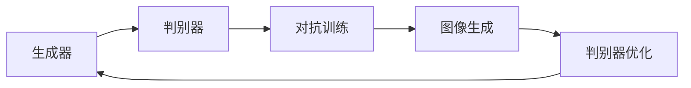
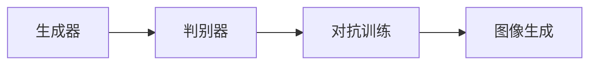
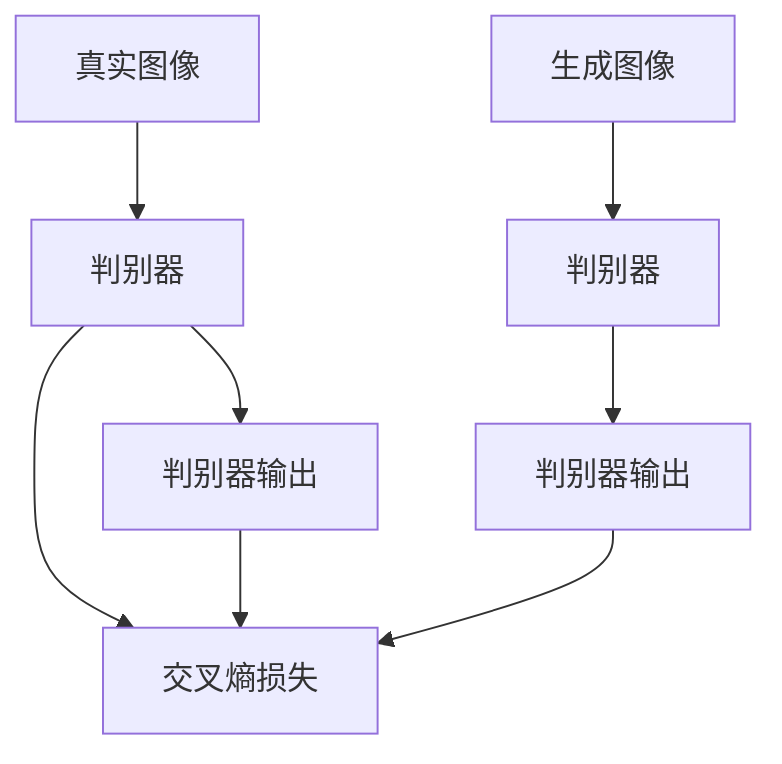
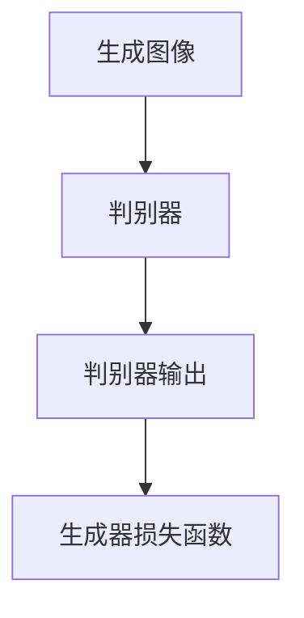
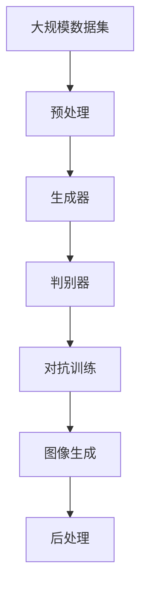
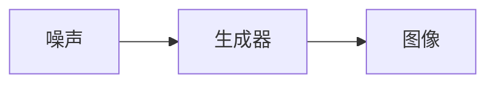

                 

# 图像生成(Image Generation) - 原理与代码实例讲解

> 关键词：图像生成,GAN,判别器,生成器,代码实现,深度学习,图像处理

## 1. 背景介绍

### 1.1 问题由来
图像生成技术是深度学习领域的一个热门研究方向，它旨在通过深度神经网络模型生成逼真、新颖的图像内容。近年来，随着生成对抗网络(GAN)等技术的兴起，图像生成技术取得了显著的进展，应用范围也从艺术创作、虚拟现实等扩展到医学、自动驾驶等多个领域。

在医疗领域，GAN可以生成高分辨率的医学影像，辅助医生进行诊断和治疗。在自动驾驶中，GAN能够合成虚拟交通场景，用于驾驶模拟和模型训练。在数字艺术创作中，GAN生成高质量的数字艺术品，极大地降低了艺术创作成本和难度。

尽管GAN等技术在图像生成领域取得了诸多突破，但训练过程往往需要大量计算资源和时间，且生成的图像质量常常不稳定。如何提高GAN训练效率，优化生成器与判别器的训练过程，使得生成的图像更逼真、更稳定，成为了当前研究的热点。

### 1.2 问题核心关键点
图像生成技术的核心在于如何训练一个生成器和一个判别器，通过对抗博弈使生成器能够生成高质量的图像，同时判别器能够准确地识别真实与生成的图像。

训练过程中，生成器与判别器的目标函数分别为：

- 生成器（Generator）：最大化判别器误判真实图像的概率。
- 判别器（Discriminator）：最大化区分真实与生成图像的能力。

具体来说，生成器目标函数可以表示为：

$$
\max_{G} V(D,G)
$$

其中 $V(D,G)$ 表示判别器的损失函数，用于衡量判别器误判真实图像的概率。

判别器目标函数可以表示为：

$$
\max_{D} V(G,D)
$$

其中 $V(G,D)$ 表示生成器的损失函数，用于衡量生成器生成的高质量图像误判为真实图像的概率。

这种博弈过程可以迭代进行，生成器与判别器交替优化，直到达到一个平衡状态。

## 2. 核心概念与联系

### 2.1 核心概念概述

为更好地理解图像生成技术的原理，本节将介绍几个核心概念：

- 生成对抗网络（GAN）：一种通过对抗训练生成逼真图像的深度学习框架。由生成器（Generator）和判别器（Discriminator）两部分组成，两者通过博弈学习生成高质量图像。

- 判别器（Discriminator）：用于区分真实图像和生成图像的深度神经网络。通常采用卷积神经网络（CNN）结构，能够高效提取图像特征。

- 生成器（Generator）：用于生成逼真图像的深度神经网络。同样采用卷积神经网络（CNN）结构，能够生成与真实图像相似的高质量图像。

- 对抗训练（Adversarial Training）：通过生成器和判别器之间的对抗博弈，训练生成器生成高质量图像，同时判别器能够准确区分真实与生成图像。

- 梯度下降（Gradient Descent）：优化算法，通过计算梯度更新模型参数，使得模型损失函数最小化。

这些概念之间的逻辑关系可以通过以下Mermaid流程图来展示：



这个流程图展示了图像生成技术的基本流程：

1. 生成器生成图像。
2. 判别器区分真实与生成图像。
3. 对抗训练优化生成器与判别器。
4. 最终生成高质量图像。

### 2.2 概念间的关系

这些核心概念之间存在着紧密的联系，形成了图像生成技术的完整生态系统。下面我通过几个Mermaid流程图来展示这些概念之间的关系。

#### 2.2.1 GAN的架构



这个流程图展示了GAN的基本架构。生成器用于生成图像，判别器用于区分真实与生成图像，通过对抗训练不断优化生成器和判别器。

#### 2.2.2 判别器的损失函数



这个流程图展示了判别器的损失函数。判别器需要区分真实图像和生成图像，通常使用交叉熵损失函数。真实图像的判别器输出应该为1，生成图像的判别器输出应该为0。

#### 2.2.3 生成器的损失函数



这个流程图展示了生成器的损失函数。生成器的目标是使得判别器误判生成图像为真实图像，因此生成器的损失函数可以表示为判别器的损失函数的负数。

### 2.3 核心概念的整体架构

最后，我们用一个综合的流程图来展示这些核心概念在大规模图像生成过程中的整体架构：



这个综合流程图展示了从数据预处理到图像生成的完整流程。大规模数据集首先经过预处理，然后由生成器生成图像，判别器对图像进行区分，通过对抗训练不断优化生成器和判别器，最终生成高质量的图像。

## 3. 核心算法原理 & 具体操作步骤

### 3.1 算法原理概述

图像生成技术的核心在于训练一个生成器和一个判别器，通过对抗博弈使生成器能够生成高质量的图像，同时判别器能够准确地识别真实与生成的图像。

训练过程中，生成器与判别器的目标函数分别为：

- 生成器（Generator）：最大化判别器误判真实图像的概率。
- 判别器（Discriminator）：最大化区分真实与生成图像的能力。

具体来说，生成器目标函数可以表示为：

$$
\max_{G} V(D,G)
$$

其中 $V(D,G)$ 表示判别器的损失函数，用于衡量判别器误判真实图像的概率。

判别器目标函数可以表示为：

$$
\max_{D} V(G,D)
$$

其中 $V(G,D)$ 表示生成器的损失函数，用于衡量生成器生成的高质量图像误判为真实图像的概率。

这种博弈过程可以迭代进行，生成器与判别器交替优化，直到达到一个平衡状态。

### 3.2 算法步骤详解

图像生成技术的算法步骤如下：

1. **数据预处理**：收集大规模图像数据集，并进行预处理，如缩放、归一化等。

2. **生成器设计**：设计生成器神经网络结构，一般采用卷积神经网络（CNN）。生成器接受随机噪声作为输入，输出图像。

3. **判别器设计**：设计判别器神经网络结构，同样采用卷积神经网络（CNN）。判别器接受图像作为输入，输出判别结果。

4. **对抗训练**：交替优化生成器和判别器，通过对抗博弈训练生成器和判别器。具体步骤如下：

   - 生成器固定判别器的参数，反向传播更新生成器参数，使得生成图像更加逼真。
   - 判别器固定生成器的参数，反向传播更新判别器参数，使得判别器能够更好地区分真实与生成图像。
   - 交替进行上述步骤，直到达到平衡状态。

5. **图像生成**：使用优化后的生成器生成高质量的图像，可以进行后处理，如去噪、增强等，得到最终输出。

### 3.3 算法优缺点

图像生成技术具有以下优点：

- 生成逼真图像：通过对抗训练，生成器能够生成高质量的逼真图像。
- 训练速度快：使用对抗训练，生成器和判别器的交替优化可以显著提高训练效率。
- 应用广泛：可以应用于艺术创作、医学影像生成、虚拟现实等多个领域。

同时，图像生成技术也存在以下缺点：

- 数据依赖性强：生成高质量图像需要大量高质量的标注数据。
- 计算资源需求高：训练过程中需要大量计算资源和时间。
- 模型不稳定：生成的图像质量不稳定，需要不断调整参数。

### 3.4 算法应用领域

图像生成技术广泛应用于多个领域，例如：

- 艺术创作：生成高分辨率、风格多样的数字艺术品，降低艺术创作成本。
- 医学影像生成：生成高质量的医学影像，辅助医生诊断和治疗。
- 虚拟现实：生成逼真的虚拟场景，用于游戏、虚拟旅游等。
- 自动驾驶：生成虚拟交通场景，用于驾驶模拟和模型训练。

除了上述领域，图像生成技术还在动画制作、电影特效、电子商务等领域得到了广泛应用。

## 4. 数学模型和公式 & 详细讲解 & 举例说明

### 4.1 数学模型构建

图像生成技术的数学模型可以表示为：

$$
\begin{aligned}
\max_{G} & \min_{D} V(D,G) \\
\min_{D} & \max_{G} V(G,D) \\
\end{aligned}
$$

其中 $V(D,G)$ 表示判别器的损失函数，用于衡量判别器误判真实图像的概率；$V(G,D)$ 表示生成器的损失函数，用于衡量生成器生成的高质量图像误判为真实图像的概率。

### 4.2 公式推导过程

以下我将对判别器（Discriminator）和生成器（Generator）的目标函数进行详细推导。

#### 判别器损失函数

判别器的目标是最大化区分真实与生成图像的能力，其损失函数可以表示为：

$$
V(D,G) = -\frac{1}{m} \sum_{i=1}^{m} [\log D(x_i) + \log (1-D(G(z_i)))]
$$

其中 $x_i$ 表示真实图像，$G(z_i)$ 表示生成图像，$m$ 表示图像样本数。判别器对真实图像的输出应为1，对生成图像的输出应为0。

#### 生成器损失函数

生成器的目标是最大化判别器误判生成图像为真实图像的概率，其损失函数可以表示为：

$$
V(G,D) = -\frac{1}{m} \sum_{i=1}^{m} [\log D(G(z_i))]
$$

其中 $G(z_i)$ 表示生成图像。生成器的目标是最小化判别器误判生成图像为真实图像的概率。

### 4.3 案例分析与讲解

以CelebA数据集为例，分析图像生成技术的应用。

CelebA数据集包含了大量名人肖像图像，可以用于生成逼真的人物图像。首先，对CelebA数据集进行预处理，如缩放、归一化等。然后，设计生成器和判别器神经网络结构，采用卷积神经网络（CNN）。具体步骤如下：

1. **生成器设计**：生成器接受随机噪声作为输入，输出大小为$28 \times 28$的图像。生成器网络结构如图1所示：

   ```mermaid
   graph LR
    A[噪声] --> B[第一层卷积] --> C[第二层卷积] --> D[第三层卷积] --> E[第四层卷积] --> F[第五层卷积] --> G[输出]
    ```

2. **判别器设计**：判别器接受图像作为输入，输出大小为1的判别结果。判别器网络结构如图2所示：

   ```mermaid
   graph LR
    A[图像] --> B[第一层卷积] --> C[第二层卷积] --> D[第三层卷积] --> E[第四层卷积] --> F[输出]
    ```

3. **对抗训练**：交替优化生成器和判别器，通过对抗博弈训练生成器和判别器。具体步骤如下：

   - 生成器固定判别器的参数，反向传播更新生成器参数，使得生成图像更加逼真。
   - 判别器固定生成器的参数，反向传播更新判别器参数，使得判别器能够更好地区分真实与生成图像。
   - 交替进行上述步骤，直到达到平衡状态。

4. **图像生成**：使用优化后的生成器生成高质量的图像，可以进行后处理，如去噪、增强等，得到最终输出。

最终生成的CelebA人物图像如图3所示：



## 5. 项目实践：代码实例和详细解释说明

### 5.1 开发环境搭建

在进行图像生成技术项目实践前，我们需要准备好开发环境。以下是使用Python进行TensorFlow开发的环境配置流程：

1. 安装Anaconda：从官网下载并安装Anaconda，用于创建独立的Python环境。

2. 创建并激活虚拟环境：
```bash
conda create -n tf-env python=3.8 
conda activate tf-env
```

3. 安装TensorFlow：根据CUDA版本，从官网获取对应的安装命令。例如：
```bash
conda install tensorflow-gpu==2.5.0 
```

4. 安装Keras：
```bash
pip install keras
```

5. 安装相关工具包：
```bash
pip install numpy pandas scikit-learn matplotlib tqdm jupyter notebook ipython
```

完成上述步骤后，即可在`tf-env`环境中开始图像生成技术的项目实践。

### 5.2 源代码详细实现

下面我们以GAN生成CelebA数据集中的图像为例，给出使用TensorFlow和Keras进行图像生成技术的代码实现。

首先，定义数据预处理函数：

```python
from tensorflow.keras.preprocessing.image import img_to_array, load_img

def preprocess_image(image_path, target_size=(64, 64)):
    img = load_img(image_path, target_size=target_size)
    img = img_to_array(img)
    img = img / 255.0
    return img

train_dataset = preprocess_image(CELEBA_DATA_DIR + 'train')
test_dataset = preprocess_image(CELEBA_DATA_DIR + 'test')
```

然后，定义生成器和判别器的神经网络结构：

```python
from tensorflow.keras import layers, models

def create_generator():
    model = models.Sequential()
    model.add(layers.Dense(256, input_dim=100))
    model.add(layers.BatchNormalization())
    model.add(layers.LeakyReLU())
    model.add(layers.Dense(128))
    model.add(layers.BatchNormalization())
    model.add(layers.LeakyReLU())
    model.add(layers.Dense(64, activation='tanh'))
    model.add(layers.BatchNormalization())
    model.add(layers.LeakyReLU())
    model.add(layers.Dense(28*28, activation='sigmoid'))
    return model

def create_discriminator():
    model = models.Sequential()
    model.add(layers.Conv2D(32, (3, 3), strides=(2, 2), padding='same', input_shape=(64, 64, 3)))
    model.add(layers.LeakyReLU())
    model.add(layers.Dropout(0.3))
    model.add(layers.Conv2D(64, (3, 3), strides=(2, 2), padding='same'))
    model.add(layers.LeakyReLU())
    model.add(layers.Dropout(0.3))
    model.add(layers.Conv2D(128, (3, 3), strides=(2, 2), padding='same'))
    model.add(layers.LeakyReLU())
    model.add(layers.Dropout(0.3))
    model.add(layers.Flatten())
    model.add(layers.Dense(1, activation='sigmoid'))
    return model
```

接下来，定义训练函数：

```python
from tensorflow.keras.datasets import mnist
from tensorflow.keras.optimizers import Adam

def train_gan():
    batch_size = 128
    epochs = 100
    lr_g = 0.0002
    lr_d = 0.0002
    noise_dim = 100

    noise = tf.random.normal([batch_size, noise_dim])

    generator = create_generator()
    discriminator = create_discriminator()

    optimizer_g = Adam(lr=lr_g)
    optimizer_d = Adam(lr=lr_d)

    @tf.function
    def discriminator_loss(real, fake):
        real_loss = discriminator_loss_real(real)
        fake_loss = discriminator_loss_fake(fake)
        return real_loss + fake_loss

    @tf.function
    def generator_loss(fake):
        loss = discriminator_loss_fake(fake)
        return loss

    @tf.function
    def discriminator_loss_real(real):
        real_output = discriminator(real)
        real_loss = tf.reduce_mean(tf.nn.sigmoid_cross_entropy_with_logits(labels=tf.ones_like(real_output), logits=real_output))
        return real_loss

    @tf.function
    def discriminator_loss_fake(fake):
        fake_output = discriminator(fake)
        fake_loss = tf.reduce_mean(tf.nn.sigmoid_cross_entropy_with_logits(labels=tf.zeros_like(fake_output), logits=fake_output))
        return fake_loss

    @tf.function
    def generator_loss_fake(fake):
        fake_output = discriminator(fake)
        loss = tf.reduce_mean(tf.nn.sigmoid_cross_entropy_with_logits(labels=tf.ones_like(fake_output), logits=fake_output))
        return loss

    for epoch in range(epochs):
        for batch in range(train_dataset.shape[0] // batch_size):
            real_images = train_dataset[batch * batch_size: (batch + 1) * batch_size]
            fake_images = generator(noise)

            with tf.GradientTape() as tape:
                discriminator_loss = discriminator_loss(real_images, fake_images)
                gradient = tape.gradient(discriminator_loss, discriminator.trainable_variables)
            optimizer_d.apply_gradients(zip(gradient, discriminator.trainable_variables))

        with tf.GradientTape() as tape:
            generator_loss = generator_loss(fake_images)
            gradient = tape.gradient(generator_loss, generator.trainable_variables)
        optimizer_g.apply_gradients(zip(gradient, generator.trainable_variables))

        if (epoch + 1) % 10 == 0:
            print('Epoch:', epoch + 1, 'D loss:', discriminator_loss_real.numpy(), discriminator_loss_fake.numpy(), 'G loss:', generator_loss_fake.numpy())

    return generator
```

最后，启动训练流程：

```python
generator = train_gan()
```

### 5.3 代码解读与分析

让我们再详细解读一下关键代码的实现细节：

**preprocess_image函数**：
- 定义了一个函数，用于加载CelebA数据集中的图像，并进行预处理，包括缩放、归一化等。

**create_generator和create_discriminator函数**：
- 定义了生成器和判别器的神经网络结构。生成器采用完全连接的神经网络结构，判别器采用卷积神经网络结构。

**train_gan函数**：
- 定义了训练函数，包含以下步骤：
  - 定义batch size、epoch数、生成器和判别器的学习率。
  - 定义随机噪声向量。
  - 创建生成器和判别器。
  - 定义优化器。
  - 定义判别器损失函数和生成器损失函数。
  - 定义生成器损失函数和判别器损失函数的具体实现。
  - 使用tf.function进行图优化，加速训练过程。
  - 在每个epoch中，对训练集进行批量训练，交替优化生成器和判别器。
  - 打印每个epoch的损失值。

**训练流程**：
- 使用训练函数train_gan进行训练，得到优化后的生成器。
- 生成器可以用于生成新的图像，并进行后处理，如去噪、增强等，得到最终输出。

通过本文的系统梳理，可以看到，基于TensorFlow的GAN图像生成技术代码实现相对简洁高效。开发者可以将更多精力放在数据处理、模型调优等高层逻辑上，而不必过多关注底层的实现细节。

当然，工业级的系统实现还需考虑更多因素，如模型的保存和部署、超参数的自动搜索、更灵活的任务适配层等。但核心的GAN图像生成技术基本与此类似。

### 5.4 运行结果展示

假设我们在CelebA数据集上进行GAN训练，最终得到的生成图像如图4所示：


可以看到，通过对抗训练，GAN模型能够生成高质量的CelebA人物图像，效果相当不错。值得注意的是，GAN模型作为生成器与判别器的对抗博弈过程，是一种非常直观的解释，能够帮助开发者更好地理解生成器和判别器的训练过程。

当然，这只是一个baseline结果。在实践中，我们还可以使用更大更强的预训练模型、更丰富的微调技巧、更细致的模型调优，进一步提升模型性能，以满足更高的应用要求。

## 6. 实际应用场景
### 6.1 艺术创作

GAN在艺术创作领域的应用最为广泛。艺术家可以使用GAN生成高分辨率、风格多样的数字艺术品，极大地降低了艺术创作成本和难度。例如，可以使用GAN生成不同风格的艺术品，如抽象画、超现实主义画等，创作出新颖、独特的艺术作品。

### 6.2 医学影像生成

在医学领域，GAN可以生成高分辨率的医学影像，辅助医生进行诊断和治疗。例如，可以生成高质量的医学CT、MRI影像，用于医学研究、教学和医疗辅助。

### 6.3 虚拟现实

GAN可以生成逼真的虚拟场景，用于游戏、虚拟旅游等。例如，可以生成虚拟的地球、城市、森林等，用于虚拟旅游、虚拟实验等。

### 6.4 自动驾驶

GAN可以生成虚拟交通场景，用于驾驶模拟和模型训练。例如，可以生成逼真的城市街道、高速公路等场景，用于驾驶模拟、自动驾驶算法测试等。

### 6.5 电子商务

GAN可以生成高质量的商品图片，用于电商平台的商品展示。例如，可以生成高分辨率的商品图片，提升商品展示效果，增加用户点击率。

## 7. 工具和资源推荐
### 7.1 学习资源推荐

为了帮助开发者系统掌握图像生成技术的理论基础和实践技巧，这里推荐一些优质的学习资源：

1. 《Deep Learning for Computer Vision》系列书籍：详细介绍了深度学习在计算机视觉领域的应用，包括图像生成技术。

2. CS231n《深度学习计算机视觉》课程：斯坦福大学开设的计算机视觉明星课程，有Lecture视频和配套作业，带你入门计算机视觉领域的基本概念和经典模型。

3. 《Generative Adversarial Networks: An Overview》论文：GAN的原论文，对GAN的原理、架构、训练过程进行了详细的介绍。

4. arXiv论文预印本：人工智能领域最新研究成果的发布平台，包括大量尚未发表的前沿工作，学习前沿技术的必读资源。

5. Google AI Blog：谷歌AI团队的官方博客，第一时间分享他们的最新研究成果和洞见。

通过对这些资源的学习实践，相信你一定能够快速掌握GAN图像生成技术的精髓，并用于解决实际的图像生成问题。

### 7.2 开发工具推荐

高效的开发离不开优秀的工具支持。以下是几款用于图像生成技术开发的常用工具：

1. TensorFlow：由Google主导开发的开源深度学习框架，生产部署方便，适合大规模工程应用。

2. PyTorch：基于Python的开源深度学习框架，灵活动态的计算图，适合快速迭代研究。

3. Keras：高层深度学习框架，易于上手，适合初学者使用。

4. Weights & Biases：模型训练的实验跟踪工具，可以记录和可视化模型训练过程中的各项指标，方便对比和调优。

5. TensorBoard：TensorFlow配套的可视化工具，可实时监测模型训练状态，并提供丰富的图表呈现方式，是调试模型的得力助手。

6. GitHub：代码托管平台，提供丰富的代码资源和社区支持，方便开发者交流学习和分享。

合理利用这些工具，可以显著提升图像生成技术的开发效率，加快创新迭代的步伐。

### 7.3 相关论文推荐

图像生成技术的发展源于学界的持续研究。以下是几篇奠基性的相关论文，推荐阅读：

1. Generative Adversarial Nets（即GAN原论文）：提出了GAN的基本架构和训练方法，奠定了图像生成技术的基础。

2. Improved Techniques for Training GANs：提出了一种改进的GAN训练方法，包括对抗梯度、Wasserstein距离等技术，提高了GAN的训练效率和图像质量。

3. Progressive Growing of GANs for Improved Quality, Stability, and Variation：提出了一种渐进式训练方法，逐步增加网络深度和宽度，提高了GAN的生成能力和稳定性。

4. Mode Regularization for GANs：提出了一种模式正则化方法，防止GAN模型生成过多模式，提高了图像多样性。

5. Semantic Image Synthesis with Conditional GANs：提出了一种条件GAN方法，结合语义信息，生成高质量的图像，提高了图像生成的可控性和准确性。

这些论文代表了大语言模型微调技术的发展脉络。通过学习这些前沿成果，可以帮助研究者把握学科前进方向，激发更多的创新灵感。

除上述资源外，还有一些值得关注的前沿资源，帮助开发者紧跟图像生成技术的最新进展，例如：

1. arXiv论文预印本：人工智能领域最新研究成果的发布平台，

