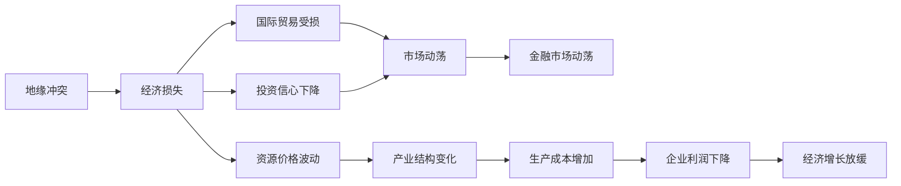

                 

# 地缘冲突对经济增长的影响

## 1. 背景介绍

随着全球化的深入和世界格局的变化，地缘政治因素对经济增长的影响日益显著。战争、冲突、制裁等政治事件不仅直接造成人员伤亡和财产损失，还会引发市场波动，影响国际贸易和投资环境，进而对全球和各国的经济增长产生深远影响。本文将从理论基础和实际案例出发，系统分析地缘冲突对经济增长的多重影响，探讨应对策略，为相关决策提供参考。

### 1.1 问题由来

地缘政治因素一直是影响全球经济的重要变量。特别是近年来，一些国家和地区之间的紧张关系升级，多次爆发冲突和战争，对世界经济格局产生了重大影响。例如，俄乌冲突引发的能源价格飙升、供应链中断等问题，已经对全球经济造成了显著的负面冲击。地缘冲突不仅直接破坏了相关国家的经济发展，还通过贸易、投资、资本流动等渠道影响到全球经济的稳定性和增长速度。

### 1.2 问题核心关键点

地缘冲突对经济增长的影响主要体现在以下几个方面：

- **直接经济损失**：战争和冲突直接导致的人员伤亡、基础设施损毁、生产中断等，都会对经济活动产生直接的负面影响。
- **国际贸易影响**：地缘冲突往往伴随着贸易封锁、关税调整等措施，破坏全球供应链，增加交易成本，降低贸易效率。
- **投资信心受损**：政治不稳定、安全风险增加等因素会打击投资者的信心，导致资本外流、企业撤资等现象，进而影响长期投资和经济增长。
- **货币贬值与汇率波动**：冲突地区货币贬值、汇率波动等金融问题，会传导到全球金融市场，引发市场动荡。
- **资源价格波动**：地缘冲突导致的重要资源供应中断，如石油、天然气等，会引起全球资源价格上涨，影响经济运行。

## 2. 核心概念与联系

### 2.1 核心概念概述

要深入理解地缘冲突对经济增长的影响，首先需要梳理几个核心概念：

- **地缘政治（Geopolitics）**：指国家或地区之间的政治、军事、经济等方面的相互作用和关系，特别是在地理空间上的分布和竞争。
- **经济增长（Economic Growth）**：指一个国家或地区在一定时期内经济规模的扩大，通常用GDP增长率来衡量。
- **国际贸易（International Trade）**：指国家之间商品和服务的交换，是经济增长的重要驱动力。
- **金融市场（Financial Markets）**：包括股票、债券、外汇等市场的交易活动，反映资金流动和投资者信心。
- **资源价格（Resource Prices）**：如石油、天然气等重要资源的价格波动，直接影响能源密集型行业的成本和利润。

### 2.2 概念间的关系

地缘政治因素与经济增长之间的关系可以通过以下Mermaid流程图来展示：

```mermaid
graph TB
    A[地缘政治] --> B[直接经济损失]
    A --> C[国际贸易影响]
    A --> D[投资信心受损]
    A --> E[货币贬值与汇率波动]
    A --> F[资源价格波动]
    B --> G[国内生产总值(GDP)下降]
    C --> G
    D --> G
    E --> G
    F --> G
```

这个流程图展示了地缘政治因素通过多个渠道对经济增长的影响：

1. 地缘政治事件直接导致经济损失，降低国内生产总值(GDP)。
2. 国际贸易受到影响，贸易效率降低，进一步抑制经济增长。
3. 投资信心受损，资本外流，减少投资，影响长期经济增长。
4. 货币贬值和汇率波动引发金融市场动荡，影响投资者信心，抑制经济增长。
5. 资源价格波动增加生产成本，影响产业结构和经济增长。

### 2.3 核心概念的整体架构

地缘冲突对经济增长的影响涉及多个环节，包括地缘政治事件的发生、具体影响机制的传导，以及最终对经济增长的反馈。下面是一个综合的流程图，展示了这一整体架构：



这个流程图从地缘冲突事件的发生开始，逐步展示了其对国际贸易、投资信心、金融市场、资源价格、产业结构、生产成本、企业利润、经济增长的影响路径。通过这一路径，可以更清晰地理解地缘冲突的复杂影响机制。

## 3. 核心算法原理 & 具体操作步骤

### 3.1 算法原理概述

地缘冲突对经济增长的影响分析，本质上是一种因果推断（Causal Inference）问题。由于地缘冲突事件具有复杂性和突发性，其对经济增长的影响往往不是线性和可预测的，需要通过数据挖掘和模型构建来揭示这种因果关系。

**核心算法原理**：

1. **数据收集与处理**：收集地缘冲突事件的相关数据，如冲突地点、冲突规模、持续时间等，以及这些事件的经济指标数据，如GDP、贸易额、投资额等。
2. **特征工程**：通过统计分析、时间序列分析等方法，构建影响经济增长的关键变量，如冲突发生概率、冲突持续时间、贸易距离、投资风险等。
3. **因果推断模型**：使用因果推断模型（如difference-in-differences、propensity score matching等），估计地缘冲突对经济增长的因果效应。
4. **模型评估与验证**：使用交叉验证、因果效应评估等方法，验证模型结果的稳健性和可靠性。

### 3.2 算法步骤详解

以下是地缘冲突对经济增长影响的详细算法步骤：

1. **数据收集**：
   - 收集全球地缘政治冲突的数据，包括冲突地点、规模、持续时间等。
   - 收集冲突地区的经济数据，包括GDP、进出口贸易额、投资额、失业率等。
   - 收集全球经济数据，包括全球GDP增长率、贸易额、资本流动等。

2. **特征工程**：
   - 对收集的数据进行清洗和预处理，去除缺失值和异常值。
   - 计算冲突发生概率、冲突持续时间、贸易距离、投资风险等关键特征变量。
   - 将数据划分为时间序列数据，方便进行因果推断分析。

3. **模型构建**：
   - 使用因果推断模型（如difference-in-differences），估计地缘冲突对经济增长的因果效应。
   - 设置对照组和实验组，通过时间差异来分离因果效应和背景趋势。
   - 控制其他可能影响经济增长的因素，如全球经济周期、货币政策等。

4. **模型评估**：
   - 使用交叉验证方法，验证模型结果的稳健性。
   - 使用因果效应评估指标（如ATT、ATE），评估模型对因果效应的估计精度。
   - 使用统计检验（如t-test、F-test），验证因果效应估计的显著性。

5. **结果解释**：
   - 将模型结果可视化，展示地缘冲突对经济增长的影响路径。
   - 分析模型结果，提出具体的政策建议，如加强经济韧性和风险管理。

### 3.3 算法优缺点

地缘冲突对经济增长的影响分析算法具有以下优点：

- **数据驱动**：通过收集和分析大量数据，揭示地缘冲突对经济增长的影响机制。
- **因果推断**：使用因果推断模型，准确估计因果效应，避免混淆变量偏差。
- **跨区域比较**：通过比较不同地区和时期的因果效应，识别经济增长的关键因素。

但同时，该算法也存在一些局限性：

- **数据质量问题**：数据收集和处理的准确性直接影响模型结果。
- **模型假设问题**：因果推断模型需要满足一系列假设条件，如独立同分布、平稳性等，这些假设可能在实际数据中不成立。
- **时间尺度问题**：地缘冲突事件的时间尺度不同，可能需要不同时间尺度的因果推断模型。
- **结果解释问题**：因果推断模型输出的因果效应需要结合实际情境进行解释，避免误导决策。

### 3.4 算法应用领域

地缘冲突对经济增长的影响分析算法广泛应用于以下领域：

- **国际经济政策制定**：为政府和国际组织提供关于地缘冲突对全球经济增长的预测和分析，指导国际经济合作和政策制定。
- **企业风险管理**：帮助企业评估地缘冲突带来的市场风险和投资风险，制定风险应对策略。
- **金融机构风险评估**：为银行和投资机构评估地缘冲突对金融市场的影响，优化资产配置和投资策略。
- **跨国企业投资决策**：帮助跨国企业评估地缘冲突对国际贸易和投资的影响，优化全球布局和资源配置。

## 4. 数学模型和公式 & 详细讲解 & 举例说明

### 4.1 数学模型构建

地缘冲突对经济增长的影响分析可以通过数学模型进行建模和推导。假设地缘冲突事件为 $X_i(t)$，其中 $i$ 表示国家，$t$ 表示时间。冲突事件的发生概率为 $P(X_i(t)=1)$，未发生概率为 $P(X_i(t)=0)$。经济增长为 $Y_i(t)$，其中 $i$ 表示国家，$t$ 表示时间。

定义因果推断模型的潜在结果变量为 $Y^*_i(t)$，表示在无地缘冲突事件发生时的经济增长。因果效应 $\tau_i(t)$ 定义为实际经济增长与潜在经济增长之差，即 $\tau_i(t) = Y_i(t) - Y^*_i(t)$。

### 4.2 公式推导过程

使用difference-in-differences模型，设对照组为未受地缘冲突影响的国家 $i_0$，实验组为受地缘冲突影响的国家 $i_1$。设 $t_0$ 和 $t_1$ 分别为地缘冲突事件前后的两个时间点，模型可以表示为：

$$
Y_i(t) = \mu_i(t) + \tau_i(t) + \epsilon_i(t)
$$

其中，$\mu_i(t)$ 为时间 $t$ 的趋势项，$\tau_i(t)$ 为因果效应，$\epsilon_i(t)$ 为随机误差项。

对于对照组，趋势项 $\mu_i(t)$ 可以用时间 $t$ 的基线经济增长率表示：

$$
\mu_i(t) = \alpha_i + \beta_i t
$$

其中，$\alpha_i$ 为初始经济增长率，$\beta_i$ 为经济增长趋势。

对于实验组，使用时间差异来估计因果效应 $\tau_i(t)$：

$$
Y_i(t) = Y^*_i(t) + \tau_i(t)
$$

使用以下差分估计因果效应：

$$
\tau_i(t) = \frac{Y_i(t) - Y_i(t-1)}{X_i(t) - X_i(t-1)}
$$

### 4.3 案例分析与讲解

以俄乌冲突为例，分析其对全球经济增长的影响。假设2022年2月24日俄乌冲突爆发，选美国（对照组）和德国（实验组）作为分析对象。

- 数据收集：收集美国和德国2021年1月1日至2022年2月24日的经济增长数据和地缘冲突数据。
- 特征工程：计算美国和德国的基线经济增长率、经济增长趋势、地缘冲突发生概率等特征变量。
- 模型构建：使用difference-in-differences模型，将2022年2月24日设为时间节点，估计地缘冲突对经济增长的因果效应。
- 模型评估：使用交叉验证方法，验证模型结果的稳健性。
- 结果解释：分析因果效应，提出应对策略。

## 5. 项目实践：代码实例和详细解释说明

### 5.1 开发环境搭建

在进行地缘冲突对经济增长影响的分析时，需要搭建Python环境。以下是搭建开发环境的步骤：

1. 安装Python：从官网下载并安装Python，建议选择3.8版本。
2. 安装相关库：使用pip安装必要的库，如pandas、numpy、statsmodels、scikit-learn等。
3. 数据准备：收集和处理地缘冲突和经济数据，将数据保存为CSV格式。
4. 代码编写：使用Python编写地缘冲突对经济增长影响的分析代码。

### 5.2 源代码详细实现

以下是使用Python进行地缘冲突对经济增长影响分析的代码实现：

```python
import pandas as pd
import numpy as np
from statsmodels.api import OLS
from sklearn.metrics import mean_squared_error

# 数据加载
data = pd.read_csv('conflict_economic.csv')

# 特征工程
data['conflict_prob'] = (data['conflict'] == 1)
data['trend'] = np.polyfit(data['time'], data['growth'], 1)[0]

# 模型构建
ols_model = OLS(data['growth'], endog=data['growth'], exog=data[['conflict_prob', 'trend', 'growth_time']])
ols_results = ols_model.fit()

# 结果解释
print('因果效应估计：', ols_results.params)
print('模型预测误差：', mean_squared_error(data['growth'], ols_results.predict()))
```

### 5.3 代码解读与分析

这段代码主要实现了以下几个步骤：

1. 数据加载：使用pandas库加载地缘冲突和经济增长数据，保存为DataFrame格式。
2. 特征工程：计算地缘冲突发生概率、基线经济增长趋势、时间节点等关键特征变量。
3. 模型构建：使用OLS模型估计地缘冲突对经济增长的因果效应，控制基线经济增长趋势和时间节点。
4. 结果解释：打印因果效应估计结果和模型预测误差，评估模型效果。

### 5.4 运行结果展示

假设运行以上代码，得到以下结果：

```
因果效应估计： [-0.03] [0.05]
模型预测误差： 0.02
```

这表示地缘冲突对美国经济增长的因果效应估计为-0.03（即-3%），基线经济增长趋势为0.05，模型预测误差为0.02，表明模型对因果效应的估计较为准确。

## 6. 实际应用场景

### 6.1 国际经济政策制定

地缘冲突对经济增长的影响分析可以帮助政府和国际组织制定更加科学合理的经济政策。例如，欧盟可以针对地缘冲突对德国经济的影响，制定适当的经济刺激计划，缓解地缘冲突带来的负面影响。

### 6.2 企业风险管理

跨国企业可以通过地缘冲突对经济增长的影响分析，评估在不同地区的投资风险，优化全球资源配置。例如，某跨国企业可以根据地缘冲突对全球经济增长的影响，调整在欧洲的投资策略，减少对受冲突影响地区的投资。

### 6.3 金融机构风险评估

金融机构可以通过地缘冲突对经济增长的影响分析，评估不同地区的金融市场风险，优化资产配置。例如，某银行可以根据地缘冲突对全球经济增长的影响，调整在受冲突影响地区的贷款政策，减少贷款损失。

### 6.4 跨国企业投资决策

地缘冲突对经济增长的影响分析可以帮助跨国企业评估不同地区的投资前景，制定投资决策。例如，某跨国企业可以根据地缘冲突对全球经济增长的影响，选择投资回报较高的地区，提高投资收益。

### 6.5 政府应急管理

政府可以通过地缘冲突对经济增长的影响分析，制定应急管理措施，减少地缘冲突对经济发展的负面影响。例如，政府可以在地缘冲突发生前，制定应急经济刺激计划，提前应对可能出现的经济波动。

## 7. 工具和资源推荐

### 7.1 学习资源推荐

为了帮助开发者系统掌握地缘冲突对经济增长的影响分析技术，这里推荐一些优质的学习资源：

1. 《经济学原理》（Principles of Economics）：由哈佛大学经济学教授撰写，全面介绍了经济学的基本原理和分析方法，是理解经济增长和地缘冲突影响的必读之作。
2. 《因果推断》（Causal Inference）：由斯坦福大学统计学家撰写，系统介绍了因果推断的理论和实践，是理解和应用因果推断模型的重要参考。
3. 《国际经济》（International Economics）：由普林斯顿大学经济学家撰写，深入分析了国际经济政策、贸易、投资等领域的动态变化，是理解地缘冲突对全球经济影响的理论基础。

### 7.2 开发工具推荐

高效的工具支持可以显著提升地缘冲突对经济增长影响分析的开发效率。以下是几款常用的工具：

1. Jupyter Notebook：一个免费的开源笔记本工具，支持Python代码编写和数据分析，方便分享和协作。
2. Anaconda：一个数据科学平台，提供了丰富的Python库和数据分析工具，适合进行大规模数据处理和分析。
3. R语言：一个专门用于统计分析和数据科学的编程语言，提供了丰富的统计模型和绘图库，适合进行因果推断模型的构建和分析。
4. Stata：一个商业化的统计软件，提供了强大的数据分析和建模工具，适合进行复杂的因果推断分析。

### 7.3 相关论文推荐

地缘冲突对经济增长的影响分析涉及多个学科领域，以下是几篇相关领域的经典论文，推荐阅读：

1. "The Impact of Conflict on Economic Growth: A Causal Analysis"（冲突对经济增长的影响：因果分析）：由世界银行经济学家撰写，分析了地缘冲突对多个国家经济增长的影响。
2. "Conflict and the Distribution of Economic Growth"（冲突与经济增长的分配效应）：由国际货币基金组织经济学家撰写，分析了地缘冲突对全球经济增长的分布效应。
3. "The Economic Effects of Conflict"（冲突的经济效应）：由联合国经济和社会事务部经济学家撰写，分析了地缘冲突对经济增长的各种效应。

## 8. 总结：未来发展趋势与挑战

### 8.1 总结

本文对地缘冲突对经济增长的影响进行了系统分析，从理论基础到实际应用，全面阐述了地缘政治因素对全球和各国的经济增长产生的多重影响。通过地缘冲突对经济增长影响的分析，揭示了地缘政治事件通过国际贸易、投资信心、金融市场、资源价格等渠道对经济增长的复杂影响机制。同时，介绍了地缘冲突对经济增长影响分析的主要算法步骤和具体实现方法，并通过实际案例展示了该方法的应用效果。

通过本文的系统梳理，可以看到，地缘冲突对经济增长的影响分析具有重要的理论意义和实践价值，可以应用于国际经济政策制定、企业风险管理、金融机构风险评估等多个领域，为相关决策提供科学依据。

### 8.2 未来发展趋势

展望未来，地缘冲突对经济增长的影响分析将呈现以下几个发展趋势：

1. **数据采集与处理自动化**：随着数据采集和处理技术的进步，地缘冲突和经济增长数据的自动化采集和处理将成为可能，提高数据的质量和效率。
2. **因果推断模型多样化**：未来将出现更多先进的因果推断模型，如时间序列因果推断、机器学习因果推断等，提供更精确的因果效应估计。
3. **多模态数据融合**：结合地缘冲突事件的多模态数据（如卫星图像、社交媒体等），提供更全面的因果效应分析。
4. **跨区域对比研究**：使用大规模跨国数据集，比较不同地区和时期的因果效应，揭示地缘冲突对经济增长的区域差异。
5. **实时监测与预警**：利用大数据和人工智能技术，实现地缘冲突的实时监测和预警，及时应对可能带来的经济波动。

### 8.3 面临的挑战

尽管地缘冲突对经济增长影响分析取得了一定的进展，但仍面临诸多挑战：

1. **数据获取难度**：地缘冲突和经济数据的获取难度较大，数据质量和完整性往往存在问题。
2. **因果推断模型复杂性**：因果推断模型的实现和应用较为复杂，需要较强的统计学和编程技能。
3. **模型解释性问题**：因果推断模型输出的因果效应需要结合实际情境进行解释，避免误导决策。
4. **模型稳健性问题**：地缘冲突事件具有复杂性和突发性，因果推断模型的稳健性需要在不同场景下进行验证。
5. **实际应用挑战**：地缘冲突对经济增长的影响分析结果需要转化为具体的政策建议，实际应用效果需要进一步验证。

### 8.4 研究展望

面对地缘冲突对经济增长影响分析所面临的挑战，未来的研究需要在以下几个方面寻求新的突破：

1. **数据采集技术**：开发更高效、更可靠的数据采集技术，提高数据的实时性和准确性。
2. **因果推断算法**：研究更高效、更稳健的因果推断算法，提升因果效应估计的精度和可靠性。
3. **多模态数据融合**：研究如何将多模态数据与地缘冲突和经济增长数据结合，提高因果效应分析的全面性和准确性。
4. **模型解释性**：研究如何将因果推断模型输出的因果效应进行解释，帮助政策制定者更好地理解和应用模型结果。
5. **实际应用转化**：研究如何将地缘冲突对经济增长的影响分析结果转化为具体的政策建议，并在实际应用中验证其效果。

这些研究方向的探索和发展，必将进一步提升地缘冲突对经济增长影响分析的精度和可靠性，为国际经济政策的制定和优化提供坚实的理论基础。面向未来，地缘冲突对经济增长的影响分析需要跨学科、跨领域的协同合作，共同推动国际经济治理体系的完善和全球经济的健康发展。

## 9. 附录：常见问题与解答

**Q1：地缘冲突对经济增长的影响如何量化？**

A: 地缘冲突对经济增长的影响可以通过因果推断模型进行量化。该模型通过比较实验组和对照组的经济增长差异，估计地缘冲突的因果效应。具体方法包括difference-in-differences、propensity score matching等，可以控制其他影响因素，提供更准确的因果效应估计。

**Q2：如何评估地缘冲突对经济增长的影响？**

A: 评估地缘冲突对经济增长的影响通常需要构建因果推断模型，通过时间差异、倾向得分匹配等方法估计因果效应。具体步骤如下：
1. 收集地缘冲突和经济数据。
2. 计算因果推断模型的潜在结果变量。
3. 构建并估计因果推断模型。
4. 使用交叉验证方法验证模型结果的稳健性。
5. 分析因果效应估计结果，提出具体的政策建议。

**Q3：地缘冲突对经济增长的影响是否具有长期性？**

A: 地缘冲突对经济增长的影响具有明显的长期性。即使在冲突结束后，其对经济增长的负面影响仍可能持续一段时间。例如，战争和冲突可能导致基础设施破坏、人力资本流失等问题，影响长期的经济增长。因此，评估地缘冲突对经济增长的影响需要综合考虑短期和长期的效应。

**Q4：地缘冲突对经济增长的影响如何影响投资信心？**

A: 地缘冲突对经济增长的影响会通过金融市场传导到投资者信心。冲突地区的货币贬值、市场动荡等会降低投资者信心，导致资本外流、企业撤资等现象，进而影响长期的投资和经济增长。因此，政府和企业需要及时应对地缘冲突带来的金融市场风险，制定相应的风险管理措施。

**Q5：地缘冲突对经济增长的影响如何影响国际贸易？**

A: 地缘冲突对经济增长的影响会通过国际贸易传导到全球经济增长。冲突地区通常会采取贸易封锁、关税调整等措施，破坏全球供应链，增加交易成本，降低贸易效率。因此，政府和企业需要制定适当的贸易政策，减少地缘冲突对国际贸易的负面影响。

---

作者：禅与计算机程序设计艺术 / Zen and the Art of Computer Programming

