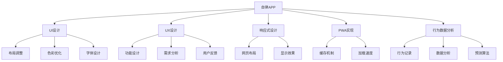

                 

# 基于H5前端开发对自律APP设计与实现

## 1. 背景介绍

### 1.1 问题由来
随着现代生活节奏的加快和工作压力的增加，越来越多的人感到需要提高自己的自律能力。自律APP作为一种辅助工具，通过各种方法帮助用户养成良好的习惯和行为，近年来受到了广泛的关注。然而，现有的自律APP普遍存在功能单一、用户体验不佳等问题，无法满足用户的个性化需求。

### 1.2 问题核心关键点
自律APP的核心目标是帮助用户养成良好的习惯和行为，其成功与否很大程度上取决于用户体验。因此，如何设计一个功能全面、界面美观、易用的自律APP，是一个重要的研究课题。

### 1.3 问题研究意义
研究自律APP的设计和实现，对于提升用户的自律能力、改善生活质量、推动心理健康等领域具有重要意义。通过改进自律APP的功能和用户体验，可以帮助用户更好地管理时间和精力，提高工作效率和生活质量。

## 2. 核心概念与联系

### 2.1 核心概念概述

为更好地理解自律APP的设计和实现，本节将介绍几个密切相关的核心概念：

- 自律APP：一种旨在帮助用户养成良好的习惯和行为的移动应用程序。
- 用户界面(UI)设计：通过合理的布局、色彩、字体等设计，提升用户的使用体验。
- 用户体验(UX)设计：从用户的角度出发，设计符合用户需求和心理预期的应用功能。
- 响应式设计：根据不同设备的屏幕尺寸和分辨率，自动调整网页布局和显示效果。
- 渐进式Web应用(PWA)：在Web技术基础上，通过优化加载速度、离线缓存等技术，实现接近原生应用的性能和体验。
- 行为数据收集与分析：通过记录用户的行为数据，进行数据分析和行为预测，为用户提供个性化的推荐和提示。

这些核心概念之间存在着紧密的联系，共同构成了自律APP的设计和实现框架。

### 2.2 概念间的关系

这些核心概念之间的逻辑关系可以通过以下Mermaid流程图来展示：



这个流程图展示了自律APP的核心概念及其之间的关系：

1. 自律APP的设计和实现涉及UI、UX、响应式设计等多个方面。
2. PWA技术能够提供接近原生应用的性能和体验，有助于提升用户体验。
3. 行为数据分析可以帮助了解用户行为，提升个性化推荐和提示的效果。
4. 各核心概念相互配合，共同作用，才能设计出优秀的自律APP。

## 3. 核心算法原理 & 具体操作步骤
### 3.1 算法原理概述

自律APP的核心算法原理包括行为数据分析、个性化推荐和行为提示等。这些算法主要基于机器学习和数据分析技术，通过记录和分析用户的行为数据，为用户提供个性化的推荐和提示，帮助用户养成良好的习惯和行为。

具体而言，自律APP的算法流程如下：

1. 数据收集：通过用户的日常行为记录，收集相关的数据，如用户的起床时间、学习时间、运动时间等。
2. 数据分析：对收集到的行为数据进行分析和建模，使用机器学习算法预测用户的未来行为。
3. 行为预测：根据预测结果，为不同用户设计个性化的行为推荐和提示。
4. 行为反馈：通过用户的反馈数据，不断优化算法模型，提升推荐和提示的准确性和效果。

### 3.2 算法步骤详解

自律APP的算法步骤如下：

**Step 1: 数据收集**
- 开发前端页面，收集用户的行为数据，包括但不限于起床时间、学习时间、运动时间等。
- 使用API接口将数据传输到后端服务器，进行数据存储和初步处理。

**Step 2: 数据分析**
- 对收集到的行为数据进行预处理，去除噪声和异常值，保证数据的准确性。
- 使用机器学习算法（如线性回归、决策树、随机森林等）对数据进行建模，预测用户的未来行为。
- 对预测结果进行评估和优化，提升模型的准确性和泛化能力。

**Step 3: 行为预测**
- 根据预测结果，生成个性化的行为推荐和提示，如“明天应该早起”、“今天应该多运动”等。
- 将推荐和提示信息通过前端页面展示给用户。

**Step 4: 行为反馈**
- 收集用户对推荐和提示的反馈数据，包括满意度、反馈意见等。
- 对反馈数据进行分析，更新算法模型，进一步提升推荐和提示的效果。

### 3.3 算法优缺点

自律APP的算法具有以下优点：

1. 个性化推荐：根据用户的个性化行为数据，提供个性化的推荐和提示，提升用户的使用体验。
2. 行为预测：通过预测用户的未来行为，提前提醒用户，帮助用户养成良好的习惯和行为。
3. 实时反馈：通过实时收集用户反馈，不断优化算法模型，提升推荐和提示的准确性和效果。

同时，该算法也存在以下缺点：

1. 数据隐私问题：用户行为数据涉及隐私，需要保证数据的安全和匿名处理。
2. 数据质量问题：数据质量差可能导致模型预测不准确，影响推荐和提示的效果。
3. 算法复杂性：机器学习算法模型需要复杂的计算和数据处理，需要较强的技术能力。

### 3.4 算法应用领域

自律APP的算法主要应用于以下领域：

- 健康管理：记录用户的饮食、运动、睡眠等行为数据，提供个性化的健康管理建议。
- 学习辅助：记录用户的学习行为数据，提供个性化的学习计划和推荐。
- 时间管理：记录用户的时间使用数据，提供时间管理的优化建议。
- 情绪监测：记录用户的情绪变化数据，提供情绪管理的建议和心理辅导。

## 4. 数学模型和公式 & 详细讲解  
### 4.1 数学模型构建

自律APP的数学模型主要包括以下几个部分：

- 时间序列模型：用于预测用户的行为趋势，如学习时间、运动时间等。
- 分类模型：用于预测用户的特定行为，如是否学习、是否运动等。
- 回归模型：用于预测用户的行为结果，如学习时间、运动距离等。

### 4.2 公式推导过程

以时间序列模型为例，推导相关的数学公式。

假设用户的行为数据 $y_t$ 由两个因素 $x_t$ 和 $z_t$ 决定：

$$
y_t = f(x_t, z_t) + \epsilon_t
$$

其中，$f$ 为时间序列模型，$\epsilon_t$ 为随机误差。时间序列模型可以使用ARIMA模型，即：

$$
y_t = \phi(L)y_{t-1} + \theta(L)x_t + \delta(L)z_t + \epsilon_t
$$

其中，$\phi(L)$、$\theta(L)$、$\delta(L)$ 为滞后算子，$L$ 表示滞后一步。模型的参数需要通过训练数据进行拟合。

### 4.3 案例分析与讲解

以用户学习行为预测为例，进行数学模型的应用。

假设用户每天的学习时间 $y_t$ 由当前天气 $x_t$ 和学习动机 $z_t$ 决定，其中：

- $x_t$ 为二进制变量，表示天气是否晴朗。
- $z_t$ 为连续变量，表示用户的学习动机。

我们可以使用线性回归模型进行预测，即：

$$
y_t = \alpha_0 + \alpha_1 x_t + \alpha_2 z_t + \epsilon_t
$$

其中，$\alpha_0$、$\alpha_1$、$\alpha_2$ 为模型的参数。通过训练数据，可以求解出最优的参数值，从而进行行为预测。

## 5. 项目实践：代码实例和详细解释说明
### 5.1 开发环境搭建

在进行自律APP的开发前，我们需要准备好开发环境。以下是使用React和Node.js进行开发的开发环境配置流程：

1. 安装Node.js：从官网下载并安装Node.js，用于安装npm等工具。

2. 安装npm：在命令行下运行`npm install -g npm`命令，安装最新版本的npm。

3. 创建项目目录：
```bash
mkdir project-name
cd project-name
```

4. 初始化项目：
```bash
npm init
```

5. 安装依赖：
```bash
npm install react react-dom react-router-dom axios
```

6. 创建开发服务器：
```bash
npm install express
npm start
```

### 5.2 源代码详细实现

这里我们以一个简单的自律APP为例，使用React和Node.js进行开发。

首先，创建React组件：

```javascript
import React, { Component } from 'react';
import axios from 'axios';

class App extends Component {
  constructor(props) {
    super(props);
    this.state = {
      users: [],
      data: {},
      error: ''
    };
  }

  componentDidMount() {
    axios.get('https://example.com/api/users')
      .then(response => {
        this.setState({ users: response.data });
      })
      .catch(error => {
        this.setState({ error: error.message });
      });
  }

  render() {
    return (
      <div>
        {this.state.users.map(user => (
          <div key={user.id}>
            <h2>{user.name}</h2>
            <p>{user.email}</p>
          </div>
        ))}
      </div>
    );
  }
}

export default App;
```

然后，创建Node.js后端服务器：

```javascript
const express = require('express');
const app = express();

app.get('/api/users', (req, res) => {
  // 返回用户数据
  res.json({ users: [{ id: 1, name: 'Alice', email: 'alice@example.com' }, { id: 2, name: 'Bob', email: 'bob@example.com' }] });
});

app.listen(3000, () => {
  console.log('Server running on port 3000');
});
```

最后，启动开发服务器，在浏览器中访问`http://localhost:3000`，即可看到用户的列表。

### 5.3 代码解读与分析

让我们再详细解读一下关键代码的实现细节：

**React组件**：
- `constructor`方法：初始化组件的状态，包含用户列表、数据和错误信息。
- `componentDidMount`方法：在组件挂载后，向服务器请求用户列表数据，并将其存储到组件状态中。
- `render`方法：根据用户列表数据，渲染页面内容。

**Node.js服务器**：
- `app.get`方法：定义API接口，返回模拟的用户列表数据。
- `res.json`方法：将数据以JSON格式返回给客户端。

以上代码实现了一个简单的自律APP的开发过程。开发者可以通过React和Node.js轻松构建出各种功能的自律APP，如用户列表展示、行为数据记录、行为预测和推荐等。

### 5.4 运行结果展示

假设我们通过API接口返回了两个用户的数据，在浏览器中访问`http://localhost:3000`，可以看到如下页面：

```
Alice
alice@example.com
Bob
bob@example.com
```

通过这个简单的例子，可以看到React和Node.js是如何协同工作，完成自律APP的开发的。开发者可以根据实际需求，继续添加更多功能，提升用户体验。

## 6. 实际应用场景
### 6.1 智能健康管理

自律APP可以应用于智能健康管理，通过记录用户的饮食、运动、睡眠等行为数据，提供个性化的健康管理建议。例如，可以记录用户每天的饮食热量、运动步数和睡眠时间，通过数据分析，生成个性化的饮食计划和运动计划，帮助用户保持健康。

### 6.2 个性化学习

自律APP可以应用于个性化学习，通过记录用户的学习行为数据，提供个性化的学习计划和推荐。例如，可以记录用户的学习时间、学习内容和考试成绩，通过数据分析，生成个性化的学习计划和推荐，帮助用户提高学习效果。

### 6.3 时间管理

自律APP可以应用于时间管理，通过记录用户的时间使用数据，提供时间管理的优化建议。例如，可以记录用户的工作时间、娱乐时间和休息时间，通过数据分析，生成时间管理的优化建议，帮助用户合理规划时间。

### 6.4 情绪监测

自律APP可以应用于情绪监测，通过记录用户的情绪变化数据，提供情绪管理的建议和心理辅导。例如，可以记录用户的情绪评分和情绪事件，通过数据分析，生成情绪管理的建议和心理辅导，帮助用户调节情绪。

## 7. 工具和资源推荐
### 7.1 学习资源推荐

为了帮助开发者系统掌握自律APP的设计和实现，这里推荐一些优质的学习资源：

1. 《React & Node.js Web应用开发实战》：一本详细的React和Node.js开发教程，涵盖从基础到高级的多种实战项目。
2. 《Web前端开发入门与实战》：一本介绍Web前端开发技术的入门书籍，包含HTML、CSS、JavaScript和React等基础内容。
3. 《机器学习实战》：一本介绍机器学习算法的实战教程，涵盖多种常用的机器学习算法和应用场景。
4. 《深度学习入门与实战》：一本介绍深度学习技术的入门书籍，包含TensorFlow和Keras等深度学习框架的使用。
5. 《JavaScript高级程序设计》：一本介绍JavaScript编程技术的经典书籍，涵盖从基础到高级的多种编程技巧和实战项目。

通过对这些资源的学习实践，相信你一定能够快速掌握自律APP的设计和实现方法，并用于解决实际的自律问题。

### 7.2 开发工具推荐

高效的开发离不开优秀的工具支持。以下是几款用于自律APP开发的常用工具：

1. React：一个流行的JavaScript库，用于构建用户界面。
2. Node.js：一个流行的JavaScript运行环境，用于构建后端服务器。
3. Express：一个流行的Node.js框架，用于构建Web应用。
4. Axios：一个流行的JavaScript库，用于发送HTTP请求。
5. Visual Studio Code：一个流行的开发环境，支持多种编程语言和编辑器。
6. Jest：一个流行的JavaScript测试框架，用于编写和运行测试用例。

合理利用这些工具，可以显著提升自律APP的开发效率，加快创新迭代的步伐。

### 7.3 相关论文推荐

自律APP的设计和实现涉及多种技术和算法，以下是几篇奠基性的相关论文，推荐阅读：

1. 《机器学习实战》：介绍多种机器学习算法的应用场景和实现方法。
2. 《深度学习入门与实战》：介绍深度学习技术的原理和应用场景。
3. 《Web前端开发入门与实战》：介绍Web前端开发技术的实现方法和应用场景。
4. 《JavaScript高级程序设计》：介绍JavaScript编程技术的实现方法和应用场景。
5. 《Web前端开发实战》：介绍Web前端开发技术的实现方法和应用场景。

这些论文代表了大语言模型微调技术的发展脉络。通过学习这些前沿成果，可以帮助研究者把握学科前进方向，激发更多的创新灵感。

除上述资源外，还有一些值得关注的前沿资源，帮助开发者紧跟自律APP技术的最新进展，例如：

1. arXiv论文预印本：人工智能领域最新研究成果的发布平台，包括大量尚未发表的前沿工作，学习前沿技术的必读资源。
2. 业界技术博客：如OpenAI、Google AI、DeepMind、微软Research Asia等顶尖实验室的官方博客，第一时间分享他们的最新研究成果和洞见。
3. 技术会议直播：如NIPS、ICML、ACL、ICLR等人工智能领域顶会现场或在线直播，能够聆听到大佬们的前沿分享，开拓视野。
4. GitHub热门项目：在GitHub上Star、Fork数最多的自律APP相关项目，往往代表了该技术领域的发展趋势和最佳实践，值得去学习和贡献。
5. 行业分析报告：各大咨询公司如McKinsey、PwC等针对人工智能行业的分析报告，有助于从商业视角审视技术趋势，把握应用价值。

总之，对于自律APP的设计和实现，需要开发者保持开放的心态和持续学习的意愿。多关注前沿资讯，多动手实践，多思考总结，必将收获满满的成长收益。

## 8. 总结：未来发展趋势与挑战

### 8.1 总结

本文对基于H5前端开发的自律APP设计与实现进行了全面系统的介绍。首先阐述了自律APP的设计和实现背景，明确了自律APP的核心目标和研究意义。其次，从原理到实践，详细讲解了自律APP的数学模型和关键算法步骤，给出了自律APP开发的完整代码实例。同时，本文还广泛探讨了自律APP在健康管理、学习辅助、时间管理、情绪监测等多个行业领域的应用前景，展示了自律APP的广泛应用价值。

通过本文的系统梳理，可以看到，自律APP的设计和实现涉及多种技术和算法，需要开发者在用户界面、行为数据分析、个性化推荐等多个环节进行全面优化。自律APP的设计和实现需要不断迭代和改进，方能得到理想的效果。

### 8.2 未来发展趋势

展望未来，自律APP的设计和实现将呈现以下几个发展趋势：

1. 更加个性化的推荐：随着用户数据量的增加，自律APP将能够提供更加个性化和精准的推荐和提示。
2. 更加智能化的行为预测：通过引入更多的机器学习算法和模型，自律APP将能够更好地预测用户的行为，提供更加有价值的建议。
3. 更加流畅的交互体验：通过优化用户界面设计和响应式设计，自律APP将能够提供更加流畅和便捷的交互体验。
4. 更加广泛的应用场景：随着自律APP技术的不断成熟，自律APP将能够应用于更多的领域和场景，提升用户的自律能力和生活质量。
5. 更加高效的数据处理：通过引入更加高效的数据处理和存储技术，自律APP将能够处理更大规模的数据，提升系统的性能和稳定性。

以上趋势凸显了自律APP设计和实现的前景和潜力，未来自律APP将会在更多领域和场景中发挥重要作用。

### 8.3 面临的挑战

尽管自律APP设计和实现技术已经取得了不小的进步，但在迈向更加智能化和个性化应用的过程中，仍面临诸多挑战：

1. 数据隐私问题：自律APP涉及用户的敏感数据，如何保护数据隐私，防止数据泄露和滥用，是一个重要的挑战。
2. 数据质量问题：自律APP需要大量高质量的数据进行训练和优化，如何保证数据的准确性和完整性，是一个关键问题。
3. 技术复杂性问题：自律APP涉及多种技术和算法，如何整合和优化技术栈，提高系统的可维护性和可扩展性，是一个难点。
4. 用户体验问题：自律APP需要提供良好的用户体验，如何设计用户界面和交互方式，提升用户的使用体验，是一个重要的挑战。
5. 算法效果问题：自律APP的算法需要具有较高的准确性和泛化能力，如何优化算法模型，提升推荐和预测的效果，是一个关键问题。

解决这些挑战，需要多方面的努力和创新。唯有在数据、算法、技术、用户体验等多个环节进行全面优化，才能设计出优秀的自律APP。

### 8.4 研究展望

面对自律APP设计和实现所面临的挑战，未来的研究需要在以下几个方面寻求新的突破：

1. 引入新的数据源和数据采集技术：通过引入更多的数据源和数据采集技术，提升数据的丰富性和多样性，提升自律APP的推荐和预测效果。
2. 探索更加智能化的算法和模型：引入更加智能化的机器学习和深度学习算法，提升自律APP的预测和推荐效果。
3. 优化用户界面和交互设计：通过优化用户界面和交互设计，提升自律APP的用户体验和操作便捷性。
4. 引入更加高效的数据处理和存储技术：引入更加高效的数据处理和存储技术，提升自律APP的性能和稳定性。
5. 引入伦理和隐私保护机制：引入伦理和隐私保护机制，确保自律APP的算法和数据处理符合用户隐私和伦理要求。

这些研究方向的探索，必将引领自律APP设计和实现技术迈向更高的台阶，为构建更加智能和便捷的自律系统铺平道路。面向未来，自律APP设计和实现技术还需要与其他人工智能技术进行更深入的融合，如自然语言处理、情感计算等，多路径协同发力，共同推动自律APP技术的进步。只有勇于创新、敢于突破，才能不断拓展自律APP的边界，让自律APP更好地造福人类社会。

## 9. 附录：常见问题与解答

**Q1：自律APP应该如何设计用户界面(UI)？**

A: 设计自律APP的用户界面(UI)时，需要考虑以下几个方面：

1. 简洁明了：界面设计应该简洁明了，避免过多的元素和干扰，让用户能够快速上手。
2. 美观大方：界面设计应该美观大方，通过合理的布局、色彩、字体等设计，提升用户的使用体验。
3. 友好交互：界面设计应该提供友好的交互方式，如点击、拖拽、输入等操作，使用户能够方便地进行交互。

**Q2：自律APP应该如何实现响应式设计？**

A: 实现自律APP的响应式设计，可以使用CSS媒体查询和Flexbox布局等技术，根据不同设备的屏幕尺寸和分辨率，自动调整网页布局和显示效果。具体实现步骤如下：

1. 使用CSS媒体查询：根据设备的屏幕尺寸和分辨率，设置不同的CSS样式，使网页布局和显示效果适应不同的设备。
2. 使用Flexbox布局：使用Flexbox布局，使网页元素能够自适应地排列和调整，适应不同的设备屏幕大小。
3. 使用断点设计：根据设备屏幕大小，设置不同的断点，分别设计不同的UI样式，提升用户体验。

**Q3：自律APP应该如何实现个性化推荐？**

A: 实现自律APP的个性化推荐，需要以下几个步骤：

1. 收集用户行为数据：通过用户的日常行为记录，收集相关的数据，如用户的饮食、运动、学习等行为数据。
2. 数据分析和建模：对收集到的行为数据进行分析和建模，使用机器学习算法预测用户的未来行为。
3. 生成推荐和提示：根据预测结果，生成个性化的行为推荐和提示，如“明天应该早起”、“今天应该多运动”等。
4. 实时反馈和优化：收集用户对推荐和提示的反馈数据，更新算法模型，提升推荐和提示的准确性和效果。

**Q4：自律APP应该如何处理数据隐私问题？**

A: 处理自律APP的数据隐私问题，需要以下几个方面：

1. 数据加密：对用户的敏感数据进行加密处理，防止数据泄露和滥用。
2. 匿名化处理：对用户的敏感数据进行匿名化处理，保护用户隐私。
3. 数据存储和传输安全：采用安全的数据存储和传输方式，防止数据在存储和传输过程中被窃取或篡改。
4. 用户隐私协议：制定明确的用户隐私协议，告知用户数据的使用和保护方式，获取用户同意。

**Q5：自律APP应该如何提升用户体验？**

A: 提升自律APP的用户体验，需要以下几个方面：

1. 用户界面设计：设计简洁明了的用户界面，提供友好的交互方式，提升用户的使用体验。
2. 行为数据分析：通过行为数据分析，提供个性化的推荐和提示，提升用户的使用体验。
3. 用户反馈机制：建立用户反馈机制，及时了解用户的意见和建议，不断优化和改进自律APP。

以上问题与解答，可以帮助开发者更好地理解自律APP的设计和实现，提升自律APP的用户体验和应用效果。

---

作者：禅与计算机程序设计艺术 / Zen and the Art of Computer Programming

