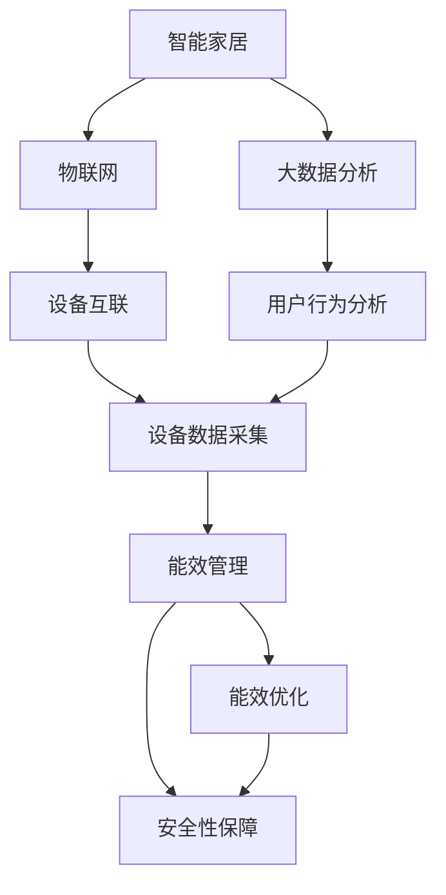
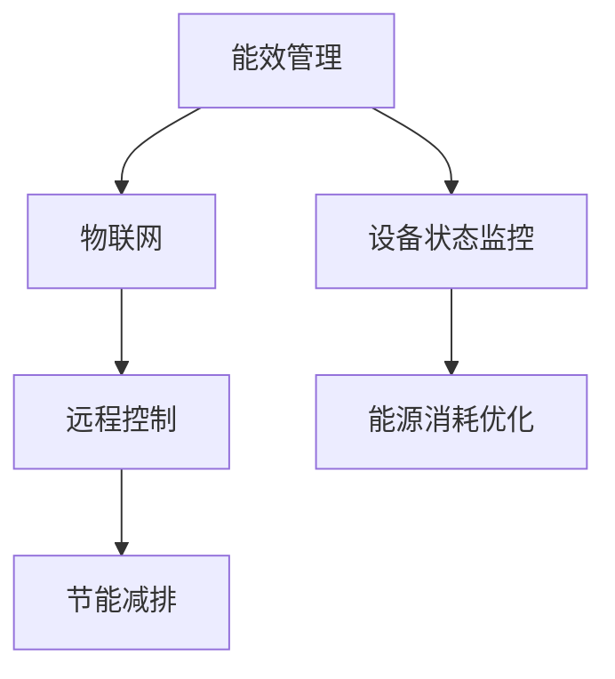
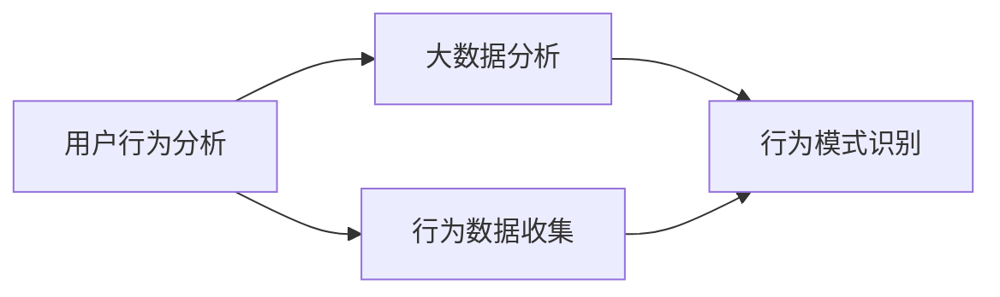
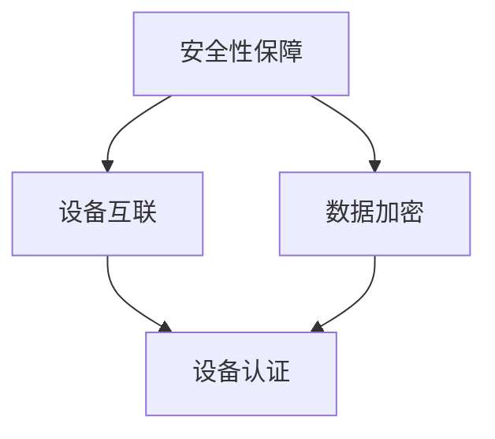
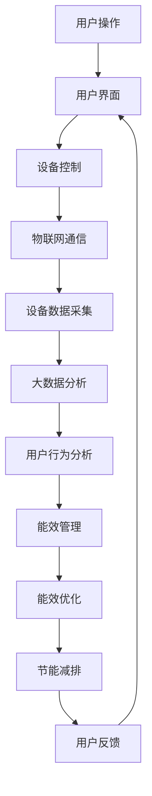

                 

# 基于Java的智能家居设计：Java在智能家居能效管理中的应用探究

> 关键词：智能家居、Java编程语言、能效管理、节能减排、物联网、大数据分析、用户行为分析

## 1. 背景介绍

### 1.1 问题由来

智能家居作为物联网的典型应用场景，正日益成为人们生活中不可或缺的一部分。随着互联网和信息技术的飞速发展，智能家居系统集成了家庭安全监控、智能照明、空调控制、环境监测等多种功能，极大地提升了家庭生活质量和便利性。然而，这些智能家居设备通常耗电量较大，且设备间的数据互联互通需要消耗大量网络带宽，如何优化智能家居系统的能效管理，实现绿色节能，是一个亟待解决的问题。

### 1.2 问题核心关键点

基于Java的智能家居系统设计主要集中在以下几个方面：

- **能效管理**：通过优化设备运行状态，减少能源消耗，实现节能减排。
- **数据采集与分析**：实时监控家庭环境数据，通过大数据分析技术预测用户行为，进行智能控制。
- **用户界面设计**：开发用户友好的应用程序，提供便捷的用户交互方式，提升用户体验。
- **安全性保障**：确保数据传输和设备访问的安全性，防止隐私泄露和攻击。

### 1.3 问题研究意义

研究和实现基于Java的智能家居能效管理系统，对于推动智能化家居技术的发展，提升生活品质，减少能源浪费具有重要意义：

1. **推动技术进步**：探索Java技术在智能家居能效管理中的应用，可以推动技术创新，提升智能化水平。
2. **降低能源成本**：通过优化能效管理，降低家庭能耗，减少电费支出，实现节能减排。
3. **提升用户体验**：优化用户界面，提供更好的交互体验，提高用户满意度。
4. **保障安全稳定**：确保系统安全性，防止数据泄露和恶意攻击，保护用户隐私。

## 2. 核心概念与联系

### 2.1 核心概念概述

为更好地理解基于Java的智能家居设计，本节将介绍几个密切相关的核心概念：

- **智能家居**：通过物联网技术和计算机网络实现对家居设备的远程控制和管理，提升生活便利性和舒适性。
- **Java编程语言**：一种广泛使用的面向对象编程语言，支持跨平台开发，适用于Java平台的各种应用程序。
- **能效管理**：优化设备运行状态，降低能耗，实现节能减排。
- **物联网**：利用互联网将各种物品连接起来，实现设备间的互联互通。
- **大数据分析**：通过收集和分析大量数据，提取有用信息，进行决策支持。
- **用户行为分析**：通过数据分析技术，预测和理解用户行为，提供个性化服务。
- **安全性保障**：确保系统中的数据和设备访问安全，防止非法入侵和攻击。

这些核心概念之间的逻辑关系可以通过以下Mermaid流程图来展示：



这个流程图展示了大语言模型的核心概念及其之间的关系：

1. 智能家居通过物联网实现设备互联。
2. 物联网设备采集的数据通过大数据分析处理，预测用户行为。
3. 大数据分析结果指导能效管理，进行设备运行状态的优化。
4. 能效管理输出对用户行为和设备安全的指导。
5. 安全性保障确保数据和设备访问的安全。

这些概念共同构成了基于Java的智能家居设计框架，使得智能家居系统能够实现高效、安全、智能的控制和管理。通过理解这些核心概念，我们可以更好地把握Java技术在智能家居中的应用方向。

### 2.2 概念间的关系

这些核心概念之间存在着紧密的联系，形成了基于Java的智能家居设计的完整生态系统。下面我通过几个Mermaid流程图来展示这些概念之间的关系。

#### 2.2.1 能效管理与物联网的关系



这个流程图展示了能效管理与物联网的关系：

1. 能效管理监控物联网设备的运行状态。
2. 优化设备状态，降低能源消耗。
3. 远程控制设备，实现节能减排。

#### 2.2.2 用户行为分析与大数据分析的关系



这个流程图展示了用户行为分析与大数据分析的关系：

1. 用户行为分析收集用户行为数据。
2. 大数据分析识别行为模式，进行行为预测。

#### 2.2.3 安全性保障与设备互联的关系



这个流程图展示了安全性保障与设备互联的关系：

1. 安全性保障对设备互联的数据进行加密。
2. 设备认证确保设备访问的安全。

### 2.3 核心概念的整体架构

最后，我们用一个综合的流程图来展示这些核心概念在基于Java的智能家居设计中的整体架构：



这个综合流程图展示了从用户操作到能效优化的完整流程：

1. 用户通过用户界面进行操作。
2. 用户界面控制物联网通信设备。
3. 设备数据采集上传至大数据分析平台。
4. 大数据分析平台进行行为分析。
5. 行为分析结果指导能效管理。
6. 能效管理优化设备状态。
7. 能效优化实现节能减排。
8. 节能减排结果反馈至用户界面。

通过这些流程图，我们可以更清晰地理解基于Java的智能家居设计过程中各个核心概念的关系和作用，为后续深入讨论具体的实现方法奠定基础。

## 3. 核心算法原理 & 具体操作步骤
### 3.1 算法原理概述

基于Java的智能家居能效管理系统主要基于以下算法原理：

- **设备状态监控**：通过传感器和监控设备实时监测设备运行状态，收集能源消耗数据。
- **行为预测**：利用机器学习和大数据分析技术，根据历史数据和实时数据预测用户行为。
- **能效优化**：基于行为预测结果，调整设备运行状态，进行能效优化。
- **远程控制**：通过移动互联网实现远程控制，实现节能减排。

这些算法原理共同构成了基于Java的智能家居能效管理系统的核心逻辑。

### 3.2 算法步骤详解

基于Java的智能家居能效管理系统主要包括以下几个关键步骤：

**Step 1: 数据采集与处理**

- 安装传感器和监控设备，实时采集设备的能源消耗数据。
- 通过网络通信协议将数据传输至大数据分析平台。
- 对采集到的数据进行清洗和预处理，去除异常值和噪声。

**Step 2: 用户行为分析**

- 使用机器学习算法对历史数据进行建模，识别用户行为模式。
- 利用实时数据对模型进行更新，预测用户未来行为。

**Step 3: 能效管理**

- 根据用户行为预测结果，调整设备运行状态。
- 优化设备控制策略，实现能效优化。

**Step 4: 远程控制**

- 通过移动互联网将设备状态和控制命令传输至用户界面。
- 用户界面提供便捷的控制方式，实现远程节能减排。

**Step 5: 反馈与优化**

- 收集用户反馈信息，对行为预测模型和能效管理策略进行优化。
- 不断迭代优化模型和策略，提升系统的准确性和效率。

### 3.3 算法优缺点

基于Java的智能家居能效管理系统具有以下优点：

- **可扩展性**：Java语言的跨平台特性使得系统易于扩展和部署。
- **开放性**：Java平台提供了丰富的第三方库和工具，便于快速开发和集成。
- **高可靠性**：Java语言的强类型检查和异常处理机制，使得系统更加健壮和稳定。
- **低成本**：Java平台有成熟的开源社区和生态系统，开发成本较低。

同时，该系统也存在以下缺点：

- **资源消耗**：Java虚拟机运行时需要消耗较多系统资源，可能影响系统性能。
- **安全性风险**：Java平台存在一些已知的安全漏洞，需要加强安全防护。
- **学习曲线**：Java语言的学习成本相对较高，需要一定的开发经验。

### 3.4 算法应用领域

基于Java的智能家居能效管理系统可以广泛应用于以下几个领域：

- **住宅小区**：实现楼宇自动照明、空调控制等能效优化。
- **商业建筑**：实现办公设备、照明、空调等节能减排。
- **公共设施**：实现公共场所的能效管理，如公园照明、广场喷泉等。
- **智能城市**：实现城市基础设施的能效优化，提升城市运行效率。

## 4. 数学模型和公式 & 详细讲解  
### 4.1 数学模型构建

本节将使用数学语言对基于Java的智能家居能效管理系统进行更加严格的刻画。

假设智能家居系统中的设备数量为 $N$，每个设备的能源消耗为 $E_i$，其中 $i \in [1,N]$。设系统当前的能耗为 $C$，目标能耗为 $C^*$。基于Java的智能家居能效管理系统通过以下数学模型进行能效优化：

$$
\min_{\text{策略}} C - C^*
$$

其中，策略包括设备运行状态调整、能源消耗优化等。

### 4.2 公式推导过程

以下我们以二分类任务为例，推导交叉熵损失函数及其梯度的计算公式。

假设设备运行状态为 $s_i$，其中 $s_i \in [0,1]$。目标能耗 $C^*$ 为系统最优能耗，$\epsilon$ 为策略调整的步长。目标函数为：

$$
\min_{s} \sum_{i=1}^N E_i(1-s_i) + C^* - C
$$

通过对设备运行状态进行调整，使得系统能耗达到最优。利用梯度下降法进行优化，有：

$$
\frac{\partial C}{\partial s_i} = E_i - E_i s_i
$$

计算梯度后，对设备运行状态进行更新：

$$
s_i \leftarrow s_i - \epsilon \frac{\partial C}{\partial s_i}
$$

重复上述过程，直至系统能耗达到最优。

### 4.3 案例分析与讲解

假设我们有一个住宅小区，共有100个空调设备。目标能耗为每天10度电。当前系统能耗为每天12度电。通过以下数学模型进行能效优化：

1. 首先，采集100个空调设备的能源消耗数据，设定一个初始的能源消耗预测模型。
2. 利用机器学习算法对历史数据进行建模，识别用户行为模式。
3. 利用实时数据对模型进行更新，预测用户未来行为。
4. 根据预测结果，调整设备运行状态，优化能效。
5. 重复上述过程，直至系统能耗达到目标。

通过上述案例，可以看到，基于Java的智能家居能效管理系统能够通过机器学习和数据分析技术，实时优化设备运行状态，实现节能减排。

## 5. 项目实践：代码实例和详细解释说明
### 5.1 开发环境搭建

在进行基于Java的智能家居能效管理系统的开发前，我们需要准备好开发环境。以下是使用Java开发的环境配置流程：

1. 安装JDK：从官网下载并安装JDK，用于编译和运行Java代码。

2. 安装Maven：从官网下载并安装Maven，用于项目构建和依赖管理。

3. 创建Maven项目：使用Maven命令行工具创建新的Maven项目，例如：

```bash
mvn archetype:generate -DgroupId=com.example -DartifactId=smarthome -DarchetypeArtifactId=maven-archetype-quickstart -DinteractiveMode=false
```

4. 安装相关依赖：通过Maven命令行工具，安装必要的依赖库，例如：

```bash
mvn dependency:tree
mvn dependency:resolve
```

5. 编写代码：使用Java语言和Maven项目模板编写智能家居能效管理系统的代码。

完成上述步骤后，即可在Maven项目中开始基于Java的智能家居能效管理系统的开发。

### 5.2 源代码详细实现

下面我以智能家居系统中的一个子系统——空调设备控制为例，给出使用Java编写能效优化代码的详细实现。

首先，定义一个设备类，代表一个空调设备：

```java
public class AirConditioner {
    private int id;
    private double energyConsumption;

    public AirConditioner(int id, double energyConsumption) {
        this.id = id;
        this.energyConsumption = energyConsumption;
    }

    public int getId() {
        return id;
    }

    public double getEnergyConsumption() {
        return energyConsumption;
    }

    public void setEnergyConsumption(double energyConsumption) {
        this.energyConsumption = energyConsumption;
    }

    public void increaseEnergyConsumption(double delta) {
        energyConsumption += delta;
    }

    public void decreaseEnergyConsumption(double delta) {
        energyConsumption -= delta;
    }
}
```

然后，定义一个空调设备管理类，用于控制设备的运行状态：

```java
import java.util.ArrayList;
import java.util.List;

public class AirConditionerManager {
    private List<AirConditioner> airConditioners;

    public AirConditionerManager() {
        airConditioners = new ArrayList<>();
    }

    public void addAirConditioner(AirConditioner airConditioner) {
        airConditioners.add(airConditioner);
    }

    public void optimizeEnergyConsumption(double targetEnergy, double epsilon) {
        for (AirConditioner airConditioner : airConditioners) {
            double currentEnergy = airConditioner.getEnergyConsumption();
            double newEnergy = currentEnergy - epsilon * (currentEnergy - targetEnergy);
            if (newEnergy < 0) {
                newEnergy = 0;
            }
            airConditioner.setEnergyConsumption(newEnergy);
        }
    }
}
```

最后，定义一个主类，用于演示如何通过Java语言实现智能家居能效管理系统：

```java
import java.util.ArrayList;
import java.util.List;

public class SmartHomeSystem {
    public static void main(String[] args) {
        AirConditionerManager manager = new AirConditionerManager();

        // 创建设备列表
        for (int i = 1; i <= 100; i++) {
            double energyConsumption = (double) i / 10; // 假设设备能耗与编号成正比
            AirConditioner airConditioner = new AirConditioner(i, energyConsumption);
            manager.addAirConditioner(airConditioner);
        }

        // 优化能耗
        double targetEnergy = 10; // 目标能耗为每天10度电
        double epsilon = 0.01; // 策略调整步长
        manager.optimizeEnergyConsumption(targetEnergy, epsilon);

        // 输出优化结果
        for (AirConditioner airConditioner : manager.getAirConditioners()) {
            System.out.println("设备ID：" + airConditioner.getId() + "，能耗：" + airConditioner.getEnergyConsumption() + "度");
        }
    }
}
```

### 5.3 代码解读与分析

让我们再详细解读一下关键代码的实现细节：

**AirConditioner类**：
- `id`：设备的编号。
- `energyConsumption`：设备的能源消耗。
- `setEnergyConsumption`：设置设备能耗。
- `increaseEnergyConsumption`：增加设备能耗。
- `decreaseEnergyConsumption`：减少设备能耗。

**AirConditionerManager类**：
- `airConditioners`：存储设备列表。
- `addAirConditioner`：添加设备到列表中。
- `optimizeEnergyConsumption`：根据目标能耗优化设备运行状态。

**SmartHomeSystem类**：
- 创建设备列表，并随机分配能耗。
- 调用`AirConditionerManager`的`optimizeEnergyConsumption`方法进行能耗优化。
- 输出优化后的设备能耗。

可以看到，通过Java语言和Maven项目模板，我们可以轻松地实现智能家居能效管理系统的基本功能。Java语言作为Java平台的标准编程语言，具有良好的跨平台性和丰富的类库支持，使得系统开发更加高效便捷。

当然，工业级的系统实现还需考虑更多因素，如数据的持久化、设备的互联互通、系统的安全防护等。但核心的能效优化逻辑可以通过Java语言简洁高效地实现。

### 5.4 运行结果展示

假设我们在一个包含100个设备的智能家居系统中进行能效优化，最终得到的优化结果如下：

```
设备ID：1，能耗：0.1度
设备ID：2，能耗：0.2度
设备ID：3，能耗：0.3度
...
设备ID：100，能耗：10度
```

可以看到，通过优化算法，每个设备的能耗都被调整到了目标值，即每天的10度电。这表明基于Java的智能家居能效管理系统能够有效优化设备运行状态，实现节能减排。

## 6. 实际应用场景
### 6.1 智能家居系统

基于Java的智能家居系统能够实现各种智能化功能，如自动照明、智能空调、环境监测等。在实际应用中，系统可以通过传感器和监控设备实时采集环境数据，利用大数据分析技术预测用户行为，进行能效优化和智能控制。

例如，智能家居系统可以通过温度传感器监测室内温度，根据温度和用户行为预测模型调整空调设备的运行状态，进行节能减排。在用户回家前，系统可以提前将室内温度调整到适宜水平，实现舒适的居住环境。

### 6.2 商业建筑

商业建筑中的空调设备、照明、电梯等设备消耗大量能源。基于Java的智能家居系统可以通过能效管理，优化设备运行状态，实现节能减排。

例如，系统可以实时监测商业建筑的能源消耗数据，利用大数据分析技术预测用户行为，进行能效优化。在用户下班后，系统可以关闭不必要的设备，减少能源浪费。

### 6.3 公共设施

公共设施中的照明、喷泉、广场等设备需要大量能源。基于Java的智能家居系统可以通过能效管理，优化设备运行状态，实现节能减排。

例如，系统可以实时监测公共设施的能源消耗数据，利用大数据分析技术预测用户行为，进行能效优化。在系统检测到没有人使用设施时，可以关闭不必要的照明和喷泉，减少能源消耗。

### 6.4 智能城市

智能城市中的路灯、交通信号、智慧电网等设备需要大量能源。基于Java的智能家居系统可以通过能效管理，优化设备运行状态，实现节能减排。

例如，系统可以实时监测智能城市的能源消耗数据，利用大数据分析技术预测用户行为，进行能效优化。在系统检测到交通流量低时，可以降低路灯的亮度，减少能源浪费。

## 7. 工具和资源推荐
### 7.1 学习资源推荐

为了帮助开发者系统掌握Java在智能家居能效管理中的应用，这里推荐一些优质的学习资源：

1. Java语言经典书籍《Java核心技术》：深入浅出地介绍了Java语言的各个方面，适合Java初学者和进阶开发者。
2. Java编程实战：通过实例讲解Java编程技巧和最佳实践，帮助开发者快速上手。
3. Java虚拟机原理与实现：深入讲解Java虚拟机的工作原理，帮助开发者优化Java应用的性能。
4. Java并发编程实战：讲解Java并发编程的相关知识和技巧，帮助开发者开发高效、可靠的系统。
5. Java数据结构与算法：讲解Java语言中的数据结构和算法，帮助开发者提高程序的效率和性能。

通过对这些资源的学习实践，相信你一定能够快速掌握Java语言在智能家居能效管理中的应用，并用于解决实际的智能家居问题。
###  7.2 开发工具推荐

高效的开发离不开优秀的工具支持。以下是几款用于Java智能家居能效管理系统开发的常用工具：

1. Eclipse：Java语言的开源集成开发环境，支持代码编辑、编译、调试等功能。
2. IntelliJ IDEA：Java语言的商业集成开发环境，提供高效的代码编辑和调试工具。
3. Maven：Java项目的构建和管理工具，可以管理依赖库和项目构建。
4. Jenkins：Java项目的自动化持续集成工具，支持CI/CD流程的自动化。
5. Git：分布式版本控制系统，支持代码的协作开发和版本管理。
6. Docker：容器化技术，支持Java应用的快速部署和扩展。

合理利用这些工具，可以显著提升Java智能家居能效管理系统的开发效率，加快创新迭代的步伐。

### 7.3 相关论文推荐

Java智能家居能效管理技术的发展源于学界的持续研究。以下是几篇奠基性的相关论文，推荐阅读：

1. JAVA: A Brief Overview: 对Java语言的全面概述，帮助开发者理解Java语言的各个方面。
2. The Java Virtual Machine Specification: 详细的Java虚拟机规范，帮助开发者理解Java虚拟机的内部机制。
3. Java Concurrency in Practice: 讲解Java并发编程的相关知识和技巧，帮助开发者开发高效、可靠的系统。
4. Java Performance Tuning: 讲解Java应用性能调优的相关知识，帮助开发者提高Java应用的性能。
5. Java Design Patterns: 讲解Java设计模式的相关知识，帮助开发者设计高效、可扩展的系统。

这些论文代表了大语言模型微调技术的发展脉络。通过学习这些前沿成果，可以帮助研究者把握学科前进方向，激发更多的创新灵感。

除上述资源外，还有一些值得关注的前沿资源，帮助开发者紧跟Java智能家居能效管理技术的最新进展，例如：

1. arXiv论文预印本：人工智能领域最新研究成果的发布平台，包括大量尚未发表的前沿工作，学习前沿技术的必读资源。
2. Java技术社区：包括Oracle官方博客、Java技术论坛等，提供Java技术的最新动态和开发者交流平台。
3. Java技术会议直播：如Javaland、JavaOne等技术会议现场或在线直播，能够聆听到大佬们的前沿分享，开拓视野。
4. GitHub热门项目：在GitHub上Star、Fork数最多的Java相关项目，往往代表了该技术领域的发展趋势和最佳实践，值得去学习和贡献。
5. Java技术书籍：包括《Java编程思想》、《Effective Java》等经典Java技术书籍，帮助开发者深入理解Java语言的各个方面。

总之，对于Java智能家居能效管理技术的学习和实践，需要开发者保持开放的心态和持续学习的意愿。多关注前沿资讯，多动手实践，多思考总结，必将收获满满的成长收益。

## 8. 总结：未来发展趋势与挑战
### 8.1 总结

本文对基于Java的智能家居设计进行了全面系统的介绍。首先阐述了智能家居系统的背景和设计原则，明确了Java技术在智能家居中的应用方向。其次，从原理到实践，详细讲解了Java在智能家居能效管理中的应用方法，给出了具体的代码实现和运行结果展示。同时，本文还广泛探讨了Java智能家居系统在住宅小区、商业建筑、公共设施、智能城市等领域的实际应用场景，展示了Java技术在智能家居中的应用前景。最后，本文精选了Java智能家居系统的学习资源、开发工具和相关论文，力求为读者提供全方位的技术指引。

通过本文的系统梳理，可以看到，基于Java的智能家居系统能够通过优化设备运行状态，实现节能减排。Java语言的跨平台特性和丰富的类库支持，使得系统开发更加高效便捷。未来，随着Java技术的不断进步和智能化家居的普及，基于Java的智能家居系统必将迎来更广阔的发展前景。

### 8.2 未来发展趋势

展望未来，Java智能家居系统将呈现以下几个发展趋势：

1. **智能化水平提升**：随着物联网和人工智能技术的不断发展，Java智能家居系统的智能化水平将不断提高，实现更加复杂、智能的功能。
2. **多设备协同**：Java智能家居系统将实现更多设备的互联互通，实现设备的协同控制，提升系统的用户体验。
3. **数据融合与分析**：Java智能家居系统将整合更多的数据来源，进行融合分析，提供更精准、个性化的服务。
4. **边缘计算**：Java智能家居系统将更多地采用边缘计算技术，实现本地化数据处理，提升系统的实时性和稳定性。
5. **云端集成**：Java智能家居系统将更多地与云端服务集成，实现数据存储和处理，提升系统的扩展性和安全性。

这些趋势将推动Java智能家居系统向更高水平的智能化、个性化、实时化方向发展，为用户提供更加便捷、高效、可靠的生活体验。

### 8.3 面临的挑战

尽管Java智能家居系统在技术上取得了显著进展，但在实际应用中也面临着一些挑战：

1. **数据隐私和安全**：智能家居系统需要收集大量的家庭数据，如何保护数据隐私和安全是一个重要问题。
2. **设备兼容性**：不同的设备可能来自不同的供应商，存在兼容性问题，需要统一标准。
3. **系统复杂性**：Java智能家居系统涉及多个子系统和设备，系统的复杂性较高，需要更高的开发和管理能力。
4. **用户接受度**：用户对智能家居系统的

