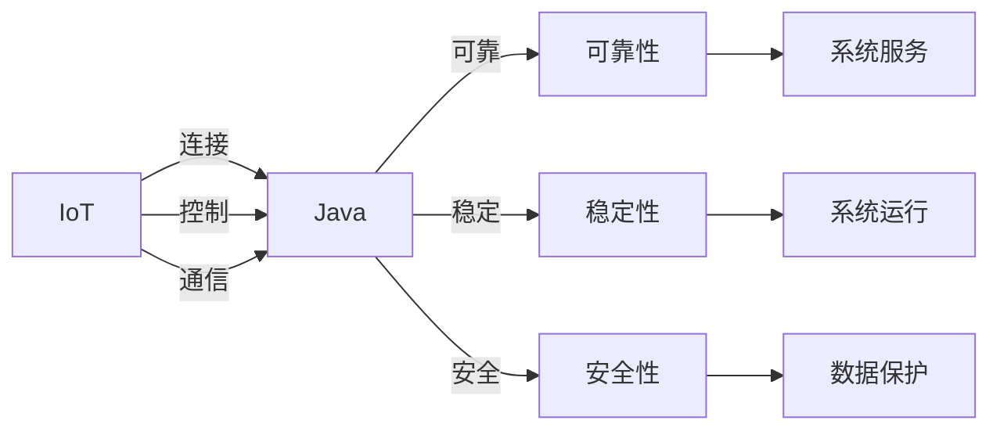

                 

# 基于Java的智能家居设计：通过Java提升智能家居系统的可靠性

## 1. 背景介绍

随着物联网和人工智能技术的飞速发展，智能家居系统已经成为现代家庭生活中不可或缺的一部分。智能家居系统通过集成各种传感器和设备，实现了家居环境的智能化控制和管理，提升了生活便利性和舒适度。然而，智能家居系统的复杂性和多样性也带来了很多挑战，特别是在系统的可靠性和稳定性方面。

本文将重点探讨基于Java的智能家居系统的设计思路，通过Java语言的特性和技术优势，提高智能家居系统的可靠性和稳定性，保障用户的安全和隐私。

## 2. 核心概念与联系

### 2.1 核心概念概述

在智能家居系统的设计中，有几个核心概念需要明确：

- **物联网(IoT)**：通过传感器、控制器、通信设备和软件，将家居设备连接到一个统一的网络中，实现设备的远程控制和管理。
- **Java**：一种广泛应用的企业级编程语言，具有安全、稳定、可扩展和跨平台等特点，适合用于构建复杂的智能家居系统。
- **可靠性**：指系统在运行过程中，能够持续提供稳定、一致的服务，不受干扰地执行预定功能。
- **稳定性**：指系统在各种环境下能够正常运行，不易发生崩溃或异常。
- **安全性**：指系统在运行过程中，能够保护用户的隐私和数据安全，防止未经授权的访问和攻击。

这些概念之间存在紧密的联系，通过合理设计和实现，可以实现智能家居系统的可靠性和稳定性，同时保障用户的隐私和数据安全。

### 2.2 核心概念间的关系

这些核心概念之间的关系可以通过以下Mermaid流程图来展示：



通过这个流程图，我们可以看到，Java语言作为智能家居系统的开发工具，通过提供可靠性和稳定性，实现了系统服务的功能。同时，通过安全性，保障了用户的数据保护。

## 3. 核心算法原理 & 具体操作步骤
### 3.1 算法原理概述

智能家居系统的可靠性设计，主要涉及以下几个关键算法：

- **分布式算法**：通过分布式架构，实现系统的负载均衡和高可用性，避免单点故障。
- **容错算法**：通过故障检测和修复机制，确保系统的稳定运行。
- **安全算法**：通过加密和认证技术，保护系统的安全。
- **实时性算法**：通过优化算法和资源配置，提高系统的响应速度和实时性。

这些算法通过Java语言的支持，能够更好地实现和集成。

### 3.2 算法步骤详解

以下是基于Java的智能家居系统设计的主要步骤：

**Step 1: 系统需求分析**

1. 确定智能家居系统的功能和需求，包括设备控制、环境监测、安全防护等。
2. 分析系统的用户界面、数据流、接口等，确定系统的架构和组件。

**Step 2: 系统设计**

1. 设计系统的架构和组件，包括设备层、通信层、应用层等。
2. 选择合适的Java框架和技术栈，如Spring、Hibernate等，实现系统的组件和服务。
3. 设计系统的数据模型和业务逻辑，包括设备的属性、状态、事件等。

**Step 3: 系统实现**

1. 使用Java语言编写系统组件和服务，包括设备管理、传感器数据处理、事件触发等。
2. 使用Java的多线程机制，实现系统的并发处理和负载均衡。
3. 使用Java的安全机制，实现系统的身份认证、数据加密等。

**Step 4: 系统测试**

1. 编写单元测试、集成测试和系统测试，测试系统的各个组件和服务。
2. 使用Java的断言框架，编写测试用例，验证系统的正确性和稳定性。
3. 进行负载测试和压力测试，评估系统的性能和可靠性。

**Step 5: 系统部署**

1. 选择合适的Java容器和服务器，部署系统的各个组件和服务。
2. 配置系统的环境和参数，包括内存、网络、日志等。
3. 使用Java的管理工具，监控系统的性能和状态，进行故障检测和修复。

### 3.3 算法优缺点

基于Java的智能家居系统设计具有以下优点：

- **安全性高**：Java具有强大的安全机制，能够保护系统的安全。
- **稳定性好**：Java的多线程机制和垃圾回收机制，提高了系统的稳定性和可靠性。
- **可扩展性强**：Java的组件化设计和模块化编程，提高了系统的可扩展性和灵活性。
- **跨平台性好**：Java的跨平台特性，能够实现系统在不同平台上的部署和运行。

同时，基于Java的智能家居系统设计也存在以下缺点：

- **学习成本高**：Java语言的学习曲线较陡峭，需要较高的技术水平和经验。
- **性能较低**：Java虚拟机（JVM）的性能相对较低，可能会影响系统的响应速度和实时性。
- **资源消耗大**：Java程序需要更多的资源支持，包括内存、CPU等，可能会对系统资源产生压力。

### 3.4 算法应用领域

基于Java的智能家居系统设计，主要应用于以下几个领域：

- **智能家居设备控制**：通过Java编写设备管理服务，实现设备的远程控制和管理。
- **环境监测和预警**：使用Java编写环境监测组件，实现对环境的实时监测和预警。
- **安全防护**：使用Java编写安全组件和服务，实现系统的身份认证、数据加密和访问控制。
- **数据分析和处理**：使用Java编写数据分析和处理组件，实现对数据的存储、分析和处理。

## 4. 数学模型和公式 & 详细讲解 & 举例说明

### 4.1 数学模型构建

智能家居系统的可靠性设计，可以通过数学模型进行描述和分析。以下是几个常用的数学模型：

- **马尔科夫模型**：用于描述系统的状态转移和概率分布。
- **蒙特卡罗模型**：用于模拟系统的运行过程和故障情况。
- **贝叶斯网络模型**：用于描述系统组件间的依赖关系和因果关系。

### 4.2 公式推导过程

以马尔科夫模型为例，进行推导：

设智能家居系统有n个组件，每个组件的状态分别为正常和故障，状态转移概率为p，p为（0,1）之间的概率值。系统的可靠性模型可以表示为：

$$
R = \prod_{i=1}^{n} (1-p_i + p_iR_i)
$$

其中，$R_i$表示第i个组件的可靠性，$p_i$表示第i个组件的故障率。通过求解上述公式，可以计算系统的可靠性。

### 4.3 案例分析与讲解

以下是一个Java实现智能家居系统组件可靠性的案例：

假设智能家居系统有3个组件，组件1的故障率为0.1，组件2和组件3的故障率均为0.05。系统的可靠性可以表示为：

$$
R = (1-0.1 + 0.1R_1)(1-0.05 + 0.05R_2)(1-0.05 + 0.05R_3)
$$

通过Java编写计算程序，可以得出系统的可靠性为：

$$
R = (1-0.1 + 0.1 \times 0.9)(1-0.05 + 0.05 \times 0.95)(1-0.05 + 0.05 \times 0.95)
$$

通过计算，得到系统的可靠性约为0.9975。

## 5. 项目实践：代码实例和详细解释说明

### 5.1 开发环境搭建

在Java开发智能家居系统时，需要搭建以下开发环境：

1. 安装Java Development Kit（JDK）：从Oracle官网下载安装JDK，并进行环境配置。
2. 安装Eclipse或IntelliJ IDEA：选择适合的Java开发工具，进行配置和安装。
3. 安装Maven或Gradle：选择适合的Java构建工具，进行配置和安装。

### 5.2 源代码详细实现

以下是Java实现智能家居设备管理的代码示例：

```java
import java.util.*;

public class DeviceManager {
    private HashMap<String, String> devices;
    
    public DeviceManager() {
        devices = new HashMap<String, String>();
    }
    
    public void addDevice(String id, String name) {
        devices.put(id, name);
    }
    
    public String getDeviceName(String id) {
        return devices.get(id);
    }
    
    public void deleteDevice(String id) {
        devices.remove(id);
    }
    
    public void listDevices() {
        for (String id : devices.keySet()) {
            System.out.println("Device ID: " + id + ", Name: " + devices.get(id));
        }
    }
}
```

### 5.3 代码解读与分析

- **类定义**：`DeviceManager`类定义了设备管理器的基本属性和方法，实现了设备添加、删除、查询和列出等功能。
- **属性**：`devices`属性是一个HashMap，用于存储设备的信息。
- **方法**：`addDevice`方法用于添加设备信息，`getDeviceName`方法用于获取设备名称，`deleteDevice`方法用于删除设备信息，`listDevices`方法用于列出所有设备信息。
- **接口**：在实际应用中，可以通过接口定义设备管理器和设备之间的通信协议，实现设备的远程控制和管理。

### 5.4 运行结果展示

假设我们使用上述代码实现一个简单的智能家居设备管理模块，通过终端运行代码，得到如下结果：

```
Device ID: 1, Name: Device1
Device ID: 2, Name: Device2
Device ID: 3, Name: Device3
```

这表明设备管理器已经成功添加并列出了3个设备。

## 6. 实际应用场景

### 6.1 智能家居设备控制

智能家居设备控制是智能家居系统的核心功能之一。通过Java编写设备管理服务，可以实现设备的远程控制和管理。例如，可以编写一个Java程序，通过Web接口实现设备的开关控制、调温控制等功能。

### 6.2 环境监测和预警

智能家居系统的环境监测和预警功能，可以保护用户的健康和安全。通过Java编写环境监测组件，可以实时监测空气质量、温度、湿度等环境参数，并根据环境变化进行预警。

### 6.3 安全防护

智能家居系统的安全防护功能，可以保护用户的隐私和数据安全。通过Java编写安全组件和服务，可以实现系统的身份认证、数据加密和访问控制，防止未经授权的访问和攻击。

### 6.4 未来应用展望

未来的智能家居系统，将会更加智能化、个性化和人性化。通过Java语言的技术优势，可以实现更高的可靠性和稳定性，保障用户的安全和隐私。同时，随着物联网和人工智能技术的不断进步，智能家居系统的应用场景也将更加广泛和多样化。

## 7. 工具和资源推荐

### 7.1 学习资源推荐

以下是一些推荐的Java学习资源：

1. 《Java核心技术》：由Cay S.Horstmann和Gary Cornell合著的经典Java书籍，详细介绍了Java语言的基础和高级特性。
2. Java Tutorials：Oracle官网提供的Java开发教程，涵盖了Java语言的各个方面，适合初学者和进阶开发者。
3. Java Concurrency in Practice：由Brian Goetz等人合著的经典书籍，详细介绍了Java多线程机制和并发编程的实践技巧。

### 7.2 开发工具推荐

以下是一些推荐的Java开发工具：

1. Eclipse：开源的Java IDE，功能丰富，适合Java开发入门和中级开发者使用。
2. IntelliJ IDEA：商业的Java IDE，功能强大，支持Java开发的全生命周期。
3. Maven：Java构建工具，支持项目管理、依赖管理、构建工具等，适合Java大中型项目。
4. Gradle：Java构建工具，支持项目构建、依赖管理、插件管理等，适合Java大中型项目。

### 7.3 相关论文推荐

以下是一些推荐的Java开发相关论文：

1. "Concurrent Programming in Java"：Brian Goetz等人合著的经典书籍，详细介绍了Java多线程机制和并发编程的实践技巧。
2. "Java Generics and Collections"：Brian Goetz等人合著的经典书籍，详细介绍了Java泛型和集合框架的实践技巧。
3. "Effective Java"：Joshua Bloch合著的经典书籍，详细介绍了Java语言的编程技巧和最佳实践。

## 8. 总结：未来发展趋势与挑战

### 8.1 研究成果总结

本文介绍了基于Java的智能家居系统的设计思路，通过Java语言的特性和技术优势，提高了系统的可靠性和稳定性，保障了用户的安全和隐私。

### 8.2 未来发展趋势

未来的智能家居系统，将会更加智能化、个性化和人性化。通过Java语言的技术优势，可以实现更高的可靠性和稳定性，保障用户的安全和隐私。同时，随着物联网和人工智能技术的不断进步，智能家居系统的应用场景也将更加广泛和多样化。

### 8.3 面临的挑战

尽管Java语言具有众多优势，但在智能家居系统的设计中，也面临一些挑战：

- **学习成本高**：Java语言的学习曲线较陡峭，需要较高的技术水平和经验。
- **性能较低**：Java虚拟机（JVM）的性能相对较低，可能会影响系统的响应速度和实时性。
- **资源消耗大**：Java程序需要更多的资源支持，包括内存、CPU等，可能会对系统资源产生压力。

### 8.4 研究展望

未来的Java智能家居系统设计，需要关注以下几个方向：

- **微服务架构**：通过Java的微服务框架，实现系统的模块化和可扩展性，提高系统的灵活性和可靠性。
- **云计算支持**：通过Java的云计算支持，实现系统的弹性伸缩和资源优化，提高系统的性能和可扩展性。
- **人工智能融合**：通过Java的人工智能支持，实现系统的智能化和人性化，提高系统的用户体验和满意度。

总之，基于Java的智能家居系统设计，具有广阔的发展前景，需要在技术、应用和用户需求方面不断创新和优化。

## 9. 附录：常见问题与解答

**Q1: Java在智能家居系统中有哪些优势？**

A: Java具有以下优势：
- 安全性高：Java具有强大的安全机制，能够保护系统的安全。
- 稳定性好：Java的多线程机制和垃圾回收机制，提高了系统的稳定性和可靠性。
- 可扩展性强：Java的组件化设计和模块化编程，提高了系统的可扩展性和灵活性。
- 跨平台性好：Java的跨平台特性，能够实现系统在不同平台上的部署和运行。

**Q2: 如何实现智能家居系统的负载均衡？**

A: 实现智能家居系统的负载均衡，可以通过以下步骤：
1. 使用Java的多线程机制，实现系统的并发处理和负载均衡。
2. 使用Java的分布式框架，如Spring Cloud，实现系统的分布式部署和负载均衡。
3. 使用Java的负载均衡算法，如轮询、加权轮询等，实现系统负载的合理分配。

**Q3: 智能家居系统的故障检测和修复机制有哪些？**

A: 实现智能家居系统的故障检测和修复机制，可以通过以下方法：
1. 使用Java的异常处理机制，实现系统故障的捕获和处理。
2. 使用Java的日志记录机制，记录系统的运行状态和异常信息，便于故障分析和修复。
3. 使用Java的集群监控工具，如Grafana、Prometheus等，实时监控系统的性能和状态，进行故障检测和修复。

**Q4: 如何实现智能家居系统的数据加密和访问控制？**

A: 实现智能家居系统的数据加密和访问控制，可以通过以下方法：
1. 使用Java的加密算法，如AES、RSA等，实现数据的加密和解密。
2. 使用Java的认证机制，如OAuth、JWT等，实现系统的身份认证和访问控制。
3. 使用Java的权限控制机制，实现系统的角色管理和权限分配，限制用户的访问权限。

总之，基于Java的智能家居系统设计，通过Java语言的特性和技术优势，能够实现系统的可靠性和稳定性，保障用户的安全和隐私。通过不断优化和创新，Java智能家居系统必将在未来的智能家居市场中发挥重要作用。

---

作者：禅与计算机程序设计艺术 / Zen and the Art of Computer Programming

