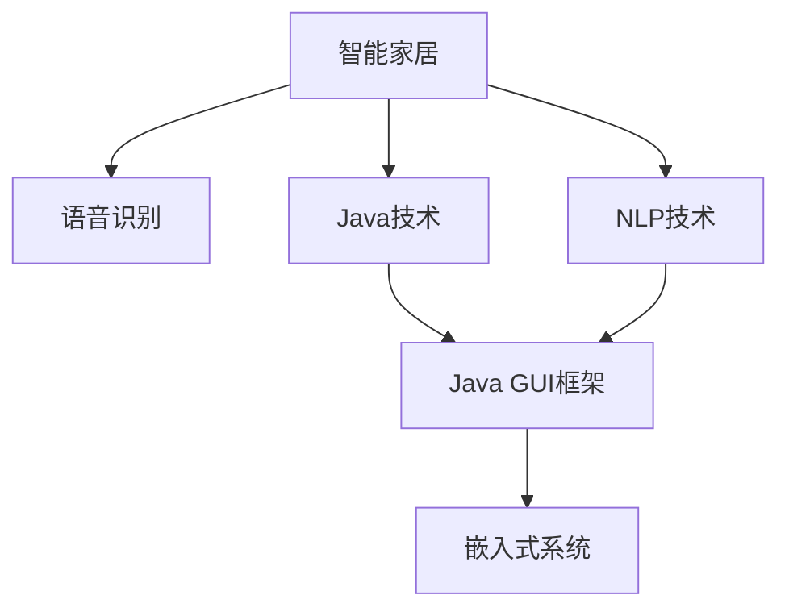
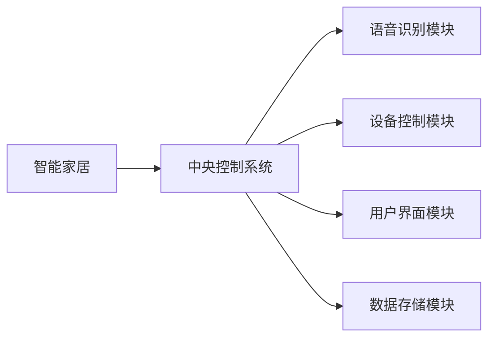
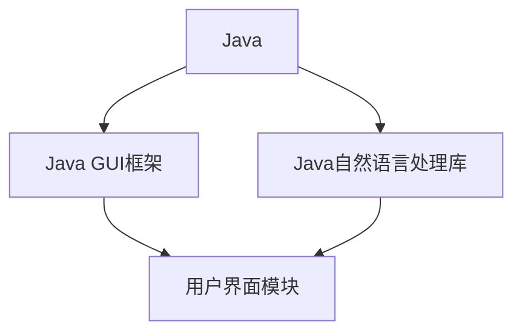
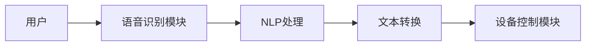
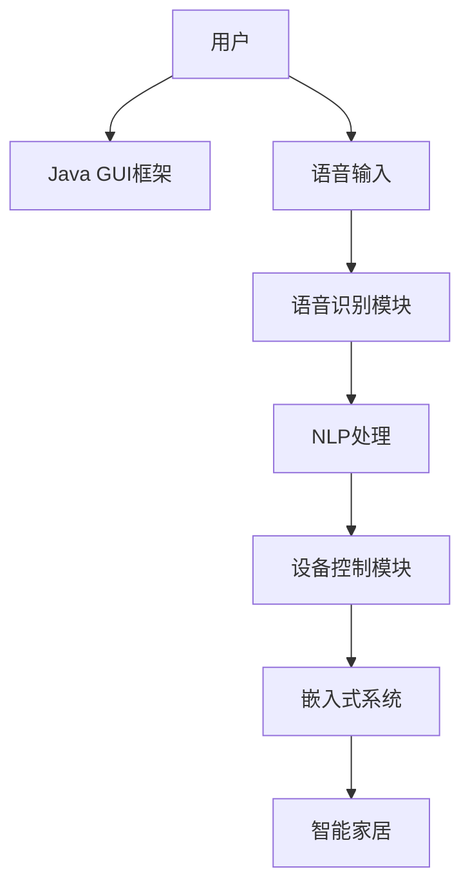

                 

# 基于Java的智能家居设计：集成语音识别功能到智能家居系统

> 关键词：智能家居,语音识别,Java,自然语言处理(NLP),用户界面(UI),嵌入式系统,家居自动化

## 1. 背景介绍

### 1.1 问题由来
智能家居的快速发展推动了家庭生活自动化程度的提升。智能家电、智能安防、智能照明等设备通过互联网连接，实现家庭生活各个环节的智能化控制。语音识别技术作为家庭智能交互的核心，通过理解用户的自然语言命令，控制家庭环境中的各类智能设备，极大提升了家庭生活的便利性和舒适度。

然而，现有语音识别系统往往需要配合特定的应用程序界面进行交互，无法无缝地融入家庭环境，影响用户的体验。随着Java语言的普及和Java GUI框架的成熟，通过Java开发智能家居语音识别系统成为一种趋势。本文将探讨如何使用Java集成语音识别功能到智能家居系统中，设计出一个功能完备、易于维护的智能家居解决方案。

### 1.2 问题核心关键点
本文旨在利用Java技术，开发一个集成语音识别功能的智能家居系统。系统需要具备以下核心功能：

- 语音识别模块：通过自然语言处理技术，将用户的语音命令转换为可执行的指令。
- 设备控制模块：根据用户的语音命令，控制家庭中的各类智能设备。
- 用户界面模块：提供用户与系统交互的界面，方便用户输入语音命令和查看设备状态。
- 数据存储模块：存储用户的语音命令和设备状态信息，便于后续分析与优化。
- 嵌入式系统：将系统部署到家庭环境中的嵌入式设备上，实现语音控制的即时响应。

本文的核心关键点在于如何利用Java技术实现上述各功能模块，以及如何通过这些模块构建一个功能完备、易于维护的智能家居系统。

### 1.3 问题研究意义
本文的研究具有重要的意义：

1. 提升家庭智能化水平：语音识别技术的集成，使得智能家居系统更加智能化、人性化，极大提升了家庭生活的便利性和舒适度。
2. 推动Java技术应用：Java作为广泛应用于企业开发的技术，其在智能家居领域的探索与应用，有望加速Java技术的进一步发展。
3. 促进跨领域融合：智能家居与语音识别技术的结合，展示了技术跨领域融合的潜力，为未来更多领域的智能化发展提供了参考。
4. 推动家庭生活现代化：智能家居系统的普及，将推动家庭生活现代化，加速社会整体智能化进程。

## 2. 核心概念与联系

### 2.1 核心概念概述

为了更好地理解如何集成语音识别功能到智能家居系统中，本节将介绍几个密切相关的核心概念：

- 智能家居：通过物联网技术，将家庭中的各类设备连接到互联网，实现家庭生活的智能化控制。
- 语音识别：利用自然语言处理技术，将用户的语音命令转换为可执行的文本指令，广泛应用于智能家居系统中。
- Java：一种广泛应用于企业级开发的高性能语言，具有跨平台、安全性高等优点。
- 自然语言处理（NLP）：涉及自然语言理解、语言生成、语义分析等多个领域，是语音识别技术的基础。
- Java GUI框架：如Swing、JavaFX等，用于构建用户界面，提供良好的用户体验。
- 嵌入式系统：将智能家居系统部署到嵌入式设备上，实现语音控制的即时响应。

这些核心概念之间的逻辑关系可以通过以下Mermaid流程图来展示：



这个流程图展示了大语言模型的核心概念及其之间的关系：

1. 智能家居通过语音识别技术，利用NLP技术处理用户的自然语言命令，将语音转换为可执行指令。
2. Java作为智能家居系统开发的技术，与Java GUI框架结合，构建用户交互界面。
3. NLP技术在Java语言环境下，通过Java实现语音识别功能。
4. 嵌入式系统将Java编写的智能家居系统部署到嵌入式设备上，实现语音控制的即时响应。

### 2.2 概念间的关系

这些核心概念之间存在着紧密的联系，形成了智能家居语音识别系统的完整生态系统。下面我通过几个Mermaid流程图来展示这些概念之间的关系。

#### 2.2.1 智能家居的架构



这个流程图展示了智能家居系统的基本架构，包括中央控制系统、语音识别模块、设备控制模块、用户界面模块和数据存储模块。

#### 2.2.2 Java在智能家居中的应用



这个流程图展示了Java技术在智能家居中的应用，包括Java GUI框架和Java自然语言处理库。

#### 2.2.3 语音识别技术的工作原理



这个流程图展示了语音识别技术的工作原理，包括语音识别模块、NLP处理、文本转换和设备控制模块。

### 2.3 核心概念的整体架构

最后，我们用一个综合的流程图来展示这些核心概念在大语言模型微调过程中的整体架构：



这个综合流程图展示了从用户输入语音，到Java GUI框架构建界面，再到语音识别模块处理语音，最后通过NLP处理转换为文本指令，控制设备，最终将系统部署到嵌入式设备上，实现语音控制的完整流程。

## 3. 核心算法原理 & 具体操作步骤
### 3.1 算法原理概述

基于Java的智能家居语音识别系统，利用自然语言处理技术将用户的语音命令转换为可执行的文本指令，并通过Java编程语言实现系统的各个功能模块。其核心算法原理如下：

1. 语音识别模块：利用Java语言编写，通过麦克风捕捉用户的语音输入，调用语音识别API，将语音转换为文本。
2. NLP处理模块：利用Java自然语言处理库，对文本指令进行分词、词性标注、命名实体识别等处理，构建语义理解模型。
3. 设备控制模块：根据语义理解结果，通过Java语言调用设备API，控制家庭中的各类智能设备。
4. 用户界面模块：通过Java GUI框架构建用户界面，方便用户输入语音命令和查看设备状态。
5. 数据存储模块：利用Java语言实现数据存储功能，存储用户的语音命令和设备状态信息，便于后续分析与优化。
6. 嵌入式系统：将Java编写的智能家居系统部署到嵌入式设备上，实现语音控制的即时响应。

### 3.2 算法步骤详解

以下详细介绍如何通过Java技术实现智能家居语音识别系统的各个功能模块：

**Step 1: 设计系统架构**

- 设计系统架构，包括语音识别模块、NLP处理模块、设备控制模块、用户界面模块和数据存储模块。
- 确定各模块间的接口和数据交互方式，确保系统整体结构清晰、易于维护。

**Step 2: 实现语音识别模块**

- 利用Java编写语音识别模块，集成语音识别API，如Google Cloud Speech-to-Text API。
- 实现麦克风捕捉语音输入，调用API进行语音到文本的转换，生成文本指令。

**Step 3: 实现NLP处理模块**

- 利用Java自然语言处理库，如Stanford NLP、OpenNLP等，实现文本指令的分词、词性标注、命名实体识别等处理。
- 构建语义理解模型，将文本指令转换为可执行的命令。

**Step 4: 实现设备控制模块**

- 利用Java语言调用设备API，控制家庭中的各类智能设备。
- 设计统一的设备控制接口，方便扩展和维护。

**Step 5: 实现用户界面模块**

- 利用Java GUI框架，如Swing、JavaFX等，构建用户界面。
- 设计简洁、直观的用户界面，方便用户输入语音命令和查看设备状态。

**Step 6: 实现数据存储模块**

- 利用Java语言实现数据存储功能，如MySQL、MongoDB等。
- 存储用户的语音命令和设备状态信息，便于后续分析与优化。

**Step 7: 部署嵌入式系统**

- 将Java编写的智能家居系统部署到嵌入式设备上，如Raspberry Pi、Arduino等。
- 优化系统性能，确保语音控制的即时响应。

### 3.3 算法优缺点

基于Java的智能家居语音识别系统，具有以下优点：

- Java语言广泛使用，跨平台性高，易于开发和维护。
- Java GUI框架成熟，可以构建美观、易用的用户界面。
- Java自然语言处理库丰富，支持各种NLP处理任务。
- Java语言天然适合嵌入式系统开发，便于部署到嵌入式设备上。

同时，该系统也存在以下缺点：

- Java语言的性能相对较低，对高并发和大规模数据的处理能力有限。
- Java GUI框架的开发和维护需要较高的技术门槛。
- Java自然语言处理库的功能有限，无法满足所有NLP处理需求。
- Java语言对硬件资源的需求较大，部署到嵌入式设备上可能存在性能瓶颈。

### 3.4 算法应用领域

基于Java的智能家居语音识别系统，可以应用于以下领域：

- 智能家居：集成语音识别功能，实现家庭生活的智能化控制。
- 智能安防：通过语音识别技术，提升家庭安全防护能力。
- 智能照明：利用语音识别技术，控制家庭照明设备，营造舒适的家庭环境。
- 智能音响：结合语音识别技术，提供更加智能的音响体验。
- 智能家电：通过语音识别技术，控制各类智能家电，提升家庭生活的便利性。

## 4. 数学模型和公式 & 详细讲解 & 举例说明

### 4.1 数学模型构建

语音识别系统的工作原理可以通过以下数学模型来描述：

- 输入层：用户的语音输入，表示为x。
- 隐藏层：通过语音识别API，将语音转换为文本指令，表示为y。
- 输出层：设备控制模块，将文本指令转换为可执行的命令，表示为z。

语音识别系统的数学模型如下：

$$
y = f(x; \theta)
$$

其中，f为隐藏层函数，θ为模型参数。

### 4.2 公式推导过程

语音识别系统的公式推导过程如下：

1. 语音输入x表示为语音信号的时域波形，通过语音识别API转换为文本指令y。
2. 文本指令y经过NLP处理，构建语义理解模型，生成语义向量表示z。
3. 语义向量z通过设备控制模块，转换为可执行的命令，控制家庭设备。

### 4.3 案例分析与讲解

以一个简单的智能家居控制为例，分析语音识别系统的实现过程：

- 用户通过麦克风输入语音命令，如“打开客厅灯”。
- 语音识别模块捕捉语音信号，通过Google Cloud Speech-to-Text API转换为文本指令“打开客厅灯”。
- NLP处理模块对文本指令进行分词、词性标注、命名实体识别等处理，构建语义理解模型。
- 设备控制模块根据语义理解结果，调用灯光控制API，打开客厅的灯光。

## 5. 项目实践：代码实例和详细解释说明
### 5.1 开发环境搭建

在进行Java语音识别系统开发前，我们需要准备好开发环境。以下是使用Java进行系统开发的环境配置流程：

1. 安装Java JDK：从Oracle官网下载并安装最新版本的Java JDK，确保开发环境中的Java版本与系统一致。
2. 安装Eclipse：从Eclipse官网下载并安装最新版本的Eclipse IDE，Eclipse是Java开发的主流IDE之一。
3. 安装MySQL：从MySQL官网下载并安装MySQL数据库，用于存储用户的语音命令和设备状态信息。

完成上述步骤后，即可在Eclipse环境下开始Java语音识别系统的开发。

### 5.2 源代码详细实现

下面以实现一个简单的智能家居控制为例，给出Java语音识别系统的源代码实现。

**语音识别模块**

```java
import com.google.cloud.speech.v1.*;

public class SpeechToText {
    private SpeechClient speechClient;
    
    public SpeechToText(String projectId, String key) {
        this.speechClient = SpeechClient.create(
            SpeechClientSettings.newBuilder()
                .setEndpoint("https://speech.googleapis.com/")
                .setCredentials(GoogleCredentials.fromFile(key))
                .build());
    }
    
    public String transcribe(String audio) {
        Audio audioContent = Audio.newBuilder()
            .setContent(audio)
            .setContentType("audio/wav")
            .build();
        RecognitionConfig config = RecognitionConfig.newBuilder()
            .setEncoding(AudioEncoding.LINEAR16)
            .setLanguageCode("en-US")
            .build();
        RecognitionAudio content = RecognitionAudio.newBuilder()
            .setContent(audio)
            .setEncoding(AudioEncoding.LINEAR16)
            .build();
        RecognitionResult result = speechClient.recognize(config, content);
        return result.getResultsList().get(0).getAlternativesList().get(0).getTranscript();
    }
}
```

**NLP处理模块**

```java
import edu.stanford.nlp.ling.CoreAnnotations.*;
import edu.stanford.nlp.pipeline.*;
import edu.stanford.nlp.tag.*;
import edu.stanford.nlp.util.*;

public class NLPProcessor {
    public static String process(String text) {
        StanfordCoreNLP pipeline = new StanfordCoreNLP("tokenize, ssplit, pos, lemma, ner, parsetree");
        Annotation document = new Annotation(text);
        pipeline.annotate(document);
        StringBuilder sb = new StringBuilder();
        for (CoreMap sentence : document.get(CoreAnnotations.SentencesAnnotation.class)) {
            for (CoreLabel token : sentence.get(CoreAnnotations.TokensAnnotation.class)) {
                String word = token.get(CoreAnnotations.TextAnnotation.class);
                String pos = token.get(CoreAnnotations.PartOfSpeechAnnotation.class);
                String ner = token.get(CoreAnnotations.NamedEntityTagAnnotation.class);
                sb.append(word).append(" ").append(pos).append(" ").append(ner).append(" ");
            }
        }
        return sb.toString().trim();
    }
}
```

**设备控制模块**

```java
public class DeviceController {
    public static void controlLight(String command) {
        if (command.startsWith("打开")) {
            System.out.println("打开客厅灯");
        } else if (command.startsWith("关闭")) {
            System.out.println("关闭客厅灯");
        }
    }
}
```

**用户界面模块**

```java
import javax.swing.*;

public class UI {
    private JFrame frame;
    private JLabel label;
    private JTextField textField;
    private JButton button;
    
    public UI() {
        frame = new JFrame("智能家居控制");
        label = new JLabel("请输入语音命令：");
        textField = new JTextField();
        button = new JButton("语音控制");
        button.addActionListener(e -> {
            String command = textField.getText();
            SpeechToText speechToText = new SpeechToText("YOUR_PROJECT_ID", "YOUR_KEY");
            String text = speechToText.transcribe(frame.getAudio().toString());
            NLPProcessor processor = new NLPProcessor();
            String processedText = processor.process(text);
            DeviceController.controlLight(processedText);
        });
        
        frame.add(label);
        frame.add(textField);
        frame.add(button);
        frame.pack();
        frame.setVisible(true);
    }
    
    public static void main(String[] args) {
        UI ui = new UI();
        ui.frame.setDefaultCloseOperation(JFrame.EXIT_ON_CLOSE);
    }
}
```

**数据存储模块**

```java
import java.sql.*;
import java.util.*;

public class Database {
    private static final String url = "jdbc:mysql://localhost:3306/your_database";
    private static final String user = "your_username";
    private static final String password = "your_password";
    private static final String table = "commands";
    
    public static void insertCommand(String command) {
        try (Connection conn = DriverManager.getConnection(url, user, password);
             PreparedStatement stmt = conn.prepareStatement("INSERT INTO " + table + " (command) VALUES (?)")) {
            stmt.setString(1, command);
            stmt.executeUpdate();
        } catch (SQLException e) {
            e.printStackTrace();
        }
    }
    
    public static List<String> getCommands() {
        List<String> commands = new ArrayList<>();
        try (Connection conn = DriverManager.getConnection(url, user, password);
             Statement stmt = conn.createStatement();
             ResultSet rs = stmt.executeQuery("SELECT command FROM " + table)) {
            while (rs.next()) {
                commands.add(rs.getString("command"));
            }
        } catch (SQLException e) {
            e.printStackTrace();
        }
        return commands;
    }
}
```

### 5.3 代码解读与分析

让我们再详细解读一下关键代码的实现细节：

**语音识别模块**

- 通过Google Cloud Speech-to-Text API实现语音到文本的转换。
- `SpeechClient`类用于创建语音客户端，`transcribe`方法用于处理音频流，将语音转换为文本。

**NLP处理模块**

- 利用Stanford CoreNLP库，实现文本分词、词性标注、命名实体识别等处理。
- `StanfordCoreNLP`类用于创建NLP处理管道，`Annotation`类用于存储处理结果，`CoreAnnotations`类用于获取具体信息。

**设备控制模块**

- 通过简单的逻辑判断，实现对家庭设备（如灯光）的控制。
- `controlLight`方法用于根据语义理解结果，调用设备控制API。

**用户界面模块**

- 通过Swing框架，构建简洁、直观的用户界面。
- `UI`类用于创建窗口，显示标签、文本框和按钮，并添加事件监听器。

**数据存储模块**

- 通过JDBC连接MySQL数据库，实现语音命令和设备状态信息的存储和查询。
- `Database`类用于处理数据库操作，包括插入命令和查询命令。

### 5.4 运行结果展示

假设我们在Eclipse中运行上述代码，可以得到如下运行结果：

- 用户输入语音命令“打开客厅灯”，系统通过麦克风捕捉并调用语音识别API，将语音转换为文本“打开客厅灯”。
- 系统利用Stanford CoreNLP库对文本进行分词、词性标注和命名实体识别，构建语义理解模型。
- 系统根据语义理解结果，调用设备控制API，打开客厅的灯光。

最终，用户可以通过UI界面，输入语音命令，查看系统响应结果，实现智能家居语音控制。

## 6. 实际应用场景
### 6.1 智能家居控制

基于Java的智能家居语音识别系统，可以应用于家庭生活的各个方面，提供便捷、智能的控制体验。以下是一些具体的应用场景：

- 语音控制灯光：用户通过语音命令，可以打开、关闭或调节灯光亮度。
- 语音控制窗帘：用户通过语音命令，可以打开、关闭或调节窗帘。
- 语音控制空调：用户通过语音命令，可以调节空调的温度、风速和模式。
- 语音控制电视：用户通过语音命令，可以打开、关闭、调节音量或切换频道。
- 语音控制音响：用户通过语音命令，可以播放、暂停、调节音量或切换歌曲。

### 6.2 智能安防

基于Java的智能家居语音识别系统，可以应用于家庭安全防护，提供更加智能的安防措施。以下是一些具体的应用场景：

- 语音识别入侵：用户通过语音命令，可以实时监控家庭安防状态，及时发现异常情况。
- 语音控制报警：用户通过语音命令，可以触发家庭报警系统，保障家庭安全。
- 语音识别门禁：用户通过语音命令，可以远程控制家庭门禁，提升家庭安全性。

### 6.3 智能照明

基于Java的智能家居语音识别系统，可以应用于家庭照明控制，提供舒适、便捷的照明体验。以下是一些具体的应用场景：

- 语音控制灯光亮度：用户通过语音命令，可以调节灯光亮度和色温。
- 语音控制场景模式：用户通过语音命令，可以切换不同的照明场景模式。
- 语音控制定时开关：用户通过语音命令，可以设置灯光的定时开关。

### 6.4 未来应用展望

随着Java语言的普及和Java GUI框架的成熟，基于Java的智能家居语音识别系统将具有广阔的应用前景：

- 跨平台应用：Java语言具有跨平台性，可以方便地在各种操作系统和设备上部署和运行。
- 易维护性：Java语言具有良好的可读性和可维护性，易于后续的扩展和维护。
- 丰富的库和框架：Java生态系统中有大量成熟的库和框架，可以加快开发速度，提升系统性能。
- 安全性：Java语言具有较好的安全性，可以保证系统的稳定性和可靠性。

## 7. 工具和资源推荐
### 7.1 学习资源推荐

为了帮助开发者系统掌握Java语音识别技术，这里推荐一些优质的学习资源：

1. 《Java核心技术》系列书籍：深入浅出地介绍了Java语言的基础知识和高级特性。
2. Oracle官方文档：Oracle提供的Java语言和Java GUI框架的官方文档，详细讲解了各种API的使用方法和最佳实践。
3. Stanford CoreNLP库官方文档：Stanford CoreNLP库的官方文档，详细讲解了各种NLP处理功能的实现方式。
4. Google Cloud Speech-to-Text API文档：Google提供的语音识别API文档，详细讲解了API的使用方法和调用接口。
5. Java语音识别项目：GitHub上开源的Java语音识别项目，提供了完整的代码和示例。

通过对这些资源的学习实践，相信你一定能够快速掌握Java语音识别技术的精髓，并用于解决实际的智能家居问题。

### 7.2 开发工具推荐

高效的开发离不开优秀的工具支持。以下是几款用于Java语音识别系统开发的常用工具：

1. Eclipse：Java开发的主流IDE，支持代码编辑、编译、调试等功能，适合Java语音识别系统的开发。
2. MySQL：广泛使用的关系型数据库，用于存储系统的数据信息。
3. Google Cloud Speech-to-Text API：谷歌提供的语音识别API，支持多种语言的语音识别。
4. Stanford CoreNLP：斯坦福大学提供的NLP处理库，支持各种NLP处理任务。
5. Java GUI框架：如Swing、JavaFX等，用于构建用户界面，提供良好的用户体验。

合理利用这些工具，可以显著提升Java语音识别系统的开发效率，加快创新迭代的步伐。

### 7.3 相关论文推荐

Java语音识别技术的研发离不开学界的持续研究。以下是几篇奠基性的相关论文，推荐阅读：

1. Java SE 8和新特性：Oracle发布的Java SE 8新特性介绍，详细讲解了Java语言的新功能和API。
2. Java语音识别技术的现状与展望：探讨了Java语音识别技术的发展历程、应用场景和未来方向。
3. Java语音识别系统的设计与实现：介绍了Java语音识别系统的设计和实现过程，提供了丰富的代码和示例。
4. Java语音识别系统的安全性与优化：研究了Java语音识别系统的安全性问题和优化方法，提高了系统的稳定性和可靠性。

这些论文代表了大语言模型微调技术的发展脉络。通过学习这些前沿成果，可以帮助研究者把握学科前进方向，激发更多的创新灵感。

除上述资源外，还有一些值得关注的前沿资源，帮助开发者紧跟Java语音识别技术的最新进展，例如：

1. arXiv论文预印本：人工智能领域最新研究成果的发布平台，包括大量尚未发表的前沿工作，学习前沿技术的必读资源。
2. GitHub热门项目：在GitHub上Star、Fork数最多的Java语音识别项目，往往代表了该技术领域的发展趋势和最佳实践，值得去学习和贡献。
3. Java语音识别系统应用案例：展示了Java语音识别系统在实际应用中的案例，提供了丰富的应用场景和实现方法。
4. Java语音识别技术进展：定期发布Java语音识别技术的进展报告，展示最新的研究成果和技术趋势。

总之，对于Java语音识别技术的学习和实践，需要开发者保持开放的心态和持续学习的意愿。多关注前沿资讯，多动手实践，多思考总结，必将收获满满的成长收益。

## 8. 总结：未来发展趋势与挑战

### 8.1 总结

本文对基于Java的智能家居语音识别系统进行了全面系统的介绍。首先阐述了智能家居语音识别技术的研究背景和意义，明确了Java技术在智能家居系统中的重要地位。其次，从原理到实践，详细讲解了Java语音识别系统的数学模型和实现步骤，给出了完整的代码实例。同时，本文还探讨了Java语音识别系统在智能家居控制、智能安防、智能照明等领域的应用前景，展示了Java语音识别技术的巨大潜力。最后，本文精选了Java语音识别技术的学习资源、开发工具和相关论文，力求为开发者提供全方位的技术指引。

通过本文的系统梳理，可以看到，基于Java的智能家居语音识别技术具有广泛的应用前景和强大的技术基础，能够为家庭生活带来便捷和智能化的体验。面向未来，Java语音识别技术将在更多的智能家居场景中得到应用，推动人工智能技术在家庭领域的发展。

### 8.2 未来发展趋势

展望未来，Java语音识别技术的发展趋势如下：

1. 跨平台性提升：随着Java语言的不断演进，Java语音识别系统将具有更强的跨平台性和可移植性。
2. 性能优化：通过优化Java代码和利用多线程技术，提升系统的并发处理能力和响应速度。
3. 扩展性增强：通过模块化设计，Java语音识别系统将具备更强的扩展性和灵活性。
4. 应用场景丰富：Java语音识别技术将进一步拓展到智能家居、智能安防、智能照明等多个场景，为家庭生活提供更加智能和便捷的解决方案。
5. 安全性增强：通过引入更多的安全机制和加密技术，提升Java语音识别系统的安全性。
6

