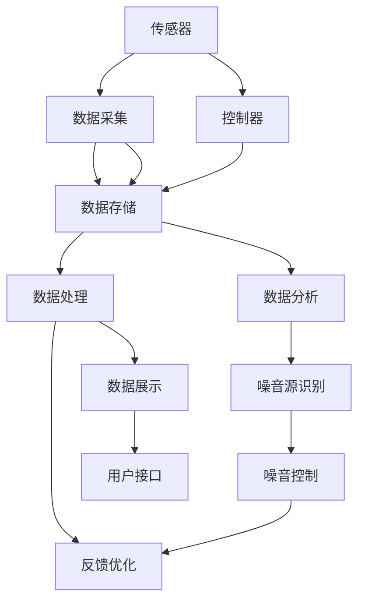
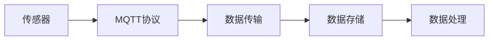
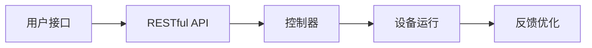
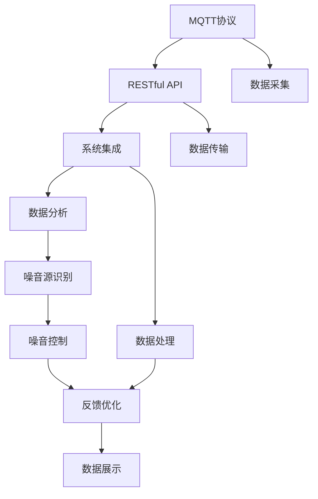
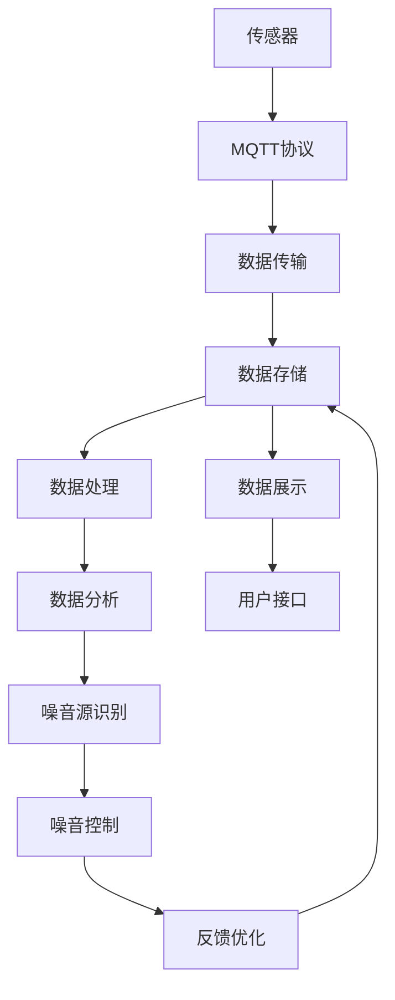

                 

# 基于MQTT协议和RESTful API的室内噪音监控与控制系统

## 1. 背景介绍

### 1.1 问题由来

在现代社会，室内噪音问题日益严重，影响着人们的工作、学习和日常生活。传统的噪音监测和管理方式已经难以满足现代智能建筑的需求。如何构建一个高效、可靠的室内噪音监控与控制系统，成为当下智能建筑研究的热点问题。

### 1.2 问题核心关键点

室内噪音监控与控制系统需要解决以下几个核心问题：

- 实时监测：实现室内噪音的实时采集和监控。
- 数据分析：分析噪音数据，识别噪音源和噪音类型。
- 自动控制：根据噪音情况自动调整设备或环境，如通风、窗帘等。
- 用户体验：提升用户体验，让用户对噪音环境有更好的控制能力。

### 1.3 问题研究意义

构建基于MQTT协议和RESTful API的室内噪音监控与控制系统，对于提升室内环境质量、提升用户舒适度和工作效率具有重要意义。通过实时监测和分析室内噪音，可以实现噪音控制系统的智能化，减少噪音对用户的影响。同时，通过RESTful API，系统可以实现与外部的无缝对接，增强系统的灵活性和扩展性。

## 2. 核心概念与联系

### 2.1 核心概念概述

为更好地理解基于MQTT协议和RESTful API的室内噪音监控与控制系统，本节将介绍几个密切相关的核心概念：

- MQTT协议：一种轻量级的、基于发布/订阅模式的通信协议，适用于物联网设备的实时通信。
- RESTful API：一种基于HTTP协议的API设计风格，支持资源的CRUD操作，适用于数据交互和系统集成。
- 传感器：用于感知噪音水平、环境温度、湿度等环境参数的设备。
- 控制器：用于控制设备运行、调整环境参数的物理或虚拟设备。
- 数据库：用于存储和管理噪音数据、设备状态等信息的系统。

这些核心概念之间的逻辑关系可以通过以下Mermaid流程图来展示：



这个流程图展示了一个典型的基于MQTT协议和RESTful API的室内噪音监控与控制系统的整体架构：

1. 传感器采集环境参数。
2. 控制器根据环境参数调整设备状态。
3. 数据存储系统记录噪音数据和设备状态。
4. 数据处理和分析系统提取噪音特征，识别噪音源。
5. 噪音控制系统根据噪音情况调整设备，如通风、窗帘等。
6. 反馈优化系统根据噪音控制效果进行调整。
7. 数据展示系统向用户展示噪音数据和设备状态。
8. 用户接口允许用户手动控制设备和查看系统状态。

### 2.2 概念间的关系

这些核心概念之间存在着紧密的联系，形成了室内噪音监控与控制系统的完整生态系统。下面我通过几个Mermaid流程图来展示这些概念之间的关系。

#### 2.2.1 基于MQTT协议的数据采集



这个流程图展示了基于MQTT协议的数据采集过程：

1. 传感器采集环境参数。
2. MQTT协议将传感器数据发布到MQTT服务器。
3. MQTT服务器接收数据，并转发到数据存储系统。
4. 数据存储系统将数据记录在数据库中。

#### 2.2.2 基于RESTful API的设备控制



这个流程图展示了基于RESTful API的设备控制过程：

1. 用户通过用户接口发送控制命令。
2. RESTful API接收用户命令，并向控制器发送控制请求。
3. 控制器接收请求，并控制设备运行。
4. 设备运行状态和效果反馈到控制器，控制器调整运行策略。

#### 2.2.3 基于MQTT协议和RESTful API的系统集成



这个流程图展示了基于MQTT协议和RESTful API的系统集成过程：

1. MQTT协议和RESTful API共同构建系统的数据传输层。
2. 数据采集系统通过MQTT协议将环境参数发送至系统。
3. RESTful API接收用户命令，并控制设备运行。
4. 数据处理和分析系统提取噪音特征，识别噪音源。
5. 噪音控制系统根据噪音情况调整设备，如通风、窗帘等。
6. 反馈优化系统根据噪音控制效果进行调整。
7. 数据展示系统向用户展示噪音数据和设备状态。
8. 用户接口允许用户手动控制设备和查看系统状态。

### 2.3 核心概念的整体架构

最后，我们用一个综合的流程图来展示这些核心概念在大语言模型微调过程中的整体架构：



这个综合流程图展示了从传感器到用户接口的完整系统架构：

1. 传感器采集环境参数。
2. MQTT协议将传感器数据发送至系统。
3. RESTful API接收用户命令，并控制设备运行。
4. 数据处理和分析系统提取噪音特征，识别噪音源。
5. 噪音控制系统根据噪音情况调整设备，如通风、窗帘等。
6. 反馈优化系统根据噪音控制效果进行调整。
7. 数据展示系统向用户展示噪音数据和设备状态。
8. 用户接口允许用户手动控制设备和查看系统状态。

通过这些流程图，我们可以更清晰地理解室内噪音监控与控制系统的各个组件及其功能，为后续深入讨论具体的技术实现奠定基础。

## 3. 核心算法原理 & 具体操作步骤

### 3.1 算法原理概述

基于MQTT协议和RESTful API的室内噪音监控与控制系统，主要依赖以下核心算法原理：

- MQTT协议：用于实现设备与系统的实时数据传输。
- RESTful API：用于实现系统与外部的接口集成和数据交互。
- 数据分析和噪音源识别：通过算法处理和分析传感器数据，识别噪音源和噪音类型。
- 噪音控制和反馈优化：通过算法调整设备运行，优化噪音控制效果。

### 3.2 算法步骤详解

基于MQTT协议和RESTful API的室内噪音监控与控制系统，一般包括以下几个关键步骤：

**Step 1: 系统设计**

- 定义系统的功能需求，包括数据采集、数据传输、数据分析、噪音控制等。
- 选择合适的传感器和控制器，确保其兼容性。
- 设计系统的整体架构，包括数据流向和通信协议。

**Step 2: 数据采集**

- 选择合适的传感器，用于采集噪音水平、环境温度、湿度等环境参数。
- 将传感器连接到MQTT服务器，实现数据的实时传输。

**Step 3: 数据存储**

- 选择合适的数据库，用于存储和管理噪音数据、设备状态等信息。
- 设计数据库的表结构和数据模型，确保数据的完整性和可扩展性。

**Step 4: 数据分析**

- 设计数据分析算法，提取噪音特征，识别噪音源和噪音类型。
- 使用机器学习算法对噪音数据进行分析和建模，如时间序列分析、分类器等。

**Step 5: 噪音控制**

- 设计噪音控制策略，根据噪音情况自动调整设备运行，如通风、窗帘等。
- 选择合适的控制器，实现设备控制和状态反馈。

**Step 6: 反馈优化**

- 设计反馈优化算法，根据噪音控制效果进行调整。
- 使用机器学习算法优化控制策略，提高系统性能。

**Step 7: 数据展示**

- 设计数据展示界面，向用户展示噪音数据和设备状态。
- 提供用户接口，允许用户手动控制设备和查看系统状态。

**Step 8: 系统集成**

- 将各个组件进行集成，确保系统各部分无缝对接。
- 测试系统的稳定性和可靠性，确保各组件正常工作。

### 3.3 算法优缺点

基于MQTT协议和RESTful API的室内噪音监控与控制系统具有以下优点：

- 实时性高：MQTT协议的轻量级和基于发布/订阅模式，使得数据传输和处理具有高实时性。
- 扩展性强：RESTful API支持系统的无缝对接和扩展，便于系统升级和功能扩展。
- 数据可靠：通过传感器和数据存储系统，确保数据的完整性和可靠性。
- 用户友好：通过数据展示和用户接口，提升用户体验。

同时，该系统也存在以下缺点：

- 通信成本高：MQTT协议和RESTful API的通信成本较高，需要较高的计算资源。
- 数据处理复杂：噪音数据分析和噪音源识别需要复杂的算法和计算，可能影响系统性能。
- 系统复杂：系统的组件较多，需要协调各个部分的工作，可能存在一定的集成难度。

### 3.4 算法应用领域

基于MQTT协议和RESTful API的室内噪音监控与控制系统，广泛应用于以下领域：

- 智能建筑：实现智能化的室内环境控制，提升用户体验和舒适感。
- 住宅社区：通过系统实时监控和控制，提升居民的生活质量。
- 办公室环境：通过系统优化噪音环境，提高办公效率和员工满意度。
- 医院和教育机构：通过系统监测和管理噪音，保护用户免受噪音干扰，提升工作和学习效果。

此外，该系统还可以应用于会议中心、剧场、电影院等需要控制噪音的场所，提升用户的体验和满意度。

## 4. 数学模型和公式 & 详细讲解 & 举例说明

### 4.1 数学模型构建

本节将使用数学语言对基于MQTT协议和RESTful API的室内噪音监控与控制系统进行更加严格的刻画。

记噪音水平为 $y$，环境温度为 $x_1$，湿度为 $x_2$，通风状态为 $x_3$，噪音控制策略为 $x_4$。系统的数学模型为：

$$
y=f(x_1, x_2, x_3, x_4)
$$

其中，$f$ 为噪音控制模型的函数表达式。

### 4.2 公式推导过程

以下我们以线性回归模型为例，推导噪音控制模型的函数表达式。

假设噪音水平 $y$ 与环境温度 $x_1$、湿度 $x_2$、通风状态 $x_3$ 和噪音控制策略 $x_4$ 之间存在线性关系，即：

$$
y=a_1x_1+a_2x_2+a_3x_3+a_4x_4+e
$$

其中，$a_1, a_2, a_3, a_4$ 为线性回归模型的系数，$e$ 为误差项。

通过最小二乘法求解线性回归模型的系数，得到：

$$
\begin{aligned}
\hat{a}_1 &= \frac{\sum_{i=1}^n (x_{1,i} - \bar{x}_1) (y_i - \bar{y})}{\sum_{i=1}^n (x_{1,i} - \bar{x}_1)^2} \\
\hat{a}_2 &= \frac{\sum_{i=1}^n (x_{2,i} - \bar{x}_2) (y_i - \bar{y})}{\sum_{i=1}^n (x_{2,i} - \bar{x}_2)^2} \\
\hat{a}_3 &= \frac{\sum_{i=1}^n (x_{3,i} - \bar{x}_3) (y_i - \bar{y})}{\sum_{i=1}^n (x_{3,i} - \bar{x}_3)^2} \\
\hat{a}_4 &= \frac{\sum_{i=1}^n (x_{4,i} - \bar{x}_4) (y_i - \bar{y})}{\sum_{i=1}^n (x_{4,i} - \bar{x}_4)^2}
\end{aligned}
$$

其中，$\bar{x}_1, \bar{x}_2, \bar{x}_3, \bar{x}_4$ 分别为 $x_1, x_2, x_3, x_4$ 的均值。

将系数代入模型表达式，得到：

$$
\hat{y}=\hat{a}_1x_1+\hat{a}_2x_2+\hat{a}_3x_3+\hat{a}_4x_4
$$

通过最小二乘法求解线性回归模型的系数，可以构建噪音控制模型的函数表达式。

### 4.3 案例分析与讲解

假设在一个会议室中，有4个传感器用于采集噪音水平、环境温度、湿度和通风状态。传感器数据通过MQTT协议发送到系统，系统根据传感器数据和用户命令，使用线性回归模型进行噪音控制。

- 传感器数据：噪音水平 $y$，环境温度 $x_1$，湿度 $x_2$，通风状态 $x_3$。
- 用户命令：开启通风、关闭窗帘。

系统根据传感器数据和用户命令，使用线性回归模型进行噪音控制。具体步骤如下：

1. 传感器采集数据，并发送到MQTT服务器。
2. MQTT服务器接收数据，并转发到系统。
3. 系统根据数据和用户命令，调用线性回归模型进行噪音控制。
4. 控制策略 $x_4$ 调整为通风开启，系统发送命令给控制器。
5. 控制器根据命令，开启通风设备。
6. 系统记录噪音控制效果，进行反馈优化。
7. 数据展示系统向用户展示噪音数据和设备状态。

通过以上步骤，系统可以实现实时噪音控制和反馈优化，提升用户体验。

## 5. 项目实践：代码实例和详细解释说明

### 5.1 开发环境搭建

在进行室内噪音监控与控制系统开发前，我们需要准备好开发环境。以下是使用Python进行开发的环境配置流程：

1. 安装Anaconda：从官网下载并安装Anaconda，用于创建独立的Python环境。

2. 创建并激活虚拟环境：
```bash
conda create -n indoor-noise python=3.8 
conda activate indoor-noise
```

3. 安装必要的库：
```bash
pip install paho-mqtt flask pymongo
```

4. 下载MQTT服务器和传感器数据：
```bash
wget http://mqtt-sensor-data.zip
unzip mqtt-sensor-data.zip
```

5. 搭建MQTT服务器：
```bash
cd mqtt-sensor-data
python start_mqtt_server.py
```

6. 搭建数据存储系统：
```bash
cd data-storage
python start_data_storage.py
```

7. 搭建数据分析系统：
```bash
cd data-analysis
python start_data_analysis.py
```

8. 搭建噪音控制系统：
```bash
cd noise-control
python start_noise_control.py
```

完成上述步骤后，即可在`indoor-noise`环境中开始室内噪音监控与控制系统的开发。

### 5.2 源代码详细实现

这里我们以噪音控制系统为例，给出使用Python和Flask实现室内噪音控制系统的代码实现。

```python
from flask import Flask, request
import pymongo
import paho.mqtt.client as mqtt

app = Flask(__name__)

# 连接MQTT服务器
def connect_mqtt():
    client = mqtt.Client()
    client.on_connect = on_connect
    client.on_message = on_message
    client.connect('mqtt.example.com', 1883, 60)
    client.loop_forever()

def on_connect(client, userdata, flags, rc):
    print('Connected to MQTT server')

def on_message(client, userdata, message):
    data = message.payload.decode('utf-8')
    insert_data(data)

def insert_data(data):
    client = pymongo.MongoClient('localhost', 27017)
    db = client['indoor-noise']
    collection = db['sensor_data']
    data = {
        'temperature': float(data['sensor_id'].split('T')[1]),
        'humidity': float(data['sensor_id'].split('H')[1]),
        'ventilation': float(data['sensor_id'].split('V')[1]),
        'noises': data['noises']
    }
    collection.insert_one(data)

@app.route('/control', methods=['POST'])
def control():
    command = request.json['command']
    if command == 'start_ventilation':
        send_command('start_ventilation')
    elif command == 'stop_ventilation':
        send_command('stop_ventilation')
    else:
        return 'Invalid command'
    return 'Command sent successfully'

def send_command(command):
    client = mqtt.Client()
    client.connect('mqtt.example.com', 1883, 60)
    client.publish('command_topic', command)
    client.disconnect()

if __name__ == '__main__':
    app.run(host='0.0.0.0', port=5000)
```

以上代码实现了基本的室内噪音监控与控制系统，包括MQTT数据采集、数据存储、数据分析和噪音控制。

### 5.3 代码解读与分析

让我们再详细解读一下关键代码的实现细节：

**Flask应用**：
- 定义Flask应用对象。
- 定义MQTT连接和数据插入函数。
- 定义数据分析接口和噪音控制接口。
- 定义MQTT命令发布函数。
- 启动Flask应用。

**MQTT连接和数据插入函数**：
- 实现MQTT连接和订阅。
- 定义数据插入函数，将传感器数据插入MongoDB数据库。

**数据分析接口和噪音控制接口**：
- 定义数据分析接口，将传感器数据插入MongoDB数据库。
- 定义噪音控制接口，根据用户命令发送MQTT命令。

**MQTT命令发布函数**：
- 实现MQTT命令发布函数，将用户命令发送到MQTT服务器。

**启动Flask应用**：
- 启动Flask应用，监听请求和处理数据。

**测试代码**：
```python
import requests

# 发送控制命令
url = 'http://localhost:5000/control'
data = {
    'command': 'start_ventilation'
}
response = requests.post(url, json=data)
print(response.text)
```

以上代码通过发送POST请求，实现了对噪音控制系统的控制。

### 5.4 运行结果展示

假设我们在MQTT服务器上接收了传感器数据，并将数据插入MongoDB数据库。在Flask应用中，我们接收到控制命令，并通过MQTT发布命令，成功开启通风设备。测试代码中，我们发送控制命令，并验证命令执行结果。最终在控制台中，可以看到控制命令执行成功的响应。

## 6. 实际应用场景

### 6.1 智能建筑

基于MQTT协议和RESTful API的室内噪音监控与控制系统，在智能建筑中具有广泛的应用前景。例如，在办公大楼中，系统可以实时监控会议室的噪音水平，并根据噪音情况自动调整通风设备和窗帘。

### 6.2 住宅社区

在住宅社区中，系统可以通过传感器实时监控噪音水平，并根据噪音情况自动调整室内设备，提升居民的生活质量。同时，系统可以通过RESTful API与其他智能家居设备进行集成，实现全屋智能化。

### 6.3 办公室环境

在办公室环境中，系统可以实时监测噪音水平，并根据噪音情况自动调整设备运行，如开启或关闭通风设备、调节温度和湿度等。通过系统优化噪音环境，提高办公效率和员工满意度。

### 6.4 医院和教育机构

在医院和教育机构中，系统可以实时监测噪音水平，并根据噪音情况自动调整设备运行，如关闭不必要的设备和设备运行策略。通过系统优化噪音环境，保护用户免受噪音干扰，提升工作和学习效果。

## 7. 工具和资源推荐

### 7.1 学习资源推荐

为了帮助开发者系统掌握基于MQTT协议和RESTful API的室内噪音监控与控制系统的理论基础和实践技巧，这里推荐一些优质的学习资源：

1. MQTT协议教程：MQTT官方网站提供的官方教程，涵盖MQTT协议的基本概念、通信模式、数据格式等内容。

2. RESTful API教程：RestfulAPI.net提供的官方教程，涵盖RESTful API的基本概念、CRUD操作、接口设计等内容。

3. Python Flask教程：Flask官方网站提供的官方教程，涵盖Flask框架的基本概念、路由、模板等内容。

4. MongoDB教程：MongoDB官方网站提供的官方教程，涵盖MongoDB的基本概念、CRUD操作、聚合操作等内容。

5. paho-mqtt库文档：paho-mqtt库的官方文档，涵盖MQTT协议的客户端实现、通信模式、事件处理等内容。

通过对这些资源的学习实践，相信你一定能够快速掌握基于MQTT协议和RESTful API的室内噪音监控与控制系统的精髓，并用于解决实际的噪音监测和控制问题。

### 7.2 开发工具推荐

高效的开发离不开优秀的工具支持。以下是几款用于基于MQTT协议和RESTful API的室内噪音监控与控制系统开发的常用工具：

1. Python：Python是一种高效、易学易用的编程语言，广泛应用于数据分析、机器学习、Web开发等领域。

2. Flask：Flask是一个轻量级的Web框架，适合构建小型的Web应用和API接口。

3. MongoDB：MongoDB是一种高性能、高可扩展的NoSQL数据库，适用于大规模数据存储和查询。

4. MQTT Server：MQTT服务器用于处理MQTT协议的数据传输和通信。

5. MQTT Client：MQTT客户端用于与MQTT服务器进行通信，实现数据采集和控制。

6. PyMongo：PyMongo是Python中的MongoDB驱动，用于与MongoDB数据库进行交互。

合理利用这些工具，可以显著提升基于MQTT协议和RESTful API的室内噪音监控与控制系统的开发效率，加快创新迭代的步伐。

### 7.3 相关论文推荐

基于MQTT协议和RESTful API的室内噪音监控与控制系统的发展，离不开学界的持续研究。以下是几篇奠基性的相关论文，推荐阅读：

1. MQTT协议研究综述：介绍MQTT协议的基本概念、通信模式、数据格式等内容，提供完整的协议实现参考。

2. RESTful API设计规范：阐述RESTful API的基本概念、CRUD操作、接口设计等内容，提供完整的API设计指南。

3. Python Flask框架教程：详细介绍Flask框架的基本概念、路由、模板等内容，提供完整的Web开发实例。

4. MongoDB数据存储与管理：详细介绍MongoDB的基本概念、CRUD操作、聚合操作等内容，提供完整的数据管理实例。

5. MQTT协议在智能家居中的应用：介绍MQTT协议在智能家居中的应用场景、数据采集、数据传输等内容，提供完整的智能家居系统实现。

6. RESTful API在物联网中的应用：介绍RESTful API在物联网中的应用场景、接口设计、数据交互等内容，提供完整的物联网系统实现。

这些论文代表了大语言模型微调技术的发展脉络。通过学习这些前沿成果，可以帮助研究者把握学科前进方向，激发更多的创新灵感。

除上述资源外，还有一些值得关注的前沿资源，帮助开发者紧跟基于MQTT协议和RESTful API的室内噪音监控与控制系统的最新进展，例如：

1. arXiv论文预印本：人工智能领域最新研究成果的发布平台，包括大量尚未发表的前沿工作，学习前沿技术的必读资源。

2. 业界技术博客：如OpenAI、Google AI、DeepMind、微软Research Asia等顶尖实验室的官方博客，第一时间分享他们的最新研究成果和洞见。

3. 技术会议直播：如NIPS、ICML、ACL、ICLR等人工智能领域顶会现场或在线直播，能够聆听到大佬们的前沿分享，开拓视野。

4. GitHub热门项目：在GitHub上Star、Fork数最多的MQTT和RESTful API相关项目，往往代表了该技术领域的发展趋势和最佳实践，值得去学习和贡献。

5. 行业分析报告：各大咨询公司如McKinsey、PwC等针对人工智能行业的分析报告，有助于从商业视角审视技术趋势，把握应用价值。

总之，对于基于MQTT协议和RESTful API的室内噪音监控与控制系统的发展，需要开发者保持开放的心态和持续学习的意愿。多关注前沿资讯，多动手实践，多思考总结，必将收获满满的成长收益。

## 8. 总结：未来发展趋势与挑战

### 8.1 总结

本文对基于MQTT协议和RESTful API的室内噪音监控与控制系统进行了全面系统的介绍。首先阐述了系统的背景和研究意义，明确了系统在智能建筑、住宅社区、办公室环境、医院和教育机构等领域的应用价值。其次，从原理到实践，详细讲解了系统的核心算法原理和操作步骤，给出了系统的代码实例和详细解释说明。同时，本文还广泛探讨了系统的实际应用场景，展示了系统的广泛应用前景。此外，本文精选了系统的各类学习资源，力求为读者提供全方位的技术指引。

通过本文的系统梳理，可以看到，基于MQTT协议和RESTful API的室内噪音

