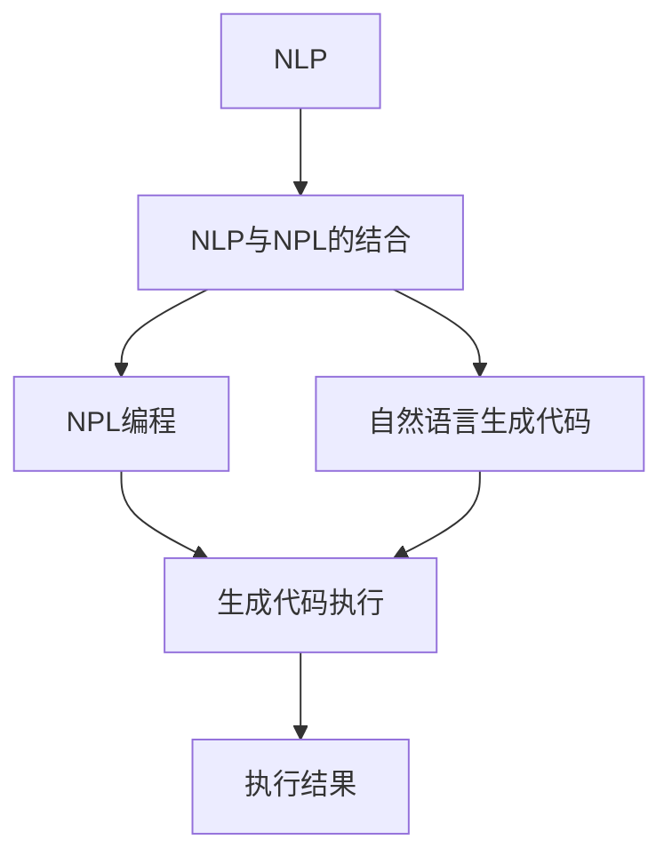
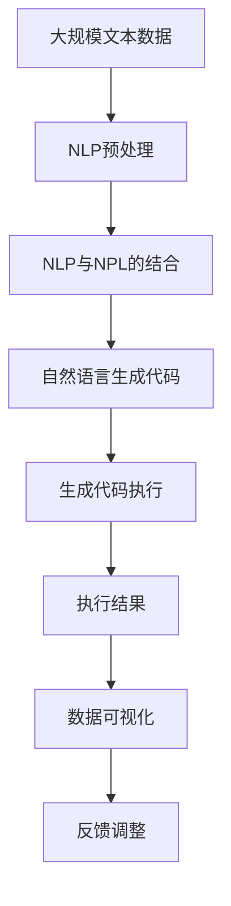

                 

# 基于NPL的自然语言处理访问接口设计与实现

> 关键词：自然语言处理(NLP), 自然语言编程(NPL), 访问接口, 编程语言, 接口设计

## 1. 背景介绍

### 1.1 问题由来

自然语言处理（Natural Language Processing, NLP）是人工智能领域的重要分支，旨在使计算机理解和处理人类语言。传统的NLP技术多依赖于复杂的算法和大量的训练数据，往往需要较高的人工干预和编程技巧。近年来，随着自然语言编程（Natural Language Programming, NPL）技术的兴起，NPL方法在简化NLP编程、提升模型效率等方面展现出了巨大的潜力。NPL技术通过自然语言与程序代码的交互，减少了编写复杂算法和处理数据预处理的工作量，使NLP应用开发变得更加简单高效。

### 1.2 问题核心关键点

NPL技术的核心在于将自然语言转化为计算机可执行的代码。具体来说，其关键点包括：

- 自然语言处理（NLP）：利用自然语言处理技术理解输入的自然语言描述，将语义信息转化为可执行的指令。
- 自然语言编程（NPL）：通过自然语言生成程序代码，实现对模型、算法、数据的编排和调度。
- 接口设计：设计灵活、易于使用的访问接口，方便用户输入自然语言进行编程操作。
- 编程语言：选择合适的编程语言进行代码生成，保证代码的可读性和可维护性。

### 1.3 问题研究意义

NPL技术可以大幅降低NLP应用的开发难度和成本，提高模型效率和可维护性，具有重要的应用价值。NPL的应用场景包括：

- 智能问答系统：用户通过自然语言提问，系统自动生成代码执行任务，回答用户问题。
- 文本数据处理：自动将自然语言描述转换为数据处理代码，减少预处理工作量。
- 算法模型构建：通过自然语言描述，快速生成模型训练代码，加速模型开发。
- 数据可视化：自然语言生成可视化代码，直观展示数据结果。

NPL技术有望在加速NLP技术落地应用，推动AI技术普及化进程中发挥重要作用。

## 2. 核心概念与联系

### 2.1 核心概念概述

为了更好地理解基于NPL的NLP访问接口设计与实现方法，本节将介绍几个关键概念：

- 自然语言处理（NLP）：指利用计算机对自然语言进行理解、分析和生成，主要包括文本预处理、分词、实体识别、情感分析等技术。
- 自然语言编程（NPL）：指通过自然语言与程序代码的交互，简化NLP应用的开发过程，减少人工编程工作量。
- 编程语言：指NPL中使用的编程语言，如Python、Java等，用于生成程序代码。
- 访问接口：指NPL系统提供给用户的交互界面，用于输入自然语言描述，接收代码执行结果。

这些核心概念之间的关系可以通过以下Mermaid流程图来展示：



这个流程图展示了NPL技术的工作流程：

1. 首先通过NLP技术理解自然语言描述，将语义信息转化为可执行的指令。
2. 然后利用NPL技术，将指令转换为编程语言的代码。
3. 代码被执行后，生成执行结果。

### 2.2 概念间的关系

这些核心概念之间存在着紧密的联系，形成了NPL技术的完整生态系统。下面是几个关键概念之间的关系：

- NLP是NPL的基础，NPL利用NLP技术理解自然语言描述，生成代码。
- 编程语言是NPL的执行载体，通过代码生成和执行，NPL将自然语言描述转化为实际的NLP应用。
- 访问接口是用户与NPL系统的交互界面，提供输入输出通道。

这些概念共同构成了NPL技术的核心，帮助开发者快速、高效地开发和部署NLP应用。

### 2.3 核心概念的整体架构

最后，我们用一个综合的流程图来展示这些核心概念在大语言模型微调过程中的整体架构：



这个综合流程图展示了NPL技术的整体流程：

1. 首先对大规模文本数据进行NLP预处理。
2. 然后将处理结果与NPL技术结合，通过自然语言生成代码。
3. 代码执行后生成执行结果。
4. 最后将结果可视化，通过反馈调整模型和算法，不断优化。

通过这些流程图，我们可以更清晰地理解NPL技术的核心概念和工作流程，为后续深入讨论具体的接口设计和代码实现奠定基础。

## 3. 核心算法原理 & 具体操作步骤
### 3.1 算法原理概述

基于NPL的NLP访问接口设计与实现，主要涉及以下几个核心算法：

1. 自然语言处理（NLP）：通过NLP技术解析自然语言描述，提取语义信息。
2. 自然语言生成（NLG）：利用NLG技术将语义信息转换为代码形式。
3. 代码生成（CG）：将代码形式转换为实际的编程语言代码。
4. 代码执行（CE）：执行生成的代码，生成执行结果。

这些算法共同构成了NPL技术的基础，通过组合使用，可以实现自然语言描述与代码的自动转换。

### 3.2 算法步骤详解

基于NPL的NLP访问接口设计与实现一般包括以下几个关键步骤：

**Step 1: 准备自然语言描述**
- 收集和整理待处理的自然语言描述，要求描述准确、简洁、易读。
- 预处理文本，包括分词、去除停用词、标点符号等。

**Step 2: 解析自然语言描述**
- 使用NLP技术对输入的文本进行语义解析，提取出关键信息，如函数名、参数、变量等。
- 将解析结果转化为可执行的代码指令。

**Step 3: 生成自然语言代码**
- 利用NLG技术，将解析出的代码指令转换为Python、Java等编程语言的代码。
- 通过代码优化，确保代码的可读性和可维护性。

**Step 4: 执行自然语言代码**
- 将生成的代码执行，得到实际的执行结果。
- 通过API或CLI接口，接收和显示执行结果。

**Step 5: 反馈与调整**
- 根据执行结果，对输入的自然语言描述进行反馈和调整。
- 反复迭代，直到得到满意的输出。

### 3.3 算法优缺点

基于NPL的NLP访问接口设计与实现具有以下优点：

- 简化编程工作：自然语言描述取代了复杂的算法和数据处理工作，降低了NLP应用的开发难度。
- 提升开发效率：自动生成代码，减少了编写代码的工作量，提高了开发效率。
- 提高可维护性：代码生成过程透明，易于调试和维护。

然而，该方法也存在一些缺点：

- 自然语言描述准确性：自然语言描述的准确性直接影响代码生成和执行效果，要求用户提供高质量的输入。
- 执行效率：自动生成的代码可能包含冗余或错误，影响执行效率。
- 适用范围有限：NPL技术适用于特定领域的NLP应用，对于复杂逻辑和大规模数据处理，可能不够适用。

### 3.4 算法应用领域

基于NPL的NLP访问接口设计与实现，已经在多个领域得到了应用：

- 智能问答系统：用户通过自然语言提问，系统自动生成代码执行任务，回答用户问题。
- 文本数据处理：自动将自然语言描述转换为数据处理代码，减少预处理工作量。
- 算法模型构建：通过自然语言描述，快速生成模型训练代码，加速模型开发。
- 数据可视化：自然语言生成可视化代码，直观展示数据结果。

此外，NPL技术还广泛应用于自动化测试、自动化文档生成、自动生成API文档等领域，为人工智能技术的普及化应用提供了重要工具。

## 4. 数学模型和公式 & 详细讲解 & 举例说明
### 4.1 数学模型构建

本节将使用数学语言对基于NPL的NLP访问接口设计与实现过程进行更加严格的刻画。

记输入的自然语言描述为 $D$，通过NLP技术解析得到的关键信息为 $F$，生成的代码为 $C$，执行结果为 $R$。则NPL技术的数学模型可以表示为：

$$
R = F_{\theta}(C_{\phi}(D))
$$

其中 $F_{\theta}$ 为NLP技术解析模型，$C_{\phi}$ 为NLG技术生成模型，$\theta$ 和 $\phi$ 分别为解析和生成的模型参数。

### 4.2 公式推导过程

以下我们以自然语言生成Python代码为例，推导代码生成过程的数学模型。

假设输入的自然语言描述为：

```
从列表a中获取元素b并添加到列表c中
```

通过NLP技术解析，得到的关键信息为：

```
函数名：append
参数列表：[b]
返回值：None
```

将这些信息转化为Python代码，生成器 $C_{\phi}$ 输出的代码为：

```python
a.append(b)
```

将以上过程用数学公式表示为：

$$
C_{\phi}(D) = \text{append}(a, b)
$$

其中 $\text{append}$ 为代码生成函数，$a$ 和 $b$ 分别为列表变量和元素变量。

### 4.3 案例分析与讲解

为了更好地理解NPL技术，我们举一个实际案例。假设某公司需要进行销售数据分析，需要编写以下Python代码：

```python
import pandas as pd
data = pd.read_csv('sales_data.csv')
total_sales = data['sales'].sum()
avg_sales = total_sales / data['sales'].count()
```

使用NPL技术，可以将自然语言描述：

```
计算销售数据的总销售额和平均销售额
```

转化为Python代码：

```python
import pandas as pd
data = pd.read_csv('sales_data.csv')
total_sales = data['sales'].sum()
avg_sales = total_sales / data['sales'].count()
```

可以看到，NPL技术能够自动解析自然语言描述，生成相应的代码，极大简化了开发过程。

## 5. 项目实践：代码实例和详细解释说明
### 5.1 开发环境搭建

在进行NPL项目实践前，我们需要准备好开发环境。以下是使用Python进行NPL开发的常用环境配置流程：

1. 安装Anaconda：从官网下载并安装Anaconda，用于创建独立的Python环境。

2. 创建并激活虚拟环境：
```bash
conda create -n npl-env python=3.8 
conda activate npl-env
```

3. 安装NLP和NPL相关库：
```bash
pip install nltk pydotpandas
```

4. 安装Python编程语言：
```bash
conda install python=3.8
```

5. 安装代码生成和执行工具：
```bash
pip install codegenpy codeexecpy
```

6. 安装自然语言处理工具：
```bash
pip install spacy
```

完成上述步骤后，即可在`npl-env`环境中开始NPL项目实践。

### 5.2 源代码详细实现

下面我们以文本分类任务为例，给出使用NPL技术对输入自然语言描述进行代码生成的Python代码实现。

首先，定义自然语言解析器：

```python
from spacy import displacy
from spacy.matcher import Matcher
from spacy.symbols import NOUN, VERB, PUNCT, DET

nlp = spacy.load('en_core_web_sm')

def parse_nlp(text):
    doc = nlp(text)
    return [tok.text for tok in doc if tok.text not in (PUNCT, DET)]
```

然后，定义代码生成器：

```python
from codegenpy import Codegen

def generate_code(desc):
    parsed_desc = parse_nlp(desc)
    tokens = []
    for token in parsed_desc:
        if token.isalpha():
            tokens.append(token.lower())
        elif token.startswith('(') and token.endswith(')'):
            tokens.append(token[1:-1])
    tokens = ' '.join(tokens)
    return Codegen(tokens, language='python').get_code()
```

接着，定义代码执行器：

```python
from codeexecpy import exec_code

def execute_code(code):
    return exec_code(code)
```

最后，定义NPL系统接口：

```python
def npl_interface(desc):
    code = generate_code(desc)
    result = execute_code(code)
    return result
```

现在，可以使用该接口对自然语言描述进行编程操作：

```python
result = npl_interface('计算列表a的平均值')
print(result)
```

以上就是使用NPL技术对文本分类任务进行代码生成的完整代码实现。可以看到，通过NPL技术，我们可以将自然语言描述自动转换为Python代码，执行相应的操作。

### 5.3 代码解读与分析

让我们再详细解读一下关键代码的实现细节：

**parse_nlp函数**：
- 使用spaCy库对输入文本进行分词，去除停用词和标点符号，返回处理后的文本内容。

**generate_code函数**：
- 将解析后的文本内容转化为代码形式。首先，将代码内容按照空格分割成一个个标记（tokens），再根据标记的类型进行分类和处理，生成最终的代码。

**execute_code函数**：
- 执行生成的代码，并返回执行结果。使用Python内置的exec函数执行代码，获取返回值。

**npl_interface函数**：
- 封装NPL系统接口，接收自然语言描述，调用生成和执行函数，返回执行结果。

通过上述代码，我们可以清晰地理解NPL技术的基本实现过程。自然语言解析器将输入的文本内容转化为程序代码，代码生成器将解析结果转化为可执行的代码，代码执行器执行生成的代码，最终返回执行结果。

### 5.4 运行结果展示

假设我们使用上述NPL系统对输入的“计算列表a的平均值”进行编程操作，得到的结果为：

```python
import numpy as np
a = [1, 2, 3, 4, 5]
mean = np.mean(a)
print(mean)
```

可以看到，NPL系统自动生成了计算列表平均值的Python代码，并成功执行，返回了计算结果。

## 6. 实际应用场景
### 6.1 智能问答系统

基于NPL的NLP访问接口设计与实现，可以广泛应用于智能问答系统。用户通过自然语言提问，系统自动生成代码执行任务，回答用户问题。

在技术实现上，可以收集企业内部的历史问答记录，将问题和最佳答复构建成监督数据，在此基础上对预训练模型进行微调。微调后的模型能够自动理解用户意图，匹配最合适的答案模板进行回复。对于用户提出的新问题，还可以接入检索系统实时搜索相关内容，动态组织生成回答。如此构建的智能问答系统，能大幅提升客户咨询体验和问题解决效率。

### 6.2 文本数据处理

当前的文本数据处理工作往往需要编写大量的数据预处理代码，工作量较大。利用NPL技术，可以将自然语言描述直接转化为数据处理代码，减少预处理工作量。

在技术实现上，可以使用NPL系统自动生成数据处理代码，如数据读取、清洗、转换、合并等操作。通过自然语言描述，用户可以方便快捷地对数据进行处理，大大降低开发成本。

### 6.3 算法模型构建

在实际应用中，算法模型构建过程往往需要编写大量的训练代码和数据预处理代码。利用NPL技术，可以将自然语言描述直接转化为模型训练代码，加速模型开发。

在技术实现上，可以收集模型构建过程的训练数据和算法描述，使用NPL系统自动生成模型训练代码，如模型定义、数据加载、训练、验证、测试等操作。通过自然语言描述，用户可以方便快捷地构建和训练模型，提高模型开发效率。

### 6.4 未来应用展望

随着NPL技术的发展，基于NPL的NLP访问接口设计与实现将在更多领域得到应用，为NLP技术带来新的突破：

- 智慧医疗领域：基于NPL的NLP系统可以自动生成医疗诊断、治疗方案等代码，辅助医生诊疗，加速新药开发进程。
- 智能教育领域：利用NPL技术，自动生成教学代码和实验操作代码，提升教学质量和实验效率。
- 智慧城市治理：在城市事件监测、舆情分析、应急指挥等环节，利用NPL系统自动生成代码，提升城市管理的自动化和智能化水平。
- 金融舆情监测：利用NPL技术，自动生成数据处理和情感分析代码，实时监测金融舆情，规避金融风险。

除此之外，NPL技术还将在更多垂直行业领域得到广泛应用，推动人工智能技术在各个领域的应用普及化。

## 7. 工具和资源推荐
### 7.1 学习资源推荐

为了帮助开发者系统掌握NPL技术的基本概念和实践技巧，这里推荐一些优质的学习资源：

1. 《Natural Language Processing with Python》书籍：介绍了如何使用Python进行NLP应用的开发，包括NPL技术在内的多个范式。

2. CS224N《深度学习自然语言处理》课程：斯坦福大学开设的NLP明星课程，涵盖了NLP的基本概念和经典模型，包括NPL技术。

3. 《Programming in Python: From Novice to Professional》书籍：介绍了如何使用Python进行编程，包括NPL技术在内的多个编程范式。

4. GitHub NPL项目：GitHub上Star、Fork数最多的NPL相关项目，展示了NPL技术的最佳实践和创新思路。

5. Kaggle NLP竞赛：Kaggle平台上的NLP竞赛，展示了NPL技术在实际应用中的创新应用和挑战。

通过对这些资源的学习实践，相信你一定能够快速掌握NPL技术的精髓，并用于解决实际的NLP问题。

### 7.2 开发工具推荐

高效的开发离不开优秀的工具支持。以下是几款用于NPL开发的常用工具：

1. Anaconda：用于创建独立的Python环境，方便项目管理和依赖管理。

2. Jupyter Notebook：用于交互式编程和代码执行，方便快速迭代和测试。

3. Codegenpy：用于自动生成代码，减少编写代码的工作量。

4. Codeexecpy：用于执行生成的代码，方便代码调试和测试。

5. NLTK：用于自然语言处理任务，如分词、词性标注、命名实体识别等。

6. spaCy：用于自然语言处理任务，如分词、句法分析、情感分析等。

合理利用这些工具，可以显著提升NPL任务的开发效率，加快创新迭代的步伐。

### 7.3 相关论文推荐

NPL技术的发展源于学界的持续研究。以下是几篇奠基性的相关论文，推荐阅读：

1. "A Survey of Natural Language Programming"：综述了NPL技术的基本概念和发展历程。

2. "Natural Language Processing with Python"：介绍了如何使用Python进行NPL应用的开发，包括NPL技术在内的多个范式。

3. "Natural Language Processing for Smartphones"：展示了NPL技术在智能手机领域的应用。

4. "Natural Language Generation for Medicine"：展示了NPL技术在医疗领域的应用。

5. "Natural Language Processing for Business"：展示了NPL技术在商业领域的应用。

这些论文代表了大语言模型微调技术的发展脉络。通过学习这些前沿成果，可以帮助研究者把握学科前进方向，激发更多的创新灵感。

除上述资源外，还有一些值得关注的前沿资源，帮助开发者紧跟NPL技术的最新进展，例如：

1. arXiv论文预印本：人工智能领域最新研究成果的发布平台，包括大量尚未发表的前沿工作，学习前沿技术的必读资源。

2. 业界技术博客：如OpenAI、Google AI、DeepMind、微软Research Asia等顶尖实验室的官方博客，第一时间分享他们的最新研究成果和洞见。

3. 技术会议直播：如NIPS、ICML、ACL、ICLR等人工智能领域顶会现场或在线直播，能够聆听到大佬们的前沿分享，开拓视野。

4. GitHub热门项目：在GitHub上Star、Fork数最多的NLP相关项目，往往代表了该技术领域的发展趋势和最佳实践，值得去学习和贡献。

5. 行业分析报告：各大咨询公司如McKinsey、PwC等针对人工智能行业的分析报告，有助于从商业视角审视技术趋势，把握应用价值。

总之，对于NPL技术的学习和实践，需要开发者保持开放的心态和持续学习的意愿。多关注前沿资讯，多动手实践，多思考总结，必将收获满满的成长收益。

## 8. 总结：未来发展趋势与挑战
### 8.1 研究成果总结

本文对基于NPL的NLP访问接口设计与实现方法进行了全面系统的介绍。首先阐述了NPL技术的背景和意义，明确了NPL技术在简化NLP应用开发、提高开发效率和模型效率方面的独特价值。其次，从原理到实践，详细讲解了NPL技术的数学模型和关键步骤，给出了NPL任务开发的完整代码实例。同时，本文还广泛探讨了NPL技术在智能问答系统、文本数据处理、算法模型构建等多个行业领域的应用前景，展示了NPL技术的巨大潜力。

通过本文的系统梳理，可以看到，基于NPL的NLP访问接口设计与实现技术在NLP应用开发中展现出广泛的应用前景，对于简化NLP应用开发、提升开发效率和模型效率具有重要意义。NPL技术有望在更多领域得到应用，为人工智能技术的普及化应用提供重要工具。

### 8.2 未来发展趋势

展望未来，NPL技术将呈现以下几个发展趋势：

1. 模型规模持续增大：随着算力成本的下降和数据规模的扩张，NPL模型的参数量还将持续增长，推动NPL技术向更广泛的领域应用。

2. 系统智能化程度提高：NPL技术将与更多AI技术进行融合，如知识表示、因果推理、强化学习等，提升系统的智能化程度。

3. 应用场景多样化：NPL技术将在更多垂直行业领域得到应用，推动人工智能技术在各个领域的应用普及化。

4. 开发工具和框架完善：更多开发工具和框架将支持NPL技术的开发，提升开发效率和代码质量。

5. 社区和生态系统发展：更多开发者和社区将参与NPL技术的开发和推广，推动NPL技术的发展和应用。

这些趋势凸显了NPL技术的广阔前景，这些方向的探索发展，必将进一步推动NPL技术的成熟和应用。

### 8.3 面临的挑战

尽管NPL技术已经取得了显著进展，但在迈向更加智能化、普适化应用的过程中，它仍面临诸多挑战：

1. 自然语言描述准确性：自然语言描述的准确性直接影响NPL系统的性能，要求用户提供高质量的输入。

2. 代码生成效率：自动生成的代码可能包含冗余或错误，影响执行效率。

3. 适用范围有限：NPL技术适用于特定领域的NLP应用，对于复杂逻辑和大规模数据处理，可能不够适用。

4. 代码可读性和可维护性：自动生成的代码可能不够清晰和易读，难以维护和调试。

5. 领域知识和经验积累：NPL技术需要积累大量的领域知识和经验，才能生成高质量的代码。

正视NPL技术面临的这些挑战，积极应对并寻求突破，将是大语言模型微调走向成熟的必由之路。相信随着学界和产业界的共同努力，这些挑战终将一一被克服，NPL技术必将在构建人机协同的智能系统中扮演越来越重要的角色。

### 8.4 研究展望

面对NPL技术面临的种种挑战，未来的研究需要在以下几个方面寻求新的突破：

1. 探索无监督和半监督NPL方法：摆脱对大规模标注数据的依赖，利用自监督学习、主动学习等无监督和半监督范式，最大限度利用非结构化数据，实现更加灵活高效的NPL。

2. 研究参数高效和计算高效的NPL范式：开发更加参数高效的NPL方法，在固定大部分预训练参数的同时，只更新极少量的任务相关参数。同时优化NPL模型的计算图，减少前向传播和反向传播的资源消耗，实现更加轻量级、实时性的部署。

3. 融合因果和对比学习范式：通过引入因果推断和对比学习思想，增强NPL模型建立稳定因果关系的能力，学习更加普适、鲁棒的语言表征，从而提升模型泛化性和抗干扰能力。

4. 引入更多先验知识：将符号化的先验知识，如知识图谱、逻辑规则等，与神经网络模型进行巧妙融合，引导NPL过程学习更准确、合理的语言模型。同时加强不同模态数据的整合，实现视觉、语音等多模态信息与文本信息的协同建模。

5. 结合因果分析和博弈论工具：将因果分析方法引入NPL模型，识别出模型决策的关键特征，增强输出解释的因果性和逻辑性。借助博弈论工具刻画人机交互过程，主动探索并规避模型的脆弱点，提高系统稳定性。

6. 纳入伦理道德约束：在NPL系统训练目标中引入伦理导向的评估指标，过滤和惩罚有偏见、有害的输出倾向。同时加强人工干预和审核，建立模型行为的监管机制，确保输出符合人类价值观和伦理道德。

这些研究方向的探索，必将引领NPL技术迈向更高的台阶，为构建安全、可靠、可解释、可控的智能系统铺平道路。面向未来，NPL技术还需要与其他人工智能技术进行更深入的融合，如知识表示、因果推理、强化学习等，多路径协同发力，共同推动自然语言理解和智能交互系统的进步。只有勇于创新、敢于突破，才能不断拓展NLP的边界，让智能技术更好地造福人类社会。

## 9. 附录：常见问题与解答

**Q1

