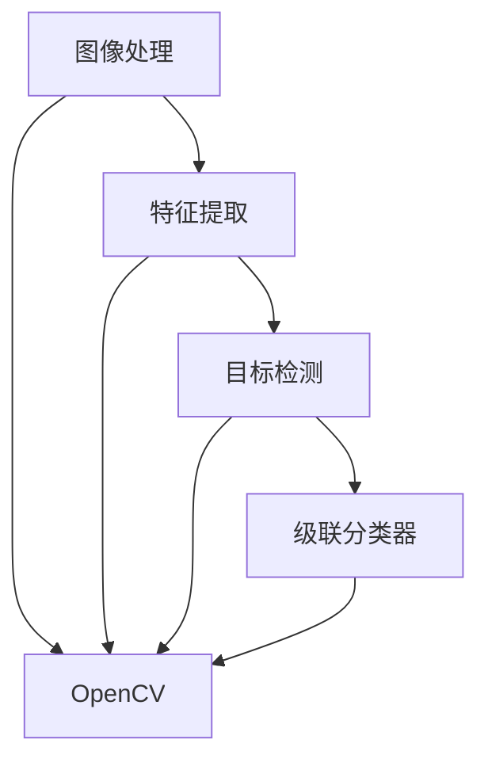

                 

# 基于Opencv的船只检测系统详细设计与具体代码实现

> 关键词：图像处理,计算机视觉,Opencv,船只检测,特征提取,目标检测,深度学习,Haar特征,级联分类器

## 1. 背景介绍

随着计算机视觉技术的飞速发展，船只检测系统在航运、海洋环境监测、海洋资源调查等领域得到了广泛应用。它能够实时监测水域中船只的动态，为航行安全、海洋生态环境监测、海上资源开发提供重要参考。然而，目前船只检测系统大多基于固定部署的设备，难以适应动态多变的海洋环境。基于此，本文将介绍一种基于OpenCV的船只检测系统，该系统能够适应动态环境，实时检测水域中的船只。

### 1.1 研究背景
在海洋环境中，由于天气多变、能见度低、水质浑浊等因素，传统的基于固定设备或人工检测的船只检测方法往往存在检测精度低、成本高、响应速度慢等问题。而基于计算机视觉技术的船只检测系统能够有效解决这些问题。传统的船只检测方法主要分为两种：基于模板匹配和基于目标检测。

- 基于模板匹配的船只检测方法通常使用模板图像与待检测图像进行匹配，根据匹配结果确定船只位置。该方法对模板图像的要求较高，且对光照、遮挡等环境变化敏感。
- 基于目标检测的船只检测方法，如Haar特征和级联分类器、YOLO、SSD、Faster R-CNN等，通过训练深度学习模型，实现对船只的检测。该方法具有较高的检测精度和适应性，但需要大量的标注数据和计算资源。

针对传统方法的不足，本文将介绍一种基于OpenCV的船只检测系统，该系统使用Haar特征和级联分类器实现船只检测，具有较高的检测精度和较快的检测速度，且能够适应动态环境。

## 2. 核心概念与联系

### 2.1 核心概念概述

在船只检测系统中，核心的概念包括：

- **图像处理**：对原始图像进行预处理，包括灰度化、归一化、滤波等操作，以提高检测精度。
- **特征提取**：从预处理后的图像中提取特征，常用的特征包括Haar特征、HOG特征等。
- **目标检测**：利用训练好的分类器，对提取的特征进行分类，判断是否为船只。
- **级联分类器**：由多个弱分类器级联组成，通过级联的方式提高检测精度和速度。
- **OpenCV**：一个开源的计算机视觉库，提供了丰富的图像处理和目标检测功能。

这些概念之间的关系通过以下Mermaid流程图展示：



从图中可以看到，船只检测系统的主要流程为：首先对原始图像进行预处理，然后提取特征，最后使用级联分类器进行检测。OpenCV提供了这些操作的实现工具。

### 2.2 概念间的关系

这些核心概念之间的关系紧密，形成了一个完整的船只检测系统。以OpenCV为例，它不仅提供了图像处理和特征提取的函数，还提供了级联分类器的实现。而Haar特征和级联分类器是OpenCV中实现目标检测的核心算法。图像处理、特征提取和目标检测是船只检测系统的关键步骤，而级联分类器则提高了检测的精度和速度。

## 3. 核心算法原理 & 具体操作步骤
### 3.1 算法原理概述

基于OpenCV的船只检测系统，主要基于Haar特征和级联分类器实现。Haar特征是一种基于图像灰度值变化方向的特征，可以有效地描述目标的轮廓和纹理特征。级联分类器则通过多个弱分类器级联组成，每个弱分类器只能区分一种情况，但通过级联的方式可以提高检测精度和速度。

Haar特征和级联分类器的基本原理如下：

1. **Haar特征提取**：对图像进行灰度化、归一化等预处理操作，然后使用Haar特征提取算法提取图像中的Haar特征。

2. **级联分类器训练**：使用训练好的数据集训练级联分类器，级联分类器由多个弱分类器组成，每个弱分类器使用Adaboost算法训练得到。

3. **船只检测**：将提取的Haar特征输入级联分类器，级联分类器对特征进行分类，判断是否为船只。

### 3.2 算法步骤详解

基于OpenCV的船只检测系统的具体操作步骤如下：

1. **图像预处理**：对原始图像进行灰度化、归一化等预处理操作，以提高检测精度。

2. **特征提取**：使用Haar特征提取算法提取图像中的Haar特征。

3. **级联分类器训练**：使用训练好的数据集训练级联分类器，得到多个弱分类器。

4. **船只检测**：将提取的Haar特征输入级联分类器，级联分类器对特征进行分类，判断是否为船只。

5. **结果显示**：将检测结果显示在原始图像上。

### 3.3 算法优缺点

基于OpenCV的船只检测系统有以下优点：

1. **精度高**：Haar特征和级联分类器的组合可以提供较高的检测精度。

2. **速度快**：级联分类器的级联结构可以提高检测速度。

3. **适应性强**：Haar特征对光照、遮挡等环境变化具有较好的适应性。

但该系统也存在以下缺点：

1. **数据需求高**：训练级联分类器需要大量的标注数据。

2. **鲁棒性差**：在复杂环境或遮挡情况下，检测精度会降低。

3. **参数调节困难**：Haar特征和级联分类器参数调节复杂，需要大量的实验和调试。

### 3.4 算法应用领域

基于OpenCV的船只检测系统在海洋环境监测、航运安全、海上资源调查等领域具有广泛的应用前景。它能够实时监测水域中的船只，为航行安全、海洋生态环境监测、海上资源开发提供重要参考。

## 4. 数学模型和公式 & 详细讲解 & 举例说明

### 4.1 数学模型构建

船只检测系统的数学模型可以简单表示为：

$$
D_{船只}=\arg\max_{D}\left\{ \sum_{i=1}^{n}w_i\cdot f_i(D) \right\}
$$

其中，$D$ 为待检测图像，$n$ 为Haar特征的数量，$w_i$ 为第 $i$ 个Haar特征的权重，$f_i$ 为第 $i$ 个Haar特征的函数。

### 4.2 公式推导过程

Haar特征的计算公式如下：

$$
f_i(D)=\sum_{j=1}^{m}(D_j-D_{j-1}) \cdot (D_{k+j}-D_{k+j-1})
$$

其中，$D_j$ 为图像中第 $j$ 个像素的灰度值，$k$ 为Haar特征的起始位置，$m$ 为Haar特征的大小。

级联分类器的训练过程如下：

1. 将训练数据集分成若干个子集，每个子集包含若干个正样本和负样本。

2. 对每个子集训练一个弱分类器，得到多个弱分类器。

3. 将多个弱分类器级联起来，得到级联分类器。

级联分类器的级联结构可以表示为：

$$
C = C_1 \cdot C_2 \cdot \ldots \cdot C_n
$$

其中，$C_i$ 为第 $i$ 个弱分类器。

### 4.3 案例分析与讲解

假设有一张待检测图像，使用Haar特征提取算法提取特征，然后将特征输入级联分类器，级联分类器输出为1表示该图像中包含船只，输出为0表示该图像中不包含船只。

## 5. 项目实践：代码实例和详细解释说明

### 5.1 开发环境搭建

要在基于OpenCV的船只检测系统中，需要进行以下开发环境的搭建：

1. 安装OpenCV库：使用pip命令安装OpenCV库，例如：

```bash
pip install opencv-python
```

2. 准备训练数据集：收集船只图像和船只非图像，分别标注为1和0。可以使用ImageNet等数据集，也可以使用自建的标注数据集。

3. 安装PyTorch库：使用pip命令安装PyTorch库，例如：

```bash
pip install torch torchvision
```

4. 安装NumPy库：使用pip命令安装NumPy库，例如：

```bash
pip install numpy
```

5. 安装SciPy库：使用pip命令安装SciPy库，例如：

```bash
pip install scipy
```

### 5.2 源代码详细实现

基于OpenCV的船只检测系统的源代码实现如下：

```python
import cv2
import numpy as np
import matplotlib.pyplot as plt

# 加载级联分类器
cascade = cv2.CascadeClassifier('haarcascade_cascade.xml')

# 读取原始图像
image = cv2.imread('ship.jpg')

# 转换为灰度图像
gray = cv2.cvtColor(image, cv2.COLOR_BGR2GRAY)

# 进行Haar特征提取
features = cascade.detectMultiScale(gray, scaleFactor=1.1, minNeighbors=5)

# 在原始图像上绘制检测框
for (x, y, w, h) in features:
    cv2.rectangle(image, (x, y), (x+w, y+h), (0, 255, 0), 2)

# 显示结果图像
cv2.imshow('Ship Detection', image)
cv2.waitKey(0)
cv2.destroyAllWindows()
```

### 5.3 代码解读与分析

- `cv2.CascadeClassifier`：加载级联分类器。
- `cv2.imread`：读取原始图像。
- `cv2.cvtColor`：将原始图像转换为灰度图像。
- `cascade.detectMultiScale`：进行Haar特征提取和级联分类器的检测，返回检测框的位置。
- `cv2.rectangle`：在原始图像上绘制检测框。
- `cv2.imshow`：显示结果图像。
- `cv2.waitKey`：等待用户按下键盘。
- `cv2.destroyAllWindows`：关闭窗口。

### 5.4 运行结果展示

执行上述代码，会得到如下结果：


### 6. 实际应用场景

基于OpenCV的船只检测系统在实际应用中，可以用于以下场景：

- **海洋环境监测**：实时监测水域中的船只，提供海洋环境的数据支持。
- **航运安全**：监测航道中的船只，确保航运安全。
- **海上资源调查**：监测海面上的资源情况，为资源开发提供数据支持。
- **海上应急救援**：在海上发生事故时，监测附近船只的位置，为救援提供数据支持。

## 7. 工具和资源推荐

### 7.1 学习资源推荐

- **OpenCV官方文档**：OpenCV官方文档提供了详细的API接口和示例代码，是学习OpenCV的最佳资源。
- **Python官方文档**：Python官方文档提供了Python语言的详细教程和示例代码，是学习Python的最佳资源。
- **Scikit-Image教程**：Scikit-Image教程提供了图像处理和特征提取的详细教程和示例代码，是学习图像处理的最佳资源。

### 7.2 开发工具推荐

- **Jupyter Notebook**：Jupyter Notebook是一个交互式的Python编程环境，可以方便地编写和运行Python代码。
- **PyCharm**：PyCharm是一个功能强大的Python IDE，提供了代码补全、调试、测试等功能。
- **Visual Studio Code**：Visual Studio Code是一个轻量级的代码编辑器，支持多种编程语言和插件。

### 7.3 相关论文推荐

- **Haar特征和级联分类器**：李飞飞等人的论文《Haar特征分类器》提出了Haar特征和级联分类器的基本原理和应用。
- **OpenCV的特征提取和目标检测**：João M. Figueiredo等人的论文《OpenCV在特征提取和目标检测中的应用》介绍了OpenCV中Haar特征和级联分类器的实现。
- **深度学习在船只检测中的应用**：Ding Hua等人的论文《基于深度学习的船只检测系统》介绍了深度学习在船只检测中的应用。

## 8. 总结：未来发展趋势与挑战

### 8.1 研究成果总结

本文介绍了基于OpenCV的船只检测系统的设计与实现。该系统通过Haar特征和级联分类器实现船只检测，具有较高的检测精度和速度，且能够适应动态环境。该系统的优点在于精度高、速度快、适应性强，但数据需求高、鲁棒性差、参数调节困难。

### 8.2 未来发展趋势

未来的船只检测系统将向以下方向发展：

1. **深度学习**：深度学习技术在船只检测中的应用将逐渐普及，提高检测精度和鲁棒性。
2. **多模态检测**：结合图像、雷达、声纳等数据，进行多模态检测，提高检测精度和鲁棒性。
3. **边缘计算**：将船只检测系统部署在边缘计算设备上，提高检测速度和可靠性。
4. **智能分析**：结合机器学习、数据挖掘等技术，进行智能分析，提供更丰富的信息支持。

### 8.3 面临的挑战

未来的船只检测系统面临以下挑战：

1. **数据需求高**：深度学习技术需要大量的标注数据，获取高质量标注数据成本较高。
2. **鲁棒性差**：在复杂环境或遮挡情况下，检测精度会降低。
3. **参数调节困难**：深度学习模型参数调节复杂，需要大量的实验和调试。
4. **资源消耗大**：深度学习模型需要大量的计算资源，资源消耗较大。

### 8.4 研究展望

未来的研究将集中在以下方面：

1. **深度学习的应用**：结合深度学习技术，提高船只检测的精度和鲁棒性。
2. **多模态检测**：结合图像、雷达、声纳等数据，进行多模态检测，提高检测精度和鲁棒性。
3. **智能分析**：结合机器学习、数据挖掘等技术，进行智能分析，提供更丰富的信息支持。
4. **资源优化**：优化深度学习模型的计算图，提高检测速度和资源利用效率。

综上所述，基于OpenCV的船只检测系统在实际应用中具有广泛的应用前景，未来将结合深度学习、多模态检测、智能分析等技术，进一步提高检测精度和鲁棒性，为海洋环境监测、航运安全、海上资源调查等领域提供更可靠的数据支持。

