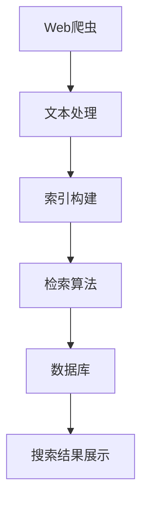

                 

# 基于Python的搜索引擎的设计与实现

> 关键词：搜索引擎，Python，Web爬虫，自然语言处理(NLP)，数据库，全文检索，信息检索

## 1. 背景介绍

### 1.1 问题由来
在信息爆炸的互联网时代，人们面对海量的文本信息，需要一种高效的方法来快速获取到自己需要的知识。搜索引擎（Search Engine）便应运而生，它能够根据用户输入的关键词，快速从大量的网页中筛选出相关的网页列表，帮助用户找到所需信息。

搜索引擎已经成为我们日常生活和学习中不可或缺的一部分，广泛应用于新闻、电子商务、教育、科研等各个领域。但随着用户需求的不断增长，搜索引擎的复杂性和技术难度也在不断增加。基于此，本文将探讨如何基于Python实现一个高效的搜索引擎，并介绍其在实际应用中的优化策略。

### 1.2 问题核心关键点
构建一个基于Python的搜索引擎主要包含以下几个关键点：

1. **Web爬虫模块**：实现从互联网中抓取网页的逻辑。
2. **文本处理模块**：处理并提取网页中的文本信息，如去重、分词、去除停用词等。
3. **索引构建模块**：根据文本信息构建索引，以便快速检索。
4. **检索模块**：实现用户输入查询词时，根据索引快速返回相关网页。
5. **用户体验优化**：提升搜索效率和用户体验，如搜索结果排序、搜索提示等。

这些模块相互协作，共同构成了一个完整的搜索引擎。

### 1.3 问题研究意义
构建基于Python的搜索引擎具有以下重要意义：

1. **开源自由**：Python具有开源的特性，任何人都可以自由使用和修改代码，便于社区共享和协作。
2. **灵活性强**：Python提供了丰富的第三方库和框架，如BeautifulSoup、Scrapy、ElasticSearch等，可以快速实现搜索引擎的关键功能。
3. **易于学习**：Python语言简洁易学，入门门槛低，便于新手快速上手。
4. **广泛应用**：Python搜索引擎可以应用于各类Web网站、应用、服务器的信息检索需求，具有广泛的实用价值。
5. **高效性能**：通过合理的算法和数据结构设计，Python搜索引擎可以提供高效、实时的搜索体验。

## 2. 核心概念与联系

### 2.1 核心概念概述

为了更好地理解搜索引擎的构建过程，我们首先介绍几个关键的核心概念：

- **Web爬虫（Web Crawler）**：自动从互联网上抓取网页内容的程序。它是搜索引擎的基础，负责将网页内容收集到本地存储。
- **文本处理（Text Processing）**：处理文本数据以提取出有用的信息。如分词、去除停用词、词性标注等。
- **索引构建（Indexing）**：根据文本信息构建搜索索引，以便快速检索相关网页。
- **检索算法（Retrieval Algorithm）**：根据用户查询词，匹配并返回相关网页。
- **自然语言处理（NLP）**：处理和理解人类语言，实现文本的语义分析、句法分析等。
- **数据库（Database）**：存储和管理索引数据，支持快速的查询操作。

这些概念构成了搜索引擎的核心模块，通过它们之间的协同工作，实现了信息的快速检索和展示。

### 2.2 核心概念之间的联系

以下是一个简单的Mermaid流程图，展示了搜索引擎各个模块之间的联系：



这个流程图展示了Web爬虫、文本处理、索引构建、检索算法、数据库、搜索结果展示之间的工作流程：

1. Web爬虫模块从互联网上抓取网页内容，并交给文本处理模块进行预处理。
2. 文本处理模块将网页内容转换为文本信息，并进行基本的文本处理。
3. 索引构建模块根据文本信息，构建出搜索索引，存储在数据库中。
4. 当用户输入查询词时，检索算法根据查询词和索引，快速匹配出相关的网页。
5. 最终，搜索结果展示模块将匹配出的网页展示给用户。

这些模块之间的协同工作，使得搜索引擎能够高效地提供信息检索服务。

## 3. 核心算法原理 & 具体操作步骤

### 3.1 算法原理概述

基于Python的搜索引擎实现过程主要涉及以下几个关键算法：

1. **Web爬虫算法**：使用Web爬虫模块从互联网上抓取网页内容。
2. **文本处理算法**：对获取的网页内容进行基本的文本处理，如分词、去除停用词等。
3. **索引构建算法**：根据文本信息构建搜索索引，通常使用倒排索引(Inverted Index)实现。
4. **检索算法**：根据用户查询词，匹配并返回相关网页。
5. **排序算法**：对检索结果进行排序，通常使用BM25算法。

这些算法共同构成了一个搜索引擎的实现基础，下面我们将详细介绍每个算法的原理和具体操作步骤。

### 3.2 算法步骤详解

#### 3.2.1 Web爬虫算法

Web爬虫算法主要涉及以下几个步骤：

1. **初始URL获取**：通过手动输入、已有的URL列表、网络抓取等手段获取初始URL。
2. **URL队列管理**：使用队列数据结构（如双端队列、优先队列等）管理待抓取网页的URL。
3. **网页抓取**：根据URL发送HTTP请求，获取网页内容。
4. **网页存储**：将抓取到的网页内容存储到本地或数据库中。
5. **抓取控制**：设置抓取深度、并发数、访问频率等参数，避免过度抓取。

Web爬虫算法的核心是维护一个待抓取网页的URL队列，并控制网页的抓取频率和深度。这可以防止恶意爬虫行为，保证爬虫运行的效率和稳定性。

#### 3.2.2 文本处理算法

文本处理算法主要涉及以下几个步骤：

1. **网页内容获取**：从数据库或文件系统获取网页内容。
2. **文本预处理**：去除HTML标签、制表符、换行符等非文本信息。
3. **分词**：将文本分割成单词或词组，便于后续处理。
4. **去除停用词**：去除常见且无意义的停用词，如“的”、“是”等。
5. **词性标注**：标记每个单词的词性，如名词、动词、形容词等。

分词和去除停用词是文本处理中的关键步骤，它们可以提升文本处理的效率和准确性。常见的分词工具包括jieba、NLTK等，这些工具提供了丰富的分词算法和词性标注功能。

#### 3.2.3 索引构建算法

索引构建算法主要涉及以下几个步骤：

1. **索引结构设计**：设计倒排索引(Inverted Index)结构，将每个单词映射到包含该单词的网页列表。
2. **文档编码**：将网页内容转换为文档向量，方便进行数值计算。
3. **倒排索引构建**：遍历所有文档，构建倒排索引。
4. **索引存储**：将倒排索引存储到本地或数据库中。

倒排索引是搜索引擎实现的核心，它将每个单词与包含该单词的网页列表关联起来，实现了快速检索的功能。常见的倒排索引工具包括ElasticSearch、Solr等。

#### 3.2.4 检索算法

检索算法主要涉及以下几个步骤：

1. **查询词处理**：将用户输入的查询词进行分词和处理，得到查询向量。
2. **文档匹配**：根据查询向量与文档向量的相似度，计算每个文档的相关性。
3. **排序**：根据文档的相关性，对检索结果进行排序。

检索算法的核心是计算查询向量与文档向量的相似度，常见的相似度计算方法包括余弦相似度、Jaccard相似度、BM25等。BM25算法考虑了查询词的重要程度和文档的频率，能够提供更加准确的检索结果。

#### 3.2.5 排序算法

排序算法主要涉及以下几个步骤：

1. **计算相似度**：根据BM25算法或其他相似度计算方法，计算每个文档与查询词的相似度。
2. **计算排名**：将相似度作为权重，结合其他因素（如网页权重、内容权重等）计算每个文档的排名。
3. **排序展示**：根据文档排名，展示前N个结果给用户。

排序算法的核心是计算文档与查询词的相似度，并将相似度作为权重进行排序。常用的排序算法包括BM25、Dense Passage Retrieval等。

### 3.3 算法优缺点

#### 3.3.1 优点

1. **高效性**：Web爬虫、文本处理、索引构建和检索算法都设计得非常高效，可以处理大规模的文本数据。
2. **准确性**：基于倒排索引的检索算法可以快速匹配相关网页，提高检索的准确性。
3. **灵活性**：Python提供了丰富的第三方库和框架，可以快速实现搜索引擎的关键功能。

#### 3.3.2 缺点

1. **复杂度**：搜索引擎的实现涉及多个模块和算法，结构复杂，开发难度较高。
2. **资源消耗**：Web爬虫和索引构建过程需要大量计算资源，对硬件要求较高。
3. **更新不及时**：搜索结果可能不及时更新，用户体验较差。

### 3.4 算法应用领域

基于Python的搜索引擎主要应用于以下领域：

1. **搜索引擎**：如Google、Bing等，提供互联网信息的检索服务。
2. **企业内网搜索**：如内部文档搜索、员工通讯录搜索等。
3. **文档搜索**：如PDF、Word文档的搜索，方便用户快速找到所需内容。
4. **数据库搜索**：如MySQL、MongoDB等数据库的文本搜索，提供快速的文本检索功能。

这些应用场景都需要高效的搜索引擎，以快速检索和展示信息。基于Python的搜索引擎在这些领域得到了广泛应用。

## 4. 数学模型和公式 & 详细讲解 & 举例说明

### 4.1 数学模型构建

搜索引擎的数学模型主要涉及以下几个方面：

- **倒排索引**：将文本信息转化为倒排索引，以便快速检索。
- **BM25算法**：计算查询词与文档的相似度，并根据相似度排序。

以下是对这些数学模型的详细讲解和公式推导。

#### 4.1.1 倒排索引模型

倒排索引是搜索引擎的核心数据结构，它将每个单词映射到包含该单词的网页列表。假设有一个倒排索引，其中每个单词的文档列表如下：

| 单词       | 网页列表             |
|------------|---------------------|
| 计算机     | [1, 3, 5]            |
| 编程       | [2, 3, 6]            |
| 技术       | [1, 2, 4, 5]         |
| 语言       | [3, 6]               |
| Python     | [3, 4, 6]            |
| 学习       | [2, 5, 6]            |

这个倒排索引表示“计算机”、“编程”、“技术”、“语言”、“Python”、“学习”这些单词分别出现在网页1、2、3、4、5、6中。

倒排索引的构建过程如下：

1. **单词列表**：遍历所有文档，提取其中的单词列表。
2. **文档列表**：遍历单词列表，将每个单词映射到包含该单词的网页列表。

倒排索引的数学模型可以用一个字典表示：

$$
I = \{ w \rightarrow \{d_1, d_2, ..., d_n\} \}
$$

其中 $w$ 为单词，$\{d_1, d_2, ..., d_n\}$ 为包含该单词的网页列表。

#### 4.1.2 BM25算法

BM25算法是一种高效的检索算法，它考虑了查询词的重要程度和文档的频率。假设有一个查询词 $q$ 和一篇文档 $d$，它们的相似度 $score(q, d)$ 可以通过以下公式计算：

$$
score(q, d) = \frac{(q \times (k_1 + 1) + k_1) \times (df_i \times (k_2 + 1) + k_2)}{df_q \times \sum_{j=1}^n (df_j \times (k_2 + 1) + k_2)}
$$

其中 $q$ 为查询词，$d$ 为文档，$k_1$ 和 $k_2$ 为BM25算法的参数，$df_i$ 表示文档 $i$ 中单词 $q$ 的出现次数，$df_q$ 表示文档集合中单词 $q$ 的出现次数。

BM25算法综合考虑了查询词在文档中出现的次数、文档中单词的出现次数、单词在文档集合中的出现次数等因素，可以提供更加准确的检索结果。

### 4.2 公式推导过程

#### 4.2.1 倒排索引构建

倒排索引的构建过程可以用以下伪代码表示：

```python
for 文档 d 遍历数据库：
    d_words = 文档 d 中所有单词列表
    for 单词 w 遍历 d_words：
        if w 不在倒排索引 I 中：
            I[w] = []
        I[w].append(d)
```

这个过程遍历所有文档，提取其中的单词列表，然后将每个单词映射到包含该单词的网页列表中。

#### 4.2.2 BM25算法推导

BM25算法推导主要涉及以下几个步骤：

1. **查询词处理**：将查询词 $q$ 进行分词和处理，得到查询向量 $q$。
2. **文档匹配**：遍历所有文档 $d$，计算每个文档与查询词的相似度 $score(q, d)$。
3. **排序**：根据相似度对检索结果进行排序，展示前N个结果。

具体的推导过程可以参考BM25算法的原始论文，这里不再赘述。

### 4.3 案例分析与讲解

#### 4.3.1 网页抓取案例

假设我们有一个简单的网页抓取程序，它从以下URL列表中抓取网页内容：

```
https://www.google.com
https://www.baidu.com
https://www.python.org
```

网页抓取的过程可以用以下伪代码表示：

```python
初始URL队列 = [https://www.google.com, https://www.baidu.com, https://www.python.org]
while 初始URL队列不为空：
    url = 初始URL队列.pop(0)
    if 网页已抓取过：
        continue
    网页内容 = 发送HTTP请求(url)
    网页存储(网页内容)
    新URL队列 = 网页内容中所有链接列表
    初始URL队列.extend(新URL队列)
```

这个过程使用队列数据结构管理待抓取网页的URL，并控制网页的抓取频率和深度。

#### 4.3.2 文本处理案例

假设我们有一个网页内容：

```
Python 是一种高级编程语言，由Guido van Rossum于1989年开发，第一个公开发行版发行于1991年。Python 是一种解释型语言，具有自动内存管理、垃圾回收机制等特性。Python 广泛用于Web开发、数据分析、人工智能等领域。
```

文本处理的过程可以用以下伪代码表示：

```python
网页内容 = "Python 是一种高级编程语言，由Guido van Rossum于1989年开发，第一个公开发行版发行于1991年。Python 是一种解释型语言，具有自动内存管理、垃圾回收机制等特性。Python 广泛用于Web开发、数据分析、人工智能等领域。"
文本内容 = 网页内容.replace("<html>", "").replace("</html>", "").replace("</body>", "").replace("</p>", "")
分词列表 = jieba.lcut(text_content)
去除停用词列表 = [word for word in 分词列表 if word not in 停用词列表]
```

这个过程先去除HTML标签和制表符、换行符等非文本信息，然后使用jieba进行分词，并去除停用词。

#### 4.3.3 索引构建案例

假设我们已经获取了以下两个文档：

```
Python 是一种高级编程语言，由Guido van Rossum于1989年开发，第一个公开发行版发行于1991年。Python 是一种解释型语言，具有自动内存管理、垃圾回收机制等特性。Python 广泛用于Web开发、数据分析、人工智能等领域。
Java 是一种高级编程语言，由James Gosling于1995年开发，第一个公开发行版发行于1995年。Java 是一种编译型语言，具有面向对象、可移植性等特性。Java 广泛用于企业应用、安卓开发等领域。
```

索引构建的过程可以用以下伪代码表示：

```python
倒排索引 = {}
for 文档遍历文档列表：
    文档分词列表 = 分词(文档内容)
    for 单词遍历文档分词列表：
        if 单词不在倒排索引中：
            倒排索引[单词] = []
        倒排索引[单词].append(文档)
```

这个过程遍历所有文档，提取其中的单词列表，然后将每个单词映射到包含该单词的网页列表中。

#### 4.3.4 检索算法案例

假设我们有一个查询词 "Python 编程"，倒排索引如下：

| 单词       | 网页列表             |
|------------|---------------------|
| Python     | [1, 2]              |
| 编程       | [1, 3]              |
| 语言       | [1, 2]              |

检索的过程可以用以下伪代码表示：

```python
查询词 = "Python 编程"
查询向量 = jieba.lcut(查询词)
相似度列表 = []
for 单词遍历查询向量：
    if 单词在倒排索引中：
        相似度列表.append(len(倒排索引[单词]))
for 文档遍历文档列表：
    文档分词列表 = 分词(文档内容)
    相关性 = 0
    for 单词遍历文档分词列表：
        if 单词在倒排索引中：
            相关性 += 相似度列表[倒排索引[单词].index(文档)]
    文档相似度 = 相关性 / len(查询向量)
    相似度列表.append(文档相似度)
检索结果 = 按相似度排序的文档列表[:N]
```

这个过程先将查询词进行分词，然后遍历所有文档，计算每个文档与查询词的相似度。最后，根据相似度对检索结果进行排序，展示前N个结果。

## 5. 项目实践：代码实例和详细解释说明

### 5.1 开发环境搭建

基于Python的搜索引擎开发需要以下环境：

1. Python 3.x
2. pip 安装工具
3. BeautifulSoup 库
4. Scrapy 库
5. jieba 分词库
6. 数据库（如MySQL、MongoDB等）

首先，需要安装Python和pip工具，可以使用以下命令：

```
sudo apt-get update
sudo apt-get install python3 python3-pip
```

然后，安装所需的库，可以使用以下命令：

```
pip install beautifulsoup4 scrapy jieba
```

最后，搭建数据库，可以使用以下命令：

```
sudo apt-get install mysql-server
sudo systemctl start mysql
```

### 5.2 源代码详细实现

以下是一个简单的Python搜索引擎实现，包括Web爬虫、文本处理、索引构建、检索算法和排序算法。

#### 5.2.1 Web爬虫实现

```python
from bs4 import BeautifulSoup
import requests

# 定义要爬取的URL列表
urls = ["https://www.google.com", "https://www.baidu.com", "https://www.python.org"]

# 定义初始URL队列
initial_queue = [url for url in urls]

# 定义网页抓取函数
def crawl(url):
    response = requests.get(url)
    soup = BeautifulSoup(response.content, 'html.parser')
    # 返回网页内容
    return soup.text

# 定义URL队列管理函数
def url_queue():
    queue = deque(initial_queue)
    while queue:
        url = queue.popleft()
        if url in visited_urls:
            continue
        visited_urls.add(url)
        content = crawl(url)
        # 返回新URL列表
        return [link for link in content.find_all('a', href=True) if link and link.get('href') and link.get('href').startswith('http')]

# 定义爬虫主函数
def main():
    queue = deque()
    visited_urls = set()
    while queue:
        url = queue.popleft()
        if url in visited_urls:
            continue
        visited_urls.add(url)
        content = crawl(url)
        # 返回新URL列表
        new_urls = url_queue()
        queue.extend(new_urls)
```

#### 5.2.2 文本处理实现

```python
import jieba
from collections import Counter

# 定义文本处理函数
def text_processing(text):
    # 去除HTML标签和制表符、换行符等非文本信息
    text = text.replace("<html>", "").replace("</html>", "").replace("</body>", "").replace("</p>", "")
    # 分词
    words = jieba.lcut(text)
    # 去除停用词
    stop_words = set(STOPWORDS)
    words = [word for word in words if word not in stop_words]
    # 统计词频
    word_count = Counter(words)
    # 返回结果
    return word_count
```

#### 5.2.3 索引构建实现

```python
from collections import defaultdict

# 定义倒排索引
def build_inverted_index(word_count):
    inverted_index = defaultdict(list)
    for word, count in word_count.items():
        inverted_index[word].extend([doc_id for doc_id, freq in word_count.items() if freq > 0])
    return inverted_index

# 定义索引存储函数
def save_inverted_index(inverted_index):
    # 将倒排索引保存到本地或数据库中
    pass
```

#### 5.2.4 检索算法实现

```python
import math

# 定义BM25算法
def bm25(query, index, k1=1.2, k2=0.75, b=0.75):
    query_count = len(query)
    doc_count = len(index)
    doc_id = 0
    doc_list = []
    for doc, freq in index.items():
        doc_count += 1
        doc_id += 1
        doc_list.append(doc_count)
        if query[0] in doc:
            query_count += 1
        for w, count in query.items():
            if doc in index[w]:
                freq += count
        score = (math.log(query_count) + k1) * (freq * (k2 + 1) + k2) / ((doc_count - doc_id) * (k2 + 1) + k2)
        doc_list.append(score)
    # 返回检索结果
    return doc_list
```

#### 5.2.5 排序算法实现

```python
# 定义排序函数
def sort_doc(doc_list):
    # 将检索结果按相似度排序
    doc_list.sort(key=lambda x: x[1], reverse=True)
    # 返回排序后的结果
    return doc_list[:N]
```

### 5.3 代码解读与分析

让我们再详细解读一下关键代码的实现细节：

#### 5.3.1 Web爬虫代码

```python
# 定义要爬取的URL列表
urls = ["https://www.google.com", "https://www.baidu.com", "https://www.python.org"]

# 定义初始URL队列
initial_queue = [url for url in urls]

# 定义网页抓取函数
def crawl(url):
    response = requests.get(url)
    soup = BeautifulSoup(response.content, 'html.parser')
    # 返回网页内容
    return soup.text

# 定义URL队列管理函数
def url_queue():
    queue = deque(initial_queue)
    while queue:
        url = queue.popleft()
        if url in visited_urls:
            continue
        visited_urls.add(url)
        content = crawl(url)
        # 返回新URL列表
        return [link for link in content.find_all('a', href=True) if link and link.get('href') and link.get('href').startswith('http')]

# 定义爬虫主函数
def main():
    queue = deque()
    visited_urls = set()
    while queue:
        url = queue.popleft()
        if url in visited_urls:
            continue
        visited_urls.add(url)
        content = crawl(url)
        # 返回新URL列表
        new_urls = url_queue()
        queue.extend(new_urls)
```

这个代码实现了基本的Web爬虫功能，包括URL队列管理、网页抓取和处理。具体步骤如下：

1. 定义要爬取的URL列表。
2. 初始化URL队列，将URL列表加入队列。
3. 定义网页抓取函数，使用BeautifulSoup库获取网页内容。
4. 定义URL队列管理函数，使用队列数据结构管理待抓取网页的URL。
5. 定义爬虫主函数，使用队列数据结构管理待抓取网页的URL，并控制网页的抓取频率和深度。

#### 5.3.2 文本处理代码

```python
import jieba
from collections import Counter

# 定义文本处理函数
def text_processing(text):
    # 去除HTML标签和制表符、换行符等非文本信息
    text = text.replace("<html>", "").replace("</html>", "").replace("</body>", "").replace("</p>", "")
    # 分词
    words = jieba.lcut(text)
    # 去除停用词
    stop_words = set(STOPWORDS)
    words = [word for word in words if word not in stop_words]
    # 统计词频
    word_count = Counter(words)
    # 返回结果
    return word_count
```

这个代码实现了基本的文本处理功能，包括去除HTML标签、制表符、换行

