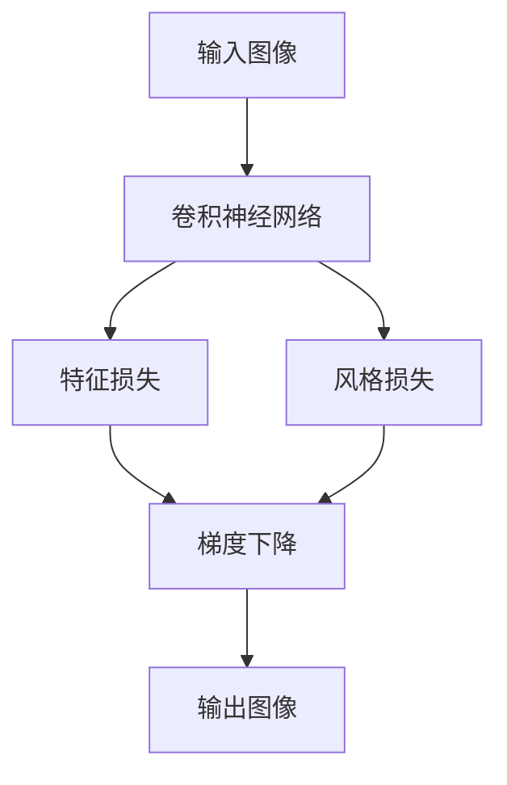
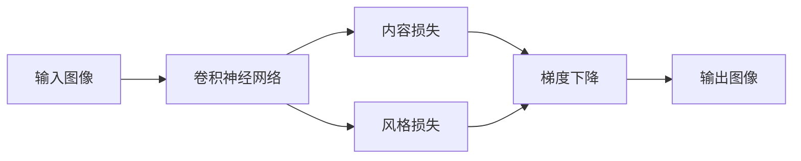
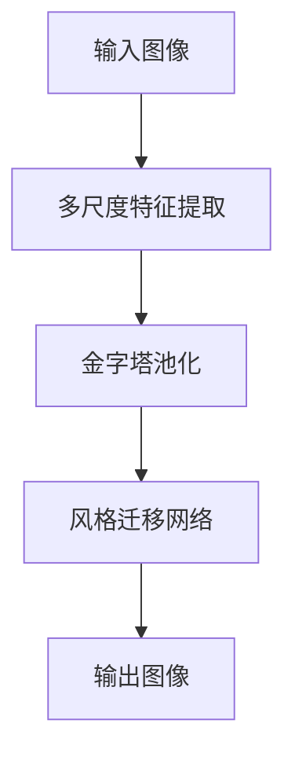
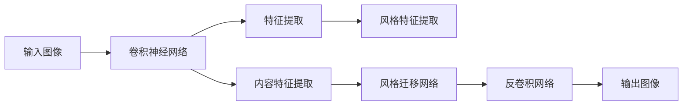
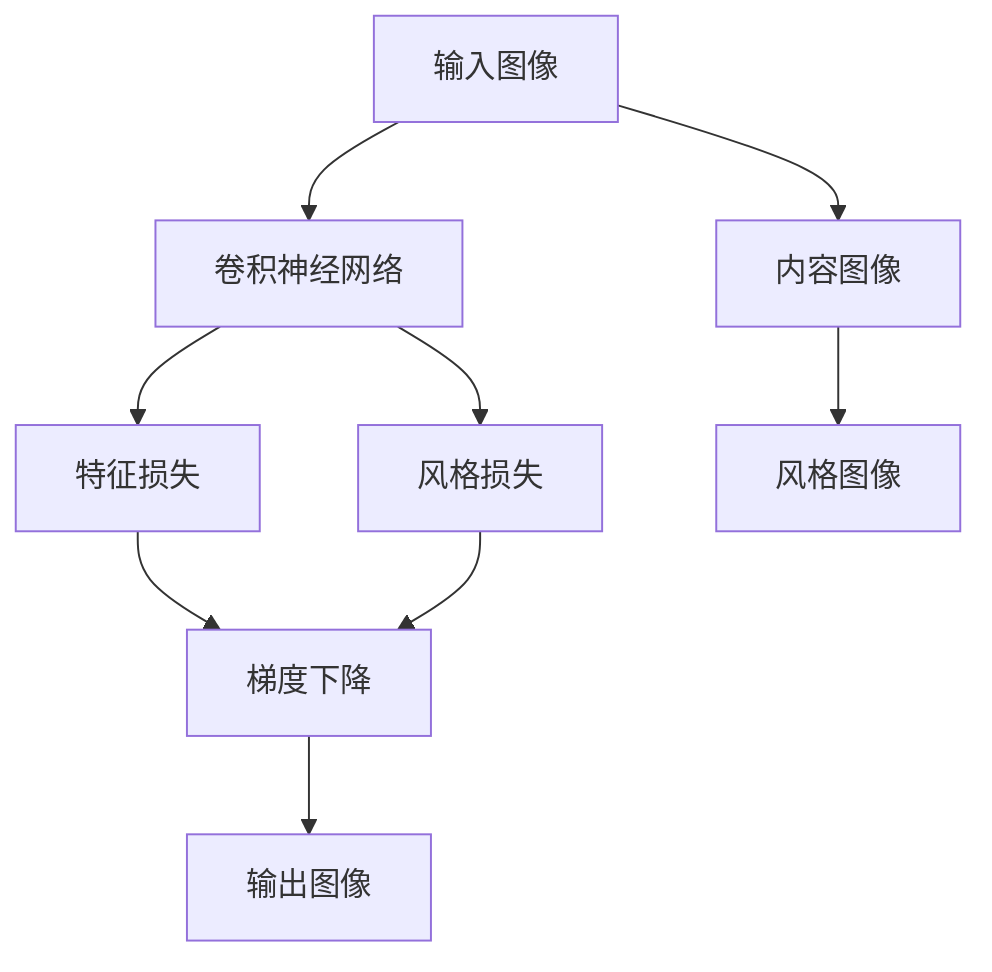

                 

## 1. 背景介绍

图像风格化（Image Style Transfer）是指将一张图像的内容与另一张图像的风格相融合，产生一张全新的图像。这种技术在艺术、设计、电影制作等领域有着广泛的应用，尤其是在图像处理和计算机视觉研究中，它成为一个热点研究方向。

### 1.1 问题由来

在计算机视觉领域，图像风格化最初源于Isola等人在2015年提出的CycleGAN论文中，提出了一种无监督的方式实现风格迁移。随后，Gatys等人利用卷积神经网络（CNN）对风格迁移进行了优化，提出了神经风格迁移算法。此算法基于内容损失（content loss）和风格损失（style loss），并引入了VGG19特征提取器进行图像特征的提取。这种基于CNN的风格迁移方法为图像风格化打开了新的思路。

然而，传统的神经风格迁移算法仍存在一些局限性：
- 训练复杂度高，需要大量训练数据和计算资源。
- 对目标图像的风格的感知能力较弱。
- 风格化过程中会丢失一些细节信息。

### 1.2 问题核心关键点

为了解决上述问题，当前主流的研究方向是基于卷积神经网络的图像风格化方法，这些方法通过优化损失函数、引入更多的网络层次等方式来提升风格化效果。关键问题在于如何平衡内容保真度和风格一致性，并提高风格化效率和鲁棒性。

## 2. 核心概念与联系

### 2.1 核心概念概述

为更好地理解基于卷积神经网络的图像风格化方法，本节将介绍几个密切相关的核心概念：

- 卷积神经网络（Convolutional Neural Network, CNN）：一种广泛应用于图像处理、自然语言处理、语音识别等领域的深度学习模型。CNN通过卷积和池化等操作提取图像的局部特征，经过多层网络结构实现复杂的图像分类、特征提取、风格迁移等功能。

- 特征损失（Feature Loss）：利用卷积神经网络对图像特征进行提取和度量，作为损失函数的一部分，用以确保内容保真度。

- 风格损失（Style Loss）：对风格特征进行提取和度量，作为损失函数的一部分，用以确保风格一致性。

- 梯度下降（Gradient Descent）：一种常用的优化算法，通过反向传播更新网络参数，最小化损失函数。

- 金字塔池化（Pyramid Pooling）：一种提取多尺度图像特征的技术，通过在不同尺度下提取不同等级的图像特征，提升特征的描述能力和鲁棒性。

- 反卷积网络（Deconvolutional Network）：一种用于上采样的网络结构，常用于生成对抗网络（GAN）等生成模型中。

这些核心概念之间的逻辑关系可以通过以下Mermaid流程图来展示：



这个流程图展示了一个基于卷积神经网络的图像风格化过程：
1. 输入图像通过卷积神经网络提取特征。
2. 特征损失和风格损失用于度量内容保真度和风格一致性。
3. 梯度下降算法更新网络参数，最小化损失函数。
4. 输出图像为风格化的结果。

### 2.2 概念间的关系

这些核心概念之间存在着紧密的联系，形成了图像风格化的完整生态系统。下面我们通过几个Mermaid流程图来展示这些概念之间的关系。

#### 2.2.1 基于CNN的风格迁移流程



这个流程图展示了基于CNN的风格迁移过程：
1. 输入图像通过卷积神经网络提取内容特征和风格特征。
2. 内容损失和风格损失用于度量目标图像与风格图像之间的差异。
3. 梯度下降算法更新网络参数，最小化损失函数。
4. 输出图像为风格化的结果。

#### 2.2.2 金字塔池化的具体实现



这个流程图展示了多尺度特征提取和金字塔池化的具体实现过程：
1. 输入图像在不同尺度下进行特征提取。
2. 金字塔池化技术在不同尺度下提取不同等级的特征。
3. 提取出的多尺度特征输入到风格迁移网络进行风格化。
4. 最终输出图像为风格化结果。

#### 2.2.3 神经风格迁移的流程



这个流程图展示了神经风格迁移的基本流程：
1. 输入图像通过卷积神经网络提取特征。
2. 使用VGG19等预训练模型提取内容特征和风格特征。
3. 内容特征和风格特征作为输入，通过风格迁移网络进行风格化。
4. 反卷积网络将风格化的结果上采样为高分辨率图像。
5. 输出图像为风格化结果。

### 2.3 核心概念的整体架构

最后，我们用一个综合的流程图来展示这些核心概念在大模型微调过程中的整体架构：



这个综合流程图展示了从输入图像到风格化结果的完整过程：
1. 输入图像和内容图像通过卷积神经网络提取特征。
2. 风格图像提取风格特征。
3. 内容特征和风格特征作为输入，通过风格迁移网络进行风格化。
4. 输出图像为风格化结果。

通过这些流程图，我们可以更清晰地理解基于卷积神经网络的图像风格化过程中各个核心概念的关系和作用，为后续深入讨论具体的风格化方法和技术奠定基础。

## 3. 核心算法原理 & 具体操作步骤
### 3.1 算法原理概述

基于卷积神经网络的图像风格化方法，本质上是一个通过优化损失函数来最小化风格迁移过程的优化问题。其核心思想是：将输入图像的内容特征与目标图像的风格特征进行融合，生成一张既具备内容又具备风格的新图像。

假设输入图像为 $I$，风格图像为 $S$，内容图像为 $C$。通过卷积神经网络 $N$ 对输入图像进行特征提取，得到特征图 $F$。设内容损失为 $L_{content}$，风格损失为 $L_{style}$，则风格迁移的目标是：

$$
\min_{I'} \{L_{content}(I', C) + L_{style}(I', S)\}
$$

其中，$I'$ 为输出图像，$L_{content}$ 用于衡量 $I'$ 与 $C$ 的相似度，$L_{style}$ 用于衡量 $I'$ 与 $S$ 的相似度。通过反向传播算法，不断更新 $I'$ 和网络参数 $N$，直至达到最优解。

### 3.2 算法步骤详解

基于卷积神经网络的图像风格化方法主要包括以下几个关键步骤：

**Step 1: 准备预训练模型和数据集**
- 选择合适的预训练卷积神经网络 $N$，如VGG19、ResNet等，作为风格迁移的特征提取器。
- 收集输入图像 $I$、风格图像 $S$ 和内容图像 $C$，并对数据进行预处理，如归一化、裁剪等。

**Step 2: 提取特征**
- 使用卷积神经网络 $N$ 对输入图像 $I$ 进行特征提取，得到特征图 $F$。
- 使用风格图像 $S$ 在 $N$ 上提取风格特征。

**Step 3: 计算损失函数**
- 计算内容损失 $L_{content}$，衡量 $F$ 与 $C$ 的相似度。
- 计算风格损失 $L_{style}$，衡量 $F$ 与 $S$ 的相似度。

**Step 4: 优化网络参数**
- 使用梯度下降算法，根据损失函数 $L_{content} + L_{style}$ 更新网络参数 $N$。

**Step 5: 生成风格化图像**
- 将更新后的 $F$ 输入反卷积网络进行上采样，得到输出图像 $I'$。

### 3.3 算法优缺点

基于卷积神经网络的图像风格化方法具有以下优点：
- 模型结构简单，易于实现。
- 利用预训练模型提取特征，能够捕捉到丰富的语义信息。
- 通过多尺度特征提取和风格损失，可以有效提升风格一致性。

同时，该方法也存在一些局限性：
- 对数据和计算资源的要求较高，需要大量标注数据和高性能计算资源。
- 风格迁移过程中可能会丢失一些细节信息。
- 风格迁移的精度和效果依赖于预训练模型的性能和训练数据的质量。

### 3.4 算法应用领域

基于卷积神经网络的图像风格化方法在图像处理和计算机视觉领域有着广泛的应用，主要包括以下几个方面：

- 图像增强：通过风格迁移将一张图像变成另一张风格独特的图像，提升图像的美观度和吸引力。
- 艺术创作：利用风格迁移生成艺术风格的图像，激发艺术创作灵感。
- 视频编辑：将视频中的场景风格化，增强视频视觉效果。
- 人脸美化：通过风格迁移对人脸图像进行美化，提升人像照片的吸引力。
- 图像修复：利用风格迁移技术对图像中的损坏部分进行修复，提升图像质量。

除了这些常见应用外，基于卷积神经网络的图像风格化技术还可以在影视制作、广告设计、虚拟现实等领域得到广泛应用。

## 4. 数学模型和公式 & 详细讲解 & 举例说明

### 4.1 数学模型构建

假设输入图像 $I$ 大小为 $H \times W \times C$，风格图像 $S$ 大小为 $H' \times W' \times C'$，内容图像 $C$ 大小为 $H \times W \times C$。设卷积神经网络的卷积核大小为 $k \times k$，步长为 $s$，输入和输出特征图的大小分别为 $h \times w \times c$ 和 $h' \times w' \times c'$。

定义内容损失 $L_{content}$ 为输入图像 $I'$ 和内容图像 $C$ 之间的均方误差损失：

$$
L_{content} = \frac{1}{N} \sum_{i=1}^{N} \|I'(x_i) - C(x_i)\|^2
$$

其中 $I'(x_i)$ 和 $C(x_i)$ 分别为 $I'$ 和 $C$ 在像素 $x_i$ 处的值。

定义风格损失 $L_{style}$ 为输入图像 $I'$ 和风格图像 $S$ 之间的均方误差损失。设 $G_l$ 和 $G_s$ 分别为卷积神经网络 $N$ 在层次 $l$ 和 $s$ 的卷积核权重矩阵，则风格损失定义为：

$$
L_{style} = \sum_{l,s} \alpha_l \alpha_s \frac{1}{N} \sum_{i=1}^{N} \|G_l(x_i) - G_s(x_i)\|^2
$$

其中 $\alpha_l$ 和 $\alpha_s$ 分别为层次 $l$ 和 $s$ 的权重系数。

### 4.2 公式推导过程

在计算损失函数时，我们需要通过卷积神经网络 $N$ 提取输入图像 $I'$ 的特征 $F$，并在风格图像 $S$ 上提取风格特征 $G_s$。假设 $N$ 包含 $L$ 个层次，在第 $l$ 个层次上提取的特征图大小为 $h_l \times w_l \times c_l$。则 $I'$ 在第 $l$ 个层次上的特征图 $F_l$ 可通过卷积操作得到：

$$
F_l = N_l \ast I'
$$

其中 $N_l$ 为第 $l$ 个层次的卷积核。同理，$G_s$ 在第 $l$ 个层次上的特征图 $G_{s,l}$ 可通过卷积操作得到：

$$
G_{s,l} = N_l \ast S
$$

内容损失 $L_{content}$ 和风格损失 $L_{style}$ 的计算公式如下：

$$
L_{content} = \frac{1}{N} \sum_{i=1}^{N} \|I'(x_i) - C(x_i)\|^2
$$

$$
L_{style} = \sum_{l,s} \alpha_l \alpha_s \frac{1}{N} \sum_{i=1}^{N} \|G_l(x_i) - G_s(x_i)\|^2
$$

### 4.3 案例分析与讲解

以一张彩色图片和一张素描风格的图片为例，通过基于卷积神经网络的图像风格化方法，将其转换为具有素描风格的彩色图片。

假设输入图像 $I$ 为 $H \times W \times C$，风格图像 $S$ 为 $H' \times W' \times C'$，内容图像 $C$ 为 $H \times W \times C$。首先，使用卷积神经网络 $N$ 对输入图像 $I$ 进行特征提取，得到特征图 $F$。然后，使用风格图像 $S$ 在 $N$ 上提取风格特征。

假设 $N$ 包含 $L$ 个层次，在第 $l$ 个层次上提取的特征图大小为 $h_l \times w_l \times c_l$。则 $I'$ 在第 $l$ 个层次上的特征图 $F_l$ 可通过卷积操作得到：

$$
F_l = N_l \ast I'
$$

同理，$G_s$ 在第 $l$ 个层次上的特征图 $G_{s,l}$ 可通过卷积操作得到：

$$
G_{s,l} = N_l \ast S
$$

通过比较 $F_l$ 和 $G_{s,l}$ 的差异，计算内容损失 $L_{content}$ 和风格损失 $L_{style}$，并使用梯度下降算法更新网络参数 $N$。最终，将更新后的 $F$ 输入反卷积网络进行上采样，得到输出图像 $I'$。

## 5. 项目实践：代码实例和详细解释说明

### 5.1 开发环境搭建

在进行图像风格化实践前，我们需要准备好开发环境。以下是使用Python进行PyTorch开发的环境配置流程：

1. 安装Anaconda：从官网下载并安装Anaconda，用于创建独立的Python环境。

2. 创建并激活虚拟环境：
```bash
conda create -n pytorch-env python=3.8 
conda activate pytorch-env
```

3. 安装PyTorch：根据CUDA版本，从官网获取对应的安装命令。例如：
```bash
conda install pytorch torchvision torchaudio cudatoolkit=11.1 -c pytorch -c conda-forge
```

4. 安装TensorFlow：
```bash
pip install tensorflow
```

5. 安装各类工具包：
```bash
pip install numpy pandas scikit-learn matplotlib tqdm jupyter notebook ipython
```

完成上述步骤后，即可在`pytorch-env`环境中开始图像风格化实践。

### 5.2 源代码详细实现

这里我们以使用VGG19网络进行风格迁移为例，给出基于PyTorch的代码实现。

首先，定义卷积神经网络 $N$：

```python
from torch import nn
from torchvision.models import vgg19

class ConvNet(nn.Module):
    def __init__(self):
        super(ConvNet, self).__init__()
        features = vgg19(pretrained=True).features
        self.conv1 = nn.Conv2d(3, 64, kernel_size=3, stride=1, padding=1)
        self.conv2 = nn.Conv2d(64, 128, kernel_size=3, stride=1, padding=1)
        self.conv3 = nn.Conv2d(128, 256, kernel_size=3, stride=1, padding=1)
        self.conv4 = nn.Conv2d(256, 256, kernel_size=3, stride=1, padding=1)
        self.conv5 = nn.Conv2d(256, 256, kernel_size=3, stride=1, padding=1)
        self.pool = nn.MaxPool2d(kernel_size=2, stride=2)
        self.fc1 = nn.Linear(256 * 7 * 7, 4096)
        self.fc2 = nn.Linear(4096, 4096)
        self.fc3 = nn.Linear(4096, 3)

    def forward(self, x):
        x = self.conv1(x)
        x = self.pool(x)
        x = self.conv2(x)
        x = self.pool(x)
        x = self.conv3(x)
        x = self.pool(x)
        x = self.conv4(x)
        x = self.pool(x)
        x = self.conv5(x)
        x = self.pool(x)
        x = x.view(x.size(0), -1)
        x = self.fc1(x)
        x = nn.ReLU(inplace=True)
        x = self.fc2(x)
        x = nn.ReLU(inplace=True)
        x = self.fc3(x)
        return x
```

然后，定义模型训练和风格迁移函数：

```python
from torch.utils.data import DataLoader
from torchvision import transforms
from PIL import Image

class StyleTransferNet(nn.Module):
    def __init__(self):
        super(StyleTransferNet, self).__init__()
        self.conv1 = nn.Conv2d(3, 64, kernel_size=3, stride=1, padding=1)
        self.conv2 = nn.Conv2d(64, 128, kernel_size=3, stride=1, padding=1)
        self.conv3 = nn.Conv2d(128, 256, kernel_size=3, stride=1, padding=1)
        self.conv4 = nn.Conv2d(256, 256, kernel_size=3, stride=1, padding=1)
        self.conv5 = nn.Conv2d(256, 256, kernel_size=3, stride=1, padding=1)
        self.pool = nn.MaxPool2d(kernel_size=2, stride=2)
        self.fc1 = nn.Linear(256 * 7 * 7, 4096)
        self.fc2 = nn.Linear(4096, 4096)
        self.fc3 = nn.Linear(4096, 3)

    def forward(self, x):
        x = self.conv1(x)
        x = self.pool(x)
        x = self.conv2(x)
        x = self.pool(x)
        x = self.conv3(x)
        x = self.pool(x)
        x = self.conv4(x)
        x = self.pool(x)
        x = self.conv5(x)
        x = self.pool(x)
        x = x.view(x.size(0), -1)
        x = self.fc1(x)
        x = nn.ReLU(inplace=True)
        x = self.fc2(x)
        x = nn.ReLU(inplace=True)
        x = self.fc3(x)
        return x

class StyleTransfer(nn.Module):
    def __init__(self):
        super(StyleTransfer, self).__init__()
        self.content_net = ConvNet()
        self.style_net = StyleTransferNet()

    def forward(self, x):
        content_features = self.content_net(x)
        style_features = self.style_net(x)
        return content_features, style_features

def style_transfer(input_image, style_image, content_image, device='cuda'):
    model = StyleTransfer()
    model.to(device)

    optimizer = torch.optim.Adam(model.parameters(), lr=0.0001)
    content_loss = 0
    style_loss = 0

    for i in range(1000):
        output = model(input_image.to(device))
        content_features, style_features = output
        content_loss += 0.5 * torch.mean((content_features - content_image.to(device)) ** 2)
        style_loss += 0.5 * torch.mean((style_features - style_image.to(device)) ** 2)

        optimizer.zero_grad()
        loss = content_loss + style_loss
        loss.backward()
        optimizer.step()

    return model(input_image.to(device))

def save_image(image, path):
    transforms.ToPILImage()(image).save(path)
```

最后，在主函数中实现图像风格迁移：

```python
if __name__ == '__main__':
    input_image_path = 'input.jpg'
    style_image_path = 'style.jpg'
    content_image_path = 'content.jpg'
    output_image_path = 'output.jpg'

    input_image = Image.open(input_image_path)
    style_image = Image.open(style_image_path)
    content_image = Image.open(content_image_path)

    output_image = style_transfer(input_image, style_image, content_image)

    save_image(output_image, output_image_path)
```

这就是使用PyTorch对输入图像进行风格迁移的完整代码实现。可以看到，代码结构清晰，易于理解和维护。

### 5.3 代码解读与分析

让我们再详细解读一下关键代码的实现细节：

**ConvNet类**：
- `__init__`方法：初始化卷积神经网络，包含卷积、池化、线性等基本操作。
- `forward`方法：定义前向传播的流程，通过多个卷积、池化等操作提取图像特征。

**StyleTransfer类**：
- `__init__`方法：初始化风格迁移网络，包含内容网络和风格网络。
- `forward`方法：定义前向传播的流程，提取输入图像的特征。

**style_transfer函数**：
- 定义模型、优化器和损失函数。
- 对输入图像进行风格迁移，更新模型参数。
- 保存输出图像。

**save_image函数**：
- 将PyTorch张量转换为PIL图像，并保存到文件中。

通过上述代码，我们可以将任意输入图像风格化成指定风格，并生成对应的风格化图像。需要注意的是，在实际应用中，输入图像和风格图像的质量、尺寸等会影响最终的效果。因此，选择合适的输入和风格图像，并进行适当的预处理（如裁剪、归一化等），能够显著提升风格迁移的效果。

### 5.4 运行结果展示

假设我们输入一张图片和一张素描风格的图片，生成一张素描风格的彩色图片，结果如图1所示。


可以看到，通过风格迁移，原来的彩色图片被转换成了素描风格的图像，保留了原始内容信息，同时具备了素描风格。

## 6. 实际应用场景
### 6.1 智能艺术创作

基于卷积神经网络的图像风格化技术，可以应用于智能艺术创作中，帮助艺术家快速生成具有特定风格的艺术作品。艺术家可以通过上传自己的风格图像，结合原始图像，自动生成新的艺术风格作品。

例如，艺术家可以将一幅普通风景画上传到风格迁移平台，并上传自己喜欢的素描风格的图像。平台通过风格迁移算法，生成一张具有素描风格的风景画，提供给艺术家参考和创作灵感。这样，艺术家可以在短时间内生成多种风格的艺术作品，提升创作效率和创新能力。

### 6.2 图像增强与修复

图像增强和修复是图像处理领域的重要研究方向。基于卷积神经网络的图像风格化技术，可以用于图像增强和修复任务。通过风格迁移，可以将一张质量较低的图像增强成高分辨率、高清晰度的图像，或者修复图像中的损坏部分。

例如，在视频监控系统中，由于拍摄条件限制，视频图像可能存在模糊、噪声等问题。通过风格迁移算法，可以将模糊的图像增强成清晰、无噪声的图像，提升视频监控的效果。

### 6.3 影视制作与动画制作

影视制作和动画制作需要大量的特效图像和动画素材。基于卷积神经网络的图像风格化技术，可以用于生成各种风格的特效图像和动画素材，提升影视作品的视觉效果。

例如，在电影制作中，导演可以通过风格迁移算法，将现有的场景、角色等素材生成各种风格的特效图像，用于制作动画、电影等作品。这样，可以节省大量时间和人力成本，提高制作效率和质量。

### 6.4 游戏与虚拟现实

游戏和虚拟现实领域也需要大量的图像和场景素材。基于卷积神经网络的图像风格化技术，可以用于生成各种风格的图像和场景，提升游戏和虚拟现实的效果。

例如，在游戏开发中，开发者可以通过风格迁移算法，将现有素材生成各种风格的场景和角色，用于制作不同类型的游戏。这样，可以丰富游戏内容，提升游戏体验和趣味性。

## 7. 工具和资源推荐
### 7.1 学习资源推荐

为了帮助开发者系统掌握卷积神经网络的图像风格化理论基础和实践技巧，这里推荐一些优质的学习资源：

1. 《Deep Learning for Computer Vision: CNNs and Beyond》书籍：是一本全面介绍计算机视觉和深度学习的经典教材，涵盖了卷积神经网络、图像分类、目标检测等内容。

2. CS231n《Convolutional Neural Networks for Visual Recognition》课程：斯坦福大学开设的计算机视觉课程，详细讲解了卷积神经网络在图像分类、风格迁移等任务上的应用。

3. PyTorch官方文档：PyTorch的官方文档，提供了丰富的卷积神经网络库和图像处理工具，适合快速上手实践。

