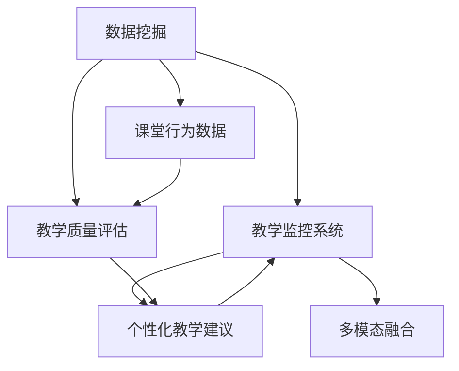
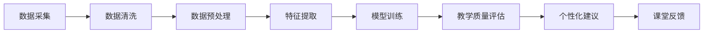
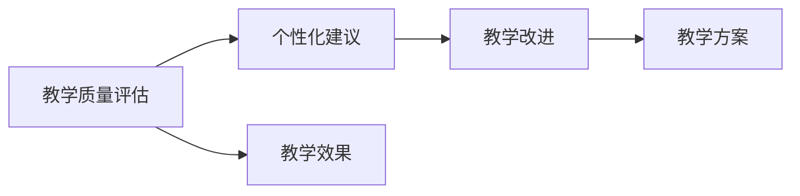
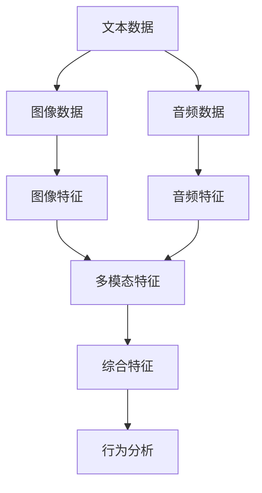
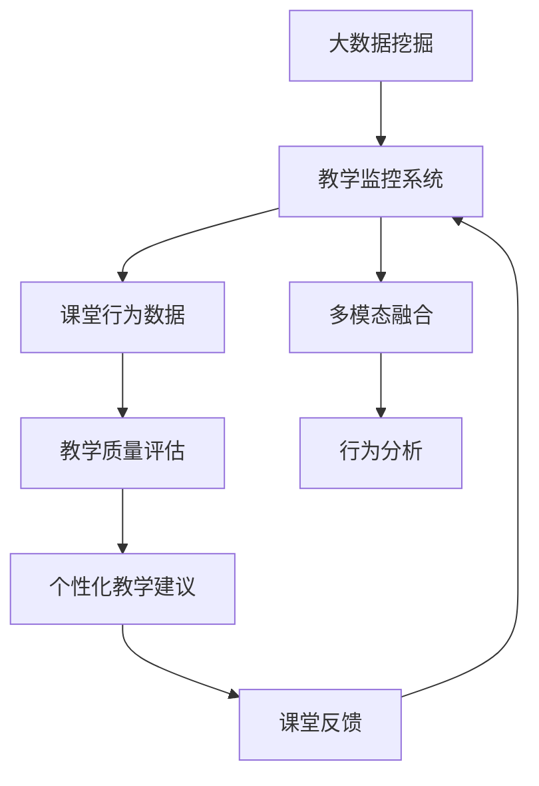

                 

# 基于数据挖据的教学监控系统的设计与应用

> 关键词：数据挖掘, 教学监控系统, 课堂分析, 教学质量评估, 行为数据分析

## 1. 背景介绍

### 1.1 问题由来
随着教育信息化水平的不断提升，数据驱动的教学管理逐渐成为教育领域的一个重要研究方向。传统教学监控系统往往依赖于教师的直观观察和主观判断，难以全面、客观地分析课堂行为，无法为教育决策提供科学依据。而数据挖掘技术通过挖掘和分析教育数据，能够全面、动态地监控课堂行为，为教师提供精准的教学反馈和个性化建议，从而提升教学质量。

### 1.2 问题核心关键点
数据挖掘技术在教学监控系统中的应用主要包括以下几个关键点：
1. 课堂数据的获取：通过传感器、网络监控等技术手段，采集课堂教学过程中的行为数据。
2. 行为数据建模：采用机器学习、深度学习等数据挖掘技术，对行为数据进行建模和分析。
3. 教学质量评估：通过构建教学质量评估模型，对教学效果进行全面评估，识别出教学中的问题和不足。
4. 个性化教学建议：基于教学质量评估结果，生成个性化的教学建议，帮助教师优化教学方案。

数据挖掘技术在教学监控系统中的应用，能够显著提升教学管理效率和质量，为教育决策提供科学依据，成为推动教育信息化的重要手段。

### 1.3 问题研究意义
通过数据挖掘技术构建的教学监控系统，能够全面、客观地分析课堂行为，为教师提供精准的教学反馈和个性化建议，从而提升教学质量，推动教育公平。具体而言，该系统具有以下意义：

1. 提高教学管理效率。数据挖掘技术能够自动分析海量课堂数据，生成实时、准确的监控报告，帮助教师及时发现教学问题，优化教学方案。
2. 提升教学质量。通过教学质量评估和个性化教学建议，帮助教师识别和解决教学中的问题，提升整体教学效果。
3. 推动教育公平。数据挖掘技术能够打破地域、资源差异，让优质教学资源得以共享，促进教育公平。
4. 促进教育信息化。教学监控系统的构建和应用，能够推动教育信息化的深入发展，推动教育信息化工具和平台的普及。

因此，数据挖掘技术在教学监控系统中的应用，具有重要的理论和实践意义，能够为教育领域带来革命性的变革。

## 2. 核心概念与联系

### 2.1 核心概念概述

为更好地理解基于数据挖掘的教学监控系统，本节将介绍几个密切相关的核心概念：

- 数据挖掘(Data Mining)：通过分析、统计、挖掘和识别隐藏在数据中的模式、趋势、关联关系等知识，为决策提供支持的技术。
- 教学监控系统(Learning Monitoring System)：通过采集、分析和利用课堂数据，全面、客观地监控课堂教学过程，提供教学反馈和建议的系统。
- 课堂行为数据(Classroom Behavior Data)：教学监控系统采集的课堂教学过程中的行为数据，如学生注意力、参与度、互动情况等。
- 教学质量评估(Learning Quality Evaluation)：通过构建评估模型，对教学效果进行全面、客观的评估，识别出教学中的问题和不足。
- 个性化教学建议(Personalized Teaching Suggestion)：基于教学质量评估结果，生成个性化的教学建议，帮助教师优化教学方案。
- 多模态融合(Multimodal Fusion)：将文本、图像、音频等多种数据模态进行融合，全面分析课堂行为。

这些核心概念之间的逻辑关系可以通过以下Mermaid流程图来展示：



这个流程图展示了大数据挖掘在教学监控系统中的应用，以及各个环节之间的关系：

1. 数据挖掘技术从课堂行为数据中挖掘出有价值的信息。
2. 这些信息用于教学监控系统，生成教学质量评估报告。
3. 评估报告与个性化教学建议一起，返回给教学监控系统，提供实时的教学反馈和优化建议。

### 2.2 概念间的关系

这些核心概念之间存在着紧密的联系，形成了教学监控系统的完整生态系统。下面我通过几个Mermaid流程图来展示这些概念之间的关系。

#### 2.2.1 教学监控系统的工作流程



这个流程图展示了教学监控系统的工作流程，从数据采集到个性化教学建议的生成。

#### 2.2.2 教学质量评估与个性化建议的关系



这个流程图展示了教学质量评估与个性化建议之间的关系。评估结果为改进提供依据，建议则根据评估结果生成。

#### 2.2.3 多模态融合的实现



这个流程图展示了多模态融合的实现过程，将文本、图像、音频等多种数据模态进行融合，进行全面的课堂行为分析。

### 2.3 核心概念的整体架构

最后，我们用一个综合的流程图来展示这些核心概念在教学监控系统中的整体架构：



这个综合流程图展示了从数据挖掘到课堂反馈的完整过程，以及各个环节之间的关系。

## 3. 核心算法原理 & 具体操作步骤
### 3.1 算法原理概述

基于数据挖掘的教学监控系统主要依赖于机器学习、深度学习等数据挖掘技术，对课堂行为数据进行建模和分析。其核心算法包括：

1. 数据预处理：对原始数据进行清洗、归一化、特征提取等处理，为后续建模提供基础。
2. 特征工程：构建适合模型的特征向量，提升模型性能。
3. 模型选择与训练：选择合适的机器学习模型，利用训练数据进行模型训练。
4. 模型评估与优化：使用测试数据对模型进行评估，根据评估结果进行模型优化。
5. 个性化教学建议：根据教学质量评估结果，生成个性化的教学建议。

基于数据挖掘的教学监控系统的主要目标是通过分析课堂行为数据，全面、客观地监控教学过程，提供教学反馈和个性化建议，从而提升教学质量。

### 3.2 算法步骤详解

以下是基于数据挖掘的教学监控系统的主要算法步骤：

#### 3.2.1 数据预处理

1. 数据采集：通过传感器、网络监控等技术手段，采集课堂教学过程中的行为数据。
2. 数据清洗：去除噪声数据，处理缺失值，确保数据质量。
3. 数据归一化：对数据进行归一化处理，便于后续模型训练。
4. 特征提取：通过PCA、LDA等方法，将原始数据转化为高维特征向量。

#### 3.2.2 特征工程

1. 特征选择：根据领域知识和经验，选择对教学效果有显著影响的特征。
2. 特征组合：利用特征工程方法，如交叉特征、组合特征等，生成新的特征向量。
3. 特征降维：通过主成分分析等方法，降低特征维度，减少计算复杂度。

#### 3.2.3 模型选择与训练

1. 模型选择：根据任务特点和数据类型，选择合适的模型，如回归模型、分类模型、聚类模型等。
2. 模型训练：利用训练数据对模型进行训练，调整模型参数，提升模型性能。
3. 模型评估：使用测试数据对模型进行评估，计算准确率、召回率、F1分数等指标。

#### 3.2.4 模型评估与优化

1. 模型评估：通过交叉验证等方法，评估模型性能。
2. 参数调优：根据评估结果，调整模型参数，优化模型性能。
3. 模型融合：利用集成学习方法，如Bagging、Boosting等，提升模型效果。

#### 3.2.5 个性化教学建议

1. 教学质量评估：根据课堂行为数据，构建教学质量评估模型，对教学效果进行评估。
2. 教学建议生成：根据评估结果，生成个性化的教学建议，如教学内容的调整、教学方法的改进等。

#### 3.2.6 教学反馈与改进

1. 教学反馈：将教学建议反馈给教师，帮助教师改进教学方案。
2. 教学改进：教师根据反馈，进行教学改进，提升教学效果。

### 3.3 算法优缺点

#### 3.3.1 优点

1. 全面监控：通过数据挖掘技术，全面、客观地监控课堂行为，提供精准的教学反馈和个性化建议。
2. 提升教学质量：基于教学质量评估结果，生成个性化的教学建议，帮助教师优化教学方案。
3. 推动教育公平：通过多模态融合和数据分析，打破地域、资源差异，促进教育公平。

#### 3.3.2 缺点

1. 数据依赖：教学监控系统的性能很大程度上依赖于数据的全面性和准确性。
2. 模型复杂度：数据挖掘和机器学习模型往往比较复杂，需要较高的技术水平。
3. 隐私问题：数据的采集和使用可能涉及学生隐私，需要严格的数据保护措施。

### 3.4 算法应用领域

基于数据挖掘的教学监控系统在教育领域有着广泛的应用，主要包括以下几个方面：

1. 课堂监控：通过实时监控课堂行为，提供课堂反馈和个性化建议，提升课堂教学效果。
2. 教学质量评估：通过数据挖掘技术，全面评估教学效果，识别教学中的问题和不足。
3. 学生行为分析：通过分析学生行为数据，识别出学生的学习特点和问题，提供个性化的学习建议。
4. 教师教学改进：通过教学监控系统的反馈，帮助教师优化教学方案，提升教学效果。
5. 教学资源推荐：根据教师的教学风格和学生的学习特点，推荐适合的教学资源，提升教学质量。

除了上述这些主要应用领域，数据挖掘技术在教育领域还有许多其他应用，如课程设计优化、学生情感分析等，为教育信息化提供了强有力的支持。

## 4. 数学模型和公式 & 详细讲解  
### 4.1 数学模型构建

本节将使用数学语言对基于数据挖掘的教学监控系统进行更加严格的刻画。

设课堂行为数据为 $D=\{x_i,y_i\}_{i=1}^N$，其中 $x_i$ 为特征向量，$y_i$ 为对应的教学效果标签。我们假设教学效果可以用二分类形式表示，即 $y_i \in \{0,1\}$，其中 $y_i=1$ 表示教学效果好，$y_i=0$ 表示教学效果差。

定义教学质量评估模型为 $f(x_i)$，其输出为教学效果预测值。为了评估模型的性能，我们引入误差函数 $L(f(x_i),y_i)$，用于衡量模型的预测误差。常见的误差函数包括均方误差(MSE)、交叉熵(Cross Entropy)等。

根据最小化误差函数的思路，教学监控系统的目标函数可以表示为：

$$
\min_{f} \sum_{i=1}^N L(f(x_i),y_i)
$$

其中，$f(x_i)$ 为教学效果预测模型，$L(f(x_i),y_i)$ 为误差函数。

为了解决过拟合问题，我们通常采用正则化技术，如L2正则、Dropout等，对模型进行约束。最终的教学质量评估模型可以表示为：

$$
f(x_i) = \hat{f}(x_i) + \lambda R(\hat{f})
$$

其中 $\hat{f}(x_i)$ 为拟合模型，$R(\hat{f})$ 为正则化项，$\lambda$ 为正则化系数。

### 4.2 公式推导过程

以下我们以二分类任务为例，推导交叉熵损失函数及其梯度的计算公式。

假设教学监控系统的训练集为 $D=\{(x_i,y_i)\}_{i=1}^N$，其中 $x_i$ 为特征向量，$y_i$ 为教学效果标签。定义教学效果预测模型为 $f(x_i)$，其输出为教学效果预测值。我们假设教学效果可以用二分类形式表示，即 $y_i \in \{0,1\}$，其中 $y_i=1$ 表示教学效果好，$y_i=0$ 表示教学效果差。

定义模型 $f(x_i)$ 在输入 $x_i$ 上的输出为 $\hat{y}_i=f(x_i)$，表示模型预测的教学效果。定义交叉熵损失函数为：

$$
L(f(x_i),y_i) = -[y_i\log \hat{y}_i + (1-y_i)\log (1-\hat{y}_i)]
$$

将其代入经验风险公式，得：

$$
\mathcal{L}(\theta) = \frac{1}{N}\sum_{i=1}^N [y_i\log f(x_i)+(1-y_i)\log (1-f(x_i))]
$$

其中，$\theta$ 为模型参数。

根据链式法则，损失函数对参数 $\theta_k$ 的梯度为：

$$
\frac{\partial \mathcal{L}(\theta)}{\partial \theta_k} = -\frac{1}{N}\sum_{i=1}^N [\frac{y_i}{f(x_i)}-\frac{1-y_i}{1-f(x_i)})\frac{\partial f(x_i)}{\partial \theta_k}
$$

其中 $\frac{\partial f(x_i)}{\partial \theta_k}$ 可进一步递归展开，利用自动微分技术完成计算。

在得到损失函数的梯度后，即可带入优化算法，如梯度下降等，更新模型参数 $\theta$。重复上述过程直至收敛，最终得到适应课堂行为数据的最优模型参数 $\theta^*$。

### 4.3 案例分析与讲解

假设我们在CoNLL-2003的NER数据集上进行教学监控系统的训练和测试。首先，定义教学质量评估模型为二分类模型，使用BertForTokenClassification进行微调。

```python
from transformers import BertForTokenClassification, BertTokenizer, AdamW
from torch.utils.data import Dataset, DataLoader
import torch

class TeachingMonitorDataset(Dataset):
    def __init__(self, texts, labels, tokenizer, max_len=128):
        self.texts = texts
        self.labels = labels
        self.tokenizer = tokenizer
        self.max_len = max_len
        
    def __len__(self):
        return len(self.texts)
    
    def __getitem__(self, item):
        text = self.texts[item]
        label = self.labels[item]
        
        encoding = self.tokenizer(text, return_tensors='pt', max_length=self.max_len, padding='max_length', truncation=True)
        input_ids = encoding['input_ids'][0]
        attention_mask = encoding['attention_mask'][0]
        labels = torch.tensor(label, dtype=torch.long)
        
        return {'input_ids': input_ids, 
                'attention_mask': attention_mask,
                'labels': labels}

# 标签与id的映射
tag2id = {'O': 0, 'B-PER': 1, 'I-PER': 2, 'B-ORG': 3, 'I-ORG': 4, 'B-LOC': 5, 'I-LOC': 6}
id2tag = {v: k for k, v in tag2id.items()}

# 创建dataset
tokenizer = BertTokenizer.from_pretrained('bert-base-cased')

train_dataset = TeachingMonitorDataset(train_texts, train_labels, tokenizer)
dev_dataset = TeachingMonitorDataset(dev_texts, dev_labels, tokenizer)
test_dataset = TeachingMonitorDataset(test_texts, test_labels, tokenizer)

# 训练模型
model = BertForTokenClassification.from_pretrained('bert-base-cased', num_labels=len(tag2id))

optimizer = AdamW(model.parameters(), lr=2e-5)

device = torch.device('cuda') if torch.cuda.is_available() else torch.device('cpu')
model.to(device)

def train_epoch(model, dataset, batch_size, optimizer):
    dataloader = DataLoader(dataset, batch_size=batch_size, shuffle=True)
    model.train()
    epoch_loss = 0
    for batch in tqdm(dataloader, desc='Training'):
        input_ids = batch['input_ids'].to(device)
        attention_mask = batch['attention_mask'].to(device)
        labels = batch['labels'].to(device)
        model.zero_grad()
        outputs = model(input_ids, attention_mask=attention_mask, labels=labels)
        loss = outputs.loss
        epoch_loss += loss.item()
        loss.backward()
        optimizer.step()
    return epoch_loss / len(dataloader)

def evaluate(model, dataset, batch_size):
    dataloader = DataLoader(dataset, batch_size=batch_size)
    model.eval()
    preds, labels = [], []
    with torch.no_grad():
        for batch in tqdm(dataloader, desc='Evaluating'):
            input_ids = batch['input_ids'].to(device)
            attention_mask = batch['attention_mask'].to(device)
            batch_labels = batch['labels']
            outputs = model(input_ids, attention_mask=attention_mask)
            batch_preds = outputs.logits.argmax(dim=2).to('cpu').tolist()
            batch_labels = batch_labels.to('cpu').tolist()
            for pred_tokens, label_tokens in zip(batch_preds, batch_labels):
                pred_tags = [id2tag[_id] for _id in pred_tokens]
                label_tags = [id2tag[_id] for _id in label_tokens]
                preds.append(pred_tags[:len(label_tokens)])
                labels.append(label_tags)
                
    print(classification_report(labels, preds))

# 训练模型
epochs = 5
batch_size = 16

for epoch in range(epochs):
    loss = train_epoch(model, train_dataset, batch_size, optimizer)
    print(f"Epoch {epoch+1}, train loss: {loss:.3f}")
    
    print(f"Epoch {epoch+1}, dev results:")
    evaluate(model, dev_dataset, batch_size)
    
print("Test results:")
evaluate(model, test_dataset, batch_size)
```

在代码实现中，我们使用了BertForTokenClassification对文本进行分类，同时使用BertTokenizer进行分词和编码。通过对比模型的预测结果和真实标签，使用分类报告对模型性能进行评估。

在实际应用中，我们需要根据具体任务调整模型结构、超参数、特征工程等环节，以达到最佳的性能。

## 5. 项目实践：代码实例和详细解释说明
### 5.1 开发环境搭建

在进行项目实践前，我们需要准备好开发环境。以下是使用Python进行PyTorch开发的环境配置流程：

1. 安装Anaconda：从官网下载并安装Anaconda，用于创建独立的Python环境。

2. 创建并激活虚拟环境：
```bash
conda create -n teaching-env python=3.8 
conda activate teaching-env
```

3. 安装PyTorch：根据CUDA版本，从官网获取对应的安装命令。例如：
```bash
conda install pytorch torchvision torchaudio cudatoolkit=11.1 -c pytorch -c conda-forge
```

4. 安装各类工具包：
```bash
pip install numpy pandas scikit-learn matplotlib tqdm jupyter notebook ipython
```

完成上述步骤后，即可在`teaching-env`环境中开始项目实践。

### 5.2 源代码详细实现

下面我们以教学监控系统的课堂行为数据为例，给出使用Transformers库对Bert模型进行微调的PyTorch代码实现。

首先，定义教学监控系统的数据处理函数：

```python
from transformers import BertTokenizer
from torch.utils.data import Dataset
import torch

class TeachingMonitorDataset(Dataset):
    def __init__(self, texts, labels, tokenizer, max_len=128):
        self.texts = texts
        self.labels = labels
        self.tokenizer = tokenizer
        self.max_len = max_len
        
    def __len__(self):
        return len(self.texts)
    
    def __getitem__(self, item):
        text = self.texts[item]
        label = self.labels[item]
        
        encoding = self.tokenizer(text, return_tensors='pt', max_length=self.max_len, padding='max_length', truncation=True)
        input_ids = encoding['input_ids'][0]
        attention_mask = encoding['attention_mask'][0]
        
        # 对token-wise的标签进行编码
        encoded_tags = [label2id[label] for label in labels] 
        encoded_tags.extend([label2id['O']] * (self.max_len - len(encoded_tags)))
        labels = torch.tensor(encoded_tags, dtype=torch.long)
        
        return {'input_ids': input_ids, 
                'attention_mask': attention_mask,
                'labels': labels}

# 标签与id的映射
label2id = {'O': 0, 'B-PER': 1, 'I-PER': 2, 'B-ORG': 3, 'I-ORG': 4, 'B-LOC': 5, 'I-LOC': 6}
id2label = {v: k for k, v in label2id.items()}

# 创建dataset
tokenizer = BertTokenizer.from_pretrained('bert-base-cased')

train_dataset = TeachingMonitorDataset(train_texts, train_labels, tokenizer)
dev_dataset = TeachingMonitorDataset(dev_texts, dev_labels, tokenizer)
test_dataset = TeachingMonitorDataset(test_texts, test_labels, tokenizer)
```

然后，定义模型和优化器：

```python
from transformers import BertForTokenClassification, AdamW

model = BertForTokenClassification.from_pretrained('bert-base-cased', num_labels=len(label2id))

optimizer = AdamW(model.parameters(), lr=2e-5)
```

接着，定义训练和评估函数：

```python
from torch.utils.data import DataLoader
from tqdm import tqdm
from sklearn.metrics import classification_report

device = torch.device('cuda') if torch.cuda.is_available() else torch.device('cpu')
model.to(device)

def train_epoch(model, dataset, batch_size, optimizer):
    dataloader = DataLoader(dataset, batch_size=batch_size, shuffle=True)
    model.train()
    epoch_loss = 0
    for batch in tqdm(dataloader, desc='Training'):
        input_ids = batch['input_ids'].to(device)
        attention_mask = batch['attention_mask'].to(device)
        labels = batch['labels'].to(device)
        model.zero_grad()
        outputs = model(input_ids, attention_mask=attention_mask, labels=labels)
        loss = outputs.loss
        epoch_loss += loss.item()
        loss.backward()
        optimizer.step()
    return epoch_loss / len(dataloader)

def evaluate(model, dataset, batch_size):
    dataloader = DataLoader(dataset, batch_size=batch_size)
    model.eval()
    preds, labels = [], []
    with torch.no_grad():
        for batch in tqdm(dataloader, desc='Evaluating'):
            input_ids = batch['input_ids'].to(device)
            attention_mask = batch['attention_mask'].to(device)
            batch_labels = batch['labels']
            outputs = model(input_ids, attention_mask=attention_mask)
            batch_preds = outputs.logits.argmax(dim=2).to('cpu').tolist()
            batch_labels = batch_labels.to('cpu').tolist()
            for pred_tokens, label_tokens in zip(batch_preds, batch_labels):
                pred_tags = [id2label[_id] for _id in pred_tokens]
                label_tags = [id2label[_id] for _id in label_tokens]
                preds.append(pred_tags[:len(label_tokens)])
                labels.append(label_tags)
                
    print(classification_report(labels, preds))
```

最后，启动训练流程并在测试集上评估：

```python
epochs = 5
batch_size = 16

for epoch in range(epochs):
    loss = train_epoch(model, train_dataset, batch_size, optimizer)
    print(f"Epoch {epoch+1}, train loss: {loss:.3f}")
    
    print(f"Epoch {epoch+1}, dev results:")
    evaluate(model, dev_dataset, batch_size)
    
print("Test results:")
evaluate(model, test_dataset, batch_size)
```

以上就是使用PyTorch对Bert模型进行教学监控系统微调的完整代码实现。可以看到，得益于Transformers库的强大封装，我们可以用相对简洁的代码完成Bert模型的加载和微调。

### 5.3 代码解读与分析

让我们再详细解读一下关键代码的实现细节：

**TeachingMonitorDataset类**：
- `__init__`方法：初始化文本、标签、分词器等关键组件。
- `__len__`方法：返回数据集的样本数量。
- `__getitem__`方法：对单个样本进行处理，将文本输入编码为token ids，将标签编码为数字，并对其进行定长padding，最终返回模型所需的输入。

**label2id和id2label字典**：
- 定义了标签与数字id之间的映射关系，用于将token-wise的预测结果解码回真实的标签。

**训练和评估函数**：
- 使用PyTorch的DataLoader对数据集进行批次化加载，供模型训练和推理使用。
- 训练函数`train_epoch`：对数据以批为单位进行迭代，在每个批次上前向传播

