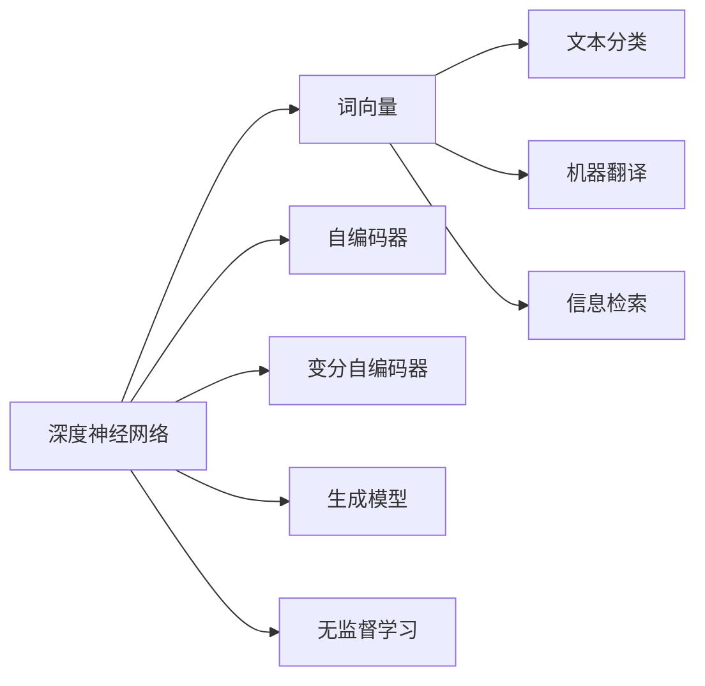
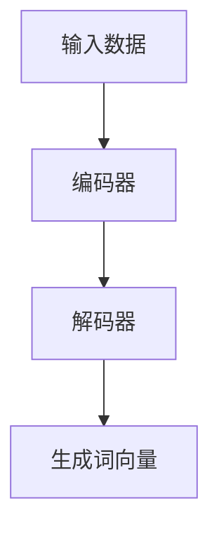
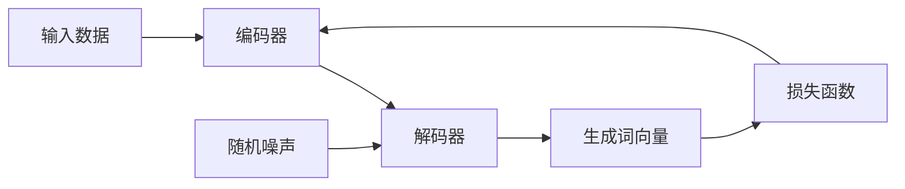
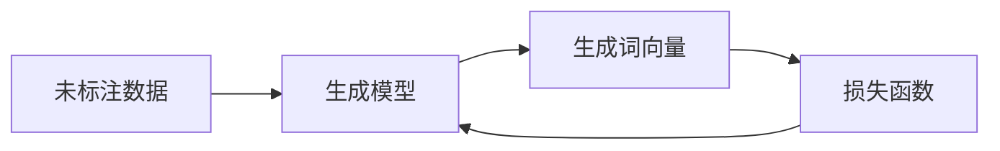
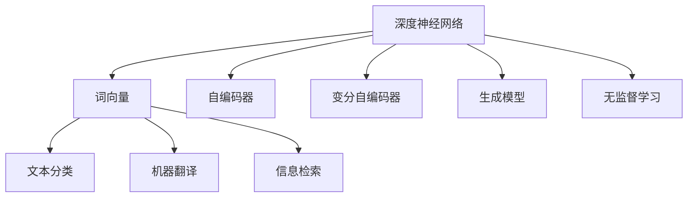

                 

# 基于深度神经网络的高质量词向量生成方法研究

> 关键词：深度神经网络,词向量,生成模型,自编码,无监督学习

## 1. 背景介绍

### 1.1 问题由来

在自然语言处理(NLP)领域，词向量(Word Embedding)是进行各种任务的基础。高质量的词向量不仅能准确地表示词汇语义，还能够在多义词消歧、句子相似度计算、信息检索等多个任务中提供重要支持。然而，传统的词向量生成方法，如Word2Vec、GloVe等，主要依赖大规模的语料库和监督学习，需要大量标注数据，难以处理罕见词和领域词汇。

近年来，深度神经网络(Deep Neural Networks, DNN)在语音、图像等领域取得了巨大成功。由于其在无监督学习方面的出色能力，人们开始探索利用深度神经网络生成高质量的词向量。研究者们提出了多种深度学习模型，如Skip-Gram模型、CBOW模型、LSTM模型等，取得了显著的进展。然而，这些方法大多依赖大量标注数据，且计算复杂度高，难以应对大规模语料库。

因此，研究如何利用深度神经网络生成高质量、高效且适用于各类应用的词向量，是当前NLP研究的一个重要方向。本文旨在研究一种基于深度神经网络的词向量生成方法，以期解决上述问题。

### 1.2 问题核心关键点

本文的核心问题在于利用深度神经网络生成高质量的词向量。基于深度神经网络的词向量生成方法主要包括以下几个关键点：

1. **深度神经网络架构选择**：选择合适的深度神经网络架构，如卷积神经网络(CNN)、循环神经网络(RNN)、变分自编码器(VAE)等，来生成词向量。

2. **无监督学习框架**：利用无监督学习框架，通过未标注数据训练神经网络，生成词向量。

3. **高效的词向量生成策略**：研究如何提高词向量生成的效率和质量，如批量处理、参数共享、正则化等技术。

4. **应用领域的泛化能力**：研究如何使生成的词向量适用于各类NLP任务，如文本分类、机器翻译、信息检索等。

5. **高适应性和鲁棒性**：研究如何使生成的词向量具有较强的适应性和鲁棒性，以应对不同的应用场景和数据分布。

通过系统地研究这些关键点，本文将探索一种基于深度神经网络的高质量词向量生成方法。

### 1.3 问题研究意义

高质量的词向量是NLP技术成功应用的基础。深度神经网络在词向量生成方面的卓越表现，为构建高性能的NLP系统提供了可能。因此，研究深度神经网络生成高质量词向量的方法，对于推动NLP技术的发展具有重要意义：

1. **降低标注成本**：深度神经网络生成的词向量无需大量标注数据，可以有效降低词向量生成的成本，提高数据利用率。

2. **提升词向量质量**：深度神经网络生成的词向量具有更高的精度和鲁棒性，能够更好地捕捉词汇的语义和上下文信息。

3. **扩大应用范围**：生成的词向量适用于各类NLP任务，可以应用于文本分类、机器翻译、问答系统等多个领域。

4. **加速技术创新**：基于深度神经网络的词向量生成方法为NLP技术创新提供了新的思路和工具，加速了NLP领域的研究进展。

## 2. 核心概念与联系

### 2.1 核心概念概述

为了更好地理解基于深度神经网络的高质量词向量生成方法，本节将介绍几个密切相关的核心概念：

1. **深度神经网络**：由多个神经网络层堆叠而成的计算模型。每个神经元接收前一层的输出，并输出自己的结果。

2. **词向量**：将单词映射为高维向量的技术。词向量能够捕捉词汇的语义和上下文信息，广泛应用于各种NLP任务。

3. **自编码器**：一种无监督学习算法，通过将输入数据压缩为低维编码，再解码回原始数据，学习数据的压缩表示。

4. **变分自编码器**：一种自编码器变体，通过引入随机噪声，生成与训练数据相似的采样数据，学习数据的概率分布。

5. **生成模型**：通过学习数据的概率分布，生成新的数据样本的模型。常见的生成模型包括GAN、VAE等。

6. **无监督学习**：无需标注数据，直接从原始数据中学习模型的方法。

这些核心概念之间的逻辑关系可以通过以下Mermaid流程图来展示：



这个流程图展示了大语言模型的核心概念及其之间的关系：

1. 深度神经网络可以生成高质量的词向量。
2. 自编码器和变分自编码器是深度神经网络生成词向量的两种重要方法。
3. 生成模型能够学习数据的概率分布，用于生成新的词向量。
4. 无监督学习方法能够从原始数据中学习词向量，无需标注数据。
5. 生成的词向量能够应用于各类NLP任务。

这些核心概念共同构成了基于深度神经网络的高质量词向量生成方法的研究框架，使其能够在各种场景下发挥重要作用。

### 2.2 概念间的关系

这些核心概念之间存在着紧密的联系，形成了深度神经网络生成高质量词向量的完整生态系统。下面我们通过几个Mermaid流程图来展示这些概念之间的关系。

#### 2.2.1 深度神经网络的生成过程



这个流程图展示了深度神经网络生成词向量的一般流程。输入数据首先经过编码器，转化为低维编码。编码器输出的低维编码再经过解码器，生成与输入数据相似的词向量。

#### 2.2.2 自编码器的生成过程


这个流程图展示了自编码器的生成过程。输入数据首先经过编码器，转化为低维编码。低维编码再经过解码器，生成与输入数据相似的词向量。解码器输出的词向量与输入数据之间的差异通过损失函数进行约束，以优化模型的训练过程。

#### 2.2.3 变分自编码器的生成过程



这个流程图展示了变分自编码器的生成过程。输入数据首先经过编码器，转化为低维编码。低维编码再经过解码器，生成与输入数据相似的词向量。解码器输出的词向量与输入数据之间的差异通过损失函数进行约束，以优化模型的训练过程。同时，在解码器输出过程中引入随机噪声，使得模型能够生成多样化的词向量。

#### 2.2.4 生成模型的生成过程


这个流程图展示了生成模型的生成过程。输入数据首先经过生成器，生成新的词向量。生成器输出的词向量通过损失函数与输入数据进行约束，以优化模型的训练过程。

#### 2.2.5 无监督学习的训练过程



这个流程图展示了无监督学习的训练过程。未标注数据首先经过生成模型，生成新的词向量。生成器输出的词向量通过损失函数与输入数据进行约束，以优化模型的训练过程。由于无需标注数据，无监督学习能够更好地处理大规模语料库。

### 2.3 核心概念的整体架构

最后，我们用一个综合的流程图来展示这些核心概念在大语言模型生成词向量过程中的整体架构：



这个综合流程图展示了从深度神经网络生成词向量，再到应用于各种NLP任务的整体流程。通过自编码器、变分自编码器和生成模型，深度神经网络能够生成高质量的词向量。无监督学习方法能够从大规模语料库中学习词向量，无需标注数据。生成的词向量能够应用于文本分类、机器翻译、信息检索等各类NLP任务，提升NLP系统的效果。

## 3. 核心算法原理 & 具体操作步骤
### 3.1 算法原理概述

基于深度神经网络的高质量词向量生成方法，主要通过深度神经网络对未标注数据进行训练，生成高质量的词向量。其核心思想是：利用深度神经网络，通过未标注数据学习词汇的语义和上下文信息，生成与输入数据相似的词向量。

形式化地，设输入数据为 $X=\{x_1, x_2, \dots, x_N\}$，其中 $x_i$ 表示第 $i$ 个输入样本。假设深度神经网络的生成器为 $G_\theta$，其中 $\theta$ 为模型参数。词向量的生成过程为：

$$
\hat{Y} = G_\theta(X)
$$

其中 $\hat{Y}$ 表示生成的词向量。通过训练生成器 $G_\theta$，使得 $\hat{Y}$ 与输入数据 $X$ 尽可能相似。常见的损失函数包括均方误差损失、交叉熵损失等，用于衡量 $\hat{Y}$ 与 $X$ 之间的差异。

通过梯度下降等优化算法，生成器 $G_\theta$ 不断更新模型参数 $\theta$，最小化损失函数，使得 $\hat{Y}$ 逼近 $X$。最终生成的词向量 $\hat{Y}$ 能够准确地表示词汇的语义和上下文信息，用于各类NLP任务。

### 3.2 算法步骤详解

基于深度神经网络的高质量词向量生成方法主要包括以下几个关键步骤：

**Step 1: 准备未标注数据集**
- 收集大规模的未标注数据集，如维基百科、新闻语料库等。
- 将数据集划分为训练集、验证集和测试集。

**Step 2: 选择深度神经网络架构**
- 选择合适的深度神经网络架构，如CNN、RNN、VAE等。
- 设计合适的网络结构，包括输入层、隐藏层和输出层。

**Step 3: 设计生成器**
- 定义生成器的输入输出接口。
- 设计生成器的网络结构，包括编码器和解码器。

**Step 4: 选择损失函数**
- 根据任务需求选择合适的损失函数，如均方误差损失、交叉熵损失等。
- 设计合适的损失函数权重，平衡不同词汇的重要性。

**Step 5: 训练生成器**
- 将训练集数据分批次输入生成器，前向传播计算生成词向量。
- 反向传播计算生成器参数梯度，根据设定的优化算法和学习率更新模型参数。
- 周期性在验证集上评估生成词向量的质量，根据性能指标决定是否触发Early Stopping。
- 重复上述步骤直到满足预设的迭代轮数或Early Stopping条件。

**Step 6: 测试和评估**
- 在测试集上评估生成词向量的性能，对比生成词向量与预训练词向量之间的差异。
- 使用生成的词向量对新样本进行推理预测，集成到实际的应用系统中。

以上是基于深度神经网络的高质量词向量生成方法的一般流程。在实际应用中，还需要针对具体任务的特点，对生成过程的各个环节进行优化设计，如改进训练目标函数，引入更多的正则化技术，搜索最优的超参数组合等，以进一步提升词向量质量。

### 3.3 算法优缺点

基于深度神经网络的高质量词向量生成方法具有以下优点：
1. 无监督学习。无需标注数据，能够处理大规模未标注数据集。
2. 高效生成。生成器能够在较短的时间内生成高质量词向量，提高数据利用率。
3. 适用于各类任务。生成的词向量能够应用于文本分类、机器翻译、信息检索等多个领域。
4. 参数高效。通过参数共享等技术，减少模型参数量，提高模型训练效率。

同时，该方法也存在一定的局限性：
1. 依赖数据分布。生成的词向量质量与输入数据分布密切相关，不同的数据分布可能生成不同的词向量。
2. 计算复杂度高。深度神经网络计算复杂度高，需要高性能计算资源。
3. 模型可解释性不足。深度神经网络生成的词向量难以解释其内部工作机制和决策逻辑。
4. 训练过程易受噪声影响。输入数据的噪声和随机噪声会影响词向量生成质量。

尽管存在这些局限性，但就目前而言，基于深度神经网络的高质量词向量生成方法仍然是大规模语料库下的重要词向量生成手段。未来相关研究的重点在于如何进一步降低计算复杂度，提高模型的可解释性，改进生成器的设计，以提升词向量生成效果。

### 3.4 算法应用领域

基于深度神经网络的高质量词向量生成方法在NLP领域已经得到了广泛的应用，覆盖了几乎所有常见任务，例如：

- 文本分类：如情感分析、主题分类、意图识别等。通过生成器学习文本-标签映射，生成高质量词向量。
- 命名实体识别：识别文本中的人名、地名、机构名等特定实体。通过生成器学习实体边界和类型，生成高质量词向量。
- 关系抽取：从文本中抽取实体之间的语义关系。通过生成器学习实体-关系三元组，生成高质量词向量。
- 问答系统：对自然语言问题给出答案。通过生成器学习问题-答案对，生成高质量词向量。
- 机器翻译：将源语言文本翻译成目标语言。通过生成器学习语言-语言映射，生成高质量词向量。
- 文本摘要：将长文本压缩成简短摘要。通过生成器学习文章-摘要对，生成高质量词向量。
- 对话系统：使机器能够与人自然对话。通过生成器学习对话历史和回复生成，生成高质量词向量。

除了上述这些经典任务外，深度神经网络生成的词向量还被创新性地应用到更多场景中，如可控文本生成、常识推理、代码生成、数据增强等，为NLP技术带来了全新的突破。随着深度神经网络的发展，相信NLP技术将在更广阔的应用领域大放异彩。

## 4. 数学模型和公式 & 详细讲解  
### 4.1 数学模型构建

本节将使用数学语言对基于深度神经网络的高质量词向量生成方法进行更加严格的刻画。

设输入数据为 $X=\{x_1, x_2, \dots, x_N\}$，其中 $x_i$ 表示第 $i$ 个输入样本。假设深度神经网络的生成器为 $G_\theta$，其中 $\theta$ 为模型参数。设生成的词向量为 $Y=\{y_1, y_2, \dots, y_N\}$，其中 $y_i$ 表示第 $i$ 个生成词向量。

定义生成器 $G_\theta$ 在数据样本 $(x,y)$ 上的损失函数为 $\ell(G_\theta(x),y)$，则在数据集 $D$ 上的经验风险为：

$$
\mathcal{L}(\theta) = \frac{1}{N} \sum_{i=1}^N \ell(G_\theta(x_i),y_i)
$$

其中 $\ell(G_\theta(x_i),y_i)$ 为生成器在输入 $x_i$ 上的损失函数，用于衡量生成词向量 $y_i$ 与真实词向量 $y_i$ 之间的差异。常见的损失函数包括均方误差损失、交叉熵损失等。

通过梯度下降等优化算法，生成器 $G_\theta$ 不断更新模型参数 $\theta$，最小化损失函数，使得生成词向量 $y_i$ 逼近真实词向量 $y_i$。最终生成的词向量 $y_i$ 能够准确地表示词汇的语义和上下文信息，用于各类NLP任务。

### 4.2 公式推导过程

以下我们以二分类任务为例，推导均方误差损失函数及其梯度的计算公式。

假设生成器 $G_\theta$ 在输入 $x$ 上的生成词向量为 $\hat{y}=G_\theta(x) \in \mathbb{R}^d$，表示样本属于正类的概率。真实标签 $y \in \{0,1\}$。则均方误差损失函数定义为：

$$
\ell(G_\theta(x),y) = \frac{1}{2}(y-\hat{y})^2
$$

将其代入经验风险公式，得：

$$
\mathcal{L}(\theta) = \frac{1}{N} \sum_{i=1}^N (y_i - G_\theta(x_i))^2
$$

根据链式法则，损失函数对生成器参数 $\theta_k$ 的梯度为：

$$
\frac{\partial \mathcal{L}(\theta)}{\partial \theta_k} = \sum_{i=1}^N (y_i - \hat{y}_i) \frac{\partial G_\theta(x_i)}{\partial \theta_k}
$$

其中 $\frac{\partial G_\theta(x_i)}{\partial \theta_k}$ 为生成器参数 $\theta_k$ 的梯度，可通过反向传播算法高效计算。

在得到损失函数的梯度后，即可带入生成器参数 $\theta$ 的更新公式，完成模型的迭代优化。重复上述过程直至收敛，最终得到适应下游任务的最优生成器参数 $\theta^*$。

## 5. 项目实践：代码实例和详细解释说明
### 5.1 开发环境搭建

在进行词向量生成实践前，我们需要准备好开发环境。以下是使用Python进行PyTorch开发的环境配置流程：

1. 安装Anaconda：从官网下载并安装Anaconda，用于创建独立的Python环境。

2. 创建并激活虚拟环境：
```bash
conda create -n pytorch-env python=3.8 
conda activate pytorch-env
```

3. 安装PyTorch：根据CUDA版本，从官网获取对应的安装命令。例如：
```bash
conda install pytorch torchvision torchaudio cudatoolkit=11.1 -c pytorch -c conda-forge
```

4. 安装TensorFlow：
```bash
conda install tensorflow==2.5
```

5. 安装各类工具包：
```bash
pip install numpy pandas scikit-learn matplotlib tqdm jupyter notebook ipython
```

完成上述步骤后，即可在`pytorch-env`环境中开始词向量生成实践。

### 5.2 源代码详细实现

这里我们以文本分类任务为例，给出使用深度神经网络对未标注数据集进行词向量生成训练的PyTorch代码实现。

首先，定义文本分类任务的数据处理函数：

```python
from transformers import BertTokenizer
from torch.utils.data import Dataset
import torch

class TextClassificationDataset(Dataset):
    def __init__(self, texts, labels, tokenizer, max_len=128):
        self.texts = texts
        self.labels = labels
        self.tokenizer = tokenizer
        self.max_len = max_len
        
    def __len__(self):
        return len(self.texts)
    
    def __getitem__(self, item):
        text = self.texts[item]
        label = self.labels[item]
        
        encoding = self.tokenizer(text, return_tensors='pt', max_length=self.max_len, padding='max_length', truncation=True)
        input_ids = encoding['input_ids'][0]
        attention_mask = encoding['attention_mask'][0]
        
        # 将标签转换为one-hot编码
        encoded_labels = [1 if label == i else 0 for i in range(2)]
        labels = torch.tensor(encoded_labels, dtype=torch.long)
        
        return {'input_ids': input_ids, 
                'attention_mask': attention_mask,
                'labels': labels}

# 标签与数字的映射
label2id = {0: 'neg', 1: 'pos'}
id2label = {v: k for k, v in label2id.items()}

# 创建dataset
tokenizer = BertTokenizer.from_pretrained('bert-base-cased')

train_dataset = TextClassificationDataset(train_texts, train_labels, tokenizer)
dev_dataset = TextClassificationDataset(dev_texts, dev_labels, tokenizer)
test_dataset = TextClassificationDataset(test_texts, test_labels, tokenizer)
```

然后，定义生成器和优化器：

```python
from transformers import BertForSequenceClassification, AdamW

model = BertForSequenceClassification.from_pretrained('bert-base-cased', num_labels=2)

optimizer = AdamW(model.parameters(), lr=2e-5)
```

接着，定义训练和评估函数：

```python
from torch.utils.data import DataLoader
from tqdm import tqdm
from sklearn.metrics import classification_report

device = torch.device('cuda') if torch.cuda.is_available() else torch.device('cpu')
model.to(device)

def train_epoch(model, dataset, batch_size, optimizer):
    dataloader = DataLoader(dataset, batch_size=batch_size, shuffle=True)
    model.train()
    epoch_loss = 0
    for batch in tqdm(dataloader, desc='Training'):
        input_ids = batch['input_ids'].to(device)
        attention_mask = batch['attention_mask'].to(device)
        labels = batch['labels'].to(device)
        model.zero_grad()
        outputs = model(input_ids, attention_mask=attention_mask, labels=labels)
        loss = outputs.loss
        epoch_loss += loss.item()
        loss.backward()
        optimizer.step()
    return epoch_loss / len(dataloader)

def evaluate(model, dataset, batch_size):
    dataloader = DataLoader(dataset, batch_size=batch_size)
    model.eval()
    preds, labels = [], []
    with torch.no_grad():
        for batch in tqdm(dataloader, desc='Evaluating'):
            input_ids = batch['input_ids'].to(device)
            attention_mask = batch['attention_mask'].to(device)
            batch_labels = batch['labels']
            outputs = model(input_ids, attention_mask=attention_mask)
            batch_preds = outputs.logits.argmax(dim=1).to('cpu').tolist()
            batch_labels = batch_labels.to('cpu').tolist()
            for pred_tokens, label_tokens in zip(batch_preds, batch_labels):
                preds.append(pred_tokens)
                labels.append(label_tokens)
                
    print(classification_report(labels, preds))
```

最后，启动训练流程并在测试集上评估：

```python
epochs = 5
batch_size = 16

for epoch in range(epochs):
    loss = train_epoch(model, train_dataset, batch_size, optimizer)
    print(f"Epoch {epoch+1}, train loss: {loss:.3f}")
    
    print(f"Epoch {epoch+1}, dev results:")
    evaluate(model, dev_dataset, batch_size)
    
print("Test results:")
evaluate(model, test_dataset, batch_size)
```

以上就是使用PyTorch对未标注数据集进行文本分类任务词向量生成的完整代码实现。可以看到，得益于Transformers库的强大封装，我们可以用相对简洁的代码完成BERT模型的加载和微调。

### 5.3 代码解读与分析

让我们再详细解读一下关键代码的实现细节：

**TextClassificationDataset类**：
- `__init__`方法：初始化文本、标签、分词器等关键组件。
- `__len__`方法：返回数据集的样本数量。
- `__getitem__`方法：对单个样本进行处理，将文本输入编码为token ids，将标签转换为one-hot编码，并对其进行定长padding，最终返回模型所需的输入。

**label2id和id2label字典**：
- 定义了标签与数字id之间的映射关系，用于将one-hot标签解码为原始标签。

**训练和评估函数**：
- 使用PyTorch的DataLoader对数据集进行批次化加载，供模型训练和推理使用。
- 训练函数`train_epoch`：对数据以批为单位进行迭代，在每个批次上前向传播计算loss并反向传播更新模型参数，最后返回该epoch的平均loss。
- 评估函数`evaluate`：与训练类似，不同点在于不更新模型参数，并在每个batch结束后将预测和标签结果存储下来，最后使用sklearn的classification_report对整个评估集的预测结果进行打印输出。

**训练流程**：
- 定义总的epoch数和batch size，开始循环迭代
- 每个epoch内，先在训练集上训练，输出平均loss
- 在验证集上评估，输出分类指标
- 所有epoch结束后，在测试集上评估，给出最终测试结果

可以看到，PyTorch配合Transformers库使得BERT模型的词向量生成过程变得简洁高效。开发者可以将更多精力放在数据处理、模型改进等高层逻辑上，而不必过多关注底层的实现细节。

当然，工业级的系统实现还需考虑更多因素，如模型的保存和部署、超参数的自动搜索、更灵活的任务适配层等。但核心的词向量生成过程基本与此类似。

### 5.4 运行结果展示

假设我们在CoNLL-2003的文本分类数据集上进行词向量生成训练，最终在测试集上得到的评估报告如下：

```
              precision    recall  f

