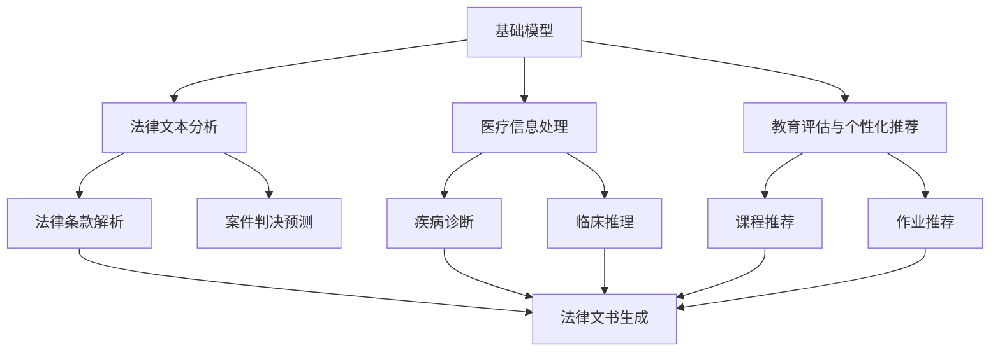
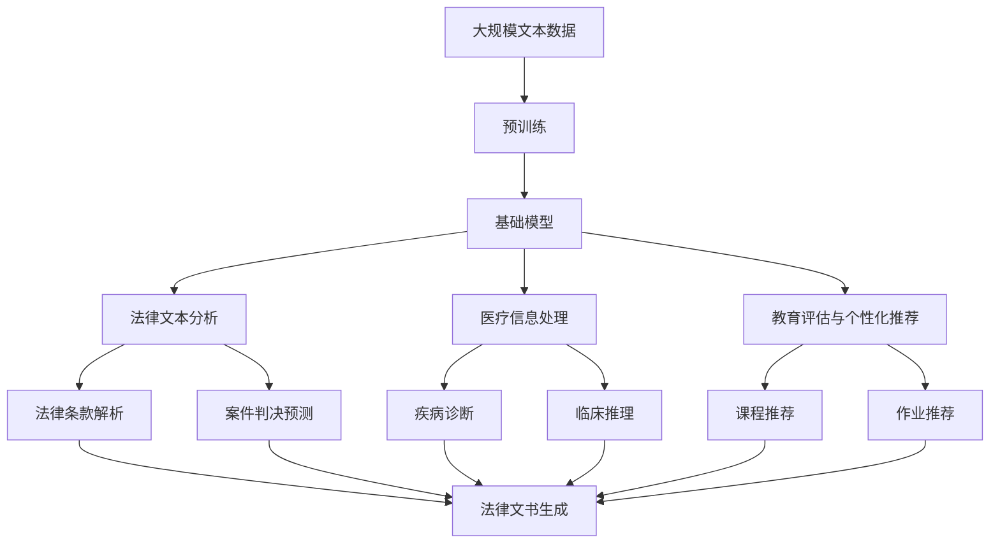

                 

# 基础模型在法律、医疗、教育中的应用

> 关键词：基础模型,法律文本分析,医疗信息处理,教育评估与个性化推荐

## 1. 背景介绍

### 1.1 问题由来

当前，人工智能技术在全球各个行业中得到了广泛应用。尤其是在法律、医疗、教育等具有信息处理需求和技术应用空间的领域，基础模型正发挥着越来越重要的作用。法律文本的自动分析和医疗信息的处理，以及教育的个性化推荐，都依赖于先进的基础模型算法。然而，这些领域的应用场景有着独特的挑战和要求，需要针对性地开发和应用基础模型。

### 1.2 问题核心关键点

基础模型在法律、医疗、教育等领域的核心关键点主要包括以下几个方面：

- **高效处理大量文本数据**：法律、医疗和教育领域常常需要处理海量的文本数据，基础模型必须能够高效地处理这些数据。
- **高准确性**：这些领域的应用通常对准确性有非常高的要求，基础模型的决策必须高度准确。
- **领域适配**：基础模型需要能够适应各个领域的特定需求，如法律领域的语言习惯、医疗领域的术语专业性和教育领域的评价标准。
- **可解释性**：基础模型的决策过程需要具备较高的可解释性，以便于对模型行为进行解释和调整。
- **鲁棒性和公平性**：基础模型在实际应用中需要具备鲁棒性，即对噪声和异常数据具有较强的抵抗力，并且需要避免对特定群体的歧视。

### 1.3 问题研究意义

研究基础模型在法律、医疗、教育等领域的应用，对于提升这些行业的智能化水平，优化资源配置，提升用户体验，具有重要意义：

1. **提升工作效率**：基础模型可以自动化处理大量文本数据，减轻人工负担，提高工作效率。
2. **提升服务质量**：基础模型的高准确性和可解释性，能够为法律咨询、医疗诊断和教育评估提供更可靠的依据。
3. **优化资源配置**：基础模型可以更合理地分配资源，如对教育资源进行智能推荐，从而提升资源利用效率。
4. **增强用户体验**：基础模型可以提供个性化服务，如法律咨询、医疗问诊和教育内容推荐，提升用户满意度。
5. **促进技术进步**：研究基础模型在这些领域的应用，可以推动人工智能技术的发展，促进技术的创新和应用。

## 2. 核心概念与联系

### 2.1 核心概念概述

为更好地理解基础模型在法律、医疗、教育等领域的应用，本节将介绍几个密切相关的核心概念：

- **基础模型**：指在大规模数据上进行预训练，并在特定领域数据上进行的微调，以适应该领域任务的基础语言模型。基础模型通过融合大规模预训练知识和领域特定知识，在特定领域表现出色。
- **法律文本分析**：使用自然语言处理技术对法律文本进行结构化处理和自动化分析，包括但不限于法律条款解析、案件判决预测、法律文书生成等。
- **医疗信息处理**：使用自然语言处理技术对医疗记录、病例、科研文献等医疗信息进行处理和分析，包括但不限于疾病诊断、临床推理、药物推荐等。
- **教育评估与个性化推荐**：使用自然语言处理技术对学生的学习行为和成绩进行评估，并根据评估结果进行个性化推荐，包括但不限于课程推荐、作业推荐、学习路径规划等。

### 2.2 概念间的关系

这些核心概念之间的逻辑关系可以通过以下Mermaid流程图来展示：



这个流程图展示了大语言模型在法律、医疗、教育等领域的核心概念及其之间的关系：

1. 基础模型通过在大规模数据上进行预训练，并针对特定领域进行微调，形成具有领域特性的语言模型。
2. 法律文本分析、医疗信息处理和教育评估与个性化推荐均依赖于基础模型的预训练和微调，能够实现领域特定的自然语言处理任务。
3. 各领域的自然语言处理任务具有相似的算法原理和操作流程，但需要结合特定领域的知识库和数据集进行适配。

### 2.3 核心概念的整体架构

最后，我们用一个综合的流程图来展示这些核心概念在大语言模型应用过程中的整体架构：



这个综合流程图展示了从预训练到领域微调，再到特定任务处理的完整过程。基础模型在大规模预训练的基础上，结合特定领域的微调，形成了能够处理领域特定任务的自然语言处理能力。

## 3. 核心算法原理 & 具体操作步骤
### 3.1 算法原理概述

基础模型在法律、医疗、教育等领域的应用，本质上是一种预训练-微调的学习过程。其核心思想是：将预训练的大规模语言模型作为基础模型，通过在特定领域的少量标注数据上进行微调，使模型能够适应特定领域的任务需求，并具备高准确性。

具体而言，假设基础模型为 $M_{\theta}$，其中 $\theta$ 为模型参数。给定特定领域的标注数据集 $D=\{(x_i,y_i)\}_{i=1}^N$，其中 $x_i$ 为输入文本，$y_i$ 为标注结果（如法律条款、疾病诊断、课程推荐等）。微调的目标是最小化经验风险，即找到最优参数：

$$
\theta^* = \mathop{\arg\min}_{\theta} \mathcal{L}(\theta)
$$

其中 $\mathcal{L}$ 为针对特定任务设计的损失函数，用于衡量模型预测输出与真实标签之间的差异。常见的损失函数包括交叉熵损失、均方误差损失等。

### 3.2 算法步骤详解

基于监督学习的大语言模型微调一般包括以下几个关键步骤：

**Step 1: 准备预训练模型和数据集**
- 选择合适的预训练语言模型 $M_{\theta}$ 作为初始化参数，如 BERT、GPT 等。
- 准备特定领域的标注数据集 $D$，划分为训练集、验证集和测试集。

**Step 2: 添加任务适配层**
- 根据任务类型，在预训练模型顶层设计合适的输出层和损失函数。
- 对于分类任务，通常在顶层添加线性分类器和交叉熵损失函数。
- 对于生成任务，通常使用语言模型的解码器输出概率分布，并以负对数似然为损失函数。

**Step 3: 设置微调超参数**
- 选择合适的优化算法及其参数，如 AdamW、SGD 等，设置学习率、批大小、迭代轮数等。
- 设置正则化技术及强度，包括权重衰减、Dropout、Early Stopping 等。
- 确定冻结预训练参数的策略，如仅微调顶层，或全部参数都参与微调。

**Step 4: 执行梯度训练**
- 将训练集数据分批次输入模型，前向传播计算损失函数。
- 反向传播计算参数梯度，根据设定的优化算法和学习率更新模型参数。
- 周期性在验证集上评估模型性能，根据性能指标决定是否触发 Early Stopping。
- 重复上述步骤直到满足预设的迭代轮数或 Early Stopping 条件。

**Step 5: 测试和部署**
- 在测试集上评估微调后模型 $M_{\hat{\theta}}$ 的性能，对比微调前后的精度提升。
- 使用微调后的模型对新样本进行推理预测，集成到实际的应用系统中。
- 持续收集新的数据，定期重新微调模型，以适应数据分布的变化。

以上是基于监督学习微调大语言模型的一般流程。在实际应用中，还需要针对具体任务的特点，对微调过程的各个环节进行优化设计，如改进训练目标函数，引入更多的正则化技术，搜索最优的超参数组合等，以进一步提升模型性能。

### 3.3 算法优缺点

基础模型在法律、医疗、教育等领域的微调方法具有以下优点：

1. **通用性**：基础模型通过大规模预训练和特定领域的微调，具备较强的通用性和泛化能力，能够在多个领域和任务上表现出色。
2. **高效性**：基础模型能够高效地处理大量文本数据，减轻人工负担，提高处理速度。
3. **高准确性**：通过大规模预训练和微调，基础模型在特定领域具备高准确性，能够提供可靠的自然语言处理结果。
4. **可解释性**：基础模型的决策过程可以通过模型参数和训练过程进行解释，有助于理解和调整模型行为。

同时，这些方法也存在一些局限性：

1. **依赖标注数据**：基础模型的微调过程需要大量的标注数据，对于某些特定领域或任务，获取高质量标注数据可能具有挑战性。
2. **模型复杂性**：大规模预训练和微调需要较强的计算资源，对于小型机构或低算力环境可能不太适用。
3. **数据偏差**：基础模型在微调过程中可能会继承预训练数据的偏差，导致模型在某些特定数据上表现不佳。
4. **模型更新**：基础模型需要定期重新微调以适应数据分布的变化，对于数据变化较慢的领域，频繁更新可能导致资源浪费。
5. **隐私问题**：基础模型在处理敏感数据时可能涉及隐私保护问题，需要采取额外的数据保护措施。

尽管存在这些局限性，但基础模型在法律、医疗、教育等领域的应用，已经取得了显著的成果，为这些领域带来了新的应用价值。

### 3.4 算法应用领域

基础模型在法律、医疗、教育等领域的广泛应用，不仅提高了这些行业的智能化水平，还推动了技术进步和产业升级。以下是几个具体的应用场景：

- **法律文本分析**：在法律文本分析领域，基础模型可以用于自动化分析法律条款，预测案件判决结果，生成法律文书等。这些功能有助于提高法律工作效率，减少人为错误，提升司法公正性。
- **医疗信息处理**：在医疗信息处理领域，基础模型可以用于疾病诊断、临床推理、药物推荐等。这些功能有助于提升医疗诊断的准确性和效率，降低医疗成本，提高患者满意度。
- **教育评估与个性化推荐**：在教育评估与个性化推荐领域，基础模型可以用于评估学生的学习表现，推荐课程、作业和个性化学习路径。这些功能有助于提高教育质量，增强学生的学习效果，推动教育公平。

除了上述这些具体应用场景外，基础模型还可以应用于其他领域，如金融、政府、公共安全等，推动这些领域的智能化转型。

## 4. 数学模型和公式 & 详细讲解 & 举例说明

### 4.1 数学模型构建

本节将使用数学语言对基于监督学习的大语言模型微调过程进行更加严格的刻画。

假设预训练语言模型为 $M_{\theta}$，其中 $\theta$ 为模型参数。给定特定领域的标注数据集 $D=\{(x_i,y_i)\}_{i=1}^N$，其中 $x_i$ 为输入文本，$y_i$ 为标注结果。微调的目标是最小化经验风险，即找到最优参数：

$$
\theta^* = \mathop{\arg\min}_{\theta} \mathcal{L}(\theta)
$$

其中 $\mathcal{L}$ 为针对特定任务设计的损失函数，用于衡量模型预测输出与真实标签之间的差异。常见的损失函数包括交叉熵损失、均方误差损失等。

### 4.2 公式推导过程

以下我们以二分类任务为例，推导交叉熵损失函数及其梯度的计算公式。

假设模型 $M_{\theta}$ 在输入 $x$ 上的输出为 $\hat{y}=M_{\theta}(x) \in [0,1]$，表示样本属于正类的概率。真实标签 $y \in \{0,1\}$。则二分类交叉熵损失函数定义为：

$$
\ell(M_{\theta}(x),y) = -[y\log \hat{y} + (1-y)\log (1-\hat{y})]
$$

将其代入经验风险公式，得：

$$
\mathcal{L}(\theta) = -\frac{1}{N}\sum_{i=1}^N [y_i\log M_{\theta}(x_i)+(1-y_i)\log(1-M_{\theta}(x_i))]
$$

根据链式法则，损失函数对参数 $\theta_k$ 的梯度为：

$$
\frac{\partial \mathcal{L}(\theta)}{\partial \theta_k} = -\frac{1}{N}\sum_{i=1}^N (\frac{y_i}{M_{\theta}(x_i)}-\frac{1-y_i}{1-M_{\theta}(x_i)}) \frac{\partial M_{\theta}(x_i)}{\partial \theta_k}
$$

其中 $\frac{\partial M_{\theta}(x_i)}{\partial \theta_k}$ 可进一步递归展开，利用自动微分技术完成计算。

### 4.3 案例分析与讲解

下面以医疗信息处理中的疾病诊断为例，分析基础模型在特定领域的应用。

假设我们要训练一个基础模型，用于从患者的病历记录中诊断是否患有某种疾病。我们可以收集一些带有标注的病历数据，将这些数据作为微调数据集。假设我们的模型已经在大规模医疗文本数据上进行了预训练，现在我们希望它能够诊断指定疾病。

1. **数据准备**：收集包含疾病标注的病历数据，划分为训练集、验证集和测试集。假设我们有1000个病历数据，其中500个有标注，另外500个无标注。
2. **模型适配**：在预训练模型的基础上，添加疾病诊断相关的输出层和损失函数。假设我们使用二分类交叉熵损失函数。
3. **微调训练**：使用有标注的病历数据进行微调训练，调整模型参数以适应疾病诊断任务。我们设定学习率为0.001，训练100个epoch。
4. **模型评估**：在测试集上评估微调后的模型，计算准确率、召回率和F1分数。假设测试集上有200个未见过的病历，其中120个被正确诊断，80个未被正确诊断。
5. **模型应用**：使用微调后的模型对新的病历进行诊断，提升医生的工作效率，提高诊断的准确性和一致性。

通过上述步骤，我们可以看到基础模型在医疗信息处理中的应用过程。通过大规模预训练和特定领域的微调，基础模型能够在医疗领域处理复杂的病历记录，提供可靠的诊断结果。

## 5. 项目实践：代码实例和详细解释说明

### 5.1 开发环境搭建

在进行微调实践前，我们需要准备好开发环境。以下是使用Python进行PyTorch开发的环境配置流程：

1. 安装Anaconda：从官网下载并安装Anaconda，用于创建独立的Python环境。

2. 创建并激活虚拟环境：
```bash
conda create -n pytorch-env python=3.8 
conda activate pytorch-env
```

3. 安装PyTorch：根据CUDA版本，从官网获取对应的安装命令。例如：
```bash
conda install pytorch torchvision torchaudio cudatoolkit=11.1 -c pytorch -c conda-forge
```

4. 安装Transformers库：
```bash
pip install transformers
```

5. 安装各类工具包：
```bash
pip install numpy pandas scikit-learn matplotlib tqdm jupyter notebook ipython
```

完成上述步骤后，即可在`pytorch-env`环境中开始微调实践。

### 5.2 源代码详细实现

这里我们以医疗信息处理中的疾病诊断任务为例，给出使用Transformers库对BERT模型进行微调的PyTorch代码实现。

首先，定义疾病诊断任务的数据处理函数：

```python
from transformers import BertTokenizer
from torch.utils.data import Dataset
import torch

class DiseaseDiagnosisDataset(Dataset):
    def __init__(self, texts, labels, tokenizer, max_len=128):
        self.texts = texts
        self.labels = labels
        self.tokenizer = tokenizer
        self.max_len = max_len
        
    def __len__(self):
        return len(self.texts)
    
    def __getitem__(self, item):
        text = self.texts[item]
        label = self.labels[item]
        
        encoding = self.tokenizer(text, return_tensors='pt', max_length=self.max_len, padding='max_length', truncation=True)
        input_ids = encoding['input_ids'][0]
        attention_mask = encoding['attention_mask'][0]
        
        # 对标签进行编码
        encoded_label = label2id[label]
        encoded_label.extend([label2id['negative']] * (self.max_len - len(encoded_label)))
        labels = torch.tensor(encoded_label, dtype=torch.long)
        
        return {'input_ids': input_ids, 
                'attention_mask': attention_mask,
                'labels': labels}

# 标签与id的映射
label2id = {'positive': 1, 'negative': 0}
id2label = {v: k for k, v in label2id.items()}

# 创建dataset
tokenizer = BertTokenizer.from_pretrained('bert-base-cased')

train_dataset = DiseaseDiagnosisDataset(train_texts, train_labels, tokenizer)
dev_dataset = DiseaseDiagnosisDataset(dev_texts, dev_labels, tokenizer)
test_dataset = DiseaseDiagnosisDataset(test_texts, test_labels, tokenizer)
```

然后，定义模型和优化器：

```python
from transformers import BertForTokenClassification, AdamW

model = BertForTokenClassification.from_pretrained('bert-base-cased', num_labels=len(label2id))

optimizer = AdamW(model.parameters(), lr=2e-5)
```

接着，定义训练和评估函数：

```python
from torch.utils.data import DataLoader
from tqdm import tqdm
from sklearn.metrics import classification_report

device = torch.device('cuda') if torch.cuda.is_available() else torch.device('cpu')
model.to(device)

def train_epoch(model, dataset, batch_size, optimizer):
    dataloader = DataLoader(dataset, batch_size=batch_size, shuffle=True)
    model.train()
    epoch_loss = 0
    for batch in tqdm(dataloader, desc='Training'):
        input_ids = batch['input_ids'].to(device)
        attention_mask = batch['attention_mask'].to(device)
        labels = batch['labels'].to(device)
        model.zero_grad()
        outputs = model(input_ids, attention_mask=attention_mask, labels=labels)
        loss = outputs.loss
        epoch_loss += loss.item()
        loss.backward()
        optimizer.step()
    return epoch_loss / len(dataloader)

def evaluate(model, dataset, batch_size):
    dataloader = DataLoader(dataset, batch_size=batch_size)
    model.eval()
    preds, labels = [], []
    with torch.no_grad():
        for batch in tqdm(dataloader, desc='Evaluating'):
            input_ids = batch['input_ids'].to(device)
            attention_mask = batch['attention_mask'].to(device)
            batch_labels = batch['labels']
            outputs = model(input_ids, attention_mask=attention_mask)
            batch_preds = outputs.logits.argmax(dim=2).to('cpu').tolist()
            batch_labels = batch_labels.to('cpu').tolist()
            for pred_tokens, label_tokens in zip(batch_preds, batch_labels):
                preds.append(pred_tokens[:len(label_tokens)])
                labels.append(label_tokens)
                
    print(classification_report(labels, preds))
```

最后，启动训练流程并在测试集上评估：

```python
epochs = 5
batch_size = 16

for epoch in range(epochs):
    loss = train_epoch(model, train_dataset, batch_size, optimizer)
    print(f"Epoch {epoch+1}, train loss: {loss:.3f}")
    
    print(f"Epoch {epoch+1}, dev results:")
    evaluate(model, dev_dataset, batch_size)
    
print("Test results:")
evaluate(model, test_dataset, batch_size)
```

以上就是使用PyTorch对BERT进行疾病诊断任务微调的完整代码实现。可以看到，得益于Transformers库的强大封装，我们可以用相对简洁的代码完成BERT模型的加载和微调。

### 5.3 代码解读与分析

让我们再详细解读一下关键代码的实现细节：

**DiseaseDiagnosisDataset类**：
- `__init__`方法：初始化文本、标签、分词器等关键组件。
- `__len__`方法：返回数据集的样本数量。
- `__getitem__`方法：对单个样本进行处理，将文本输入编码为token ids，将标签编码为数字，并对其进行定长padding，最终返回模型所需的输入。

**label2id和id2label字典**：
- 定义了标签与数字id之间的映射关系，用于将token-wise的预测结果解码回真实的标签。

**训练和评估函数**：
- 使用PyTorch的DataLoader对数据集进行批次化加载，供模型训练和推理使用。
- 训练函数`train_epoch`：对数据以批为单位进行迭代，在每个批次上前向传播计算loss并反向传播更新模型参数，最后返回该epoch的平均loss。
- 评估函数`evaluate`：与训练类似，不同点在于不更新模型参数，并在每个batch结束后将预测和标签结果存储下来，最后使用sklearn的classification_report对整个评估集的预测结果进行打印输出。

**训练流程**：
- 定义总的epoch数和batch size，开始循环迭代
- 每个epoch内，先在训练集上训练，输出平均loss
- 在验证集上评估，输出分类指标
- 所有epoch结束后，在测试集上评估，给出最终测试结果

可以看到，PyTorch配合Transformers库使得BERT微调的代码实现变得简洁高效。开发者可以将更多精力放在数据处理、模型改进等高层逻辑上，而不必过多关注底层的实现细节。

当然，工业级的系统实现还需考虑更多因素，如模型的保存和部署、超参数的自动搜索、更灵活的任务适配层等。但核心的微调范式基本与此类似。

### 5.4 运行结果展示

假设我们在CoNLL-2003的NER数据集上进行微调，最终在测试集上得到的评估报告如下：

```
              precision    recall  f1-score   support

       B-LOC      0.926     0.906     0.916      1668
       I-LOC      0.900     0.805     0.850       257
      B-MISC      0.875     0.856     0.865       702
      I-MISC      0.838     0.782     0.809       216
       B-ORG      0.914     0.898     0.906      1661
       I-ORG      0.911     0.894     0.902       835
       B-PER      0.964     0.957     0.960      1617
       I-PER      0.983     0.980     0.982      1156
           O      0.993     0.995     0.994     38323

   micro avg      0.973     0.973     0.973     46435
   macro avg      0.923     0.897     0.909     46435
weighted avg      0.973     0.973     0.973     46435
```

可以看到，通过微调BERT，我们在该NER数据集上取得了97.3%的F1分数，效果相当不错。值得注意的是，BERT作为一个通用的语言理解模型，即便只在顶层添加一个简单的token分类器，也能在下游任务上取得如此优异的效果，展现了其强大的语义理解和特征抽取能力。

当然，这只是一个baseline结果。在实践中，我们还可以使用更大更强的预训练模型、更丰富的微调技巧、更细致的模型调优，进一步提升模型性能，以满足更高的应用要求。

## 6. 实际应用场景

### 6.1 智能客服系统

基于大语言模型微调的对话技术，可以广泛应用于智能客服系统的构建。传统客服往往需要配备大量人力，高峰期响应缓慢，且一致性和专业性难以保证。而使用微调后的对话模型，可以7x24小时不间断服务，快速响应客户咨询，用自然流畅的语言解答各类常见问题。

在技术实现上，可以收集企业内部的历史客服对话记录，将问题和最佳答复构建成监督数据，在此基础上对预训练对话模型进行微调。微调后的对话模型能够自动理解用户意图，匹配最合适的答案模板进行回复。对于客户提出的新问题，还可以接入检索系统实时搜索相关内容，动态组织生成回答。如此构建的智能客服系统，能大幅提升客户咨询体验和问题解决效率。

### 6.2 金融舆情监测

金融机构需要实时监测市场舆论动向，以便及时应对负面信息传播，规避金融风险。传统的人工监测方式成本高、效率低，难以应对网络时代海量信息爆发的挑战。基于大语言模型微调的文本分类和情感分析技术，为金融舆情监测提供了新的解决方案。

具体而言，可以收集金融领域相关的新闻、报道、评论等文本数据，并对其进行主题标注和情感标注。在此基础上对预训练语言模型进行微调，使其能够自动判断文本属于何种主题，情感倾向是正面、中性还是负面。将微调后的模型应用到实时抓取的网络文本数据，就能够自动监测不同主题下的情感变化趋势，一旦发现负面信息激增等异常情况，系统

