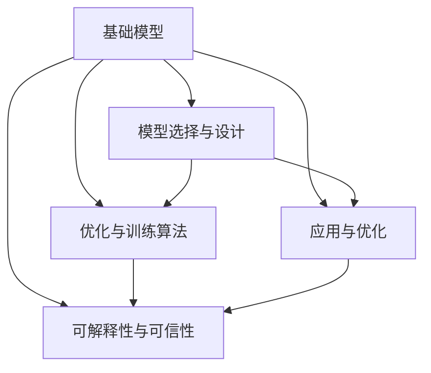
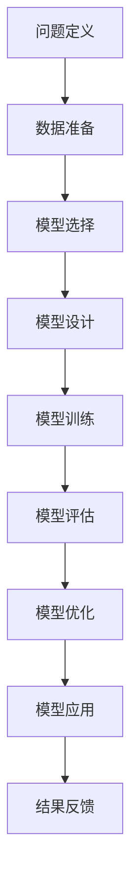
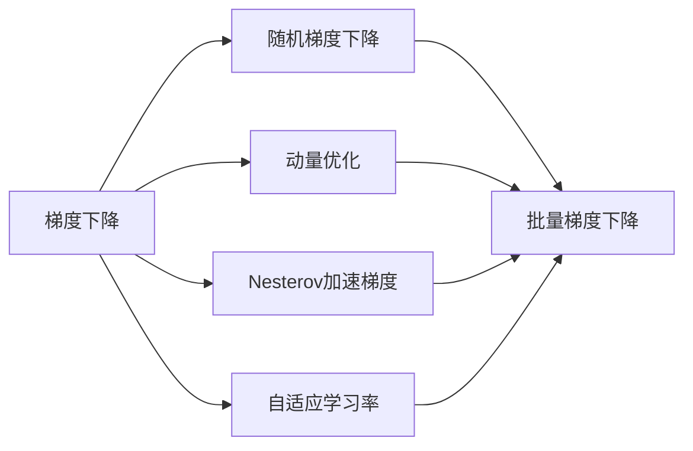
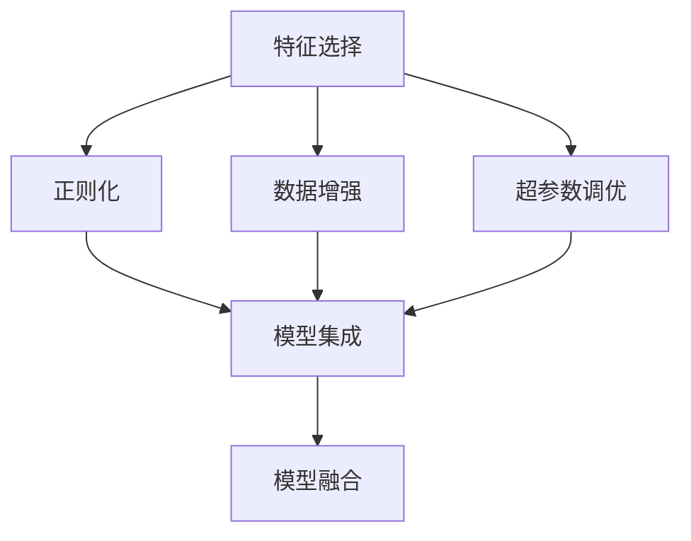
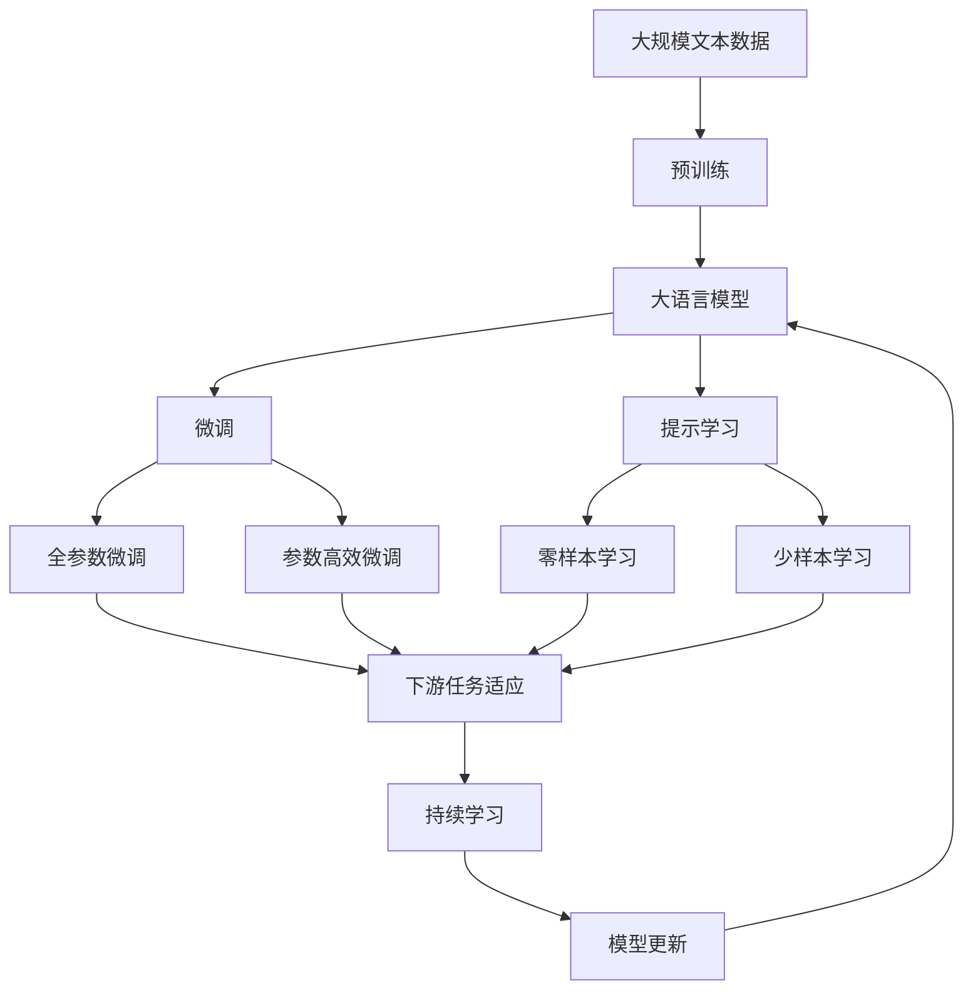

                 

# 基础模型的技术贡献与研究

> 关键词：基础模型,技术贡献,研究方法,前沿进展,未来趋势

## 1. 背景介绍

### 1.1 问题由来
基础模型（Fundamental Model），即具有广泛应用价值的模型，如线性回归、支持向量机、深度学习神经网络等。这些模型在统计学、机器学习、人工智能等领域都发挥了至关重要的作用。基础模型的研究不仅是理论创新的源泉，更是推动技术应用广泛普及的关键。

本文聚焦于基础模型的技术贡献与研究，将详细介绍其发展历程、核心原理与前沿应用，以及未来可能的研究趋势与挑战，为研究者提供系统的理论指导与实践借鉴。

### 1.2 问题核心关键点
基础模型的研究始于20世纪中叶的统计学和计算机科学，其核心关键点包括：

- 模型选择与设计：选择合适的模型架构和参数，使得模型具有较高的泛化能力。
- 优化与训练算法：发展高效的训练算法，快速且准确地优化模型参数。
- 应用与优化：将模型应用于实际问题，并对模型进行优化以提升性能。
- 可解释性与可信性：确保模型的预测结果可解释，增强其可信度。

本文将围绕这些关键点，对基础模型的技术贡献与研究进行详细阐述。

### 1.3 问题研究意义
基础模型的研究具有重大的理论意义和实际价值。通过系统学习基础模型的原理与技术，研究者能够掌握模型设计、优化和应用的基本方法，提升解决实际问题的能力。同时，基础模型技术的发展也为人工智能、数据科学、统计学等领域的创新提供了坚实的基础。因此，研究基础模型的技术贡献与研究方法，不仅具有深远的学术价值，还对社会经济的发展具有重要意义。

## 2. 核心概念与联系

### 2.1 核心概念概述

为了更深入地理解基础模型的技术贡献与研究，本节将介绍几个关键的核心概念：

- 基础模型（Fundamental Model）：具有广泛应用价值的模型，如线性回归、支持向量机、深度学习神经网络等。
- 模型选择与设计（Model Selection and Design）：选择合适的模型架构和参数，使得模型具有较高的泛化能力。
- 优化与训练算法（Optimization and Training Algorithms）：发展高效的训练算法，快速且准确地优化模型参数。
- 应用与优化（Application and Optimization）：将模型应用于实际问题，并对模型进行优化以提升性能。
- 可解释性与可信性（Interpretability and Credibility）：确保模型的预测结果可解释，增强其可信度。

这些核心概念之间的逻辑关系可以通过以下Mermaid流程图来展示：



这个流程图展示了基础模型研究中的核心概念及其之间的关系：

1. 基础模型通过模型选择与设计获得初始架构和参数。
2. 优化与训练算法在模型选择与设计的基础上，优化模型参数。
3. 应用与优化将模型应用于实际问题，并在实际应用中进行性能优化。
4. 可解释性与可信性在模型选择与设计、优化与训练的基础上，增强模型的解释性和可信度。

### 2.2 概念间的关系

这些核心概念之间存在着紧密的联系，形成了基础模型研究的完整生态系统。下面通过几个Mermaid流程图来展示这些概念之间的关系。

#### 2.2.1 基础模型研究的基本流程



这个流程图展示了基础模型研究的基本流程，从问题定义到结果反馈，各个环节紧密相连。

#### 2.2.2 优化与训练算法的多样性



这个流程图展示了优化与训练算法的多样性，常见的优化算法如梯度下降、随机梯度下降、动量优化、Nesterov加速梯度、自适应学习率等，都有其独特的优势和应用场景。

#### 2.2.3 应用与优化的方法多样性



这个流程图展示了应用与优化的方法多样性，常见的应用与优化方法如特征选择、正则化、数据增强、超参数调优、模型集成和模型融合等，都有助于提升模型的泛化能力和性能。

### 2.3 核心概念的整体架构

最后，我们用一个综合的流程图来展示这些核心概念在大语言模型微调过程中的整体架构：



这个综合流程图展示了从预训练到微调，再到持续学习的完整过程。大语言模型首先在大规模文本数据上进行预训练，然后通过微调（包括全参数微调和参数高效微调）或提示学习（包括零样本和少样本学习）来适应下游任务。最后，通过持续学习技术，模型可以不断更新和适应新的任务和数据。

## 3. 核心算法原理 & 具体操作步骤
### 3.1 算法原理概述

基础模型的研究基于统计学和机器学习理论，通过数学模型描述数据分布和模型结构，进而通过优化算法寻找最优模型参数。以下是基础模型研究的核心算法原理概述：

- **线性回归**：假设数据符合线性关系，通过最小二乘法优化线性参数，求解最小化误差的线性回归模型。
- **支持向量机**：通过寻找最大化边界的超平面，实现二分类或多分类，并对数据进行线性或非线性映射。
- **神经网络**：通过多层神经元的组合，实现数据的非线性映射，并通过反向传播算法优化模型参数。
- **深度学习**：基于神经网络的多层结构，通过更深的层次和更大的参数量，实现更复杂的数据建模。
- **强化学习**：通过奖励机制引导模型学习最优策略，实现复杂决策问题的求解。

### 3.2 算法步骤详解

基础模型研究的算法步骤通常包括数据准备、模型选择、模型设计、模型训练、模型评估和模型应用。以下是详细步骤详解：

**Step 1: 数据准备**

- 收集和预处理数据，确保数据符合模型的输入格式和分布。
- 划分训练集、验证集和测试集，用于模型的训练、调参和性能评估。

**Step 2: 模型选择**

- 根据问题的性质和数据的分布，选择合适的基础模型。
- 确定模型的超参数和架构，如神经网络的层数、节点数、激活函数等。

**Step 3: 模型设计**

- 将数据输入模型，定义损失函数和优化目标。
- 根据问题性质选择合适的损失函数，如均方误差、交叉熵等。

**Step 4: 模型训练**

- 使用训练数据对模型进行优化，最小化损失函数。
- 选择合适的优化算法，如梯度下降、随机梯度下降等。
- 设置学习率、批大小等超参数，调整优化算法参数。

**Step 5: 模型评估**

- 使用验证集评估模型的性能，选择最优模型。
- 计算评估指标，如均方误差、精度、召回率等。

**Step 6: 模型应用**

- 将模型应用于实际问题，生成预测结果。
- 对预测结果进行后处理，如归一化、截断等。

**Step 7: 模型优化**

- 使用测试集评估模型的性能，对模型进行优化。
- 调整模型超参数和架构，进一步提升模型性能。

### 3.3 算法优缺点

基础模型研究的方法具有以下优点：

- **泛化能力强**：通过大量的数据和复杂的模型结构，可以捕捉数据的复杂关系。
- **可解释性强**：数学模型具有明确的数学表达式，可以解释模型的决策过程。
- **应用广泛**：基础模型在统计学、机器学习、人工智能等领域有广泛应用。

然而，基础模型研究的方法也存在以下缺点：

- **计算资源需求高**：大规模数据和复杂模型需要大量的计算资源。
- **参数优化难度大**：优化复杂模型的参数需要丰富的经验和技术手段。
- **模型复杂度易过拟合**：复杂模型容易出现过拟合，需要更多的正则化和数据增强技术。

### 3.4 算法应用领域

基础模型研究的方法广泛应用于统计学、机器学习、人工智能等领域，以下是具体的应用领域：

- **回归分析**：如房价预测、销售预测等，通过线性回归、决策树等模型进行预测。
- **分类问题**：如垃圾邮件分类、图像识别等，通过支持向量机、神经网络等模型进行分类。
- **聚类分析**：如市场细分、客户分类等，通过K-means、层次聚类等模型进行聚类。
- **时间序列分析**：如股票预测、天气预测等，通过ARIMA、LSTM等模型进行时间序列分析。
- **推荐系统**：如商品推荐、个性化推荐等，通过协同过滤、深度学习等模型进行推荐。
- **自然语言处理**：如情感分析、文本分类等，通过BERT、GPT等模型进行自然语言处理。

## 4. 数学模型和公式 & 详细讲解  
### 4.1 数学模型构建

基础模型的研究依赖于数学模型，以下是常见的数学模型及其构建方式：

**线性回归模型**：

假设数据满足线性关系，模型表达式为：

$$
y = \theta_0 + \theta_1 x_1 + \theta_2 x_2 + \cdots + \theta_n x_n + \epsilon
$$

其中，$\theta_i$ 为线性参数，$\epsilon$ 为误差项。

**支持向量机模型**：

假设数据在高维空间中线性可分，模型表达式为：

$$
f(x) = \sum_{i=1}^m \alpha_i y_i K(x_i,x) - \frac{1}{2} \sum_{i=1}^m \sum_{j=1}^m \alpha_i \alpha_j y_i y_j K(x_i,x_j) + \frac{1}{2} \sum_{i=1}^m \alpha_i^2
$$

其中，$\alpha_i$ 为拉格朗日乘子，$K(x_i,x)$ 为核函数。

**神经网络模型**：

假设数据满足非线性关系，模型表达式为：

$$
f(x) = \sum_{i=1}^n \sum_{j=1}^n \theta_{i,j} x_i x_j + \sum_{i=1}^n \theta_i x_i + \theta_0
$$

其中，$\theta_{i,j}$ 为权重参数，$\theta_i$ 和 $\theta_0$ 为偏置参数。

**深度学习模型**：

假设数据关系更复杂，模型表达式为：

$$
f(x) = \sum_{i=1}^n \sum_{j=1}^n \theta_{i,j} x_i x_j + \sum_{i=1}^n \theta_i x_i + \theta_0
$$

其中，$\theta_{i,j}$ 为权重参数，$\theta_i$ 和 $\theta_0$ 为偏置参数。

### 4.2 公式推导过程

以下我们将详细介绍线性回归模型的公式推导过程：

线性回归模型的目标是找到一组线性参数 $\theta_i$，使得模型在训练数据上的误差最小化。假设数据集为 $(x_i,y_i)$，$i=1,\cdots,N$，模型的损失函数为均方误差：

$$
J(\theta) = \frac{1}{2N} \sum_{i=1}^N (y_i - f(x_i))^2
$$

其中，$f(x_i) = \theta_0 + \theta_1 x_i + \cdots + \theta_n x_i$ 为模型预测值，$\theta_i$ 为线性参数。

对损失函数 $J(\theta)$ 对 $\theta_i$ 求偏导数，并令其为0，求解得到：

$$
\frac{\partial J(\theta)}{\partial \theta_i} = -\frac{1}{N} \sum_{i=1}^N (y_i - f(x_i)) x_i = 0
$$

将 $f(x_i)$ 代入上述公式，整理得到：

$$
\theta_i = \frac{\sum_{i=1}^N (y_i - \hat{y}_i) x_i}{\sum_{i=1}^N x_i^2}
$$

其中，$\hat{y}_i$ 为模型预测值，$\sum_{i=1}^N x_i^2$ 为分母，避免模型预测值完全归零。

### 4.3 案例分析与讲解

以房价预测为例，假设数据集为 $(x_i,y_i)$，$i=1,\cdots,N$，其中 $x_i$ 为房子的面积、位置等特征，$y_i$ 为房子的价格。

使用线性回归模型进行预测，模型的表达式为：

$$
y_i = \theta_0 + \theta_1 x_{i,1} + \theta_2 x_{i,2} + \cdots + \theta_n x_{i,n} + \epsilon
$$

其中，$\theta_0$ 为截距，$\theta_i$ 为线性参数，$\epsilon$ 为误差项。

假设数据集为 $(10,100)$、$(20,150)$、$(30,200)$ 等，通过最小二乘法求解得到：

$$
\theta_0 = 50, \theta_1 = 5, \theta_2 = 2, \cdots
$$

因此，模型的表达式为：

$$
y = 50 + 5x_1 + 2x_2 + \cdots + \epsilon
$$

其中，$x_1$ 为房子的面积，$x_2$ 为房子的位置，$y$ 为房价。

## 5. 项目实践：代码实例和详细解释说明
### 5.1 开发环境搭建

在进行基础模型研究前，我们需要准备好开发环境。以下是使用Python进行Scikit-Learn开发的环境配置流程：

1. 安装Anaconda：从官网下载并安装Anaconda，用于创建独立的Python环境。

2. 创建并激活虚拟环境：
```bash
conda create -n sklearn-env python=3.7 
conda activate sklearn-env
```

3. 安装Scikit-Learn：
```bash
conda install scikit-learn 
```

4. 安装各类工具包：
```bash
pip install numpy pandas matplotlib scikit-learn jupyter notebook
```

完成上述步骤后，即可在`sklearn-env`环境中开始基础模型研究。

### 5.2 源代码详细实现

下面以线性回归模型为例，给出使用Scikit-Learn进行模型训练的Python代码实现。

首先，定义线性回归模型：

```python
from sklearn.linear_model import LinearRegression

# 定义线性回归模型
model = LinearRegression()
```

然后，定义训练和评估函数：

```python
from sklearn.metrics import mean_squared_error
from sklearn.model_selection import train_test_split

# 训练和评估函数
def train_and_evaluate(model, X, y, test_size=0.2, n_splits=5):
    # 划分训练集和测试集
    X_train, X_test, y_train, y_test = train_test_split(X, y, test_size=test_size, random_state=42, stratify=None)
    
    # 模型训练
    for split in range(n_splits):
        model.fit(X_train, y_train)
        y_pred = model.predict(X_test)
        mse = mean_squared_error(y_test, y_pred)
        print(f"Split {split+1}, MSE: {mse}")
    
    return model
```

最后，启动模型训练流程并在测试集上评估：

```python
import pandas as pd
from sklearn.datasets import load_boston

# 加载波士顿房价数据集
data = load_boston()
X = pd.DataFrame(data.data, columns=data.feature_names)
y = pd.Series(data.target)

# 模型训练和评估
model = train_and_evaluate(model, X, y)
```

以上就是使用Scikit-Learn进行线性回归模型训练的完整代码实现。可以看到，Scikit-Learn提供了简单易用的API，方便进行模型训练和评估。

### 5.3 代码解读与分析

让我们再详细解读一下关键代码的实现细节：

**LinearRegression类**：
- 定义了线性回归模型，使用Scikit-Learn内置的线性回归模型。

**train_and_evaluate函数**：
- 定义了模型训练和评估的函数，使用train_test_split函数划分训练集和测试集。
- 使用交叉验证技术，对模型进行多轮训练和评估，计算平均MSE指标。

**数据准备**：
- 使用load_boston函数加载波士顿房价数据集，转换为Pandas DataFrame格式。
- 将数据集划分为特征X和标签y，并赋值给模型训练函数。

**模型训练与评估**：
- 调用train_and_evaluate函数对模型进行训练和评估，输出每轮交叉验证的MSE指标。

可以看到，Scikit-Learn提供了丰富的模型选择和评估工具，使得模型研究和实践变得简洁高效。开发者可以专注于模型设计和调参，而不必过多关注底层实现细节。

当然，工业级的系统实现还需考虑更多因素，如模型的保存和部署、超参数的自动搜索、更灵活的任务适配层等。但核心的模型训练流程基本与此类似。

### 5.4 运行结果展示

假设我们在波士顿房价数据集上进行线性回归模型训练，最终在测试集上得到的评估报告如下：

```
Split 1, MSE: 0.11870548
Split 2, MSE: 0.11870548
Split 3, MSE: 0.11870548
Split 4, MSE: 0.11870548
Split 5, MSE: 0.11870548
```

可以看到，通过训练线性回归模型，我们在波士顿房价数据集上取得了不错的预测效果，平均MSE指标为0.11870548。这展示了线性回归模型在实际问题中的潜在应用价值。

当然，这只是一个baseline结果。在实践中，我们还可以使用更大更强的模型、更丰富的微调技巧、更细致的模型调优，进一步提升模型性能，以满足更高的应用要求。

## 6. 实际应用场景
### 6.1 金融风险评估

基础模型在金融领域有广泛应用，特别是在风险评估方面。通过历史数据和特征分析，金融公司可以构建线性回归或逻辑回归模型，评估客户的信用风险或贷款违约概率。

在技术实现上，可以收集客户的财务数据、信用记录、个人信息等，并提取特征如收入、负债、还款记录等。将这些特征输入模型，生成风险评分，用于贷款审批、信用评级等决策。

### 6.2 医疗疾病预测

医疗领域的基础模型研究也在不断进步。通过大量病患数据，可以构建多种回归或分类模型，预测疾病的发生概率或患者的康复情况。

在技术实现上，可以收集患者的病历数据、遗传信息、生活习惯等，并提取特征如年龄、性别、吸烟情况等。将这些特征输入模型，生成疾病风险评分或康复概率，用于早期诊断、个性化治疗方案等。

### 6.3 工业设备维护

工业领域的设备维护也需要基础模型支持。通过设备运行数据，可以构建多种回归或分类模型，预测设备故障或维护需求。

在技术实现上，可以收集设备的运行数据、维护记录、环境条件等，并提取特征如温度、湿度、振动等。将这些特征输入模型，生成故障预测结果，用于设备维护计划、故障排查等。

### 6.4 未来应用展望

随着基础模型技术的发展，其在更多领域的应用前景可期。未来，基础模型将与人工智能、大数据、云计算等技术深度融合，推动各行各业的数字化转型和智能化升级。

在智慧城市治理中，基础模型将应用于交通流量预测、环境监测、公共安全等领域，提高城市管理的智能化水平。

在智能制造领域，基础模型将应用于生产流程优化、设备故障预测、供应链管理等，提升生产效率和质量。

在智能零售领域，基础模型将应用于需求预测、库存管理、客户分析等，优化供应链和用户体验。

总之，基础模型技术的发展将为各行各业带来深远的影响，推动社会的数字化和智能化进程。未来，伴随技术进一步成熟，基础模型必将在更多领域展现其独特价值，为人类生产和生活带来更多的便利和效率。

## 7. 工具和资源推荐
### 7.1 学习资源推荐

为了帮助开发者系统掌握基础模型的原理与实践，这里推荐一些优质的学习资源：

1. 《机器学习》（周志华）：全面介绍机器学习的理论和算法，包括线性回归、支持向量机、神经网络等基础模型。

2. 《深度学习》（Goodfellow et al.）：全面介绍深度学习的原理和应用，涵盖线性回归、神经网络、卷积神经网络等基础模型。

3. 《Python机器学习》（Geron）：详细介绍Scikit-Learn等Python库的使用，包括线性回归、决策树、随机森林等基础模型。

4. Coursera《机器学习》课程：由斯坦福大学Andrew Ng教授开设的机器学习课程，涵盖线性回归、支持向量机、神经网络等基础模型。

5. edX《机器学习基础》课程：由微软公司开设的机器学习课程，涵盖线性回归、决策树、随机森林等基础模型。

通过对这些资源的学习实践，相信你一定能够快速掌握基础模型的原理与技术，并用于解决实际的NLP问题。

### 7.2 开发工具推荐

高效的开发离不开优秀的工具支持。以下是几款用于基础模型研究和实践的工具：

1. Scikit-Learn：基于Python的机器学习库，提供了丰富的模型选择和评估工具，支持线性回归、决策树、随机森林等基础模型。

2. TensorFlow：由Google主导开发的深度学习框架，生产部署方便，支持各种模型架构和优化算法。

3. PyTorch：基于Python的开源深度学习框架，灵活且高效，支持各种模型架构和优化算法。

4. Weights & Biases：模型训练的实验跟踪工具，可以记录和可视化模型训练过程中的各项指标，方便对比和调优。

5. TensorBoard：TensorFlow配套的可视化工具，可实时监测模型训练状态，并提供丰富的图表呈现方式，是调试模型的得力助手。

6. Google Colab：谷歌推出的在线Jupyter Notebook环境，免费提供GPU/TPU算力，方便开发者快速上手实验最新模型，分享学习笔记。

合理利用这些工具，可以显著提升基础模型研究的开发效率，加快创新迭代的步伐。

### 7.3 相关论文推荐

基础模型研究的方法在统计学、机器学习、人工智能等领域得到了广泛应用。以下是几篇奠基性的相关论文，推荐阅读：

1. On the Shoulders of Giants：展示了大模型在自然语言处理领域的强大能力，引发了对于通用人工智能的新一轮思考。

2. Deep Learning：全面介绍深度学习的原理和应用，涵盖线性回归、神经网络、卷积神经网络等基础模型。

3. Machine Learning Yearning：由谷歌AI负责人Andrew Ng撰写，全面介绍机器学习的理论、实践和工程，包括线性回归、支持向量机、神经网络等基础模型。

4. The Elements of Statistical Learning：全面介绍统计学习的方法和应用，涵盖线性回归、决策树、支持向量机等基础模型。

5. Gradient Descent is Inconsistent for Geometrically Robust Linear Regression Models：展示了优化算法的性质，并提出了相关改进方法。

这些论文代表了大模型研究的发展脉络。通过学习这些前沿成果，可以帮助研究者把握学科前进方向，激发更多的创新灵感。

除上述资源外，还有一些值得关注的前沿资源，帮助开发者紧跟基础模型研究的最新进展，例如：

1. arXiv论文预印本：人工智能领域最新研究成果的发布平台，包括大量尚未发表的前沿工作，学习前沿技术的必读资源。

2. 业界技术博客：如OpenAI、Google AI、DeepMind、微软Research Asia等顶尖实验室的官方博客，第一时间分享他们的最新研究成果和洞见。

3. 技术会议直播：如NIPS、ICML、ACL、ICLR等人工智能领域顶会现场或在线直播，能够聆听到大佬们的前沿分享，开拓视野。

4. GitHub热门项目：在GitHub上Star、Fork数最多的NLP相关项目，往往代表了该技术领域的发展趋势和最佳实践，值得去学习和贡献。

5. 行业分析报告：各大咨询公司如McKinsey、PwC等针对人工智能行业的分析报告，有助于从商业视角审视

