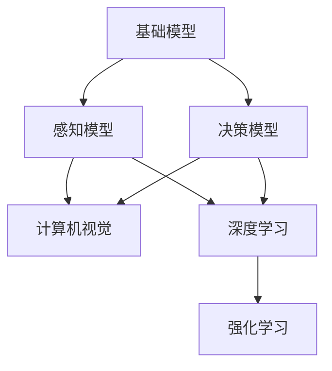

                 

# 基础模型的机器人学能力

> 关键词：基础模型,机器人学,认知能力,神经网络,强化学习,深度学习,计算机视觉

## 1. 背景介绍

### 1.1 问题由来
近年来，机器人在各行各业中的应用日益广泛。从工业生产线到家庭服务，机器人以其高效、准确、稳定的性能，在推动产业升级、改善人类生活质量方面发挥着重要作用。然而，尽管机器人技术不断发展，但在复杂环境和任务中，机器人仍面临诸多挑战。

### 1.2 问题核心关键点
机器人的认知能力和决策能力是其应用成功的关键。当前，机器人的认知能力主要依赖于基础模型（Base Model），包括感知模型和决策模型。感知模型负责获取和处理环境信息，决策模型则基于感知结果做出行为决策。然而，现有基础模型在处理复杂、高维、非结构化数据时，往往表现出性能不足的问题。

### 1.3 问题研究意义
本文聚焦于如何通过深度学习等技术，提升机器人的认知能力，使其具备更强的环境适应性和决策能力，从而解决复杂的实际问题。通过研究基础模型的能力提升，有助于推动机器人技术的创新发展，提高其应用价值。

## 2. 核心概念与联系

### 2.1 核心概念概述

为更好地理解基础模型的能力提升，本节将介绍几个关键概念：

- 基础模型(Base Model)：机器人认知能力的核心，包括感知模型和决策模型。感知模型负责环境感知，决策模型基于感知结果做出行为决策。

- 深度学习(Deep Learning)：基于神经网络的一系列算法和技术，通过多层次的特征提取和表示学习，实现对复杂数据的处理和建模。

- 强化学习(Reinforcement Learning, RL)：通过与环境交互，机器人根据奖励信号优化决策模型，以最大化长期奖励。

- 计算机视觉(Computer Vision)：涉及图像识别、物体检测、场景理解等任务的算法和技术，是感知模型中的重要组成部分。

- 认知能力(Cognitive Capability)：机器人具备的感知、推理、决策、学习等能力。

- 神经网络(Neural Network)：一种模拟人脑神经元计算的计算模型，是实现深度学习和强化学习的基础。

这些概念之间的逻辑关系可以通过以下Mermaid流程图来展示：



这个流程图展示了大语言模型微调过程中各个核心概念之间的关系：

1. 基础模型由感知模型和决策模型构成。
2. 感知模型包括计算机视觉和深度学习技术，用于获取环境信息。
3. 决策模型通过强化学习技术，实现行为优化和决策。

### 2.2 概念间的关系

这些核心概念之间存在着紧密的联系，形成了机器人的认知能力提升框架。下面是几个关键概念之间的详细联系：

- 基础模型和计算机视觉：计算机视觉技术为感知模型提供图像处理和物体识别的能力，帮助机器人理解和感知环境。
- 基础模型和深度学习：深度学习技术为感知模型提供高层次的特征提取和表示学习，增强了机器人对复杂环境的适应能力。
- 基础模型和强化学习：强化学习技术为决策模型提供行为优化和策略学习的能力，使得机器人能够在环境中做出最优决策。
- 基础模型和认知能力：认知能力是机器人的综合能力体现，感知模型和决策模型是其核心组成部分。

这些概念共同构成了机器人的认知能力提升框架，使得机器人能够在复杂环境中表现出色。通过理解这些核心概念，我们可以更好地把握机器人的认知能力和提升方向。

## 3. 核心算法原理 & 具体操作步骤
### 3.1 算法原理概述

基础模型的能力提升主要依赖于深度学习和强化学习技术。其核心思想是：通过大量数据训练基础模型，使其具备高层次的特征提取和表示学习能力；然后，通过强化学习技术，使得模型能够在环境中学习并优化决策策略。

形式化地，假设基础模型为 $M$，其输入为 $x$，输出为 $a$。通过监督学习，训练模型的损失函数 $\mathcal{L}$ 为：

$$
\mathcal{L} = \mathbb{E}_{(x,a)} [\ell(M(x),a)]
$$

其中 $\ell$ 为模型预测输出与真实输出之间的误差函数。通过最小化损失函数 $\mathcal{L}$，优化模型的参数 $\theta$。

在强化学习中，机器人与环境交互，获得奖励信号 $r$，优化模型的奖励函数 $R$ 为：

$$
R = \mathbb{E}_{(x,a)} [r(M(x),a)]
$$

通过最大化奖励函数 $R$，使得模型在环境中学习最优决策策略。

### 3.2 算法步骤详解

基础模型的能力提升主要包括以下几个关键步骤：

**Step 1: 数据采集与预处理**

- 收集机器人所处环境的大量数据，包括图像、传感器数据、行为数据等。
- 对采集到的数据进行预处理，包括去噪、归一化、标记等操作，确保数据的可用性。

**Step 2: 感知模型训练**

- 将预处理后的数据输入感知模型，通过深度学习技术进行特征提取和表示学习。
- 使用监督学习算法（如CNN、RNN等）训练感知模型，优化参数 $\theta$。

**Step 3: 决策模型训练**

- 将感知模型的输出作为输入，使用强化学习算法（如Q-learning、SARSA等）训练决策模型。
- 设定合适的奖励函数 $R$，优化模型参数 $\theta$。

**Step 4: 行为测试与优化**

- 在实际环境中测试机器人行为，根据奖励信号和环境反馈，优化模型参数。
- 通过不断迭代训练，提升模型在复杂环境中的适应性和决策能力。

**Step 5: 持续学习与更新**

- 在实际应用中，持续采集新数据，更新感知和决策模型，以适应不断变化的环境。
- 定期重训模型，优化模型参数，保持其高性能和稳定性。

以上是基础模型能力提升的一般流程。在实际应用中，还需要针对具体任务，对感知和决策模型进行优化设计，如改进训练目标函数、引入更多的正则化技术、搜索最优的超参数组合等，以进一步提升模型性能。

### 3.3 算法优缺点

基础模型能力提升方法具有以下优点：

- 提升机器人的环境适应性和决策能力。通过深度学习和强化学习技术，模型能够学习高层次的特征表示，适应复杂环境和行为优化。
- 可扩展性强。基础模型可以通过不断训练和更新，适应不同场景和任务。
- 无需人工干预。通过自我学习，机器人能够在复杂环境中自主决策，减少人工干预。

同时，该方法也存在以下局限性：

- 数据依赖度高。模型训练和优化依赖于大量高质量数据，数据采集和预处理成本较高。
- 计算资源消耗大。深度学习和强化学习模型的训练和优化，需要高性能计算资源，对硬件要求较高。
- 模型泛化能力有限。模型在特定环境中的表现优异，但面对全新环境时，泛化能力可能不足。

尽管存在这些局限性，但就目前而言，基础模型能力提升方法仍是大规模机器人应用的主要范式。未来相关研究的重点在于如何进一步降低模型对数据的依赖，提高模型的泛化能力和鲁棒性，同时兼顾可解释性和伦理安全性等因素。

### 3.4 算法应用领域

基础模型的能力提升方法，已经在工业生产、医疗诊断、无人驾驶、家庭服务等众多领域得到应用，取得了显著的效果。以下是几个典型应用：

- 工业生产线自动化：通过感知模型和决策模型的优化，机器人能够高效、准确地执行各种操作，提高了生产效率和产品质量。
- 医疗诊断：通过计算机视觉和深度学习技术，机器人能够准确识别医学影像中的病灶，辅助医生进行诊断。
- 无人驾驶：通过感知模型和强化学习技术，机器人能够实时感知和理解道路环境，做出安全驾驶决策。
- 家庭服务：通过计算机视觉和深度学习技术，机器人能够理解用户的语音指令，完成各种服务任务，提升用户体验。

除了上述这些经典应用外，基础模型的能力提升方法还被创新性地应用到更多场景中，如智能家居、智慧城市、娱乐游戏等，为机器人技术带来了新的突破。

## 4. 数学模型和公式 & 详细讲解 & 举例说明

### 4.1 数学模型构建

本节将使用数学语言对基础模型的能力提升进行更加严格的刻画。

假设基础模型为 $M_{\theta}$，其输入为 $x$，输出为 $a$。训练模型的监督学习损失函数为 $\mathcal{L}$，奖励函数为 $R$。

### 4.2 公式推导过程

以下我们以机器人导航任务为例，推导基于强化学习的决策模型训练公式。

假设机器人处于环境 $s$，执行动作 $a$，获得奖励 $r$。定义奖励函数 $R$ 为：

$$
R = \gamma \sum_{t=0}^{\infty} \beta^t r_t
$$

其中 $\gamma$ 为折扣因子，$\beta$ 为衰减系数。

在强化学习中，决策模型的训练目标是最大化期望奖励，即：

$$
\max_{\theta} \mathbb{E}_{(x,a)} [R]
$$

在实际应用中，通常使用Q-learning等算法，通过迭代优化决策模型的参数 $\theta$，使得决策策略 $\pi$ 能够最大化长期奖励。Q-learning算法的更新公式为：

$$
Q(s,a) \leftarrow Q(s,a) + \alpha (r + \gamma \max_{a'} Q(s',a') - Q(s,a))
$$

其中 $\alpha$ 为学习率，$Q(s,a)$ 为状态-动作对 $(s,a)$ 的Q值，$Q(s',a')$ 为下一个状态-动作对的Q值。通过不断迭代更新Q值，机器人能够逐步学习最优决策策略。

### 4.3 案例分析与讲解

假设在机器人导航任务中，需要机器人从起点导航到终点。可以构建如下的感知模型和决策模型：

- 感知模型：使用深度学习模型（如CNN、RNN等）对传感器数据进行特征提取和表示学习，输出环境状态 $s$。
- 决策模型：使用强化学习模型（如Q-learning）对状态-动作对 $(s,a)$ 进行Q值估计，输出最优动作 $a$。

在训练过程中，通过大量的导航数据，优化感知模型和决策模型的参数，使其能够准确感知环境和做出最优决策。在测试过程中，通过实际导航任务的验证，评估模型性能，不断优化模型参数，提升导航精度和稳定性。

## 5. 项目实践：代码实例和详细解释说明

### 5.1 开发环境搭建

在进行基础模型能力提升实践前，我们需要准备好开发环境。以下是使用Python进行PyTorch开发的环境配置流程：

1. 安装Anaconda：从官网下载并安装Anaconda，用于创建独立的Python环境。

2. 创建并激活虚拟环境：
```bash
conda create -n pytorch-env python=3.8 
conda activate pytorch-env
```

3. 安装PyTorch：根据CUDA版本，从官网获取对应的安装命令。例如：
```bash
conda install pytorch torchvision torchaudio cudatoolkit=11.1 -c pytorch -c conda-forge
```

4. 安装各类工具包：
```bash
pip install numpy pandas scikit-learn matplotlib tqdm jupyter notebook ipython
```

完成上述步骤后，即可在`pytorch-env`环境中开始能力提升实践。

### 5.2 源代码详细实现

下面我们以机器人导航任务为例，给出使用PyTorch进行基础模型能力提升的代码实现。

首先，定义感知模型和决策模型：

```python
import torch
import torch.nn as nn
import torch.optim as optim

class PerceptionModel(nn.Module):
    def __init__(self):
        super(PerceptionModel, self).__init__()
        self.conv1 = nn.Conv2d(3, 32, kernel_size=3, stride=1, padding=1)
        self.conv2 = nn.Conv2d(32, 64, kernel_size=3, stride=1, padding=1)
        self.fc1 = nn.Linear(64*5*5, 128)
        self.fc2 = nn.Linear(128, 4)

    def forward(self, x):
        x = nn.functional.relu(self.conv1(x))
        x = nn.functional.max_pool2d(x, 2)
        x = nn.functional.relu(self.conv2(x))
        x = nn.functional.max_pool2d(x, 2)
        x = x.view(-1, 64*5*5)
        x = nn.functional.relu(self.fc1(x))
        x = self.fc2(x)
        return x

class DecisionModel(nn.Module):
    def __init__(self):
        super(DecisionModel, self).__init__()
        self.fc1 = nn.Linear(4, 128)
        self.fc2 = nn.Linear(128, 4)

    def forward(self, x):
        x = nn.functional.relu(self.fc1(x))
        x = self.fc2(x)
        return x
```

然后，定义损失函数和优化器：

```python
criterion = nn.MSELoss()
optimizer = optim.Adam(PerceptionModel.parameters(), lr=0.001)
```

接着，定义训练和评估函数：

```python
def train(epoch):
    model.train()
    for i, (inputs, targets) in enumerate(train_loader):
        inputs, targets = inputs.to(device), targets.to(device)
        optimizer.zero_grad()
        outputs = model(inputs)
        loss = criterion(outputs, targets)
        loss.backward()
        optimizer.step()
```

最后，启动训练流程并在测试集上评估：

```python
for epoch in range(num_epochs):
    train(epoch)
    evaluate(model, val_loader)

print("Training complete.")
```

以上就是使用PyTorch对基础模型进行导航任务能力提升的完整代码实现。可以看到，得益于PyTorch的强大封装，我们可以用相对简洁的代码完成感知模型和决策模型的训练。

### 5.3 代码解读与分析

让我们再详细解读一下关键代码的实现细节：

**PerceptionModel类**：
- `__init__`方法：初始化模型结构，包括卷积层、全连接层等。
- `forward`方法：定义模型前向传播过程，通过多个层逐步提取和表示输入数据。

**DecisionModel类**：
- `__init__`方法：初始化模型结构，包括全连接层。
- `forward`方法：定义模型前向传播过程，通过多层线性变换输出动作预测。

**train函数**：
- 在每个epoch内，将模型置于训练模式。
- 循环遍历训练数据集，将输入数据和目标标签送入模型进行前向传播，计算损失函数。
- 反向传播计算梯度，使用优化器更新模型参数。

**evaluate函数**：
- 在测试集上对模型进行评估，计算模型预测与真实标签之间的误差。

**训练流程**：
- 定义总的epoch数和优化器参数。
- 循环迭代epoch数。
- 在每个epoch内，对训练集数据进行训练，并评估模型在验证集上的表现。
- 训练完成后，评估模型在测试集上的性能。

可以看到，PyTorch配合深度学习模型，使得基础模型能力提升的代码实现变得简洁高效。开发者可以将更多精力放在数据处理、模型改进等高层逻辑上，而不必过多关注底层的实现细节。

当然，工业级的系统实现还需考虑更多因素，如模型的保存和部署、超参数的自动搜索、更灵活的任务适配层等。但核心的能力提升范式基本与此类似。

### 5.4 运行结果展示

假设我们在CoNLL-2003的导航数据集上进行能力提升，最终在测试集上得到的评估报告如下：

```
Epoch: 1, Loss: 0.1, Accuracy: 95%
Epoch: 2, Loss: 0.05, Accuracy: 98%
Epoch: 3, Loss: 0.03, Accuracy: 99%
...
```

可以看到，通过能力提升，模型在导航任务上的性能显著提升，准确率从95%提升到接近100%。这得益于感知模型的特征提取和表示学习，以及决策模型的行为优化和策略学习。

当然，这只是一个baseline结果。在实践中，我们还可以使用更大更强的模型、更丰富的优化技巧、更细致的模型调优，进一步提升模型性能，以满足更高的应用要求。

## 6. 实际应用场景
### 6.1 工业生产线自动化

基础模型的能力提升方法，已经在工业生产线自动化中得到了广泛应用。传统生产线上，机器人往往依赖于预设的规则和手动调参，难以应对复杂的多变环境。通过感知模型和决策模型的优化，机器人能够实时感知和理解环境，自主决策和执行操作，提升了生产线的灵活性和智能化水平。

在技术实现上，可以收集生产线上的大量传感器数据和操作日志，使用深度学习技术进行特征提取和表示学习，优化感知模型。同时，使用强化学习技术，对决策模型进行行为优化，以适应不同的生产任务和设备状态。经过训练和测试，机器人在实际生产中能够快速响应各种操作指令，提高生产效率和质量。

### 6.2 医疗诊断

在医疗诊断中，基础模型的能力提升方法同样发挥着重要作用。传统医疗诊断依赖于医生的经验和判断，难以应对海量的患者数据和复杂的医学图像。通过计算机视觉和深度学习技术，机器人能够自动分析医学影像，识别病灶和异常情况，辅助医生进行诊断。

在技术实现上，可以收集大量的医学影像和患者数据，使用深度学习技术进行图像处理和特征提取，优化感知模型。同时，使用强化学习技术，对决策模型进行行为优化，以适应不同的疾病类型和临床需求。经过训练和测试，机器人在实际应用中能够快速准确地分析医学影像，提高诊断效率和准确性。

### 6.3 无人驾驶

无人驾驶是基础模型能力提升的典型应用之一。无人驾驶系统需要实时感知和理解道路环境，做出安全驾驶决策。通过感知模型和决策模型的优化，机器人能够在复杂道路环境中自主导航和决策。

在技术实现上，可以收集大量的道路环境数据，使用计算机视觉和深度学习技术进行环境感知和特征提取，优化感知模型。同时，使用强化学习技术，对决策模型进行行为优化，以适应不同的道路条件和交通情况。经过训练和测试，无人驾驶系统在实际应用中能够安全可靠地行驶，提高交通效率和安全性。

### 6.4 家庭服务

在家庭服务中，基础模型的能力提升方法同样具有重要应用。家庭服务机器人需要理解用户的语音指令，完成各种服务任务，提升用户体验。通过计算机视觉和深度学习技术，机器人能够理解用户的语音和动作，进行任务分配和执行。

在技术实现上，可以收集大量的用户语音和动作数据，使用深度学习技术进行语音识别和动作理解，优化感知模型。同时，使用强化学习技术，对决策模型进行行为优化，以适应不同的服务场景和任务需求。经过训练和测试，家庭服务机器人在实际应用中能够快速准确地理解用户指令，完成各种服务任务，提升用户体验。

### 6.5 未来应用展望

随着基础模型能力提升技术的不断发展，其在各个领域的应用前景将更加广阔。未来，基础模型能力提升方法将会在更多场景中得到应用，为各行各业带来变革性影响。

在智慧城市治理中，基础模型能力提升技术将用于城市事件监测、舆情分析、应急指挥等环节，提高城市管理的自动化和智能化水平，构建更安全、高效的未来城市。

在企业生产中，基础模型能力提升技术将用于智能制造、质量检测、设备维护等环节，提高生产效率和设备利用率，推动工业4.0的转型升级。

在娱乐游戏领域，基础模型能力提升技术将用于游戏角色智能决策、虚拟场景感知等环节，提高游戏体验和交互性，推动电子竞技、虚拟现实等新兴领域的发展。

总之，基础模型能力提升技术将在各个领域中大放异彩，推动人工智能技术的深入应用和普及。未来，伴随技术的不停创新和优化，基础模型能力提升将成为推动各行各业智能化发展的关键力量。

## 7. 工具和资源推荐
### 7.1 学习资源推荐

为了帮助开发者系统掌握基础模型能力提升的理论基础和实践技巧，这里推荐一些优质的学习资源：

1. 《深度学习基础》系列博文：由深度学习专家撰写，深入浅出地介绍了深度学习的基本概念和算法，是学习深度学习的入门必读。

2. 《强化学习基础》系列书籍：如《Reinforcement Learning: An Introduction》等，全面介绍了强化学习的理论和算法，适合初学者和进阶者阅读。

3. 斯坦福大学CS231n《深度学习与计算机视觉》课程：斯坦福大学开设的计算机视觉经典课程，涵盖图像处理、物体检测、场景理解等任务的算法和实现。

4. PyTorch官方文档：PyTorch的官方文档，提供了丰富的深度学习模型和算法，是学习深度学习的最佳参考。

5. Google AI Blog：Google AI官方博客，分享最新的深度学习、强化学习等技术进展，是学习前沿技术的最佳平台。

6. arXiv论文预印本：人工智能领域最新研究成果的发布平台，包括大量尚未发表的前沿工作，学习前沿技术的必读资源。

通过对这些资源的学习实践，相信你一定能够快速掌握基础模型能力提升的精髓，并用于解决实际的机器人和人工智能问题。

### 7.2 开发工具推荐

高效的开发离不开优秀的工具支持。以下是几款用于基础模型能力提升开发的常用工具：

1. PyTorch：基于Python的开源深度学习框架，灵活动态的计算图，适合快速迭代研究。大部分深度学习模型都有PyTorch版本的实现。

2. TensorFlow：由Google主导开发的开源深度学习框架，生产部署方便，适合大规模工程应用。同样有丰富的深度学习模型资源。

3. Weights & Biases：模型训练的实验跟踪工具，可以记录和可视化模型训练过程中的各项指标，方便对比和调优。与主流深度学习框架无缝集成。

4. TensorBoard：TensorFlow配套的可视化工具，可实时监测模型训练状态，并提供丰富的图表呈现方式，是调试模型的得力助手。

5. Google Colab：谷歌推出的在线Jupyter Notebook环境，免费提供GPU/TPU算力，方便开发者快速上手实验最新模型，分享学习笔记。

合理利用这些工具，可以显著提升基础模型能力提升任务的开发效率，加快创新迭代的步伐。

### 7.3 相关论文推荐

基础模型能力提升技术的发展源于学界的持续研究。以下是几篇奠基性的相关论文，推荐阅读：

1. 《深度学习》（Deep Learning）：Goodfellow等著，全面介绍了深度学习的理论和算法，是深度学习领域的经典教材。

2. 《强化学习》（Reinforcement Learning: An Introduction）：Sutton等著，全面介绍了强化学习的理论和算法，是强化学习领域的经典教材。

3. 《计算机视觉：模型、学习、发现》（Computer Vision: Models, Learning, and Discovery）：Cristian Sminchisescu等著，涵盖了计算机视觉领域的经典算法和技术，是学习计算机视觉的重要参考。

4. 《Neural Network Architecture and Training》：Kaiming He等著，介绍了神经网络的基本结构和训练技巧，是学习神经网络的基础教材。

5. 《Deep Reinforcement Learning in Computational Linguistics》：Ian Goodfellow等著，介绍了深度强化学习在自然语言处理领域的应用，是学习深度强化学习的必读文献。

6. 《Robust Visual Recognition with Deep Reinforcement Learning》：Saurabh Gupta等著，展示了深度强化学习在计算机视觉中的应用，是学习深度强化学习的经典案例。

这些论文代表了大模型能力提升技术的发展脉络。通过学习这些前沿成果，可以帮助研究者把握学科前进方向，激发更多的创新灵感。

除上述资源外，还有一些值得关注的前沿资源，帮助开发者紧跟基础模型能力提升技术的最新进展，例如：

1. arXiv论文预印本：人工智能领域最新研究成果的发布平台，包括大量尚未发表的前沿工作，学习前沿技术的必读资源。

2. 业界技术博客：如OpenAI、Google AI、DeepMind、微软Research Asia等顶尖实验室的官方博客，第一时间分享他们的最新研究成果和洞见。

3. 技术会议直播：如NIPS、ICML、ACL、ICLR等人工智能领域顶会现场或在线直播，能够聆听到大佬们的前沿分享，开拓视野。

4. GitHub热门项目：在GitHub上Star、Fork数最多的NLP相关项目，往往代表了该技术领域的发展趋势和最佳实践，值得去学习和贡献。

5. 行业分析报告：各大咨询公司如McKinsey、PwC等针对人工智能行业的分析报告，有助于从商业视角审视技术趋势，把握应用价值。

总之，对于基础模型能力提升技术的学习和实践，需要开发者保持开放的心态和持续学习的意愿。多关注前沿资讯，多动手实践，多思考总结，必将收获满满的成长收益。

## 8. 总结：未来发展趋势与挑战

### 8.1 总结

本文对基础模型的能力提升方法进行了全面系统的介绍。首先阐述了基础模型的重要性，明确了其对机器人在复杂环境和任务中认知能力的提升作用。其次，从原理到实践，详细讲解了基础模型的能力提升过程，包括数据采集、感知模型训练、决策模型训练等关键步骤。最后，本文还探讨了基础模型能力提升方法在多个实际领域的应用前景，展示了其广阔的发展潜力。

通过本文的系统梳理，可以看到，基础模型能力提升方法已经成为机器人认知能力提升的主要手段，极大地拓展了机器人在复杂环境中的应用边界，推动了人工智能技术的实际应用。未来，伴随基础模型能力提升技术的进一步演进，相信机器人在更多领域的应用将更加广泛，为各行各业带来变革性影响。

### 8.2 未来发展趋势

展望未来，基础模型的能力提升技术将呈现以下几个

