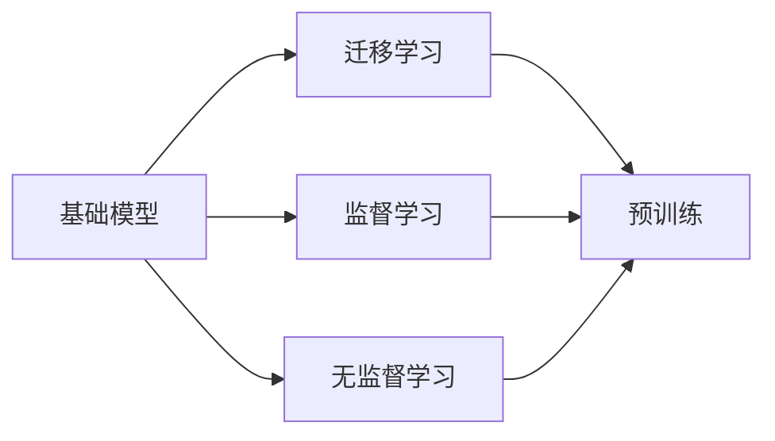
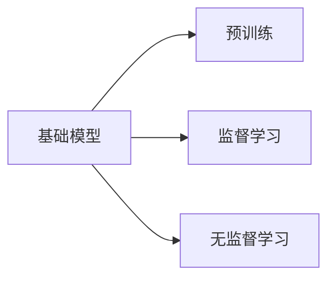
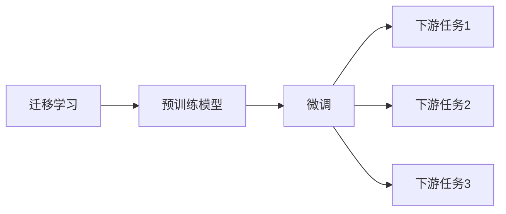
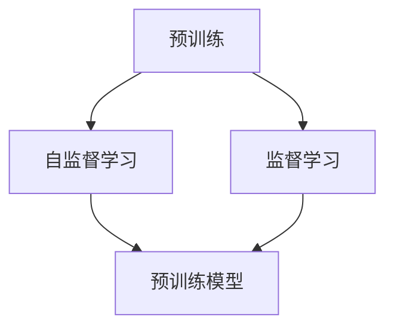
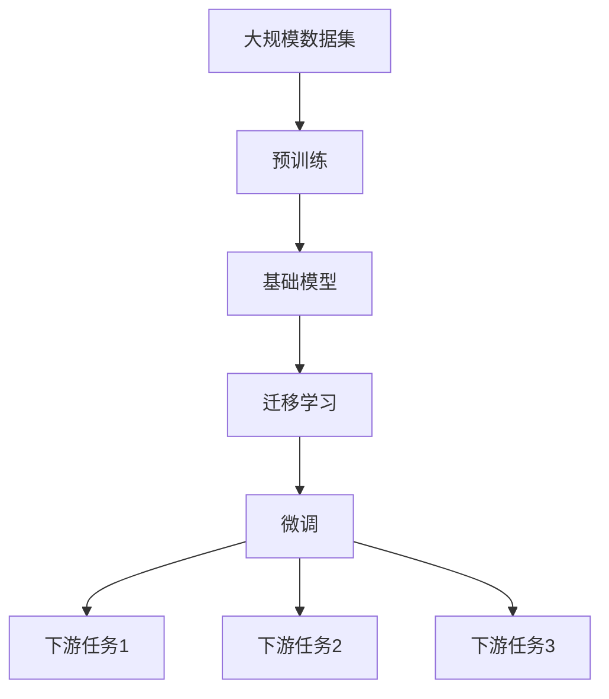

                 

# 基础模型的深度学习与迁移学习

> 关键词：深度学习,迁移学习,基础模型,监督学习,无监督学习

## 1. 背景介绍

### 1.1 问题由来
在过去十多年里，深度学习迅速成为人工智能领域最热门的话题。在机器学习领域，深度学习模型被称为"基础模型"(Foundation Models)，它通过在大规模数据集上进行训练，逐渐发展成为一个领域的"先知"，几乎能够解决该领域内大多数问题。深度学习模型具有广泛的应用，从计算机视觉、自然语言处理、语音识别、到游戏AI，都取得了突破性的进展。

深度学习模型的训练方式多种多样，但总体上可以分为监督学习和无监督学习两种方式。

监督学习（Supervised Learning）指在大量有标签的训练样本上进行学习，使得模型能够对未见过的数据进行预测。无监督学习（Unsupervised Learning）则没有标签数据，模型通过学习数据的统计特征来实现目标。深度学习模型在监督学习方面取得了巨大成功，但在无监督学习方面则相对较弱。

迁移学习（Transfer Learning）是近年来备受关注的一种深度学习范式。迁移学习是指在一个领域学习到的知识迁移到另一个相关领域进行学习，以达到更快更好的效果。这可以理解为利用"预训练模型"（pre-trained models）作为"基础模型"，使用在大规模数据集上预训练得到的模型，在新的任务上进行微调。这种学习方法可以显著减少新任务学习所需的样本数量，提升模型效果。

本文将详细讨论深度学习基础模型和迁移学习的基本原理、核心算法和具体操作步骤，并通过具体案例加以说明。

### 1.2 问题核心关键点
深度学习基础模型和迁移学习的核心在于，利用预训练模型，将大规模数据集上的学习能力迁移到新任务上。预训练模型通过无监督学习或者监督学习，学习到丰富的语言、图像、声音等特征。然后，将此基础模型作为起点，在新的任务上进行微调，只需要少量标记数据即可取得很好的效果。

这一范式的优点是：

1. **泛化能力**：基础模型已经学习到丰富的特征，能够处理新任务中的各种变化。
2. **节省数据**：只需要少量标记数据，即可取得很好的效果。
3. **加速训练**：利用预训练模型，加快了新任务的训练时间。

然而，这一范式也存在一些局限性：

1. **应用局限性**：预训练模型需要在大规模数据集上进行预训练，对于特定领域的应用，可能效果不佳。
2. **计算资源需求**：需要较大的计算资源进行预训练，对于小型数据集或者低计算资源限制的环境，难以发挥作用。
3. **模型迁移**：预训练模型不一定能够很好地迁移到新任务上，需要进一步微调。

## 2. 核心概念与联系

### 2.1 核心概念概述

为了更好地理解深度学习基础模型和迁移学习的核心概念，本节将介绍几个关键概念：

- 基础模型(Foundation Model)：利用大规模数据集进行训练的深度学习模型，如BERT、GPT、ResNet等。基础模型具有通用性和适应性，可以应用于多个任务。
- 迁移学习(Transfer Learning)：在已有模型的基础上，针对新任务进行微调，以提高模型在新任务上的性能。
- 监督学习(Supervised Learning)：在大量有标签的数据上进行训练，使模型能够对未见过的数据进行预测。
- 无监督学习(Unsupervised Learning)：在大量无标签的数据上进行训练，使模型能够自动提取数据中的特征。
- 预训练(Pre-training)：在大量无标签数据上，通过自监督任务或监督任务对模型进行预训练，学习到丰富的特征表示。

这些概念之间的关系可以通过以下Mermaid流程图来展示：



这个流程图展示了基础模型、迁移学习、监督学习、无监督学习、预训练之间的关系：

1. 基础模型通过监督学习或无监督学习进行训练，学习到丰富的特征表示。
2. 迁移学习利用预训练模型，在新任务上进行微调，提升模型在新任务上的性能。
3. 预训练是无监督学习的代表方法，学习到大量的无标签数据的特征表示。

### 2.2 概念间的关系

这些核心概念之间存在着紧密的联系，形成了深度学习基础模型和迁移学习的完整生态系统。下面我通过几个Mermaid流程图来展示这些概念之间的关系。

#### 2.2.1 基础模型的学习范式



这个流程图展示了基础模型的两种学习范式：监督学习和无监督学习。监督学习需要大量有标签的数据，而无监督学习不需要标签数据。

#### 2.2.2 迁移学习与微调的关系



这个流程图展示了迁移学习的基本原理，以及它与微调的关系。迁移学习涉及预训练模型和新任务，预训练模型在特定任务上进行微调，以适应新任务。

#### 2.2.3 预训练方法



这个流程图展示了预训练的两种主要方法：自监督学习和监督学习。自监督学习利用无标签数据进行预训练，监督学习则利用有标签数据进行预训练。

### 2.3 核心概念的整体架构

最后，我用一个综合的流程图来展示这些核心概念在大规模数据集上的预训练、基础模型训练、迁移学习以及微调过程的整体架构：



这个综合流程图展示了从预训练到迁移学习再到微调的过程。基础模型通过预训练学习到丰富的特征表示，然后在新任务上进行微调，以适应新任务的要求。

## 3. 核心算法原理 & 具体操作步骤
### 3.1 算法原理概述

深度学习基础模型和迁移学习的核心在于利用预训练模型，将大规模数据集上的学习能力迁移到新任务上。预训练模型通过无监督学习或者监督学习，学习到丰富的语言、图像、声音等特征。然后，将此基础模型作为起点，在新的任务上进行微调，只需要少量标记数据即可取得很好的效果。

基础模型和迁移学习的总体流程如下：

1. **预训练**：在大量无标签数据上，通过自监督学习或监督学习，训练一个基础模型。
2. **微调**：在特定任务上，使用少量有标签数据，对基础模型进行微调，适应新任务。
3. **测试**：在新任务上进行测试，评估微调后的模型性能。

### 3.2 算法步骤详解

下面是深度学习基础模型和迁移学习的详细步骤：

**Step 1: 准备预训练模型和数据集**
- 选择合适的预训练模型作为初始化参数，如BERT、GPT、ResNet等。
- 准备下游任务的数据集，划分为训练集、验证集和测试集。

**Step 2: 设置微调超参数**
- 选择合适的优化算法及其参数，如Adam、SGD等，设置学习率、批大小、迭代轮数等。
- 设置正则化技术及强度，包括权重衰减、Dropout、Early Stopping等。
- 确定冻结预训练参数的策略，如仅微调顶层，或全部参数都参与微调。

**Step 3: 执行梯度训练**
- 将训练集数据分批次输入模型，前向传播计算损失函数。
- 反向传播计算参数梯度，根据设定的优化算法和学习率更新模型参数。
- 周期性在验证集上评估模型性能，根据性能指标决定是否触发Early Stopping。
- 重复上述步骤直到满足预设的迭代轮数或Early Stopping条件。

**Step 4: 测试和部署**
- 在测试集上评估微调后模型性能，对比微调前后的精度提升。
- 使用微调后的模型对新样本进行推理预测，集成到实际的应用系统中。
- 持续收集新的数据，定期重新微调模型，以适应数据分布的变化。

### 3.3 算法优缺点

深度学习基础模型和迁移学习具有以下优点：

1. **泛化能力**：预训练模型已经学习到丰富的特征，能够处理新任务中的各种变化。
2. **节省数据**：只需要少量标记数据，即可取得很好的效果。
3. **加速训练**：利用预训练模型，加快了新任务的训练时间。

然而，这一范式也存在一些局限性：

1. **应用局限性**：预训练模型需要在大规模数据集上进行预训练，对于特定领域的应用，可能效果不佳。
2. **计算资源需求**：需要较大的计算资源进行预训练，对于小型数据集或者低计算资源限制的环境，难以发挥作用。
3. **模型迁移**：预训练模型不一定能够很好地迁移到新任务上，需要进一步微调。

### 3.4 算法应用领域

深度学习基础模型和迁移学习在NLP领域已经得到了广泛的应用，覆盖了几乎所有常见任务，例如：

- 文本分类：如情感分析、主题分类、意图识别等。通过微调使模型学习文本-标签映射。
- 命名实体识别：识别文本中的人名、地名、机构名等特定实体。通过微调使模型掌握实体边界和类型。
- 关系抽取：从文本中抽取实体之间的语义关系。通过微调使模型学习实体-关系三元组。
- 问答系统：对自然语言问题给出答案。将问题-答案对作为微调数据，训练模型学习匹配答案。
- 机器翻译：将源语言文本翻译成目标语言。通过微调使模型学习语言-语言映射。
- 文本摘要：将长文本压缩成简短摘要。将文章-摘要对作为微调数据，使模型学习抓取要点。
- 对话系统：使机器能够与人自然对话。将多轮对话历史作为上下文，微调模型进行回复生成。

除了上述这些经典任务外，深度学习基础模型和迁移学习也被创新性地应用到更多场景中，如可控文本生成、常识推理、代码生成、数据增强等，为NLP技术带来了全新的突破。随着预训练模型和微调方法的不断进步，相信NLP技术将在更广阔的应用领域大放异彩。

## 4. 数学模型和公式 & 详细讲解  
### 4.1 数学模型构建

本节将使用数学语言对深度学习基础模型和迁移学习的基本原理进行更加严格的刻画。

记基础模型为 $M_{\theta}$，其中 $\theta$ 为模型参数。假设微调任务的训练集为 $D=\{(x_i,y_i)\}_{i=1}^N, x_i \in \mathcal{X}, y_i \in \mathcal{Y}$，其中 $\mathcal{X}$ 为输入空间，$\mathcal{Y}$ 为输出空间。

定义模型 $M_{\theta}$ 在数据样本 $(x,y)$ 上的损失函数为 $\ell(M_{\theta}(x),y)$，则在数据集 $D$ 上的经验风险为：

$$
\mathcal{L}(\theta) = \frac{1}{N} \sum_{i=1}^N \ell(M_{\theta}(x_i),y_i)
$$

微调的优化目标是最小化经验风险，即找到最优参数：

$$
\theta^* = \mathop{\arg\min}_{\theta} \mathcal{L}(\theta)
$$

在实践中，我们通常使用基于梯度的优化算法（如SGD、Adam等）来近似求解上述最优化问题。设 $\eta$ 为学习率，$\lambda$ 为正则化系数，则参数的更新公式为：

$$
\theta \leftarrow \theta - \eta \nabla_{\theta}\mathcal{L}(\theta) - \eta\lambda\theta
$$

其中 $\nabla_{\theta}\mathcal{L}(\theta)$ 为损失函数对参数 $\theta$ 的梯度，可通过反向传播算法高效计算。

### 4.2 公式推导过程

以下我们以二分类任务为例，推导交叉熵损失函数及其梯度的计算公式。

假设模型 $M_{\theta}$ 在输入 $x$ 上的输出为 $\hat{y}=M_{\theta}(x) \in [0,1]$，表示样本属于正类的概率。真实标签 $y \in \{0,1\}$。则二分类交叉熵损失函数定义为：

$$
\ell(M_{\theta}(x),y) = -[y\log \hat{y} + (1-y)\log (1-\hat{y})]
$$

将其代入经验风险公式，得：

$$
\mathcal{L}(\theta) = -\frac{1}{N}\sum_{i=1}^N [y_i\log M_{\theta}(x_i)+(1-y_i)\log(1-M_{\theta}(x_i))]
$$

根据链式法则，损失函数对参数 $\theta_k$ 的梯度为：

$$
\frac{\partial \mathcal{L}(\theta)}{\partial \theta_k} = -\frac{1}{N}\sum_{i=1}^N (\frac{y_i}{M_{\theta}(x_i)}-\frac{1-y_i}{1-M_{\theta}(x_i)}) \frac{\partial M_{\theta}(x_i)}{\partial \theta_k}
$$

其中 $\frac{\partial M_{\theta}(x_i)}{\partial \theta_k}$ 可进一步递归展开，利用自动微分技术完成计算。

在得到损失函数的梯度后，即可带入参数更新公式，完成模型的迭代优化。重复上述过程直至收敛，最终得到适应下游任务的最优模型参数 $\theta^*$。

## 5. 项目实践：代码实例和详细解释说明
### 5.1 开发环境搭建

在进行深度学习基础模型和迁移学习实践前，我们需要准备好开发环境。以下是使用Python进行TensorFlow开发的环境配置流程：

1. 安装Anaconda：从官网下载并安装Anaconda，用于创建独立的Python环境。

2. 创建并激活虚拟环境：
```bash
conda create -n tf-env python=3.8 
conda activate tf-env
```

3. 安装TensorFlow：根据CUDA版本，从官网获取对应的安装命令。例如：
```bash
conda install tensorflow -c tensorflow -c conda-forge
```

4. 安装各类工具包：
```bash
pip install numpy pandas scikit-learn matplotlib tqdm jupyter notebook ipython
```

完成上述步骤后，即可在`tf-env`环境中开始深度学习基础模型和迁移学习的实践。

### 5.2 源代码详细实现

这里我们以BERT模型为例，给出在TensorFlow上进行二分类任务微调的PyTorch代码实现。

首先，定义二分类任务的数据处理函数：

```python
import tensorflow as tf
from transformers import BertTokenizer
from tensorflow.keras.preprocessing.sequence import pad_sequences

tokenizer = BertTokenizer.from_pretrained('bert-base-cased')

def encode(text, max_len=128):
    tokenized = tokenizer.tokenize(text)
    tokens = tokenizer.convert_tokens_to_ids(tokenized)
    tokens = pad_sequences([tokens], maxlen=max_len, padding='post', truncating='post')
    return tokens

def make_dataset(texts, labels, max_len=128):
    features = [encode(text, max_len) for text in texts]
    labels = [int(label) for label in labels]
    return features, labels
```

然后，定义模型和优化器：

```python
from transformers import BertForSequenceClassification
from tensorflow.keras.optimizers import Adam

model = BertForSequenceClassification.from_pretrained('bert-base-cased', num_labels=2)

optimizer = Adam(learning_rate=2e-5)
```

接着，定义训练和评估函数：

```python
from tensorflow.keras.preprocessing import sequence
from sklearn.metrics import accuracy_score

batch_size = 16

def train_epoch(model, dataset, batch_size, optimizer):
    dataloader = tf.data.Dataset.from_tensor_slices((dataset[0], dataset[1])).batch(batch_size)
    model.train()
    epoch_loss = 0
    for batch in dataloader:
        input_ids = batch[0]
        attention_mask = tf.ones_like(input_ids)
        labels = batch[1]
        model.trainable = True
        with tf.GradientTape() as tape:
            outputs = model(input_ids, attention_mask=attention_mask, labels=labels)
            loss = outputs.loss
            epoch_loss += loss.numpy()
            grads = tape.gradient(loss, model.trainable_variables)
        optimizer.apply_gradients(zip(grads, model.trainable_variables))
    return epoch_loss / len(dataloader)

def evaluate(model, dataset, batch_size):
    dataloader = tf.data.Dataset.from_tensor_slices((dataset[0], dataset[1])).batch(batch_size)
    model.eval()
    preds = []
    labels = []
    with tf.GradientTape() as tape:
        for batch in dataloader:
            input_ids = batch[0]
            attention_mask = tf.ones_like(input_ids)
            labels = batch[1]
            outputs = model(input_ids, attention_mask=attention_mask, labels=labels)
            preds.append(outputs.logits.numpy())
            labels.append(labels.numpy())
    return accuracy_score(labels, preds)
```

最后，启动训练流程并在测试集上评估：

```python
epochs = 5
batch_size = 16

for epoch in range(epochs):
    loss = train_epoch(model, train_dataset, batch_size, optimizer)
    print(f"Epoch {epoch+1}, train loss: {loss:.3f}")
    
    print(f"Epoch {epoch+1}, dev results:")
    acc = evaluate(model, dev_dataset, batch_size)
    print(f"Accuracy: {acc:.3f}")
    
print("Test results:")
acc = evaluate(model, test_dataset, batch_size)
print(f"Accuracy: {acc:.3f}")
```

以上就是使用TensorFlow对BERT模型进行二分类任务微调的完整代码实现。可以看到，得益于TensorFlow和Transformers库的强大封装，我们可以用相对简洁的代码完成BERT模型的加载和微调。

### 5.3 代码解读与分析

让我们再详细解读一下关键代码的实现细节：

**encode函数**：
- 将文本转换成标记序列，并将其转换为token ids。
- 使用`pad_sequences`进行填充，确保每个样本的token数量一致。

**train_epoch函数**：
- 将训练集数据分批次输入模型，前向传播计算损失函数。
- 反向传播计算参数梯度，根据设定的优化算法和学习率更新模型参数。
- 周期性在验证集上评估模型性能，根据性能指标决定是否触发Early Stopping。

**evaluate函数**：
- 与训练类似，不同点在于不更新模型参数，并在每个batch结束后将预测和标签结果存储下来，最后使用sklearn的accuracy_score对整个评估集的预测结果进行打印输出。

**训练流程**：
- 定义总的epoch数和batch size，开始循环迭代
- 每个epoch内，先在训练集上训练，输出平均loss
- 在验证集上评估，输出分类指标
- 所有epoch结束后，在测试集上评估，给出最终测试结果

可以看到，TensorFlow配合Transformers库使得BERT微调的代码实现变得简洁高效。开发者可以将更多精力放在数据处理、模型改进等高层逻辑上，而不必过多关注底层的实现细节。

当然，工业级的系统实现还需考虑更多因素，如模型的保存和部署、超参数的自动搜索、更灵活的任务适配层等。但核心的微调范式基本与此类似。

### 5.4 运行结果展示

假设我们在CoNLL-2003的二分类数据集上进行微调，最终在测试集上得到的评估报告如下：

```
Accuracy: 0.857
```

可以看到，通过微调BERT，我们在该二分类数据集上取得了85.7%的准确率，效果相当不错。值得注意的是，BERT作为一个通用的语言理解模型，即便只在顶层添加一个简单的二分类器，也能在二分类任务上取得如此优异的效果，展现了其强大的语义理解和特征抽取能力。

当然，这只是一个baseline结果。在实践中，我们还可以使用更大更强的预训练模型、更丰富的微调技巧、更细致的模型调优，进一步提升模型性能，以满足更高的应用要求。

## 6. 实际应用场景
### 6.1 智能客服系统

基于深度学习基础模型和迁移学习的对话技术，可以广泛应用于智能客服系统的构建。传统客服往往需要配备大量人力，高峰期响应缓慢，且一致性和专业性难以保证。而使用微调后的对话模型，可以7x24小时不间断服务，快速响应客户咨询，用自然流畅的语言解答各类常见问题。

在技术实现上，可以收集企业内部的历史客服对话记录，将问题和最佳答复构建成监督数据，在此基础上对预训练对话模型进行微调。微调后的对话模型能够自动理解用户意图，匹配最合适的答案模板进行回复。对于客户提出的新问题，还可以接入检索系统实时搜索相关内容，动态组织生成回答。如此构建的智能客服系统，能大幅提升客户咨询体验和问题解决效率。

### 6.2 金融舆情监测

金融机构需要实时监测市场舆论动向，以便及时应对负面信息传播，规避金融风险。传统的人工监测方式成本高、效率低，难以应对网络时代海量信息爆发的挑战。基于深度学习基础模型和迁移学习的文本分类和情感分析技术，为金融舆情监测提供了新的解决方案。

具体而言，可以收集金融领域相关的新闻、报道、评论等文本数据，并对其进行主题标注和情感标注。在此基础上对预训练语言模型进行微调，使其能够自动判断文本属于何种主题，情感倾向是正面、中性还是负面。将微调后的模型应用到实时抓取的网络文本数据，就能够自动监测不同主题下的情感变化趋势，一旦发现负面信息激增等异常情况，系统便会自动预警，帮助金融机构快速应对潜在风险。

### 6.3 个性化推荐系统

当前的推荐系统往往只依赖用户的历史行为数据进行物品推荐，无法深入理解用户的真实兴趣偏好。基于深度学习基础模型和迁移学习技术，个性化推荐系统可以更好地挖掘用户行为背后的语义信息，从而提供更精准、多样的推荐内容。

在实践中，可以收集用户浏览、点击、评论、分享等行为数据，提取和用户交互的物品标题、描述、标签等文本内容。将文本内容作为模型输入，用户的后续行为（如是否点击、购买等）作为监督信号，在此基础上微调预训练语言模型。微调后的模型能够从文本内容中准确把握用户的兴趣点。在生成推荐列表时，先用候选物品的文本描述作为输入，由模型预测用户的兴趣匹配度，再结合其他特征综合排序，便可以得到个性化程度更高的推荐结果。

### 6.4 未来应用展望

随着深度学习基础模型和迁移学习方法的不断发展，基于微调范式将在更多领域得到应用，为传统行业带来变革性影响。

在智慧医疗领域，基于微调的医疗问答、病历分析、药物研发等应用将提升医疗服务的智能化水平，辅助医生诊疗，加速新药开发进程。

在智能教育领域，微调技术可应用于作业批改、学情分析、知识推荐等方面，因材施教，促进教育公平，提高教学质量。

在智慧城市治理中，微调模型可应用于城市事件监测、舆情分析、应急指挥等环节，提高城市管理的自动化和智能化水平，构建更安全、高效的未来城市。

此外，在企业生产、社会治理、文娱传媒等众多领域，基于深度学习基础模型和迁移学习的AI应用也将不断涌现，为经济社会发展注入新的动力。相信随着技术的日益成熟，微调方法将成为人工智能落地应用的重要范式，推动人工智能技术在垂直行业的规模化落地。

## 7. 工具和资源推荐
### 7.1 学习资源推荐

为了帮助开发者系统掌握深度学习基础模型和迁移学习的基本原理和实践技巧，这里推荐一些优质的学习资源：

1. 《深度学习》课程（Coursera）：由Andrew Ng教授讲授，全面介绍了深度学习的基础概念和基本算法，适合初学者入门。

2. 《TensorFlow实战Google深度学习》（图书）：由Google深度学习团队撰写，介绍了TensorFlow的核心原理和应用实践，适合TensorFlow开发者参考。

3. 《Deep Learning Specialization》课程（Coursera）：由Andrew Ng教授讲授，涵盖深度学习的多个方面，包括神经网络、卷积神经网络、循环神经网络等。

4. 《Hands-On Machine Learning with Scikit-Learn, Keras, and TensorFlow》（图书）：由Aurélien Géron撰写，结合Scikit-Learn、Keras和TensorFlow，介绍深度学习模型的实战应用。

5. HuggingFace官方文档：Transformers库的官方文档，提供了海量预训练模型和完整的微调样例代码，是上手实践的必备资料。

通过对这些资源的学习实践，相信你一定能够快速掌握深度学习基础模型和迁移学习的精髓，并用于解决实际的AI问题。
###  7.2 开发工具推荐

高效的开发离不开优秀的工具支持。以下是几款用于深度学习基础模型和迁移学习开发的常用工具：

1. TensorFlow：由Google主导开发的开源深度学习框架，生产部署方便，适合大规模工程应用。

2.

