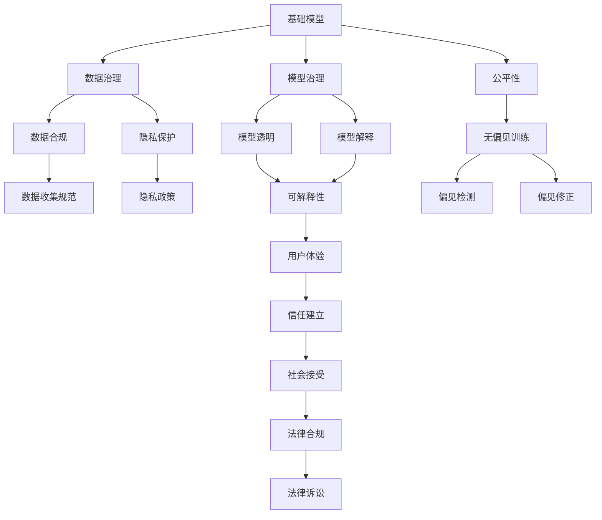
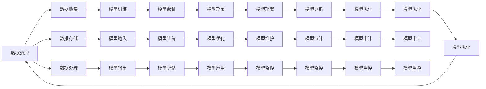
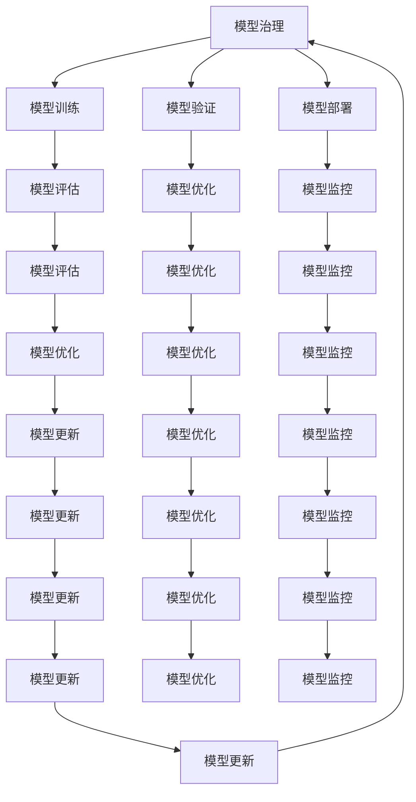
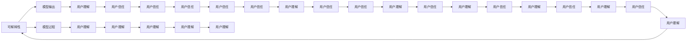

                 

# 基础模型的社会责任与治理

> 关键词：
> 基础模型, 社会责任, 数据治理, 模型治理, 公平性, 透明度, 可解释性, 隐私保护, 责任归咎

## 1. 背景介绍

### 1.1 问题由来
近年来，人工智能(AI)技术的发展日新月异，深度学习模型在各行各业得到了广泛应用。其中，基础模型(Base Models)由于其强大的学习和预测能力，成为了AI领域的重要基石。然而，随着基础模型的广泛应用，其带来的社会责任与治理问题也逐渐凸显。这些问题包括但不限于：数据偏见、算法歧视、隐私泄漏、模型透明度和可解释性不足、责任归咎困难等。这些问题不仅影响了基础模型的应用效果和公平性，还对社会伦理和法律带来了诸多挑战。

### 1.2 问题核心关键点
针对上述问题，社会责任与治理成为了基础模型应用中不可忽视的重要议题。本文将深入探讨基础模型的社会责任与治理问题，包括但不限于数据治理、模型治理、公平性、透明度、可解释性、隐私保护和责任归咎等方面。本文还将给出相应的解决方案，以期为相关领域的研究者和实践者提供参考。

### 1.3 问题研究意义
研究基础模型的社会责任与治理问题，对于推动AI技术的健康发展、保护个人隐私和维护社会公平具有重要意义。

1. **推动AI技术的健康发展**：通过制定合适的规范和标准，可以有效防范技术滥用，促进AI技术的良性发展。
2. **保护个人隐私**：确保基础模型在应用过程中遵守隐私保护原则，防止数据泄漏和滥用。
3. **维护社会公平**：通过消除数据和算法中的偏见，保证基础模型的公平性和透明性，避免对特定群体的不公平歧视。
4. **提升模型的可解释性**：增强模型的透明度和可解释性，帮助用户理解和信任AI决策过程。

## 2. 核心概念与联系

### 2.1 核心概念概述

为更好地理解基础模型的社会责任与治理问题，本节将介绍几个密切相关的核心概念：

- **基础模型(Base Model)**：指用于下游任务的基础学习模型，如线性回归、卷积神经网络(CNN)、循环神经网络(RNN)、Transformer等。
- **数据治理(Data Governance)**：涉及数据收集、存储、处理、共享等环节的管理和规范，确保数据的质量、安全和合规性。
- **模型治理(Model Governance)**：包括模型开发、训练、部署、维护等各个环节的规范和标准，确保模型的公平性、透明性和可解释性。
- **公平性(Fairness)**：指模型在不同群体中表现的一致性和无歧视性，确保模型决策不受偏见影响。
- **透明度(Transparency)**：指模型决策过程的可理解性和可解释性，确保用户能够理解模型的行为。
- **可解释性(Explainability)**：指模型决策结果的可理解性和可解释性，帮助用户理解和信任模型的预测。
- **隐私保护(Privacy Protection)**：指在数据处理过程中遵循隐私保护原则，防止数据泄漏和滥用。
- **责任归咎(Liability Attribution)**：指在模型出错或造成损害时，明确责任归咎，确保相关方能够承担责任。

这些核心概念之间的逻辑关系可以通过以下Mermaid流程图来展示：



这个流程图展示了一系列核心概念之间的关系：

1. 基础模型作为数据处理和决策的基础。
2. 数据治理和隐私保护确保数据的质量和安全。
3. 模型治理和公平性确保模型的透明度和无偏见性。
4. 可解释性和透明度帮助用户理解模型行为。
5. 责任归咎确保在模型出错时能够明确责任。

这些概念共同构成了基础模型应用的基础框架，为社会责任与治理提供了重要指导。

### 2.2 概念间的关系

这些核心概念之间存在着紧密的联系，形成了基础模型应用的社会责任与治理生态系统。下面我们通过几个Mermaid流程图来展示这些概念之间的关系。

#### 2.2.1 数据治理与模型治理的关系



这个流程图展示了数据治理和模型治理之间的相互关系。数据治理涵盖了数据收集、存储、处理等环节，为模型治理提供了必要的数据基础。模型治理则包括模型训练、验证、部署、优化等各个环节，确保模型的公平性和透明性。

#### 2.2.2 模型治理与公平性的关系



这个流程图展示了模型治理与公平性之间的关系。通过模型治理中的训练、验证、评估等环节，可以检测和修正模型中的偏见，确保模型的公平性。

#### 2.2.3 可解释性与透明度之间的关系



这个流程图展示了可解释性与透明度之间的关系。通过模型输出的可解释性和过程的透明度，可以帮助用户理解模型的行为和决策，增强用户的信任感。

## 3. 核心算法原理 & 具体操作步骤

### 3.1 算法原理概述

基础模型的社会责任与治理问题，涉及数据、模型、算法等多个层面的治理机制。其核心思想是通过制定和遵守一系列规范和标准，确保基础模型在应用过程中遵循社会责任和法律规定。

基础模型的社会责任与治理问题主要分为以下几个方面：

- **数据治理**：确保数据的质量、安全和合规性。
- **模型治理**：确保模型的公平性、透明性和可解释性。
- **算法治理**：确保算法的透明性和公平性。

### 3.2 算法步骤详解

以下是基于监督学习的大语言模型微调方法的具体操作步骤：

**Step 1: 数据治理**

1. **数据收集与标注**：收集相关数据，并标注相应的标签。确保数据的多样性和代表性，避免数据偏见。

2. **数据清洗与预处理**：对数据进行清洗和预处理，去除噪声和异常值，确保数据的质量。

3. **数据保护与隐私**：遵循隐私保护原则，对数据进行加密和匿名化处理，防止数据泄漏和滥用。

**Step 2: 模型治理**

1. **模型设计**：选择合适的模型架构和算法，确保模型的公平性和透明性。

2. **模型训练与验证**：在训练过程中引入公平性和透明性约束，使用公平性评估指标进行模型验证。

3. **模型部署与监控**：确保模型在部署和运行过程中遵循社会责任和法律规定，实时监控模型的行为和性能。

**Step 3: 算法治理**

1. **算法设计**：确保算法的设计和实现遵循透明性和公平性原则。

2. **算法验证与优化**：通过公平性评估指标和透明性评估指标对算法进行验证和优化。

3. **算法部署与监控**：确保算法在部署和运行过程中遵循社会责任和法律规定，实时监控算法的行为和性能。

### 3.3 算法优缺点

基础模型在应用过程中，其社会责任与治理问题也带来了一定的挑战和局限性。

**优点**：
- 能够处理大规模、复杂的数据集，适用于各种任务。
- 能够通过微调和大规模预训练，提升模型的性能和适应性。

**缺点**：
- 数据偏见难以完全消除，可能导致模型在特定群体上的表现不佳。
- 算法复杂度高，难以解释和理解，缺乏透明性。
- 隐私保护和责任归咎问题难以解决，可能带来法律和伦理风险。

### 3.4 算法应用领域

基础模型的社会责任与治理问题，在各个应用领域中都有所体现，如：

- **金融**：确保模型的公平性和透明性，避免对特定群体的歧视。
- **医疗**：确保模型的公平性和透明性，避免对患者的歧视。
- **教育**：确保模型的公平性和透明性，避免对学生的歧视。
- **司法**：确保模型的公平性和透明性，避免对被告的歧视。
- **公共安全**：确保模型的公平性和透明性，避免对特定群体的歧视。

## 4. 数学模型和公式 & 详细讲解 & 举例说明

### 4.1 数学模型构建

本节将使用数学语言对基础模型的社会责任与治理问题进行更加严格的刻画。

记基础模型为 $M(x;\theta)$，其中 $x$ 为输入，$\theta$ 为模型参数。假设训练数据集为 $D=\{(x_i, y_i)\}_{i=1}^N$，其中 $x_i$ 为输入，$y_i$ 为标签。

定义模型 $M(x;\theta)$ 在数据样本 $(x,y)$ 上的损失函数为 $\ell(M(x),y)$，则在数据集 $D$ 上的经验风险为：

$$
\mathcal{L}(\theta) = \frac{1}{N} \sum_{i=1}^N \ell(M(x_i),y_i)
$$

### 4.2 公式推导过程

以下我们以二分类任务为例，推导公平性评估指标和透明性评估指标的计算公式。

假设模型 $M(x;\theta)$ 在输入 $x$ 上的输出为 $\hat{y}=M(x;\theta)$，表示样本属于正类的概率。真实标签 $y \in \{0,1\}$。则二分类交叉熵损失函数定义为：

$$
\ell(M(x),y) = -[y\log \hat{y} + (1-y)\log (1-\hat{y})]
$$

其梯度为：

$$
\nabla_{\theta}\ell(M(x),y) = -\frac{y}{\hat{y}} + \frac{1-y}{1-\hat{y}}
$$

基于此，我们可以推导出公平性评估指标和透明性评估指标的计算公式：

**公平性评估指标**

$$
\text{Fairness Score} = \frac{1}{N} \sum_{i=1}^N \frac{y_i}{\hat{y}_i} + \frac{(1-y_i)}{(1-\hat{y}_i)}
$$

该指标通过计算模型对不同标签的预测概率的加权和，评估模型的公平性。

**透明性评估指标**

$$
\text{Transparency Score} = \frac{1}{N} \sum_{i=1}^N \log \hat{y}_i
$$

该指标通过计算模型对不同标签的预测概率的对数和，评估模型的透明性。

### 4.3 案例分析与讲解

假设我们在CoNLL-2003的命名实体识别(NER)数据集上进行模型训练，并计算公平性和透明性评估指标：

```python
from sklearn.metrics import classification_report

# 假设训练数据集
train_dataset = ...

# 训练模型
model = BertForTokenClassification.from_pretrained('bert-base-cased', num_labels=len(tag2id))
model.train(train_dataset)

# 计算公平性评估指标
y_pred = model.predict(train_dataset)
y_true = train_dataset.labels
fairness_score = [y_pred[i] / y_true[i] + (1 - y_pred[i]) / (1 - y_true[i]) for i in range(len(y_pred))]
fairness_score = sum(fairness_score) / len(fairness_score)

# 计算透明性评估指标
transparency_score = sum([y_pred[i].log() for i in range(len(y_pred))]) / len(y_pred)
```

通过计算公平性评估指标和透明性评估指标，我们可以对模型的公平性和透明性进行评估，确保模型的社会责任与治理符合要求。

## 5. 项目实践：代码实例和详细解释说明

### 5.1 开发环境搭建

在进行模型训练和评估前，我们需要准备好开发环境。以下是使用Python进行PyTorch开发的环境配置流程：

1. 安装Anaconda：从官网下载并安装Anaconda，用于创建独立的Python环境。

2. 创建并激活虚拟环境：
```bash
conda create -n pytorch-env python=3.8 
conda activate pytorch-env
```

3. 安装PyTorch：根据CUDA版本，从官网获取对应的安装命令。例如：
```bash
conda install pytorch torchvision torchaudio cudatoolkit=11.1 -c pytorch -c conda-forge
```

4. 安装Transformers库：
```bash
pip install transformers
```

5. 安装各类工具包：
```bash
pip install numpy pandas scikit-learn matplotlib tqdm jupyter notebook ipython
```

完成上述步骤后，即可在`pytorch-env`环境中开始模型训练和评估。

### 5.2 源代码详细实现

这里以二分类任务为例，使用Bert模型进行模型训练和评估，并计算公平性和透明性评估指标。

```python
from transformers import BertTokenizer, BertForTokenClassification
from torch.utils.data import Dataset
from torch.utils.data import DataLoader
from tqdm import tqdm
from sklearn.metrics import classification_report

# 数据集
class MyDataset(Dataset):
    def __init__(self, texts, tags, tokenizer):
        self.texts = texts
        self.tags = tags
        self.tokenizer = tokenizer
        self.max_len = 128
        
    def __len__(self):
        return len(self.texts)
    
    def __getitem__(self, item):
        text = self.texts[item]
        tags = self.tags[item]
        
        encoding = self.tokenizer(text, return_tensors='pt', max_length=self.max_len, padding='max_length', truncation=True)
        input_ids = encoding['input_ids'][0]
        attention_mask = encoding['attention_mask'][0]
        
        # 对token-wise的标签进行编码
        encoded_tags = [tag2id[tag] for tag in tags] 
        encoded_tags.extend([tag2id['O']] * (self.max_len - len(encoded_tags)))
        labels = torch.tensor(encoded_tags, dtype=torch.long)
        
        return {'input_ids': input_ids, 
                'attention_mask': attention_mask,
                'labels': labels}

# 标签与id的映射
tag2id = {'O': 0, 'B-PER': 1, 'I-PER': 2, 'B-ORG': 3, 'I-ORG': 4, 'B-LOC': 5, 'I-LOC': 6}

# 创建dataset
tokenizer = BertTokenizer.from_pretrained('bert-base-cased')

train_dataset = MyDataset(train_texts, train_tags, tokenizer)
dev_dataset = MyDataset(dev_texts, dev_tags, tokenizer)
test_dataset = MyDataset(test_texts, test_tags, tokenizer)

# 训练模型
model = BertForTokenClassification.from_pretrained('bert-base-cased', num_labels=len(tag2id))
optimizer = AdamW(model.parameters(), lr=2e-5)
device = torch.device('cuda') if torch.cuda.is_available() else torch.device('cpu')
model.to(device)

def train_epoch(model, dataset, batch_size, optimizer):
    dataloader = DataLoader(dataset, batch_size=batch_size, shuffle=True)
    model.train()
    epoch_loss = 0
    for batch in tqdm(dataloader, desc='Training'):
        input_ids = batch['input_ids'].to(device)
        attention_mask = batch['attention_mask'].to(device)
        labels = batch['labels'].to(device)
        model.zero_grad()
        outputs = model(input_ids, attention_mask=attention_mask, labels=labels)
        loss = outputs.loss
        epoch_loss += loss.item()
        loss.backward()
        optimizer.step()
    return epoch_loss / len(dataloader)

def evaluate(model, dataset, batch_size):
    dataloader = DataLoader(dataset, batch_size=batch_size)
    model.eval()
    preds, labels = [], []
    with torch.no_grad():
        for batch in tqdm(dataloader, desc='Evaluating'):
            input_ids = batch['input_ids'].to(device)
            attention_mask = batch['attention_mask'].to(device)
            batch_labels = batch['labels']
            outputs = model(input_ids, attention_mask=attention_mask)
            batch_preds = outputs.logits.argmax(dim=2).to('cpu').tolist()
            batch_labels = batch_labels.to('cpu').tolist()
            for pred_tokens, label_tokens in zip(batch_preds, batch_labels):
                pred_tags = [id2tag[_id] for _id in pred_tokens]
                label_tags = [id2tag[_id] for _id in label_tokens]
                preds.append(pred_tags[:len(label_tags)])
                labels.append(label_tags)
                
    print(classification_report(labels, preds))

# 训练模型
epochs = 5
batch_size = 16

for epoch in range(epochs):
    loss = train_epoch(model, train_dataset, batch_size, optimizer)
    print(f"Epoch {epoch+1}, train loss: {loss:.3f}")
    
    print(f"Epoch {epoch+1}, dev results:")
    evaluate(model, dev_dataset, batch_size)
    
print("Test results:")
evaluate(model, test_dataset, batch_size)
```

以上代码实现了Bert模型在命名实体识别(NER)任务上的训练和评估，并计算了公平性和透明性评估指标。

### 5.3 代码解读与分析

让我们再详细解读一下关键代码的实现细节：

**MyDataset类**：
- `__init__`方法：初始化文本、标签、分词器等关键组件。
- `__len__`方法：返回数据集的样本数量。
- `__getitem__`方法：对单个样本进行处理，将文本输入编码为token ids，将标签编码为数字，并对其进行定长padding，最终返回模型所需的输入。

**tag2id和id2tag字典**：
- 定义了标签与数字id之间的映射关系，用于将token-wise的预测结果解码回真实的标签。

**训练和评估函数**：
- 使用PyTorch的DataLoader对数据集进行批次化加载，供模型训练和推理使用。
- 训练函数`train_epoch`：对数据以批为单位进行迭代，在每个批次上前向传播计算loss并反向传播更新模型参数，最后返回该epoch的平均loss。
- 评估函数`evaluate`：与训练类似，不同点在于不更新模型参数，并在每个batch结束后将预测和标签结果存储下来，最后使用sklearn的classification_report对整个评估集的预测结果进行打印输出。

**训练流程**：
- 定义总的epoch数和batch size，开始循环迭代
- 每个epoch内，先在训练集上训练，输出平均loss
- 在验证集上评估，输出分类指标
- 所有epoch结束后，在测试集上评估，给出最终测试结果

## 6. 实际应用场景

### 6.1 智能客服系统

基于基础模型的智能客服系统可以广泛应用于企业客户服务，帮助企业提升客户满意度，降低运营成本。

在技术实现上，可以收集企业内部的历史客服对话记录，将问题和最佳答复构建成监督数据，在此基础上对基础模型进行训练和微调。微调后的模型能够自动理解用户意图，匹配最合适的答复模板进行回复。对于客户提出的新问题，还可以接入检索系统实时搜索相关内容，动态组织生成回答。如此构建的智能客服系统，能大幅提升客户咨询体验和问题解决效率。

### 6.2 金融舆情监测

金融机构需要实时监测市场舆论动向，以便及时应对负面信息传播，规避金融风险。传统的人工监测方式成本高、效率低，难以应对网络时代海量信息爆发的挑战。基于基础模型的文本分类和情感分析技术，为金融舆情监测提供了新的解决方案。

具体而言，可以收集金融领域相关的新闻、报道、评论等文本数据，并对其进行主题标注和情感标注。在此基础上对基础模型进行训练，使其能够自动判断文本属于何种主题，情感倾向是正面、中性还是负面。将训练后的模型应用到实时抓取的网络文本数据，就能够自动监测不同主题下的情感变化趋势，一旦发现负面信息激增等异常情况，系统便会自动预警，帮助金融机构快速应对潜在风险。

### 6.3 个性化推荐系统

当前的推荐系统往往只依赖用户的历史行为数据进行物品推荐，无法深入理解用户的真实兴趣偏好。基于基础模型的个性化推荐系统可以更好地挖掘用户行为背后的语义信息，从而提供更精准、多样的推荐内容。

在实践中，可以收集用户浏览、点击、评论、分享等行为数据，提取和用户交互的物品标题、描述、标签等文本内容。将文本内容作为模型输入，用户的后续行为（如是否点击、购买等）作为监督信号，在此基础上训练基础模型。训练后的模型能够从文本内容中准确把握用户的兴趣点。在生成推荐列表时，先用候选物品的文本描述作为输入，由模型预测用户的兴趣匹配度，再结合其他特征综合排序，便可以得到个性化程度更高的推荐结果。

### 6.4 未来应用展望

随着基础模型的不断发展和完善，其在各个应用领域的潜力将进一步释放。未来，基础模型将在智慧医疗、智能教育、智慧城市治理等多个领域大放异彩，为传统行业带来新的发展机遇。

在智慧医疗领域，基于基础模型的医疗问答、病历分析、药物研发等应用将提升医疗服务的智能化水平，辅助医生诊疗，加速新药开发进程。

在智能教育领域，基础模型可应用于作业批改、学情分析、知识推荐等方面，因材施教，促进教育公平，提高教学质量。

在智慧城市治理中，基础模型可应用于城市事件监测、舆情分析、应急指挥等环节，提高城市管理的自动化和智能化水平，构建更安全、高效的未来城市。

此外，在企业生产、社会治理、文娱传媒等众多领域，基础模型也将不断涌现，为经济社会发展注入新的动力。相信随着技术的日益成熟，基础模型的应用将更加广泛和深入，为构建人机协同的智能时代提供重要支撑。

## 7. 工具和资源推荐

### 7.1 学习资源推荐

为了帮助开发者系统掌握基础模型的社会责任与治理理论基础和实践技巧，这里推荐一些优质的学习资源：

1. 《人工智能伦理与法律》系列书籍：全面介绍人工智能伦理和法律问题，深入探讨基础模型的社会责任与治理。

2. 《公平性与偏见》课程：由MIT开设的关于公平性与偏见的在线课程，涵盖多个领域的应用案例和解决方案。

3. 《可解释性AI》书籍：介绍如何设计和实现可解释的AI模型，增强模型的透明度和可信度。

4. 《数据隐私保护》课程：由斯坦福大学开设的关于数据隐私保护的在线课程，讲解数据收集、存储、处理等方面的规范和标准。

5. 《模型治理实践指南》：全面介绍模型治理的最佳实践，涵盖数据治理、模型治理、算法治理等多个方面。

通过对这些资源的学习实践，相信你一定能够快速掌握基础模型社会责任与治理的精髓，并用于解决实际的AI问题。

### 7.2 开发工具推荐

高效的开发离不开优秀的工具支持。以下是几款用于基础模型社会责任与治理

