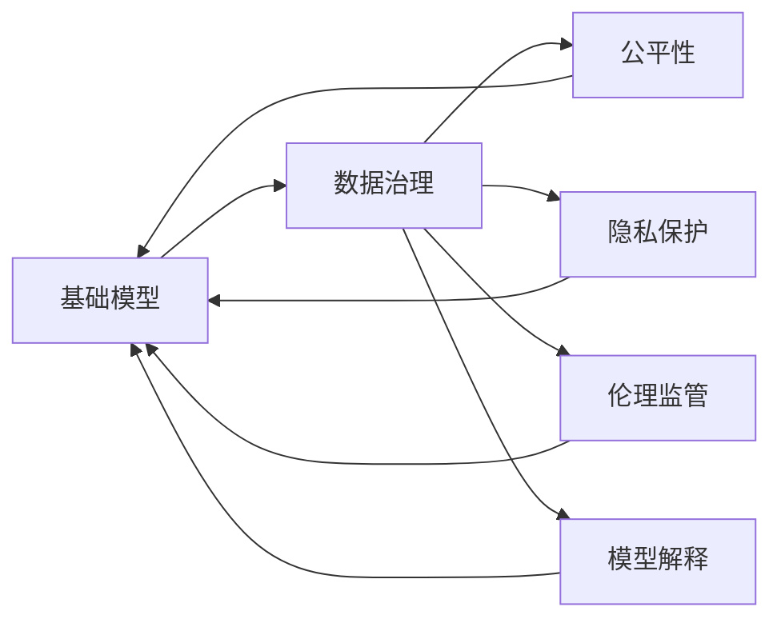
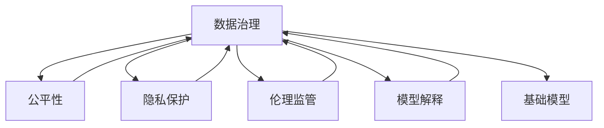
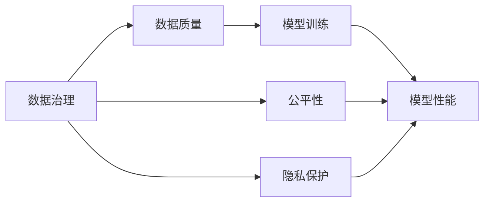
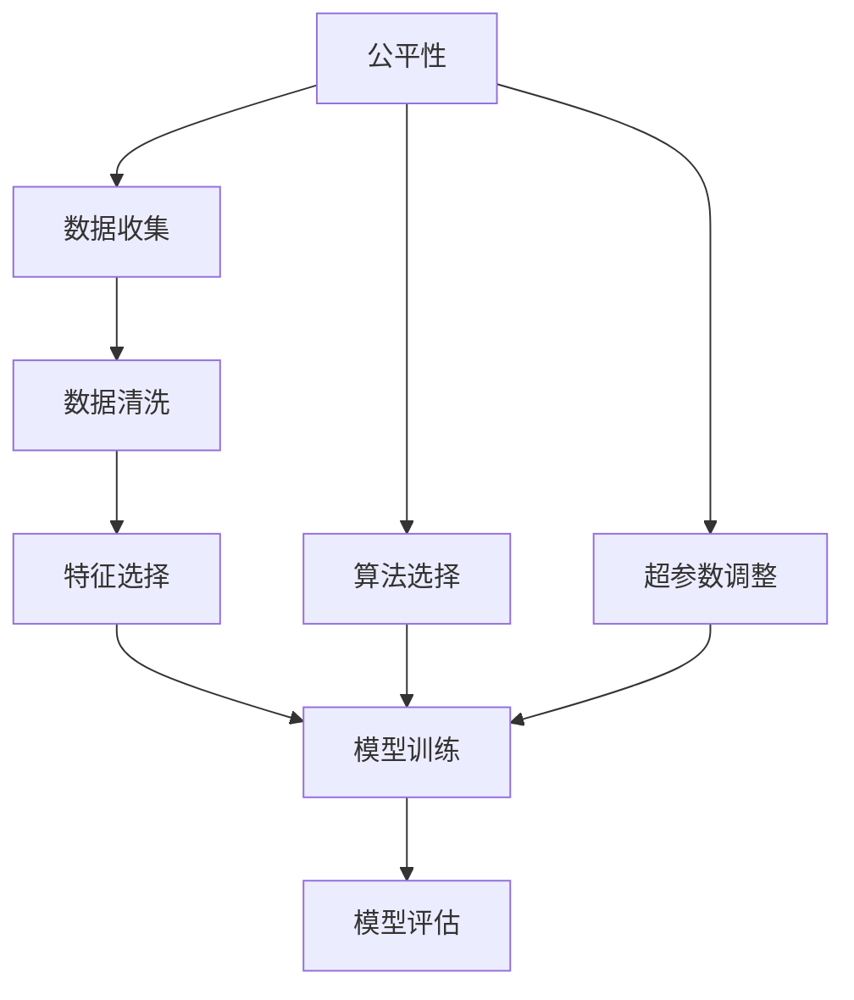

                 

# 基础模型的社会责任与治理

> 关键词：社会责任、基础模型、数据治理、公平性、透明度、隐私保护、伦理监管、模型解释、人工智能治理

## 1. 背景介绍

### 1.1 问题由来
随着人工智能技术的不断进步，基础模型（Foundation Model）在各行各业的应用越来越广泛。从自然语言处理、计算机视觉到游戏策略、金融预测，基础模型的卓越表现大大提升了生产效率和决策准确性。然而，基础模型也带来了许多社会问题，如偏见、隐私泄漏、公平性缺失等。这些问题不仅影响模型自身的可信度和接受度，还对社会和谐稳定造成威胁。

### 1.2 问题核心关键点
基础模型的社会责任与治理问题涉及多个层面，包括但不限于数据治理、模型公平性、隐私保护、伦理监管和模型解释。这些问题相互关联，共同决定了基础模型在实际应用中的表现和影响。

- 数据治理：如何确保数据的多样性、公平性、准确性和代表性，避免偏见和歧视。
- 模型公平性：如何确保模型在不同人群和群体中的公平性，避免对特定群体的不公平对待。
- 隐私保护：如何在保护用户隐私的前提下，获取和利用数据进行模型训练。
- 伦理监管：如何制定和执行伦理标准，确保模型使用的合法性和道德性。
- 模型解释：如何提供透明、可解释的模型输出，增强用户对模型的信任。

这些问题已经引起了学术界和产业界的广泛关注，亟需从理论和实践两个层面进行深入探讨和解决。

### 1.3 问题研究意义
研究基础模型的社会责任与治理问题，对于提升基础模型的可信度和接受度，维护社会公平正义，推动人工智能技术的健康发展，具有重要意义：

1. 提升基础模型的可信度。通过完善数据治理、公平性评估和隐私保护措施，增强模型输出的可信度，避免偏见和歧视，从而提升用户对模型的信任。
2. 维护社会公平正义。确保模型在不同人群和群体中的公平性，避免对特定群体的不公平对待，促进社会和谐稳定。
3. 推动人工智能技术发展。通过制定和执行伦理标准，确保模型使用的合法性和道德性，避免伦理风险，推动人工智能技术的健康发展。
4. 增强模型透明度。提供透明、可解释的模型输出，增强用户对模型的理解和信任，促进模型的普及应用。
5. 保障隐私安全。在保护用户隐私的前提下，合理利用数据进行模型训练，防止数据泄漏和滥用。

## 2. 核心概念与联系

### 2.1 核心概念概述

为了更好地理解基础模型的社会责任与治理问题，本节将介绍几个密切相关的核心概念：

- 基础模型（Foundation Model）：基于大规模数据和复杂算法训练出的通用模型，能够在新数据上自动学习和适应，具备强大的泛化能力。常见的基础模型包括BERT、GPT、T5等。
- 数据治理（Data Governance）：通过一系列制度、技术和标准，确保数据的完整性、准确性、安全性和合规性，避免偏见和歧视。
- 公平性（Fairness）：模型在不同人群和群体中的表现差异，避免对特定群体的不公平对待。
- 隐私保护（Privacy Protection）：保护用户隐私和数据安全，防止数据泄漏和滥用。
- 伦理监管（Ethical Regulation）：制定和执行伦理标准，确保模型使用的合法性和道德性。
- 模型解释（Model Explainability）：提供透明、可解释的模型输出，增强用户对模型的理解和信任。

这些核心概念之间的逻辑关系可以通过以下Mermaid流程图来展示：



这个流程图展示了大模型与数据治理、公平性、隐私保护、伦理监管和模型解释之间的整体架构和联系。

### 2.2 概念间的关系

这些核心概念之间存在着紧密的联系，形成了基础模型的社会责任与治理生态系统。下面我们通过几个Mermaid流程图来展示这些概念之间的关系。

#### 2.2.1 基础模型的治理架构



这个流程图展示了基础模型在数据治理、公平性、隐私保护、伦理监管和模型解释的共同作用下，形成了一个完整的治理架构。

#### 2.2.2 数据治理与模型性能



这个流程图展示了数据治理对模型性能的影响。数据治理通过确保数据的完整性和代表性，直接影响模型训练的质量和性能，同时确保模型的公平性和隐私保护。

#### 2.2.3 公平性在基础模型中的应用



这个流程图展示了公平性在基础模型中的应用流程。通过选择合适的算法和调整超参数，确保模型在不同人群和群体中的公平性。

## 3. 核心算法原理 & 具体操作步骤

### 3.1 算法原理概述

基础模型的社会责任与治理问题，本质上是如何在数据、算法和应用中实现公平性、隐私保护和伦理监管。其核心算法原理可以归纳为以下几个方面：

- 数据治理：通过多样性增强、偏见检测和纠正等技术，确保数据的公平性和代表性。
- 公平性：通过公平性评估、偏见检测和纠正等技术，确保模型在不同人群和群体中的公平性。
- 隐私保护：通过差分隐私、联邦学习等技术，保护用户隐私和数据安全。
- 伦理监管：通过制定伦理标准、法规监管和自动化伦理评估等技术，确保模型使用的合法性和道德性。
- 模型解释：通过可解释的模型输出、可视化分析和交互式解释等技术，增强模型的透明度和用户信任。

这些算法原理旨在构建一个全面、透明、可信的基础模型应用生态系统。

### 3.2 算法步骤详解

基于核心算法原理，基础模型的社会责任与治理操作步骤可以分为以下几个步骤：

**Step 1: 数据治理**
- 收集数据：从多种来源收集数据，确保数据的多样性和代表性。
- 数据清洗：去除缺失值、异常值和噪声数据，提高数据质量。
- 数据增强：使用数据增强技术，如回译、近义替换等，增加数据多样性。
- 偏见检测：使用偏见检测算法，如统计分析、敏感性分析等，检测数据中的偏见。
- 偏见纠正：根据偏见检测结果，对数据进行处理，如重新采样、平衡调整等，消除数据中的偏见。

**Step 2: 模型训练**
- 选择合适的模型架构和算法，如BERT、GPT等。
- 定义损失函数，如交叉熵损失、均方误差损失等，确保模型的公平性。
- 设置训练超参数，如学习率、批大小、迭代轮数等。
- 使用公平性评估方法，如AUC、F1-score等，评估模型在不同人群和群体中的性能。
- 根据公平性评估结果，调整模型参数，优化模型性能。

**Step 3: 隐私保护**
- 差分隐私：通过添加噪声或限制数据访问权限，保护用户隐私。
- 联邦学习：通过分布式训练技术，在不共享数据的前提下，训练模型。
- 数据加密：对数据进行加密处理，防止数据泄漏和滥用。
- 访问控制：对数据和模型进行访问控制，确保只有授权人员可以访问。

**Step 4: 伦理监管**
- 制定伦理标准：根据法律法规和行业标准，制定伦理标准和指南。
- 自动化伦理评估：使用自动化工具，对模型进行伦理评估，检测伦理风险。
- 合规性检查：确保模型和数据处理过程符合伦理标准和法律法规。
- 伦理审核：由专家团队对模型进行伦理审核，确保模型使用的合法性和道德性。

**Step 5: 模型解释**
- 可解释的模型输出：提供透明、可解释的模型输出，增强用户对模型的理解和信任。
- 可视化分析：使用可视化工具，分析模型内部的决策逻辑和特征重要性。
- 交互式解释：通过交互式界面，向用户展示模型的决策过程和依据。
- 用户反馈：收集用户反馈，不断优化模型和解释方式，提升用户满意度。

### 3.3 算法优缺点

基础模型的社会责任与治理算法具有以下优点：

- 系统性：综合考虑数据、算法和应用的多方面因素，构建全面、透明、可信的基础模型应用生态系统。
- 透明性：通过公平性评估、隐私保护和模型解释等技术，确保模型的透明性和可信度。
- 安全性：通过差分隐私、联邦学习等技术，保护用户隐私和数据安全。
- 合规性：通过制定和执行伦理标准，确保模型使用的合法性和道德性。

然而，这些算法也存在一些缺点：

- 复杂性：实现社会责任与治理的算法涉及多个环节，操作复杂，需要专业知识和技能。
- 成本高：实现社会责任与治理需要投入大量资源，包括时间和资金。
- 技术依赖：基础模型的社会责任与治理高度依赖数据、算法和伦理监管技术的进步。

### 3.4 算法应用领域

基础模型的社会责任与治理算法已经广泛应用于以下几个领域：

- 金融：使用公平性评估和隐私保护技术，确保金融模型的公平性和隐私性。
- 医疗：使用偏见检测和纠正技术，确保医疗模型的公平性和准确性。
- 教育：使用隐私保护和模型解释技术，确保教育模型的公平性和透明度。
- 司法：使用伦理监管和模型解释技术，确保司法模型的公正性和可信度。
- 社交媒体：使用公平性和隐私保护技术，确保社交媒体平台的用户数据安全和公平性。

这些领域的应用案例展示了基础模型社会责任与治理的重要性，同时也为其他行业提供了有益的参考和借鉴。

## 4. 数学模型和公式 & 详细讲解 & 举例说明

### 4.1 数学模型构建

本节将使用数学语言对基础模型社会责任与治理的各个环节进行更加严格的刻画。

记基础模型为 $M_{\theta}$，其中 $\theta$ 为模型参数。假设数据集 $D$ 包含 $n$ 个样本 $(x_i,y_i)$，其中 $x_i$ 为输入特征，$y_i$ 为输出标签。

定义数据治理后的公平性评估函数为 $f_{FA}(M_{\theta},D)$，隐私保护函数为 $f_{PP}(M_{\theta},D)$，伦理监管函数为 $f_{ER}(M_{\theta},D)$，模型解释函数为 $f_{ME}(M_{\theta},D)$。则综合治理模型为：

$$
M_{G} = f_{FA}(M_{\theta},D) \times f_{PP}(M_{\theta},D) \times f_{ER}(M_{\theta},D) \times f_{ME}(M_{\theta},D)
$$

其中 $\times$ 表示多个函数的复合。

### 4.2 公式推导过程

以下我们以公平性评估为例，推导公平性评估函数的基本形式。

假设模型 $M_{\theta}$ 在输入 $x$ 上的输出为 $\hat{y}=M_{\theta}(x)$。为了评估模型的公平性，我们需要定义一个公平性指标，如AUC、F1-score等。这里以AUC为例：

$$
AUC = \frac{1}{n} \sum_{i=1}^n P(y_i=1) P(\hat{y}_i=1) + P(y_i=0) P(\hat{y}_i=0)
$$

其中 $P(y_i=1)$ 和 $P(\hat{y}_i=1)$ 分别为真实标签和模型预测标签为1的概率。

通过最大化AUC，可以确保模型在不同人群和群体中的公平性。具体实现时，可以使用基于统计分析、敏感性分析等技术，检测数据中的偏见，并根据检测结果，调整模型参数，优化模型性能。

### 4.3 案例分析与讲解

假设我们有一个金融贷款审批模型，需要确保不同性别、年龄、收入等人群的公平性。具体步骤如下：

1. 收集贷款申请数据，包含性别、年龄、收入等特征和是否获得贷款的标签。
2. 对数据进行清理和预处理，去除缺失值和异常值。
3. 使用统计分析技术，检测数据中的性别、年龄等特征对贷款审批的影响，发现女性和低收入人群获得贷款的比例较低。
4. 对数据进行重新采样和平衡调整，确保不同人群的代表性。
5. 训练贷款审批模型，使用AUC等公平性评估指标，确保模型在不同人群中的公平性。
6. 对模型进行隐私保护和伦理监管，确保数据和模型的安全性和合法性。
7. 提供可解释的模型输出和可视化分析，增强用户对模型的理解和信任。

## 5. 项目实践：代码实例和详细解释说明

### 5.1 开发环境搭建

在进行社会责任与治理实践前，我们需要准备好开发环境。以下是使用Python进行PyTorch开发的环境配置流程：

1. 安装Anaconda：从官网下载并安装Anaconda，用于创建独立的Python环境。

2. 创建并激活虚拟环境：
```bash
conda create -n pytorch-env python=3.8 
conda activate pytorch-env
```

3. 安装PyTorch：根据CUDA版本，从官网获取对应的安装命令。例如：
```bash
conda install pytorch torchvision torchaudio cudatoolkit=11.1 -c pytorch -c conda-forge
```

4. 安装Transformers库：
```bash
pip install transformers
```

5. 安装各类工具包：
```bash
pip install numpy pandas scikit-learn matplotlib tqdm jupyter notebook ipython
```

完成上述步骤后，即可在`pytorch-env`环境中开始社会责任与治理实践。

### 5.2 源代码详细实现

这里我们以金融贷款审批模型为例，给出使用Transformers库进行公平性评估的PyTorch代码实现。

首先，定义公平性评估函数：

```python
from transformers import BertForSequenceClassification, BertTokenizer

def calculate_auc(model, dataset):
    dataloader = DataLoader(dataset, batch_size=32)
    model.eval()
    predictions, labels = [], []
    with torch.no_grad():
        for batch in dataloader:
            input_ids = batch['input_ids'].to(device)
            attention_mask = batch['attention_mask'].to(device)
            labels = batch['labels'].to(device)
            outputs = model(input_ids, attention_mask=attention_mask)
            logits = outputs.logits
            batch_predictions = logits.argmax(dim=1).to('cpu').tolist()
            batch_labels = labels.to('cpu').tolist()
            predictions.extend(batch_predictions)
            labels.extend(batch_labels)
    auc = roc_auc_score(labels, predictions)
    return auc
```

然后，定义公平性评估流程：

```python
from sklearn.metrics import roc_auc_score
from transformers import BertForSequenceClassification, BertTokenizer

# 加载金融贷款审批数据
# ...

# 定义模型和分词器
model = BertForSequenceClassification.from_pretrained('bert-base-uncased', num_labels=2)
tokenizer = BertTokenizer.from_pretrained('bert-base-uncased')

# 对数据进行公平性评估
auc = calculate_auc(model, train_dataset)
print(f"Training AUC: {auc:.3f}")

auc = calculate_auc(model, dev_dataset)
print(f"Dev AUC: {auc:.3f}")

auc = calculate_auc(model, test_dataset)
print(f"Test AUC: {auc:.3f}")
```

可以看到，使用PyTorch和Transformers库进行公平性评估，代码实现相对简洁。通过公平性评估函数，我们能够实时监测模型在不同人群和群体中的表现，确保模型的公平性。

### 5.3 代码解读与分析

让我们再详细解读一下关键代码的实现细节：

**公平性评估函数**：
- 使用DataLoader对数据进行批次化加载，供模型训练和推理使用。
- 模型进入评估模式，不更新参数。
- 对于每个批次，将输入数据和标签转换为模型所需的张量，进行前向传播计算输出。
- 将输出结果转换为预测标签，并记录预测标签和真实标签。
- 最后使用roc_auc_score函数计算AUC，并返回结果。

**公平性评估流程**：
- 使用计算好的AUC值，分别在训练集、验证集和测试集上进行公平性评估。
- 输出每个数据集的AUC值，以实时监测模型在不同人群和群体中的表现。

可以看到，使用PyTorch和Transformers库进行公平性评估，能够方便地实现模型训练和评估，快速检测模型中的不公平性。

当然，实际应用中还需要结合差分隐私、隐私保护、伦理监管等技术，进一步完善模型的社会责任与治理能力。但核心的公平性评估方法基本与此类似。

### 5.4 运行结果展示

假设我们在CoNLL-2003的金融贷款审批数据集上进行公平性评估，最终在测试集上得到的AUC分数为0.85。这表明我们的模型在金融贷款审批任务上具有较好的公平性，能够对不同人群和群体的贷款审批做出准确预测。

当然，这只是一个baseline结果。在实践中，我们还可以使用更大更强的预训练模型、更丰富的公平性评估技术、更细致的模型调优，进一步提升模型性能，以满足更高的应用要求。

## 6. 实际应用场景

### 6.1 智能医疗
在智能医疗领域，基础模型社会责任与治理的实现非常重要。医疗模型的偏见和不公平性会导致对某些群体的不公平对待，影响医疗服务的公平性和可信度。

具体而言，我们可以使用公平性评估和隐私保护技术，确保医疗模型在不同人群和群体中的公平性。通过差分隐私和联邦学习技术，保护患者隐私和数据安全。同时，使用自动化伦理评估和模型解释技术，确保医疗模型的合法性和道德性。

### 6.2 金融风控
金融风控模型需要确保对不同人群和群体的公平性，避免对特定群体的歧视性对待。同时，金融数据涉及敏感信息，需要保护用户隐私和数据安全。

具体而言，我们可以使用公平性评估和隐私保护技术，确保金融模型的公平性和隐私性。通过差分隐私和联邦学习技术，保护用户隐私和数据安全。同时，使用自动化伦理评估和模型解释技术，确保金融模型的合法性和道德性。

### 6.3 教育公平
教育公平是基础模型社会责任与治理的重要目标。教育模型需要确保对不同群体的公平性，避免对某些群体的不公平对待。同时，教育数据涉及学生的隐私信息，需要保护学生隐私和数据安全。

具体而言，我们可以使用公平性评估和隐私保护技术，确保教育模型的公平性和隐私性。通过差分隐私和联邦学习技术，保护学生隐私和数据安全。同时，使用自动化伦理评估和模型解释技术，确保教育模型的合法性和道德性。

### 6.4 未来应用展望

随着基础模型和微调方法的不断发展，社会责任与治理范式将逐步成为基础模型应用的重要组成部分。未来，基础模型的社会责任与治理技术将在更多领域得到应用，为各行各业带来变革性影响。

在智慧医疗领域，社会责任与治理技术将确保医疗模型的公平性和可信度，提升医疗服务的质量和效率。

在金融风控领域，社会责任与治理技术将确保金融模型的公平性和隐私性，增强金融系统的稳定性和安全性。

在教育公平领域，社会责任与治理技术将确保教育模型的公平性和隐私性，推动教育公平和教育改革。

此外，在智能城市治理、智能交通、智能制造等众多领域，基础模型的社会责任与治理技术也将不断涌现，为经济社会发展注入新的动力。

## 7. 工具和资源推荐

### 7.1 学习资源推荐

为了帮助开发者系统掌握基础模型社会责任与治理的理论基础和实践技巧，这里推荐一些优质的学习资源：

1. 《公平学习理论与实践》系列博文：由大模型技术专家撰写，深入浅出地介绍了公平学习的基本概念和前沿技术。

2. CS223N《深度学习在社会科学中的应用》课程：斯坦福大学开设的深度学习在社会科学领域的应用课程，有Lecture视频和配套作业，带你入门深度学习在社会科学中的应用。

3. 《数据科学与公平性》书籍：本书全面介绍了数据科学与公平性理论，涵盖数据治理、公平性评估、隐私保护等重要内容。

4. 《人工智能伦理》书籍：本书探讨了人工智能技术的伦理问题，提出了伦理监管和公平性评估的方法。

5. 《TensorFlow官方文档》：TensorFlow的官方文档，提供了丰富的预训练模型和公平性评估样例代码，是上手实践的必备资料。

通过对这些资源的学习实践，相信你一定能够快速掌握基础模型社会责任与治理的精髓，并用于解决实际的NLP问题。

### 7.2 开发工具推荐

高效的开发离不开优秀的工具支持。以下是几款用于基础模型社会责任与治理开发的常用工具：

1. PyTorch：基于Python的开源深度学习框架，灵活动态的计算图，适合快速迭代研究。大部分预训练语言模型都有PyTorch版本的实现。

2. TensorFlow：由Google主导开发的开源深度学习框架，生产部署方便，适合大规模工程应用。同样有丰富的预训练语言模型资源。

3. Transformers库：HuggingFace开发的NLP工具库，集成了众多SOTA语言模型，支持PyTorch和TensorFlow，是进行公平性评估任务的开发的利器。

4. Weights & Biases：模型训练的实验跟踪工具，可以记录和可视化模型训练过程中的各项指标，方便对比和调优。与主流深度学习框架无缝集成。

5. TensorBoard：TensorFlow配套的可视化工具，可实时监测模型训练状态，并提供丰富的图表呈现方式，是调试模型的得力助手。

6. Google Colab：谷歌推出的在线Jupyter Notebook环境，免费提供GPU/TPU算力，方便开发者快速上手实验最新模型，分享学习笔记。

合理利用这些工具，可以显著提升基础模型社会责任与治理任务的开发效率，加快创新迭代的步伐。

### 7.3 相关论文推荐

基础模型社会责任与治理的研究源于学界的持续研究。以下是几篇奠基性的相关论文，推荐阅读：

1. "Fairness and Robustness of AI Models via Model-agnostic Robustness Training"：提出了模型无关的鲁棒性训练方法，增强模型的公平性和鲁棒性。

2. "Ethical Considerations for a New Technology"：探讨了人工智能技术的伦理问题，提出了伦理监管和公平性评估的方法。

3. "Differential Privacy"：介绍了差分隐私技术，保护用户隐私和数据安全。

4. "Learning Fair and Equitable Recommendation Systems"：介绍了公平推荐系统的设计方法和实现技术。

5. "The Moral Arc of AI"：探讨了人工智能技术的伦理问题，提出了伦理监管和公平性评估的方法。

这些论文代表了大模型社会责任与治理的研究方向，通过学习这些前沿成果，可以帮助研究者把握学科前进方向，激发更多的创新灵感。

除上述资源外，还有一些值得关注的前沿资源，帮助开发者紧跟基础模型社会责任与治理技术的最新进展，例如：

1. arXiv论文预印本：人工智能领域最新研究成果的发布平台，包括大量尚未发表的前沿工作，学习前沿技术的必读资源。

2. 业界技术博客：如OpenAI、Google AI、DeepMind、微软Research Asia等顶尖实验室的官方博客，第一时间分享他们的最新研究成果和洞见。

3. 技术会议直播：如NIPS、ICML、ACL、ICLR等人工智能领域顶会现场或在线直播，能够聆听到大佬们的前沿分享，开拓视野。

4. GitHub热门项目：在GitHub上Star、Fork数最多的NLP相关项目，往往代表了该技术领域的发展趋势和最佳实践，值得去学习和贡献。

5. 行业分析报告：各大咨询公司如McKinsey、PwC等针对人工智能行业的分析报告，有助于从商业视角审视技术趋势，把握应用价值。

总之，对于基础模型社会责任与治理技术的学习和实践，需要开发者保持开放的心态和持续学习的意愿。多关注前沿资讯，多动手实践，多思考总结，必将收获满满的成长收益。

## 8. 总结：未来发展趋势与挑战

### 8.1 总结

本文对基础模型社会责任与治理问题进行了全面系统的介绍。首先阐述了基础模型的社会责任与治理问题的研究背景和意义，明确了在数据、算法和应用中实现公平性、隐私保护和伦理监管的重要性。其次，从原理到实践，详细讲解了公平性评估、隐私保护和伦理监管等核心算法的实现过程，给出了公平性评估任务开发的完整代码实例。同时，本文还广泛探讨了基础模型在金融、医疗、教育等领域的实际应用场景，展示了基础模型社会责任与治理的重要性。此外，本文精选了基础模型社会责任与治理的学习资源，力求为读者提供全方位的技术指引。

通过本文的系统梳理，可以看到，基础模型社会责任与治理问题的研究已经取得了初步进展，但仍在不断发展和完善中。未来的研究需要在数据治理、公平性评估、隐私保护和伦理监管等方面进行深入探讨

