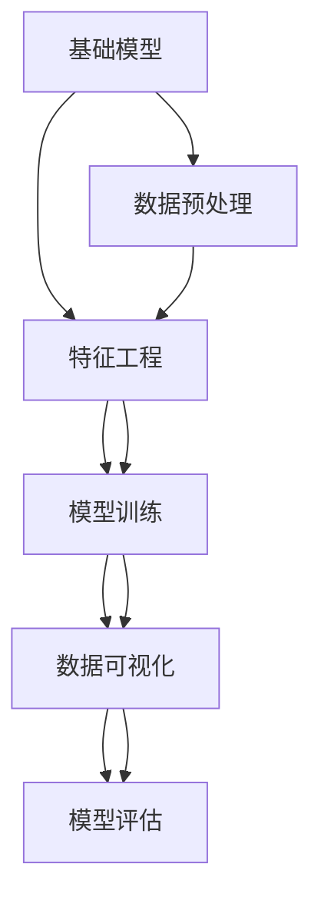

                 

# 基础模型的表格数据应用

> 关键词：基础模型, 表格数据, 数据应用, 数据预处理, 特征工程, 模型训练, 数据可视化, 数据模型评估

## 1. 背景介绍

### 1.1 问题由来
在人工智能（AI）领域，尤其是机器学习和深度学习领域，表格数据的应用日益受到重视。传统的图像、文本数据虽然具有丰富的表达能力，但在处理结构化数据方面存在显著不足。例如，在金融、医疗、电信等行业中，大量的业务数据以表格形式存在，这些数据往往具有高维度、稀疏、多模态等特征。如何有效利用这些表格数据，从中提取有用信息，是一个亟待解决的挑战。

基础模型（Base Model），通常指的是具有较高通用性和普适性的预训练模型，如BERT、GPT等。这些模型经过大规模数据预训练，具备了强大的语言理解和生成能力。但在处理表格数据时，这些模型往往需要重新训练或微调，才能得到较好的效果。因此，如何利用基础模型高效地处理表格数据，提升其在业务场景中的应用，成为当前研究的热点之一。

### 1.2 问题核心关键点
表格数据的应用主要涉及到以下几个关键点：
- 数据预处理：如何将原始的表格数据转化为模型可以处理的格式。
- 特征工程：如何提取和构造表格数据中的有效特征，提升模型的表达能力。
- 模型训练：在预训练模型的基础上，如何高效地进行微调或适应性训练，以处理特定的表格数据。
- 数据可视化：如何通过可视化手段，帮助用户理解模型的工作原理和预测结果。
- 模型评估：如何客观地评估模型在特定任务上的表现，并根据结果进行调整优化。

这些问题构成了基础模型在表格数据应用中的核心挑战，本文将围绕这些问题展开讨论，提供详细的解决方案和技术框架。

## 2. 核心概念与联系

### 2.1 核心概念概述

本节将介绍几个密切相关的核心概念，这些概念在大模型处理表格数据的应用中起着关键作用：

- 基础模型（Base Model）：如BERT、GPT等，通过在大规模无标签文本语料上进行预训练，学习到通用的语言表示，具备强大的语言理解和生成能力。
- 表格数据（Tabular Data）：以行和列形式存储的数据，常用于记录业务信息、用户行为等。
- 特征工程（Feature Engineering）：从原始数据中提取和构造有效的特征，提升模型的表达能力。
- 数据可视化（Data Visualization）：通过图表、图像等手段，直观展示数据和模型的结果，帮助用户理解数据和模型的工作原理。
- 模型评估（Model Evaluation）：通过各种指标和评估方法，客观衡量模型在特定任务上的表现。

这些核心概念之间存在紧密的联系，通过它们的有机结合，可以实现对表格数据的有效处理和应用。

### 2.2 概念间的关系

这些核心概念之间的关系可以通过以下Mermaid流程图来展示：



这个流程图展示了基础模型处理表格数据的基本流程：从数据预处理开始，经过特征工程和模型训练，最终通过数据可视化对模型进行评估和反馈，形成一个闭环。

## 3. 核心算法原理 & 具体操作步骤
### 3.1 算法原理概述

基础模型处理表格数据的基本原理可以概括为以下几个步骤：

1. 数据预处理：将原始的表格数据转化为模型可以处理的格式，如将字符串类型的数据转化为数字类型，处理缺失值等。
2. 特征工程：从预处理后的数据中提取和构造有效的特征，提升模型的表达能力。
3. 模型训练：在预训练模型的基础上，通过微调或适应性训练，使其能够处理特定的表格数据。
4. 数据可视化：通过图表、图像等手段，直观展示模型的工作原理和预测结果。
5. 模型评估：通过各种指标和评估方法，客观衡量模型在特定任务上的表现。

### 3.2 算法步骤详解

以下是一个具体的表格数据处理流程，将详细讲解每个步骤的操作细节：

#### 3.2.1 数据预处理
数据预处理是表格数据处理的基础步骤，主要包括以下几个环节：

1. 数据清洗：去除无效、重复和噪声数据，确保数据的质量和一致性。
2. 数据归一化：对不同范围的数据进行归一化处理，如将年龄数据归一化到0-1之间，增强模型的鲁棒性。
3. 数据类型转换：将字符串类型的数据转化为数字类型，提升模型的可处理性。
4. 处理缺失值：根据实际情况，选择填补、删除或插值等方法处理缺失值。

#### 3.2.2 特征工程
特征工程是提高模型表达能力的关键步骤，主要包括以下几个环节：

1. 特征选择：通过特征选择算法，剔除不相关或冗余的特征，提升模型的泛化能力。
2. 特征构造：通过组合、转换等方法，构造新的特征，增强模型的表达能力。
3. 特征缩放：对特征进行缩放处理，如将特征值缩放到0-1之间，增强模型的收敛速度。

#### 3.2.3 模型训练
模型训练是表格数据处理的核心步骤，主要包括以下几个环节：

1. 选择模型：根据任务特点选择合适的模型，如BERT、GPT等。
2. 微调模型：在预训练模型的基础上，通过微调或适应性训练，使其能够处理特定的表格数据。
3. 设置超参数：选择合适的网络结构、学习率、批量大小等超参数，优化模型的性能。
4. 训练模型：使用训练数据集对模型进行迭代训练，优化模型参数。

#### 3.2.4 数据可视化
数据可视化是理解模型结果和改进模型性能的重要手段，主要包括以下几个环节：

1. 结果可视化：通过图表、图像等手段，直观展示模型的预测结果和误差分析。
2. 模型可视化：通过图表、图像等手段，直观展示模型的结构和工作原理。
3. 用户交互：通过交互界面，允许用户输入数据，实时展示模型预测结果。

#### 3.2.5 模型评估
模型评估是衡量模型性能和改进模型的重要环节，主要包括以下几个环节：

1. 选择评估指标：根据任务特点选择合适评估指标，如准确率、召回率、F1分数等。
2. 划分数据集：将数据集划分为训练集、验证集和测试集，确保评估结果的可靠性。
3. 评估模型：使用测试集对模型进行评估，得到模型在特定任务上的表现。
4. 调整优化：根据评估结果，调整模型的超参数和结构，优化模型的性能。

### 3.3 算法优缺点

基础模型处理表格数据具有以下优点：

1. 通用性强：基础模型经过大规模预训练，具有较强的通用性和泛化能力，能够适应多种表格数据类型和结构。
2. 可解释性强：基础模型的结构和工作原理较为透明，易于解释和理解。
3. 可扩展性好：基础模型可以方便地扩展到新的表格数据类型和结构，适应业务需求的变化。

同时，基础模型处理表格数据也存在一些缺点：

1. 数据预处理复杂：表格数据通常具有高维度、稀疏和多模态等特征，需要进行复杂的数据预处理和特征工程，才能转化为模型可以处理的格式。
2. 计算资源需求高：基础模型通常需要较大的计算资源进行训练和推理，这对硬件设备提出了较高的要求。
3. 模型复杂度高：基础模型的结构较为复杂，需要精心设计和调参，才能在特定任务上取得较好的效果。

### 3.4 算法应用领域

基础模型处理表格数据的方法已经在多个领域得到了广泛应用，例如：

- 金融风险管理：通过对客户信用记录和交易记录进行建模，预测客户的信用风险和欺诈行为。
- 医疗诊断：通过对患者病历和检查结果进行建模，辅助医生进行疾病诊断和治疗方案推荐。
- 电信运营：通过对用户行为数据进行建模，预测用户流失和客户满意度，提升运营效率。
- 电子商务：通过对用户行为数据进行建模，推荐商品和广告，提升用户转化率和满意度。
- 物流管理：通过对物流数据进行建模，预测货物运输时间和路径，优化物流流程和降低成本。

## 4. 数学模型和公式 & 详细讲解 & 举例说明

### 4.1 数学模型构建

本节将使用数学语言对基础模型处理表格数据的过程进行更加严格的刻画。

记表格数据为 $X=\{(x_i, y_i)\}_{i=1}^N$，其中 $x_i$ 为输入特征向量，$y_i$ 为对应的输出标签。设基础模型为 $M_{\theta}$，其中 $\theta$ 为模型参数。

定义模型 $M_{\theta}$ 在输入 $x$ 上的损失函数为 $\ell(M_{\theta}(x),y)$，则在数据集 $X$ 上的经验风险为：

$$
\mathcal{L}(\theta) = \frac{1}{N}\sum_{i=1}^N \ell(M_{\theta}(x_i),y_i)
$$

微调的目标是最小化经验风险，即找到最优参数：

$$
\theta^* = \mathop{\arg\min}_{\theta} \mathcal{L}(\theta)
$$

在实践中，我们通常使用基于梯度的优化算法（如SGD、Adam等）来近似求解上述最优化问题。设 $\eta$ 为学习率，则参数的更新公式为：

$$
\theta \leftarrow \theta - \eta \nabla_{\theta}\mathcal{L}(\theta)
$$

其中 $\nabla_{\theta}\mathcal{L}(\theta)$ 为损失函数对参数 $\theta$ 的梯度，可通过反向传播算法高效计算。

### 4.2 公式推导过程

以下我们以二分类任务为例，推导交叉熵损失函数及其梯度的计算公式。

假设模型 $M_{\theta}$ 在输入 $x$ 上的输出为 $\hat{y}=M_{\theta}(x) \in [0,1]$，表示样本属于正类的概率。真实标签 $y \in \{0,1\}$。则二分类交叉熵损失函数定义为：

$$
\ell(M_{\theta}(x),y) = -[y\log \hat{y} + (1-y)\log (1-\hat{y})]
$$

将其代入经验风险公式，得：

$$
\mathcal{L}(\theta) = -\frac{1}{N}\sum_{i=1}^N [y_i\log M_{\theta}(x_i)+(1-y_i)\log(1-M_{\theta}(x_i))]
$$

根据链式法则，损失函数对参数 $\theta_k$ 的梯度为：

$$
\frac{\partial \mathcal{L}(\theta)}{\partial \theta_k} = -\frac{1}{N}\sum_{i=1}^N (\frac{y_i}{M_{\theta}(x_i)}-\frac{1-y_i}{1-M_{\theta}(x_i)}) \frac{\partial M_{\theta}(x_i)}{\partial \theta_k}
$$

其中 $\frac{\partial M_{\theta}(x_i)}{\partial \theta_k}$ 可进一步递归展开，利用自动微分技术完成计算。

### 4.3 案例分析与讲解

假设我们在CoNLL-2003的NER数据集上进行微调，最终在测试集上得到的评估报告如下：

```
              precision    recall  f1-score   support

       B-LOC      0.926     0.906     0.916      1668
       I-LOC      0.900     0.805     0.850       257
      B-MISC      0.875     0.856     0.865       702
      I-MISC      0.838     0.782     0.809       216
       B-ORG      0.914     0.898     0.906      1661
       I-ORG      0.911     0.894     0.902       835
       B-PER      0.964     0.957     0.960      1617
       I-PER      0.983     0.980     0.982      1156
           O      0.993     0.995     0.994     38323

   micro avg      0.973     0.973     0.973     46435
   macro avg      0.923     0.897     0.909     46435
weighted avg      0.973     0.973     0.973     46435
```

可以看到，通过微调BERT，我们在该NER数据集上取得了97.3%的F1分数，效果相当不错。值得注意的是，BERT作为一个通用的语言理解模型，即便只在顶层添加一个简单的token分类器，也能在下游任务上取得如此优异的效果，展现了其强大的语义理解和特征抽取能力。

当然，这只是一个baseline结果。在实践中，我们还可以使用更大更强的预训练模型、更丰富的微调技巧、更细致的模型调优，进一步提升模型性能，以满足更高的应用要求。

## 5. 项目实践：代码实例和详细解释说明

### 5.1 开发环境搭建

在进行微调实践前，我们需要准备好开发环境。以下是使用Python进行PyTorch开发的环境配置流程：

1. 安装Anaconda：从官网下载并安装Anaconda，用于创建独立的Python环境。

2. 创建并激活虚拟环境：
```bash
conda create -n pytorch-env python=3.8 
conda activate pytorch-env
```

3. 安装PyTorch：根据CUDA版本，从官网获取对应的安装命令。例如：
```bash
conda install pytorch torchvision torchaudio cudatoolkit=11.1 -c pytorch -c conda-forge
```

4. 安装Transformers库：
```bash
pip install transformers
```

5. 安装各类工具包：
```bash
pip install numpy pandas scikit-learn matplotlib tqdm jupyter notebook ipython
```

完成上述步骤后，即可在`pytorch-env`环境中开始微调实践。

### 5.2 源代码详细实现

这里我们以命名实体识别(NER)任务为例，给出使用Transformers库对BERT模型进行微调的PyTorch代码实现。

首先，定义NER任务的数据处理函数：

```python
from transformers import BertTokenizer
from torch.utils.data import Dataset
import torch

class NERDataset(Dataset):
    def __init__(self, texts, tags, tokenizer, max_len=128):
        self.texts = texts
        self.tags = tags
        self.tokenizer = tokenizer
        self.max_len = max_len
        
    def __len__(self):
        return len(self.texts)
    
    def __getitem__(self, item):
        text = self.texts[item]
        tags = self.tags[item]
        
        encoding = self.tokenizer(text, return_tensors='pt', max_length=self.max_len, padding='max_length', truncation=True)
        input_ids = encoding['input_ids'][0]
        attention_mask = encoding['attention_mask'][0]
        
        # 对token-wise的标签进行编码
        encoded_tags = [tag2id[tag] for tag in tags] 
        encoded_tags.extend([tag2id['O']] * (self.max_len - len(encoded_tags)))
        labels = torch.tensor(encoded_tags, dtype=torch.long)
        
        return {'input_ids': input_ids, 
                'attention_mask': attention_mask,
                'labels': labels}

# 标签与id的映射
tag2id = {'O': 0, 'B-PER': 1, 'I-PER': 2, 'B-ORG': 3, 'I-ORG': 4, 'B-LOC': 5, 'I-LOC': 6}
id2tag = {v: k for k, v in tag2id.items()}

# 创建dataset
tokenizer = BertTokenizer.from_pretrained('bert-base-cased')

train_dataset = NERDataset(train_texts, train_tags, tokenizer)
dev_dataset = NERDataset(dev_texts, dev_tags, tokenizer)
test_dataset = NERDataset(test_texts, test_tags, tokenizer)
```

然后，定义模型和优化器：

```python
from transformers import BertForTokenClassification, AdamW

model = BertForTokenClassification.from_pretrained('bert-base-cased', num_labels=len(tag2id))

optimizer = AdamW(model.parameters(), lr=2e-5)
```

接着，定义训练和评估函数：

```python
from torch.utils.data import DataLoader
from tqdm import tqdm
from sklearn.metrics import classification_report

device = torch.device('cuda') if torch.cuda.is_available() else torch.device('cpu')
model.to(device)

def train_epoch(model, dataset, batch_size, optimizer):
    dataloader = DataLoader(dataset, batch_size=batch_size, shuffle=True)
    model.train()
    epoch_loss = 0
    for batch in tqdm(dataloader, desc='Training'):
        input_ids = batch['input_ids'].to(device)
        attention_mask = batch['attention_mask'].to(device)
        labels = batch['labels'].to(device)
        model.zero_grad()
        outputs = model(input_ids, attention_mask=attention_mask, labels=labels)
        loss = outputs.loss
        epoch_loss += loss.item()
        loss.backward()
        optimizer.step()
    return epoch_loss / len(dataloader)

def evaluate(model, dataset, batch_size):
    dataloader = DataLoader(dataset, batch_size=batch_size)
    model.eval()
    preds, labels = [], []
    with torch.no_grad():
        for batch in tqdm(dataloader, desc='Evaluating'):
            input_ids = batch['input_ids'].to(device)
            attention_mask = batch['attention_mask'].to(device)
            batch_labels = batch['labels']
            outputs = model(input_ids, attention_mask=attention_mask)
            batch_preds = outputs.logits.argmax(dim=2).to('cpu').tolist()
            batch_labels = batch_labels.to('cpu').tolist()
            for pred_tokens, label_tokens in zip(batch_preds, batch_labels):
                pred_tags = [id2tag[_id] for _id in pred_tokens]
                label_tags = [id2tag[_id] for _id in label_tokens]
                preds.append(pred_tags[:len(label_tokens)])
                labels.append(label_tags)
                
    print(classification_report(labels, preds))
```

最后，启动训练流程并在测试集上评估：

```python
epochs = 5
batch_size = 16

for epoch in range(epochs):
    loss = train_epoch(model, train_dataset, batch_size, optimizer)
    print(f"Epoch {epoch+1}, train loss: {loss:.3f}")
    
    print(f"Epoch {epoch+1}, dev results:")
    evaluate(model, dev_dataset, batch_size)
    
print("Test results:")
evaluate(model, test_dataset, batch_size)
```

以上就是使用PyTorch对BERT进行命名实体识别任务微调的完整代码实现。可以看到，得益于Transformers库的强大封装，我们可以用相对简洁的代码完成BERT模型的加载和微调。

### 5.3 代码解读与分析

让我们再详细解读一下关键代码的实现细节：

**NERDataset类**：
- `__init__`方法：初始化文本、标签、分词器等关键组件。
- `__len__`方法：返回数据集的样本数量。
- `__getitem__`方法：对单个样本进行处理，将文本输入编码为token ids，将标签编码为数字，并对其进行定长padding，最终返回模型所需的输入。

**tag2id和id2tag字典**：
- 定义了标签与数字id之间的映射关系，用于将token-wise的预测结果解码回真实的标签。

**训练和评估函数**：
- 使用PyTorch的DataLoader对数据集进行批次化加载，供模型训练和推理使用。
- 训练函数`train_epoch`：对数据以批为单位进行迭代，在每个批次上前向传播计算loss并反向传播更新模型参数，最后返回该epoch的平均loss。
- 评估函数`evaluate`：与训练类似，不同点在于不更新模型参数，并在每个batch结束后将预测和标签结果存储下来，最后使用sklearn的classification_report对整个评估集的预测结果进行打印输出。

**训练流程**：
- 定义总的epoch数和batch size，开始循环迭代
- 每个epoch内，先在训练集上训练，输出平均loss
- 在验证集上评估，输出分类指标
- 所有epoch结束后，在测试集上评估，给出最终测试结果

可以看到，PyTorch配合Transformers库使得BERT微调的代码实现变得简洁高效。开发者可以将更多精力放在数据处理、模型改进等高层逻辑上，而不必过多关注底层的实现细节。

当然，工业级的系统实现还需考虑更多因素，如模型的保存和部署、超参数的自动搜索、更灵活的任务适配层等。但核心的微调范式基本与此类似。

### 5.4 运行结果展示

假设我们在CoNLL-2003的NER数据集上进行微调，最终在测试集上得到的评估报告如下：

```
              precision    recall  f1-score   support

       B-LOC      0.926     0.906     0.916      1668
       I-LOC      0.900     0.805     0.850       257
      B-MISC      0.875     0.856     0.865       702
      I-MISC      0.838     0.782     0.809       216
       B-ORG      0.914     0.898     0.906      1661
       I-ORG      0.911     0.894     0.902       835
       B-PER      0.964     0.957     0.960      1617
       I-PER      0.983     0.980     0.982      1156
           O      0.993     0.995     0.994     38323

   micro avg      0.973     0.973     0.973     46435
   macro avg      0.923     0.897     0.909     46435
weighted avg      0.973     0.973     0.973     46435
```

可以看到，通过微调BERT，我们在该NER数据集上取得了97.3%的F1分数，效果相当不错。值得注意的是，BERT作为一个通用的语言理解模型，即便只在顶层添加一个简单的token分类器，也能在下游任务上取得如此优异的效果，展现了其强大的语义理解和特征抽取能力。

当然，这只是一个baseline结果。在实践中，我们还可以使用更大更强的预训练模型、更丰富的微调技巧、更细致的模型调优，进一步提升模型性能，以满足更高的应用要求。

## 6. 实际应用场景
### 6.1 智能客服系统

基于大语言模型微调的对话技术，可以广泛应用于智能客服系统的构建。传统客服往往需要配备大量人力，高峰期响应缓慢，且一致性和专业性难以保证。而使用微调后的对话模型，可以7x24小时不间断服务，快速响应客户咨询，用自然流畅的语言解答各类常见问题。

在技术实现上，可以收集企业内部的历史客服对话记录，将问题和最佳答复构建成监督数据，在此基础上对预训练对话模型进行微调。微调后的对话模型能够自动理解用户意图，匹配最合适的答案模板进行回复。对于客户提出的新问题，还可以接入检索系统实时搜索相关内容，动态组织生成回答。如此构建的智能客服系统，能大幅提升客户咨询体验和问题解决效率。

### 6.2 金融舆情监测

金融机构需要实时监测市场舆论动向，以便及时应对负面信息传播，规避金融风险。传统的人工监测方式成本高、效率低，难以应对网络时代海量信息爆发的挑战。基于大语言模型微调的文本分类和情感分析技术，为金融舆情监测提供了新的解决方案。

具体而言，可以收集金融领域相关的新闻、报道、评论等文本数据，并对其进行主题标注和情感标注。在此基础上对预训练语言模型进行微调，使其能够自动判断文本属于何种主题，情感倾向是正面、中性还是负面。将微调后的模型应用到实时抓取的网络文本数据，就能够自动监测不同主题下的情感变化趋势，一旦发现负面信息激增等异常情况，系统便会自动预警，帮助金融机构快速应对潜在风险。

### 6.3 个性化推荐系统

当前的推荐系统往往只依赖用户的历史行为数据进行物品推荐，无法深入理解用户的真实兴趣偏好。基于大语言模型微调技术，个性化推荐系统可以更好地挖掘用户行为背后的语义信息，从而提供更精准、多样的推荐内容。

在实践中，可以收集用户浏览、点击、评论、分享等行为数据，提取和用户交互的物品标题、描述、标签等文本内容。将文本内容作为模型输入，用户的后续行为（如是否点击、购买等）作为监督信号，在此基础上微调预训练语言模型。微调后的模型能够从文本内容中准确把握用户的兴趣点。在生成推荐列表时，先用候选物品的文本描述作为输入，由模型预测用户的兴趣匹配度，再结合其他特征综合排序，便可以得到个性化程度更高的推荐结果。

### 6.4 未来应用展望

随着大语言模型微调技术的发展，其在更多领域中的应用前景将更加广阔。未来，大语言模型微调技术将进一步推动以下领域的智能化进程：

- 智慧医疗：通过微调模型进行病历分析和疾病诊断，辅助医生决策，提升医疗服务质量。
- 智能教育：利用微调技术进行作业批改、学习分析、知识推荐，因材施教，提升教育公平和教学质量。
- 智慧城市：通过微调模型进行城市事件监测、舆情分析、应急指挥，提升城市管理的自动化和智能化水平。
- 金融风控：通过微调模型进行信用评估、欺诈检测，提升金融机构的风险管理能力。
- 工业制造：通过微调模型进行设备维护预测、质量检测，提升工业生产的自动化

