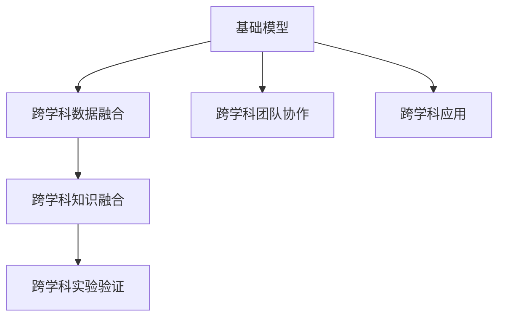
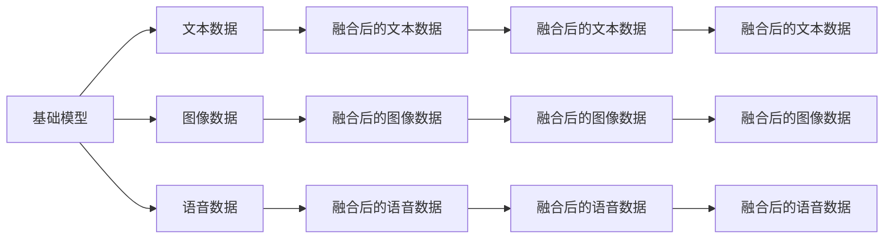
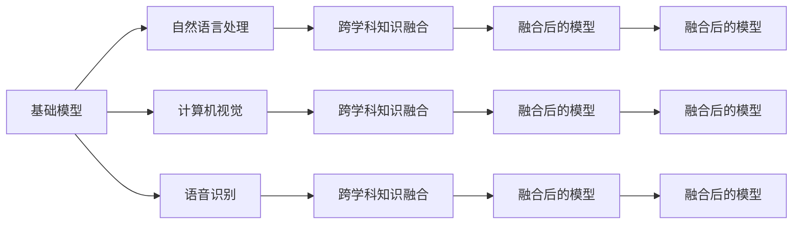

                 

# 基础模型的跨学科合作与研究

## 1. 背景介绍

### 1.1 问题由来

近年来，人工智能（AI）技术迅速发展，尤其是在基础模型研究方面取得了显著进展。然而，这些基础模型的设计和优化通常聚焦于单一学科，如自然语言处理（NLP）、计算机视觉（CV）或语音识别（ASR），未能充分考虑跨学科的合作与交流。这种单一学科的视角限制了基础模型在不同应用场景中的有效性和泛化能力，无法充分发挥其在解决复杂跨学科问题上的潜力。

### 1.2 问题核心关键点

基础模型跨学科合作与研究的核心关键点在于如何整合不同学科的知识和方法，构建通用的模型框架，以及如何设计有效的合作机制，以促进跨学科的交流与创新。具体来说，主要涉及以下几个方面：

1. **跨学科数据融合**：不同学科的数据来源和特性各异，如何将这些异构数据融合到一起，构建统一的输入表示，是跨学科研究的首要问题。
2. **跨学科知识融合**：不同学科的知识体系和研究范式存在差异，如何将这些知识有效地整合到模型中，提升模型的解释性和鲁棒性。
3. **跨学科实验验证**：不同学科的实验验证环境和标准不同，如何在统一的实验平台上验证跨学科模型的性能。
4. **跨学科团队协作**：不同学科的专家在数据获取、模型设计、实验验证等方面存在差异，如何组织跨学科团队进行高效协作。

### 1.3 问题研究意义

基础模型的跨学科合作与研究，对于推动人工智能技术的发展和应用具有重要意义：

1. **提升模型泛化能力**：跨学科知识和方法的融合可以提升模型在不同场景下的泛化能力，使其能够更好地应对复杂的现实问题。
2. **加速技术创新**：跨学科的合作可以带来新的研究视角和方法，加速人工智能技术的创新和发展。
3. **优化资源配置**：跨学科合作可以优化资源的配置和利用，提高研究效率和产出。
4. **推动应用落地**：跨学科合作可以加速技术的产业化进程，推动其在更多领域的应用落地。

## 2. 核心概念与联系

### 2.1 核心概念概述

为更好地理解基础模型的跨学科合作与研究，本节将介绍几个密切相关的核心概念：

- **基础模型**：在特定领域内具有广泛通用性的模型，如BERT、GPT、ResNet等，它们在各自领域内表现出优异的性能，但在跨学科应用中可能需要进一步优化。
- **跨学科数据融合**：将不同学科的数据（如文本、图像、语音）融合到一个统一的表示空间中，以便在跨学科任务中使用。
- **跨学科知识融合**：将不同学科的知识体系和理论方法整合到模型中，提升模型的解释性和鲁棒性。
- **跨学科实验验证**：在统一的实验平台上，对跨学科模型进行验证，确保其在不同学科的应用中表现稳定。
- **跨学科团队协作**：不同学科的专家共同参与项目，共享资源和知识，协同解决问题。

这些核心概念之间的逻辑关系可以通过以下Mermaid流程图来展示：



这个流程图展示了大语言模型跨学科合作与研究的核心概念及其之间的关系：

1. 基础模型通过跨学科数据融合和知识融合，得到适合跨学科应用的模型。
2. 跨学科实验验证确保模型在不同学科应用中的表现稳定。
3. 跨学科团队协作实现知识共享和协同创新。

### 2.2 概念间的关系

这些核心概念之间存在着紧密的联系，形成了基础模型跨学科研究的基本框架。下面我们通过几个Mermaid流程图来展示这些概念之间的关系。

#### 2.2.1 基础模型与跨学科数据融合的关系



这个流程图展示了基础模型与跨学科数据融合的基本过程。不同学科的数据通过融合，得到统一的基础数据输入。

#### 2.2.2 跨学科知识融合与基础模型的关系



这个流程图展示了跨学科知识融合与基础模型的关系。不同学科的知识通过融合，得到更加强大和通用的模型。

#### 2.2.3 跨学科团队协作与基础模型的关系

```mermaid
graph TB
    A[自然语言处理专家] --> B[计算机视觉专家]
    B --> C[语音识别专家]
    C --> D[其他学科专家]
    A --> E[基础模型]
    B --> F[跨学科团队]
    C --> G[跨学科团队]
    D --> H[跨学科团队]
    E --> I[基础模型]
    F --> J[跨学科团队协作]
    G --> K[跨学科团队协作]
    H --> L[跨学科团队协作]
    I --> M[基础模型]
    J --> N[跨学科团队协作]
    K --> O[跨学科团队协作]
    L --> P[跨学科团队协作]
    M --> Q[跨学科团队协作]
    N --> R[跨学科团队协作]
    O --> S[跨学科团队协作]
    P --> T[跨学科团队协作]
    Q --> U[跨学科团队协作]
    R --> V[跨学科团队协作]
    S --> W[跨学科团队协作]
    T --> X[跨学科团队协作]
    U --> Y[跨学科团队协作]
    V --> Z[跨学科团队协作]
    W --> AA[跨学科团队协作]
    X --> AB[跨学科团队协作]
    Y --> AC[跨学科团队协作]
    Z --> AD[跨学科团队协作]
    AA --> AE[跨学科团队协作]
    AB --> AF[跨学科团队协作]
    AC --> AG[跨学科团队协作]
    AD --> AH[跨学科团队协作]
    AE --> AI[跨学科团队协作]
    AF --> AJ[跨学科团队协作]
    AG --> AK[跨学科团队协作]
    AH --> AL[跨学科团队协作]
    AI --> AM[跨学科团队协作]
    AJ --> AN[跨学科团队协作]
    AK --> AO[跨学科团队协作]
    AL --> AP[跨学科团队协作]
    AM --> AQ[跨学科团队协作]
    AN --> AR[跨学科团队协作]
    AO --> AS[跨学科团队协作]
    AP --> AT[跨学科团队协作]
    AQ --> AU[跨学科团队协作]
    AR --> AV[跨学科团队协作]
    AS --> AW[跨学科团队协作]
    AT --> AX[跨学科团队协作]
    AU --> AY[跨学科团队协作]
    AV --> AZ[跨学科团队协作]
    AW --> BA[跨学科团队协作]
    AX --> BB[跨学科团队协作]
    AY --> BC[跨学科团队协作]
    AZ --> BD[跨学科团队协作]
    BA --> BE[跨学科团队协作]
    BB --> BF[跨学科团队协作]
    BC --> BG[跨学科团队协作]
    BD --> BH[跨学科团队协作]
    BE --> BI[跨学科团队协作]
    BF --> BJ[跨学科团队协作]
    BG --> BK[跨学科团队协作]
    BH --> BL[跨学科团队协作]
    BI --> BM[跨学科团队协作]
    BJ --> BN[跨学科团队协作]
    BK --> BO[跨学科团队协作]
    BL --> BP[跨学科团队协作]
    BM --> BQ[跨学科团队协作]
    BN --> BR[跨学科团队协作]
    BO --> BS[跨学科团队协作]
    BP --> BT[跨学科团队协作]
    BQ --> BU[跨学科团队协作]
    BR --> BV[跨学科团队协作]
    BS --> BW[跨学科团队协作]
    BT --> BX[跨学科团队协作]
    BU --> BY[跨学科团队协作]
    BV --> BZ[跨学科团队协作]
    BW --> CA[跨学科团队协作]
    BX --> CB[跨学科团队协作]
    BY --> CC[跨学科团队协作]
    BZ --> CD[跨学科团队协作]
    CA --> CE[跨学科团队协作]
    CB --> CF[跨学科团队协作]
    CC --> CG[跨学科团队协作]
    CD --> CH[跨学科团队协作]
    CE --> CI[跨学科团队协作]
    CF --> CJ[跨学科团队协作]
    CG --> CK[跨学科团队协作]
    CH --> CL[跨学科团队协作]
    CI --> CM[跨学科团队协作]
    CJ --> CN[跨学科团队协作]
    CK --> CO[跨学科团队协作]
    CL --> CP[跨学科团队协作]
    CM --> CQ[跨学科团队协作]
    CN --> CR[跨学科团队协作]
    CO --> CS[跨学科团队协作]
    CP --> CT[跨学科团队协作]
    CQ --> CU[跨学科团队协作]
    CR --> CV[跨学科团队协作]
    CS --> CW[跨学科团队协作]
    CT --> CX[跨学科团队协作]
    CU --> CY[跨学科团队协作]
    CV --> CZ[跨学科团队协作]
    CW --> DA[跨学科团队协作]
    CX --> DB[跨学科团队协作]
    CY --> DC[跨学科团队协作]
    CZ --> DD[跨学科团队协作]
    DA --> DE[跨学科团队协作]
    DB --> DF[跨学科团队协作]
    DC --> DG[跨学科团队协作]
    DD --> DH[跨学科团队协作]
    DE --> DI[跨学科团队协作]
    DF --> DJ[跨学科团队协作]
    DG --> DK[跨学科团队协作]
    DH --> DL[跨学科团队协作]
    DI --> DM[跨学科团队协作]
    DJ --> DN[跨学科团队协作]
    DK --> DO[跨学科团队协作]
    DL --> DP[跨学科团队协作]
    DM --> DQ[跨学科团队协作]
    DN --> DR[跨学科团队协作]
    DO --> DS[跨学科团队协作]
    DP --> DT[跨学科团队协作]
    DQ --> DU[跨学科团队协作]
    DR --> DV[跨学科团队协作]
    DS --> DW[跨学科团队协作]
    DT --> DX[跨学科团队协作]
    DU --> DY[跨学科团队协作]
    DV --> DZ[跨学科团队协作]
    DW --> EA[跨学科团队协作]
    DX --> EB[跨学科团队协作]
    DY --> EC[跨学科团队协作]
    DZ --> ED[跨学科团队协作]
    EA --> EE[跨学科团队协作]
    EB --> EF[跨学科团队协作]
    EC --> EG[跨学科团队协作]
    ED --> EH[跨学科团队协作]
    EE --> EI[跨学科团队协作]
    EF --> EJ[跨学科团队协作]
    EG --> EK[跨学科团队协作]
    EH --> EL[跨学科团队协作]
    EI --> EM[跨学科团队协作]
    EJ --> EN[跨学科团队协作]
    EK --> EO[跨学科团队协作]
    EL --> EP[跨学科团队协作]
    EM --> EQ[跨学科团队协作]
    EN --> ER[跨学科团队协作]
    EO --> ES[跨学科团队协作]
    EP --> ET[跨学科团队协作]
    EQ --> EU[跨学科团队协作]
    ER --> EV[跨学科团队协作]
    ES --> EW[跨学科团队协作]
    ET --> EX[跨学科团队协作]
    EU --> EY[跨学科团队协作]
    EV --> EZ[跨学科团队协作]
    EW --> FA[跨学科团队协作]
    EX --> FB[跨学科团队协作]
    EY --> FC[跨学科团队协作]
    EZ --> FD[跨学科团队协作]
    FA --> FE[跨学科团队协作]
    FB --> FF[跨学科团队协作]
    FC --> FG[跨学科团队协作]
    FD --> FH[跨学科团队协作]
    FE --> FI[跨学科团队协作]
    FF --> FJ[跨学科团队协作]
    FG --> FK[跨学科团队协作]
    FH --> FL[跨学科团队协作]
    FI --> FM[跨学科团队协作]
    FJ --> FN[跨学科团队协作]
    FK --> FO[跨学科团队协作]
    FL --> FP[跨学科团队协作]
    FM --> FQ[跨学科团队协作]
    FN --> FR[跨学科团队协作]
    FO --> FS[跨学科团队协作]
    FP --> FT[跨学科团队协作]
    FQ --> FU[跨学科团队协作]
    FR --> FV[跨学科团队协作]
    FS --> FW[跨学科团队协作]
    FT --> FX[跨学科团队协作]
    FU --> FY[跨学科团队协作]
    FV --> FZ[跨学科团队协作]
    FW --> GA[跨学科团队协作]
    FX --> GB[跨学科团队协作]
    FY --> GC[跨学科团队协作]
    FZ --> GD[跨学科团队协作]
    GA --> GE[跨学科团队协作]
    GB --> GF[跨学科团队协作]
    GC --> GG[跨学科团队协作]
    GD --> GH[跨学科团队协作]
    GE --> GI[跨学科团队协作]
    GF --> GJ[跨学科团队协作]
    GG --> GK[跨学科团队协作]
    GH --> GL[跨学科团队协作]
    GI --> GM[跨学科团队协作]
    GJ --> GN[跨学科团队协作]
    GK --> GO[跨学科团队协作]
    GL --> GP[跨学科团队协作]
    GM --> GQ[跨学科团队协作]
    GN --> GR[跨学科团队协作]
    GO --> GS[跨学科团队协作]
    GP --> GT[跨学科团队协作]
    GQ --> GU[跨学科团队协作]
    GR --> GV[跨学科团队协作]
    GS --> GW[跨学科团队协作]
    GT --> GX[跨学科团队协作]
    GU --> GY[跨学科团队协作]
    GV --> GZ[跨学科团队协作]
    GW --> HA[跨学科团队协作]
    GX --> HB[跨学科团队协作]
    GY --> HC[跨学科团队协作]
    GZ --> HD[跨学科团队协作]
    HA --> HE[跨学科团队协作]
    HB --> HF[跨学科团队协作]
    HC --> HG[跨学科团队协作]
    HD --> HH[跨学科团队协作]
    HE --> HI[跨学科团队协作]
    HF --> HJ[跨学科团队协作]
    HG --> HK[跨学科团队协作]
    HH --> HL[跨学科团队协作]
    HI --> HM[跨学科团队协作]
    HJ --> HN[跨学科团队协作]
    HK --> HO[跨学科团队协作]
    HL --> HP[跨学科团队协作]
    HM --> HQ[跨学科团队协作]
    HN --> HR[跨学科团队协作]
    HO --> HS[跨学科团队协作]
    HP --> HT[跨学科团队协作]
    HQ --> HU[跨学科团队协作]
    HR --> HV[跨学科团队协作]
    HS --> HW[跨学科团队协作]
    HT --> HX[跨学科团队协作]
    HU --> HY[跨学科团队协作]
    HV --> HZ[跨学科团队协作]
    HW --> IA[跨学科团队协作]
    HX --> IB[跨学科团队协作]
    HY --> IC[跨学科团队协作]
    HZ --> ID[跨学科团队协作]
    IA --> IE[跨学科团队协作]
    IB --> IF[跨学科团队协作]
    IC --> IG[跨学科团队协作]
    ID --> IH[跨学科团队协作]
    IE --> II[跨学科团队协作]
    IF --> IJ[跨学科团队协作]
    IG --> IK[跨学科团队协作]
    IH --> IL[跨学科团队协作]
    II --> IM[跨学科团队协作]
    IJ --> IN[跨学科团队协作]
    IK --> IO[跨学科团队协作]
    IL --> IP[跨学科团队协作]
    IM --> IQ[跨学科团队协作]
    IN --> IR[跨学科团队协作]
    IO --> IS[跨学科团队协作]
    IP --> IT[跨学科团队协作]
    IQ --> IU[跨学科团队协作]
    IR --> IV[跨学科团队协作]
    IS --> IW[跨学科团队协作]
    IT --> IX[跨学科团队协作]
    IU --> IY[跨学科团队协作]
    IV --> IZ[跨学科团队协作]
    IW --> JA[跨学科团队协作]
    IX --> JB[跨学科团队协作]
    IY --> JC[跨学科团队协作]
    IZ --> JD[跨学科团队协作]
    JA -->JE[跨学科团队协作]
    JB --> JF[跨学科团队协作]
    JC --> JG[跨学科团队协作]
    JD --> JH[跨学科团队协作]
    JE -->JI[跨学科团队协作]
    JF --> JJ[跨学科团队协作]
    JG --> JK[跨学科团队协作]
    JH --> JL[跨学科团队协作]
    JI --> JM[跨学科团队协作]
    JJ --> JN[跨学科团队协作]
    JK --> JO[跨学科团队协作]
    JL --> JP[跨学科团队协作]
    JM --> JQ[跨学科团队协作]
    JN --> JR[跨学科团队协作]
    JO --> JS[跨学科团队协作]
    JP --> JT[跨学科团队协作]
    JQ --> JU[跨学科团队协作]
    JR --> JV[跨学科团队协作]
    JS --> JW[跨学科团队协作]
    JT --> JX[跨学科团队协作]
    JU --> JY[跨学科团队协作]
    JV --> JZ[跨学科团队协作]
    JW --> KA[跨学科团队协作]
    JX --> KB[跨学科团队协作]
    JY --> KC[跨学科团队协作]
    JZ --> KD[跨学科团队协作]
    KA --> KE[跨学科团队协作]
    KB --> KF[跨学科团队协作]
    KC --> KG[跨学科团队协作]
    KD --> KH[跨学科团队协作]
    KE --> KI[跨学科团队协作]
    KF --> KJ[跨学科团队协作]
    KG --> KK[跨学科团队协作]
    KH --> KL[跨学科团队协作]
    KI --> KM[跨学科团队协作]
    KJ --> KN[跨学科团队协作]
    KK --> KO[跨学科团队协作]
    KL --> KP[跨学科团队协作]
    KM --> KQ[跨学科团队协作]
    KN --> KR[跨学科团队协作]
    KO --> KS[跨学科团队协作]
    KP --> KT[跨学科团队协作]
    KQ --> KU[跨学科团队协作]
    KR --> KV[跨学科团队协作]
    KS --> KW[跨学科团队协作]
    KT --> KX[跨学科团队协作]
    KU --> KY[跨学科团队协作]
    KV --> KZ[跨学科团队协作]
    KW --> LA[跨学科团队协作]
    KX --> LB[跨学科团队协作]
    KY --> LC[跨学科团队协作]
    KZ --> LD[跨学科团队协作]
    LA --> LE[跨学科团队协作]
    LB --> LF[跨学科团队协作]
    LC --> LG[跨学科团队协作]
    LD --> LH[跨学科团队协作]
    LE --> LI[跨学科团队协作]
    LF --> LJ[跨学科团队协作]
    LG --> LK[跨学科团队协作]
    LH --> LL[跨学科团队协作]
    LI --> LM[跨学科团队协作]
    LJ --> LN[跨学科团队协作]
    LK --> LO[跨学科团队协作]
    LL --> LP[跨学科团队协作]
    LM --> LQ[跨学科团队协作]
    LN --> LR[跨学科团队协作]
    LO --> LS[跨学科团队协作]
    LP --> LT[跨学科团队协作]
    LQ --> LU[跨学科团队协作]
    LR --> LV[跨学科团队协作]
    LS --> LW[跨学科团队协作]
    LT --> LX[跨学科团队协作]
    LU --> LY[跨学科团队协作]
    LV --> LZ[跨学科团队协作]
    LW --> MA[跨学科团队协作]
    LX --> MB[跨学科团队协作]
    LY --> MC[跨学科团队协作]
    LZ --> MD[跨学科团队协作]
    MA --> ME[跨学科团队协作]
    MB --> MF[跨学科团队协作]
    MC --> MG[跨学科团队协作]
    MD --> MH[跨学科团队协作]
    ME --> MI[跨学科团队协作]
    MF --> MJ[跨学科团队协作]
    MG --> MK[跨学科团队协作]
    MH --> ML[跨学科团队协作]
    MI --> MM[跨学科团队协作]
    MJ --> MN[跨学科团队协作]
    MK --> MO[跨学科团队协作]
    ML --> MP[跨学科团队协作]
    MM --> MQ[跨学科团队协作]
    MN --> MR[跨学科团队协作]
    MO --> MS[跨学科团队协作]
    MP --> MT[跨学科团队协作]
    MQ --> MU[跨学科团队协作]
    MR --> MV[跨学科团队协作]
    MS --> MW[跨学科团队协作]
    MT --> MX[跨学科团队协作]
    MU --> MY[跨学科团队协作]
    MV --> MZ[跨学科团队协作]
    MW --> NA[跨学科团队协作]
    MX --> NB[跨学科团队协作]
    MY --> NC[跨学科团队协作]
    MZ --> ND[跨学科团队协作]
    NA --> NE[跨学科团队协作]
    NB --> NF[跨学科团队协作]
    NC --> NG[跨学科团队协作]
    ND --> NH[跨学科团队协作]
    NE --> NI[跨学科团队协作]
    NF --> NJ[跨学科团队协作]
    NG --> NK[跨学科团队协作]
    NH --> NL[跨学科团队协作]
    NI --> NM[跨学科团队协作]
    NJ --> NN[跨学科团队协作]
    NK --> NO[跨学科团队协作]
    NL --> NP[跨学科团队协作]
    NM --> NQ[跨学科团队协作]
    NN --> NR[跨学科团队协作]
    NO --> NS[跨学科团队协作]
    NP --> NT[跨学科团队协作]
    NQ --> NU[跨学科团队协作]
    NR --> NV[跨学科团队协作]
    NS --> NW[跨学科团队协作]
    NT --> NX[跨学科团队协作]
    NU --> NY[跨学科团队协作]
    NV --> NZ[跨学科团队协作]
    NW --> OA[跨学科团队协作]
    NX --> OB[跨学科团队协作]
    NY --> OC[跨学科团队协作]
    NZ --> OD[跨学科团队协作]
    OA --> OE[跨学科团队协作]
    OB --> OF[跨学科团队协作]
    OC --> OG[跨学科团队协作]
    OD --> OH[跨学科团队协作]
    OE --> OI[跨学科团队协作]
    OF --> OJ[跨学科团队协作]
    OG --> OK[跨学科团队协作]
    OH --> OL[跨学科团队协作]
    OI --> OM[跨学科团队协作]
    OJ --> ON[跨学科团队协作]
    OK --> OO[跨学科团队协作]
    OL --> OP[跨学科团队协作]
    OM --> OQ[跨学科团队协作]
    ON --> OR[跨学科团队协作]
    OO --> OS[跨学科团队协作]
    OP --> OT[跨学科团队协作]
    OQ --> OU[跨学科团队协作]
    OR -->OV[跨学科团队协作]
    OS --> OW[跨学科团队协作]
    OT --> OX[跨学科团队协作]
    OU --> OY[跨学科团队协作]
    OV --> OZ[跨学科团队协作]
    OW --> PA[跨学科团队协作]
    OX --> PB[跨学科团队协作]
    OY --> PC[跨学科团队协作]
    OZ --> PD[跨学科团队协作]
    PA --> PE[跨学科团队协作]
    PB --> PF[跨学科团队协作]
    PC --> PG[跨学科团队协作]
    PD --> PH[跨学科团队协作]
    PE --> PI[跨学科团队协作]
    PF --> PJ[跨学科团队协作]
    PG --> PK[跨学科团队协作]
    PH --> PL[跨学科团队协作]
    PI --> PM[跨学科团队协作]
    PJ --> PN[跨学科团队协作]
    PK --> PO[跨学科团队协作]
    PL --> PP[跨学科团队协作]
    PM --> PQ[跨学科团队协作]
    PN --> PR[跨学科团队协作]
    PO --> PS[跨学科团队协作]
    PP --> PT[跨学科团队协作]
    PQ --> PU[跨学科团队协作]
    PR --> PV[跨学科团队协作]
    PS --> PW[跨学科团队协作]
    PT --> PX[跨学科团队协作]
    PU --> PY[跨学科团队协作]
    PV --> PZ[跨学科团队协作]
    PW --> QA[跨学科团队协作]
    PX --> QB[跨学科团队协作]
    PY --> QC[跨学科团队

