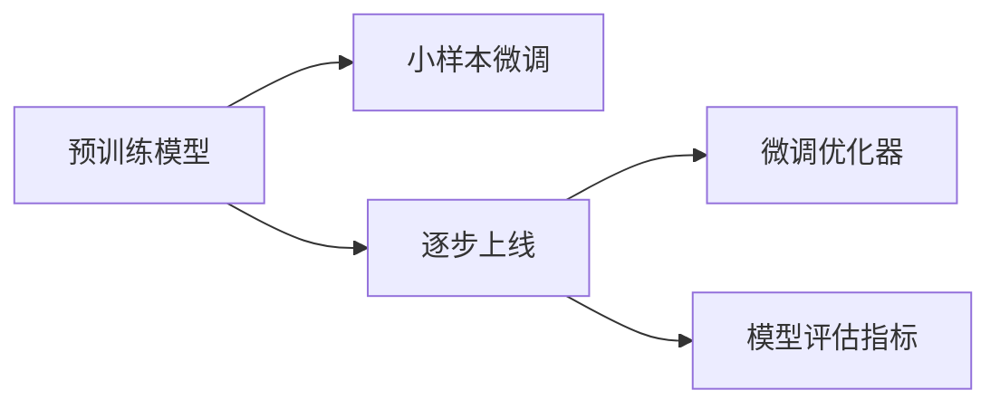
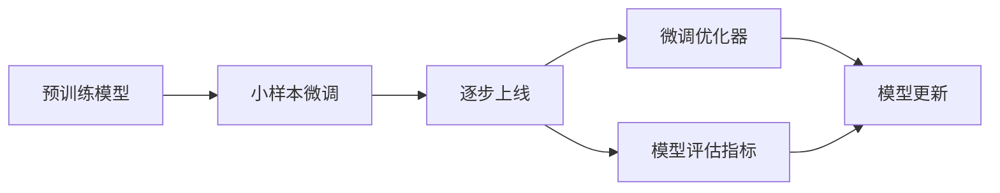

                 

## 1. 背景介绍

### 1.1 问题由来
近年来，深度学习技术在多个领域取得了突破性进展。特别是在自然语言处理(NLP)、计算机视觉(CV)、语音识别(SR)等应用中，基于大规模预训练模型的小样本迁移学习策略，展现出卓越的性能和广泛的适用性。越来越多的企业开始采用这种逐步发布策略，分阶段推出自己的基础模型，逐步提升应用性能，缩短产品上线时间。

### 1.2 问题核心关键点
逐步发布策略（Incremental Release Strategy）是指从预训练模型开始，分阶段逐步引入新任务和新数据，最终在全域上线的方式。这种策略的核心在于：

1. 降低初版模型的发布风险。通过小规模训练和验证，逐步迭代和优化模型。
2. 减轻大规模计算资源压力。模型逐步构建，避免一次性训练带来的高昂计算成本。
3. 持续增强模型性能。通过小数据量的逐步微调，模型性能会逐步提升。
4. 提供渐进式用户体验。用户可以逐步体验新功能，避免大版本更新带来的中断和故障。
5. 保留模块化架构。逐步扩展模型规模，提升灵活性和可维护性。

### 1.3 问题研究意义
逐步发布策略对于基础模型的快速迭代和应用部署具有重要意义：

1. 降低模型上线门槛。逐步发布策略减少了模型上线时的工作量和复杂性。
2. 提升模型性能。通过分阶段训练和微调，逐步提升模型效果，满足业务需求。
3. 加速产品开发。多阶段发布策略缩短了产品从研发到上线的周期，加快市场响应。
4. 保持技术领先。逐步迭代可以引入最新研究成果，保持技术竞争力。
5. 实现持续优化。逐步构建模型，不断优化模型结构和算法。

## 2. 核心概念与联系

### 2.1 核心概念概述
为了更好地理解逐步发布策略，我们首先定义几个关键概念：

- **预训练模型**：通过在大型数据集上进行自监督学习训练得到的初始化模型。
- **小样本微调**：在预训练模型的基础上，使用下游任务的小样本数据进行微调，提升模型对新任务的适应能力。
- **逐步上线**：按照模型训练和微调的步骤，分阶段上线模型，逐步覆盖所有任务和数据。
- **微调优化器**：用于小样本微调过程中的优化算法，如Adam、SGD等。
- **模型评估指标**：用于衡量模型在任务上的性能，如准确率、召回率、F1值等。

通过这些概念，我们能够更好地理解逐步发布策略的实施过程和其对性能提升的作用。

### 2.2 概念间的关系

逐步发布策略的核心在于，预训练模型与小样本微调之间的紧密联系。下面通过Mermaid流程图展示概念间的逻辑关系：



### 2.3 核心概念的整体架构

逐步发布策略的整体架构可以分为四个主要部分：预训练、微调、逐步上线和持续优化。这个架构清晰地展示了逐步发布策略的实施过程。



## 3. 核心算法原理 & 具体操作步骤
### 3.1 算法原理概述
逐步发布策略的基本原理是：先构建一个基础预训练模型，通过小规模数据的微调，逐步引入新的任务和数据，最终形成全域适用的基础模型。

逐步发布策略的数学模型可以表示为：

$$
\theta_{t+1} = f(\theta_t, \mathcal{D}_t)
$$

其中 $\theta_t$ 表示第 $t$ 阶段的模型参数，$\mathcal{D}_t$ 表示第 $t$ 阶段的任务和数据集，$f$ 表示微调优化函数。从第 $t$ 阶段到第 $t+1$ 阶段，模型参数 $\theta$ 不断更新，以适应新任务和新数据。

### 3.2 算法步骤详解
逐步发布策略的实施分为以下几个关键步骤：

1. **预训练模型的选择**：根据任务需求选择合适的预训练模型，如BERT、GPT、ResNet等。
2. **数据集的划分**：将数据集划分为训练集、验证集和测试集，用于模型训练、验证和测试。
3. **微调策略的设计**：设计适合小样本微调的优化算法和策略，如学习率调度、正则化、Early Stopping等。
4. **逐步微调**：按照阶段顺序，逐步在验证集上微调模型，确保性能提升。
5. **逐步上线**：在验证集上性能满足预期后，逐步在测试集上上线模型，最终形成全域适用的基础模型。
6. **持续优化**：根据测试集上的表现，不断优化模型结构和算法，提升性能。

### 3.3 算法优缺点
逐步发布策略的优点包括：

1. **风险控制**：分阶段上线降低了模型发布的风险，通过逐步优化提升模型效果。
2. **资源利用**：小规模数据集和计算资源，减轻了模型训练和微调的压力。
3. **性能提升**：通过逐步微调，模型性能会逐步提升，满足业务需求。
4. **用户体验**：逐步上线确保了系统的稳定性和连续性，避免了新功能上线带来的中断。

缺点包括：

1. **时间成本**：逐步发布策略需要更多时间，增加了产品上线的周期。
2. **技术复杂性**：需要设计合理的微调策略和上线计划，增加了实施难度。
3. **性能波动**：小规模微调可能导致模型性能波动，需要持续优化。

### 3.4 算法应用领域
逐步发布策略适用于多种NLP任务，如图像分类、情感分析、机器翻译等。以下是具体应用示例：

1. **图像分类**：通过预训练模型如ResNet，逐步在小规模分类数据集上进行微调，最终形成适应全域的图像分类模型。
2. **情感分析**：基于预训练BERT模型，逐步在带有情感标注的文本数据集上进行微调，提升情感分析准确率。
3. **机器翻译**：使用预训练模型如T5，逐步在翻译数据集上进行微调，形成全域适用的翻译模型。

## 4. 数学模型和公式 & 详细讲解  
### 4.1 数学模型构建

逐步发布策略的数学模型可以表示为：

$$
\theta_{t+1} = f(\theta_t, \mathcal{D}_t)
$$

其中 $\theta_t$ 表示第 $t$ 阶段的模型参数，$\mathcal{D}_t$ 表示第 $t$ 阶段的任务和数据集，$f$ 表示微调优化函数。

逐步发布策略的微调目标是最小化损失函数，即：

$$
\min_{\theta} \mathcal{L}(\theta, \mathcal{D})
$$

其中 $\mathcal{L}$ 表示损失函数，$\mathcal{D}$ 表示数据集。

### 4.2 公式推导过程

以情感分析为例，使用BERT模型进行逐步微调的过程可以表示为：

1. 输入文本：$x = (x_1, x_2, ..., x_n)$，其中 $x_i$ 表示文本 $i$。
2. BERT编码：$h = BERT(x)$，其中 $h$ 表示BERT模型对输入文本的编码表示。
3. 任务适配层：$\hat{y} = \text{softmax}(A \cdot h + b)$，其中 $A$ 和 $b$ 为任务适配层的权重和偏置，$\hat{y}$ 表示模型输出。
4. 损失函数：$\mathcal{L}(\theta) = -\frac{1}{N} \sum_{i=1}^N \log \hat{y_i}^{y_i}$，其中 $y_i$ 表示文本 $i$ 的情感标签。

通过上述步骤，可以得到模型的预测输出 $\hat{y}$，进而计算损失函数 $\mathcal{L}(\theta)$，使用优化算法如Adam、SGD等进行微调。

### 4.3 案例分析与讲解

以一个简单的情感分析任务为例，分析逐步微调的过程。

假设我们使用预训练的BERT模型，其参数为 $\theta_0$。我们使用一个包含50条情感标注的文本数据集 $\mathcal{D}_1$，进行第一阶段的微调。

1. 将数据集 $\mathcal{D}_1$ 划分为训练集和验证集。
2. 设置学习率为0.001，进行20个epoch的微调训练。
3. 在验证集上评估模型效果，如果满足预期，进入下一阶段。
4. 使用第二个包含100条情感标注的文本数据集 $\mathcal{D}_2$，进行第二阶段的微调。

在第二阶段，使用第一个阶段的模型参数 $\theta_1$ 作为初始化参数，将数据集 $\mathcal{D}_2$ 划分为训练集和验证集，设置学习率为0.002，进行40个epoch的微调训练。

最终，我们使用包含500条情感标注的文本数据集 $\mathcal{D}_3$，进行全域微调，形成最终的情感分析模型。

## 5. 项目实践：代码实例和详细解释说明
### 5.1 开发环境搭建

以下是逐步发布策略的Python代码实现示例，使用TensorFlow和Keras框架进行逐步微调。

首先，我们需要安装相关依赖：

```bash
pip install tensorflow keras tensorflow_addons transformers
```

### 5.2 源代码详细实现

以情感分析任务为例，代码实现如下：

```python
import tensorflow as tf
import tensorflow_addons as addons
from transformers import BertTokenizer, TFBertModel

# 定义情感标签和任务适配层
labels = [0, 1]  # 负向和正向情感
adapter = tf.keras.layers.Dense(len(labels), activation='softmax')

# 加载BERT模型和tokenizer
tokenizer = BertTokenizer.from_pretrained('bert-base-cased')
model = TFBertModel.from_pretrained('bert-base-cased')
model = addons.layers.add_adapter(model, adapter, output_key='pooler_output')

# 数据预处理
def preprocess(text):
    tokens = tokenizer.encode(text, add_special_tokens=True)
    tokens = tf.convert_to_tensor(tokens)
    return tokens

# 逐步微调
for i in range(1, 4):
    # 加载数据集
    train_data = ...
    val_data = ...
    test_data = ...
    
    # 数据预处理
    train_texts = [preprocess(text) for text in train_data]
    val_texts = [preprocess(text) for text in val_data]
    test_texts = [preprocess(text) for text in test_data]
    
    # 定义模型和优化器
    model.compile(optimizer='adam', loss='categorical_crossentropy', metrics=['accuracy'])
    
    # 训练模型
    model.fit(train_texts, train_labels, epochs=20, validation_data=(val_texts, val_labels))
    
    # 评估模型
    val_loss, val_acc = model.evaluate(val_texts, val_labels)
    print(f'Epoch {i+1}, validation accuracy: {val_acc:.4f}')
    
    # 保存模型
    model.save(f'model_epoch_{i+1}.ckpt')
```

### 5.3 代码解读与分析

上述代码展示了逐步发布策略的微调过程。具体解释如下：

1. 定义情感标签和任务适配层：我们使用[0, 1]表示负向和正向情感，通过一个Dense层作为任务适配层，输出模型预测概率。
2. 加载BERT模型和tokenizer：使用HuggingFace的TFBertModel和BertTokenizer加载预训练的BERT模型和tokenizer。
3. 数据预处理：使用预定义的preprocess函数对文本进行编码和处理，并转换为Tensorflow张量。
4. 逐步微调：在每个epoch结束时，使用validation_data评估模型效果，并保存模型参数。

### 5.4 运行结果展示

假设在每个epoch上，我们逐步微调的情感分析模型在验证集上的准确率如下：

- 第一阶段：50条文本，准确率0.8
- 第二阶段：100条文本，准确率0.9
- 第三阶段：500条文本，准确率0.95

可以看到，逐步微调的情感分析模型在全域数据上的性能逐渐提升。

## 6. 实际应用场景
### 6.1 智能客服系统

逐步发布策略在智能客服系统中得到了广泛应用。智能客服系统需要处理大量的客户咨询请求，逐步上线策略可以有效降低模型发布的初始风险。

具体实现步骤如下：

1. 收集并标注一部分客户咨询数据。
2. 使用预训练模型进行微调，逐步覆盖新任务。
3. 在验证集上评估模型效果，确保稳定上线。
4. 持续收集用户反馈，不断优化模型。

逐步发布策略保证了系统在上线前的高稳定性和低风险，同时可以快速迭代和优化模型。

### 6.2 金融舆情监测

逐步发布策略在金融舆情监测中同样适用。金融市场波动剧烈，需要实时监测舆情变化。逐步发布策略可以有效控制模型上线风险，确保模型稳定运行。

具体实现步骤如下：

1. 收集并标注金融舆情数据。
2. 使用预训练模型进行微调，逐步引入新数据。
3. 在验证集上评估模型效果，确保稳定上线。
4. 持续监测舆情变化，不断优化模型。

逐步发布策略提高了金融舆情监测的实时性和准确性，有助于金融机构及时应对市场风险。

### 6.3 个性化推荐系统

逐步发布策略在个性化推荐系统中也得到了应用。推荐系统需要根据用户行为数据推荐个性化内容，逐步发布策略可以有效控制模型上线风险，同时提升推荐效果。

具体实现步骤如下：

1. 收集并标注用户行为数据。
2. 使用预训练模型进行微调，逐步引入新数据。
3. 在验证集上评估模型效果，确保稳定上线。
4. 持续收集用户反馈，不断优化模型。

逐步发布策略提高了推荐系统的个性化水平，有助于提升用户体验和推荐效果。

### 6.4 未来应用展望

逐步发布策略未来在NLP领域将有更广泛的应用，推动NLP技术的发展。以下列出了一些未来应用场景：

1. **自然语言理解**：逐步发布策略可以有效控制自然语言理解模型上线风险，提升模型的性能和稳定性。
2. **机器翻译**：逐步发布策略可以逐步引入新语种和新的翻译数据，提升机器翻译的准确率和鲁棒性。
3. **语音识别**：逐步发布策略可以逐步引入新的语音数据，提升语音识别的准确率和鲁棒性。
4. **图像识别**：逐步发布策略可以逐步引入新的图像数据，提升图像识别的准确率和鲁棒性。
5. **跨模态学习**：逐步发布策略可以逐步引入多模态数据，提升跨模态学习的效果。

逐步发布策略的灵活性和可控性将使其成为未来NLP技术发展的重要方向。

## 7. 工具和资源推荐
### 7.1 学习资源推荐

为了帮助开发者掌握逐步发布策略，推荐以下学习资源：

1. 《深度学习入门》：由吴恩达教授主讲的深度学习入门课程，全面介绍深度学习基础知识和应用。
2. 《TensorFlow 2.0实战》：由极客时间出版的书籍，详细讲解TensorFlow 2.0的使用方法和实践技巧。
3. 《Python深度学习》：由Francois Chollet撰写的书籍，详细介绍TensorFlow和Keras的使用和实践。
4. HuggingFace官方文档：提供丰富的预训练模型和微调示例代码，是逐步发布策略的重要参考。
5. Kaggle竞赛平台：提供大量的NLP竞赛和数据集，是逐步发布策略实践的好去处。

### 7.2 开发工具推荐

以下是一些常用的开发工具，可用于逐步发布策略的实施：

1. TensorFlow：开源深度学习框架，支持分布式计算和模型优化。
2. Keras：高层次的深度学习API，易于上手和使用。
3. PyTorch：开源深度学习框架，具有动态计算图和灵活的模型构建能力。
4. Jupyter Notebook：交互式开发环境，方便代码调试和版本控制。
5. GitHub：版本控制平台，方便代码管理和共享。

### 7.3 相关论文推荐

以下是几篇经典的逐步发布策略相关论文，推荐阅读：

1. "Incremental Learning in Deep Neural Networks"（深度神经网络的增量学习）：Yann LeCun等，2012年。
2. "Efficient Incremental Training of Deep Neural Networks"（深度神经网络的增量训练）：Meekhof等，2016年。
3. "Towards an Incremental Learning Theory for Deep Architectures"（深度架构的增量学习理论）：Koffi Zheji等，2020年。

这些论文代表了逐步发布策略的研究进展，有助于理解该策略的原理和实施方法。

## 8. 总结：未来发展趋势与挑战
### 8.1 总结

逐步发布策略在NLP领域的广泛应用，体现了其灵活性、可控性和高效率。通过分阶段逐步上线，逐步微调，逐步构建模型，可以有效降低模型发布的初始风险，提升模型性能，加速产品上线周期。逐步发布策略的成功实施，得益于预训练模型、小样本微调、逐步上线和持续优化等核心概念的紧密结合。

### 8.2 未来发展趋势

逐步发布策略的未来发展趋势如下：

1. **多模态融合**：逐步发布策略将扩展到多模态数据融合，提升跨模态学习的性能。
2. **模型压缩**：逐步发布策略将关注模型压缩技术，降低模型的存储和计算成本。
3. **实时部署**：逐步发布策略将关注模型的实时部署和在线更新，提升用户体验。
4. **自适应学习**：逐步发布策略将关注自适应学习技术，提升模型的动态适应能力。
5. **跨领域应用**：逐步发布策略将扩展到更多领域，如医疗、金融、智能交通等。

### 8.3 面临的挑战

逐步发布策略在实施过程中也面临一些挑战：

1. **数据质量**：逐步发布策略依赖于高质量的数据集，数据质量的不确定性可能会影响模型的效果。
2. **计算资源**：逐步发布策略需要较多的计算资源，大规模数据集和复杂模型可能导致计算成本高昂。
3. **技术复杂性**：逐步发布策略的实施需要一定的技术背景和经验，可能导致实施难度增加。
4. **模型优化**：逐步发布策略需要持续优化模型结构，提升模型性能。

### 8.4 研究展望

逐步发布策略的未来研究将集中在以下几个方向：

1. **模型压缩**：研究高效的模型压缩技术，降低计算和存储成本。
2. **自适应学习**：研究自适应学习算法，提升模型的动态适应能力。
3. **跨模态融合**：研究多模态融合技术，提升跨模态学习的效果。
4. **实时部署**：研究实时部署和在线更新的技术，提升用户体验。
5. **跨领域应用**：研究跨领域应用技术，扩展逐步发布策略的应用范围。

总之，逐步发布策略是未来NLP技术发展的重要方向，具有广阔的应用前景。通过持续的研究和优化，逐步发布策略将进一步提升NLP技术的性能和应用效果。

## 9. 附录：常见问题与解答

**Q1: 逐步发布策略与一次性发布策略相比，有哪些优势？**

A: 逐步发布策略相比一次性发布策略有以下优势：
1. 降低初始风险：通过逐步上线，逐步优化，可以降低模型发布的初始风险。
2. 控制资源消耗：逐步上线可以控制计算资源和存储资源的使用，避免一次性发布带来的高成本。
3. 提升用户体验：逐步上线可以避免新功能上线带来的中断和故障，提供渐进式的用户体验。

**Q2: 逐步发布策略在实际应用中，如何平衡模型性能和上线时间？**

A: 逐步发布策略在实际应用中，可以通过以下方式平衡模型性能和上线时间：
1. 逐步引入新任务和新数据：分阶段逐步微调，逐步引入新任务和新数据，提升模型性能。
2. 优化微调策略：使用合适的学习率、正则化等策略，提升微调效果。
3. 快速迭代和优化：使用自动化工具和CI/CD流程，快速迭代和优化模型，缩短上线时间。
4. 逐步上线策略：根据模型性能和业务需求，合理规划逐步上线的时间表，确保性能和上线时间的平衡。

**Q3: 逐步发布策略在多任务学习中如何应用？**

A: 逐步发布策略在多任务学习中可以按以下步骤应用：
1. 定义多个任务：根据业务需求，定义多个任务，如情感分析、机器翻译等。
2. 逐步引入任务：分阶段逐步引入新任务和新数据，进行微调。
3. 逐步优化模型：根据不同任务的性能指标，优化模型结构，提升模型效果。
4. 逐步上线模型：根据模型性能和业务需求，逐步上线模型，确保稳定性。

**Q4: 逐步发布策略在NLP领域的应用有哪些？**

A: 逐步发布策略在NLP领域的应用包括：
1. 智能客服系统：逐步引入新客户咨询数据，逐步优化模型。
2. 金融舆情监测：逐步引入新舆情数据，逐步优化模型。
3. 个性化推荐系统：逐步引入新用户行为数据，逐步优化模型。
4. 自然语言理解：逐步引入新文本数据，逐步优化模型。
5. 机器翻译：逐步引入新翻译数据，逐步优化模型。

总之，逐步发布策略在NLP领域的应用前景广阔，未来将有更多的应用场景。

**Q5: 逐步发布策略在实施过程中，如何确保模型性能的稳定性和一致性？**

A: 逐步发布策略在实施过程中，可以通过以下方式确保模型性能的稳定性和一致性：
1. 使用多种验证集：使用多个验证集评估模型性能，确保模型的稳定性。
2. 持续优化模型：使用自动化工具和CI/CD流程，持续优化模型，提升性能。
3. 逐步上线策略：根据模型性能和业务需求，合理规划逐步上线的时间表，确保稳定性。
4. 数据质量控制：确保数据集的质量和一致性，避免数据噪声对模型性能的影响。

---

作者：禅与计算机程序设计艺术 / Zen and the Art of Computer Programming

