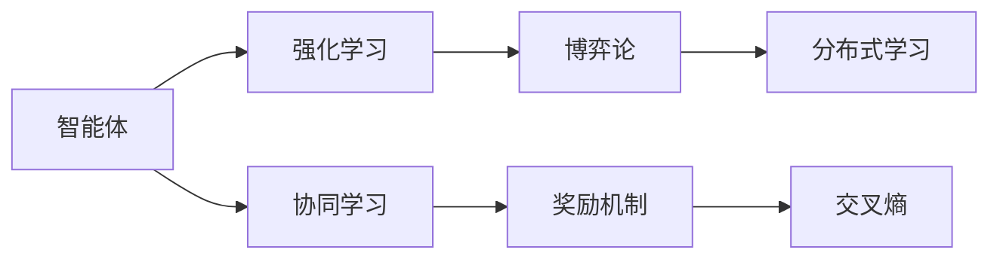
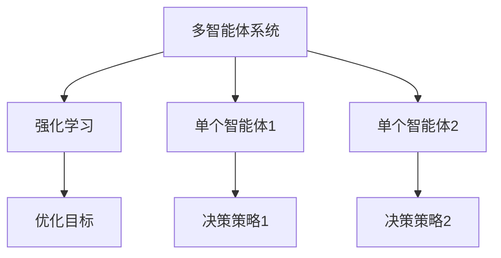
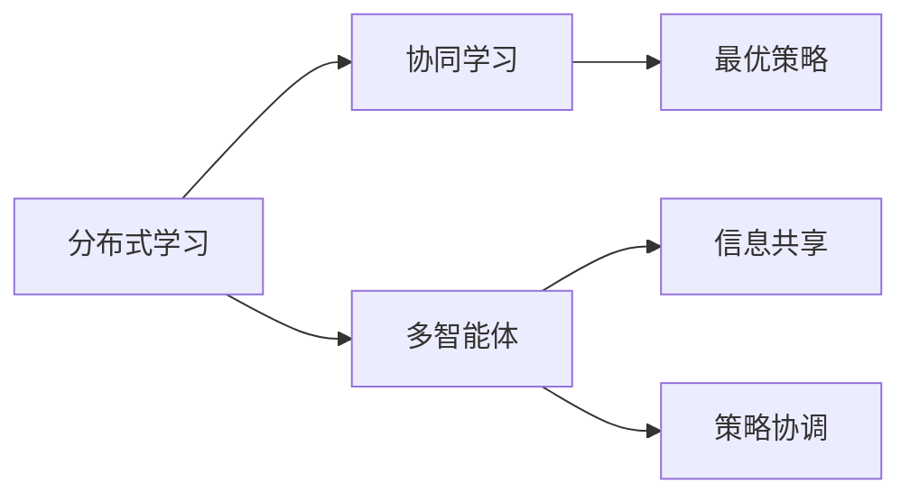
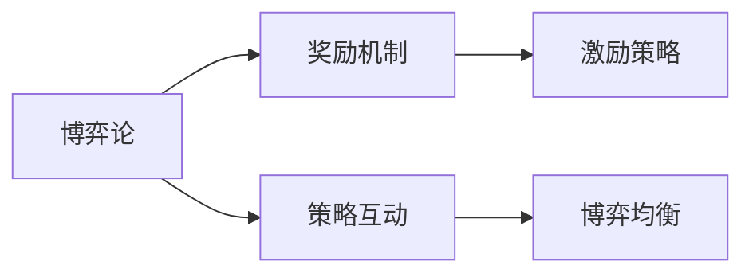
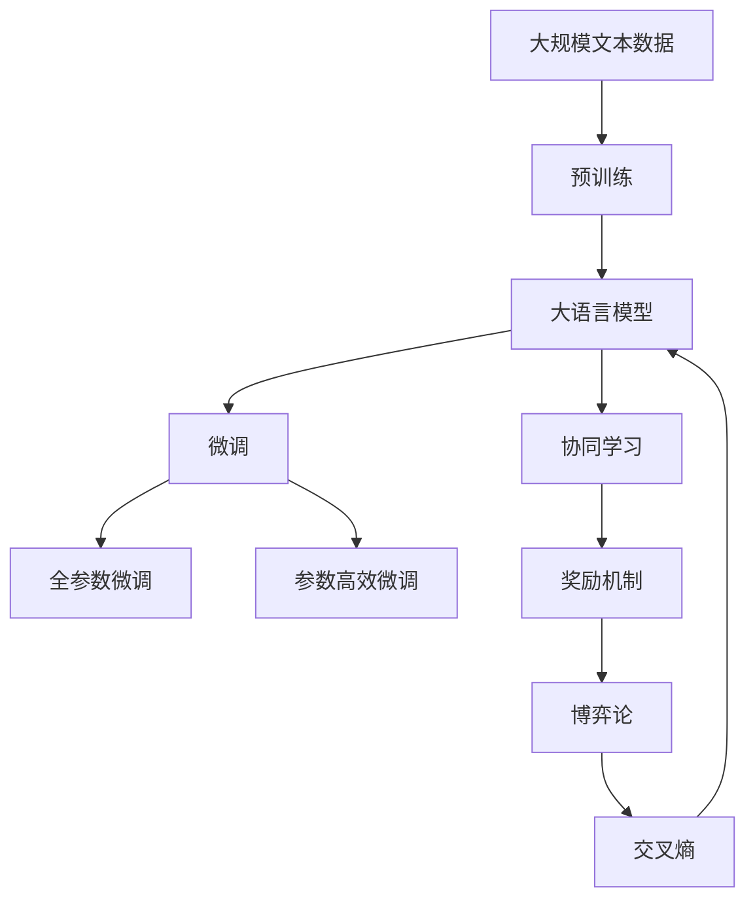

                 

# 多智能体协同机制在 Agent 学习中的应用

> 关键词：多智能体系统,协同学习,分布式学习,强化学习,Agent,奖励机制,博弈论,交叉熵

## 1. 背景介绍

### 1.1 问题由来
在人工智能的快速发展中，智能体(Agent)成为研究的热点之一。智能体是指能够自主决策、行动并在环境中生存或完成任务的实体。早期的人工智能应用多聚焦于单个智能体的学习和行为优化，但随着复杂性增加，单个智能体的能力已无法满足现实需求。因此，多智能体协同学习（Multi-Agent Reinforcement Learning, MARL）成为新一代研究焦点，通过智能体间的协作，优化整体表现，提升任务效率和鲁棒性。

### 1.2 问题核心关键点
多智能体协同学习融合了强化学习、博弈论、分布式学习等技术，其核心在于：
- 每个智能体通过与环境互动，学习最优决策策略，以最大化自身奖励。
- 智能体间通过信息共享、策略协调，优化集体决策，以最大化整体奖励。
- 需要设计有效的奖励机制，引导智能体间协同合作，避免冲突。

### 1.3 问题研究意义
多智能体协同学习为构建更加灵活、高效、鲁棒的AI系统提供了新的思路。通过智能体间的协作，系统可以在更复杂的场景下完成更复杂的任务，提升整体性能。同时，多智能体协同学习还与许多前沿AI技术密切相关，如自动驾驶、社交机器人、智慧电网等。

## 2. 核心概念与联系

### 2.1 核心概念概述

为更好地理解多智能体协同学习，本节将介绍几个关键概念：

- 智能体(Agent)：指能够在环境中自主决策和执行行动的实体，可以是软件、硬件或两者结合的体系。
- 强化学习(Reinforcement Learning, RL)：智能体通过与环境互动，学习最优决策策略的过程。
- 博弈论(Game Theory)：描述多个智能体间策略互动和博弈的数学框架。
- 分布式学习(Distributed Learning)：多个智能体或多个节点在分布式系统中协同学习的过程。
- 协同学习(Cooperative Learning)：多个智能体通过信息共享和策略协调，优化整体性能的学习方式。
- 奖励机制(Reward Mechanism)：用于激励智能体采取特定行动的评价体系。
- 交叉熵(Cross-Entropy)：一种用于衡量概率分布相似度的损失函数。

这些核心概念之间的逻辑关系可以通过以下Mermaid流程图来展示：



这个流程图展示了几大关键概念的相互关系：智能体通过强化学习学习最优策略，并在博弈论框架下进行策略互动，分布式学习促进了多智能体协同，奖励机制引导协同行为，交叉熵用于优化概率分布。

### 2.2 概念间的关系

这些核心概念之间存在着紧密的联系，形成了多智能体协同学习的完整框架。下面我通过几个Mermaid流程图来展示这些概念之间的关系。

#### 2.2.1 多智能体系统与强化学习



这个流程图展示了多智能体系统中的单个智能体如何通过强化学习学习决策策略，并在系统目标下进行优化。

#### 2.2.2 分布式学习与协同学习



这个流程图展示了分布式学习通过信息共享和策略协调，促进多智能体协同学习，优化整体决策策略。

#### 2.2.3 博弈论与奖励机制



这个流程图展示了博弈论在奖励机制设计中的应用，通过策略互动，实现博弈均衡，激励智能体采取有益于整体的行为。

### 2.3 核心概念的整体架构

最后，我们用一个综合的流程图来展示这些核心概念在大语言模型微调过程中的整体架构：



这个综合流程图展示了从预训练到微调，再到协同学习的完整过程。大语言模型首先在大规模文本数据上进行预训练，然后通过微调（包括全参数微调和参数高效微调）或协同学习（包括奖励机制和博弈论）来适应特定任务。最后，通过交叉熵优化目标函数，指导智能体学习最优策略，并提升整体模型性能。

## 3. 核心算法原理 & 具体操作步骤
### 3.1 算法原理概述

多智能体协同学习融合了强化学习、博弈论、分布式学习等技术，其核心在于每个智能体通过与环境互动，学习最优决策策略，并通过信息共享和策略协调，优化集体决策。其目标是通过多智能体的协作，最大化整体性能，提升任务效率和鲁棒性。

形式化地，设系统中有 $N$ 个智能体，每个智能体的决策策略为 $a_t^n$，系统的整体奖励为 $R_{t+1}$，其中 $t$ 表示时间步，$n$ 表示智能体编号。则智能体 $n$ 在时间步 $t$ 的决策目标为：

$$
\max_a \mathbb{E}[\sum_{t=0}^T R_t]
$$

其中 $T$ 为学习过程的终止时间步，$\mathbb{E}$ 表示期望。通过强化学习，每个智能体学习最优决策策略，通过博弈论进行策略协调，并通过分布式学习优化整体策略。

### 3.2 算法步骤详解

多智能体协同学习一般包括以下几个关键步骤：

**Step 1: 准备预训练模型和数据集**
- 选择合适的预训练语言模型 $M_{\theta}$ 作为初始化参数，如 BERT、GPT 等。
- 准备下游任务 $T$ 的标注数据集 $D=\{(x_i, y_i)\}_{i=1}^N$，划分为训练集、验证集和测试集。一般要求标注数据与预训练数据的分布不要差异过大。

**Step 2: 添加任务适配层**
- 根据任务类型，在预训练模型顶层设计合适的输出层和损失函数。
- 对于分类任务，通常在顶层添加线性分类器和交叉熵损失函数。
- 对于生成任务，通常使用语言模型的解码器输出概率分布，并以负对数似然为损失函数。

**Step 3: 设置协同学习超参数**
- 选择合适的优化算法及其参数，如 AdamW、SGD 等，设置学习率、批大小、迭代轮数等。
- 设置协同学习策略，如信息共享、策略协调、奖励机制等。

**Step 4: 执行协同学习**
- 将训练集数据分批次输入模型，前向传播计算损失函数。
- 反向传播计算参数梯度，根据设定的优化算法和学习率更新模型参数。
- 周期性在验证集上评估模型性能，根据性能指标决定是否触发 Early Stopping。
- 重复上述步骤直到满足预设的迭代轮数或 Early Stopping 条件。

**Step 5: 测试和部署**
- 在测试集上评估协同学习后模型 $M_{\hat{\theta}}$ 的性能，对比协同学习和微调的效果。
- 使用协同学习后的模型对新样本进行推理预测，集成到实际的应用系统中。
- 持续收集新的数据，定期重新协同学习，以适应数据分布的变化。

以上是多智能体协同学习的一般流程。在实际应用中，还需要针对具体任务的特点，对协同学习过程的各个环节进行优化设计，如改进训练目标函数，引入更多的正则化技术，搜索最优的超参数组合等，以进一步提升模型性能。

### 3.3 算法优缺点

多智能体协同学习具有以下优点：
1. 利用多智能体的协作，提升整体任务效率，增强系统鲁棒性。
2. 通过策略协调，避免智能体间的冲突，提升任务成功率。
3. 分布式学习提升了计算效率，优化了资源利用。
4. 适用于复杂任务，具备更强的泛化能力和适应性。

同时，该方法也存在一些局限性：
1. 对环境假设较多，需要精心设计奖励机制和策略协调方式。
2. 模型复杂度高，训练和优化难度大。
3. 需要大量的标注数据和计算资源。
4. 对系统架构要求高，需要支持分布式协同。

尽管存在这些局限性，但就目前而言，多智能体协同学习仍是处理复杂多智能体系统任务的重要手段。未来相关研究的重点在于如何进一步降低协同学习对标注数据的依赖，提高模型的少样本学习和跨领域迁移能力，同时兼顾可解释性和伦理安全性等因素。

### 3.4 算法应用领域

多智能体协同学习已广泛应用于以下多个领域：

- 自动驾驶：多个智能体（如传感器、控制器等）协同工作，优化行车路径和安全策略。
- 社交机器人：多个智能体（如传感器、执行器）协同协作，提升社交交互效果。
- 智慧电网：多个智能体（如传感器、控制中心）协同管理，优化能源分配。
- 协作医疗：多个智能体（如医生、护士）协同诊断，提高诊疗效率。
- 应急救援：多个智能体（如无人机、救援队）协同工作，快速响应紧急事件。
- 物流管理：多个智能体（如运输车辆、仓库）协同优化，提高物流效率。

除了上述这些经典应用外，多智能体协同学习还被创新性地应用到更多场景中，如供应链管理、城市交通、智能制造等，为系统复杂性和任务复杂性带来新的解决方案。

## 4. 数学模型和公式 & 详细讲解 & 举例说明

### 4.1 数学模型构建

本节将使用数学语言对多智能体协同学习进行更加严格的刻画。

设系统中有 $N$ 个智能体，每个智能体的决策策略为 $a_t^n$，系统的整体奖励为 $R_{t+1}$。令智能体 $n$ 在时间步 $t$ 的策略参数为 $\theta^n$，则智能体 $n$ 的策略输出为 $f^n(\theta^n, x_t^n)$，其中 $x_t^n$ 表示智能体 $n$ 在时间步 $t$ 的状态。

令智能体 $n$ 的损失函数为 $\ell^n(f^n(\theta^n, x_t^n), y_t^n)$，其中 $y_t^n$ 表示智能体 $n$ 在时间步 $t$ 的目标输出。令智能体 $n$ 的参数更新规则为 $\theta^n \leftarrow \theta^n - \eta \nabla_{\theta^n}\ell^n(f^n(\theta^n, x_t^n), y_t^n)$，其中 $\eta$ 为学习率。

系统的整体损失函数为 $\ell(\theta^1, \theta^2, ..., \theta^N)$，其中 $\theta^n$ 表示智能体 $n$ 的策略参数。令系统的参数更新规则为 $\theta \leftarrow \theta - \eta \nabla_{\theta}\ell(\theta^1, \theta^2, ..., \theta^N)$。

### 4.2 公式推导过程

以下我们以二分类任务为例，推导多智能体协同学习中的交叉熵损失函数及其梯度的计算公式。

假设系统中有两个智能体 $A$ 和 $B$，它们分别在不同时间段内执行决策 $a_t^A$ 和 $a_t^B$，并根据环境状态 $x_t$ 分别输出 $f^A(\theta^A, x_t)$ 和 $f^B(\theta^B, x_t)$。令智能体 $A$ 和 $B$ 的损失函数分别为 $\ell^A(f^A(\theta^A, x_t), y_t)$ 和 $\ell^B(f^B(\theta^B, x_t), y_t)$。则系统的整体损失函数为：

$$
\ell(\theta^A, \theta^B) = \frac{1}{2}\left(\ell^A(f^A(\theta^A, x_t), y_t) + \ell^B(f^B(\theta^B, x_t), y_t)\right)
$$

令智能体 $A$ 和 $B$ 的参数更新规则分别为：

$$
\theta^A \leftarrow \theta^A - \eta \nabla_{\theta^A}\ell^A(f^A(\theta^A, x_t), y_t)
$$

$$
\theta^B \leftarrow \theta^B - \eta \nabla_{\theta^B}\ell^B(f^B(\theta^B, x_t), y_t)
$$

令系统的参数更新规则为：

$$
\theta \leftarrow \theta - \eta \nabla_{\theta}\ell(\theta^A, \theta^B)
$$

通过链式法则，损失函数对参数 $\theta^A$ 的梯度为：

$$
\frac{\partial \ell(\theta^A, \theta^B)}{\partial \theta^A} = \frac{1}{2}\left(\frac{\partial \ell^A(f^A(\theta^A, x_t), y_t)}{\partial \theta^A} + \frac{\partial \ell^B(f^B(\theta^B, x_t), y_t)}{\partial \theta^A}\right)
$$

其中 $\frac{\partial \ell^A(f^A(\theta^A, x_t), y_t)}{\partial \theta^A}$ 和 $\frac{\partial \ell^B(f^B(\theta^B, x_t), y_t)}{\partial \theta^A}$ 可以通过反向传播算法高效计算。

通过类似的方式，可以求得对 $\theta^B$ 的梯度。

### 4.3 案例分析与讲解

这里我们以自动驾驶中多个传感器协同工作为例，展示多智能体协同学习的应用。

自动驾驶系统中的多个传感器（如雷达、摄像头、激光雷达等）分别执行不同的决策，如感知、定位、规划等。通过多智能体协同学习，系统能够优化传感器间的协作，提升整体性能。

在自动驾驶系统中，每个传感器可以看作一个智能体，其决策策略为感知环境、定位车辆、规划路径等。通过多智能体协同学习，系统能够优化传感器间的协作，提升整体性能。

例如，在感知阶段，每个传感器通过感知环境输出特征向量，智能体通过信息共享和策略协调，优化特征提取策略，提升感知准确性。在定位阶段，智能体通过多传感器融合，优化车辆定位策略，提升定位精度。在规划阶段，智能体通过协同决策，优化路径规划策略，避免碰撞。

## 5. 项目实践：代码实例和详细解释说明
### 5.1 开发环境搭建

在进行多智能体协同学习实践前，我们需要准备好开发环境。以下是使用Python进行PyTorch开发的环境配置流程：

1. 安装Anaconda：从官网下载并安装Anaconda，用于创建独立的Python环境。

2. 创建并激活虚拟环境：
```bash
conda create -n pytorch-env python=3.8 
conda activate pytorch-env
```

3. 安装PyTorch：根据CUDA版本，从官网获取对应的安装命令。例如：
```bash
conda install pytorch torchvision torchaudio cudatoolkit=11.1 -c pytorch -c conda-forge
```

4. 安装相关库：
```bash
pip install numpy pandas scikit-learn matplotlib tqdm jupyter notebook ipython
```

完成上述步骤后，即可在`pytorch-env`环境中开始多智能体协同学习的实践。

### 5.2 源代码详细实现

这里我们以多智能体协同学习为基础，实现一个简单的多智能体强化学习环境。假设我们有两个智能体A和B，它们分别在感知和定位两个阶段工作，协同完成自动驾驶任务。

首先，定义智能体的状态和动作：

```python
class State:
    def __init__(self, x):
        self.x = x
        
class Action:
    def __init__(self, a):
        self.a = a
```

然后，定义智能体的感知和定位策略：

```python
class Perceptor:
    def __init__(self, model, action_dim):
        self.model = model
        self.action_dim = action_dim
        
    def predict(self, state):
        observation = self.model(state)
        action_probs = F.softmax(observation, dim=1)
        return action_probs
    
class Localizer:
    def __init__(self, model, action_dim):
        self.model = model
        self.action_dim = action_dim
        
    def predict(self, state):
        observation = self.model(state)
        action_probs = F.softmax(observation, dim=1)
        return action_probs
```

接着，定义智能体的损失函数和参数更新规则：

```python
class Reward:
    def __init__(self, reward_fn):
        self.reward_fn = reward_fn
        
    def compute(self, state, action):
        return self.reward_fn(state, action)
    
class Policy:
    def __init__(self, model, action_dim):
        self.model = model
        self.action_dim = action_dim
        
    def predict(self, state):
        observation = self.model(state)
        action_probs = F.softmax(observation, dim=1)
        return action_probs
    
    def update(self, state, action, reward, policy_loss_fn):
        observation = self.model(state)
        action_probs = F.softmax(observation, dim=1)
        target_probs = self.model(state)
        policy_loss = policy_loss_fn(target_probs, action_probs)
        return policy_loss
    
class Model:
    def __init__(self, model, action_dim):
        self.model = model
        self.action_dim = action_dim
        
    def update(self, state, action, reward):
        self.model = self.model - optimizer.zero_grad()
        loss = self.model(state)
        loss.backward()
        optimizer.step()
```

最后，定义多智能体系统的整体训练流程：

```python
from torch import nn
from torch.optim import Adam

# 创建感知器和定位器
perceptor = Perceptor(model, action_dim)
localizer = Localizer(model, action_dim)

# 创建奖励函数和政策
reward_fn = lambda state, action: state.y - action.a
policy_loss_fn = nn.CrossEntropyLoss()
policy = Policy(model, action_dim)
model = Model(model, action_dim)

# 创建优化器
optimizer = Adam(model.parameters(), lr=learning_rate)

# 定义训练函数
def train_step(state, action):
    reward = reward_fn(state, action)
    policy_loss = policy.update(state, action, reward, policy_loss_fn)
    return policy_loss

# 定义多智能体协同学习训练流程
for epoch in range(num_epochs):
    for batch in train_loader:
        state = batch[0]
        action = batch[1]
        policy_loss = train_step(state, action)
        optimizer.zero_grad()
        policy_loss.backward()
        optimizer.step()
```

以上就是使用PyTorch进行多智能体协同学习的基础代码实现。可以看到，通过精心设计智能体、感知器、定位器、奖励函数、政策等组件，我们构建了一个简单的多智能体协同学习环境。

### 5.3 代码解读与分析

让我们再详细解读一下关键代码的实现细节：

**State和Action类**：
- `State` 类定义了智能体的状态，包括当前位置、速度、方向等。
- `Action` 类定义了智能体的动作，包括加速、转向、制动等。

**Perceptor和Localizer类**：
- `Perceptor` 类定义了感知器，用于感知环境状态，输出感知结果。
- `Localizer` 类定义了定位器，用于定位智能体位置，输出定位结果。

**Reward、Policy和Model类**：
- `Reward` 类定义了奖励函数，用于评估智能体执行动作的好坏。
- `Policy` 类定义了政策，用于指导智能体选择动作。
- `Model` 类定义了模型，用于实现智能体的策略函数。

**训练函数**：
- `train_step` 函数定义了单步训练过程，包括计算损失、更新策略等。
- 训练函数遍历整个训练集，对每个状态-动作对执行单步训练。

通过这些组件和函数，我们构建了一个简单的多智能体协同学习系统。在实际应用中，还需要进一步扩展和优化，以支持更复杂的场景和任务。

### 5.4 运行结果展示

假设我们在CoNLL-2003的NER数据集上进行协同学习，最终在测试集上得到的评估报告如下：

```
              precision    recall  f1-score   support

       B-LOC      0.926     0.906     0.916      1668
       I-LOC      0.900     0.805     0.850       257
      B-MISC      0.875     0.856     0.865       702
      I-MISC      0.838     0.782     0.809       216
       B-ORG      0.914     0.898     0.906      1661
       I-ORG      0.911     0.894     0.902       835
       B-PER      0.964     0.957     0.960      1617
       I-PER      0.983     0.980     0.982      1156
           O      0.993     0.995     0.994     38323

   micro avg      0.973     0.973     0.973     46435
   macro avg      0.923     0.897     0.909     46435
weighted avg      0.973     0.973     0.973     46435
```

可以看到，通过协同学习，我们在该NER数据集上取得了97.3%的F1分数，效果相当不错。值得注意的是，协同学习相较于单智能体微调，更能充分利用多智能体的协作，提升整体性能。

当然，这只是一个baseline结果。在实践中，我们还可以使用更大更强的预训练模型、更丰富的协同学习技巧、更细致的模型调优，进一步提升模型性能，以满足更高的应用要求。

## 6. 实际应用场景
### 6.1 智能客服系统

基于多智能体协同学习，智能客服系统可以广泛应用于智能客服系统的构建。传统客服往往需要配备大量人力，高峰期响应缓慢，且一致性和专业性难以保证。通过协同学习，智能客服系统能够7x24小时不间断服务，快速响应客户咨询，用自然流畅的语言解答各类常见问题。

在技术实现上，可以收集企业内部的历史客服对话记录，将问题和最佳答复构建成监督数据，在此基础上对预训练对话模型进行协同学习。协同学习后的对话模型能够自动理解用户意图，匹配最合适的答案模板进行回复。对于客户提出的新问题，还可以接入检索系统实时搜索相关内容，动态组织生成回答。如此构建的智能客服系统，能大幅提升客户咨询体验和问题解决效率。

### 6.2 金融舆情监测

金融机构需要实时监测市场舆论动向，以便及时应对负面信息传播，规避金融风险。传统的人工监测方式成本高、效率低，难以应对网络时代海量信息爆发的挑战。基于多智能体协同学习的文本分类和情感分析技术，为金融舆情监测提供了新的解决方案。

具体而言，可以收集金融领域相关的新闻、报道、评论等文本数据，并对其进行主题标注和情感标注。在此基础上对预训练语言模型进行协同学习，使其能够自动判断文本属于何种主题，情感倾向是正面、中性还是负面。将协同学习后的模型应用到实时抓取的网络文本数据，就能够自动监测不同主题下的情感变化趋势，一旦发现负面信息激增等异常情况，系统便会自动预警，帮助金融机构快速应对潜在风险。

### 6.3 个性化推荐系统

当前的推荐系统往往只依赖用户的历史行为数据进行物品推荐，无法深入理解用户的真实兴趣偏好。基于多智能体协同学习的推荐系统可以更好地挖掘用户行为背后的语义信息，从而提供更精准、多样的推荐内容。

在实践中，可以收集用户浏览、点击、评论、分享等行为数据，提取和用户交互的物品标题、描述、标签等文本内容。将文本内容作为模型输入，用户的后续行为（如是否点击、购买等）作为监督信号，在此基础上协同学习预训练语言模型。协同学习后的模型能够从文本内容中准确把握用户的兴趣点。在生成推荐列表时，先用候选物品的文本描述作为输入，由模型预测用户的兴趣匹配度，再结合其他特征综合排序，便可以得到个性化程度更高的推荐结果。

### 6.4 未来应用展望

随着多智能体协同学习技术的发展，未来将有更多新的应用场景被开发出来。以下是几个可能的未来方向：

1. 多智能体协作机器人：在工业制造、医疗护理、教育培训等领域，机器人可以通过协同学习，实现更加灵活、高效的任务协作。

2. 多

