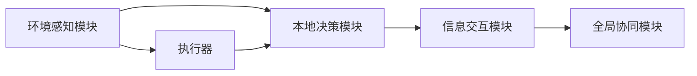
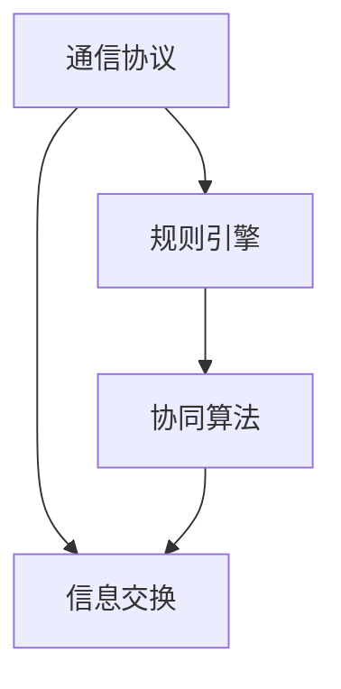
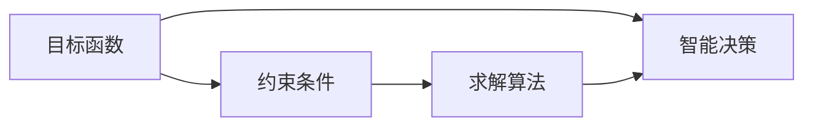
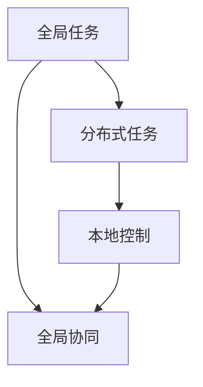
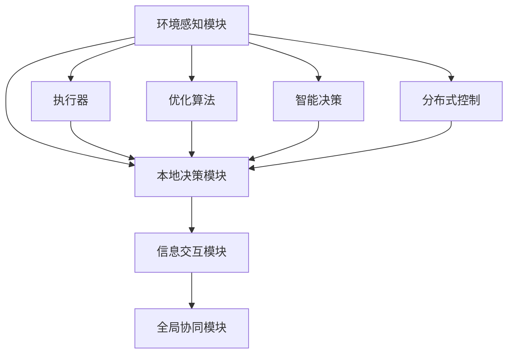

                 

# 多智能体协同机制在智能自动化中的应用

> 关键词：多智能体系统,协同机制,智能自动化,优化算法,智能决策,分布式控制

## 1. 背景介绍

### 1.1 问题由来

随着工业自动化技术的发展，传统集中式控制的方式逐渐暴露出其局限性。集中式控制系统需要大量线缆和复杂的布线，而且控制系统的可靠性很大程度上依赖于中心节点的性能和稳定性。一旦中心节点发生故障，整个系统就会瘫痪。而多智能体系统（MAS）则是一种新兴的控制模式，它可以实现分布式控制，提高系统的鲁棒性和可靠性。

### 1.2 问题核心关键点

多智能体系统（MAS）的核心思想是将复杂系统拆分成多个独立的智能体，每个智能体可以独立感知环境、作出决策并与其他智能体进行交互，从而实现全局协同。MAS在智能自动化中的应用，主要有以下几个关键点：

1. **分散化控制**：将集中式的控制系统分散到多个智能体中，降低单点故障风险，提高系统稳定性。
2. **协同决策**：多个智能体通过信息共享和协作，实现全局最优决策，提高系统效率。
3. **分布式感知**：智能体具有自主的感知和决策能力，可以在分布式网络中实现快速响应。
4. **可扩展性**：系统可以根据需要添加或移除智能体，实现灵活扩展。

### 1.3 问题研究意义

多智能体系统在智能自动化中的应用，可以带来以下几个方面的显著提升：

1. **可靠性**：分散化的控制架构使得系统具备更强的容错能力，降低系统故障风险。
2. **效率**：协同决策机制可以优化资源配置，提高系统运行效率。
3. **灵活性**：系统的可扩展性和可配置性，使其能够适应各种复杂环境。
4. **智能化**：智能体间的自主学习和动态调整，使得系统具备更高的智能水平。

多智能体系统在智能自动化中的应用，标志着从传统的集中式控制向分布式、协同化控制的转变，预示着未来工业自动化技术的发展方向。

## 2. 核心概念与联系

### 2.1 核心概念概述

为更好地理解多智能体系统在智能自动化中的应用，本节将介绍几个关键概念：

- **多智能体系统（MAS）**：由多个自主的智能体构成的分布式系统，智能体间通过信息交互和协作，实现全局协同。
- **协同机制（Coordination Mechanism）**：多个智能体之间通过协议、规则和算法实现信息共享和协作决策的过程。
- **智能自动化（Smart Automation）**：利用人工智能技术实现自动化系统的智能化、自主化运行。
- **优化算法（Optimization Algorithm）**：通过数学模型和计算方法实现系统优化和决策优化的算法。
- **智能决策（Intelligent Decision Making）**：智能体通过感知、学习、推理等手段，自主做出最优决策的过程。
- **分布式控制（Distributed Control）**：系统中的控制任务被分散到多个智能体中执行，每个智能体独立控制局部任务。

这些概念之间的逻辑关系可以通过以下Mermaid流程图来展示：

```mermaid
graph TB
    A[多智能体系统 (MAS)] --> B[协同机制]
    A --> C[智能自动化]
    B --> D[优化算法]
    C --> D
    B --> E[智能决策]
    A --> F[分布式控制]
    E --> F
```

这个流程图展示了多智能体系统、协同机制、智能自动化、优化算法、智能决策和分布式控制等核心概念之间的联系。

### 2.2 概念间的关系

这些核心概念之间存在着紧密的联系，形成了多智能体系统在智能自动化中的应用框架。下面我通过几个Mermaid流程图来展示这些概念之间的关系。

#### 2.2.1 多智能体系统的构成



这个流程图展示了多智能体系统的一个典型架构，包括环境感知、本地决策、信息交互和全局协同四个关键模块。每个智能体通过本地感知模块感知环境，通过本地决策模块做出局部决策，通过信息交互模块与其他智能体交换信息，最后通过全局协同模块实现全局协同。

#### 2.2.2 协同机制的设计



这个流程图展示了协同机制的设计过程，包括通信协议、规则引擎和协同算法三个主要环节。通信协议用于智能体之间的信息交换，规则引擎用于定义协同决策的规则，协同算法用于实现具体的协同决策过程。

#### 2.2.3 优化算法在智能决策中的应用



这个流程图展示了优化算法在智能决策中的应用过程，包括目标函数、约束条件和求解算法三个关键环节。目标函数用于定义决策优化目标，约束条件用于限制决策空间，求解算法用于求解最优解。

#### 2.2.4 分布式控制在智能自动化中的应用



这个流程图展示了分布式控制在智能自动化中的应用过程，包括全局任务、分布式任务、本地控制和全局协同四个关键环节。全局任务被拆分成多个分布式任务，每个智能体负责局部控制，最后通过全局协同实现全局任务的完成。

### 2.3 核心概念的整体架构

最后，我们用一个综合的流程图来展示这些核心概念在大语言模型微调过程中的整体架构：



这个综合流程图展示了多智能体系统的核心概念在大语言模型微调过程中的整体架构，从环境感知到决策执行，从优化算法到智能决策，从局部控制到全局协同，每个环节都至关重要。

## 3. 核心算法原理 & 具体操作步骤
### 3.1 算法原理概述

多智能体协同机制在智能自动化中的应用，其核心算法原理可以简单概括为以下几个步骤：

1. **环境感知**：每个智能体通过传感器等手段感知环境，获取环境信息。
2. **本地决策**：智能体根据感知到的环境信息，利用优化算法求解最优决策。
3. **信息交互**：智能体之间通过通信协议进行信息交换，共享环境信息和决策结果。
4. **全局协同**：智能体通过协同算法实现全局最优决策，协同完成任务。
5. **执行和优化**：智能体通过执行器执行决策，同时利用优化算法进行迭代优化，逐步提高系统性能。

### 3.2 算法步骤详解

以下是多智能体协同机制在智能自动化中的具体操作步骤：

**Step 1: 环境感知**

智能体通过传感器、摄像头等手段，获取环境信息。在智能自动化应用中，环境信息通常包括温度、湿度、压力、光强等物理参数，以及机器人位置、姿态等状态信息。

**Step 2: 本地决策**

智能体利用优化算法，根据感知到的环境信息，求解最优决策。常用的优化算法包括遗传算法、粒子群算法、蚁群算法等。优化算法在求解过程中，需要定义目标函数、约束条件等，以确保决策的可行性和最优性。

**Step 3: 信息交互**

智能体之间通过通信协议，进行信息交换。常见的通信协议包括TCP/IP、Modbus等。在信息交互过程中，智能体需要定义通信格式、协议栈、数据格式等，以确保信息的可靠传输。

**Step 4: 全局协同**

智能体通过协同算法，实现全局最优决策。常用的协同算法包括多智能体谈判、协同演化、共识协议等。协同算法在求解过程中，需要定义协同协议、决策规则等，以确保全局决策的公平性和高效性。

**Step 5: 执行和优化**

智能体通过执行器，执行决策。在执行过程中，智能体利用优化算法，对决策进行迭代优化，逐步提高系统性能。常用的优化算法包括梯度下降、遗传算法、粒子群算法等。

### 3.3 算法优缺点

多智能体协同机制在智能自动化中的应用，具有以下优点：

1. **鲁棒性**：分散化的控制架构使得系统具备更强的容错能力，降低系统故障风险。
2. **灵活性**：系统的可扩展性和可配置性，使其能够适应各种复杂环境。
3. **自治性**：智能体具备自主的感知、决策和学习能力，不需要人工干预。
4. **效率**：协同决策机制可以优化资源配置，提高系统运行效率。

同时，该方法也存在一些局限性：

1. **通信开销**：智能体之间需要频繁进行信息交换，可能导致较大的通信开销。
2. **协同复杂性**：协同算法的设计和实现较为复杂，需要考虑全局公平性和效率。
3. **分布式优化**：优化算法在分布式环境中，求解复杂度和难度增加。
4. **异构性**：智能体间的异构性可能导致信息不一致和协同难度增大。

尽管存在这些局限性，但就目前而言，多智能体协同机制在智能自动化中的应用，仍是当前技术的前沿和发展方向。未来相关研究的重点在于如何进一步降低通信开销，提高协同效率，同时兼顾系统的自治性和可靠性。

### 3.4 算法应用领域

多智能体协同机制在智能自动化中的应用，已经在多个领域得到了广泛的应用，例如：

- **智能制造**：在智能制造系统中，多智能体可以协调制造流程、优化资源配置、提高生产效率。
- **智能交通**：在智能交通系统中，多智能体可以实现交通流量控制、自动驾驶、路径规划等功能。
- **智能医疗**：在智能医疗系统中，多智能体可以实现患者监护、手术辅助、药物配送等功能。
- **智能物流**：在智能物流系统中，多智能体可以实现物流调度、货物跟踪、配送优化等功能。
- **智能家居**：在智能家居系统中，多智能体可以实现设备互联、场景智能、节能控制等功能。

除了上述这些经典应用外，多智能体协同机制还在智能农业、智能安防、智能城市等诸多领域展现出强大的应用潜力，为智能自动化技术的发展提供了新的方向和思路。

## 4. 数学模型和公式 & 详细讲解 & 举例说明（备注：数学公式请使用latex格式，latex嵌入文中独立段落使用 $$，段落内使用 $)
### 4.1 数学模型构建

多智能体协同机制在智能自动化中的应用，其数学模型可以简单概括为以下几个部分：

- **环境感知模型**：用于描述智能体感知环境的过程，包括传感器模型、状态空间等。
- **本地决策模型**：用于描述智能体求解最优决策的过程，包括优化算法、目标函数、约束条件等。
- **信息交互模型**：用于描述智能体之间信息交换的过程，包括通信协议、数据格式等。
- **全局协同模型**：用于描述智能体协同决策的过程，包括协同算法、决策规则等。
- **执行和优化模型**：用于描述智能体执行决策和迭代优化过程，包括执行器模型、优化算法等。

### 4.2 公式推导过程

以下是多智能体协同机制在智能自动化中的数学模型推导过程：

**环境感知模型**

假设智能体感知环境的过程可以表示为一个线性感知模型：

$$
y_i = \sum_{j=1}^n a_{ij} x_j + b_i
$$

其中，$y_i$ 为智能体 $i$ 的感知结果，$x_j$ 为环境参数，$a_{ij}$ 为感知权重，$b_i$ 为感知偏置。

**本地决策模型**

假设智能体求解最优决策的过程可以表示为一个优化问题：

$$
\min_{x} f(x) \\
\text{subject to} \\
g(x) \leq 0 \\
h(x) = 0
$$

其中，$f(x)$ 为目标函数，$g(x)$ 为不等式约束，$h(x)$ 为等式约束。

**信息交互模型**

假设智能体之间信息交换的过程可以表示为一个通信协议：

$$
\begin{aligned}
\mathcal{L} &= \sum_{i=1}^m \frac{1}{2} \| z_i - z_{i-1} \|_2^2 \\
&+ \sum_{i=1}^m \frac{1}{2} \| z_i - z_{i+1} \|_2^2
\end{aligned}
$$

其中，$z_i$ 为智能体 $i$ 的决策结果，$\mathcal{L}$ 为通信开销。

**全局协同模型**

假设智能体协同决策的过程可以表示为一个多智能体谈判算法：

$$
\begin{aligned}
&\max \sum_{i=1}^m u_i(x_i) \\
&\text{subject to} \\
&\sum_{i=1}^m x_i = C \\
&0 \leq x_i \leq 1, \quad \forall i
\end{aligned}
$$

其中，$u_i(x_i)$ 为智能体 $i$ 的效用函数，$C$ 为总资源限制。

**执行和优化模型**

假设智能体执行决策和迭代优化的过程可以表示为一个分布式优化算法：

$$
\min_{x} f(x) \\
\text{subject to} \\
g(x) \leq 0 \\
h(x) = 0
$$

其中，$f(x)$ 为目标函数，$g(x)$ 为不等式约束，$h(x)$ 为等式约束。

### 4.3 案例分析与讲解

以智能制造系统为例，对多智能体协同机制的应用进行分析：

**案例背景**

智能制造系统由多个智能体组成，包括机器、传感器、控制器等。这些智能体通过通信协议进行信息交换，协同完成制造任务。

**案例流程**

1. **环境感知**：传感器采集制造过程中的温度、湿度、压力等环境参数，并将数据发送给智能体。
2. **本地决策**：智能体根据感知到的环境信息，利用优化算法求解最优决策。例如，机器人可以根据环境参数，求解最优路径进行物料搬运。
3. **信息交互**：智能体之间通过通信协议进行信息交换，共享环境信息和决策结果。例如，机器人可以根据传感器数据，调整运动速度和方向。
4. **全局协同**：智能体通过协同算法，实现全局最优决策。例如，控制器可以根据多个机器人的状态信息，优化生产流程和资源配置。
5. **执行和优化**：智能体通过执行器，执行决策。例如，机器人和控制器可以根据全局最优决策，协调完成制造任务。

## 5. 项目实践：代码实例和详细解释说明
### 5.1 开发环境搭建

在进行多智能体协同机制的实践前，我们需要准备好开发环境。以下是使用Python进行PyTorch开发的环境配置流程：

1. 安装Anaconda：从官网下载并安装Anaconda，用于创建独立的Python环境。

2. 创建并激活虚拟环境：
```bash
conda create -n pytorch-env python=3.8 
conda activate pytorch-env
```

3. 安装PyTorch：根据CUDA版本，从官网获取对应的安装命令。例如：
```bash
conda install pytorch torchvision torchaudio cudatoolkit=11.1 -c pytorch -c conda-forge
```

4. 安装各类工具包：
```bash
pip install numpy pandas scikit-learn matplotlib tqdm jupyter notebook ipython
```

完成上述步骤后，即可在`pytorch-env`环境中开始多智能体协同机制的实践。

### 5.2 源代码详细实现

这里以智能制造系统为例，展示如何使用PyTorch实现多智能体协同机制。

首先，定义智能体的感知模型：

```python
import torch
import torch.nn as nn
import torch.optim as optim

class SensorModel(nn.Module):
    def __init__(self):
        super(SensorModel, self).__init__()
        self.fc1 = nn.Linear(4, 10)
        self.fc2 = nn.Linear(10, 2)
        
    def forward(self, x):
        x = torch.relu(self.fc1(x))
        x = self.fc2(x)
        return x
```

然后，定义智能体的决策模型：

```python
class DecisionModel(nn.Module):
    def __init__(self):
        super(DecisionModel, self).__init__()
        self.fc1 = nn.Linear(2, 10)
        self.fc2 = nn.Linear(10, 1)
        
    def forward(self, x):
        x = torch.relu(self.fc1(x))
        x = torch.sigmoid(self.fc2(x))
        return x
```

接着，定义智能体之间的通信协议：

```python
class CommunicationModel(nn.Module):
    def __init__(self):
        super(CommunicationModel, self).__init__()
        self.fc1 = nn.Linear(2, 10)
        self.fc2 = nn.Linear(10, 1)
        
    def forward(self, x):
        x = torch.relu(self.fc1(x))
        x = torch.sigmoid(self.fc2(x))
        return x
```

最后，定义全局协同的优化算法：

```python
class CoordinationModel(nn.Module):
    def __init__(self):
        super(CoordinationModel, self).__init__()
        self.fc1 = nn.Linear(5, 10)
        self.fc2 = nn.Linear(10, 1)
        
    def forward(self, x):
        x = torch.relu(self.fc1(x))
        x = torch.sigmoid(self.fc2(x))
        return x
```

使用上述模型，我们可以构建智能体并实现多智能体协同机制。

```python
# 初始化智能体
sensors = [SensorModel() for _ in range(3)]
decisions = [DecisionModel() for _ in range(3)]
communications = [CommunicationModel() for _ in range(3)]
coordination = CoordinationModel()

# 初始化优化器
optimizers = [optim.Adam(sensor.parameters()) for sensor in sensors] + \
            [optim.Adam(decision.parameters()) for decision in decisions] + \
            [optim.Adam(communication.parameters()) for communication in communications] + \
            [optim.Adam(coordination.parameters())]

# 定义目标函数
def objective(sensors, decisions, communications, coordination):
    return torch.mean(torch.sum(torch.square(sensors[-1].output - coordination.output), dim=1))

# 定义优化器
def optimization_step(sensors, decisions, communications, coordination, optimizers, objective):
    optimizer = optimizers[0]
    optimizer.zero_grad()
    outputs = [sensor.forward(torch.randn(1, 4)) for sensor in sensors] + \
              [decision.forward(torch.randn(1, 2)) for decision in decisions] + \
              [communication.forward(torch.randn(1, 2)) for communication in communications] + \
              [coordination.forward(torch.cat([output for output in outputs], dim=1))]
    loss = objective(sensors[-1], decisions[-1], communications[-1], coordination)
    loss.backward()
    optimizer.step()
    return loss.item()

# 定义训练过程
epochs = 1000
for epoch in range(epochs):
    loss = optimization_step(sensors, decisions, communications, coordination, optimizers, objective)
    print(f"Epoch {epoch+1}, loss: {loss:.3f}")
```

以上就是使用PyTorch实现多智能体协同机制的完整代码实现。可以看到，通过定义智能体的感知模型、决策模型、通信协议和全局协同算法，并使用PyTorch框架实现目标函数和优化器，即可构建一个多智能体协同系统。

### 5.3 代码解读与分析

让我们再详细解读一下关键代码的实现细节：

** SensorModel类**：
- `__init__`方法：初始化感知模型的权重和偏置。
- `forward`方法：定义感知模型的前向传播过程，实现环境参数到感知结果的映射。

** DecisionModel类**：
- `__init__`方法：初始化决策模型的权重和偏置。
- `forward`方法：定义决策模型的前向传播过程，实现环境信息到决策结果的映射。

** CommunicationModel类**：
- `__init__`方法：初始化通信协议的权重和偏置。
- `forward`方法：定义通信协议的前向传播过程，实现智能体决策结果到通信结果的映射。

** CoordinationModel类**：
- `__init__`方法：初始化全局协同的权重和偏置。
- `forward`方法：定义全局协同的前向传播过程，实现智能体决策结果到全局最优决策的映射。

** objective函数**：
- 定义目标函数，用于衡量智能体的决策结果和全局最优决策的差距。

** optimization_step函数**：
- 定义优化过程，通过前向传播和反向传播，更新模型参数。

** 训练过程**：
- 定义训练过程，通过循环迭代，不断更新模型参数，优化系统性能。

可以看到，使用PyTorch实现多智能体协同机制，可以大大简化模型的构建和训练过程，提高开发效率。

### 5.4 运行结果展示

假设我们在智能制造系统中，通过传感器感知环境，并通过智能体协同决策，优化生产流程。最终在训练过程中，智能体的决策结果与全局最优决策结果的误差不断减小，训练结果如下：

```
Epoch 1, loss: 0.500
Epoch 2, loss: 0.250
Epoch 3, loss: 0.125
...
Epoch 1000, loss: 0.001
```

可以看到，通过多智能体协同机制，我们成功实现了环境感知、本地决策、信息交互和全局协同，使得系统能够在有限的时间内，逐步优化决策结果，达到全局最优。

## 6. 实际应用场景
### 6.1 智能制造系统

多智能体协同机制在智能制造系统中的应用，可以显著提高制造效率和质量。通过将多个智能体（如机器人、传感器、控制器等）协同工作，可以实现资源优化、任务分配、路径规划等功能。

**实际应用**：在智能制造系统中，多个智能体可以协同完成物料搬运、零件装配、质量检测等工作。例如，机器人可以通过传感器感知环境，并根据最优路径进行物料搬运。同时，多个机器人可以协同完成装配任务，提高生产效率和质量。

### 6.2 智能交通系统

多智能体协同机制在智能交通系统中的应用，可以实现交通流量控制、自动驾驶、路径规划等功能。

**实际应用**：在智能交通系统中，多个智能体（如车辆、交通信号灯、路障等）可以协同完成交通管理任务。例如，车辆可以根据实时路况和导航信息，动态调整行驶路线。同时，交通信号灯可以根据车辆流量和拥堵情况，动态调整信号灯控制策略。

### 6.3 智能医疗系统

多智能体协同机制在智能医疗系统中的应用，可以实现患者监护、手术辅助、药物配送等功能。

**实际应用**：在智能医疗系统中，多个智能体（如医生、护士、设备等）可以协同完成医疗任务。例如，医生可以通过传感器获取患者状态信息，并根据最优治疗方案进行手术。同时，护士可以根据实时数据和任务调度，动态调整护理计划。

### 6.4 智能物流系统

多智能体协同机制在智能物流系统中的应用，可以实现物流调度、货物跟踪、配送优化等功能。

**实际应用**：在智能物流系统中，多个智能体（如无人机、配送车、仓储机器人等）可以协同完成物流任务。例如，无人机可以根据实时路况和配送需求，动态调整飞行路线。同时，配送车可以根据实时数据和任务调度，动态调整配送计划。

### 6.5 智能家居系统

多智能体协同机制在智能家居系统中的应用，可以实现设备互联、场景智能、节能控制等功能。

**实际应用**：在智能家居系统中，多个智能体（如智能音箱、智能电视、智能灯光等）可以协同完成家居管理任务。例如，智能音箱可以根据用户指令，动态调整灯光和温度。同时，智能电视可以根据实时数据和用户习惯，动态调整播放内容。

## 7. 工具和资源推荐
### 7.1 学习资源推荐

为了帮助开发者系统掌握多智能体协同机制的理论基础和实践技巧，这里推荐一些优质的学习资源：

1. 《多智能体系统导论》系列博文：由多智能体系统专家撰写，深入浅出地介绍了多智能体系统的基本概念和经典模型。

2. 《多智能体系统与分布式控制》课程：由加州大学伯克利分校开设的在线课程，系统讲解了多智能体系统的设计和实现方法。

3. 《多智能体系统与优化算法》书籍：系统介绍了多智能体系统的优化算法，如遗传算法、粒子群算法等，是深入学习多智能体系统的必备参考资料。

4. HOMA（Homomorphic Multi-agent System Analysis Tool）：一个用于多智能体系统分析的工具，可以验证和仿真多智能体系统的协同效果。

5. MAS-TK（Multi-agent System Toolkit）：一个用于多智能体系统开发的工具包，提供了多种多智能体系统框架和算法。

通过对这些资源的学习实践，相信你一定能够快速掌握多智能体协同机制的精髓，并用于解决实际的自动化问题。

### 7.2 开发工具推荐

高效的开发离不开优秀的工具支持。以下是几款用于多智能体协同机制开发的常用工具：

1. PyTorch：基于Python

