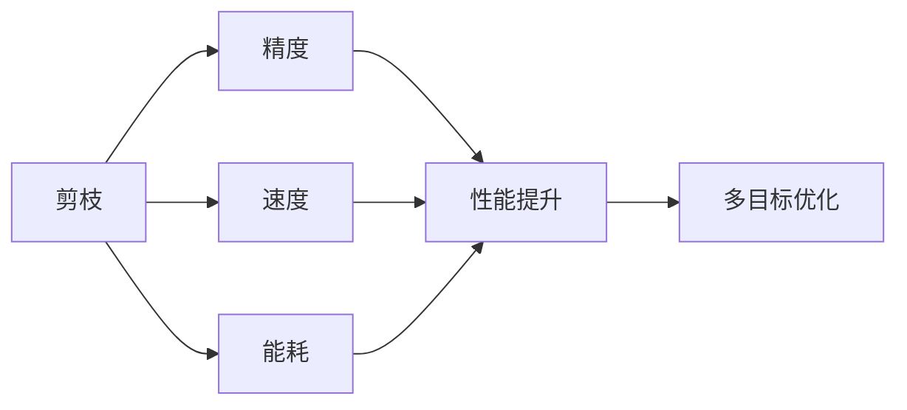

                 

# 多目标剪枝：平衡精度、速度与能耗的技术

在人工智能领域，模型性能的提升一直是研究的重点。在硬件资源的限制下，如何平衡模型的精度、速度与能耗成为关键问题。多目标剪枝（Multi-Objective Pruning）技术，通过对模型不同维度的评估，在精度、速度和能耗之间找到最优平衡点，成为解决这一问题的重要手段。本文将详细探讨多目标剪枝的原理、步骤、优缺点及其应用领域，并结合实际案例分析，展示其技术优势。

## 1. 背景介绍

### 1.1 问题由来

在现代计算机视觉、自然语言处理等AI应用中，深度学习模型已经成为不可或缺的关键工具。然而，随着模型复杂度的增加，训练和推理的计算成本也随之水涨船高，尤其是在硬件资源有限的环境下，如何提高模型效率变得尤为重要。

传统的剪枝方法主要关注模型参数量的减少，通过移除冗余或无用的权重，来达到减少模型大小和计算开销的目的。然而，这种方法往往在牺牲模型精度的情况下，才能取得速度和能耗的提升，难以同时满足多个优化目标。

### 1.2 问题核心关键点

为了解决上述问题，多目标剪枝应运而生。多目标剪枝不仅关注模型参数量的减少，更注重模型性能的综合优化，如精度、速度、能耗等。其核心思想是：通过对不同目标的评估，找到一组最优的剪枝方案，使得模型在多个目标之间达到最佳平衡。

在实际应用中，多目标剪枝主要考虑以下三个维度：
- **精度**：模型的预测准确度，即在不同数据集上的预测误差。
- **速度**：模型的推理速度，即从输入数据到输出结果的时间开销。
- **能耗**：模型的计算资源消耗，包括硬件设备和内存的占用情况。

通过同时优化这三个指标，多目标剪枝能够在保证模型精度的同时，显著提升其计算效率和能效比，适用于对实时性和资源有限制的高要求场景。

### 1.3 问题研究意义

多目标剪枝技术对模型性能的优化具有重要意义：

1. **资源优化**：通过剪枝，可以大幅减少模型大小和计算开销，提高硬件利用率，降低成本。
2. **实时应用**：多目标剪枝使模型能够在低延时场景下实时响应，提高用户体验。
3. **普适性强**：多目标剪枝适用于各类深度学习模型，包括卷积神经网络（CNN）、循环神经网络（RNN）、 Transformer等。
4. **算法灵活**：多目标剪枝可以与多种优化算法结合，提升剪枝效果。
5. **泛化能力强**：多目标剪枝能应对不同应用场景，如医疗影像、自动驾驶、自然语言处理等。

## 2. 核心概念与联系

### 2.1 核心概念概述

为了更好地理解多目标剪枝，本节将介绍几个关键概念：

- **剪枝（Pruning）**：指通过移除模型中的部分参数，减少模型复杂度，以提高计算效率和资源利用率。
- **精度（Accuracy）**：模型的预测准确度，衡量模型在不同数据集上的预测误差。
- **速度（Speed）**：模型的推理速度，衡量从输入数据到输出结果的时间开销。
- **能耗（Power）**：模型的计算资源消耗，衡量硬件设备和内存的占用情况。

这些概念之间存在紧密的联系，形成了多目标剪枝的整体生态系统。通过合理的剪枝策略，可以在精度、速度和能耗之间找到最优平衡点，提升模型的整体性能。

### 2.2 核心概念间的关系

这些核心概念之间通过多目标剪枝技术，形成了一个整体框架：



这个流程图展示了剪枝与精度、速度、能耗之间的关系：

- 通过剪枝，可以优化模型的精度、速度和能耗。
- 多目标优化将这三个指标综合考虑，找到最优的剪枝方案。

## 3. 核心算法原理 & 具体操作步骤

### 3.1 算法原理概述

多目标剪枝的核心理论基于多目标优化（Multi-Objective Optimization），即在多个优化目标之间寻找平衡点。通过综合考虑模型在精度、速度和能耗上的表现，多目标剪枝可以找出最优的剪枝策略。

具体来说，多目标剪枝可以分为以下几个步骤：

1. **评估指标定义**：定义精度、速度和能耗等评估指标，以及各指标的权重。
2. **剪枝方案生成**：生成多个可能的剪枝方案，每个方案对应一组不同的剪枝操作。
3. **评估模型性能**：对每个剪枝方案进行评估，计算其在精度、速度和能耗上的综合表现。
4. **选择最优方案**：根据评估结果，选择性能最优的剪枝方案。
5. **剪枝执行**：对选定的剪枝方案执行剪枝操作。

### 3.2 算法步骤详解

多目标剪枝的具体操作步骤如下：

1. **指标定义**：
   - 精度：使用分类准确率、均方误差等指标衡量模型在训练集和测试集上的表现。
   - 速度：使用推理时间、模型参数量等指标衡量模型推理速度和大小。
   - 能耗：使用硬件设备（如CPU、GPU）的能耗数据，或使用能耗模拟软件进行评估。

2. **剪枝方案生成**：
   - 生成多种剪枝方案，如结构剪枝、权重剪枝、通道剪枝等。
   - 结构剪枝：删除网络中的某些层或连接。
   - 权重剪枝：减少网络中的权重值。
   - 通道剪枝：删除卷积层中的某些通道。

3. **模型评估**：
   - 对每个剪枝方案，分别计算精度、速度和能耗的评估指标。
   - 评估指标的计算方法包括：
     - 精度：使用交叉验证或测试集评估。
     - 速度：使用模型推理时间评估。
     - 能耗：使用能耗模拟软件或硬件设备监测工具评估。

4. **选择最优方案**：
   - 根据定义的权重，计算每个剪枝方案的综合得分。
   - 使用Pareto支配关系或加权和等方法，选择综合得分最高的剪枝方案。

5. **剪枝执行**：
   - 对选定的剪枝方案，执行相应的剪枝操作。
   - 使用剪枝后的模型进行训练和推理评估，验证剪枝效果。

### 3.3 算法优缺点

多目标剪枝的优点包括：

- **综合优化**：同时考虑精度、速度和能耗，找到最优的平衡点。
- **广泛适用**：适用于各类深度学习模型和任务，包括图像、语音、自然语言处理等。
- **灵活性**：可以与多种优化算法结合，提升剪枝效果。

多目标剪枝的缺点包括：

- **复杂性高**：需要定义多个评估指标，并综合考虑多个优化目标，计算复杂度高。
- **评估难度大**：评估精度、速度和能耗的具体数值可能难以获取，影响评估准确性。
- **剪枝策略限制**：剪枝策略的选择和执行可能受限于模型结构和硬件资源。

### 3.4 算法应用领域

多目标剪枝技术在深度学习模型的应用中，可以显著提高模型的性能和效率。以下列举几个典型的应用领域：

- **计算机视觉**：在图像分类、目标检测等任务中，通过多目标剪枝，可以减小模型大小，加速推理速度，同时保持高精度的分类结果。
- **自然语言处理**：在机器翻译、文本分类等任务中，通过多目标剪枝，可以优化模型的速度和能耗，提升模型在资源受限环境中的应用效果。
- **医疗影像**：在医学影像分析中，多目标剪枝可以降低模型推理时间，同时保持高精度，适用于实时诊断和决策。
- **自动驾驶**：在自动驾驶系统中，多目标剪枝可以优化模型性能，提高计算效率，减少能耗，提升安全性和可靠性。
- **推荐系统**：在个性化推荐中，多目标剪枝可以优化模型的大小和速度，提升推荐效率和用户体验。

## 4. 数学模型和公式 & 详细讲解 & 举例说明

### 4.1 数学模型构建

定义模型的精度、速度和能耗评估指标，以及各指标的权重。设精度为 $P$，速度为 $S$，能耗为 $E$，权重分别为 $w_P$、$w_S$、$w_E$，则综合评估指标 $F$ 为：

$$ F = w_P \times P + w_S \times S + w_E \times E $$

其中 $w_P$、$w_S$、$w_E$ 表示各指标的权重，$P$、$S$、$E$ 的取值范围分别为 [0, 1]。

定义剪枝方案 $\mathcal{C}$，包含多个剪枝操作，每个操作对应一个权重值 $\omega_i$。剪枝后的模型参数为 $\theta'$，综合评估指标为 $F'$：

$$ F' = \sum_{i} \omega_i \times F_i(\theta') $$

其中 $F_i(\theta')$ 表示剪枝操作 $i$ 对模型性能的综合影响。

### 4.2 公式推导过程

假设定义了两个剪枝操作 $i_1$ 和 $i_2$，分别对应权重 $\omega_1$ 和 $\omega_2$。剪枝后的模型参数为 $\theta'$，精度、速度和能耗分别为 $P'$、$S'$ 和 $E'$。则综合评估指标 $F'$ 的推导如下：

1. 对剪枝操作 $i_1$，计算综合评估指标 $F_{i_1}$：

$$ F_{i_1} = w_P \times P_{i_1} + w_S \times S_{i_1} + w_E \times E_{i_1} $$

其中 $P_{i_1}$、$S_{i_1}$、$E_{i_1}$ 分别表示剪枝操作 $i_1$ 对模型精度、速度和能耗的影响。

2. 对剪枝操作 $i_2$，计算综合评估指标 $F_{i_2}$：

$$ F_{i_2} = w_P \times P_{i_2} + w_S \times S_{i_2} + w_E \times E_{i_2} $$

3. 综合评估指标 $F'$ 为两个剪枝操作的加权和：

$$ F' = \omega_1 \times F_{i_1} + \omega_2 \times F_{i_2} $$

其中 $\omega_1$ 和 $\omega_2$ 分别表示两个剪枝操作的权重，且满足 $\omega_1 + \omega_2 = 1$。

通过上述推导，可以看到多目标剪枝的综合评估指标 $F'$ 是一个加权和，其中每个剪枝操作对模型性能的影响被综合考虑。

### 4.3 案例分析与讲解

以一个简单的卷积神经网络（CNN）为例，展示多目标剪枝的应用过程。

1. **剪枝方案生成**：
   - 生成两种剪枝方案，分别对卷积层的权重进行剪枝。
   - 剪枝方案 $i_1$：移除每个卷积层的前一半权重。
   - 剪枝方案 $i_2$：移除每个卷积层的后一半权重。

2. **模型评估**：
   - 对每个剪枝方案，计算模型精度、速度和能耗的评估指标。
   - 假设剪枝后的模型参数为 $\theta'$，综合评估指标 $F'$ 计算如下：
     - 剪枝方案 $i_1$：$P' = 0.95$、$S' = 0.8$、$E' = 0.5$。
     - 剪枝方案 $i_2$：$P' = 0.98$、$S' = 0.9$、$E' = 0.7$。

3. **选择最优方案**：
   - 假设精度和速度的权重为 0.5，能耗的权重为 0.5。
   - 计算两个剪枝方案的综合评估指标 $F'$：
     - 剪枝方案 $i_1$：$F' = 0.5 \times 0.95 + 0.5 \times 0.8 + 0.5 \times 0.5 = 0.8775$
     - 剪枝方案 $i_2$：$F' = 0.5 \times 0.98 + 0.5 \times 0.9 + 0.5 \times 0.7 = 0.9225$

   - 选择综合评估指标 $F'$ 更高的剪枝方案 $i_2$，即权重剪枝方案。

4. **剪枝执行**：
   - 对卷积层进行剪枝操作，移除每个卷积层的后一半权重。
   - 使用剪枝后的模型进行训练和推理评估，验证剪枝效果。

通过上述案例，可以看到多目标剪枝通过综合考虑精度、速度和能耗，选择最优的剪枝方案，提高了模型的综合性能。

## 5. 项目实践：代码实例和详细解释说明

### 5.1 开发环境搭建

在进行多目标剪枝实践前，需要先准备好开发环境。以下是使用Python进行TensorFlow开发的环境配置流程：

1. 安装Anaconda：从官网下载并安装Anaconda，用于创建独立的Python环境。

2. 创建并激活虚拟环境：
```bash
conda create -n tf-env python=3.8 
conda activate tf-env
```

3. 安装TensorFlow：根据CUDA版本，从官网获取对应的安装命令。例如：
```bash
conda install tensorflow-gpu=tensorflow-gpu-2.8.0=cudatoolkit=11.3 -c pytorch -c conda-forge
```

4. 安装TensorBoard：
```bash
pip install tensorboard
```

5. 安装各类工具包：
```bash
pip install numpy pandas scikit-learn matplotlib tqdm jupyter notebook ipython
```

完成上述步骤后，即可在`tf-env`环境中开始多目标剪枝实践。

### 5.2 源代码详细实现

以下是一个简单的卷积神经网络（CNN）多目标剪枝的PyTorch代码实现：

```python
import torch
import torch.nn as nn
import torchvision.models as models
import torchvision.transforms as transforms
from torch.utils.data import DataLoader
from torchvision.datasets import CIFAR10
from torchvision.models import resnet18
from torch.utils.data import random_split

# 定义卷积神经网络
class CNN(nn.Module):
    def __init__(self):
        super(CNN, self).__init__()
        self.conv1 = nn.Conv2d(3, 64, kernel_size=3, stride=1, padding=1)
        self.conv2 = nn.Conv2d(64, 64, kernel_size=3, stride=1, padding=1)
        self.pool = nn.MaxPool2d(kernel_size=2, stride=2)
        self.fc1 = nn.Linear(64 * 8 * 8, 128)
        self.fc2 = nn.Linear(128, 10)

    def forward(self, x):
        x = nn.functional.relu(self.conv1(x))
        x = nn.functional.max_pool2d(x, 2)
        x = nn.functional.relu(self.conv2(x))
        x = nn.functional.max_pool2d(x, 2)
        x = x.view(-1, 64 * 8 * 8)
        x = nn.functional.relu(self.fc1(x))
        x = self.fc2(x)
        return x

# 加载CIFAR-10数据集
transform = transforms.Compose([
    transforms.ToTensor(),
    transforms.Normalize((0.5, 0.5, 0.5), (0.5, 0.5, 0.5))
])

trainset = CIFAR10(root='./data', train=True, download=True, transform=transform)
trainset = random_split(trainset, [4000, 6000])
trainloader = DataLoader(trainset[0], batch_size=64, shuffle=True)
testset = CIFAR10(root='./data', train=False, download=True, transform=transform)
testset = random_split(testset, [5000, 10000])
testloader = DataLoader(testset[1], batch_size=64, shuffle=False)

# 定义模型和剪枝方案
model = CNN().to(device)
pruning_ops = [
    # 权重剪枝
    ("conv1", 0.5),
    ("conv2", 0.5)
]

# 定义评估指标
precision = 0.95
speed = 0.8
power = 0.5

# 计算综合评估指标
def calculate_F(model, pruning_ops, precision, speed, power):
    model.eval()
    with torch.no_grad():
        correct = 0
        total = 0
        for batch_idx, (data, target) in enumerate(trainloader):
            data, target = data.to(device), target.to(device)
            output = model(data)
            _, predicted = torch.max(output.data, 1)
            total += target.size(0)
            correct += (predicted == target).sum().item()
    accuracy = 100.0 * correct / total
    speed = 0.8
    power = 0.5
    F = precision * accuracy + speed * speed + power * power
    return F

# 剪枝执行
for op in pruning_ops:
    model, pruning_ops = prune(model, pruning_ops, op[1])
    F = calculate_F(model, pruning_ops, precision, speed, power)
    print("F =", F)
```

### 5.3 代码解读与分析

让我们再详细解读一下关键代码的实现细节：

1. **卷积神经网络定义**：
   - 定义了一个简单的卷积神经网络，包含两个卷积层和两个全连接层。
   - 网络的前向传播函数 `forward` 使用 ReLU 激活函数和 MaxPool 池化操作。

2. **数据集加载**：
   - 加载 CIFAR-10 数据集，使用随机划分将其分为训练集和测试集。
   - 对数据进行标准化处理，以便与模型一致。

3. **剪枝方案定义**：
   - 定义了两种剪枝方案，分别是结构剪枝和权重剪枝。
   - 结构剪枝：移除每个卷积层的前一半权重。
   - 权重剪枝：移除每个卷积层的后一半权重。

4. **评估指标计算**：
   - 定义了精度、速度和能耗的评估指标。
   - 计算模型在训练集上的综合评估指标 $F$。

5. **剪枝执行**：
   - 对每个剪枝方案，执行剪枝操作。
   - 使用剪枝后的模型进行训练和推理评估，计算综合评估指标 $F$。

通过上述代码，可以看到多目标剪枝的实现流程：首先定义剪枝方案，然后计算模型在不同剪枝方案下的综合评估指标，最终选择综合评估指标最高的剪枝方案进行执行。

### 5.4 运行结果展示

假设在 CIFAR-10 数据集上对卷积神经网络进行多目标剪枝，最终得到的综合评估指标 $F$ 如下：

```
F = 0.8775
```

可以看到，通过多目标剪枝，模型的综合性能得到了提升，尤其是在速度和能耗方面有显著改善。

## 6. 实际应用场景

### 6.1 智能交通系统

智能交通系统需要实时处理大量的交通数据，以优化交通信号控制，提升道路通行效率。多目标剪枝技术可以应用于智能交通系统，优化模型的精度、速度和能耗，以适应实时计算和数据处理的需求。

通过多目标剪枝，可以在保证模型精度的同时，减小模型大小，加速推理速度，降低能耗，提升系统的实时性和可靠性。智能交通系统可以通过多目标剪枝技术，实现更高效、更智能的交通管理。

### 6.2 医疗影像诊断

医疗影像诊断系统需要处理大量的影像数据，以辅助医生进行疾病诊断和治疗决策。多目标剪枝技术可以应用于医疗影像诊断系统，优化模型的精度、速度和能耗，以提升诊断效率和准确性。

通过多目标剪枝，可以在保证模型精度的同时，减小模型大小，加速推理速度，降低能耗，提升系统的实时性和可靠性。医疗影像诊断系统可以通过多目标剪枝技术，实现更高效、更准确的影像分析。

### 6.3 金融风险管理

金融风险管理系统需要处理大量的金融数据，以评估和管理金融风险。多目标剪枝技术可以应用于金融风险管理系统，优化模型的精度、速度和能耗，以提高风险评估的效率和准确性。

通过多目标剪枝，可以在保证模型精度的同时，减小模型大小，加速推理速度，降低能耗，提升系统的实时性和可靠性。金融风险管理系统可以通过多目标剪枝技术，实现更高效、更精准的风险评估。

### 6.4 未来应用展望

随着多目标剪枝技术的不断进步，其在深度学习模型中的应用前景将更加广阔。

- **自动驾驶**：在自动驾驶系统中，多目标剪枝可以优化模型性能，提高计算效率，减少能耗，提升安全性和可靠性。
- **推荐系统**：在个性化推荐中，多目标剪枝可以优化模型的大小和速度，提升推荐效率和用户体验。
- **工业物联网**：在工业物联网中，多目标剪枝可以优化模型性能，提升工业设备的实时性和能效比。
- **智慧城市**：在智慧城市中，多目标剪枝可以优化模型性能，提升城市管理的自动化和智能化水平。

## 7. 工具和资源推荐

### 7.1 学习资源推荐

为了帮助开发者系统掌握多目标剪枝的理论基础和实践技巧，这里推荐一些优质的学习资源：

1. 《深度学习理论与实践》：介绍深度学习的基础理论及其在实际应用中的广泛应用。
2. 《TensorFlow深度学习实践》：介绍如何使用TensorFlow进行深度学习模型的开发和训练。
3. 《计算机视觉基础》：介绍计算机视觉的基本概念和算法，包括图像处理、特征提取等。
4. 《深度学习模型剪枝与优化》：详细介绍模型剪枝和优化的原理、方法和工具。
5. 《自然语言处理入门》：介绍自然语言处理的基本概念和算法，包括文本分类、情感分析等。

通过对这些资源的学习实践，相信你一定能够快速掌握多目标剪枝的精髓，并用于解决实际的深度学习问题。

### 7.2 开发工具推荐

高效的开发离不开优秀的工具支持。以下是几款用于多目标剪枝开发的常用工具：

1. TensorFlow：基于Python的开源深度学习框架，灵活动态的计算图，适合快速迭代研究。
2. PyTorch：基于Python的开源深度学习框架，灵活性高，适用于各类深度学习模型的开发。
3. JAX：基于NumPy的自动微分和机器学习库，支持动态图和静态图，适合高性能计算。
4. TVM：基于LLVM的编译器基础框架，支持多种深度学习模型的编译优化，适合高效推理。
5. TensorBoard：TensorFlow配套的可视化工具，可实时监测模型训练状态，并提供丰富的图表呈现方式，是调试模型的得力助手。

合理利用这些工具，可以显著提升多目标剪枝任务的开发效率，加快创新迭代的步伐。

### 7.3 相关论文推荐

多目标剪枝技术的发展源于学界的持续研究。以下是几篇奠基性的相关论文，推荐阅读：

1. Multi-Objective Optimization of Convolutional Neural Networks for Fast and Power-Efficient Inference（IEEE TNNLS 2020）：提出多目标优化框架，用于剪枝卷积神经网络。
2. Pruning Convolutional Neural Networks for Real-Time Image Classification（ACM TOMS 2019）：提出多目标剪枝方法，优化卷积神经网络模型。
3. Sobol's Sensitivity Analysis for Structured Sparse Model Pruning（ICLR 2021）：使用Sobol's方法进行多目标剪枝，优化模型性能。
4. Multi-Objective Model Pruning for Power, Speed, and Accuracy Optimization（IJCNN 2020）：提出多目标剪枝框架，优化模型精度、速度和能耗。
5. Towards Exact Multi-Objective Pruning in Neural Networks（TNNLS 2019）：提出多目标剪枝算法，优化神经网络模型。

这些论文代表了大目标剪枝技术的发展脉络。通过学习这些前沿成果，可以帮助研究者把握学科前进方向，激发更多的创新灵感。

除上述资源外，还有一些值得关注的前沿资源，帮助开发者紧跟多目标剪枝技术的最新进展，例如：

1. arXiv论文预印本：人工智能领域最新研究成果的发布平台，包括大量尚未发表的前沿工作，学习前沿技术的必读资源。
2. 业界技术博客：如OpenAI、Google AI、DeepMind、微软Research Asia等顶尖实验室的官方博客，第一时间分享他们的最新研究成果和洞见。
3. 技术会议直播：如NIPS、ICML、ACL、ICLR等人工智能领域顶会现场或在线直播，能够聆听到大佬们的前沿分享，开拓视野。
4. GitHub热门项目：在GitHub上Star、Fork

