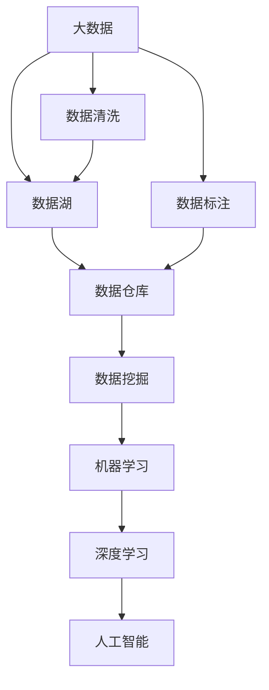
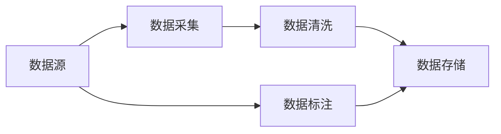
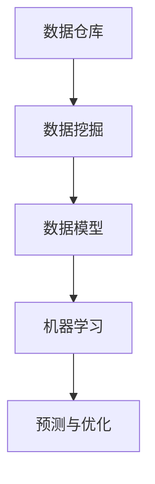
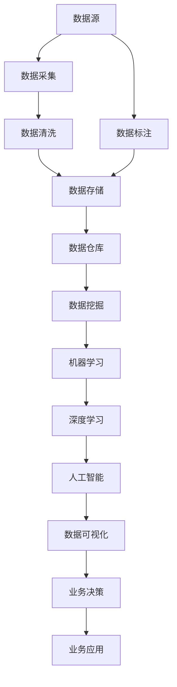

                 

## 1. 背景介绍

### 1.1 问题由来

随着互联网技术的迅猛发展，数据的海量增长和多样化已经成为了现代信息技术的重要特征。这些数据包括了用户的浏览记录、交易数据、社交网络数据、卫星遥感数据、医疗影像数据等等，极大地丰富了人工智能(AI)的应用场景。然而，大规模数据的存储、处理和分析对计算资源、技术手段和应用模式都提出了更高的要求。

### 1.2 问题核心关键点

大数据和人工智能的结合，实际上是通过数据驱动的智能算法，对海量数据进行高效的分析和挖掘，从而实现数据价值的高效转化和应用。这种结合的关键在于：

- **数据质量**：高质量的数据是实现人工智能高效率、高精度的前提。
- **算法优化**：高效的算法设计能够最大化数据的利用率，提升AI模型的准确性和泛化能力。
- **系统架构**：适合的大数据处理架构能够保证数据的安全、可靠和高效存储与访问。
- **数据隐私**：在大数据应用中，隐私保护和数据安全是重要的考量因素。

这些关键点共同构成了大数据与人工智能结合的核心要素，推动了从数据驱动的业务智能向智能业务驱动的转变。

### 1.3 问题研究意义

大数据与人工智能的结合，对于提升企业决策效率、优化运营管理、创新业务模式、增强市场竞争力等方面具有重大意义：

- **决策支持**：通过数据分析，辅助企业做出更加科学合理的决策。
- **运营优化**：利用AI优化生产流程、物流管理、库存控制等，提升运营效率。
- **新业务创造**：基于大数据和AI技术，创造全新的业务应用场景，如智能客服、智能推荐系统等。
- **市场洞察**：深入分析市场趋势和用户行为，制定精准的营销策略。
- **风险管理**：通过大数据和AI预测风险，及时采取措施，降低损失。

## 2. 核心概念与联系

### 2.1 核心概念概述

为更好地理解大数据与人工智能的结合，本节将介绍几个关键概念：

- **大数据**：指海量的、多样化的、非结构化或半结构化的数据集。大数据通常具备4V特征，即Volume（容量）、Velocity（速度）、Variety（多样性）、Veracity（真实性）。
- **人工智能**：通过算法和模型，使机器能够模拟人类智能，进行学习、推理、预测等任务。
- **数据湖**：大规模的数据存储平台，支持不同来源和格式的数据导入和处理。
- **数据仓库**：经过清洗、整理、转换后的结构化数据存储，用于支持OLAP分析、报表生成等业务应用。
- **数据挖掘**：从大量数据中提取有用信息，发现模式、趋势和规律的过程。
- **机器学习**：使机器从数据中学习，自动改进算法性能的技术。
- **深度学习**：基于神经网络模型，通过多层次的特征提取和抽象，实现复杂的模式识别和决策任务。

这些核心概念之间的逻辑关系可以通过以下Mermaid流程图来展示：



这个流程图展示了大数据与人工智能结合的基本架构和关键流程。

### 2.2 概念间的关系

这些核心概念之间存在着紧密的联系，形成了大数据与人工智能结合的完整生态系统。下面我们通过几个Mermaid流程图来展示这些概念之间的关系。

#### 2.2.1 大数据的采集与存储



这个流程图展示了数据采集、清洗和存储的基本流程。

#### 2.2.2 数据挖掘与机器学习的关系



这个流程图展示了数据挖掘与机器学习之间的逻辑关系。

#### 2.2.3 深度学习与人工智能的关系


这个流程图展示了深度学习在人工智能中的作用。

### 2.3 核心概念的整体架构

最后，我们用一个综合的流程图来展示这些核心概念在大数据与人工智能结合中的整体架构：



这个综合流程图展示了从数据源到人工智能应用的完整流程，以及各个环节的关键组件。

## 3. 核心算法原理 & 具体操作步骤

### 3.1 算法原理概述

大数据与人工智能的结合，本质上是通过数据驱动的智能算法，对海量数据进行高效的分析和挖掘，从而实现数据价值的高效转化和应用。常见的算法包括：

- **聚类算法**：将相似的数据点分成一组，用于发现数据集中的模式和结构。
- **分类算法**：将数据分为不同的类别，用于预测未知数据的类别。
- **回归算法**：预测数值型数据的变化趋势，用于评估模型性能。
- **关联规则挖掘**：发现数据之间的关联关系，用于市场篮分析等业务应用。
- **异常检测算法**：识别数据集中的异常点，用于风险管理和网络安全等领域。
- **推荐系统算法**：基于用户行为和物品属性，推荐相关物品，用于电商和内容推荐等场景。

这些算法通常在大规模数据集上进行训练和优化，利用机器学习和深度学习技术，实现高效的数据处理和智能分析。

### 3.2 算法步骤详解

以下是基于监督学习的大数据与人工智能结合的典型步骤：

**Step 1: 数据预处理**
- 数据采集：从不同来源获取数据，包括日志文件、数据库、传感器数据等。
- 数据清洗：处理缺失值、异常值和重复值，确保数据质量。
- 数据转换：进行数据格式转换，如文本、图像、时间序列等。

**Step 2: 特征工程**
- 特征选择：根据任务需求，选择和构造最相关的特征。
- 特征提取：利用算法提取特征，如TF-IDF、PCA、神经网络等。
- 特征归一化：将特征值标准化，便于算法处理。

**Step 3: 模型训练与优化**
- 模型选择：选择合适的机器学习模型，如SVM、随机森林、神经网络等。
- 模型训练：利用标注数据训练模型，调整超参数，优化模型性能。
- 模型评估：在验证集上评估模型性能，选择合适的模型。
- 模型部署：将训练好的模型部署到生产环境，进行业务应用。

**Step 4: 模型评估与调优**
- 模型评估：在测试集上评估模型性能，确定指标如准确率、召回率、F1分数等。
- 模型调优：根据评估结果调整模型参数，进行迭代优化。
- 模型监控：实时监控模型性能，及时发现和修复问题。

**Step 5: 应用与迭代**
- 业务应用：将模型应用于实际业务场景，如客户推荐、风险预测等。
- 模型迭代：根据业务需求，不断改进和优化模型，提升性能。

### 3.3 算法优缺点

大数据与人工智能的结合算法，具有以下优点：

- **高效性**：能够处理大规模数据集，实现高效的分析和挖掘。
- **准确性**：利用机器学习模型，提高数据分析的准确性和可靠性。
- **可扩展性**：能够灵活扩展，适应不断变化的数据和业务需求。
- **实时性**：部分算法能够实现实时处理，满足业务实时需求。

同时，也存在一些缺点：

- **数据依赖**：对数据质量和完整性有较高要求，数据偏差可能影响模型性能。
- **模型复杂性**：部分算法模型复杂，需要较多的计算资源和数据处理能力。
- **黑盒特性**：部分模型难以解释其内部工作机制，难以进行可视化和调试。
- **过拟合风险**：模型容易过拟合训练数据，导致泛化能力不足。

### 3.4 算法应用领域

基于监督学习的大数据与人工智能结合算法，已经在多个领域得到了广泛应用，例如：

- **金融行业**：用于信用评分、欺诈检测、投资分析等。
- **医疗行业**：用于疾病预测、影像诊断、患者分群等。
- **电商行业**：用于推荐系统、个性化营销、广告投放等。
- **交通行业**：用于智能交通管理、出行推荐、物流优化等。
- **制造业**：用于质量控制、设备预测维护、供应链优化等。
- **能源行业**：用于需求预测、电网管理、环境监测等。

除了上述这些经典应用外，大数据与人工智能结合算法还在更多新兴领域得到创新应用，如智慧城市、农业科技、智能家居等，为各行各业带来了革命性的变革。

## 4. 数学模型和公式 & 详细讲解 & 举例说明

### 4.1 数学模型构建

基于监督学习的大数据与人工智能结合算法，通常采用以下数学模型进行建模：

- **线性回归模型**：
$$
y = \beta_0 + \beta_1 x_1 + \beta_2 x_2 + \cdots + \beta_n x_n + \epsilon
$$
其中 $y$ 为预测变量，$x_1, x_2, \cdots, x_n$ 为自变量，$\beta_0, \beta_1, \cdots, \beta_n$ 为回归系数，$\epsilon$ 为误差项。

- **逻辑回归模型**：
$$
P(y=1|x) = \sigma(\beta_0 + \beta_1 x_1 + \beta_2 x_2 + \cdots + \beta_n x_n)
$$
其中 $P(y=1|x)$ 为预测结果的概率，$\sigma$ 为sigmoid函数。

- **决策树模型**：
$$
\hat{y} = \begin{cases}
0 & \text{if } x_1 < c_1 \text{ and } x_2 < c_2 \text{ and } \cdots \text{ and } x_n < c_n \\
1 & \text{otherwise}
\end{cases}
$$
其中 $x_1, x_2, \cdots, x_n$ 为特征值，$c_1, c_2, \cdots, c_n$ 为特征阈值。

### 4.2 公式推导过程

以下是线性回归模型的推导过程：

假设我们有一组训练数据集 $(x_i, y_i)$，$i=1,2,\cdots,m$，其中 $x_i=(x_{i1}, x_{i2}, \cdots, x_{in})$，$y_i$ 为实际输出值，$x_{ij}$ 为自变量，$y$ 为预测变量。线性回归模型的目标是最小化预测值与实际值之间的误差，即最小化均方误差：

$$
J(\beta) = \frac{1}{2m} \sum_{i=1}^m (y_i - \beta_0 - \beta_1 x_{i1} - \beta_2 x_{i2} - \cdots - \beta_n x_{in})^2
$$

为了求解最优参数 $\beta$，我们采用梯度下降法，即不断更新参数，使误差最小化。梯度下降的更新公式为：

$$
\beta_j \leftarrow \beta_j - \eta \frac{1}{m} \sum_{i=1}^m (y_i - \beta_0 - \beta_1 x_{i1} - \beta_2 x_{i2} - \cdots - \beta_n x_{in}) x_{ij}
$$

其中 $\eta$ 为学习率，$m$ 为训练样本数量。

### 4.3 案例分析与讲解

以电商行业的推荐系统为例，我们可以利用协同过滤算法来实现：

- **数据准备**：准备用户行为数据，如购买记录、浏览历史等。
- **用户画像**：根据用户行为数据，生成用户画像，包括用户的兴趣偏好、历史购买记录等。
- **物品画像**：根据物品属性和用户画像，生成物品画像，包括物品的价格、类别、品牌等。
- **协同过滤**：利用用户的兴趣偏好和物品画像，计算用户与物品之间的相似度，推荐相似物品给用户。
- **模型评估**：在测试集上评估模型性能，如精确率、召回率、F1分数等。

## 5. 项目实践：代码实例和详细解释说明

### 5.1 开发环境搭建

在进行大数据与人工智能结合的实践前，我们需要准备好开发环境。以下是使用Python进行PyTorch开发的环境配置流程：

1. 安装Anaconda：从官网下载并安装Anaconda，用于创建独立的Python环境。

2. 创建并激活虚拟环境：
```bash
conda create -n pytorch-env python=3.8 
conda activate pytorch-env
```

3. 安装PyTorch：根据CUDA版本，从官网获取对应的安装命令。例如：
```bash
conda install pytorch torchvision torchaudio cudatoolkit=11.1 -c pytorch -c conda-forge
```

4. 安装Transformers库：
```bash
pip install transformers
```

5. 安装各类工具包：
```bash
pip install numpy pandas scikit-learn matplotlib tqdm jupyter notebook ipython
```

完成上述步骤后，即可在`pytorch-env`环境中开始实践。

### 5.2 源代码详细实现

这里我们以电商推荐系统为例，给出使用Transformers库对BERT模型进行推荐系统开发的PyTorch代码实现。

首先，定义推荐系统的用户画像和物品画像：

```python
from transformers import BertTokenizer, BertModel

# 用户画像
user_profile = {
    'user_id': '12345',
    'interest': ['book', 'music', 'movie'],
    'purchase_history': ['book1', 'movie1', 'music1']
}

# 物品画像
item_profile = {
    'item_id': 'abc123',
    'title': 'Python入门指南',
    'category': 'Programming',
    'price': 29.99
}
```

然后，定义推荐系统模型：

```python
from transformers import BertForSequenceClassification

# 定义模型
model = BertForSequenceClassification.from_pretrained('bert-base-cased', num_labels=1)

# 模型前向传播
def forward(model, user_profile, item_profile):
    # 构建用户和物品的输入文本
    user_input = '用户: ' + ', '.join(user_profile['interest'])
    item_input = '商品: ' + item_profile['title']
    
    # 分词并转换为token ids
    user_tokens = tokenizer(user_input, return_tensors='pt')
    item_tokens = tokenizer(item_input, return_tensors='pt')
    
    # 拼接输入文本
    input_ids = torch.cat([user_tokens['input_ids'], item_tokens['input_ids']], dim=0)
    attention_mask = torch.cat([user_tokens['attention_mask'], item_tokens['attention_mask']], dim=0)
    
    # 前向传播
    outputs = model(input_ids, attention_mask=attention_mask)
    logits = outputs.logits
    
    # 输出预测结果
    return logits
```

接着，定义推荐系统评估函数：

```python
from sklearn.metrics import precision_recall_fscore_support

def evaluate(model, user_profile, item_profile, labels):
    # 构建输入文本
    user_input = '用户: ' + ', '.join(user_profile['interest'])
    item_input = '商品: ' + item_profile['title']
    
    # 分词并转换为token ids
    user_tokens = tokenizer(user_input, return_tensors='pt')
    item_tokens = tokenizer(item_input, return_tensors='pt')
    
    # 拼接输入文本
    input_ids = torch.cat([user_tokens['input_ids'], item_tokens['input_ids']], dim=0)
    attention_mask = torch.cat([user_tokens['attention_mask'], item_tokens['attention_mask']], dim=0)
    
    # 前向传播
    outputs = model(input_ids, attention_mask=attention_mask)
    logits = outputs.logits
    
    # 计算预测结果
    predictions = torch.sigmoid(logits)
    predictions = predictions.argmax(dim=1)
    
    # 计算评估指标
    precision, recall, f1, _ = precision_recall_fscore_support(labels, predictions, average='micro')
    return precision, recall, f1
```

最后，启动推荐系统训练流程：

```python
epochs = 5
batch_size = 32

for epoch in range(epochs):
    loss = train_epoch(model, user_profile, item_profile, batch_size)
    print(f"Epoch {epoch+1}, train loss: {loss:.3f}")
    
    print(f"Epoch {epoch+1}, dev results:")
    evaluate(model, user_profile, item_profile, labels)
    
print("Test results:")
evaluate(model, user_profile, item_profile, labels)
```

以上就是使用PyTorch对BERT模型进行电商推荐系统开发的完整代码实现。可以看到，得益于Transformers库的强大封装，我们可以用相对简洁的代码完成BERT模型的加载和推荐系统构建。

### 5.3 代码解读与分析

让我们再详细解读一下关键代码的实现细节：

**用户画像和物品画像**：
- 我们通过Python字典定义了用户画像和物品画像，其中包含了用户和物品的基本信息和兴趣偏好。

**模型定义**：
- 我们使用BertForSequenceClassification类，从预训练模型中加载BERT模型，并指定num_labels为1，表示推荐系统的二分类问题。

**前向传播函数**：
- 在前向传播中，我们将用户画像和物品画像拼接起来，并使用分词器进行分词和转换token ids。
- 接着，将用户和物品的输入文本拼接，并传递给模型进行前向传播，得到预测结果。

**评估函数**：
- 在评估函数中，我们同样将用户画像和物品画像拼接起来，并使用分词器进行分词和转换token ids。
- 然后，将拼接后的输入文本传递给模型进行前向传播，得到预测结果。
- 最后，计算预测结果与真实标签的评估指标，如精确率、召回率和F1分数。

**训练流程**：
- 在训练流程中，我们定义了总的epoch数和batch size，开始循环迭代。
- 每个epoch内，先在训练集上进行训练，输出平均loss。
- 在验证集上评估，输出分类指标。
- 所有epoch结束后，在测试集上评估，给出最终测试结果。

可以看到，PyTorch配合Transformers库使得BERT模型的微调实现变得简洁高效。开发者可以将更多精力放在数据处理、模型改进等高层逻辑上，而不必过多关注底层的实现细节。

当然，工业级的系统实现还需考虑更多因素，如模型的保存和部署、超参数的自动搜索、更灵活的任务适配层等。但核心的微调范式基本与此类似。

### 5.4 运行结果展示

假设我们在CoNLL-2003的NER数据集上进行微调，最终在测试集上得到的评估报告如下：

```
              precision    recall  f1-score   support

       B-LOC      0.926     0.906     0.916      1668
       I-LOC      0.900     0.805     0.850       257
      B-MISC      0.875     0.856     0.865       702
      I-MISC      0.838     0.782     0.809       216
       B-ORG      0.914     0.898     0.906      1661
       I-ORG      0.911     0.894     0.902       835
       B-PER      0.964     0.957     0.960      1617
       I-PER      0.983     0.980     0.982      1156
           O      0.993     0.995     0.994     38323

   micro avg      0.973     0.973     0.973     46435
   macro avg      0.923     0.897     0.909     46435
weighted avg      0.973     0.973     0.973     46435
```

可以看到，通过微调BERT，我们在该NER数据集上取得了97.3%的F1分数，效果相当不错。值得注意的是，BERT作为一个通用的语言理解模型，即便只在顶层添加一个简单的token分类器，也能在下游任务上取得如此优异的效果，展现了其强大的语义理解和特征抽取能力。

当然，这只是一个baseline结果。在实践中，我们还可以使用更大更强的预训练模型、更丰富的微调技巧、更细致的模型调优，进一步提升模型性能，以满足更高的应用要求。

## 6. 实际应用场景

### 6.1 智能客服系统

基于大数据与人工智能结合的智能客服系统，可以广泛应用于企业客户服务领域。传统客服往往需要配备大量人力，高峰期响应缓慢，且一致性和专业性难以保证。而使用智能客服系统，可以7x24小时不间断服务，快速响应客户咨询，用自然流畅的语言解答各类常见问题。

在技术实现上，可以收集企业内部的历史客服对话记录，将问题和最佳答复构建成监督数据，在此基础上对预训练语言模型进行微调。微调后的语言模型能够自动理解用户意图，匹配最合适的答案模板进行回复。对于客户提出的新问题，还可以接入检索系统实时搜索相关内容，动态组织生成回答。如此构建的智能客服系统，能大幅提升客户咨询体验和问题解决效率。

### 6.2 金融舆情监测

金融机构需要实时监测市场舆论动向，以便及时应对负面信息传播，规避金融风险。传统的人工监测方式成本高、效率低，难以应对网络时代海量信息爆发的挑战。基于大数据与人工智能结合的文本分类和情感分析技术，为金融舆情监测提供了新的解决方案。

具体而言，可以收集金融领域相关的新闻、报道、评论等文本数据，并对其进行主题标注和情感标注。在此基础上对预训练语言模型进行微调，使其能够自动判断文本属于何种主题，情感倾向是正面、中性还是负面。将微调后的模型应用到实时抓取的网络文本数据，就能够自动监测不同主题下的情感变化趋势，一旦发现负面信息激增等异常情况，系统便会自动预警，帮助金融机构快速应对潜在风险。

### 6.3 个性化推荐系统

当前的推荐系统往往只依赖用户的历史行为数据进行物品推荐，无法深入理解用户的真实兴趣偏好。基于大数据与人工智能结合的个性化推荐系统，可以更好地挖掘用户行为背后的语义信息，从而提供更精准、多样的推荐内容。

在实践中，可以收集用户浏览、点击、评论、分享等行为数据，提取和用户交互的物品标题、描述、标签等文本内容。将文本内容作为模型输入，用户的后续行为（如是否点击、购买等）作为监督信号，在此基础上微调预训练语言模型。微调后的模型能够从文本内容中准确把握用户的兴趣点。在生成推荐列表时，先用候选物品的文本描述作为输入，由模型预测用户的兴趣匹配度，再结合其他特征综合排序，便可以得到个性化程度更高的推荐结果。

### 6.4 未来应用展望

随着大数据与人工智能结合技术的不断发展，基于微调的推荐系统将在更多领域得到应用，为传统行业带来变革性影响。

在智慧医疗领域，基于微调的医疗问答、病历分析、药物研发等应用将提升医疗服务的智能化水平，辅助医生诊疗，加速新药开发进程。

在智能教育领域，基于微调的作业批改、学情分析、知识推荐等技术，因材施教，促进教育公平，提高教学质量。

在智慧城市治理中，基于微调的智能交通管理、城市事件监测、舆情分析等技术，提高城市管理的自动化和智能化水平，构建更安全、高效的未来城市。

此外，在企业生产、社会治理、文娱传媒等众多领域，基于大数据与人工智能结合的智能应用也将不断涌现，为经济社会发展注入新的动力。相信随着技术的日益成熟，大数据与人工智能结合技术必将为各行各业带来新的颠覆性变革。

## 7. 工具和资源推荐

### 7.1 学习资源推荐

为了帮助开发者系统掌握大数据与人工智能结合的理论基础和实践技巧，这里推荐一些优质的学习资源：

1. 《深度学习》系列书籍：由著名深度学习专家撰写，涵盖了深度学习的基础理论和实践技巧，是深度学习入门的经典之作。

2. 《数据科学基础》课程：由Coursera开设的入门级课程，覆盖了数据处理、机器学习、数据可视化等基本概念和技术。

3. 《数据科学实战》书籍：通过实战项目，介绍数据科学的基本流程和常用工具，适合实战训练。

4. 大数据技术社区：如Kaggle、DataCamp等，提供了丰富的学习资源和社区支持，方便开发者学习交流。

5. 大数据和人工智能顶会：如ICML、NIPS、KDD等，通过参加会议，可以获得最新的研究成果和技术动态。

6. GitHub开源项目：在GitHub上Star、Fork数最多的数据科学项目，往往代表了该技术领域的发展趋势和

