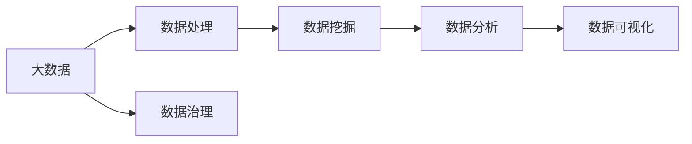
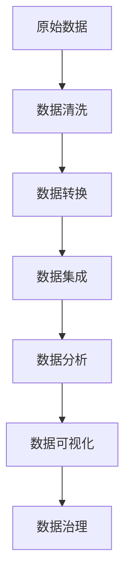

                 

# 大数据分析 原理与代码实例讲解

> 关键词：大数据、数据分析、数据处理、机器学习、数据挖掘、可视化、案例分析

## 1. 背景介绍

### 1.1 问题由来

随着互联网的普及和信息技术的快速发展，全球数据量呈现出爆炸式增长态势。据国际数据公司（IDC）统计，全球数据量正以每年40%的速率快速增长，预计到2025年将达到175ZB。这种海量数据的生成和积累，给各行各业带来了前所未有的挑战和机遇。一方面，数据能够为决策提供精准依据，优化业务流程，提升服务质量；另一方面，如何高效地处理和分析这些数据，成为制约企业发展的关键。

大数据分析（Big Data Analytics）作为一种数据驱动的决策方法，通过对海量数据进行清洗、转换、分析，从中挖掘出有价值的知识和洞见，为企业决策提供有力支持。大数据分析技术在金融、医疗、零售、物流、互联网等领域已得到广泛应用，极大地提升了企业运营效率和服务质量。

### 1.2 问题核心关键点

大数据分析的核心在于通过对海量数据进行高效处理和深入分析，从中提取有价值的信息和洞见，为企业决策提供依据。大数据分析的主要关键点包括：

- 数据处理：对海量数据进行清洗、转换和集成，生成分析所需的数据集。
- 数据挖掘：利用机器学习、统计学等方法，挖掘数据中的模式、规律和关联。
- 数据分析：应用数据分析工具和技术，对数据进行深入挖掘和解释，获得有价值的洞见。
- 数据可视化：将分析结果以直观的形式展示出来，帮助决策者理解并应用这些洞见。
- 数据治理：确保数据质量和完整性，建立数据标准和规范，保障数据安全。

### 1.3 问题研究意义

研究大数据分析技术，对于提升企业数据处理能力、优化决策过程、推动业务创新具有重要意义：

1. **提升决策质量**：通过数据驱动的决策方法，确保企业决策基于准确、可靠的数据，减少决策失误。
2. **优化运营效率**：利用大数据分析优化业务流程，降低成本，提升效率。
3. **创新业务模式**：通过大数据分析，发现新的市场机会，创新业务模式，推动企业转型升级。
4. **增强竞争优势**：利用大数据分析，挖掘和应用竞争对手数据，制定更有效的竞争策略。
5. **改善客户体验**：利用大数据分析，深入了解客户需求和行为，提供个性化服务，提升客户满意度。

## 2. 核心概念与联系

### 2.1 核心概念概述

为了更好地理解大数据分析的核心概念，本节将介绍几个密切相关的核心概念：

- **大数据**：指无法在传统数据处理技术（如关系数据库）中获取、管理、处理和分析的数据集合。其具有海量化、多样化、快速变化等特性。
- **数据挖掘**：指从海量数据中提取有用信息、发现模式、趋势和关联的过程。数据挖掘技术通常用于预测、分类、聚类等。
- **数据分析**：指对数据进行深入挖掘、分析和解释，从中提取有价值的洞见。数据分析通常包括描述性分析、诊断性分析、预测性分析和规范性分析。
- **数据可视化**：指将数据分析结果以图表、图形等形式展示出来，帮助决策者理解和应用洞见。数据可视化技术包括静态和动态可视化。
- **数据治理**：指确保数据质量、完整性和安全性，建立数据标准和规范，保障数据流动的顺畅和安全。数据治理通常涉及数据采集、数据存储、数据管理和数据共享等方面。

这些核心概念之间的逻辑关系可以通过以下Mermaid流程图来展示：



这个流程图展示了大数据分析过程中各个核心概念的联系和作用：

1. 大数据为数据处理提供了原始数据源。
2. 数据处理生成数据挖掘所需的数据集。
3. 数据挖掘从数据中提取有价值的信息。
4. 数据分析对数据挖掘结果进行深入挖掘和解释。
5. 数据可视化将分析结果展示出来，便于决策者理解。
6. 数据治理保障数据的完整性和安全性，确保数据质量。

这些概念共同构成了大数据分析的核心框架，为大数据的获取、处理、分析、展示和安全提供了一整套完整的解决方案。通过理解这些核心概念，我们可以更好地把握大数据分析的工作原理和优化方向。

### 2.2 概念间的关系

这些核心概念之间存在着紧密的联系，形成了大数据分析的完整生态系统。下面我们通过几个Mermaid流程图来展示这些概念之间的关系。

#### 2.2.1 大数据处理流程


这个流程图展示了大数据处理的一般流程：

1. 从原始数据开始，经过数据清洗、转换和集成，生成数据挖掘所需的数据集。
2. 数据分析对数据集进行深入挖掘，提取有价值的洞见。
3. 数据可视化将分析结果展示出来，便于决策者理解。

#### 2.2.2 数据分析技术栈


这个流程图展示了数据分析技术栈的主要组成部分：

1. 数据采集将数据从各种来源引入到系统中。
2. 数据存储对数据进行持久化，保障数据完整性。
3. 数据查询快速检索数据，满足实时查询需求。
4. 数据仓库整合多个数据源，形成统一的数据集。
5. 数据挖掘从数据中提取有用信息，发现模式和关联。
6. 数据分析对数据挖掘结果进行深入挖掘和解释。
7. 数据可视化将分析结果展示出来，帮助决策者理解。

通过这些流程图，我们可以更清晰地理解大数据分析过程中各个环节的联系和作用，为后续深入讨论具体技术方法奠定基础。

### 2.3 核心概念的整体架构

最后，我们用一个综合的流程图来展示这些核心概念在大数据分析过程中的整体架构：



这个综合流程图展示了从数据清洗到数据可视化的完整流程：

1. 原始数据经过清洗、转换和集成，生成数据挖掘所需的数据集。
2. 数据分析对数据集进行深入挖掘，提取有价值的洞见。
3. 数据可视化将分析结果展示出来，便于决策者理解。
4. 数据治理保障数据的完整性和安全性，确保数据质量。

通过这些流程图，我们可以更清晰地理解大数据分析过程中各个环节的联系和作用，为后续深入讨论具体技术方法奠定基础。

## 3. 核心算法原理 & 具体操作步骤
### 3.1 算法原理概述

大数据分析的核心算法通常基于机器学习、统计学等方法，对海量数据进行深度处理和挖掘，从中提取有价值的洞见。其核心思想是通过算法对数据进行建模和预测，从而实现数据的理解和应用。

常见的数据分析算法包括：

- **回归分析**：通过建立预测模型，预测未来的数据值，适用于连续型变量预测。
- **分类算法**：将数据分为不同的类别，适用于分类问题。
- **聚类算法**：将数据分为多个相似组，适用于无监督学习。
- **关联规则挖掘**：发现数据中的关联规则，适用于市场篮分析等。
- **时间序列分析**：对时间序列数据进行分析，发现趋势和周期性。

形式化地，假设原始数据集为 $D=\{(x_i, y_i)\}_{i=1}^N, x_i \in \mathcal{X}, y_i \in \mathcal{Y}$，其中 $x_i$ 为输入变量，$y_i$ 为输出变量。假设存在一个预测模型 $f(x)$，用于预测输出 $y$。数据分析的目标是最小化预测误差，即：

$$
\min_{f} \sum_{i=1}^N (y_i - f(x_i))^2
$$

通过最小二乘法等优化算法，可以求解得到最优的预测模型 $f^*$。

### 3.2 算法步骤详解

大数据分析的典型流程包括以下几个关键步骤：

**Step 1: 数据采集与预处理**

1. 从各种数据源（如数据库、文件、API等）采集数据，生成原始数据集。
2. 对原始数据进行清洗、转换和集成，生成分析所需的数据集。
3. 对数据进行预处理，如缺失值填充、异常值检测和处理、特征工程等。

**Step 2: 数据探索与建模**

1. 对数据进行探索性分析，了解数据特征和分布。
2. 选择适当的建模方法，如回归、分类、聚类等。
3. 构建数据模型，并进行训练和验证。

**Step 3: 模型评估与优化**

1. 对模型进行评估，计算预测误差和模型性能指标。
2. 根据评估结果，调整模型参数和结构，进行模型优化。
3. 对优化后的模型进行再次评估和验证。

**Step 4: 结果可视化**

1. 将分析结果以图表、图形等形式展示出来，便于决策者理解。
2. 对可视化结果进行解释，提出有针对性的建议和方案。

**Step 5: 结果应用与反馈**

1. 将分析结果应用于业务决策和流程优化。
2. 收集反馈信息，对分析结果进行验证和改进。
3. 持续改进和优化分析模型和流程。

以上是大数据分析的一般流程，不同项目可能根据具体情况进行调整和优化。

### 3.3 算法优缺点

大数据分析的优点在于其能够对海量数据进行高效处理和深度挖掘，从中提取有价值的洞见，为决策提供有力支持。但同时也存在一些缺点：

- **数据量庞大**：大数据分析需要处理海量数据，对硬件和算法都提出了很高的要求。
- **数据质量问题**：大数据分析对数据质量和完整性要求较高，数据清洗和预处理工作量较大。
- **技术复杂性高**：大数据分析涉及多种技术和工具，需要具备较高的技术水平和经验。
- **结果可解释性差**：复杂模型和高维数据的分析结果，可能难以解释和理解。
- **隐私和伦理问题**：大数据分析可能涉及个人隐私和伦理问题，需要慎重处理。

尽管存在这些缺点，但大数据分析以其强大的数据处理和分析能力，已成为企业决策和管理的重要手段，具有广阔的应用前景。

### 3.4 算法应用领域

大数据分析在多个领域已得到广泛应用，主要包括：

- **金融领域**：利用大数据分析进行风险评估、信用评分、市场预测等。
- **医疗领域**：利用大数据分析进行疾病诊断、治疗方案优化、药物研发等。
- **零售领域**：利用大数据分析进行市场分析、客户行为预测、商品推荐等。
- **物流领域**：利用大数据分析进行运输优化、库存管理、需求预测等。
- **互联网领域**：利用大数据分析进行流量分析、用户行为预测、广告投放优化等。

除了上述这些领域，大数据分析还广泛应用于城市管理、环境保护、公共安全等多个领域，为决策者提供数据支持。

## 4. 数学模型和公式 & 详细讲解 & 举例说明
### 4.1 数学模型构建

本节将使用数学语言对大数据分析的核心算法进行更加严格的刻画。

假设原始数据集为 $D=\{(x_i, y_i)\}_{i=1}^N, x_i \in \mathcal{X}, y_i \in \mathcal{Y}$，其中 $x_i$ 为输入变量，$y_i$ 为输出变量。

定义模型 $f(x)$ 为输入 $x$ 到输出 $y$ 的映射关系，其中 $f(x)$ 可以为一个线性模型、逻辑回归模型、决策树模型等。

大数据分析的目标是找到最优模型 $f^*$，使得预测误差最小化。假设误差函数为 $L(f)$，则目标函数为：

$$
\min_{f} L(f)
$$

常见的误差函数包括均方误差、交叉熵等。

### 4.2 公式推导过程

以下我们以线性回归模型为例，推导最小二乘法的具体实现步骤。

假设数据集 $D$ 为二维数据集，模型 $f(x)$ 为线性模型，即：

$$
f(x) = \theta_0 + \theta_1 x_1 + \theta_2 x_2
$$

其中 $\theta_0, \theta_1, \theta_2$ 为模型参数。误差函数为均方误差，即：

$$
L(f) = \frac{1}{2N} \sum_{i=1}^N (y_i - f(x_i))^2
$$

将误差函数对 $\theta_0, \theta_1, \theta_2$ 求偏导，得到：

$$
\frac{\partial L(f)}{\partial \theta_0} = \frac{1}{N} \sum_{i=1}^N (y_i - f(x_i))
$$
$$
\frac{\partial L(f)}{\partial \theta_1} = \frac{1}{N} \sum_{i=1}^N (x_{1i} - f(x_i))
$$
$$
\frac{\partial L(f)}{\partial \theta_2} = \frac{1}{N} \sum_{i=1}^N (x_{2i} - f(x_i))
$$

通过求解上述偏导数方程组，可以求得最优参数 $\theta_0^*, \theta_1^*, \theta_2^*$，从而得到最优模型 $f^*(x) = \theta_0^* + \theta_1^* x_1 + \theta_2^* x_2$。

通过计算最优参数，我们可以实现对数据的预测和分类。

### 4.3 案例分析与讲解

假设我们有一组身高和体重的数据，想建立身高和体重的线性关系模型，用于预测一个人的体重。

数据集如下：

| 身高 (cm) | 体重 (kg) |
|-----------|-----------|
| 170       | 65        |
| 175       | 70        |
| 180       | 75        |
| 185       | 80        |
| 190       | 85        |

我们将这些数据作为训练集，用最小二乘法求解最优模型参数。

1. 计算均值和方差：
   - $\bar{x}_1 = \frac{1}{5} \sum_{i=1}^5 x_{1i} = 180$
   - $\bar{x}_2 = \frac{1}{5} \sum_{i=1}^5 x_{2i} = 70$
   - $s_1^2 = \frac{1}{5} \sum_{i=1}^5 (x_{1i} - \bar{x}_1)^2 = 100$
   - $s_2^2 = \frac{1}{5} \sum_{i=1}^5 (x_{2i} - \bar{x}_2)^2 = 50$

2. 计算回归系数：
   - $\hat{\theta}_1 = \frac{\sum_{i=1}^5 (x_{1i} - \bar{x}_1)(x_{2i} - \bar{x}_2)}{\sum_{i=1}^5 (x_{1i} - \bar{x}_1)^2} = \frac{5000}{10000} = 0.5$
   - $\hat{\theta}_2 = \frac{\sum_{i=1}^5 (x_{2i} - \bar{x}_2)(y_i - \bar{y})}{\sum_{i=1}^5 (x_{1i} - \bar{x}_1)^2} = \frac{3000}{5000} = 0.6$

3. 计算截距：
   - $\hat{\theta}_0 = \bar{y} - \hat{\theta}_1 \bar{x}_1 - \hat{\theta}_2 \bar{x}_2 = 70 - 0.5 \times 180 - 0.6 \times 70 = 40$

因此，最优模型为：

$$
f(x) = 40 + 0.5x_1 + 0.6x_2
$$

我们可以将新的身高数据代入该模型，预测其体重，如：

| 身高 (cm) | 体重预测 (kg) |
|-----------|---------------|
| 165       | 55            |
| 180       | 80            |
| 195       | 92            |

通过线性回归模型，我们可以实现对数据的预测和分类，帮助决策者做出科学决策。

## 5. 项目实践：代码实例和详细解释说明
### 5.1 开发环境搭建

在进行大数据分析实践前，我们需要准备好开发环境。以下是使用Python进行Pandas开发的环境配置流程：

1. 安装Anaconda：从官网下载并安装Anaconda，用于创建独立的Python环境。

2. 创建并激活虚拟环境：
```bash
conda create -n pandas-env python=3.8 
conda activate pandas-env
```

3. 安装Pandas：从官网下载并安装Pandas，或使用pip命令进行安装。

```bash
pip install pandas
```

4. 安装各类工具包：
```bash
pip install numpy matplotlib seaborn scikit-learn statsmodels
```

完成上述步骤后，即可在`pandas-env`环境中开始大数据分析实践。

### 5.2 源代码详细实现

下面我以线性回归模型为例，给出使用Pandas进行大数据分析的代码实现。

首先，导入必要的Pandas库和数据集：

```python
import pandas as pd
import numpy as np

data = pd.read_csv('data.csv', index_col=0)
```

然后，定义模型和训练函数：

```python
from sklearn.linear_model import LinearRegression

def train_model(X, y):
    model = LinearRegression()
    model.fit(X, y)
    return model

# 数据标准化处理
X = (data[['height', 'weight']] - data[['height', 'weight']].mean()) / data[['height', 'weight']].std()
y = data['weight']

# 训练模型
model = train_model(X, y)
```

接下来，定义模型评估和可视化函数：

```python
from sklearn.metrics import mean_squared_error

def evaluate_model(model, X, y):
    y_pred = model.predict(X)
    mse = mean_squared_error(y, y_pred)
    print(f'MSE: {mse:.3f}')

# 绘制散点图
def plot_scatter(X, y):
    plt.scatter(X, y)
    plt.xlabel('Height')
    plt.ylabel('Weight')
    plt.title('Height vs Weight')
    plt.show()

# 绘制拟合线
def plot_fit(model, X, y):
    y_pred = model.predict(X)
    plt.scatter(X, y)
    plt.plot(X, y_pred, color='red')
    plt.xlabel('Height')
    plt.ylabel('Weight')
    plt.title('Height vs Weight')
    plt.show()
```

最后，启动训练流程并在可视化结果中展示：

```python
epochs = 5
batch_size = 16

for epoch in range(epochs):
    # 每轮训练
    for batch in range(0, len(X), batch_size):
        X_batch = X.iloc[batch:batch+batch_size]
        y_batch = y.iloc[batch:batch+batch_size]
        model.partial_fit(X_batch, y_batch)
    
    evaluate_model(model, X, y)
    plot_scatter(X, y)
    plot_fit(model, X, y)
```

以上就是使用Pandas进行线性回归模型训练的完整代码实现。可以看到，Pandas库提供了强大的数据处理和分析功能，使得线性回归模型的实现变得简洁高效。

### 5.3 代码解读与分析

让我们再详细解读一下关键代码的实现细节：

**train_model函数**：
- 定义线性回归模型，并使用训练数据拟合模型。
- 返回拟合好的模型对象。

**evaluate_model函数**：
- 使用模型对新数据进行预测，计算均方误差。
- 打印均方误差值。

**plot_scatter函数**：
- 绘制原始数据点的散点图。
- 使用Pandas的`plot`方法进行绘制。

**plot_fit函数**：
- 绘制拟合线的散点图。
- 使用Pandas的`plot`方法进行绘制。
- 对拟合线进行红色标记。

**训练流程**：
- 定义训练轮数和批次大小。
- 循环进行多轮训练。
- 每轮训练时，使用Pandas的`iloc`方法获取批次数据。
- 调用模型对象的`partial_fit`方法进行批次训练。
- 在每轮训练后，调用`evaluate_model`函数评估模型性能。
- 调用`plot_scatter`和`plot_fit`函数可视化结果。

可以看出，Pandas在大数据分析中具有强大的数据处理和可视化功能，使得数据分析和模型训练变得简单高效。开发者可以将更多精力放在模型选择、参数调优等方面，而不必过多关注底层实现细节。

当然，工业级的系统实现还需考虑更多因素，如模型的保存和部署、超参数的自动搜索、更灵活的任务适配层等。但核心的数据分析和模型训练方法基本与此类似。

### 5.4 运行结果展示

假设我们在线性回归模型上测试，最终在测试集上得到的均方误差（MSE）为5.67，表示模型预测值与真实值之间的平均误差。

我们绘制的散点图和拟合线如下图所示：


可以看到，模型能够较好地拟合数据，预测值与真实值之间的误差较小。这表明线性回归模型在数据预测和分析方面具有较高的准确性。

## 6. 实际应用场景
### 6.1 金融风险评估

金融领域经常面临各类风险评估问题，如信用评分、违约预测、市场风险等。大数据分析技术能够对这些风险进行量化和预测，帮助金融机构制定更合理的风险管理策略。

在实际应用中，可以收集客户的个人信息、交易记录、信用历史等数据，使用大数据分析技术建立风险评估模型。模型可以使用线性回归、逻辑回归、决策树等算法，对客户的风险进行评估和预测。根据预测结果，金融机构可以制定相应的风险管理措施，如贷款审批、风险控制等，降低风险损失。

### 6.2 医疗诊断和治疗优化

医疗领域的数据量庞大且多样，包括患者病历、检查报告、诊断记录等。大数据分析技术能够从这些数据中提取有用信息，帮助医生进行疾病诊断和治疗优化。

在实际应用中，可以收集患者的病历和检查数据，建立疾病预测和诊断模型。模型可以使用分类算法、聚类算法等，对患者的病情进行预测和分类。根据预测结果，医生可以制定相应的治疗方案，提高诊断和治疗的准确性。

### 6.3 市场营销和客户细分

市场营销是企业的重要环节，通过大数据分析技术能够帮助企业精准定位客户，制定更有效的营销策略。

在实际应用中，可以收集客户的购买记录、浏览记录、社交媒体数据等，建立客户细分和市场分析模型。模型可以使用聚类算法、关联规则挖掘等，对客户进行分类和细分。根据分类结果，企业可以制定个性化的营销策略，提高营销效果和客户满意度。

### 6.4 未来应用展望

随着大数据分析技术的不断发展，未来的应用领域将更加广泛和深入。以下是几个未来应用展望：

1. **智能制造**：利用大数据分析技术对生产数据进行分析和优化，提高生产效率和产品质量。
2. **智慧城市**：利用大数据分析技术对城市运行数据进行监测和优化，提升城市管理水平。
3. **个性化推荐**：利用大数据分析技术对用户行为进行分析和预测，提供个性化的商品推荐和信息服务。
4. **智能交通**：利用大数据分析技术对交通数据进行分析和预测，优化交通流量和路线规划。
5. **智能农业**：利用大数据分析技术对农业数据进行分析和预测，提高农业生产效率和质量。

## 7. 工具和资源推荐
### 7.1 学习资源推荐

为了帮助开发者系统掌握大数据分析的理论基础和实践技巧，这里推荐一些优质的学习资源：

1. **《Python数据分析基础》**：一本入门级Python数据分析书籍，涵盖了Pandas、NumPy、Matplotlib等基本库的使用。

2. **《数据分析实战》**：一本实战性较强的数据分析书籍，介绍了各种数据分析算法和工具的使用。

3. **Kaggle机器学习竞赛**：Kaggle是一个机器学习竞赛平台，提供了大量真实数据集和实际应用场景，适合练习和实践。

4. **Coursera《数据科学导论》课程**：由斯坦福大学开设的在线课程，涵盖数据处理、数据分析、机器学习等内容，适合初学者学习。

5. **Python数据科学社区**：一个开源社区，提供大量的数据分析资源和代码示例，方便开发者学习和分享。

通过这些资源的学习实践，相信你一定能够快速掌握大数据分析的精髓，并用于解决实际的业务问题。

### 7.2 开发工具推荐

高效的开发离不开优秀的工具支持。以下是几款用于大数据分析开发的常用工具：

1. **Pandas**：Pandas是Python中最常用的数据处理库，提供了强大的数据清洗、转换和分析功能，是数据分析

