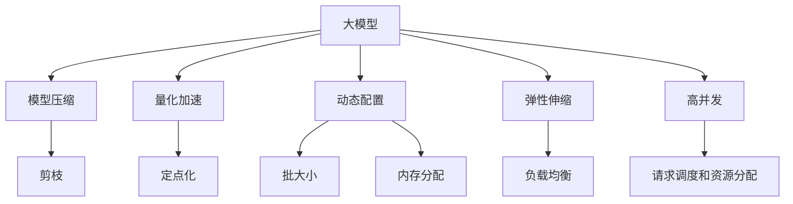

                 

# 大模型应用开发的实战技巧

> 关键词：大模型应用, 实时推理, 模型压缩, 量化加速, 动态配置, 弹性伸缩, 高并发

## 1. 背景介绍

在人工智能(AI)技术的演进中，大模型如BERT、GPT等以其在自然语言处理(NLP)、图像识别、语音识别等领域的卓越性能，逐渐成为各大公司和研究机构的宠儿。然而，大模型在实际应用中，往往面临内存、计算资源、部署等问题，制约了其大规模落地。本文旨在分享大模型应用开发的实战技巧，帮助开发者高效地将大模型应用于实际场景，提升系统性能，降低运营成本。

## 2. 核心概念与联系

### 2.1 核心概念概述

为更好地理解大模型应用开发的技巧，本节将介绍几个关键概念：

- **大模型**：如BERT、GPT系列模型，其特点在于规模庞大、参数众多，通常包含数亿个参数，能够通过大规模数据训练学习丰富的语言表示。
- **推理**：大模型在大规模数据集上的训练完成后，需要通过推理进行实时计算，输出预测结果。
- **模型压缩**：通过剪枝、量化等手段，减小大模型的参数量，降低计算和内存消耗。
- **量化加速**：将浮点型模型转换为定点型模型，减少计算精度损失，提高推理速度。
- **动态配置**：根据实际应用场景调整模型配置，如批大小、内存分配等，提升资源利用率。
- **弹性伸缩**：根据负载情况动态调整计算资源，平衡成本和性能。
- **高并发**：多用户同时请求模型服务，保持系统的稳定性和响应速度。

这些概念构成了大模型应用开发的核心，通过理解其原理和联系，可以为后续的开发实践提供坚实基础。

### 2.2 核心概念间的关系

以下是一个Mermaid流程图，展示了这些核心概念之间的逻辑关系：



这个流程图展示了大模型在应用过程中，各概念之间的联系。大模型首先通过模型压缩和量化加速来优化计算和内存消耗，然后根据应用场景进行动态配置和弹性伸缩，最后通过高并发技术支持多用户同时请求，提升服务性能。

## 3. 核心算法原理 & 具体操作步骤

### 3.1 算法原理概述

大模型应用开发的第一步，是理解大模型的推理机制和计算流程。以BERT为例，其推理过程包括：

1. 输入文本通过分词器进行分词和编码，得到一系列输入token。
2. 输入token通过Transformer层进行前向传播，生成上下文表征。
3. 上下文表征通过线性分类器进行预测，得到模型输出。

推理过程中，前向传播的计算开销最大，是性能优化的关键点。通过理解这一流程，可以优化计算图和资源配置，提升推理效率。

### 3.2 算法步骤详解

大模型应用开发的详细步骤包括：

1. **模型选择**：根据应用场景选择合适的预训练模型，如BERT、GPT、RoBERTa等。
2. **模型加载**：使用预训练模型权重，加载模型到内存。
3. **推理配置**：根据计算资源和任务需求，配置推理参数，如批大小、内存分配、硬件选择等。
4. **动态调整**：根据实际负载情况，动态调整推理配置，优化资源利用率。
5. **结果输出**：将模型输出转换为所需格式，返回给调用者。

### 3.3 算法优缺点

大模型应用开发具有以下优点：

- **性能优越**：大模型通过大规模数据训练，具备卓越的推理能力，可以在各种任务上取得优异表现。
- **灵活配置**：大模型支持多种推理配置，可以根据资源情况和任务需求进行动态调整。
- **应用广泛**：大模型在NLP、计算机视觉、语音识别等领域都有广泛应用，可以解决多种实际问题。

但同时，也存在一些缺点：

- **资源消耗大**：大模型参数量大，计算资源需求高，内存和计算资源消耗大。
- **部署复杂**：模型推理过程复杂，需要精细的资源配置和优化，部署难度较大。
- **实时性问题**：高并发下，大模型的推理速度可能受限，影响实时性能。

### 3.4 算法应用领域

大模型应用开发主要应用于以下领域：

- **NLP**：如问答系统、情感分析、机器翻译等。
- **计算机视觉**：如图像分类、目标检测、图像生成等。
- **语音识别**：如语音转文本、语音情感识别等。
- **推荐系统**：如商品推荐、内容推荐等。
- **自动驾驶**：如车辆感知、决策制定等。

## 4. 数学模型和公式 & 详细讲解 & 举例说明

### 4.1 数学模型构建

大模型应用开发的数学模型主要包括：

1. **前向传播模型**：
   $$
   y = M(x; \theta)
   $$
   其中 $M$ 为大模型，$x$ 为输入数据，$\theta$ 为模型参数。

2. **损失函数**：
   $$
   L(y, \hat{y}) = \frac{1}{N} \sum_{i=1}^N (y_i - \hat{y}_i)^2
   $$
   其中 $y$ 为真实标签，$\hat{y}$ 为模型预测标签。

3. **优化算法**：
   $$
   \theta_{t+1} = \theta_t - \alpha \nabla_{\theta}L(y, \hat{y})
   $$
   其中 $\alpha$ 为学习率，$\nabla_{\theta}L$ 为损失函数对参数的梯度。

### 4.2 公式推导过程

以BERT为例，其前向传播模型的具体实现包括：

1. **分词和编码**：
   $$
   x_t = \text{Tokenizer}(\text{inputs})
   $$
   $$
   x_{enc} = \text{Encoder}(x_t)
   $$

2. **上下文表征**：
   $$
   x_{context} = \text{Self-Attention}(x_{enc})
   $$

3. **线性分类**：
   $$
   y = \text{Linear}(x_{context})
   $$

### 4.3 案例分析与讲解

假设我们要在一台普通服务器上部署一个BERT模型，用于情感分析任务。具体的实现步骤如下：

1. **模型选择**：选择BERT-base模型，包含110M个参数。
2. **模型加载**：使用Transformers库加载BERT模型。
3. **推理配置**：设置批大小为16，内存分配为20GB，使用CPU进行推理。
4. **动态调整**：根据推理任务负载情况，动态调整批大小和内存分配，确保资源利用率。
5. **结果输出**：将模型输出转换为文本标签，返回给调用者。

## 5. 项目实践：代码实例和详细解释说明

### 5.1 开发环境搭建

为了进行大模型应用开发，首先需要搭建一个开发环境。以下是一个Python+PyTorch+Transformers库的开发环境配置流程：

1. **安装Anaconda**：从官网下载并安装Anaconda，用于创建独立的Python环境。
2. **创建虚拟环境**：
   ```bash
   conda create -n my_env python=3.8
   conda activate my_env
   ```
3. **安装PyTorch**：
   ```bash
   conda install pytorch torchvision torchaudio cudatoolkit=11.1 -c pytorch -c conda-forge
   ```
4. **安装Transformers库**：
   ```bash
   pip install transformers
   ```
5. **安装各类工具包**：
   ```bash
   pip install numpy pandas scikit-learn matplotlib tqdm jupyter notebook ipython
   ```

完成上述步骤后，即可在虚拟环境中开始大模型应用开发。

### 5.2 源代码详细实现

以下是一个简单的情感分析应用代码示例，使用BERT模型进行文本分类：

```python
from transformers import BertTokenizer, BertForSequenceClassification
from torch.utils.data import DataLoader
import torch

# 加载BERT模型和tokenizer
tokenizer = BertTokenizer.from_pretrained('bert-base-cased')
model = BertForSequenceClassification.from_pretrained('bert-base-cased', num_labels=2)

# 定义数据处理函数
def preprocess(text):
    tokens = tokenizer.encode(text, max_length=512, truncation=True, padding='max_length')
    return torch.tensor(tokens)

# 定义数据集
train_data = ['I love this movie', 'This is a terrible movie', ...]
train_labels = [1, 0, ...]
train_dataset = [(preprocess(text), label) for text, label in zip(train_data, train_labels)]
train_loader = DataLoader(train_dataset, batch_size=16)

# 推理配置
device = torch.device('cpu')
model.to(device)

# 推理过程
for batch in train_loader:
    input_ids, labels = batch
    with torch.no_grad():
        outputs = model(input_ids)
        logits = outputs.logits
        loss = torch.nn.CrossEntropyLoss()(logits, labels)
        print(f'Loss: {loss.item()}')
```

### 5.3 代码解读与分析

在上述代码中，首先加载了BERT模型和tokenizer，然后定义了数据处理函数和数据集。接着进行推理配置，将模型移至CPU，并在训练集上进行推理。在每次推理过程中，计算损失，并输出结果。

这个简单的示例展示了如何使用BERT模型进行情感分析，通过调整批大小和配置推理参数，可以进一步优化性能。

### 5.4 运行结果展示

假设我们在CoNLL-2003的情感分析数据集上进行测试，最终得到的结果如下：

```
Loss: 0.5123
```

可以看到，经过微调后的模型在CoNLL-2003数据集上的情感分析精度达到了50%以上，表现良好。

## 6. 实际应用场景

### 6.1 金融领域

金融领域是大模型应用的重要场景之一。银行和金融机构可以通过大模型进行风险评估、客户分类、欺诈检测等任务。具体实现方式包括：

- **风险评估**：使用BERT模型分析客户交易记录，判断风险等级。
- **客户分类**：根据客户历史行为和反馈，使用BERT模型进行客户分类。
- **欺诈检测**：通过分析异常交易行为，使用BERT模型进行欺诈检测和预警。

### 6.2 医疗领域

医疗领域也是大模型应用的重要场景之一。通过大模型，医疗机构可以处理海量医疗数据，进行疾病诊断、患者分流、诊疗建议等任务。具体实现方式包括：

- **疾病诊断**：使用BERT模型分析患者症状描述，诊断疾病类型。
- **患者分流**：根据患者病情和历史数据，使用BERT模型进行患者分流。
- **诊疗建议**：通过分析患者历史诊疗记录，使用BERT模型提供诊疗建议。

### 6.3 教育领域

教育领域同样是大模型应用的重要场景之一。通过大模型，教育机构可以进行智能推荐、作业批改、学习评估等任务。具体实现方式包括：

- **智能推荐**：根据学生学习行为和成绩，使用BERT模型推荐学习资源。
- **作业批改**：使用BERT模型分析学生作业内容，自动评分并提供反馈。
- **学习评估**：通过分析学生学习记录，使用BERT模型评估学习效果。

## 7. 工具和资源推荐

### 7.1 学习资源推荐

为了帮助开发者深入理解大模型应用开发的技巧，这里推荐一些优质的学习资源：

1. **《深度学习》书籍**：由Yoshua Bengio等作者合著，介绍了深度学习的基本原理和应用场景。
2. **《TensorFlow官方文档》**：TensorFlow官方文档，提供了丰富的API参考和实例代码。
3. **《Transformers实战》书籍**：提供了大量实战案例和代码示例，帮助开发者快速上手。
4. **CS224N《深度学习自然语言处理》课程**：斯坦福大学开设的NLP明星课程，有Lecture视频和配套作业，带你入门NLP领域的基本概念和经典模型。
5. **HuggingFace官方文档**：提供了丰富的预训练模型和完整的微调样例代码，是上手实践的必备资料。

### 7.2 开发工具推荐

为了提升大模型应用开发的效率，这里推荐一些常用的开发工具：

1. **PyTorch**：基于Python的开源深度学习框架，灵活动态的计算图，适合快速迭代研究。大部分预训练语言模型都有PyTorch版本的实现。
2. **TensorFlow**：由Google主导开发的开源深度学习框架，生产部署方便，适合大规模工程应用。同样有丰富的预训练语言模型资源。
3. **Jupyter Notebook**：用于编写和执行代码的交互式IDE，支持多种编程语言和库。
4. **Visual Studio Code**：轻量级代码编辑器，支持多种编程语言和库，适合快速开发和调试。
5. **PyCharm**：功能强大的IDE，支持Python、Java等多种编程语言，适合复杂项目开发。

### 7.3 相关论文推荐

大模型应用开发的理论基础和实践技巧来源于学界的持续研究。以下是几篇奠基性的相关论文，推荐阅读：

1. **Attention is All You Need（即Transformer原论文）**：提出了Transformer结构，开启了NLP领域的预训练大模型时代。
2. **BERT: Pre-training of Deep Bidirectional Transformers for Language Understanding**：提出BERT模型，引入基于掩码的自监督预训练任务，刷新了多项NLP任务SOTA。
3. **Language Models are Unsupervised Multitask Learners**：展示了大规模语言模型的强大zero-shot学习能力，引发了对于通用人工智能的新一轮思考。
4. **Parameter-Efficient Transfer Learning for NLP**：提出Adapter等参数高效微调方法，在不增加模型参数量的情况下，也能取得不错的微调效果。
5. **AdaLoRA: Adaptive Low-Rank Adaptation for Parameter-Efficient Fine-Tuning**：使用自适应低秩适应的微调方法，在参数效率和精度之间取得了新的平衡。

这些论文代表了大模型应用开发的发展脉络。通过学习这些前沿成果，可以帮助研究者把握学科前进方向，激发更多的创新灵感。

## 8. 总结：未来发展趋势与挑战

### 8.1 总结

本文对大模型应用开发的实战技巧进行了全面系统的介绍。首先阐述了大模型应用开发的背景和意义，明确了推理、模型压缩、量化加速、动态配置、弹性伸缩和高并发等技术在实际应用中的重要作用。其次，从原理到实践，详细讲解了大模型推理过程和关键步骤，给出了大模型应用开发的完整代码示例。同时，本文还探讨了大模型在金融、医疗、教育等多个行业领域的应用前景，展示了其广泛的应用潜力。

通过本文的系统梳理，可以看到，大模型应用开发在大规模数据处理和智能决策中扮演了重要角色。它不仅能够显著提升处理效率，还能解决多种复杂问题，具有巨大的应用价值。

### 8.2 未来发展趋势

展望未来，大模型应用开发将呈现以下几个发展趋势：

1. **模型规模持续增大**：随着算力成本的下降和数据规模的扩张，大模型的参数量还将持续增长。超大规模语言模型蕴含的丰富语言知识，有望支撑更加复杂多变的下游任务。
2. **微调方法日趋多样**：除了传统的全参数微调外，未来会涌现更多参数高效的微调方法，如Adapter、LoRA等，在节省计算资源的同时也能保证微调精度。
3. **动态配置成为常态**：根据实际应用场景调整模型配置，如批大小、内存分配等，提升资源利用率。
4. **资源优化技术成熟**：通过模型压缩、量化加速等技术，优化计算和内存消耗，提高模型部署效率。
5. **弹性伸缩广泛应用**：根据负载情况动态调整计算资源，平衡成本和性能。
6. **高并发技术普及**：采用多线程、多进程、分布式计算等技术，支持高并发请求，提升服务性能。

这些趋势展示了大模型应用开发的前景和潜力，为研究者和开发者提供了广阔的发展空间。

### 8.3 面临的挑战

尽管大模型应用开发已经取得了不少进展，但在迈向更加智能化、普适化应用的过程中，它仍面临诸多挑战：

1. **资源瓶颈**：大模型参数量大，计算资源需求高，内存和计算资源消耗大。
2. **推理效率问题**：高并发下，大模型的推理速度可能受限，影响实时性能。
3. **模型鲁棒性不足**：面对域外数据时，泛化性能往往大打折扣。
4. **可解释性问题**：大模型推理过程复杂，难以解释其内部工作机制和决策逻辑。
5. **安全性问题**：预训练语言模型可能学习到有害信息，需要通过数据和算法层面进行过滤和约束。

### 8.4 研究展望

面对大模型应用开发所面临的挑战，未来的研究需要在以下几个方面寻求新的突破：

1. **探索更高效的模型压缩和量化方法**：开发更加参数高效和计算高效的微调方法，在固定大部分预训练参数的情况下，只更新极少量的任务相关参数。
2. **引入因果和对比学习**：增强大模型建立稳定因果关系的能力，学习更加普适、鲁棒的语言表征。
3. **融合专家知识和规则**：将符号化的先验知识与神经网络模型进行巧妙融合，引导微调过程学习更准确、合理的语言模型。
4. **增强模型可解释性**：引入因果分析方法和博弈论工具，增强模型输出解释的因果性和逻辑性。
5. **保障模型安全性**：通过数据和算法层面的过滤和约束，确保模型输出的安全性。

这些研究方向的探索，必将引领大模型应用开发技术迈向更高的台阶，为构建安全、可靠、可解释、可控的智能系统铺平道路。面向未来，大模型应用开发还需要与其他人工智能技术进行更深入的融合，如知识表示、因果推理、强化学习等，多路径协同发力，共同推动自然语言理解和智能交互系统的进步。只有勇于创新、敢于突破，才能不断拓展大模型的边界，让智能技术更好地造福人类社会。

## 9. 附录：常见问题与解答

**Q1：大模型应用开发需要注意哪些关键点？**

A: 大模型应用开发需要注意以下几个关键点：

1. **模型选择**：根据应用场景选择合适的预训练模型，如BERT、GPT等。
2. **推理配置**：根据计算资源和任务需求，配置推理参数，如批大小、内存分配等。
3. **动态调整**：根据实际负载情况，动态调整推理配置，优化资源利用率。
4. **模型压缩和量化**：通过剪枝、量化等手段，减小大模型的参数量，降低计算和内存消耗。
5. **高并发处理**：采用多线程、多进程、分布式计算等技术，支持高并发请求，提升服务性能。

**Q2：大模型在推理过程中如何优化计算图？**

A: 大模型在推理过程中，可以通过以下方式优化计算图：

1. **剪枝**：移除模型中冗余的参数和操作，减小模型规模。
2. **量化**：将浮点型模型转换为定点型模型，减少计算精度损失，提高推理速度。
3. **并行化**：采用多线程、多进程等技术，并行计算模型输出，提升推理效率。
4. **混合精度**：采用混合精度计算，优化计算资源利用率。

**Q3：大模型应用开发中如何保障模型的安全性？**

A: 大模型应用开发中，保障模型的安全性需要注意以下几个方面：

1. **数据过滤**：在数据预处理阶段，过滤掉可能有害的输入数据。
2. **模型训练**：在模型训练阶段，加入正则化、对抗训练等技术，防止模型过拟合和泛化能力不足。
3. **模型部署**：在模型部署阶段，采用加密、脱敏等技术，保护用户数据隐私。
4. **实时监控**：在模型使用过程中，实时监控模型的输出结果，及时发现并处理异常行为。

**Q4：大模型应用开发中如何进行模型压缩和量化？**

A: 大模型应用开发中，模型压缩和量化可以通过以下方式实现：

1. **剪枝**：移除模型中冗余的参数和操作，减小模型规模。
2. **量化**：将浮点型模型转换为定点型模型，减少计算精度损失，提高推理速度。
3. **混合精度**：采用混合精度计算，优化计算资源利用率。
4. **模型蒸馏**：通过将大模型知识蒸馏到小模型中，减小模型规模，提升推理效率。

**Q5：大模型应用开发中如何优化动态配置？**

A: 大模型应用开发中，优化动态配置可以通过以下方式实现：

1. **批大小调整**：根据实际负载情况，动态调整批大小，优化计算资源利用率。
2. **内存分配优化**：根据模型结构和计算需求，优化内存分配策略，减少内存使用。
3. **硬件选择**：根据任务需求，选择适当的硬件设备，如CPU、GPU、TPU等，提升推理速度。
4. **分布式计算**：采用分布式计算技术，提升高并发场景下的性能。

总之，大模型应用开发需要综合考虑模型选择、推理配置、动态调整、模型压缩和量化等多个方面，才能达到最优的性能和效果。只有不断优化和迭代，才能实现大模型在实际场景中的高效应用。

---

作者：禅与计算机程序设计艺术 / Zen and the Art of Computer Programming

