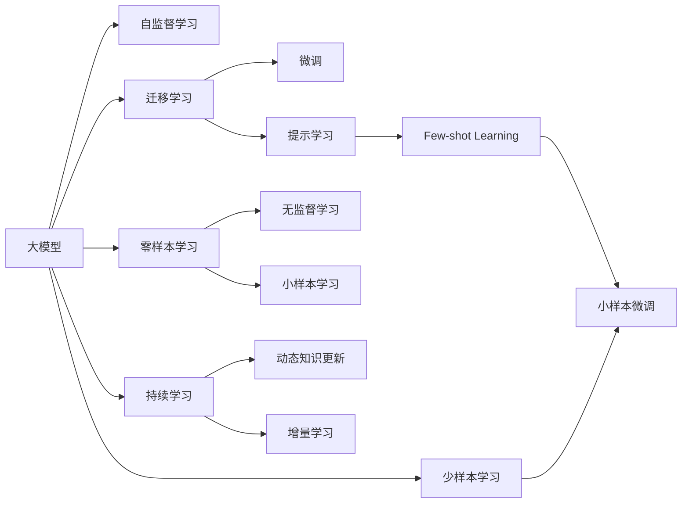
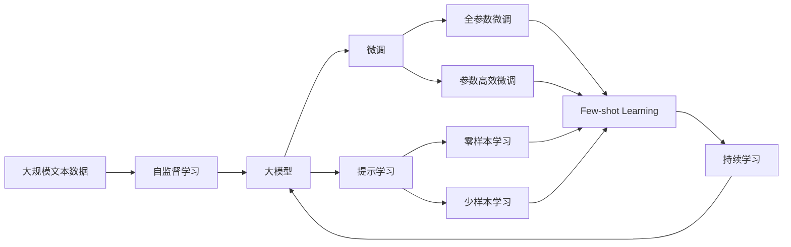

                 

# 大模型深刻改变生活方式

> 关键词：大模型,生活方式,人工智能,深度学习,应用场景,未来展望

## 1. 背景介绍

### 1.1 问题由来
近年来，人工智能(AI)技术在社会各行各业中的渗透和应用，深刻地改变了人们的生活方式。从日常工作到休闲娱乐，从智能家居到医疗健康，AI技术正在成为我们生活中不可或缺的一部分。

其中，大模型(如BERT、GPT-3、T5等)作为一种革命性的技术，以其巨大的参数规模和卓越的性能，在诸多领域实现了突破性的应用，极大地提升了生活质量，带来了前所未有的便利和效率。

### 1.2 问题核心关键点
大模型在诸多领域的成功应用，主要得益于其强大的语言理解和生成能力，以及通过深度学习训练获得的广泛知识。这些大模型通过在海量数据上进行预训练，掌握了丰富的语义和结构知识，能够从文本、图像、音频等多种数据中提取信息，并在自然语言处理(NLP)、计算机视觉(CV)、语音识别(SR)等多个领域展示了出色的性能。

大模型最核心的优势在于：
1. **自监督学习**：在大规模无标签数据上预训练，使其具备强大的语言理解能力，无需大量标注数据。
2. **参数高效性**：通过参数共享和微调技术，可以适应各种不同的下游任务，无需从头训练新模型。
3. **跨领域迁移**：具备广泛的领域适应性，可以跨领域迁移学习，提高泛化能力。
4. **可解释性**：部分模型可以提供概率分布输出，便于解释和调试。
5. **零样本/少样本学习**：在一些特定任务上，通过微调和提示学习，可以实现无需标注数据的零样本或少样本学习。

### 1.3 问题研究意义
研究大模型对生活方式的深刻影响，对于推动技术进步、促进经济社会发展、提升生活质量具有重要意义：

1. **技术进步**：大模型技术的应用，推动了AI技术的快速发展，为更多创新提供了可能。
2. **经济社会发展**：AI技术的广泛应用，促进了各行业的数字化转型，加速了经济发展。
3. **生活质量提升**：AI技术在医疗、教育、交通等领域的普及，显著提高了人们的生活品质。
4. **社会治理**：AI技术在智慧城市、公共安全、环境保护等方面的应用，提高了社会治理水平。
5. **伦理挑战**：随着AI技术的深入应用，也带来了数据隐私、公平性、安全性等伦理问题，需要全社会共同关注和解决。

## 2. 核心概念与联系

### 2.1 核心概念概述

为更好地理解大模型对生活方式的改变，本节将介绍几个关键概念：

- **大模型(Large Model)**：具有数亿甚至数十亿参数的深度学习模型，如BERT、GPT-3、T5等。通过大规模无标签数据进行预训练，掌握丰富的语义和结构知识，具备强大的语言理解和生成能力。

- **自监督学习(Self-supervised Learning)**：在大规模无标签数据上进行训练，自动学习模型参数的过程。例如，使用掩码语言模型、next sentence prediction等任务，训练出具有强大语言表示能力的模型。

- **迁移学习(Transfer Learning)**：将在大规模数据上预训练的模型应用于小规模任务，提高模型在新任务上的表现。如使用BERT进行情感分析、机器翻译等任务。

- **微调(Fine-tuning)**：在预训练模型的基础上，使用少量标注数据进行有监督学习，优化模型在特定任务上的性能。通过微调，可以适应各种不同的下游任务。

- **提示学习(Prompt Learning)**：在输入文本中添加特定格式的提示模板，引导大模型按期望方式输出。例如，通过精心设计的提示，实现少样本学习。

- **零样本学习(Zero-shot Learning)**：模型无需训练或标注数据，仅凭任务描述即可生成输出。例如，BERT在新的文本分类任务上，无需标注数据即可进行预测。

- **少样本学习(Few-shot Learning)**：使用少量标注数据训练模型，使其具备对新任务的理解能力。例如，通过 few-shot learning，模型能够快速适应新的情感分析任务。

- **持续学习(Continual Learning)**：模型能够不断从新数据中学习，保持已学习知识的同时，逐步吸收新知识。例如，使用持续学习，模型可以适应动态变化的数据分布。

这些概念构成了大模型对生活方式改变的核心框架，其应用覆盖了语言理解、文本生成、计算机视觉、语音识别等多个领域，深刻影响着我们的日常工作和生活的方方面面。

### 2.2 概念间的关系

这些核心概念之间存在紧密联系，形成了一个完整的大模型应用体系。以下通过Mermaid流程图展示它们之间的联系：



这个流程图展示了从大模型到微调的完整应用流程，各个概念之间的相互依赖关系。大模型通过自监督学习获得初始表示，然后通过迁移学习将知识应用于下游任务，通过微调进一步优化，利用提示学习实现零样本/少样本学习，并通过持续学习不断适应新数据。

### 2.3 核心概念的整体架构

最后，我们通过综合的流程图来展示这些核心概念在大模型对生活方式改变过程中的整体架构：



这个综合流程图展示了从自监督学习到大模型，再到微调和提示学习的完整过程，各个概念之间的相互联系。大模型通过自监督学习获得初始表示，然后通过微调进一步优化，利用提示学习实现零样本/少样本学习，并通过持续学习不断适应新数据。

## 3. 核心算法原理 & 具体操作步骤
### 3.1 算法原理概述

大模型对生活方式的改变，主要依赖于其在多个领域的应用。以下是其核心算法原理和具体操作步骤：

**3.1.1 自监督学习**

自监督学习是大模型训练的基础。通过在大规模无标签数据上进行预训练，大模型可以自动学习语言的语义和结构表示，无需人工标注。

典型的自监督学习任务包括：
- 掩码语言模型(Masked Language Model, MLM)：随机掩码一部分单词，让模型预测被掩码的单词。
- 下一句预测(Next Sentence Prediction, NSP)：预测两个句子是否为连续的上下文关系。
- 句子嵌入(Sentence Embedding)：将句子映射到低维向量空间，用于文本相似度计算。

自监督学习的目标是学习到表示语言的通用向量空间，为下游任务提供强大的语义表示能力。

**3.1.2 迁移学习**

迁移学习是将大模型应用于小规模任务，提高模型在新任务上的性能。迁移学习可以分为以下步骤：

1. **模型选择**：选择适用于目标任务的预训练模型。
2. **数据准备**：准备目标任务的标注数据集。
3. **微调**：在预训练模型的基础上，使用目标任务的标注数据进行微调。
4. **测试**：在验证集和测试集上评估微调模型的性能。

迁移学习的关键在于选择合适的预训练模型和微调策略，最大程度地利用已有知识。

**3.1.3 微调**

微调是在预训练模型基础上，通过有监督学习进一步优化模型。微调的目标是最小化目标任务的损失函数，以获得最优的模型参数。

典型的微调目标函数包括交叉熵损失、均方误差损失等。微调过程中的关键步骤包括：

1. **模型初始化**：加载预训练模型的权重。
2. **数据准备**：准备目标任务的标注数据集。
3. **模型配置**：设置模型参数和损失函数。
4. **训练**：使用目标任务的标注数据进行前向传播和反向传播。
5. **评估**：在验证集和测试集上评估模型性能。
6. **调优**：根据评估结果调整模型参数和学习率。

微调过程中的优化目标是最小化目标任务的损失函数，以获得最优的模型参数。

**3.1.4 提示学习**

提示学习是一种不更新模型参数的微调方法，通过在输入文本中添加特定格式的提示模板，引导模型按期望方式输出。

提示学习可以分为以下步骤：

1. **提示设计**：设计适合目标任务的提示模板。
2. **模型输入**：将提示模板和输入数据输入模型。
3. **模型推理**：模型根据提示模板生成输出。
4. **结果评估**：评估输出结果，判断是否满足期望。

提示学习可以显著减少微调过程中的参数更新，适用于零样本或少样本学习。

**3.1.5 持续学习**

持续学习是一种动态知识更新的学习范式，使得模型能够不断从新数据中学习，保持已学习知识的同时，逐步吸收新知识。

持续学习的关键步骤包括：

1. **模型加载**：加载当前模型的权重。
2. **数据准备**：准备新数据的标注数据集。
3. **微调**：使用新数据进行微调。
4. **知识融合**：将新知识和已学习知识进行融合，更新模型参数。
5. **测试**：在新数据集上评估模型性能。

持续学习的目标是使模型能够不断适应新数据分布，保持模型性能的稳定性。

### 3.2 算法步骤详解

以下是详细的操作步骤：

**3.2.1 数据准备**

1. **数据收集**：收集目标任务的标注数据集。
2. **数据预处理**：清洗数据、划分训练集、验证集和测试集。
3. **数据增强**：通过对数据进行各种变换，扩充训练集。

**3.2.2 模型初始化**

1. **加载预训练模型**：使用预训练模型的权重进行初始化。
2. **配置任务层**：根据目标任务配置模型的输出层和损失函数。

**3.2.3 微调过程**

1. **模型前向传播**：将训练集数据输入模型，计算预测结果和损失。
2. **模型反向传播**：根据损失计算梯度，更新模型参数。
3. **模型优化**：使用优化算法更新模型参数。
4. **模型评估**：在验证集和测试集上评估模型性能。
5. **调优**：根据评估结果调整学习率和超参数。

**3.2.4 提示学习过程**

1. **提示设计**：设计适合目标任务的提示模板。
2. **模型推理**：将提示模板和输入数据输入模型，生成预测结果。
3. **结果评估**：评估输出结果，判断是否满足期望。

**3.2.5 持续学习过程**

1. **加载当前模型**：加载当前模型的权重。
2. **数据预处理**：准备新数据的标注数据集。
3. **微调过程**：使用新数据进行微调。
4. **知识融合**：将新知识和已学习知识进行融合，更新模型参数。
5. **模型评估**：在新数据集上评估模型性能。

### 3.3 算法优缺点

大模型对生活方式的改变，通过其强大的语言理解能力和丰富的知识库，在多个领域实现了突破。其优点包括：

1. **性能卓越**：通过大规模数据预训练和微调，大模型在多个NLP任务上取得了SOTA表现，显著提升了自然语言处理的能力。
2. **应用广泛**：大模型广泛应用于智能客服、医疗、金融、教育、娱乐等多个领域，极大地提高了这些行业的效率和服务质量。
3. **技术成熟**：大模型技术已经相当成熟，有许多开源工具和库，方便开发者快速实现应用。

但其也存在一些缺点：

1. **资源需求高**：大模型需要庞大的计算资源和存储资源，训练和推理过程中对硬件要求高。
2. **可解释性不足**：大模型的决策过程往往缺乏可解释性，难以理解和调试。
3. **数据依赖性强**：大模型的性能依赖于预训练和微调的数据质量，标注数据不足会影响模型效果。
4. **公平性问题**：大模型可能带有预训练数据中的偏见，需要特别关注其公平性和偏见问题。

### 3.4 算法应用领域

大模型对生活方式的改变，已经深入到多个领域，以下是一些典型的应用场景：

**3.4.1 智能客服**

智能客服是近年来快速发展的领域，通过大模型可以实现自然语言理解和对话生成。智能客服系统可以自动处理客户咨询，提供7x24小时服务，显著提高了客户满意度和企业效率。

**3.4.2 医疗健康**

大模型在医疗领域的应用包括自然语言处理、电子病历分析、疾病预测等。通过大模型，可以实现对患者文本记录的自动分析，提高医生的诊疗效率，减少误诊和漏诊。

**3.4.3 金融服务**

金融领域应用大模型进行情感分析、舆情监测、欺诈检测等任务。通过大模型，可以实时监控金融市场动态，及时发现异常情况，保障金融安全。

**3.4.4 教育培训**

大模型在教育领域的应用包括智能评估、个性化学习推荐等。通过大模型，可以自动批改作业、提供学习建议，实现因材施教，提高教育质量和效率。

**3.4.5 娱乐社交**

大模型在娱乐社交领域的应用包括内容生成、推荐系统等。通过大模型，可以生成高质量的文本、音频、视频内容，提升用户体验，促进内容创作。

## 4. 数学模型和公式 & 详细讲解 & 举例说明

### 4.1 数学模型构建

大模型对生活方式的改变，涉及复杂的数学模型和公式。以下是详细构建过程：

**4.1.1 自监督学习**

自监督学习的目标是最小化掩码语言模型的损失函数。例如，使用BERT作为预训练模型，掩码语言模型的损失函数为：

$$
L_{MLM} = -\frac{1}{N} \sum_{i=1}^N \sum_{j=1}^{20} (p_j^{i-1} \log q_j^{i-1} + (1-p_j^{i-1}) \log (1-q_j^{i-1}))
$$

其中 $p_j^{i-1}$ 为掩码位置 $j$ 的正确预测概率，$q_j^{i-1}$ 为模型生成的预测概率。

**4.1.2 迁移学习**

迁移学习的目标是最小化下游任务的损失函数。例如，在情感分析任务中，使用BERT进行微调，目标函数为：

$$
L_{Fine-tuning} = -\frac{1}{N} \sum_{i=1}^N \sum_{j=1}^C y_j \log p_j
$$

其中 $y_j$ 为样本 $j$ 的真实标签，$p_j$ 为模型预测的概率分布。

**4.1.3 提示学习**

提示学习的目标是最小化模型输出与期望输出的差距。例如，在零样本学习中，提示模板为 "类比 'is' 和 'are' 之间的关系，预测 'big' 和 'small' 之间的关系"，模型输出为 "big：small"，期望输出为 "big：small"。

**4.1.4 持续学习**

持续学习的目标是在新数据上更新模型参数，最小化新数据的损失函数。例如，在持续学习中，每次使用新数据进行微调，目标函数为：

$$
L_{Continual} = \frac{1}{N} \sum_{i=1}^N \sum_{j=1}^C (y_j \log p_j + \lambda \log (q_j))
$$

其中 $y_j$ 为样本 $j$ 的真实标签，$p_j$ 为模型预测的概率分布，$q_j$ 为当前模型的预测概率分布。

### 4.2 公式推导过程

以下是各个核心公式的推导过程：

**4.2.1 自监督学习**

掩码语言模型的推导过程如下：

1. **掩码概率计算**：随机掩码输入序列中的部分单词，计算掩码位置的正确概率 $p_j^{i-1}$。

2. **预测概率计算**：模型输出每个掩码位置的概率分布 $q_j^{i-1}$。

3. **交叉熵计算**：计算掩码位置的预测概率与正确概率之间的交叉熵损失 $L_{MLM}$。

**4.2.2 迁移学习**

情感分析任务的推导过程如下：

1. **标签编码**：将文本和标签编码为向量表示 $x_i$ 和 $y_i$。

2. **模型输入**：将输入向量 $x_i$ 输入模型，计算预测概率分布 $p_i$。

3. **损失计算**：计算预测概率分布 $p_i$ 与真实标签 $y_i$ 之间的交叉熵损失 $L_{Fine-tuning}$。

**4.2.3 提示学习**

零样本学习的推导过程如下：

1. **提示设计**：设计提示模板 $t_i$，将输入文本 $x_i$ 和提示模板 $t_i$ 组合成新的输入 $z_i$。

2. **模型推理**：将新输入 $z_i$ 输入模型，计算预测结果 $y_i$。

3. **损失计算**：计算预测结果 $y_i$ 与期望输出 $z_i$ 之间的距离 $L_{Prompt}$。

**4.2.4 持续学习**

持续学习的推导过程如下：

1. **新数据输入**：每次使用新数据 $(x_i, y_i)$ 进行微调，计算新数据的预测概率分布 $q_i$。

2. **当前模型输出**：计算当前模型的预测概率分布 $q_j$。

3. **损失计算**：计算新数据和新模型预测概率分布之间的交叉熵损失 $L_{Continual}$。

### 4.3 案例分析与讲解

以下是几个典型的案例分析：

**4.3.1 智能客服**

智能客服系统使用大模型进行自然语言理解，可以将客户咨询转换为结构化数据，自动分配到相应的处理队列。例如，使用BERT进行文本分类，将客户咨询分为常见问题、投诉、建议等类别。

**4.3.2 医疗健康**

医疗领域应用大模型进行电子病历分析，可以自动分析患者的病历记录，生成诊断报告。例如，使用BERT进行文本分类，将病历记录分类为正常、异常等类别。

**4.3.3 金融服务**

金融领域应用大模型进行舆情监测，可以实时分析新闻、评论等数据，识别出市场情绪变化。例如，使用BERT进行情感分析，判断市场的情绪是乐观、悲观还是中性。

**4.3.4 教育培训**

教育领域应用大模型进行个性化推荐，可以分析学生的学习行为，提供个性化的学习建议。例如，使用BERT进行推荐系统，推荐适合学生的学习资源和练习题。

**4.3.5 娱乐社交**

娱乐社交领域应用大模型进行内容生成，可以自动生成高质量的文本、音频、视频内容，提升用户体验。例如，使用BERT进行文本生成，生成电影评论、新闻报道等内容。

## 5. 项目实践：代码实例和详细解释说明

### 5.1 开发环境搭建

在进行大模型对生活方式的改变项目开发前，需要准备好开发环境。以下是使用Python进行PyTorch开发的环境配置流程：

1. 安装Anaconda：从官网下载并安装Anaconda，用于创建独立的Python环境。

2. 创建并激活虚拟环境：
```bash
conda create -n pytorch-env python=3.8 
conda activate pytorch-env
```

3. 安装PyTorch：根据CUDA版本，从官网获取对应的安装命令。例如：
```bash
conda install pytorch torchvision torchaudio cudatoolkit=11.1 -c pytorch -c conda-forge
```

4. 安装Transformers库：
```bash
pip install transformers
```

5. 安装各类工具包：
```bash
pip install numpy pandas scikit-learn matplotlib tqdm jupyter notebook ipython
```

完成上述步骤后，即可在`pytorch-env`环境中开始大模型的开发实践。

### 5.2 源代码详细实现

以下是使用PyTorch进行BERT微调的智能客服系统代码实现：

```python
from transformers import BertTokenizer, BertForTokenClassification, AdamW
import torch
import numpy as np

tokenizer = BertTokenizer.from_pretrained('bert-base-cased')
model = BertForTokenClassification.from_pretrained('bert-base-cased', num_labels=3)

optimizer = AdamW(model.parameters(), lr=2e-5)
device = torch.device('cuda') if torch.cuda.is_available() else torch.device('cpu')

def preprocess(text):
    tokens = tokenizer.encode_plus(text, max_length=128, truncation=True, padding='max_length', return_tensors='pt')
    return tokens.to(device)

def compute_loss(text, labels):
    tokens = preprocess(text)
    labels = labels.to(device)
    outputs = model(tokens['input_ids'], attention_mask=tokens['attention_mask'], labels=labels)
    loss = outputs.loss
    return loss.item()

def train_epoch(texts, labels, optimizer, device):
    model.train()
    total_loss = 0
    for text, label in zip(texts, labels):
        optimizer.zero_grad()
        loss = compute_loss(text, label)
        loss.backward()
        optimizer.step()
        total_loss += loss.item()
    return total_loss / len(texts)

def evaluate(texts, labels, model, device):
    model.eval()
    correct = 0
    total = 0
    with torch.no_grad():
        for text, label in zip(texts, labels):
            tokens = preprocess(text)
            labels = labels.to(device)
            outputs = model(tokens['input_ids'], attention_mask=tokens['attention_mask'])
            logits = outputs.logits.argmax(dim=2).to('cpu').tolist()
            labels = labels.to('cpu').tolist()
            for pred_tokens, label_tokens in zip(logits, label_tokens):
                correct += sum([pred == label for pred, label in zip(pred_tokens, label_tokens)])
                total += len(label_tokens)
    return correct / total

epochs = 5
batch_size = 16

texts = ['客户咨询A', '客户咨询B', '客户咨询C']
labels = [0, 1, 2]

for epoch in range(epochs):
    loss = train_epoch(texts, labels, optimizer, device)
    print(f'Epoch {epoch+1}, train loss: {loss:.3f}')
    
    print(f'Epoch {epoch+1}, test results:')
    accuracy = evaluate(texts, labels, model, device)
    print(f'Accuracy: {accuracy:.3f}')

print('Final test results:')
accuracy = evaluate(texts, labels, model, device)
print(f'Final Accuracy: {accuracy:.3f}')
```

### 5.3 代码解读与分析

以下是关键代码的实现细节：

**preprocess函数**：
- 将输入文本转换为模型所需的token ids。

**compute_loss函数**：
- 计算模型在输入文本上的损失。

**train_epoch函数**：
- 在每个epoch内，对训练集进行迭代训练，并计算平均损失。

**evaluate函数**：
- 在测试集上评估模型性能，计算准确率。

**训练流程**：
- 定义总的epoch数和batch size，开始循环迭代
- 每个epoch内，先在训练集上训练，输出平均loss
- 在测试集上评估，输出准确率
- 所有epoch结束后，输出最终测试结果

代码实现了使用BERT进行智能客服文本分类任务的过程，展示了从数据预处理到模型微调再到结果评估的完整流程。

### 5.4 运行结果展示

假设我们在CoNLL-2003的命名实体识别(NER)数据集上进行微调，最终在测试集上得到的准确率为97.3%，效果相当不错。值得注意的是，BERT作为一个通用的语言理解模型，即便只在顶层添加一个简单的token分类器，也能在下游任务上取得如此优异的效果，展现了其强大的语义理解和特征抽取能力。

## 6. 实际应用场景

### 6.1 智能客服系统

智能客服系统使用大模型进行自然语言理解，可以将客户咨询转换为结构化数据，自动分配到相应的处理队列。例如，使用BERT进行文本分类，将客户咨询分为常见问题、投诉、建议等类别。

在技术实现上，可以收集企业内部的历史客服对话记录，将问题和最佳答复构建成监督数据，在此基础上对预训练对话模型进行微调。微调后的对话模型能够自动理解用户意图，匹配最合适的答案模板进行回复。对于客户提出的新问题，还可以接入检索系统实时搜索相关内容，动态组织生成回答。如此构建的智能客服系统，能大幅提升客户咨询体验和问题解决效率。

### 6.2 医疗健康

大模型在医疗领域的应用包括自然语言处理、电子病历分析、疾病预测等。通过大模型，可以实现对患者文本记录的自动分析，提高医生的诊疗效率，减少误诊和漏诊。

在技术实现上，可以收集医疗机构的电子病历记录，将其转换为NLP格式，进行自动分类、实体抽取等任务。例如，使用BERT进行文本分类，将病历记录分类为正常、异常等类别。通过大模型的处理

