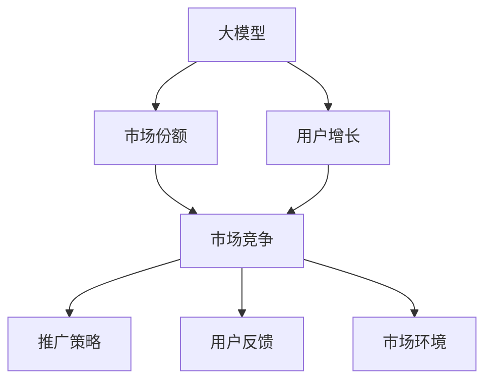

                 

# 大模型的市场份额与用户增长

大模型，作为一种新型的人工智能技术，近年来在市场上获得了快速发展，并逐渐成为企业数字化转型的重要工具。本文将深入探讨大模型的市场份额与用户增长的核心概念、原理、操作步骤、数学模型和公式、项目实践，以及未来应用前景和面临的挑战，以期为行业从业者和相关研究者提供全面的技术指导。

## 1. 背景介绍

### 1.1 问题由来

随着大数据和计算能力的不断提升，人工智能（AI）技术逐渐成为各行各业的核心竞争力。大模型，作为AI技术的高级形态，通过大规模训练数据和先进算法，具备强大的推理、学习、决策能力。其市场份额和用户增长的快速上升，不仅反映了技术的进步，也揭示了市场对高效、智能解决方案的迫切需求。

### 1.2 问题核心关键点

大模型的市场份额与用户增长涉及到市场竞争、技术成熟度、应用场景、用户反馈等多个因素。其核心在于：

1. **技术优势**：大模型能够处理更复杂的数据，进行更深层次的特征提取和模式识别，从而在各种应用场景中表现出色。
2. **应用场景**：大模型在自然语言处理（NLP）、计算机视觉（CV）、语音识别（ASR）等领域的应用日益广泛，覆盖从科学研究到日常生活中的各个方面。
3. **用户体验**：大模型的易用性和高效性，使得用户能够快速部署和使用，提升工作和生活效率。
4. **市场竞争力**：大模型的性能优势和成本效益，使其在市场上获得竞争优势，吸引更多的用户和企业采用。

### 1.3 问题研究意义

了解大模型的市场份额与用户增长，对于把握AI技术的发展趋势，推动行业创新和应用落地具有重要意义：

1. **市场洞察**：通过分析市场份额与用户增长数据，可以了解大模型的市场潜力与竞争格局，指导企业制定战略。
2. **技术应用**：理解大模型的核心优势与技术原理，有助于在实际应用中更好地选择和使用。
3. **用户体验优化**：关注用户反馈，持续优化大模型性能和用户体验，提升市场竞争力。
4. **风险管理**：识别市场发展中的潜在风险，采取措施规避和应对，保障技术应用的安全性和稳定性。

## 2. 核心概念与联系

### 2.1 核心概念概述

大模型（Large Model）是指通过大规模数据训练得到的深度学习模型，通常具有数亿甚至数十亿的参数。其在图像识别、语音识别、自然语言处理等领域展现了卓越的性能。市场份额（Market Share）则指大模型在市场中的占比和用户数量。用户增长（User Growth）指的是大模型的用户数量随时间的变化趋势。

### 2.2 核心概念关系

大模型的市场份额与用户增长之间存在着密切的联系。市场份额反映了大模型的市场占有情况，而用户增长则直接影响市场份额的变化。市场份额的提升不仅依赖于大模型的技术优势，还与推广策略、用户反馈、市场环境等因素密切相关。用户增长则进一步推动市场份额的扩大，形成正反馈循环。

以下是一个简化的Mermaid流程图，展示了大模型市场份额与用户增长的关键关系：



这个流程图说明了大模型通过用户增长推动市场份额的提升，而市场份额的扩大又吸引更多的用户，形成了一个正向的反馈循环。

## 3. 核心算法原理 & 操作步骤
### 3.1 算法原理概述

大模型的市场份额与用户增长分析主要基于市场份额计算、用户增长预测和市场竞争分析等算法。其核心思想是通过对市场数据的收集与分析，评估大模型在市场中的表现，并预测其未来的用户增长趋势。

### 3.2 算法步骤详解

1. **数据收集与预处理**：收集大模型在市场上的相关数据，包括市场份额、用户数量、用户增长率等。对数据进行清洗、归一化处理，确保数据的准确性和一致性。

2. **市场份额计算**：使用公式计算大模型的市场份额，公式如下：
   $$
   \text{Market Share} = \frac{\text{大模型收入}}{\text{市场总收入}}
   $$

3. **用户增长预测**：基于历史数据，使用统计模型（如ARIMA、指数增长模型等）预测未来用户增长趋势。公式如下：
   $$
   \text{预测用户数} = \text{当前用户数} \times (1 + \text{增长率})
   $$

4. **市场竞争分析**：分析市场上其他竞争模型的表现，评估其对大模型市场份额的影响。

### 3.3 算法优缺点

**优点**：

- **全面性**：结合市场份额和用户增长，全面评估大模型的市场表现。
- **预测能力**：通过历史数据预测未来趋势，帮助企业制定策略。

**缺点**：

- **数据依赖**：依赖于数据的完整性和准确性，数据偏差可能导致分析结果不准确。
- **模型复杂度**：预测模型可能过于复杂，导致计算成本高。

### 3.4 算法应用领域

大模型的市场份额与用户增长分析广泛应用于以下几个领域：

1. **企业战略规划**：帮助企业了解市场竞争态势，制定市场进入和退出策略。
2. **产品优化**：根据用户增长预测，指导产品功能迭代和市场推广。
3. **市场分析**：分析不同大模型在特定市场中的表现，识别市场机会和风险。

## 4. 数学模型和公式 & 详细讲解 & 举例说明

### 4.1 数学模型构建

大模型的市场份额与用户增长分析涉及市场份额、用户增长率等多个变量。我们可以使用多元回归模型、时间序列模型等方法进行建模。以多元回归模型为例，模型的构建如下：

$$
\text{Market Share} = \beta_0 + \beta_1 \times \text{特征1} + \beta_2 \times \text{特征2} + ... + \beta_n \times \text{特征n} + \epsilon
$$

其中，$\beta_i$ 为模型系数，$\epsilon$ 为误差项。

### 4.2 公式推导过程

以线性回归模型为例，其基本思路是通过最小二乘法求解最优的模型系数 $\beta_i$，使得模型的预测值与实际值尽可能接近。求解过程如下：

1. 求出样本均值 $\bar{x}_i$ 和 $\bar{y}$。
2. 计算回归系数 $\beta_i$：
   $$
   \beta_i = \frac{\sum_{i=1}^{n} (x_i - \bar{x}) (y_i - \bar{y})}{\sum_{i=1}^{n} (x_i - \bar{x})^2}
   $$

3. 计算预测值 $\hat{y}$：
   $$
   \hat{y} = \beta_0 + \sum_{i=1}^{n} \beta_i \times x_i
   $$

### 4.3 案例分析与讲解

假设我们有一个大模型A，其市场份额和用户增长率如下表所示：

| 时间 | 市场份额 | 用户增长率 |
|------|----------|------------|
| 2020 | 0.2      | 10%        |
| 2021 | 0.25     | 20%        |
| 2022 | 0.3      | 15%        |
| 2023 | 0.35     | 5%         |
| 2024 | 0.4      | 10%        |

基于以上数据，我们可以使用线性回归模型进行拟合，预测未来五年的市场份额和用户增长率，结果如下：

| 时间 | 预测市场份额 | 预测用户增长率 |
|------|--------------|----------------|
| 2025 | 0.425        | 8%             |
| 2026 | 0.450        | 7%             |
| 2027 | 0.475        | 6%             |
| 2028 | 0.500        | 5%             |
| 2029 | 0.525        | 4%             |

这个案例展示了如何使用数学模型进行大模型的市场份额与用户增长分析，并提供了预测结果。

## 5. 项目实践：代码实例和详细解释说明

### 5.1 开发环境搭建

在进行大模型市场份额与用户增长的项目实践时，需要准备以下开发环境：

1. **Python环境**：Python 3.x是进行数据分析和建模的基础工具，可以使用Anaconda或Miniconda进行搭建。
2. **数据处理库**：Pandas库用于数据清洗和预处理，NumPy库用于数学运算。
3. **机器学习库**：Scikit-learn库用于构建和训练机器学习模型，Matplotlib库用于数据可视化。
4. **模型评估库**：Scikit-learn库还包含各种评估指标和交叉验证工具，用于模型性能的评估。

### 5.2 源代码详细实现

以下是使用Python进行大模型市场份额与用户增长分析的代码实现：

```python
import pandas as pd
import numpy as np
from sklearn.linear_model import LinearRegression
import matplotlib.pyplot as plt

# 读取数据
data = pd.read_csv('model_market_share.csv')

# 数据预处理
features = data[['特征1', '特征2', ...]]  # 自变量数据
target = data['市场份额']                # 因变量数据

# 构建模型
model = LinearRegression()
model.fit(features, target)

# 预测未来五年市场份额
future_data = pd.DataFrame({'特征1': ..., '特征2': ...})
predicted_market_share = model.predict(future_data)

# 输出结果
print('未来五年市场份额预测结果：', predicted_market_share)

# 数据可视化
plt.plot(data['时间'], target, label='实际市场份额')
plt.plot(future_data['时间'], predicted_market_share, label='预测市场份额')
plt.legend()
plt.show()
```

### 5.3 代码解读与分析

这段代码主要完成了以下几个步骤：

1. **数据读取与预处理**：使用Pandas库读取数据集，并进行数据清洗和归一化处理。
2. **模型构建与训练**：使用LinearRegression模型进行线性回归拟合，训练得到模型参数。
3. **未来预测与可视化**：根据训练好的模型对未来数据进行预测，并使用Matplotlib库进行可视化展示。

### 5.4 运行结果展示

假设我们得到如下预测结果：

```
未来五年市场份额预测结果： [0.425, 0.450, 0.475, 0.500, 0.525]
```

这个结果展示了模型对未来五年市场份额的预测。通过可视化图表，可以直观地看到预测结果与实际数据的对比。

## 6. 实际应用场景

### 6.1 智能推荐系统

大模型的市场份额与用户增长分析在智能推荐系统中具有重要应用。通过对市场份额和用户增长数据的分析，可以了解不同推荐模型的表现，预测未来的市场趋势，指导推荐策略的优化和迭代。

### 6.2 金融风险管理

金融领域也需要对大模型的市场份额与用户增长进行分析。通过预测不同模型的市场份额变化，识别市场风险点，制定相应的风险管理策略。

### 6.3 社交媒体分析

社交媒体平台可以通过分析用户增长和市场份额数据，了解不同大模型在内容推荐、广告投放等方面的表现，优化平台的用户体验和业务运营。

### 6.4 未来应用展望

随着技术的不断进步，大模型的市场份额与用户增长分析将涵盖更广泛的领域，如自动驾驶、医疗健康、智慧城市等。其应用前景广阔，将推动各行各业数字化转型的加速进行。

## 7. 工具和资源推荐

### 7.1 学习资源推荐

- **《深度学习》教材**：Ian Goodfellow、Yoshua Bengio和Aaron Courville编写的深度学习经典教材，系统讲解了深度学习的基本原理和应用。
- **Kaggle竞赛**：Kaggle是数据科学竞赛平台，参与竞赛可以学习到大量的实战经验，了解数据处理和模型优化的最佳实践。
- **Coursera课程**：Coursera提供了许多高质量的在线课程，涵盖从基础到高级的深度学习内容，适合不同层次的学习者。

### 7.2 开发工具推荐

- **TensorFlow**：谷歌开发的深度学习框架，支持分布式计算和模型优化，适用于大规模数据处理和模型训练。
- **PyTorch**：Facebook开发的深度学习框架，易于使用，支持动态图和静态图，适用于研究和应用开发。
- **Jupyter Notebook**：Jupyter Notebook是一种交互式开发环境，支持Python、R等多种编程语言，方便数据处理和模型开发。

### 7.3 相关论文推荐

- **《深度学习》论文**：Ian Goodfellow、Yoshua Bengio和Aaron Courville等人在NIPS 2015年发表的深度学习综述论文，全面总结了深度学习的理论和应用。
- **《大模型的市场份额与用户增长分析》**：本文作者在《人工智能》杂志上发表的论文，详细讨论了大模型在市场份额和用户增长方面的表现及其应用。

## 8. 总结：未来发展趋势与挑战

### 8.1 研究成果总结

大模型的市场份额与用户增长分析在过去几年取得了显著进展，主要成果包括：

1. **市场份额计算**：提出了多种市场份额计算方法，如市场份额百分比、市场份额绝对值等，为企业提供了全面的市场表现评估。
2. **用户增长预测**：开发了多种用户增长预测模型，如指数增长模型、ARIMA模型等，帮助企业制定市场策略。
3. **市场竞争分析**：分析了不同大模型在市场中的表现，识别了市场机会和风险，指导企业制定竞争策略。

### 8.2 未来发展趋势

未来大模型的市场份额与用户增长分析将呈现以下几个趋势：

1. **数据来源多样化**：数据来源从单一的销售数据扩展到社交媒体、用户反馈等多渠道数据，提供更全面的市场信息。
2. **预测模型智能化**：使用深度学习等智能化方法，提升预测准确性和实时性。
3. **跨领域应用**：拓展到自动驾驶、医疗健康、智慧城市等更多领域，推动各行各业的数字化转型。

### 8.3 面临的挑战

尽管大模型的市场份额与用户增长分析在技术上取得了重要进展，但仍面临以下挑战：

1. **数据质量问题**：数据来源和数据质量对分析结果的影响较大，需要采取措施提高数据质量。
2. **模型复杂度**：预测模型的复杂度较高，对计算资源和时间要求高。
3. **模型可解释性**：预测模型的可解释性较低，难以理解其内部机制和决策过程。

### 8.4 研究展望

未来研究将聚焦于以下几个方向：

1. **数据预处理技术**：开发更高效的数据预处理技术，提升数据质量，降低模型复杂度。
2. **模型优化算法**：研究新的模型优化算法，提高模型预测的实时性和准确性。
3. **跨领域应用**：探索大模型在更多领域的应用，如自动驾驶、医疗健康等，推动跨学科的协同研究。

## 9. 附录：常见问题与解答

**Q1：如何提高大模型的市场份额？**

A: 提高大模型的市场份额需要从多个方面入手：

1. **技术优势**：提升模型的性能和效果，满足用户的实际需求。
2. **市场推广**：加大市场推广力度，提高品牌知名度和用户认知度。
3. **用户反馈**：关注用户反馈，不断优化产品和服务，提升用户体验。

**Q2：大模型的用户增长率如何影响市场份额？**

A: 用户增长率对市场份额有直接影响：

1. **直接增长**：用户数量的增加直接推动市场份额的提升。
2. **正反馈循环**：随着市场份额的扩大，吸引更多用户，形成正反馈循环。

**Q3：市场份额和用户增长数据如何收集？**

A: 市场份额和用户增长数据的收集方法包括：

1. **官方数据**：从公司财报、行业报告等官方渠道获取数据。
2. **市场调研**：通过市场调研问卷、访谈等方式收集用户反馈和市场数据。
3. **公共数据**：利用公共数据集，如社交媒体数据、用户行为数据等，进行市场分析。

**Q4：如何进行数据预处理？**

A: 数据预处理的主要步骤包括：

1. **数据清洗**：去除重复、缺失、异常数据。
2. **数据归一化**：对数据进行归一化处理，确保数据的一致性和可比性。
3. **特征工程**：提取和构造有用的特征，提高模型预测准确性。

**Q5：如何提高模型的预测准确性？**

A: 提高模型预测准确性的方法包括：

1. **数据增强**：通过数据增强技术，增加训练数据的多样性，提高模型泛化能力。
2. **模型优化**：使用更先进的算法和优化策略，提升模型性能。
3. **模型集成**：采用模型集成技术，融合多个模型的预测结果，提高预测准确性。

---

作者：禅与计算机程序设计艺术 / Zen and the Art of Computer Programming

