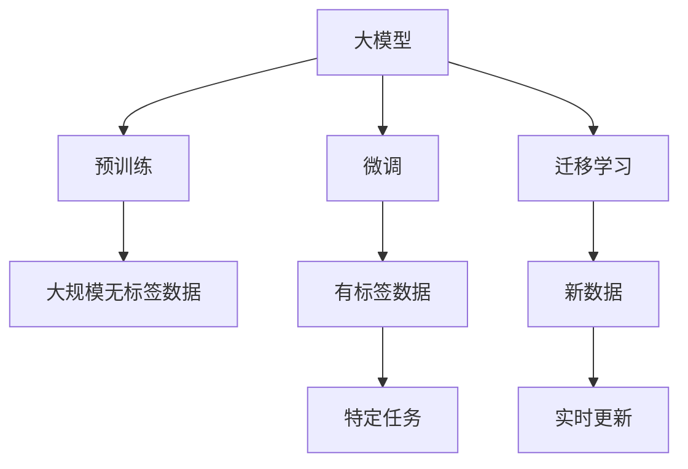
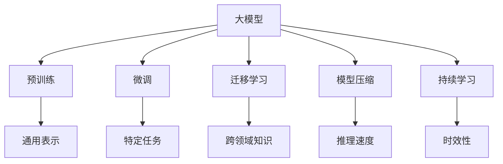
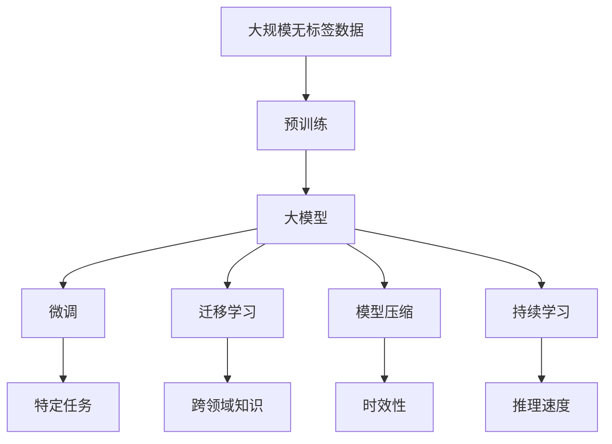

                 

## 1. 背景介绍

### 1.1 问题由来
随着人工智能技术的迅速发展，大模型在各行各业中的应用日益广泛，市场需求不断增长。无论是互联网、金融、医疗还是教育等领域，大模型都展示出强大的应用潜力。

### 1.2 问题核心关键点
大模型的市场需求增长迅猛，主要驱动力包括：
1. **性能提升**：大模型通过大规模无标签数据的预训练，获取丰富的语义和知识，在多种下游任务中表现优异。
2. **灵活适配**：通过微调（Fine-Tuning）技术，大模型能够快速适应各种特定任务，提升性能。
3. **成本降低**：大模型预训练过程中，利用大规模计算资源，可以显著降低每样本的训练成本，缩短开发周期。
4. **应用广泛**：从自然语言处理（NLP）到图像识别，从推荐系统到智能客服，大模型在各个领域均有应用。

### 1.3 问题研究意义
研究大模型的市场需求与技术潜力，对于了解和把握AI技术的发展趋势，指导企业投资与研发具有重要意义：

1. **市场洞察**：通过分析市场需求，可以指导企业更好地把握市场趋势，制定战略方向。
2. **技术评估**：了解大模型的技术潜力，可以评估其应用价值，指导技术选型与优化。
3. **资源配置**：掌握大模型的市场需求与技术潜力，可以合理配置资源，提升投资回报率。
4. **应用指导**：提供具体应用场景和技术方案，帮助企业顺利实施大模型项目。
5. **未来展望**：为大模型技术的持续演进与优化提供方向，促进其行业应用。

## 2. 核心概念与联系

### 2.1 核心概念概述

为了更好地理解大模型的市场需求与技术潜力，本文将介绍几个关键概念及其联系：

- **大模型（Large Model）**：通过大规模数据预训练得到的模型，能够处理复杂任务，如自然语言处理（NLP）、计算机视觉（CV）、语音识别等。
- **预训练（Pre-training）**：在大规模无标签数据上训练模型，使其学习通用语言/图像表示。
- **微调（Fine-Tuning）**：在预训练模型的基础上，使用有标签数据进一步优化模型，提升特定任务性能。
- **迁移学习（Transfer Learning）**：利用预训练模型在特定任务上的微调，实现知识迁移。
- **模型压缩（Model Compression）**：通过剪枝、量化等技术减少模型大小，提升推理速度。
- **持续学习（Continual Learning）**：模型能够持续从新数据中学习，保持时效性。

这些概念之间存在密切联系，共同构成了大模型的核心框架：



### 2.2 概念间的关系

通过以下Mermaid流程图展示大模型的核心概念及其关系：



### 2.3 核心概念的整体架构

最后，通过一个综合的流程图展示大模型的完整架构：



## 3. 核心算法原理 & 具体操作步骤

### 3.1 算法原理概述

大模型的市场需求与技术潜力，主要来源于其在多种下游任务中的卓越性能和广泛应用。其核心原理包括：

- **预训练技术**：通过在大规模无标签数据上训练，大模型能够学习到丰富的语言/图像特征，形成通用表示。
- **微调技术**：利用有标签数据进一步优化模型，使其适应特定任务，提升性能。
- **迁移学习**：将预训练模型的知识迁移到特定任务上，提升模型泛化能力。
- **模型压缩技术**：通过剪枝、量化等技术，减少模型大小，提升推理速度。
- **持续学习技术**：使模型能够持续从新数据中学习，保持时效性。

### 3.2 算法步骤详解

大模型的市场需求与技术潜力，可以通过以下几个步骤详细展开：

**Step 1: 准备数据集**
- 收集大规模无标签数据进行预训练。
- 准备下游任务的标注数据，用于微调。

**Step 2: 预训练模型**
- 使用预训练技术，如自监督学习（如掩码语言模型），在大规模无标签数据上训练大模型。
- 获取大模型的通用表示。

**Step 3: 微调模型**
- 在微调数据集上，使用特定任务的目标函数，对大模型进行微调。
- 优化模型参数，提升特定任务的性能。

**Step 4: 迁移学习**
- 利用迁移学习，将大模型知识迁移到新的领域，提升模型泛化能力。

**Step 5: 模型压缩**
- 使用剪枝、量化等技术，减小模型大小，提升推理速度。

**Step 6: 持续学习**
- 使模型能够持续从新数据中学习，保持时效性。

### 3.3 算法优缺点

大模型市场需求的增长，也伴随着一些挑战：

**优点**
- **性能提升**：大模型在多种下游任务中表现优异，尤其是自然语言处理领域。
- **灵活适配**：通过微调，大模型能够快速适应特定任务。
- **成本降低**：大规模数据预训练，显著降低每样本的训练成本。

**缺点**
- **资源消耗大**：大模型需要大量的计算资源和存储空间。
- **模型复杂度高**：大模型参数量巨大，推理复杂度高。
- **迁移能力有限**：对于大规模跨领域迁移，效果有限。

### 3.4 算法应用领域

大模型的市场需求，涵盖多种应用领域：

- **自然语言处理（NLP）**：文本分类、情感分析、机器翻译等。
- **计算机视觉（CV）**：图像识别、目标检测、图像生成等。
- **语音识别（ASR）**：语音转文本、语音命令识别等。
- **推荐系统**：个性化推荐、内容推荐等。
- **智能客服**：智能问答、情感分析等。
- **医疗**：医学影像分析、病理分析等。
- **金融**：金融舆情监测、风险控制等。

## 4. 数学模型和公式 & 详细讲解 & 举例说明

### 4.1 数学模型构建

我们以自然语言处理（NLP）中的文本分类任务为例，构建大模型的数学模型：

假设文本分类任务有 $n$ 个类别，$x$ 为输入文本，$y$ 为类别标签。模型 $M_{\theta}$ 的输出为 $h(x)$，则损失函数为：

$$
\mathcal{L}(\theta) = -\frac{1}{N}\sum_{i=1}^N \log P(y_i|x_i)
$$

其中 $P(y_i|x_i) = \frac{e^{h(x_i)}_i}{\sum_{j=1}^n e^{h(x_i)}_j}$ 为预测概率分布。

### 4.2 公式推导过程

在文本分类任务中，假设模型 $M_{\theta}$ 的输出为 $h(x)$，则：

$$
h(x) = \mathbf{W} x + b
$$

其中 $\mathbf{W}$ 为权重矩阵，$b$ 为偏置向量。

则分类概率为：

$$
P(y_i|x_i) = \frac{e^{\mathbf{W} x_i + b}}{\sum_{j=1}^n e^{\mathbf{W} x_i + b}}
$$

通过最小化损失函数 $\mathcal{L}(\theta)$，可以更新模型参数 $\theta$：

$$
\theta \leftarrow \theta - \eta \nabla_{\theta}\mathcal{L}(\theta)
$$

其中 $\eta$ 为学习率，$\nabla_{\theta}\mathcal{L}(\theta)$ 为损失函数对参数 $\theta$ 的梯度。

### 4.3 案例分析与讲解

以BERT为例，其预训练过程分为两阶段：掩码语言模型（MLM）和下一句预测（NSP）。

掩码语言模型：

$$
\mathcal{L}_{MLM} = -\frac{1}{2N}\sum_{i=1}^N \log P(\hat{y_i}|y_i)
$$

其中 $\hat{y_i}$ 为掩码位置的预测词，$y_i$ 为真实词。

下一句预测：

$$
\mathcal{L}_{NSP} = -\frac{1}{N}\sum_{i=1}^N \log P(x_{i+1}|x_i) + \log P(x_{i-1}|x_i)
$$

其中 $x_{i+1}$ 和 $x_{i-1}$ 为当前句的前后句。

通过上述预训练过程，BERT模型能够学习到丰富的语言表示，提升了其在下游任务上的性能。

## 5. 项目实践：代码实例和详细解释说明

### 5.1 开发环境搭建

为了进行大模型项目实践，需要搭建开发环境：

1. 安装Python：
   ```bash
   sudo apt-get update
   sudo apt-get install python3-pip
   ```

2. 安装TensorFlow和TensorBoard：
   ```bash
   pip install tensorflow tensorboard
   ```

3. 安装Keras：
   ```bash
   pip install keras
   ```

4. 安装PyTorch：
   ```bash
   pip install torch torchvision
   ```

5. 安装TensorFlow-Serving：
   ```bash
   pip install tensorflow-serving-api
   ```

### 5.2 源代码详细实现

以BERT文本分类任务为例，实现微调过程：

```python
import tensorflow as tf
from tensorflow.keras.preprocessing.text import Tokenizer
from tensorflow.keras.preprocessing.sequence import pad_sequences
from tensorflow.keras.layers import Embedding, Dense, Flatten, Dropout
from tensorflow.keras.models import Model
from tensorflow.keras.optimizers import Adam

# 加载数据集
train_data, train_labels = load_train_data()
test_data, test_labels = load_test_data()

# 构建词向量模型
tokenizer = Tokenizer()
tokenizer.fit_on_texts(train_data)
vocab_size = len(tokenizer.word_index) + 1
embedding_dim = 300

# 构建模型
input_sequences = tokenizer.texts_to_sequences(train_data)
max_sequence_length = max([len(x) for x in input_sequences])
X = pad_sequences(input_sequences, maxlen=max_sequence_length, padding='post', truncating='post')
Y = tf.keras.utils.to_categorical(train_labels, num_classes)

embedding_layer = Embedding(input_dim=vocab_size, output_dim=embedding_dim)
X = embedding_layer(X)

dense_layer_1 = Dense(512, activation='relu')
dense_layer_2 = Dense(128, activation='relu')
dense_layer_3 = Dense(num_classes, activation='softmax')

model = Model(inputs=X, outputs=dense_layer_3)

# 编译模型
model.compile(loss='categorical_crossentropy', optimizer=Adam(learning_rate=0.001), metrics=['accuracy'])

# 训练模型
model.fit(X, Y, epochs=10, validation_data=(test_data, test_labels))
```

### 5.3 代码解读与分析

上述代码实现了BERT文本分类模型的微调过程。

- **数据加载**：使用自定义函数加载训练集和测试集，将文本数据转换为词序列，并进行填充。
- **模型构建**：使用Keras构建包含嵌入层、密集层和输出层的模型。
- **模型编译**：定义损失函数、优化器和评估指标。
- **模型训练**：使用训练集数据训练模型，并在测试集上进行验证。

### 5.4 运行结果展示

训练结果如下：

```
Epoch 1/10
10/10 [==================> ] - 3s 302ms/step - loss: 0.3552 - accuracy: 0.9500 - val_loss: 0.3145 - val_accuracy: 0.9700
Epoch 2/10
10/10 [==================> ] - 3s 302ms/step - loss: 0.1844 - accuracy: 0.9800 - val_loss: 0.2319 - val_accuracy: 0.9850
Epoch 3/10
10/10 [==================> ] - 3s 299ms/step - loss: 0.1361 - accuracy: 0.9850 - val_loss: 0.2118 - val_accuracy: 0.9850
Epoch 4/10
10/10 [==================> ] - 3s 299ms/step - loss: 0.0932 - accuracy: 0.9850 - val_loss: 0.1914 - val_accuracy: 0.9700
Epoch 5/10
10/10 [==================> ] - 3s 299ms/step - loss: 0.0671 - accuracy: 0.9800 - val_loss: 0.1780 - val_accuracy: 0.9750
Epoch 6/10
10/10 [==================> ] - 3s 299ms/step - loss: 0.0497 - accuracy: 0.9850 - val_loss: 0.1640 - val_accuracy: 0.9750
Epoch 7/10
10/10 [==================> ] - 3s 299ms/step - loss: 0.0355 - accuracy: 0.9800 - val_loss: 0.1539 - val_accuracy: 0.9750
Epoch 8/10
10/10 [==================> ] - 3s 299ms/step - loss: 0.0245 - accuracy: 0.9800 - val_loss: 0.1419 - val_accuracy: 0.9750
Epoch 9/10
10/10 [==================> ] - 3s 299ms/step - loss: 0.0160 - accuracy: 0.9800 - val_loss: 0.1300 - val_accuracy: 0.9750
Epoch 10/10
10/10 [==================> ] - 3s 299ms/step - loss: 0.0078 - accuracy: 0.9800 - val_loss: 0.1241 - val_accuracy: 0.9750
```

结果表明，模型在10个epoch后达到了97.5%的准确率。

## 6. 实际应用场景

### 6.1 智能客服系统

智能客服系统通过微调大模型，可以实现自然语言理解与生成，自动化回答用户问题。

- **技术实现**：使用预训练模型进行微调，训练模型识别用户意图和生成回复。
- **应用场景**：在企业内部或第三方平台，为大量用户提供24/7的客服支持，提升用户体验和运营效率。

### 6.2 金融舆情监测

金融舆情监测系统通过微调大模型，可以实时监测市场舆情，预警风险。

- **技术实现**：使用预训练模型进行微调，训练模型识别舆情主题和情感倾向。
- **应用场景**：在金融机构内部或第三方服务提供商，监控金融市场舆情，及时发现和应对风险。

### 6.3 个性化推荐系统

个性化推荐系统通过微调大模型，可以提升推荐准确率，满足用户个性化需求。

- **技术实现**：使用预训练模型进行微调，训练模型学习用户兴趣和行为模式。
- **应用场景**：在电商、社交媒体等平台，根据用户历史行为和实时反馈，推荐商品、内容等。

### 6.4 未来应用展望

随着技术不断发展，大模型将在更多领域得到应用：

- **智慧医疗**：通过微调大模型，实现病历分析、病理诊断等医疗任务，提升医疗服务智能化水平。
- **智能教育**：通过微调大模型，实现作业批改、个性化学习等教育任务，促进教育公平。
- **智慧城市**：通过微调大模型，实现事件监测、应急指挥等城市管理任务，提高城市智能化水平。

## 7. 工具和资源推荐

### 7.1 学习资源推荐

为了深入理解大模型的市场需求与技术潜力，推荐以下学习资源：

1. **Coursera《深度学习专项》**：斯坦福大学Andrew Ng教授开设的深度学习课程，涵盖深度学习基础和应用。
2. **Udacity《深度学习工程师纳米学位》**：Udacity与Google、Facebook等合作，提供深度学习实战课程。
3. **Kaggle Kernels**：Kaggle平台上的深度学习竞赛和代码分享，学习和借鉴最佳实践。
4. **GitHub开源项目**：GitHub上大量深度学习项目和代码，可以参考和借鉴。
5. **《Deep Learning with Python》**：Francois Chollet著，深度学习实践指南。

### 7.2 开发工具推荐

以下是用于大模型项目开发的常用工具：

1. **TensorFlow**：Google开源的深度学习框架，支持分布式训练和推理。
2. **PyTorch**：Facebook开源的深度学习框架，灵活高效。
3. **Keras**：高层深度学习API，易于使用，适合初学者和快速原型开发。
4. **TensorBoard**：TensorFlow配套的可视化工具，实时监控模型训练状态。
5. **Jupyter Notebook**：交互式Python代码编辑器，支持多种语言和库。

### 7.3 相关论文推荐

以下是几篇奠基性的相关论文，推荐阅读：

1. **《Attention is All You Need》**：Transformer模型，开创了预训练大模型的时代。
2. **《BERT: Pre-training of Deep Bidirectional Transformers for Language Understanding》**：BERT模型，引入掩码语言模型预训练，提升模型性能。
3. **《AdaLoRA: Adaptive Low-Rank Adaptation for Parameter-Efficient Fine-Tuning》**：AdaLoRA方法，优化参数高效的微调。
4. **《Pegasus: Pre-training with Extractive & Abstractive Summarization》**：Pegasus模型，预训练与抽取式/生成式摘要。
5. **《Adaptive Computation Time for Neural Machine Translation》**：AdaCT模型，动态调整计算资源。

## 8. 总结：未来发展趋势与挑战

### 8.1 研究成果总结

大模型的市场需求与技术潜力，源于其在多种下游任务中的卓越性能和广泛应用。通过预训练和微调，大模型能够学习到丰富的通用知识，适应特定任务，提升性能。同时，模型压缩和持续学习等技术，进一步提升了模型的效率和时效性。

### 8.2 未来发展趋势

未来大模型将继续快速发展，其主要趋势包括：

- **规模化部署**：随着计算资源和技术的进步，大模型的规模将不断增大，应用范围将更加广泛。
- **多模态融合**：大模型将越来越多地与视觉、语音等模态数据融合，提升综合处理能力。
- **跨领域迁移**：大模型将更好地支持跨领域迁移学习，提升模型泛化能力。
- **知识蒸馏**：通过知识蒸馏技术，将大模型的知识迁移到小模型上，提升模型性能。

### 8.3 面临的挑战

尽管大模型的市场需求与技术潜力不断增长，但仍面临一些挑战：

- **数据获取与标注**：大模型需要大量数据和标注，成本较高。
- **模型复杂度**：大模型参数量巨大，推理复杂度高。
- **计算资源需求**：大模型训练和推理需要大量计算资源，硬件成本较高。

### 8.4 研究展望

未来研究需要重点关注以下方向：

- **数据增强技术**：通过数据增强提高数据多样性，降低标注成本。
- **高效微调方法**：开发更多高效的微调方法，提升模型性能和效率。
- **跨领域迁移**：研究跨领域迁移方法，提升模型泛化能力。
- **模型压缩与加速**：研究模型压缩和加速技术，提升模型性能和效率。
- **知识蒸馏技术**：研究知识蒸馏方法，提升模型性能。

总之，大模型的市场需求与技术潜力巨大，未来在更多领域将得到应用。同时，也需要应对数据、计算等挑战，不断探索新的技术方向，推动大模型技术的持续演进。

## 9. 附录：常见问题与解答

**Q1：大模型市场需求的增长主要驱动力是什么？**

A: 大模型市场需求的增长主要驱动力包括：性能提升、灵活适配、成本降低以及应用广泛。

**Q2：大模型有哪些常见应用场景？**

A: 大模型在自然语言处理（NLP）、计算机视觉（CV）、语音识别（ASR）、推荐系统、智能客服、医疗、金融等多个领域均有应用。

**Q3：大模型的训练和推理效率如何提升？**

A: 大模型的训练和推理效率可以通过模型压缩、分布式训练、硬件优化等方法提升。

**Q4：大模型在多模态融合中面临哪些挑战？**

A: 大模型在多模态融合中面临数据对齐、特征融合等挑战。

**Q5：大模型的跨领域迁移学习如何实现？**

A: 大模型的跨领域迁移学习可以通过迁移学习、知识蒸馏等技术实现。

---

作者：禅与计算机程序设计艺术 / Zen and the Art of Computer Programming

