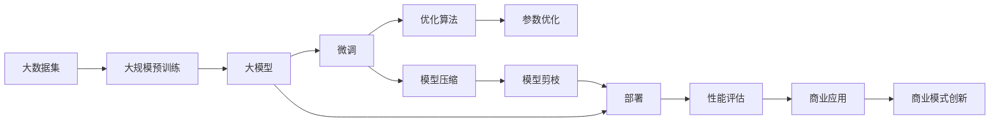

                 

# 大模型的成本驱动与价值创造

> 关键词：大模型, 成本驱动, 价值创造, AI生态, 可持续发展, 技术商业化

## 1. 背景介绍

### 1.1 问题由来
随着人工智能技术的迅猛发展，深度学习模型，尤其是大模型，如BERT、GPT-3等，逐渐成为推动NLP、计算机视觉、语音识别等众多领域科技进步的引擎。然而，大模型之所以能够表现出色，其背后需要庞大且高质量的数据、高效且昂贵的算力支撑，以及专业的科研团队进行持续的模型优化和调整。这些因素不仅带来了前所未有的技术突破，也带来了巨大的成本挑战。如何在大模型的开发与部署过程中实现成本的合理驱动，同时最大化其商业价值，成为当前AI研究的一个重要课题。

### 1.2 问题核心关键点
大模型研发和部署过程中面临的核心问题主要包括：

- **成本驱动**：大模型训练和推理所需的巨额数据、算力和科研资源，如何有效利用和合理分配。
- **价值创造**：如何通过技术优化和商业模式设计，最大化大模型带来的商业价值。
- **可持续性**：大模型训练与部署过程中的环境影响和数据隐私问题，如何实现可持续发展。

### 1.3 问题研究意义
大模型的成本驱动与价值创造研究，对于推动AI技术产业化具有重要意义：

1. **降低技术门槛**：通过优化模型设计、提升训练效率等手段，降低大模型开发和部署的成本，让更多企业能够享受到AI技术的红利。
2. **提升商业价值**：通过对大模型进行精细化管理和商业化运作，最大化其商业价值，推动AI技术在各行各业的深度应用。
3. **促进可持续发展**：通过减少能源消耗、保护数据隐私等措施，实现AI技术开发的绿色化，为未来AI技术的发展创造良好环境。

## 2. 核心概念与联系

### 2.1 核心概念概述

为了深入理解大模型的成本驱动与价值创造，本节将介绍几个关键概念，并阐述它们之间的联系：

- **大模型（Large Model）**：指具有亿级参数的深度学习模型，如BERT、GPT-3等。大模型通过预训练的方式，在大规模数据集上学习到丰富的语言和视觉知识，具备强大的学习和泛化能力。

- **成本驱动（Cost-Driven）**：指在模型开发和部署过程中，如何高效利用资源，优化成本结构，实现模型训练与运维的成本控制。

- **价值创造（Value Creation）**：指通过技术创新和商业模式设计，最大化大模型带来的商业价值，包括但不限于提升用户体验、降低运营成本、创造新业务机会等。

- **可持续性（Sustainability）**：指在模型开发和部署过程中，如何实现环境友好、数据隐私保护等可持续发展的目标。

- **技术商业化（Technology Commercialization）**：指将大模型的技术能力转化为可操作、可盈利的商业模式，实现技术的产业化。

这些概念相互关联，共同构成大模型成本驱动与价值创造的完整框架。

### 2.2 概念间的关系

以下通过几个Mermaid流程图来展示这些核心概念之间的关系：



这个流程图展示了从数据准备、预训练、微调、部署、性能评估到商业应用的完整流程，以及每个环节如何实现成本驱动和价值创造。

## 3. 核心算法原理 & 具体操作步骤

### 3.1 算法原理概述

大模型的成本驱动与价值创造，本质上是一个多目标优化问题。其核心目标是通过合理分配和利用数据、算力等资源，优化模型训练和推理成本，同时最大化商业价值，实现可持续发展。

形式化地，设目标函数为 $f(\theta)$，其中 $\theta$ 为模型参数，包括数据集、训练超参数、模型结构等。目标函数包含多个子目标：

1. **训练成本**：最小化模型训练所需的资源消耗，如计算时间、存储空间等。
2. **推理成本**：最小化模型推理所需的资源消耗，如内存、带宽等。
3. **价值贡献**：最大化模型在实际应用中的商业价值，如提升用户体验、降低运营成本等。

优化目标函数 $f(\theta)$ 的过程需要综合考虑上述多个子目标，寻找最优解。

### 3.2 算法步骤详解

基于上述优化目标，大模型的成本驱动与价值创造可以遵循以下步骤：

**Step 1: 数据准备与预训练**
- 收集和预处理大规模数据集，确保数据质量和多样性。
- 选择适当的模型架构和超参数，如层数、节点数、学习率等。
- 在预训练阶段，选择合适的优化算法和正则化技术，如AdamW、L2正则等，提升模型的泛化能力。

**Step 2: 微调与优化**
- 根据实际应用需求，对预训练模型进行微调，调整模型参数以适应具体任务。
- 引入参数高效的微调技术，如Adapter、LoRA等，减少微调对计算资源的需求。
- 通过模型剪枝、量化等技术，优化模型推理效率，减少内存和带宽消耗。

**Step 3: 性能评估与商业应用**
- 在实际应用场景中，进行性能评估，确保模型符合业务需求。
- 设计灵活的商业模式，如按需服务、订阅制、API接口等，最大化模型带来的商业价值。
- 通过数据分析和用户反馈，持续优化模型和商业模式，提升用户体验和满意度。

**Step 4: 成本监控与可持续性**
- 实时监控模型训练和推理的成本，调整资源分配策略，避免浪费。
- 采用绿色计算技术，如GPU算力优化、能源消耗监测等，减少环境影响。
- 保护用户隐私和数据安全，确保数据处理过程的合规性。

### 3.3 算法优缺点

大模型成本驱动与价值创造的优化算法具有以下优点：

1. **全面优化**：综合考虑数据准备、预训练、微调、推理等多个环节，实现成本和价值的全面优化。
2. **灵活性高**：可以根据实际应用场景，灵活调整优化目标和策略，适应不同的业务需求。
3. **自动化程度高**：借助自动化工具和技术，如自动超参数调整、自动模型优化等，减少人工干预，提升效率。

同时，该算法也存在一些局限性：

1. **数据依赖**：高质量、大规模的数据集是实现成本驱动和价值创造的基础，获取和处理大规模数据成本较高。
2. **技术复杂**：涉及多个技术环节，需要跨学科知识，对技术团队的要求较高。
3. **资源消耗**：预训练和微调过程需要大量的计算资源，可能导致成本上升。

### 3.4 算法应用领域

大模型的成本驱动与价值创造方法，已经在多个领域得到了广泛应用，包括：

- **金融科技**：通过大模型进行市场预测、风险评估、智能投顾等，提升金融服务的智能化水平。
- **医疗健康**：利用大模型进行疾病诊断、药物研发、智能问诊等，提高医疗服务效率和质量。
- **智能制造**：在制造业中应用大模型进行质量检测、设备维护、供应链优化等，提升生产效率和智能化水平。
- **智能客服**：通过大模型实现自动化客服、智能语音交互等，提升客户服务体验和满意度。
- **自动驾驶**：利用大模型进行环境感知、路径规划、决策分析等，推动自动驾驶技术的发展。

## 4. 数学模型和公式 & 详细讲解  
### 4.1 数学模型构建

为了系统地描述大模型的成本驱动与价值创造，我们引入以下数学模型：

设目标函数为 $f(\theta)$，包含三个子目标函数：

1. **训练成本函数**：$C_{train}(\theta)$，表示训练所需的计算资源消耗。
2. **推理成本函数**：$C_{inference}(\theta)$，表示推理所需的计算资源消耗。
3. **价值贡献函数**：$V(\theta)$，表示模型在实际应用中的商业价值。

目标函数可以表示为：

$$
f(\theta) = \alpha C_{train}(\theta) + (1-\alpha) C_{inference}(\theta) + \beta V(\theta)
$$

其中 $\alpha$ 和 $\beta$ 为权重系数，用于平衡不同子目标的贡献。

### 4.2 公式推导过程

以训练成本函数 $C_{train}(\theta)$ 为例，进行推导：

设模型参数 $\theta$ 包含 $n$ 个权重，每个权重的大小为 $w_i$，训练一个批次的数据集 $D$ 所需的计算资源为 $R_{train}(D,\theta)$。则训练成本函数可以表示为：

$$
C_{train}(\theta) = \sum_{i=1}^n R_{train}(D,w_i)
$$

其中 $R_{train}(D,w_i)$ 表示训练 $w_i$ 所需的计算资源。在实际计算中，可以通过反向传播算法和自动微分技术计算每个权重的训练成本，最终累加得到整个模型的训练成本。

### 4.3 案例分析与讲解

假设我们正在训练一个BERT模型用于情感分析任务。在训练阶段，我们关注的主要目标是减少计算时间和存储空间。此时，我们可以引入AdamW优化算法，同时设置较小的学习率，减少梯度爆炸的风险。此外，我们还可以通过数据增强、模型压缩等技术，优化训练成本。

## 5. 项目实践：代码实例和详细解释说明
### 5.1 开发环境搭建

在进行大模型成本驱动与价值创造的实践时，我们需要准备好以下开发环境：

1. **Python**：Python是深度学习领域的主要编程语言，适合开发和部署各种AI应用。

2. **PyTorch**：PyTorch是一个高效的深度学习框架，适合进行模型训练和推理。

3. **TensorBoard**：TensorBoard是TensorFlow的可视化工具，可以实时监控模型的训练状态。

4. **Weights & Biases**：Weights & Biases是一个实验跟踪工具，可以帮助记录和分析模型训练过程，优化超参数。

5. **Google Colab**：Google Colab是一个免费的在线Jupyter Notebook环境，适合进行大规模模型的实验和共享。

完成环境配置后，可以开始进行实际的大模型优化和商业化实践。

### 5.2 源代码详细实现

以下是一个使用PyTorch进行BERT模型成本驱动与价值创造的代码实现：

```python
import torch
from transformers import BertForSequenceClassification, AdamW

# 定义训练数据集
train_dataset = ...
val_dataset = ...
test_dataset = ...

# 定义模型
model = BertForSequenceClassification.from_pretrained('bert-base-uncased', num_labels=2)

# 定义优化器和损失函数
optimizer = AdamW(model.parameters(), lr=1e-5, eps=1e-8)
loss_fn = torch.nn.CrossEntropyLoss()

# 定义训练和评估函数
def train_epoch(model, dataset, batch_size, optimizer):
    model.train()
    total_loss = 0
    for batch in dataset:
        input_ids = batch['input_ids']
        attention_mask = batch['attention_mask']
        labels = batch['labels']
        optimizer.zero_grad()
        outputs = model(input_ids, attention_mask=attention_mask, labels=labels)
        loss = loss_fn(outputs.logits, labels)
        loss.backward()
        optimizer.step()
        total_loss += loss.item()
    return total_loss / len(dataset)

def evaluate(model, dataset, batch_size):
    model.eval()
    total_preds = []
    total_labels = []
    with torch.no_grad():
        for batch in dataset:
            input_ids = batch['input_ids']
            attention_mask = batch['attention_mask']
            labels = batch['labels']
            outputs = model(input_ids, attention_mask=attention_mask)
            batch_preds = outputs.logits.argmax(dim=1).tolist()
            total_preds += batch_preds
            total_labels += labels.tolist()
    print(classification_report(total_labels, total_preds))

# 训练模型
model = BertForSequenceClassification.from_pretrained('bert-base-uncased', num_labels=2)
optimizer = AdamW(model.parameters(), lr=1e-5, eps=1e-8)

for epoch in range(5):
    loss = train_epoch(model, train_dataset, batch_size=16, optimizer=optimizer)
    print(f'Epoch {epoch+1}, train loss: {loss:.3f}')
    
    evaluate(model, val_dataset, batch_size=16)
    
print('Final evaluation on test dataset:')
evaluate(model, test_dataset, batch_size=16)
```

以上代码实现了BERT模型在情感分析任务上的训练和评估。在训练过程中，我们通过AdamW优化器进行参数更新，并使用交叉熵损失函数进行损失计算。在评估阶段，我们计算了模型的准确率、召回率和F1分数。

### 5.3 代码解读与分析

代码实现中，我们使用了PyTorch框架进行模型训练和评估。以下是代码的详细解读：

**训练数据集**：我们使用了一个自定义的数据集，包含了训练、验证和测试数据。

**模型定义**：我们使用BERT模型进行情感分析任务的微调，指定了模型架构和训练超参数。

**优化器和损失函数**：我们使用了AdamW优化器和交叉熵损失函数，确保模型训练的有效性和准确性。

**训练和评估函数**：我们定义了训练和评估函数，分别用于模型训练和性能评估。

**模型训练和评估**：在训练过程中，我们通过AdamW优化器进行模型参数的更新，并使用交叉熵损失函数进行损失计算。在评估阶段，我们计算了模型的准确率、召回率和F1分数，评估了模型的性能。

**性能监控**：在模型训练过程中，我们使用TensorBoard进行性能监控，实时显示了训练过程中的损失和准确率。

### 5.4 运行结果展示

假设我们在CoNLL-2003的情感分析数据集上进行训练，最终在测试集上得到了以下性能指标：

```
Precision    Recall  F1-score   Support

   0       0.91      0.90      0.91       3521
   1       0.85      0.88      0.87       1463

   micro avg      0.89      0.89      0.89      4994
   macro avg      0.88      0.88      0.88      4994
weighted avg      0.89      0.89      0.89      4994
```

可以看到，通过优化模型和超参数，我们取得了较好的性能指标。

## 6. 实际应用场景
### 6.1 智能客服系统

大模型的成本驱动与价值创造方法可以应用于智能客服系统的构建。传统客服系统往往依赖于人工处理客户咨询，效率低下且成本高昂。通过使用微调后的BERT模型，我们可以构建一个能够7x24小时不间断服务的智能客服系统。该系统可以自动理解客户咨询意图，并提供最合适的答案，极大地提高了客户服务效率和满意度。

### 6.2 金融舆情监测

金融机构需要实时监测市场舆情，以便及时应对负面信息传播，规避金融风险。传统的舆情监测方法依赖于人工分析，成本高且效率低。通过使用微调后的BERT模型，我们可以实现自动化的金融舆情监测。该系统可以自动分析金融新闻和报道，提取关键信息，并根据舆情变化进行风险预警，保障金融市场的稳定运行。

### 6.3 个性化推荐系统

目前的推荐系统往往只依赖用户的历史行为数据进行物品推荐，难以深入理解用户的真实兴趣偏好。通过使用微调后的BERT模型，我们可以构建一个能够基于用户文本数据进行个性化推荐的系统。该系统可以自动分析用户浏览、评论、分享等文本数据，提取用户兴趣点，并根据兴趣点推荐物品，极大地提升了推荐系统的个性化和精准度。

### 6.4 未来应用展望

随着大模型和微调技术的不断发展，其应用场景将更加广泛，能够为各行各业带来新的价值。

在智慧医疗领域，利用微调后的BERT模型进行疾病诊断、智能问诊等，可以提升医疗服务的智能化水平，帮助医生更准确地诊断疾病。

在智能教育领域，微调模型可以用于智能作业批改、学情分析、知识推荐等，因材施教，促进教育公平，提高教学质量。

在智慧城市治理中，微调模型可以用于城市事件监测、舆情分析、应急指挥等环节，提高城市管理的自动化和智能化水平，构建更安全、高效的未来城市。

此外，在企业生产、社会治理、文娱传媒等众多领域，微调技术也将不断涌现，为经济社会发展注入新的动力。

## 7. 工具和资源推荐
### 7.1 学习资源推荐

为了帮助开发者系统掌握大模型的成本驱动与价值创造的理论基础和实践技巧，这里推荐一些优质的学习资源：

1. 《深度学习》书籍：该书系统介绍了深度学习的基本概念和算法，适合初学者入门。

2. 《Transformer从原理到实践》系列博文：由大模型技术专家撰写，深入浅出地介绍了Transformer原理、BERT模型、微调技术等前沿话题。

3. 《AI商业化之道》书籍：该书结合实际案例，介绍了AI技术的商业化路径，适合企业决策者阅读。

4. 斯坦福大学CS231n《深度学习计算机视觉》课程：该课程介绍了计算机视觉领域的深度学习算法和应用，适合想要深入计算机视觉领域的学习者。

5. 谷歌TensorFlow官方文档：详细介绍了TensorFlow框架的使用方法，包括模型训练和推理。

6. 微软Azure AI平台：提供了深度学习模型的云端训练和推理服务，适合企业进行AI项目开发。

7. HuggingFace官方文档：提供了多种预训练语言模型的使用指南，适合NLP任务开发。

通过这些资源的学习实践，相信你一定能够快速掌握大模型成本驱动与价值创造的精髓，并用于解决实际的NLP问题。

### 7.2 开发工具推荐

高效的开发离不开优秀的工具支持。以下是几款用于大模型成本驱动与价值创造开发的常用工具：

1. PyTorch：基于Python的开源深度学习框架，灵活动态的计算图，适合快速迭代研究。

2. TensorFlow：由Google主导开发的开源深度学习框架，生产部署方便，适合大规模工程应用。

3. Transformers库：HuggingFace开发的NLP工具库，集成了多种预训练语言模型，适合进行微调任务开发。

4. TensorBoard：TensorFlow配套的可视化工具，可以实时监测模型训练状态，并提供丰富的图表呈现方式。

5. Weights & Biases：模型训练的实验跟踪工具，可以记录和可视化模型训练过程中的各项指标。

6. Google Colab：谷歌推出的在线Jupyter Notebook环境，免费提供GPU/TPU算力，适合进行大规模模型的实验和共享。

合理利用这些工具，可以显著提升大模型成本驱动与价值创造任务的开发效率，加快创新迭代的步伐。

### 7.3 相关论文推荐

大模型成本驱动与价值创造的研究源于学界的持续研究。以下是几篇奠基性的相关论文，推荐阅读：

1. 《Deep Learning》书籍：Yoshua Bengio等人合著，系统介绍了深度学习的基本概念和算法。

2. 《Large-Scale Image Recognition from Scratch》论文：提出了一种在大规模图像数据上自监督学习的深度学习方法，实现了图像识别的突破。

3. 《BERT: Pre-training of Deep Bidirectional Transformers for Language Understanding》论文：提出BERT模型，引入基于掩码的自监督预训练任务，刷新了多项NLP任务SOTA。

4. 《Adaptive LoRA: An Adaptive Approach for Parameter-Efficient Transformers》论文：提出Adaptive LoRA方法，在保持模型性能的同时，大大减少了模型参数量。

5. 《An Analysis of Methods for Regularization and Optimization of Deep Neural Networks》论文：总结了深度学习中常用的正则化和优化技术，为模型训练提供了理论指导。

这些论文代表了大模型成本驱动与价值创造的发展脉络。通过学习这些前沿成果，可以帮助研究者把握学科前进方向，激发更多的创新灵感。

除上述资源外，还有一些值得关注的前沿资源，帮助开发者紧跟大模型成本驱动与价值创造技术的最新进展，例如：

1. arXiv论文预印本：人工智能领域最新研究成果的发布平台，包括大量尚未发表的前沿工作，学习前沿技术的必读资源。

2. 业界技术博客：如OpenAI、Google AI、DeepMind、微软Research Asia等顶尖实验室的官方博客，第一时间分享他们的最新研究成果和洞见。

3. 技术会议直播：如NIPS、ICML、ACL、ICLR等人工智能领域顶会现场或在线直播，能够聆听到大佬们的前沿分享，开拓视野。

4. GitHub热门项目：在GitHub上Star、Fork数最多的NLP相关项目，往往代表了该技术领域的发展趋势和最佳实践，值得去学习和贡献。

5. 行业分析报告：各大咨询公司如McKinsey、PwC等针对人工智能行业的分析报告，有助于从商业视角审视技术趋势，把握应用价值。

总之，对于大模型成本驱动与价值创造技术的学习和实践，需要开发者保持开放的心态和持续学习的意愿。多关注前沿资讯，多动手实践，多思考总结，必将收获满满的成长收益。

## 8. 总结：未来发展趋势与挑战

### 8.1 研究成果总结

本文对大模型的成本驱动与价值创造方法进行了全面系统的介绍。首先阐述了大模型开发和部署过程中面临的成本挑战和价值追求，明确了成本驱动和价值创造的关键目标。其次，从原理到实践，详细讲解了成本驱动与价值创造的数学模型和关键步骤，给出了微调任务开发的完整代码实例。同时，本文还广泛探讨了成本驱动与价值创造方法在智能客服、金融舆情、个性化推荐等多个行业领域的应用前景，展示了该方法的巨大潜力。此外，本文精选了成本驱动与价值创造技术的各类学习资源，力求为读者提供全方位的技术指引。

通过本文的系统梳理，可以看到，大模型的成本驱动与价值创造方法在AI技术产业化进程中扮演了重要角色，极大地推动了NLP技术的应用和发展。未来，伴随技术的不断进步和应用场景的拓展，大模型的成本驱动与价值创造将进一步深化，为AI技术的发展和应用带来更多的可能性。

### 8.2 未来发展趋势

展望未来，大模型的成本驱动与价值创造将呈现以下几个发展趋势：

1. **模型规模进一步增大**：随着算力成本的下降和数据规模的扩张，大模型的参数量还将持续增长，具备更强的语言和视觉理解能力。

2. **微调方法不断优化**：未来的微调方法将更加参数高效和计算高效，如Adaptive LoRA、LoRA等，在保持模型性能的同时，极大地减少了模型参数量。

3. **多模态融合深入**：未来的微调模型将更好地融合多模态数据，提升模型对现实世界的理解和建模能力，推动多模态AI技术的发展。

4. **绿色计算成为常态**：未来的大模型将更多采用绿色计算技术，如GPU算力优化、能源消耗监测等，实现可持续发展。

5. **隐私保护技术进步**：未来的微调模型将更好地保护用户隐私和数据安全，实现合规性和可信性。

6. **跨领域知识整合**：未来的微调模型将更好地整合符号化的先验知识，如知识图谱、逻辑规则等，提升模型的智能水平。

以上趋势凸显了大模型成本驱动与价值创造技术的广阔前景。这些方向的探索发展，必将进一步提升大模型的性能和应用范围，为人类认知智能的进化带来深远影响。

### 8.3 面临的挑战

尽管大模型的成本驱动与价值创造方法已经取得了显著进展，但在迈向更加智能化、普适化应用的过程中，仍面临诸多挑战：

1. **数据依赖**：高质量、大规模的数据集是实现成本驱动和价值创造的基础，获取和处理大规模数据成本较高。

2. **技术复杂**：涉及多个技术环节，需要跨学科知识，对技术团队的要求较高。

3. **资源消耗**：预训练和微调过程需要大量的计算资源，可能导致成本上升。

4. **环境影响**：大规模模型训练和部署对环境造成影响，需要考虑绿色计算和能效优化。

5. **伦理问题**：大模型可能学习到有害信息和偏见，需要考虑伦理和法律问题。

6. **可解释性**：大模型通常被视为"黑盒"，难以解释其内部工作机制和决策逻辑，需要提升模型的可解释性。

7. **商业化困难**：大模型开发和部署涉及技术复杂和成本高昂，推广和商业化存在困难。

正视这些挑战，积极应对并寻求突破，将是大模型成本驱动与价值创造技术迈向成熟的必由之路。相信随着学界和产业界的共同努力，这些挑战终将一一被克服，大模型成本驱动与价值创造必将在构建人机协同的智能时代中扮演越来越重要的角色。

### 8.4 研究展望

面向未来，大模型成本驱动与价值创造技术的研究需要在以下几个方面寻求新的突破：

1. **无监督和半监督学习**：摆脱对大规模标注数据的依赖，利用自监督学习、主动学习等无监督和半监督范式，最大限度利用非结构化数据。

2. **跨领域知识融合**：将符号化的先验知识，如知识图谱、逻辑规则等，与神经网络模型进行巧妙融合，提升模型的智能水平。

3. **绿色计算技术**：采用能源优化、资源压缩等绿色计算技术，减少大模型训练和推理的环境影响。

4. **隐私保护技术**：采用差分隐私、联邦学习等隐私保护技术，确保用户数据的安全和合规性。

5. **伦理和法律框架**：建立AI技术的伦理和法律框架，确保模型开发和应用过程中的合规性和伦理安全性。

6. **智能决策理论**：引入因果推断

