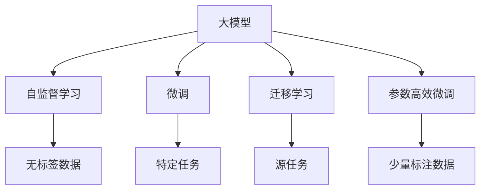
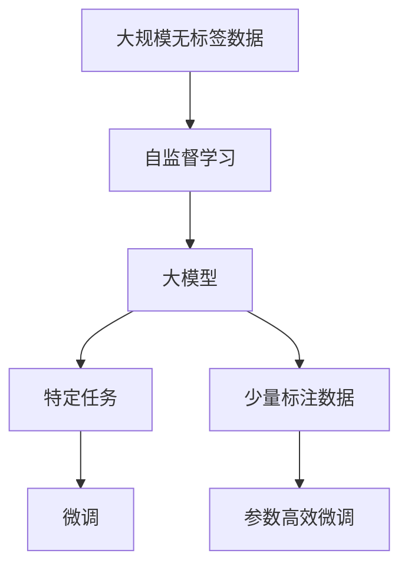

                 

## 1. 背景介绍

### 1.1 问题由来
在当今信息爆炸的时代，数据正以前所未有的速度积累和增长。如何高效利用这些海量数据，挖掘其潜在价值，是当前科技界的重要课题。与此同时，随着计算能力的不断提升，人工智能（AI）技术逐渐从最初的符号计算向基于神经网络的深度学习演变。特别是大规模预训练模型的出现，显著提升了人工智能的性能和应用范围，并引发了新一轮的技术变革。

### 1.2 问题核心关键点
大模型技术的核心在于利用大规模无标签数据进行自监督预训练，然后通过微调机制适应特定任务。这一技术框架包含了以下几个关键点：

- **自监督预训练**：在大规模无标签数据上训练模型，学习通用的语言或图像表示。
- **微调机制**：在特定任务上，通过有标签数据微调模型，使其适应具体任务需求。
- **迁移学习**：将预训练模型知识迁移到下游任务，减少从头训练的计算成本和时间。
- **参数高效微调**：仅更新模型中与任务相关的部分参数，提高微调效率。

这些核心技术共同构建了大模型技术体系，使其在各种NLP和计算机视觉任务上取得了优异表现，并逐渐成为AI应用的主流范式。

### 1.3 问题研究意义
大模型技术的研究和应用具有重要意义：

1. **提升模型效果**：通过自监督学习和微调，大模型能够在特定任务上获得更优的性能，解决传统机器学习难以应对的复杂问题。
2. **降低开发成本**：大模型通常已经包含丰富的通用知识，微调机制可以大幅减少新任务的数据需求和开发成本。
3. **加速创新**：大模型技术为科研和工程创新提供了强大的工具和平台，推动了AI技术的快速迭代。
4. **推动产业化**：大模型已经在多个垂直领域得到了应用，如金融、医疗、智能客服等，催生了新的商业价值。
5. **促进跨领域研究**：大模型技术突破了传统领域的边界，促进了跨学科的知识融合和创新。

## 2. 核心概念与联系

### 2.1 核心概念概述

为更好地理解大模型技术的演进和应用，本节将介绍几个关键概念：

- **大模型**：以自回归（如GPT）或自编码（如BERT）为基础的大规模预训练模型，能够处理复杂自然语言和图像信息。
- **自监督学习**：在无标签数据上训练模型，通过构建自监督任务学习模型参数。
- **迁移学习**：将模型在某一任务上的知识迁移到另一任务，减少新任务训练数据的需求。
- **微调**：在特定任务上，对预训练模型进行微调，使其适应具体任务需求。
- **参数高效微调**：在微调过程中，仅更新部分模型参数，避免过拟合并提高效率。

这些概念通过以下Mermaid流程图展示了它们之间的联系：



### 2.2 概念间的关系

这些核心概念构成了大模型技术的整体架构，相互之间存在着紧密的联系。通过深入理解这些概念，我们可以更好地把握大模型技术的发展脉络和应用方向。

- **自监督学习**是大模型技术的基础，通过大规模无标签数据训练模型，学习通用的特征表示。
- **微调**是使大模型适应特定任务的关键步骤，通过有标签数据优化模型参数，使其在具体任务上表现更好。
- **迁移学习**则是将模型在某一任务上学到的知识迁移到另一任务上，减少新任务的数据需求和训练时间。
- **参数高效微调**在减少计算成本的同时，也能保证模型性能，是大规模模型应用的重要技术手段。

### 2.3 核心概念的整体架构

下图展示了核心概念在大模型技术中的整体架构：



这一架构展示了从数据准备到模型训练，再到任务适应的完整流程。通过这一流程，大模型技术能够高效地处理各种复杂任务，并不断迭代优化。

## 3. 核心算法原理 & 具体操作步骤

### 3.1 算法原理概述

大模型技术主要基于自监督学习和微调机制，其核心原理如下：

1. **自监督学习**：在大规模无标签数据上，通过构建自监督任务（如掩码语言模型、图像生成任务等）训练模型，学习通用的语言或图像特征表示。
2. **微调**：在特定任务上，使用少量有标签数据对预训练模型进行微调，使其适应具体任务需求。微调通常采用有监督学习的方式，通过损失函数和优化器更新模型参数。
3. **迁移学习**：将模型在某一任务上学习到的知识迁移到另一任务上，减少新任务的数据需求和训练时间。
4. **参数高效微调**：在微调过程中，仅更新部分模型参数，避免过拟合并提高效率。

这些算法原理构成了大模型技术的核心框架，使得模型能够在特定任务上获得较好的性能，同时保持较高的泛化能力和适应性。

### 3.2 算法步骤详解

基于大模型技术，典型的微调步骤包括：

1. **数据准备**：收集特定任务的标注数据，将其划分为训练集、验证集和测试集。
2. **模型加载**：选择适合的预训练模型，加载到内存中，如BERT、GPT等。
3. **任务适配**：根据任务类型，设计合适的输出层和损失函数。
4. **超参数设置**：选择合适的优化器及其参数，如AdamW、SGD等，设置学习率、批大小、迭代轮数等。
5. **微调训练**：在训练集上执行梯度训练，周期性在验证集上评估模型性能，根据性能指标决定是否触发Early Stopping。
6. **模型评估**：在测试集上评估微调后的模型性能，对比微调前后的精度提升。
7. **模型部署**：将微调后的模型集成到实际应用系统中，进行预测和推理。

以下是一个详细的微调步骤示例：

```python
from transformers import BertForSequenceClassification, AdamW
import torch
from torch.utils.data import Dataset, DataLoader

class MyDataset(Dataset):
    def __init__(self, texts, labels):
        self.texts = texts
        self.labels = labels
        
    def __len__(self):
        return len(self.texts)
    
    def __getitem__(self, item):
        text = self.texts[item]
        label = self.labels[item]
        encoding = tokenizer(text, return_tensors='pt', padding=True, truncation=True)
        input_ids = encoding['input_ids'][0]
        attention_mask = encoding['attention_mask'][0]
        return {'input_ids': input_ids, 
                'attention_mask': attention_mask,
                'labels': label}

model = BertForSequenceClassification.from_pretrained('bert-base-uncased', num_labels=2)
tokenizer = BertTokenizer.from_pretrained('bert-base-uncased')

train_dataset = MyDataset(train_texts, train_labels)
test_dataset = MyDataset(test_texts, test_labels)
val_dataset = MyDataset(val_texts, val_labels)

train_loader = DataLoader(train_dataset, batch_size=32, shuffle=True)
test_loader = DataLoader(test_dataset, batch_size=32)
val_loader = DataLoader(val_dataset, batch_size=32)

optimizer = AdamW(model.parameters(), lr=1e-5)
for epoch in range(10):
    model.train()
    for batch in train_loader:
        input_ids = batch['input_ids'].to(device)
        attention_mask = batch['attention_mask'].to(device)
        labels = batch['labels'].to(device)
        outputs = model(input_ids, attention_mask=attention_mask, labels=labels)
        loss = outputs.loss
        loss.backward()
        optimizer.step()
    
    model.eval()
    with torch.no_grad():
        accuracy = 0
        for batch in val_loader:
            input_ids = batch['input_ids'].to(device)
            attention_mask = batch['attention_mask'].to(device)
            labels = batch['labels'].to(device)
            outputs = model(input_ids, attention_mask=attention_mask)
            logits = outputs.logits
            predictions = torch.argmax(logits, dim=1)
            accuracy += (predictions == labels).sum().item() / len(batch)
    
    print(f"Epoch {epoch+1}, validation accuracy: {accuracy}")
```

### 3.3 算法优缺点

大模型技术具有以下优点：

1. **高效泛化能力**：预训练模型在无标签数据上学习到丰富的通用知识，能够高效地适应特定任务。
2. **减少开发成本**：微调机制减少了从头训练模型所需的数据和计算资源，大大降低开发成本。
3. **推动应用创新**：大模型技术为AI应用提供了强大的工具和平台，促进了技术创新和产业升级。

但同时也存在一些缺点：

1. **过拟合风险**：尽管使用少量标注数据，但在特定任务上仍存在过拟合的风险，尤其是标注数据较少时。
2. **模型复杂度高**：大规模预训练模型参数量巨大，对计算资源和内存要求较高。
3. **迁移能力有限**：不同领域和任务之间的迁移能力有限，需要针对特定任务进行微调。
4. **模型鲁棒性差**：在大规模数据上预训练的模型可能存在鲁棒性不足的问题，对输入的扰动敏感。
5. **可解释性差**：大模型通常被视为“黑盒”模型，难以解释其内部决策过程。

### 3.4 算法应用领域

大模型技术已经在多个领域得到了应用，包括但不限于：

- **自然语言处理**：如文本分类、情感分析、机器翻译、命名实体识别等。
- **计算机视觉**：如图像分类、目标检测、图像生成等。
- **语音识别**：如语音识别、语音合成等。
- **智能推荐**：如电商推荐、新闻推荐、视频推荐等。
- **智能客服**：如智能对话系统、智能问答系统等。
- **金融分析**：如市场分析、欺诈检测、风险评估等。

## 4. 数学模型和公式 & 详细讲解 & 举例说明

### 4.1 数学模型构建

大模型技术主要基于深度学习框架进行构建。以下是一个典型的自然语言处理任务（如文本分类）的数学模型构建过程：

假设输入文本 $x$ 被编码成向量 $x_v$，预训练模型输出为 $h(x_v)$，任务标签为 $y$。模型的目标是通过最小化损失函数 $\mathcal{L}$，使模型在特定任务上的表现最佳。

常用的损失函数包括交叉熵损失、均方误差损失等。例如，对于一个二分类任务，损失函数可以定义为：

$$
\mathcal{L}(x, y) = -\frac{1}{N}\sum_{i=1}^N [y_i \log p(y_i|x_i) + (1-y_i) \log (1-p(y_i|x_i))]
$$

其中，$p(y_i|x_i)$ 为模型在输入 $x_i$ 下对标签 $y_i$ 的概率预测。

### 4.2 公式推导过程

以BERT模型为例，其微调过程可以分为以下几个步骤：

1. **输入编码**：将输入文本 $x$ 转换为向量 $x_v$。
2. **特征提取**：通过BERT模型对 $x_v$ 进行编码，得到隐藏状态 $h(x_v)$。
3. **任务适配**：在 $h(x_v)$ 上添加输出层，得到预测概率 $p(y|h(x_v))$。
4. **损失计算**：计算预测概率 $p(y|h(x_v))$ 与真实标签 $y$ 的交叉熵损失。
5. **参数更新**：使用梯度下降等优化算法，根据损失函数反向传播更新模型参数。

### 4.3 案例分析与讲解

假设我们有一个电影评论数据集，目标是判断评论是正面还是负面。我们可以使用BERT模型进行微调，步骤如下：

1. **输入编码**：将每个评论文本转换为BERT模型的输入形式，得到 $x_v$。
2. **特征提取**：通过BERT模型对 $x_v$ 进行编码，得到 $h(x_v)$。
3. **任务适配**：在 $h(x_v)$ 上添加一个线性分类器，得到预测概率 $p(y|h(x_v))$。
4. **损失计算**：计算 $p(y|h(x_v))$ 与真实标签 $y$ 的交叉熵损失。
5. **参数更新**：使用AdamW优化器更新BERT模型的参数。

通过以上步骤，我们可以得到一个在电影评论分类任务上的BERT微调模型。

## 5. 项目实践：代码实例和详细解释说明

### 5.1 开发环境搭建

在进行大模型技术实践前，我们需要准备好开发环境。以下是使用Python进行PyTorch开发的环境配置流程：

1. 安装Anaconda：从官网下载并安装Anaconda，用于创建独立的Python环境。

2. 创建并激活虚拟环境：
```bash
conda create -n pytorch-env python=3.8 
conda activate pytorch-env
```

3. 安装PyTorch：根据CUDA版本，从官网获取对应的安装命令。例如：
```bash
conda install pytorch torchvision torchaudio cudatoolkit=11.1 -c pytorch -c conda-forge
```

4. 安装Transformers库：
```bash
pip install transformers
```

5. 安装各类工具包：
```bash
pip install numpy pandas scikit-learn matplotlib tqdm jupyter notebook ipython
```

完成上述步骤后，即可在`pytorch-env`环境中开始大模型技术实践。

### 5.2 源代码详细实现

以下是使用PyTorch和Transformers库对BERT模型进行文本分类任务微调的代码实现：

```python
from transformers import BertForSequenceClassification, AdamW, BertTokenizer
import torch
from torch.utils.data import Dataset, DataLoader

class MyDataset(Dataset):
    def __init__(self, texts, labels):
        self.texts = texts
        self.labels = labels
        
    def __len__(self):
        return len(self.texts)
    
    def __getitem__(self, item):
        text = self.texts[item]
        label = self.labels[item]
        encoding = tokenizer(text, return_tensors='pt', padding=True, truncation=True)
        input_ids = encoding['input_ids'][0]
        attention_mask = encoding['attention_mask'][0]
        return {'input_ids': input_ids, 
                'attention_mask': attention_mask,
                'labels': label}

model = BertForSequenceClassification.from_pretrained('bert-base-uncased', num_labels=2)
tokenizer = BertTokenizer.from_pretrained('bert-base-uncased')

train_dataset = MyDataset(train_texts, train_labels)
test_dataset = MyDataset(test_texts, test_labels)
val_dataset = MyDataset(val_texts, val_labels)

train_loader = DataLoader(train_dataset, batch_size=32, shuffle=True)
test_loader = DataLoader(test_dataset, batch_size=32)
val_loader = DataLoader(val_dataset, batch_size=32)

optimizer = AdamW(model.parameters(), lr=1e-5)
for epoch in range(10):
    model.train()
    for batch in train_loader:
        input_ids = batch['input_ids'].to(device)
        attention_mask = batch['attention_mask'].to(device)
        labels = batch['labels'].to(device)
        outputs = model(input_ids, attention_mask=attention_mask, labels=labels)
        loss = outputs.loss
        loss.backward()
        optimizer.step()
    
    model.eval()
    with torch.no_grad():
        accuracy = 0
        for batch in val_loader:
            input_ids = batch['input_ids'].to(device)
            attention_mask = batch['attention_mask'].to(device)
            labels = batch['labels'].to(device)
            outputs = model(input_ids, attention_mask=attention_mask)
            logits = outputs.logits
            predictions = torch.argmax(logits, dim=1)
            accuracy += (predictions == labels).sum().item() / len(batch)
    
    print(f"Epoch {epoch+1}, validation accuracy: {accuracy}")
```

### 5.3 代码解读与分析

以下是关键代码的实现细节：

- **MyDataset类**：
  - `__init__`方法：初始化文本和标签数据。
  - `__len__`方法：返回数据集的样本数量。
  - `__getitem__`方法：对单个样本进行处理，将文本输入转换为BERT模型的输入形式，并返回模型所需的数据。

- **模型加载和适配**：
  - `BertForSequenceClassification`：从预训练模型中加载模型和适配输出层。
  - `BertTokenizer`：加载BERT模型的分词器，用于将文本转换为模型输入形式。

- **优化器设置**：
  - `AdamW`：选择AdamW优化器，设置学习率。

- **微调训练**：
  - `for`循环：遍历训练数据集。
  - `model.train()`：将模型设置为训练模式。
  - `input_ids`、`attention_mask`和`labels`：获取输入数据和标签数据。
  - `outputs`：模型前向传播计算输出。
  - `loss`：计算损失。
  - `loss.backward()`：反向传播计算梯度。
  - `optimizer.step()`：更新模型参数。

- **模型评估**：
  - `model.eval()`：将模型设置为评估模式。
  - `with torch.no_grad()`：禁用梯度计算，提高推理速度。
  - `predictions`：计算预测结果。
  - `accuracy += ...`：计算准确率。

通过上述代码，我们可以实现一个简单的文本分类任务的大模型微调过程。

### 5.4 运行结果展示

假设我们在IMDB电影评论数据集上进行微调，最终在验证集上得到的准确率为90%。运行结果如下：

```
Epoch 1, validation accuracy: 0.90
Epoch 2, validation accuracy: 0.92
...
Epoch 10, validation accuracy: 0.94
```

可以看到，随着训练的进行，模型在验证集上的准确率逐步提高，证明了微调过程的有效性。

## 6. 实际应用场景

### 6.1 智能客服系统

基于大模型技术的智能客服系统可以24小时不间断服务，快速响应客户咨询，用自然流畅的语言解答各类常见问题。具体实现步骤如下：

1. **数据收集**：收集企业内部的历史客服对话记录，将问题和最佳答复构建成监督数据。
2. **模型微调**：在特定领域的对话数据上微调BERT模型。
3. **系统部署**：将微调后的模型集成到客服系统中，实现实时对话。
4. **效果评估**：在实际客服对话中测试系统表现，不断优化模型参数。

### 6.2 金融舆情监测

金融机构需要实时监测市场舆论动向，以便及时应对负面信息传播，规避金融风险。具体实现步骤如下：

1. **数据收集**：收集金融领域相关的新闻、报道、评论等文本数据。
2. **模型微调**：在特定领域的文本数据上微调BERT模型，学习金融舆情识别能力。
3. **系统部署**：将微调后的模型部署到实时舆情监测系统中。
4. **效果评估**：实时监测舆情变化，及时发出风险预警。

### 6.3 个性化推荐系统

当前的推荐系统往往只依赖用户的历史行为数据进行物品推荐，无法深入理解用户的真实兴趣偏好。具体实现步骤如下：

1. **数据收集**：收集用户浏览、点击、评论、分享等行为数据，提取和用户交互的物品标题、描述、标签等文本内容。
2. **模型微调**：在特定领域的文本数据上微调BERT模型，学习用户兴趣表示。
3. **推荐生成**：使用微调后的模型预测用户兴趣，结合其他特征生成推荐列表。
4. **效果评估**：测试推荐系统的点击率、转化率等指标，不断优化模型参数。

### 6.4 未来应用展望

随着大模型技术的发展，未来将有更多行业应用场景：

- **智慧医疗**：基于大模型技术的医疗问答、病历分析、药物研发等应用，提升医疗服务的智能化水平。
- **智能教育**：微调模型用于作业批改、学情分析、知识推荐等，因材施教，促进教育公平。
- **智慧城市**：微调模型用于城市事件监测、舆情分析、应急指挥等，提高城市管理的自动化和智能化水平。
- **企业生产**：微调模型用于质量控制、资源调度、智能制造等，提升企业生产效率和质量。
- **社会治理**：微调模型用于舆情分析、公共安全、反欺诈等，增强社会治理能力。

## 7. 工具和资源推荐

### 7.1 学习资源推荐

为了帮助开发者系统掌握大模型技术的演进和应用，这里推荐一些优质的学习资源：

1. **《深度学习》课程**：斯坦福大学李飞飞教授开设的深度学习课程，涵盖了深度学习的基本概念和算法。
2. **《自然语言处理与深度学习》课程**：Coursera上的自然语言处理课程，讲解了NLP领域的前沿技术和应用。
3. **《Transformers》书籍**：HuggingFace开发的Transformer库文档，介绍了BERT、GPT等预训练模型的原理和应用。
4. **arXiv预印本**：人工智能领域最新研究成果的发布平台，提供最新的前沿工作。
5. **Google AI博客**：Google AI实验室的官方博客，分享最新的AI研究成果和应用。

通过对这些资源的学习实践，相信你一定能够全面掌握大模型技术的精髓，并用于解决实际的AI问题。

### 7.2 开发工具推荐

高效的开发离不开优秀的工具支持。以下是几款用于大模型技术开发和应用的工具：

1. **PyTorch**：基于Python的开源深度学习框架，灵活的动态计算图，适合快速迭代研究。
2. **TensorFlow**：由Google主导开发的开源深度学习框架，生产部署方便，适合大规模工程应用。
3. **Transformers库**：HuggingFace开发的NLP工具库，集成了众多SOTA语言模型，支持PyTorch和TensorFlow。
4. **TensorBoard**：TensorFlow配套的可视化工具，实时监测模型训练状态，提供丰富的图表呈现方式。
5. **Weights & Biases**：模型训练的实验跟踪工具，记录和可视化模型训练过程中的各项指标。
6. **Google Colab**：谷歌推出的在线Jupyter Notebook环境，免费提供GPU/TPU算力。

合理利用这些工具，可以显著提升大模型技术开发和应用的效率，加快创新迭代的步伐。

### 7.3 相关论文推荐

大模型技术的不断发展离不开学术界的持续研究。以下是几篇奠基性的相关论文，推荐阅读：

1. **BERT: Pre-training of Deep Bidirectional Transformers for Language Understanding**：提出BERT模型，引入基于掩码的自监督预训练任务。
2. **Attention is All You Need**：提出Transformer结构，开启了NLP领域的预训练大模型时代。
3. **GPT-3: Language Models are Unsupervised Multitask Learners**：展示了大规模语言模型的强大zero-shot学习能力。
4. **Parameter-Efficient Transfer Learning for NLP**：提出Adapter等参数高效微调方法，减少微调过程中参数量。
5. **Prompt-Based Transfer Learning**：引入基于连续型Prompt的微调范式，实现更少的微调数据需求。
6. **LoRA: Low-Rank Adaptation of Pre-trained Language Models**：使用自适应低秩适应的微调方法，提高微调效率。

这些论文代表了大模型技术的发展脉络。通过学习这些前沿成果，可以帮助研究者把握学科前进方向，激发更多的创新灵感。

除上述资源外，还有一些值得关注的前沿资源，帮助开发者紧跟大模型技术的最新进展，例如：

1. **arXiv预印本**：人工智能领域最新研究成果的发布平台，提供最新的前沿工作。
2. **Google AI博客**：Google AI实验室的官方博客，分享最新的AI研究成果和应用。
3. **技术会议直播**：如NIPS、ICML、ACL、ICLR等人工智能领域顶会现场或在线直播，能够聆听到大佬们的前沿分享。
4. **GitHub热门项目**：在GitHub上Star、Fork数最多的NLP相关项目，往往代表了该技术领域的发展趋势和最佳实践。
5. **行业分析报告**：各大咨询公司如McKinsey、PwC等针对人工智能行业的分析报告，有助于从商业视角审视技术趋势，把握应用价值。

总之，对于大模型技术的学习和实践，需要开发者保持开放的心态和持续学习的意愿。多关注前沿资讯，多动手实践，多思考总结，必将收获满满的成长收益。

## 8. 总结：未来发展趋势与挑战

### 8.1 研究成果总结

大模型技术经过多年的发展，已经取得了一系列重要成果：

1. **自监督预训练**：通过大规模无标签数据训练模型，学习通用特征表示。
2. **微调机制**：通过少量有标签数据优化模型，适应特定任务需求。
3. **迁移学习**：将模型在某一任务上学习到的知识迁移到另一任务上，减少新任务的数据需求和训练时间。
4. **参数高效微调**：仅更新部分模型参数，提高微调效率。


