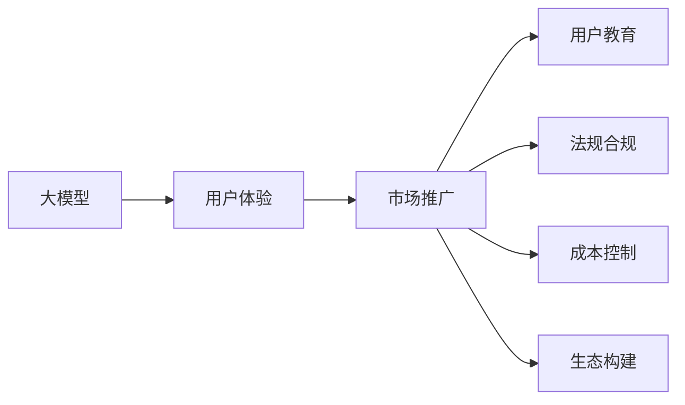
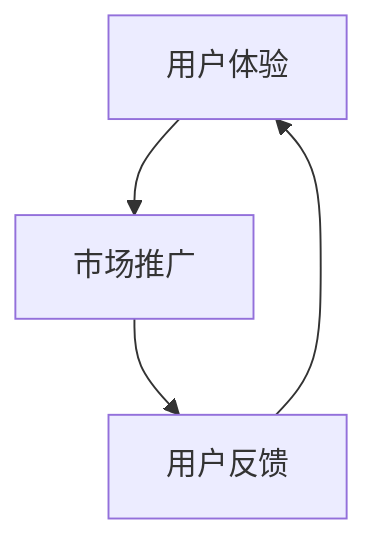
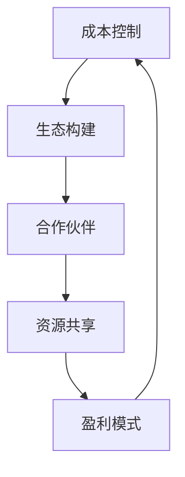
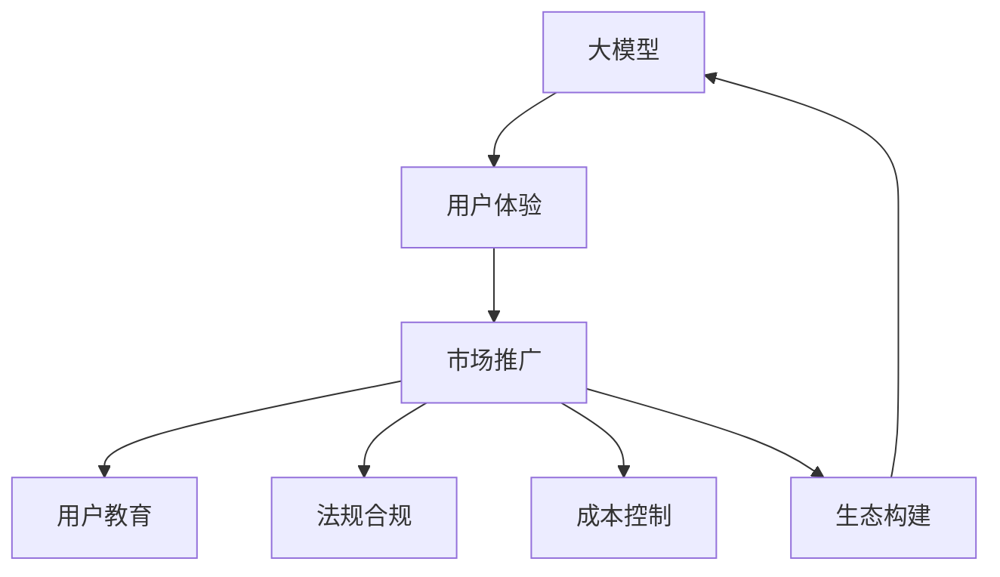

                 

# 大模型的用户体验与市场推广

## 1. 背景介绍

### 1.1 问题由来
近年来，人工智能(AI)和大数据技术的迅猛发展，推动了诸多行业数字化转型升级，同时也催生了无数AI新产品和新应用。这些新产品和服务通过运用先进技术，深刻改变了人们的日常生活和工作方式。而大模型的发展和应用，是大数据和AI技术的最新结晶，为各行各业提供了强大的算力支持，提升了用户体验的同时，也带来了显著的市场推广效果。

### 1.2 问题核心关键点
目前，大模型的用户需求日益丰富，市场推广也在不断创新，如何提升大模型的用户体验，吸引更多用户使用，成为行业亟需解决的问题。

大模型的用户体验主要包括以下几个方面：

1. **易用性**：大模型应具备易于上手、操作简单、直观明了的用户界面，以降低用户的学习成本。
2. **高效性**：大模型应具备高效运行的能力，减少等待时间和响应延迟，提升用户的使用体验。
3. **稳定性**：大模型应具备高度稳定性和可靠性的特点，确保用户在使用过程中不会遇到严重的系统故障。
4. **可扩展性**：大模型应具备良好的可扩展性，能够适应不同规模和复杂度的应用场景。
5. **隐私保护**：大模型应具备完善的隐私保护机制，保护用户数据的隐私和安全。

同时，大模型的市场推广也面临着诸多挑战：

1. **用户教育**：如何让用户理解并接受大模型，以及大模型的实际应用效果。
2. **市场竞争**：如何在众多竞争者中脱颖而出，占据市场主导地位。
3. **法规合规**：如何确保大模型符合相关法律法规和行业标准，避免潜在的法律风险。
4. **成本控制**：如何合理控制大模型的开发和运营成本，确保盈利能力。
5. **生态构建**：如何构建和维护一个健康的生态系统，吸引更多的开发者和用户。

### 1.3 问题研究意义
研究大模型的用户体验与市场推广策略，对于提升用户满意度、推动产品创新和市场拓展、确保合规安全和盈利能力，具有重要意义：

1. 提升用户体验：通过不断优化用户体验，增加用户粘性，从而提升市场占有率和用户忠诚度。
2. 推动产品创新：通过市场推广活动，不断挖掘用户需求，驱动产品和服务的持续迭代。
3. 确保合规安全：通过合理的法规合规和隐私保护机制，避免法律风险，提升品牌信誉。
4. 控制成本运营：通过成本控制策略，确保大模型产品具有市场竞争力，实现商业化应用。
5. 构建生态系统：通过生态构建策略，吸引开发者和用户参与，形成良性循环。

## 2. 核心概念与联系

### 2.1 核心概念概述

为更好地理解大模型的用户体验与市场推广策略，本节将介绍几个关键概念，并阐述它们之间的联系。

- **大模型**：指使用深度学习、分布式计算等技术，基于大量数据训练出的高性能模型，具有强大的计算能力和推理能力。
- **用户体验**：指用户在使用大模型产品时的感受和体验，包括易用性、高效性、稳定性等方面。
- **市场推广**：指通过各种手段和渠道，提升大模型产品的知名度和市场占有率的过程。
- **用户教育**：指帮助用户了解大模型产品及其应用价值，提高用户接受度的过程。
- **法规合规**：指确保大模型产品在运营过程中符合相关法律法规和行业标准，避免法律风险的过程。
- **成本控制**：指在大模型的开发、运营和维护过程中，合理控制成本，实现盈利目标的过程。
- **生态构建**：指构建和维护大模型产品的生态系统，吸引开发者和用户的过程。

这些概念之间的联系可以通过以下Mermaid流程图来展示：

这个流程图展示了大模型用户体验与市场推广的核心概念及其关系：

1. 大模型提供基础功能，用户体验直接影响用户满意度。
2. 市场推广提升大模型的知名度，吸引更多用户。
3. 用户教育增强用户对大模型的理解和接受度。
4. 法规合规确保大模型运营的合法性，避免法律风险。
5. 成本控制保障大模型产品的盈利能力。
6. 生态构建吸引开发者和用户，形成良性循环。

### 2.2 概念间的关系

这些核心概念之间存在着紧密的联系，形成了大模型用户体验与市场推广的完整生态系统。下面我们通过几个Mermaid流程图来展示这些概念之间的关系。

#### 2.2.1 用户体验与市场推广的关系

这个流程图展示了用户体验和市场推广之间的相互影响：

1. 用户体验影响市场推广的效果，用户满意度高时，市场推广难度降低。
2. 市场推广提升用户体验，通过推广活动，让用户更易使用大模型产品。

#### 2.2.2 用户教育与法规合规的关系

这个流程图展示了用户教育和法规合规的相互促进：

1. 用户教育提升用户对法规合规的认知，减少违规风险。
2. 法规合规为用户教育提供基础，确保教育内容的合法性。

#### 2.2.3 成本控制与生态构建的关系

这个流程图展示了成本控制和生态构建的相互作用：

1. 成本控制减少开发和运营成本，使生态构建更为可持续。
2. 生态构建吸引更多的资源和用户，进一步降低成本。

### 2.3 核心概念的整体架构

最后，我们用一个综合的流程图来展示这些核心概念在大模型用户体验与市场推广过程中的整体架构：

这个综合流程图展示了从大模型到用户体验，再到市场推广的完整过程。大模型作为基础，通过用户体验提升和市场推广，形成良性循环，并通过用户教育、法规合规和成本控制等策略，保障大模型产品的稳定发展。

## 3. 核心算法原理 & 具体操作步骤
### 3.1 算法原理概述

大模型的用户体验与市场推广涉及多个方面，包括用户界面设计、用户体验优化、市场推广策略、用户教育方法、法规合规措施和成本控制方法等。以下将详细介绍这些核心算法的原理和具体操作步骤。

### 3.2 算法步骤详解

#### 3.2.1 用户体验优化

1. **用户界面设计**：大模型应具备直观、易用的用户界面，通过交互式设计、图表化展示等方式，降低用户的学习成本。
2. **性能优化**：优化大模型的计算效率，减少响应时间和等待时间，提升用户体验。
3. **界面适配**：针对不同设备和平台，设计适配的用户界面，确保跨平台兼容性。
4. **用户反馈收集**：通过调查问卷、用户反馈等方式，收集用户对大模型产品的评价和建议，不断优化用户体验。

#### 3.2.2 市场推广策略

1. **市场定位**：明确大模型产品的市场定位，确定目标用户群体和应用场景。
2. **渠道选择**：选择合适的市场推广渠道，包括社交媒体、行业展会、合作伙伴等。
3. **内容制作**：制作有吸引力的市场推广内容，如演示视频、白皮书、案例分析等。
4. **效果评估**：通过数据分析、用户调研等方式，评估市场推广效果，优化推广策略。

#### 3.2.3 用户教育方法

1. **内容制作**：制作易于理解的培训材料，如教学视频、操作指南、FAQ等。
2. **用户互动**：通过在线课程、技术支持等方式，与用户进行互动，解答疑问。
3. **社区建设**：建立用户社区，提供交流平台，促进用户之间的经验分享和反馈。
4. **认证体系**：通过考试、认证等方式，提高用户的专业水平，增强其对大模型的信任度。

#### 3.2.4 法规合规措施

1. **合规审计**：定期进行法规合规审计，确保大模型符合相关法律法规和行业标准。
2. **隐私保护**：采取加密、匿名化、访问控制等技术手段，保护用户数据隐私。
3. **合规培训**：对员工进行法规合规培训，确保其理解并遵守相关规定。
4. **应急预案**：制定应急预案，应对潜在的合规风险。

#### 3.2.5 成本控制方法

1. **资源管理**：优化资源配置，减少资源浪费，提高效率。
2. **费用控制**：合理控制开发和运营费用，确保盈利能力。
3. **合作伙伴**：与合作伙伴进行资源共享，降低成本。
4. **持续优化**：通过持续优化产品和技术，降低长期运营成本。

### 3.3 算法优缺点

#### 3.3.1 用户体验优化

**优点**：

1. **提升用户满意度**：通过优化用户体验，增加用户粘性，提升用户满意度和忠诚度。
2. **降低学习成本**：设计直观易用的用户界面，降低用户学习成本，提高使用率。
3. **增强用户信任**：通过用户反馈和互动，增强用户对大模型的信任感。

**缺点**：

1. **成本投入大**：优化用户体验需要大量的人力和物力投入。
2. **个性化需求多**：不同用户对界面和功能的需求各异，难以满足所有用户。

#### 3.3.2 市场推广策略

**优点**：

1. **提升知名度**：通过有效的市场推广，提升大模型的知名度和市场占有率。
2. **吸引新用户**：通过推广活动，吸引更多的潜在用户，增加用户基数。
3. **增加收益**：通过市场推广，增加产品的销售和收入。

**缺点**：

1. **成本高**：市场推广需要大量的资金和人力投入。
2. **竞争激烈**：在激烈的市场竞争中，难以突出自身优势。

#### 3.3.3 用户教育方法

**优点**：

1. **提高专业水平**：通过培训和认证，提高用户的专业水平，增强其使用大模型的能力。
2. **增强信任感**：通过用户互动和反馈，增强用户对大模型的信任感。
3. **促进社区建设**：建立用户社区，促进用户之间的经验分享和反馈。

**缺点**：

1. **资源消耗大**：用户教育需要大量的时间和资源投入。
2. **效果难以量化**：用户教育效果难以量化评估，难以评估投资回报。

#### 3.3.4 法规合规措施

**优点**：

1. **减少法律风险**：通过合规措施，确保大模型运营合法合规，避免法律风险。
2. **提高品牌信誉**：符合法规标准的品牌更容易获得用户信任和认可。
3. **增强用户信任**：通过隐私保护和合规培训，增强用户对大模型的信任感。

**缺点**：

1. **投入成本高**：法规合规需要大量的人力和物力投入。
2. **复杂度高**：法规标准复杂多变，合规难度大。

#### 3.3.5 成本控制方法

**优点**：

1. **提升盈利能力**：通过成本控制，确保大模型产品的盈利能力。
2. **降低长期运营成本**：通过优化资源配置和持续优化，降低长期运营成本。
3. **提高效率**：通过资源管理和费用控制，提高大模型的运营效率。

**缺点**：

1. **技术要求高**：成本控制需要高水平的技术和管理能力。
2. **难度大**：不同产品和应用场景的成本控制策略不同，难以统一。

### 3.4 算法应用领域

大模型的用户体验与市场推广方法广泛适用于各类NLP应用，包括文本分类、机器翻译、信息抽取、问答系统、智能客服等。

1. **文本分类**：通过优化用户界面和提升性能，使用户更易使用文本分类工具，并通过市场推广活动，提高产品知名度。
2. **机器翻译**：通过用户教育和法规合规措施，确保用户理解机器翻译的效果，并通过成本控制，降低长期运营成本。
3. **信息抽取**：通过用户反馈和法规合规，提升信息抽取的准确性和可靠性，并通过成本控制，确保产品的盈利能力。
4. **问答系统**：通过优化用户体验和市场推广，吸引用户使用问答系统，并通过用户教育，提高用户满意度。
5. **智能客服**：通过用户界面设计和性能优化，提升智能客服的使用体验，并通过市场推广，提高品牌知名度。

## 4. 数学模型和公式 & 详细讲解 & 举例说明

### 4.1 数学模型构建

#### 4.1.1 用户体验模型

假设大模型产品为 $M$，用户体验为 $U$，市场推广为 $P$，用户教育为 $E$，法规合规为 $C$，成本控制为 $F$，生态构建为 $G$。则用户体验与市场推广的整体模型可以表示为：

$$
U = f(M, P, E, C, F, G)
$$

其中，$f$ 表示一系列的映射函数，包括用户界面设计、性能优化、市场推广策略、用户教育方法、法规合规措施和成本控制方法。

#### 4.1.2 市场推广模型

市场推广模型可以表示为：

$$
P = g(U, M, E, C, F, G)
$$

其中，$g$ 表示一系列的映射函数，包括市场定位、渠道选择、内容制作、效果评估等。

#### 4.1.3 用户教育模型

用户教育模型可以表示为：

$$
E = h(U, M, P, C, F, G)
$$

其中，$h$ 表示一系列的映射函数，包括内容制作、用户互动、社区建设、认证体系等。

#### 4.1.4 法规合规模型

法规合规模型可以表示为：

$$
C = i(U, M, E, F, G)
$$

其中，$i$ 表示一系列的映射函数，包括合规审计、隐私保护、合规培训、应急预案等。

#### 4.1.5 成本控制模型

成本控制模型可以表示为：

$$
F = j(U, M, P, E, C, G)
$$

其中，$j$ 表示一系列的映射函数，包括资源管理、费用控制、合作伙伴、持续优化等。

#### 4.1.6 生态构建模型

生态构建模型可以表示为：

$$
G = k(U, M, P, E, C, F)
$$

其中，$k$ 表示一系列的映射函数，包括合作伙伴、资源共享、盈利模式等。

### 4.2 公式推导过程

#### 4.2.1 用户体验模型推导

假设用户体验 $U$ 可以分解为以下三个部分：

$$
U = U_{UI} + U_{Performance} + U_{Feedback}
$$

其中，$U_{UI}$ 表示用户界面设计的影响，$U_{Performance}$ 表示性能优化，$U_{Feedback}$ 表示用户反馈。

根据上述假设，可以得到用户体验的计算公式：

$$
U_{UI} = \sum_{i=1}^{n} f_i(M_i)
$$

其中，$f_i$ 表示用户界面设计中第 $i$ 个映射函数，$M_i$ 表示第 $i$ 个设计要素。

$$
U_{Performance} = \sum_{j=1}^{m} g_j(M_j)
$$

其中，$g_j$ 表示性能优化中第 $j$ 个映射函数，$M_j$ 表示第 $j$ 个优化要素。

$$
U_{Feedback} = \sum_{k=1}^{l} h_k(M_k)
$$

其中，$h_k$ 表示用户反馈中第 $k$ 个映射函数，$M_k$ 表示第 $k$ 个反馈要素。

综上所述，用户体验模型的完整公式可以表示为：

$$
U = \sum_{i=1}^{n} f_i(M_i) + \sum_{j=1}^{m} g_j(M_j) + \sum_{k=1}^{l} h_k(M_k)
$$

#### 4.2.2 市场推广模型推导

假设市场推广 $P$ 可以分解为以下四个部分：

$$
P = P_{Positioning} + P_{Channel} + P_{Content} + P_{Evaluation}
$$

其中，$P_{Positioning}$ 表示市场定位的影响，$P_{Channel}$ 表示渠道选择的影响，$P_{Content}$ 表示内容制作的影响，$P_{Evaluation}$ 表示效果评估的影响。

根据上述假设，可以得到市场推广的计算公式：

$$
P_{Positioning} = \sum_{p=1}^{n} f_p(U_p)
$$

其中，$f_p$ 表示市场定位中第 $p$ 个映射函数，$U_p$ 表示第 $p$ 个定位要素。

$$
P_{Channel} = \sum_{q=1}^{m} g_q(U_q)
$$

其中，$g_q$ 表示渠道选择中第 $q$ 个映射函数，$U_q$ 表示第 $q$ 个渠道选择要素。

$$
P_{Content} = \sum_{r=1}^{l} h_r(U_r)
$$

其中，$h_r$ 表示内容制作中第 $r$ 个映射函数，$U_r$ 表示第 $r$ 个内容制作要素。

$$
P_{Evaluation} = \sum_{s=1}^{t} i_s(U_s)
$$

其中，$i_s$ 表示效果评估中第 $s$ 个映射函数，$U_s$ 表示第 $s$ 个效果评估要素。

综上所述，市场推广模型的完整公式可以表示为：

$$
P = \sum_{p=1}^{n} f_p(U_p) + \sum_{q=1}^{m} g_q(U_q) + \sum_{r=1}^{l} h_r(U_r) + \sum_{s=1}^{t} i_s(U_s)
$$

#### 4.2.3 用户教育模型推导

假设用户教育 $E$ 可以分解为以下五个部分：

$$
E = E_{Content} + E_{Interaction} + E_{Community} + E_{Certification} + E_{Feedback}
$$

其中，$E_{Content}$ 表示内容制作的影响，$E_{Interaction}$ 表示用户互动的影响，$E_{Community}$ 表示社区建设的影响，$E_{Certification}$ 表示认证体系的影响，$E_{Feedback}$ 表示用户反馈的影响。

根据上述假设，可以得到用户教育的计算公式：

$$
E_{Content} = \sum_{p=1}^{n} f_p(U_p)
$$

其中，$f_p$ 表示内容制作中第 $p$ 个映射函数，$U_p$ 表示第 $p$ 个内容制作要素。

$$
E_{Interaction} = \sum_{q=1}^{m} g_q(U_q)
$$

其中，$g_q$ 表示用户互动中第 $q$ 个映射函数，$U_q$ 表示第 $q$ 个用户互动要素。

$$
E_{Community} = \sum_{r=1}^{l} h_r(U_r)
$$

其中，$h_r$ 表示社区建设中第 $r$ 个映射函数，$U_r$ 表示第 $r$ 个社区建设要素。

$$
E_{Certification} = \sum_{s=1}^{t} i_s(U_s)
$$

其中，$i_s$ 表示认证体系中第 $s$ 个映射函数，$U_s$ 表示第 $s$ 个认证体系要素。

$$
E_{Feedback} = \sum_{t=1}^{u} j_t(U_t)
$$

其中，$j_t$ 表示用户反馈中第 $t$ 个映射函数，$U_t$ 表示第 $t$ 个用户反馈要素。

综上所述，用户教育模型的完整公式可以表示为：

$$
E = \sum_{p=1}^{n} f_p(U_p) + \sum_{q=1}^{m} g_q(U_q) + \sum_{r=1}^{l} h_r(U_r) + \sum_{s=1}^{t} i_s(U_s) + \sum_{t=1}^{u} j_t(U_t)
$$

#### 4.2.4 法规合规模型推导

假设法规合规 $C$ 可以分解为以下三个部分：

$$
C = C_{Audit} + C_{Privacy} + C_{Training} + C_{Preparedness}
$$

其中，$C_{Audit}$ 表示合规审计的影响，$C_{Privacy}$ 表示隐私保护的影响，$C_{Training}$ 表示合规培训的影响，$C_{Preparedness}$ 表示应急预案的影响。

根据上述假设，可以得到法规合规的计算公式：

$$
C_{Audit} = \sum_{p=1}^{n} f_p(U_p)
$$

其中，$f_p$ 表示合规审计中第 $p$ 个映射函数，$U_p$ 表示第 $p$ 个合规审计要素。

$$
C_{Privacy} = \sum_{q=1}^{m} g_q(U_q)
$$

其中，$g_q$ 表示隐私保护中第 $q$ 个映射函数，$U_q$ 表示第 $q$ 个隐私保护要素。

$$
C_{Training} = \sum_{r=1}^{l} h_r(U_r)
$$

其中，$h_r$ 表示合规培训中第 $r$ 个映射函数，$U_r$ 表示第 $r$ 个合规培训要素。

$$
C_{Preparedness} = \sum_{s=1}^{t} i_s(U_s)
$$

其中，$i_s$ 表示应急预案中第 $s$ 个映射函数，$U_s$ 表示第 $s$ 个应急预案要素。

综上所述，法规合规模型的完整公式可以表示为：

$$
C = \sum_{p=1}^{n} f_p(U_p) + \sum_{q=1}^{m} g_q(U_q) + \sum_{r=1}^{l} h_r(U_r) + \sum_{s=1}^{t} i_s(U_s)
$$

#### 4.2.5 成本控制模型推导

假设成本控制 $F$ 可以分解为以下四个部分：

$$
F = F_{Resource} + F_{Cost} + F_{Collaboration} + F_{Optimization}
$$

其中，$F_{Resource}$ 表示资源管理的影响，$F_{Cost}$ 表示费用控制的影响，$F_{Collaboration}$ 表示合作伙伴的影响，$F_{Optimization}$ 表示持续优化的影响。

根据上述假设，可以得到成本控制的计算公式：

$$
F_{Resource} = \sum_{p=1}^{n} f_p(U_p)
$$

其中，$f_p$ 表示资源管理中第 $p$ 个映射函数，$U_p$ 表示第 $p$ 个资源管理要素。

$$
F_{Cost} = \sum_{q=1}^{m} g_q(U_q)
$$

其中，$g_q$ 表示费用控制中第 $q$ 个映射函数，$U_q$ 表示第 $q$ 个费用控制要素。

$$
F_{Collaboration} = \sum_{r=1}^{l} h_r(U_r)
$$

其中，$h_r$ 表示合作伙伴中第 $r$ 个映射函数，$U_r$ 表示第 $r$ 个合作伙伴要素。

$$
F_{Optimization} = \sum_{s=1}^{t} i_s(U_s)
$$

其中，$i_s$ 表示持续优化中第 $s$ 个映射函数，$U_s$ 表示第 $s$ 个持续优化要素。

综上所述，成本控制模型的完整公式可以表示为：

$$
F = \sum_{p=1}^{n} f_p(U_p) + \sum_{q=1}^{m} g_q(U_q) + \sum_{r=1}^{l} h_r(U_r) + \sum_{s=1}^{t} i_s(U_s)
$$

#### 4.2.6 生态构建模型推导

假设生态构建 $G$ 可以分解为以下两个部分：

$$
G = G_{Partnership} + G_{Sharing} + G_{Revenue}
$$

其中，$G_{Partnership}$ 表示合作伙伴的影响，$G_{Sharing}$ 表示资源共享的影响，$G_{Revenue}$ 表示盈利模式的影响。

根据上述假设，可以得到生态构建的计算公式：

$$
G_{Partnership} = \sum_{p=1}^{n} f_p(U_p)
$$

其中，$f_p$ 表示合作伙伴中第 $p$ 个映射函数，$U_p$ 表示第 $p$ 个合作伙伴要素。

$$
G_{Sharing} = \sum_{q=1}^{m} g_q(U_q)
$$

其中，$g_q$ 表示资源共享中第 $q$ 个映射函数

