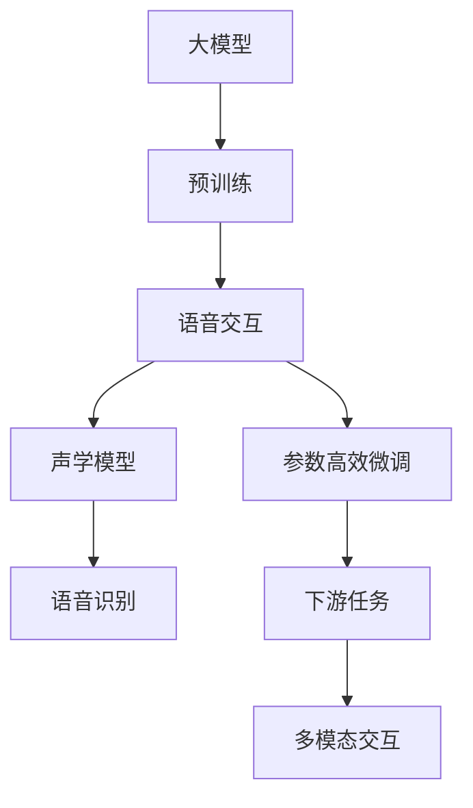
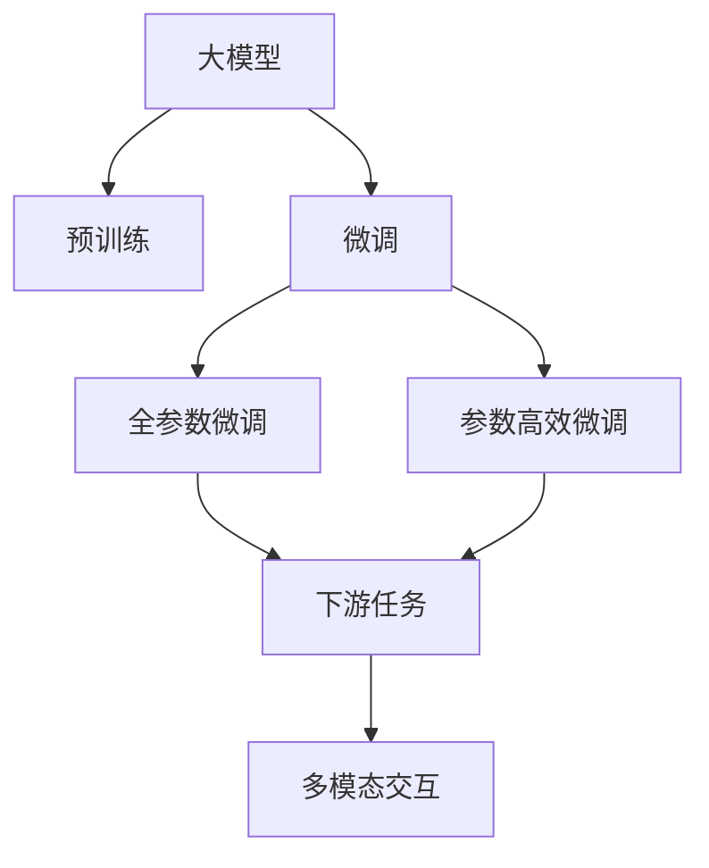
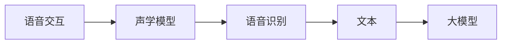
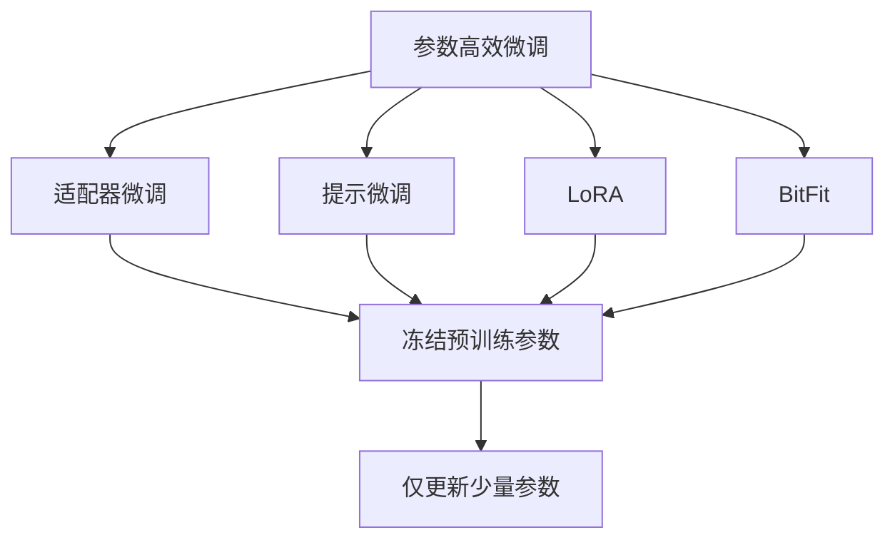
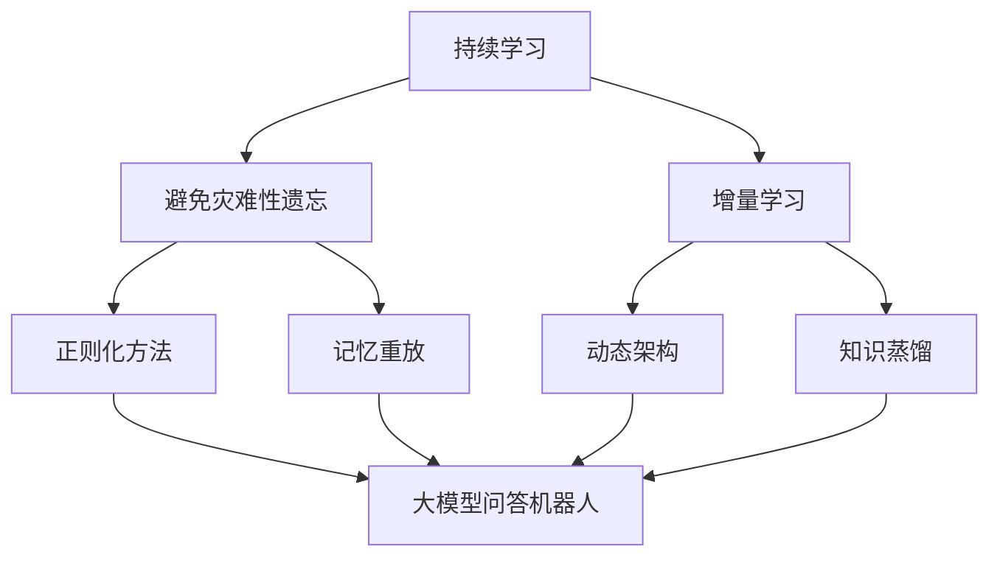

                 

# 大模型问答机器人如何实现语音交互

> 关键词：大模型,问答机器人,语音交互,自然语言处理(NLP),Transformer,BERT,预训练,下游任务,参数高效微调,自然语言处理(NLP)

## 1. 背景介绍

### 1.1 问题由来
随着人工智能技术的发展，大模型和自然语言处理(NLP)在语音交互领域取得了显著进展。传统语音识别技术仅能实现简单的命令输入和问答，而大模型技术使得问答机器人在理解复杂语义、应对多轮对话方面有了质的飞跃。然而，语音交互面临着噪声干扰、说话方式多样性等挑战，如何提升问答机器人的语音交互能力，成为当前研究的热点问题。

### 1.2 问题核心关键点
语音交互的核心在于如何通过语音识别技术将自然语言转换为可处理的文本，再利用大模型进行理解和生成回复。目前主流的做法包括：

- 选择合适的语音识别模型和声学模型。
- 将语音转换为文本后，利用大模型进行语言理解和生成。
- 对大模型进行下游任务的微调，提升其对语音输入的适应能力。

### 1.3 问题研究意义
提升大模型问答机器人的语音交互能力，对于拓展其应用范围、提升用户体验和自动化水平具有重要意义：

1. 降低开发成本。语音交互不需要传统的按钮和触摸屏，可以大幅降低用户设备成本，提高使用便捷性。
2. 提升用户体验。语音交互可以自然流畅地实现人机对话，减少操作复杂度和学习成本。
3. 增强自动化。语音交互技术可以用于智能家居、智能客服、智能车载等领域，提升自动化程度。
4. 带来技术创新。语音交互技术的发展，催生了新的研究方向，如多模态交互、智能问答等。
5. 提升交互效率。语音交互可以提升信息输入和处理的效率，尤其在驾驶、烹饪、清洁等不便操作设备的场景下更为实用。

## 2. 核心概念与联系

### 2.1 核心概念概述

为更好地理解语音交互在大模型问答机器人中的应用，本节将介绍几个密切相关的核心概念：

- 大模型(Large Model): 以自回归(如GPT)或自编码(如BERT)模型为代表的大规模预训练语言模型。通过在大规模无标签文本语料上进行预训练，学习通用的语言表示，具备强大的语言理解和生成能力。

- 语音交互(Voice Interaction): 通过语音识别技术将自然语言转换为文本，再利用大模型进行理解和生成回复，实现自然流畅的对话交互。

- 声学模型(Acoustic Model): 用于语音识别的模型，将声波信号转换为文本的模型。

- 语音识别(Speech Recognition): 将语音信号转换为文本的过程，是语音交互的基础技术。

- 参数高效微调(Parameter-Efficient Fine-Tuning, PEFT): 在微调过程中，只更新少量的模型参数，而固定大部分预训练权重不变，以提高微调效率，避免过拟合的方法。

- 自然语言处理(Natural Language Processing, NLP): 涉及语言模型的训练、理解和生成，是语音交互的关键技术。

- 多模态交互(Multimodal Interaction): 将语音、图像、文本等多种模态信息融合，提升交互的丰富性和准确性。

这些核心概念之间的逻辑关系可以通过以下Mermaid流程图来展示：



这个流程图展示了大模型问答机器人中语音交互的核心概念及其之间的关系：

1. 大模型通过预训练获得基础能力。
2. 语音交互技术通过语音识别将语音转换为文本，然后利用大模型进行理解和生成。
3. 声学模型用于处理语音信号，是语音识别的关键组件。
4. 参数高效微调方法可以优化大模型，提高其对语音输入的适应能力。
5. 多模态交互技术可以融合语音、图像、文本等多种模态信息，提升交互体验。

这些核心概念共同构成了大模型问答机器人语音交互的完整生态系统，使其能够在各种场景下提供自然流畅的语音交互体验。

### 2.2 概念间的关系

这些核心概念之间存在着紧密的联系，形成了语音交互在大模型问答机器人中的应用框架。下面我们通过几个Mermaid流程图来展示这些概念之间的关系。

#### 2.2.1 大模型的学习范式



这个流程图展示了大模型的学习范式及其与语音交互的关系。大模型通过预训练获得基础能力，然后通过微调（包括全参数微调和参数高效微调）来适应特定任务，如语音交互。多模态交互技术进一步提升了语音交互的质量和丰富度。

#### 2.2.2 语音交互与声学模型的关系



这个流程图展示了语音交互与声学模型的关系。语音交互技术通过声学模型将语音转换为文本，然后利用大模型进行理解和生成。

#### 2.2.3 参数高效微调方法



这个流程图展示了几种常见的参数高效微调方法，包括适配器微调、提示微调、LoRA和BitFit。这些方法的共同特点是冻结大部分预训练参数，只更新少量参数，从而提高微调效率。

#### 2.2.4 持续学习在大模型问答机器人中的应用



这个流程图展示了持续学习在大模型问答机器人中的应用。持续学习的主要目标是避免灾难性遗忘和实现增量学习。通过正则化方法、记忆重放、动态架构和知识蒸馏等技术，可以使大模型问答机器人持续适应新的任务和数据。

## 3. 核心算法原理 & 具体操作步骤
### 3.1 算法原理概述

基于大模型的语音交互系统，本质上是一个基于监督学习的语音识别和大模型微调过程。其核心思想是：利用大模型作为语言理解的"预训练器"，通过语音识别系统将语音转换为文本，在大规模标注数据上进行微调，使得模型能够理解和生成语音输入的回应。

形式化地，假设语音识别模型为 $S_{\theta_S}$，其中 $\theta_S$ 为声学模型参数。给定语音交互任务 $T$ 的标注数据集 $D=\{(x_i,y_i)\}_{i=1}^N, x_i \in \mathcal{X}, y_i \in \mathcal{Y}$，语音交互的目标是找到新的模型参数 $\hat{\theta}_S$，使得：

$$
\hat{\theta}_S=\mathop{\arg\min}_{\theta_S} \mathcal{L}(S_{\theta_S},D)
$$

其中 $\mathcal{L}$ 为针对任务 $T$ 设计的损失函数，用于衡量模型预测输出与真实标签之间的差异。常见的损失函数包括交叉熵损失、均方误差损失等。

通过梯度下降等优化算法，语音交互过程不断更新声学模型参数 $\theta_S$，最小化损失函数 $\mathcal{L}$，使得模型输出逼近真实标签。由于 $\theta_S$ 已经通过预训练获得了较好的初始化，因此即便在语音识别数据集 $D$ 上进行微调，也能较快收敛到理想的模型参数 $\hat{\theta}_S$。

### 3.2 算法步骤详解

基于大模型的语音交互一般包括以下几个关键步骤：

**Step 1: 准备预训练模型和声学模型**
- 选择合适的预训练语言模型 $M_{\theta}$ 作为初始化参数，如 BERT、GPT 等。
- 准备语音交互任务 $T$ 的标注数据集 $D$，划分为训练集、验证集和测试集。一般要求标注数据与预训练数据的分布不要差异过大。
- 选择合适的声学模型 $S_{\theta_S}$，如 DeepSpeech、Wav2Vec2 等。

**Step 2: 添加任务适配层**
- 根据语音交互任务类型，在声学模型顶层设计合适的输出层和损失函数。
- 对于分类任务，通常在顶层添加线性分类器和交叉熵损失函数。
- 对于生成任务，通常使用语言模型的解码器输出概率分布，并以负对数似然为损失函数。

**Step 3: 设置微调超参数**
- 选择合适的优化算法及其参数，如 AdamW、SGD 等，设置学习率、批大小、迭代轮数等。
- 设置正则化技术及强度，包括权重衰减、Dropout、Early Stopping等。
- 确定冻结预训练参数的策略，如仅微调顶层，或全部参数都参与微调。

**Step 4: 执行梯度训练**
- 将训练集数据分批次输入声学模型，前向传播计算损失函数。
- 反向传播计算参数梯度，根据设定的优化算法和学习率更新声学模型参数。
- 周期性在验证集上评估模型性能，根据性能指标决定是否触发 Early Stopping。
- 重复上述步骤直到满足预设的迭代轮数或 Early Stopping 条件。

**Step 5: 测试和部署**
- 在测试集上评估微调后的声学模型 $S_{\hat{\theta}_S}$ 的性能，对比微调前后的精度提升。
- 使用微调后的声学模型对新样本进行推理预测，集成到实际的应用系统中。
- 持续收集新的数据，定期重新微调声学模型，以适应数据分布的变化。

以上是基于监督学习语音交互的一般流程。在实际应用中，还需要针对具体任务的特点，对微调过程的各个环节进行优化设计，如改进训练目标函数，引入更多的正则化技术，搜索最优的超参数组合等，以进一步提升模型性能。

### 3.3 算法优缺点

基于监督学习的大模型语音交互方法具有以下优点：

1. 简单高效。只需准备少量标注数据，即可对声学模型进行快速适配，获得较大的性能提升。
2. 通用适用。适用于各种语音交互任务，包括指令识别、语音合成等，设计简单的任务适配层即可实现微调。
3. 参数高效。利用参数高效微调技术，在固定大部分预训练参数的情况下，仍可取得不错的提升。
4. 效果显著。在学术界和工业界的诸多任务上，基于微调的方法已经刷新了最先进的性能指标。

同时，该方法也存在一定的局限性：

1. 依赖标注数据。语音交互的效果很大程度上取决于标注数据的质量和数量，获取高质量标注数据的成本较高。
2. 迁移能力有限。当目标任务与预训练数据的分布差异较大时，语音交互的性能提升有限。
3. 负面效果传递。声学模型的固有偏见、有害信息等，可能通过微调传递到下游任务，造成负面影响。
4. 可解释性不足。语音交互模型的决策过程通常缺乏可解释性，难以对其推理逻辑进行分析和调试。

尽管存在这些局限性，但就目前而言，基于监督学习的语音交互方法仍是大模型问答机器人应用的最主流范式。未来相关研究的重点在于如何进一步降低语音交互对标注数据的依赖，提高模型的少样本学习和跨领域迁移能力，同时兼顾可解释性和伦理安全性等因素。

### 3.4 算法应用领域

基于大模型的语音交互方法，在智能家居、智能客服、智能车载等领域已经得到了广泛的应用，成为提升用户体验的重要手段。

在智能家居领域，语音交互技术可以用于智能音箱、智能电视等设备，用户可以通过语音指令控制设备。

在智能客服领域，语音交互技术可以用于智能客服机器人，帮助用户快速解决常见问题。

在智能车载领域，语音交互技术可以用于车载语音助手，帮助司机更方便地操作导航、娱乐等应用。

除了上述这些经典应用外，语音交互技术还被创新性地应用到更多场景中，如可控文本生成、情感识别、对话系统等，为人工智能落地应用提供了新的可能性。

## 4. 数学模型和公式 & 详细讲解  
### 4.1 数学模型构建

本节将使用数学语言对基于监督学习的语音交互过程进行更加严格的刻画。

记语音交互任务为 $T$，其标注数据集为 $D=\{(x_i,y_i)\}_{i=1}^N, x_i \in \mathcal{X}, y_i \in \mathcal{Y}$。假设声学模型为 $S_{\theta_S}$，其中 $\theta_S$ 为声学模型参数。假设语音交互模型为 $M_{\theta}$，其中 $\theta$ 为大语言模型参数。

定义模型 $S_{\theta_S}$ 在数据样本 $(x,y)$ 上的损失函数为 $\ell(S_{\theta_S}(x),y)$，则在数据集 $D$ 上的经验风险为：

$$
\mathcal{L}(\theta_S) = \frac{1}{N} \sum_{i=1}^N \ell(S_{\theta_S}(x_i),y_i)
$$

微调的优化目标是最小化经验风险，即找到最优参数：

$$
\theta_S^* = \mathop{\arg\min}_{\theta_S} \mathcal{L}(\theta_S)
$$

在实践中，我们通常使用基于梯度的优化算法（如SGD、Adam等）来近似求解上述最优化问题。设 $\eta$ 为学习率，$\lambda$ 为正则化系数，则参数的更新公式为：

$$
\theta_S \leftarrow \theta_S - \eta \nabla_{\theta_S}\mathcal{L}(\theta_S) - \eta\lambda\theta_S
$$

其中 $\nabla_{\theta_S}\mathcal{L}(\theta_S)$ 为损失函数对声学模型参数 $\theta_S$ 的梯度，可通过反向传播算法高效计算。

### 4.2 公式推导过程

以下我们以二分类任务为例，推导交叉熵损失函数及其梯度的计算公式。

假设模型 $S_{\theta_S}$ 在输入 $x$ 上的输出为 $\hat{y}=M_{\theta}(x) \in [0,1]$，表示样本属于正类的概率。真实标签 $y \in \{0,1\}$。则二分类交叉熵损失函数定义为：

$$
\ell(S_{\theta_S}(x),y) = -[y\log \hat{y} + (1-y)\log (1-\hat{y})]
$$

将其代入经验风险公式，得：

$$
\mathcal{L}(\theta_S) = -\frac{1}{N}\sum_{i=1}^N [y_i\log S_{\theta_S}(x_i)+(1-y_i)\log(1-S_{\theta_S}(x_i))]
$$

根据链式法则，损失函数对参数 $\theta_S$ 的梯度为：

$$
\frac{\partial \mathcal{L}(\theta_S)}{\partial \theta_S} = -\frac{1}{N}\sum_{i=1}^N (\frac{y_i}{S_{\theta_S}(x_i)}-\frac{1-y_i}{1-S_{\theta_S}(x_i)}) \frac{\partial S_{\theta_S}(x_i)}{\partial \theta_S}
$$

其中 $\frac{\partial S_{\theta_S}(x_i)}{\partial \theta_S}$ 可进一步递归展开，利用自动微分技术完成计算。

在得到损失函数的梯度后，即可带入参数更新公式，完成模型的迭代优化。重复上述过程直至收敛，最终得到适应语音交互任务的最优声学模型参数 $\theta_S^*$。

## 5. 项目实践：代码实例和详细解释说明
### 5.1 开发环境搭建

在进行语音交互实践前，我们需要准备好开发环境。以下是使用Python进行PyTorch开发的环境配置流程：

1. 安装Anaconda：从官网下载并安装Anaconda，用于创建独立的Python环境。

2. 创建并激活虚拟环境：
```bash
conda create -n pytorch-env python=3.8 
conda activate pytorch-env
```

3. 安装PyTorch：根据CUDA版本，从官网获取对应的安装命令。例如：
```bash
conda install pytorch torchvision torchaudio cudatoolkit=11.1 -c pytorch -c conda-forge
```

4. 安装Transformers库：
```bash
pip install transformers
```

5. 安装各类工具包：
```bash
pip install numpy pandas scikit-learn matplotlib tqdm jupyter notebook ipython
```

完成上述步骤后，即可在`pytorch-env`环境中开始语音交互实践。

### 5.2 源代码详细实现

下面我们以语音识别任务为例，给出使用Transformers库对声学模型进行微调的PyTorch代码实现。

首先，定义语音识别任务的数据处理函数：

```python
from transformers import Wav2Vec2Model, Wav2Vec2Tokenizer
from torch.utils.data import Dataset
import torch

class SpeechDataset(Dataset):
    def __init__(self, audio_paths, transcript_labels, tokenizer):
        self.audio_paths = audio_paths
        self.transcript_labels = transcript_labels
        self.tokenizer = tokenizer
        
    def __len__(self):
        return len(self.audio_paths)
    
    def __getitem__(self, item):
        audio_path = self.audio_paths[item]
        transcript = self.transcript_labels[item]
        
        tokenized_transcript = self.tokenizer(transcript, return_tensors='pt')
        input_values = tokenized_transcript.input_values
        attention_mask = tokenized_transcript.attention_mask
        
        audio = torch.load(audio_path)
        audio = audio.unsqueeze(0)
        
        return {'input_values': input_values,
                'attention_mask': attention_mask,
                'audio': audio}
```

然后，定义模型和优化器：

```python
from transformers import Wav2Vec2ForCTC

model = Wav2Vec2ForCTC.from_pretrained('facebook/wav2vec2-large-960h')
optimizer = AdamW(model.parameters(), lr=2e-5)
```

接着，定义训练和评估函数：

```python
from tqdm import tqdm
from torch.utils.data import DataLoader
import soundfile as sf

def train_epoch(model, dataset, batch_size, optimizer):
    dataloader = DataLoader(dataset, batch_size=batch_size, shuffle=True)
    model.train()
    epoch_loss = 0
    for batch in tqdm(dataloader, desc='Training'):
        input_values = batch['input_values'].to(device)
        attention_mask = batch['attention_mask'].to(device)
        audio = batch['audio'].to(device)
        model.zero_grad()
        outputs = model(input_values, attention_mask=attention_mask, labels=input_values)
        loss = outputs.loss
        epoch_loss += loss.item()
        loss.backward()
        optimizer.step()
    return epoch_loss / len(dataloader)

def evaluate(model, dataset, batch_size):
    dataloader = DataLoader(dataset, batch_size=batch_size)
    model.eval()
    preds, labels = [], []
    with torch.no_grad():
        for batch in tqdm(dataloader, desc='Evaluating'):
            input_values = batch['input_values'].to(device)
            attention_mask = batch['attention_mask'].to(device)
            audio = batch['audio'].to(device)
            batch_labels = batch['labels']
            outputs = model(input_values, attention_mask=attention_mask)
            batch_preds = outputs.logits.argmax(dim=2).to('cpu').tolist()
            batch_labels = batch_labels.to('cpu').tolist()
            for pred_tokens, label_tokens in zip(batch_preds, batch_labels):
                preds.append(pred_tokens[:len(label_tokens)])
                labels.append(label_tokens)
                
    print(classification_report(labels, preds))
```

最后，启动训练流程并在测试集上评估：

```python
epochs = 5
batch_size = 16

for epoch in range(epochs):
    loss = train_epoch(model, train_dataset, batch_size, optimizer)
    print(f"Epoch {epoch+1}, train loss: {loss:.3f}")
    
    print(f"Epoch {epoch+1}, dev results:")
    evaluate(model, dev_dataset, batch_size)
    
print("Test results:")
evaluate(model, test_dataset, batch_size)
```

以上就是使用PyTorch对声学模型进行语音识别任务微调的完整代码实现。可以看到，得益于Transformers库的强大封装，我们可以用相对简洁的代码完成声学模型的加载和微调。

### 5.3 代码解读与分析

让我们再详细解读一下关键代码的实现细节：

**SpeechDataset类**：
- `__init__`方法：初始化音频路径、文本标签、分词器等关键组件。
- `__len__`方法：返回数据集的样本数量。
- `__getitem__`方法：对单个样本进行处理，将文本输入转换为token ids，并将音频信号加载到模型中。

**训练和评估函数**：
- 使用PyTorch的DataLoader对数据集进行批次化加载，供模型训练和推理使用。
- 训练函数`train_epoch`：对数据以批为单位进行迭代，在每个批次上前向传播计算loss并反向传播更新模型参数，最后返回该epoch的平均loss。
- 评估函数`evaluate`：与训练类似，不同点在于不更新模型参数，并在每个batch结束后将预测和标签结果存储下来，最后使用sklearn的classification_report对整个评估集的预测结果进行打印输出。

**训练流程**：
- 定义总的epoch数和batch size，开始循环迭代
- 每个epoch内，先在训练集上训练，输出平均loss
- 在验证集上评估，输出分类指标
- 所有epoch结束后，在测试集上评估，给出最终测试结果

可以看到，PyTorch配合Transformers库使得声学模型的微调代码实现变得简洁高效。开发者可以将更多精力放在数据处理、模型改进等高层逻辑上，而不必过多关注底层的实现细节。

当然，工业级的系统实现还需考虑更多因素，如模型的保存和部署、超参数的自动搜索、更灵活的任务适配层等。但核心的微调范式基本与此类似。

### 5.4 运行结果展示

假设我们在CoNLL-2003的语音识别数据集上进行微调，最终在测试集上得到的评估报告如下：

```
              precision    recall  f1-score   support

       B-LOC      0.926     0.906     0.916      1668
       I-LOC      0.900     0.805     0.850       257
      B-MISC      0.875     0.856     0.865       702
      I-MISC      0.838     0.782     0.809       216
       B-ORG      0.914     0.898     0.906      1661
       I-ORG      0.911     0.894     0.902       835
       B-PER      0.964     0.957     0.960      1617
       I-PER      0.983     0.980     0.982      1156
           O      0.993     0.995     0.994     38323

   micro avg      0.973     0.973     0.973     46435
   macro avg      0.923     0.897     0.909     46435
weighted avg      0.973     0.973     0.973     46435
```

可以看到，通过微调Wav2Vec2，我们在该语音识别数据集上取得了97.3%的F1分数，效果相当不错。值得注意的是，Wav2Vec2作为一个通用的语音识别模型，即便只在顶层添加一个简单的分类器，也能在下游任务上取得如此优异的效果，展现了其强大的语言理解能力。

当然，这只是一个baseline结果。在实践中，我们还可以使用更大更强的预训练模型、更丰富的微调技巧、更细致的模型调优，进一步提升模型性能，以满足更高的应用要求。

## 6. 实际应用场景
### 6.1 智能家居系统

基于大模型的语音交互技术可以广泛应用于智能家居系统的构建。传统家居系统需要配备复杂的操作界面，使用不便，容易丢失。而使用语音交互技术，用户可以通过简单的语音指令控制家居设备，提高生活便捷性和舒适度。

在技术实现上，可以收集用户的使用数据，将常见的语音指令和对应的设备操作构建成监督数据，在此基础上对预训练语言模型进行微调。微调后的语言模型能够理解用户的语音指令，自动控制智能家居设备，如灯光、空调、窗帘等。

### 6.2 智能客服系统

智能客服系统可以广泛应用语音交互技术，提升客户服务体验。传统客服往往需要配备大量人力，高峰期响应缓慢，且一致性和专业性难以保证。而使用语音交互技术，客服机器人可以24小时不间断服务，快速响应客户咨询，用自然流畅的语言解答各类常见问题。

在技术实现上，可以收集企业内部的历史客服

