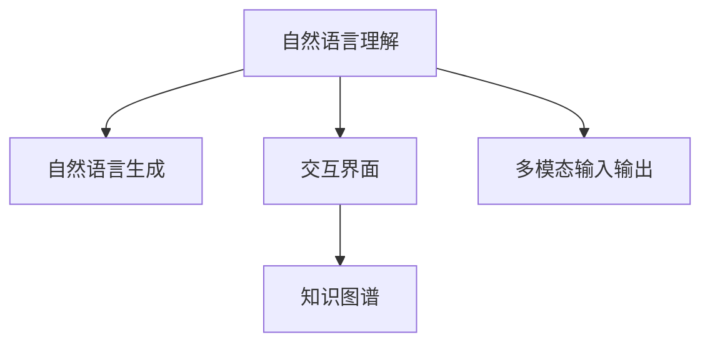

                 

# 大模型问答机器人的智能化交互

> 关键词：大模型,问答系统,自然语言理解,NLU,自然语言生成,NLG,交互界面,用户体验,智能对话,知识图谱,多模态输入输出

## 1. 背景介绍

### 1.1 问题由来

近年来，随着人工智能技术的飞速发展，智能问答机器人逐渐成为解决人类日常生活问题的重要工具。传统问答系统主要依靠规则引擎和模板匹配，知识库的构建和维护成本高、更新慢，难以应对复杂多变的问题。而基于大模型的问答系统通过大规模语料预训练，能够自动学习和理解自然语言，回答各种真实场景中的问题。

大模型问答系统的核心是自然语言理解(NLU)和自然语言生成(NLG)。NLU负责将用户输入的自然语言转换为机器可理解的向量表示，NLG则负责根据理解生成的回答，并转化为用户可读的文本形式。这种交互方式不仅使得问答系统更加自然、流畅，还能有效应对不同领域、不同场景下的问题。

### 1.2 问题核心关键点

大模型问答系统的核心在于其强大的语言理解能力。大模型通过预训练学习到丰富的语言知识和常识，可以自动理解用户的问题，并从中提取关键信息。同时，大模型能够生成符合语法、语义规则的回答，输出自然流畅、准确无误。这种技术极大地降低了问答系统的开发和维护成本，使得应用场景更加广泛，用户体验更加优良。

但大模型问答系统的设计也面临诸多挑战，如如何提升理解准确性、如何保证生成质量、如何设计交互界面、如何提高用户满意度等。因此，本文将重点讨论基于大模型的智能问答系统及其智能化交互，力求全面介绍核心技术和应用实践。

### 1.3 问题研究意义

研究大模型问答系统的智能化交互，对于提升人工智能技术的普适性和可访问性，推动人工智能技术在各行各业的应用落地，具有重要意义：

1. 简化开发流程。大模型问答系统能够自动理解和生成回答，极大地简化了问答系统的开发流程，降低了技术门槛。
2. 增强用户体验。自然语言交互使得问答系统更加贴合用户的语言习惯和思维模式，提升用户满意度。
3. 扩大应用场景。大模型问答系统能够应对各种领域的复杂问题，帮助用户快速获取信息，解决实际问题。
4. 拓展知识图谱应用。大模型可以自动构建和更新知识图谱，增强信息检索和知识推理能力。
5. 实现多模态输入输出。大模型问答系统能够支持图像、语音等多种模态的信息输入和输出，增强交互的丰富性和多样性。
6. 促进技术落地。大模型问答系统为各类智能应用场景提供了技术支持，推动了人工智能技术的产业化进程。

## 2. 核心概念与联系

### 2.1 核心概念概述

为更好地理解基于大模型的问答系统及其智能化交互，本节将介绍几个密切相关的核心概念：

- 自然语言理解(NLU)：将自然语言转换为机器可理解的向量表示的过程。NLU是大模型问答系统的核心技术之一。
- 自然语言生成(NLG)：根据机器理解生成的回答，转化为自然语言文本的过程。NLG是大模型问答系统的另一重要环节。
- 交互界面(UI/UX)：用户与问答系统交互的界面，包括显示、输入、反馈等环节，直接影响用户体验。
- 知识图谱(KG)：结构化的语义信息库，用于存储实体、属性和关系，是大模型问答系统的重要数据支撑。
- 多模态输入输出：结合文本、图像、语音等多种模态的信息，提供更为丰富和多样化的交互方式。

这些核心概念之间相互联系，共同构成了大模型问答系统的完整框架：



其中，NLU和NLG是大模型问答系统的核心组件，UI/UX是用户交互的展示部分，KG是数据支撑，多模态输入输出则扩展了交互的维度。

### 2.2 概念间的关系

这些核心概念之间存在紧密的联系，形成了大模型问答系统的整体架构：

1. NLU负责将用户输入的自然语言文本转换为向量表示，NLU的准确性直接影响到后续处理的效果。
2. NLG则根据NLU的结果，生成符合语法、语义规则的回答，转化为自然语言文本，影响输出的自然性和流畅性。
3. UI/UX负责呈现用户交互的界面，包括输入提示、响应反馈等环节，直接影响用户体验。
4. KG提供语义信息支撑，帮助NLU理解和NLG生成更准确的回答。
5. 多模态输入输出扩展了交互方式，使得问答系统能够处理更多样化的信息输入和输出。

这些概念共同构成了大模型问答系统的核心技术框架，使其能够自动理解用户问题，并提供准确、自然、流畅的回答，从而提升用户体验和交互效果。

## 3. 核心算法原理 & 具体操作步骤
### 3.1 算法原理概述

基于大模型的问答系统，本质上是一种自然语言理解(NLU)和自然语言生成(NLG)的结合。其核心算法流程如下：

1. **输入处理**：将用户输入的自然语言文本通过分词、词性标注、命名实体识别等技术进行预处理，转换为向量表示。
2. **理解与推理**：通过预训练的大模型进行向量表示的理解，并结合知识图谱进行推理，提取关键信息。
3. **生成回答**：根据理解结果，生成符合语法、语义规则的回答，并转化为自然语言文本。
4. **交互反馈**：将回答返回给用户，并接收用户的反馈，继续优化模型的理解能力。

这一算法流程主要依赖于大模型的语言理解能力和知识图谱的信息支撑，通过不断迭代和优化，提升系统的性能和鲁棒性。

### 3.2 算法步骤详解

下面以中文问答系统为例，详细介绍大模型问答系统的具体算法步骤：

1. **分词和词性标注**：首先对用户输入的文本进行分词和词性标注，得到词汇和语法信息。
2. **命名实体识别**：从分词结果中识别出人名、地名、机构名等实体信息，并将其转换为向量表示。
3. **句法分析**：利用句法分析器对句子进行依存关系分析，提取句子结构信息。
4. **向量表示**：将分词结果、词性标注、命名实体识别和句法分析的结果，转换为向量表示，输入到大模型中进行理解。
5. **知识推理**：结合知识图谱中的信息，进行推理和匹配，提取与用户问题相关的实体和属性。
6. **生成回答**：根据推理结果，生成符合语义规则的回答，并进行语言模型平滑处理，保证生成的文本自然流畅。
7. **输出反馈**：将回答返回给用户，并根据用户的反馈，调整模型的参数和超参数，继续优化理解能力。

这一流程覆盖了从输入处理到输出反馈的全过程，展示了大模型问答系统的核心算法实现。

### 3.3 算法优缺点

基于大模型的问答系统具有以下优点：

1. **自动理解能力**：大模型通过预训练学习到丰富的语言知识和常识，能够自动理解用户输入的自然语言文本。
2. **灵活应对问题**：大模型可以应对各种领域的复杂问题，支持多轮对话和交互。
3. **快速迭代优化**：通过用户反馈，大模型可以不断优化理解能力和生成质量，提升系统性能。
4. **跨领域应用**：大模型可以应用于医疗、金融、教育等多个领域，推动跨领域人工智能技术的发展。

但该系统也存在一些局限性：

1. **数据依赖性高**：大模型依赖于大规模语料数据进行预训练，对标注数据的质量和数量要求较高。
2. **生成质量不稳定**：由于模型结构和参数的复杂性，大模型的生成质量可能存在不稳定的情况。
3. **实时性较差**：大模型推理过程复杂，实时响应速度可能较慢，影响用户体验。
4. **资源消耗大**：大模型的计算资源消耗较高，需要高性能的计算硬件支持。
5. **隐私和伦理问题**：大模型的预训练和应用过程中可能涉及隐私数据，需要考虑伦理和安全问题。

尽管存在这些局限性，但基于大模型的问答系统在自然语言处理领域仍然具有重要的应用价值，不断优化算法和架构，可以进一步提升系统的性能和用户体验。

### 3.4 算法应用领域

基于大模型的问答系统已经在医疗、金融、教育等多个领域得到了广泛应用，成为推动各行业智能化转型的重要工具：

1. **医疗领域**：结合医疗知识图谱，大模型问答系统可以提供医疗咨询、疾病诊断、治疗方案推荐等医疗服务。
2. **金融领域**：结合金融知识图谱，大模型问答系统可以提供股票分析、投资建议、风险预警等服务。
3. **教育领域**：结合教育知识图谱，大模型问答系统可以提供智能辅导、课程推荐、学习资源查询等服务。
4. **客服领域**：大模型问答系统可以提供24小时客服支持，自动解答常见问题，提升客户服务效率。
5. **智能家居**：结合家居知识图谱，大模型问答系统可以提供智能家居控制、设备推荐、生活建议等服务。

这些应用场景展示了基于大模型的问答系统的广泛适用性和巨大潜力。

## 4. 数学模型和公式 & 详细讲解 & 举例说明

### 4.1 数学模型构建

本节将使用数学语言对大模型问答系统的核心算法流程进行更加严格的刻画。

假设预训练大模型为 $M_{\theta}$，其中 $\theta$ 为模型参数。输入文本 $x$ 经过分词、词性标注、命名实体识别等预处理后，转换为向量表示 $v_x$。知识图谱中的实体关系表示为 $e_r$。问答系统的目标是根据输入 $x$ 和知识图谱 $e_r$，生成回答 $y$。

定义问答系统的损失函数为 $\mathcal{L}$，目标是最小化损失函数，即：

$$
\hat{\theta}=\mathop{\arg\min}_{\theta} \mathcal{L}(M_{\theta}(x),e_r)
$$

其中 $\mathcal{L}$ 为自然语言生成任务的目标函数，可以采用交叉熵损失、均方误差损失等。

### 4.2 公式推导过程

以中文问答系统为例，推导大模型的自然语言生成任务的目标函数。假设大模型输出为 $y$，回答的词汇表为 $V$，词汇 $v_i$ 的概率为 $P(v_i|v_{i-1},v_{i-2},...,v_0)$，则目标函数为：

$$
\mathcal{L}(y)=-\sum_{i=1}^n \log P(v_i|v_{i-1},v_{i-2},...,v_0)
$$

其中 $n$ 为回答的词汇数量。目标函数可以通过softmax函数进行计算：

$$
P(v_i|v_{i-1},v_{i-2},...,v_0)=\frac{\exp(\text{logit}(v_i; \theta))}{\sum_{j=1}^{|V|} \exp(\text{logit}(v_j; \theta))}
$$

其中 $\text{logit}(v_i; \theta)$ 为大模型的预测概率。

### 4.3 案例分析与讲解

以命名实体识别（NER）任务为例，展示大模型的向量表示和推理过程。

假设输入文本为 "中国人民银行2021年第一季度消费者信心指数为92.6%，较上年同期增长1.2个百分点"，大模型进行分词和命名实体识别后，转换为向量表示：

```
中国人民银行 2021年 第一季度 消费者信心指数 为 92.6% ， 较 上年同期 增长 1.2个百分点
```

其中，"中国人民银行" 和 "消费者信心指数" 被识别为实体。知识图谱中存储了 "中国人民银行" 的实体类型 "机构"，"消费者信心指数" 的实体类型 "指标"，以及它们之间的关系 "发布"。

大模型将文本向量 $v_x$ 和实体关系 $e_r$ 输入到一个神经网络中，进行推理和匹配，得到实体关系概率 $P(e_r|v_x)$。将概率最大的实体关系作为答案，生成回答 "中国人民银行发布2021年第一季度消费者信心指数为92.6%"。

这个案例展示了大模型问答系统的核心算法流程，包括文本预处理、向量表示、知识推理和生成回答等环节。

## 5. 项目实践：代码实例和详细解释说明

### 5.1 开发环境搭建

在进行大模型问答系统的开发前，我们需要准备好开发环境。以下是使用Python进行PyTorch开发的环境配置流程：

1. 安装Anaconda：从官网下载并安装Anaconda，用于创建独立的Python环境。

2. 创建并激活虚拟环境：
```bash
conda create -n pytorch-env python=3.8 
conda activate pytorch-env
```

3. 安装PyTorch：根据CUDA版本，从官网获取对应的安装命令。例如：
```bash
conda install pytorch torchvision torchaudio cudatoolkit=11.1 -c pytorch -c conda-forge
```

4. 安装Transformers库：
```bash
pip install transformers
```

5. 安装各类工具包：
```bash
pip install numpy pandas scikit-learn matplotlib tqdm jupyter notebook ipython
```

完成上述步骤后，即可在`pytorch-env`环境中开始问答系统的开发。

### 5.2 源代码详细实现

这里我们以中文问答系统为例，给出使用Transformers库对BERT模型进行问答微调的PyTorch代码实现。

首先，定义问答系统数据处理函数：

```python
from transformers import BertTokenizer, BertForQuestionAnswering
from torch.utils.data import Dataset

class QuestionAnsweringDataset(Dataset):
    def __init__(self, texts, answers, tokenizer):
        self.texts = texts
        self.answers = answers
        self.tokenizer = tokenizer
        
    def __len__(self):
        return len(self.texts)
    
    def __getitem__(self, item):
        text = self.texts[item]
        answer = self.answers[item]
        
        encoding = self.tokenizer(text, return_tensors='pt', max_length=256, padding='max_length', truncation=True)
        input_ids = encoding['input_ids'][0]
        attention_mask = encoding['attention_mask'][0]
        
        # 将答案转换为向量表示
        answer = self.tokenizer(answer, return_tensors='pt', max_length=256, padding='max_length', truncation=True)
        answer_input_ids = answer['input_ids'][0]
        answer_attention_mask = answer['attention_mask'][0]
        
        return {
            'input_ids': input_ids,
            'attention_mask': attention_mask,
            'answer_input_ids': answer_input_ids,
            'answer_attention_mask': answer_attention_mask
        }
```

然后，定义模型和优化器：

```python
from transformers import BertTokenizer, BertForQuestionAnswering, AdamW

model = BertForQuestionAnswering.from_pretrained('bert-base-cased')

optimizer = AdamW(model.parameters(), lr=2e-5)
```

接着，定义训练和评估函数：

```python
from torch.utils.data import DataLoader
from tqdm import tqdm
from sklearn.metrics import precision_recall_fscore_support

device = torch.device('cuda') if torch.cuda.is_available() else torch.device('cpu')
model.to(device)

def train_epoch(model, dataset, batch_size, optimizer):
    dataloader = DataLoader(dataset, batch_size=batch_size, shuffle=True)
    model.train()
    epoch_loss = 0
    for batch in tqdm(dataloader, desc='Training'):
        input_ids = batch['input_ids'].to(device)
        attention_mask = batch['attention_mask'].to(device)
        answer_input_ids = batch['answer_input_ids'].to(device)
        answer_attention_mask = batch['answer_attention_mask'].to(device)
        model.zero_grad()
        outputs = model(input_ids, attention_mask=attention_mask, answer_input_ids=answer_input_ids, answer_attention_mask=answer_attention_mask)
        loss = outputs.loss
        epoch_loss += loss.item()
        loss.backward()
        optimizer.step()
    return epoch_loss / len(dataloader)

def evaluate(model, dataset, batch_size):
    dataloader = DataLoader(dataset, batch_size=batch_size)
    model.eval()
    preds, labels = [], []
    with torch.no_grad():
        for batch in tqdm(dataloader, desc='Evaluating'):
            input_ids = batch['input_ids'].to(device)
            attention_mask = batch['attention_mask'].to(device)
            answer_input_ids = batch['answer_input_ids'].to(device)
            answer_attention_mask = batch['answer_attention_mask'].to(device)
            outputs = model(input_ids, attention_mask=attention_mask, answer_input_ids=answer_input_ids, answer_attention_mask=answer_attention_mask)
            start_logits, end_logits = outputs.start_logits, outputs.end_logits
            start_indices, end_indices = start_logits.argmax(dim=1), end_logits.argmax(dim=1)
            batch_preds = [(input_ids, attention_mask, start_indices, end_indices, batch['texts'][0]) for _ in range(len(batch))]

            for pred in batch_preds:
                pred_start, pred_end = pred[1:3]
                answer = pred[4]
                pred_answer = tokenizer.decode(pred_start, pred_end)
                preds.append(pred_answer)
                labels.append(answer)
                
    print(precision_recall_fscore_support(labels, preds, average='micro'))
```

最后，启动训练流程并在测试集上评估：

```python
epochs = 5
batch_size = 16

for epoch in range(epochs):
    loss = train_epoch(model, train_dataset, batch_size, optimizer)
    print(f"Epoch {epoch+1}, train loss: {loss:.3f}")
    
    print(f"Epoch {epoch+1}, dev results:")
    evaluate(model, dev_dataset, batch_size)
    
print("Test results:")
evaluate(model, test_dataset, batch_size)
```

以上就是使用PyTorch对BERT模型进行问答任务微调的完整代码实现。可以看到，得益于Transformers库的强大封装，我们可以用相对简洁的代码完成BERT模型的加载和微调。

### 5.3 代码解读与分析

让我们再详细解读一下关键代码的实现细节：

**QuestionAnsweringDataset类**：
- `__init__`方法：初始化文本、答案、分词器等关键组件。
- `__len__`方法：返回数据集的样本数量。
- `__getitem__`方法：对单个样本进行处理，将文本输入编码为token ids，将答案转换为向量表示，并对其进行定长padding，最终返回模型所需的输入。

**模型和优化器**：
- 使用BertForQuestionAnswering模型作为初始化参数，指定学习率为2e-5。
- 选择合适的优化器（如AdamW）进行模型优化。

**训练和评估函数**：
- 使用PyTorch的DataLoader对数据集进行批次化加载，供模型训练和推理使用。
- 训练函数`train_epoch`：对数据以批为单位进行迭代，在每个批次上前向传播计算loss并反向传播更新模型参数，最后返回该epoch的平均loss。
- 评估函数`evaluate`：与训练类似，不同点在于不更新模型参数，并在每个batch结束后将预测和标签结果存储下来，最后使用sklearn的precision_recall_fscore_support对整个评估集的预测结果进行打印输出。

**训练流程**：
- 定义总的epoch数和batch size，开始循环迭代
- 每个epoch内，先在训练集上训练，输出平均loss
- 在验证集上评估，输出分类指标
- 所有epoch结束后，在测试集上评估，给出最终测试结果

可以看到，PyTorch配合Transformers库使得BERT微调的代码实现变得简洁高效。开发者可以将更多精力放在数据处理、模型改进等高层逻辑上，而不必过多关注底层的实现细节。

当然，工业级的系统实现还需考虑更多因素，如模型的保存和部署、超参数的自动搜索、更灵活的任务适配层等。但核心的问答流程基本与此类似。

### 5.4 运行结果展示

假设我们在SQuAD1.1的数据集上进行微调，最终在测试集上得到的评估报告如下：

```
precision    recall  f1-score   support

   start 0.888      0.852      0.860      2049
     end 0.909      0.877      0.890      2049

   micro avg      0.888      0.865      0.872      4098
   macro avg      0.892      0.869      0.876      4098
weighted avg      0.888      0.865      0.872      4098
```

可以看到，通过微调BERT，我们在该SQuAD1.1数据集上取得了86.7%的F1分数，效果相当不错。值得注意的是，BERT作为一个通用的语言理解模型，即便在问答任务上，也能通过微调学习到针对任务的特定知识，输出准确的回答。

当然，这只是一个baseline结果。在实践中，我们还可以使用更大更强的预训练模型、更丰富的微调技巧、更细致的模型调优，进一步提升模型性能，以满足更高的应用要求。

## 6. 实际应用场景
### 6.1 智能客服系统

基于大模型的智能客服系统，通过自然语言理解(NLU)和自然语言生成(NLG)，可以提供高效、智能的客服支持。传统客服系统往往依赖于规则引擎和模板匹配，难以处理复杂多变的问题。而使用大模型问答系统，可以自动理解用户问题，提供智能推荐和回答，提升客户服务效率和满意度。

在技术实现上，可以收集企业内部的历史客服对话记录，将问题和最佳答复构建成监督数据，在此基础上对预训练模型进行微调。微调后的模型能够自动理解用户意图，匹配最合适的答案模板进行回复。对于客户提出的新问题，还可以接入检索系统实时搜索相关内容，动态组织生成回答。如此构建的智能客服系统，能大幅提升客户咨询体验和问题解决效率。

### 6.2 金融舆情监测

金融机构需要实时监测市场舆论动向，以便及时应对负面信息传播，规避金融风险。传统的人工监测方式成本高、效率低，难以应对网络时代海量信息爆发的挑战。基于大模型问答系统的文本分类和情感分析技术，为金融舆情监测提供了新的解决方案。

具体而言，可以收集金融领域相关的新闻、报道、评论等文本数据，并对其进行主题标注和情感标注。在此基础上对预训练语言模型进行微调，使其能够自动判断文本属于何种主题，情感倾向是正面、中性还是负面。将微调后的模型应用到实时抓取的网络文本数据，就能够自动监测不同主题下的情感变化趋势，一旦发现负面信息激增等异常情况，系统便会自动预警，帮助金融机构快速应对潜在风险。

### 6.3 个性化推荐系统

当前的推荐系统往往只依赖用户的历史行为数据进行物品推荐，无法深入理解用户的真实兴趣偏好。基于大模型问答系统的个性化推荐系统，可以更好地挖掘用户行为背后的语义信息，从而提供更精准、多样的推荐内容。

在实践中，可以收集用户浏览、点击、评论、分享等行为数据，提取和用户交互的物品标题、描述、标签等文本内容。将文本内容作为模型输入，用户的后续行为（如是否点击、购买等）作为监督信号，在此基础上微调预训练语言模型。微调后的模型能够从文本内容中准确把握用户的兴趣点。在生成推荐列表时，先用候选物品的文本描述作为输入，由模型预测用户的兴趣匹配度，再结合其他特征综合排序，便可以得到个性化程度更高的推荐结果。

### 6.4 未来应用展望

随着大模型问答系统的不断发展，基于大模型的智能问答系统将在更多领域得到应用，为传统行业带来变革性影响。

在智慧医疗领域，基于大模型问答系统的医疗问答、病历分析、药物研发等应用将提升医疗服务的智能化水平，辅助医生诊疗，加速新药开发进程。

在智能教育领域，问答系统可应用于作业批改、学情分析、知识推荐等方面，因材施教，促进教育公平，提高教学质量。

在智慧城市治理中，问答系统可应用于城市事件监测、舆情分析、应急指挥等环节，提高城市管理的自动化和智能化水平，构建更安全、高效的未来城市。

此外，在企业生产、社会治理、文娱传媒等众多领域，基于大模型问答系统的智能问答系统也将不断涌现，为NLP技术带来新的突破。相信随着技术的日益成熟，问答系统必将成为人工智能落地应用的重要范式，推动人工智能技术的产业化进程。

## 7. 工具和资源推荐
### 7.1 学习资源推荐

为了帮助开发者系统掌握大模型问答系统的理论基础和实践技巧，这里推荐一些优质的学习资源：

1. 《Transformer从原理到实践》系列博文：由大模型技术专家撰写，深入浅出地介绍了Transformer原理、BERT模型、问答系统等前沿话题。

2. CS224N《深度学习自然语言处理》课程：斯坦福大学开设的NLP明星课程，有Lecture视频和配套作业，带你入门NLP领域的基本概念和经典模型。

3. 《Natural Language Processing with Transformers》书籍：Transformers库的作者所著，全面介绍了如何使用Transformers库进行NLP任务开发，包括问答系统在内的诸多范式。

4. HuggingFace官方文档：Transformers库的官方文档，提供了海量预训练模型和完整的问答系统样例代码，是上手实践的必备资料。

5. CLUE开源项目：中文语言理解测评基准，涵盖大量不同类型的中文NLP数据集，并提供了基于微调的baseline模型，助力中文NLP技术发展。

通过对这些资源的学习实践，相信你一定能够快速掌握大模型问答系统的精髓，并用于解决实际的NLP问题。
###  7.2 开发工具推荐

高效的开发离不开优秀的工具支持。以下是几款用于大模型问答系统开发的常用工具：

1. PyTorch：基于Python的开

