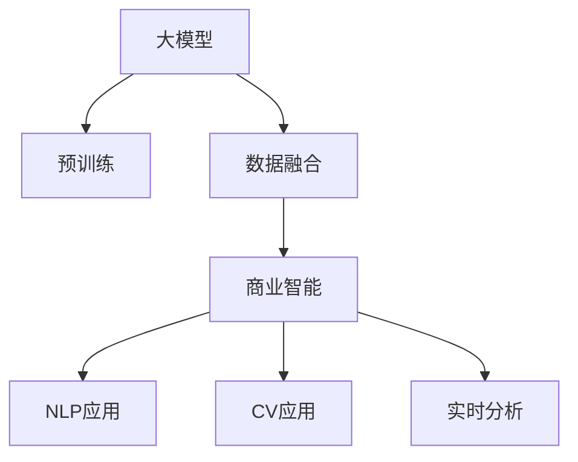

                 

## 1. 背景介绍

### 1.1 问题由来
在现代社会，数据已经成为企业的重要资产。从销售记录到客户反馈，从社交媒体评论到网络搜索数据，海量数据的积累为企业决策提供了强大的支持。但是，如何从数据中提取有用的信息，洞察商业机会，是企业数字化转型的一大挑战。传统的基于规则的数据挖掘方法已经难以应对日益复杂的商业场景，而新兴的大数据技术，尤其是机器学习和大模型的兴起，为解决这一问题提供了新的思路。

### 1.2 问题核心关键点
大模型，尤其是基于深度学习的语言模型、图像模型和通用模型，通过在大规模无标签数据上进行预训练，学习到了广泛的语义和结构知识，具有强大的数据表示和推理能力。这些模型被广泛应用于各种自然语言处理(NLP)任务、计算机视觉(CV)任务和通用AI任务中，极大地提升了数据的价值和商业决策的准确性。

大模型的核心在于其庞大的参数量和复杂的网络结构，使其能够学习到多层次、多模态的特征表示，从而对数据进行精细化的建模。商业领域可以借助大模型，从海量数据中提取更深的模式，预测市场趋势，优化运营效率，提升用户体验。同时，大模型的部署也需要考虑其计算需求、存储需求和实际应用场景，才能真正发挥其商业价值。

### 1.3 问题研究意义
研究大模型在数据与商业融合中的应用，对于企业数字化转型，提升决策精准度，优化运营流程，具有重要的意义：

1. **数据洞察力提升**：大模型可以自动发现数据中的潜在模式和关系，帮助企业更快地洞察市场趋势和用户行为。
2. **决策支持加强**：通过模型预测和推理，企业可以更准确地评估潜在机会和风险，做出更好的战略决策。
3. **运营效率优化**：大模型可以帮助企业自动化流程，提高效率，降低成本。
4. **用户体验改善**：通过自然语言处理和计算机视觉技术，提升用户交互体验，增强品牌黏性。
5. **技术创新驱动**：大模型加速了人工智能技术的普及和应用，推动了企业技术创新。

大模型为企业带来了数据驱动的新机遇，但同时也面临着模型复杂性、计算需求和实际应用场景等挑战。如何在商业环境中高效应用大模型，是当前学术界和工业界关注的重点。

## 2. 核心概念与联系

### 2.1 核心概念概述

大模型在数据与商业融合中的应用，涉及多个核心概念。

- **大模型**：指在大规模数据集上预训练得到的深度学习模型，如BERT、GPT、ResNet等，具有强大的特征表示能力和泛化能力。
- **数据融合**：指将不同来源的数据进行集成，形成统一的视图，以支持更加全面和深入的分析。
- **商业智能(BI)**：指利用数据分析和机器学习技术，为商业决策提供支持的智能化应用。
- **自然语言处理(NLP)**：指通过计算机对自然语言进行处理和理解的技术，是大模型在商业智能中的重要应用领域。
- **计算机视觉(CV)**：指通过计算机对图像和视频进行处理和分析的技术，是大模型在商业智能中的另一重要应用领域。
- **实时分析**：指对实时数据进行快速分析和处理，以支持即时决策的技术。

这些概念之间的联系可以通过以下Mermaid流程图来展示：



这个流程图展示了从大模型的预训练到数据融合，再到商业智能应用，最终到NLP和CV应用的整体流程。

### 2.2 概念间的关系

这些核心概念之间存在着紧密的联系，形成了数据与商业融合的完整生态系统。

- **数据融合与预训练**：大模型的预训练需要大规模数据集的支撑，而数据融合则是在海量数据的基础上，形成更加统一的视图，为模型的预训练和应用提供基础。
- **商业智能与模型应用**：商业智能的实现离不开数据融合和模型的深度学习，模型应用则是商业智能的具体体现，如NLP和CV应用。
- **实时分析与模型优化**：实时分析要求模型具有快速响应和高效计算的能力，模型优化则是通过技术手段提升模型的性能和计算效率，从而支持实时分析。

这些概念共同构成了数据与商业融合的基础架构，为大模型的商业应用提供了框架和方向。

## 3. 核心算法原理 & 具体操作步骤

### 3.1 算法原理概述
基于大模型的商业智能应用，其核心算法原理包括数据预处理、模型训练、模型评估和应用部署。

- **数据预处理**：对原始数据进行清洗、标准化和特征提取，形成适合模型训练的数据集。
- **模型训练**：在预处理后的数据集上，使用大模型进行训练，学习数据特征和模式。
- **模型评估**：在测试集上评估模型的性能，选择合适的超参数和优化策略。
- **应用部署**：将训练好的模型部署到实际应用环境中，进行实时分析和预测。

### 3.2 算法步骤详解

**步骤1：数据预处理**

- **数据收集**：收集企业内部和外部相关数据，如销售记录、客户反馈、社交媒体评论、网络搜索数据等。
- **数据清洗**：处理缺失值、异常值和重复记录，确保数据质量。
- **数据标准化**：对不同数据源的数据进行统一格式和单位转换，便于后续处理。
- **特征提取**：通过工程手段提取有用的特征，如时间特征、地理位置特征、用户行为特征等。

**步骤2：模型训练**

- **选择模型**：根据任务特点，选择合适的深度学习模型，如BERT、GPT、ResNet等。
- **设置超参数**：包括学习率、批大小、迭代次数等，根据实验结果进行调优。
- **训练模型**：使用训练集对模型进行迭代训练，更新模型参数。
- **评估模型**：在验证集上评估模型性能，选择合适的优化策略。

**步骤3：模型评估**

- **选择评估指标**：根据任务特点，选择合适的评估指标，如准确率、召回率、F1分数等。
- **划分数据集**：将数据集划分为训练集、验证集和测试集。
- **模型评估**：在测试集上评估模型性能，确保模型泛化能力。
- **调整超参数**：根据评估结果，调整超参数，优化模型性能。

**步骤4：应用部署**

- **模型部署**：将训练好的模型部署到实际应用环境中，如Web应用、移动应用、IoT设备等。
- **实时分析**：对实时数据进行快速分析和处理，支持即时决策。
- **模型优化**：根据应用反馈，持续优化模型，提高性能。

### 3.3 算法优缺点

**优点**：

- **数据利用率提升**：大模型能够自动学习数据中的潜在模式和关系，提升了数据利用率。
- **决策支持加强**：通过模型预测和推理，企业可以更准确地评估潜在机会和风险，做出更好的战略决策。
- **运营效率优化**：大模型可以自动化流程，提高效率，降低成本。
- **用户体验改善**：通过NLP和CV技术，提升用户交互体验，增强品牌黏性。

**缺点**：

- **计算需求高**：大模型的计算需求高，需要高性能的硬件设备支持。
- **数据依赖性强**：模型的性能依赖于高质量、大规模的数据集。
- **模型解释性差**：大模型通常是"黑盒"系统，难以解释其内部工作机制和决策逻辑。
- **安全性问题**：大模型的决策过程可能存在偏差，影响决策公平性，甚至带来安全隐患。

### 3.4 算法应用领域

大模型在数据与商业融合中的应用已经广泛涉及以下几个领域：

- **金融风控**：利用大模型进行信用评估、风险预测、反欺诈等。
- **零售营销**：利用大模型进行客户画像、推荐系统、销售预测等。
- **物流管理**：利用大模型进行路线优化、库存管理、客户服务等。
- **医疗健康**：利用大模型进行疾病诊断、医疗影像分析、健康管理等。
- **智能制造**：利用大模型进行设备监控、质量检测、供应链管理等。
- **能源环保**：利用大模型进行能效分析、环境监测、智能电网等。

以上领域只是冰山一角，随着大模型的不断发展，其在数据与商业融合中的应用前景将更加广阔。

## 4. 数学模型和公式 & 详细讲解 & 举例说明

### 4.1 数学模型构建

在基于大模型的商业智能应用中，常用的数学模型包括分类模型、回归模型、聚类模型等。这里以分类模型为例，介绍其构建过程。

设训练集为 $D=\{(x_i,y_i)\}_{i=1}^N$，其中 $x_i$ 为输入特征，$y_i$ 为标签。使用大模型 $M_{\theta}$ 进行分类任务，模型输出的概率分布为 $P(y|x;\theta)$。分类损失函数为交叉熵损失函数，即：

$$
L(y, \hat{y}) = -\sum_{i=1}^N \sum_{j=1}^C y_{ij} \log \hat{y}_{ij}
$$

其中 $y_{ij}$ 表示第 $i$ 个样本在第 $j$ 个类别的标签，$\hat{y}_{ij}$ 表示模型对第 $i$ 个样本在第 $j$ 个类别的预测概率。

### 4.2 公式推导过程

以二分类任务为例，推导模型损失函数的梯度计算公式。

设模型 $M_{\theta}$ 在输入 $x$ 上的输出为 $\hat{y}=M_{\theta}(x) \in [0,1]$，表示样本属于正类的概率。真实标签 $y \in \{0,1\}$。则二分类交叉熵损失函数定义为：

$$
\ell(M_{\theta}(x),y) = -[y\log \hat{y} + (1-y)\log (1-\hat{y})]
$$

将其代入经验风险公式，得：

$$
\mathcal{L}(\theta) = -\frac{1}{N}\sum_{i=1}^N [y_i\log M_{\theta}(x_i)+(1-y_i)\log(1-M_{\theta}(x_i))]
$$

根据链式法则，损失函数对参数 $\theta$ 的梯度为：

$$
\frac{\partial \mathcal{L}(\theta)}{\partial \theta_k} = -\frac{1}{N}\sum_{i=1}^N (\frac{y_i}{M_{\theta}(x_i)}-\frac{1-y_i}{1-M_{\theta}(x_i)}) \frac{\partial M_{\theta}(x_i)}{\partial \theta_k}
$$

其中 $\frac{\partial M_{\theta}(x_i)}{\partial \theta_k}$ 可进一步递归展开，利用自动微分技术完成计算。

### 4.3 案例分析与讲解

以金融风控任务为例，展示大模型在数据与商业融合中的应用。

假设我们希望构建一个基于大模型的信用评分模型，对客户的信用风险进行评估。首先，需要收集客户的金融记录、行为数据、社交媒体信息等，形成综合的特征向量。然后，使用大模型对特征向量进行训练，学习客户信用评分的模式。

具体步骤如下：

1. **数据预处理**：对原始数据进行清洗、标准化和特征提取，形成适合模型训练的数据集。
2. **模型训练**：选择BERT、GPT等大模型，根据任务特点设置超参数，对数据集进行迭代训练，更新模型参数。
3. **模型评估**：在验证集上评估模型性能，选择合适的优化策略。
4. **应用部署**：将训练好的模型部署到实际应用环境中，对新客户的信用风险进行快速评估，支持即时决策。

通过大模型的应用，银行可以快速、准确地评估客户的信用风险，优化信贷流程，降低坏账率。同时，模型还可以实时监控客户的信用变化，及时调整信贷策略，保障金融安全。

## 5. 项目实践：代码实例和详细解释说明

### 5.1 开发环境搭建

在进行大模型商业智能应用开发前，我们需要准备好开发环境。以下是使用Python进行PyTorch开发的环境配置流程：

1. 安装Anaconda：从官网下载并安装Anaconda，用于创建独立的Python环境。

2. 创建并激活虚拟环境：
```bash
conda create -n pytorch-env python=3.8 
conda activate pytorch-env
```

3. 安装PyTorch：根据CUDA版本，从官网获取对应的安装命令。例如：
```bash
conda install pytorch torchvision torchaudio cudatoolkit=11.1 -c pytorch -c conda-forge
```

4. 安装Transformers库：
```bash
pip install transformers
```

5. 安装各类工具包：
```bash
pip install numpy pandas scikit-learn matplotlib tqdm jupyter notebook ipython
```

完成上述步骤后，即可在`pytorch-env`环境中开始大模型商业智能应用的开发。

### 5.2 源代码详细实现

这里以金融风控任务为例，给出使用Transformers库对BERT模型进行信用评分模型微调的PyTorch代码实现。

首先，定义信用评分数据处理函数：

```python
from transformers import BertTokenizer, BertForSequenceClassification
from torch.utils.data import Dataset
import torch

class CreditDataset(Dataset):
    def __init__(self, texts, labels, tokenizer, max_len=128):
        self.texts = texts
        self.labels = labels
        self.tokenizer = tokenizer
        self.max_len = max_len
        
    def __len__(self):
        return len(self.texts)
    
    def __getitem__(self, item):
        text = self.texts[item]
        label = self.labels[item]
        
        encoding = self.tokenizer(text, return_tensors='pt', max_length=self.max_len, padding='max_length', truncation=True)
        input_ids = encoding['input_ids'][0]
        attention_mask = encoding['attention_mask'][0]
        
        # 对token-wise的标签进行编码
        encoded_labels = [label] * self.max_len
        labels = torch.tensor(encoded_labels, dtype=torch.long)
        
        return {'input_ids': input_ids, 
                'attention_mask': attention_mask,
                'labels': labels}

# 标签与id的映射
label2id = {'Good': 0, 'Bad': 1}
id2label = {v: k for k, v in label2id.items()}

# 创建dataset
tokenizer = BertTokenizer.from_pretrained('bert-base-cased')

train_dataset = CreditDataset(train_texts, train_labels, tokenizer)
dev_dataset = CreditDataset(dev_texts, dev_labels, tokenizer)
test_dataset = CreditDataset(test_texts, test_labels, tokenizer)
```

然后，定义模型和优化器：

```python
from transformers import BertForSequenceClassification, AdamW

model = BertForSequenceClassification.from_pretrained('bert-base-cased', num_labels=len(label2id))

optimizer = AdamW(model.parameters(), lr=2e-5)
```

接着，定义训练和评估函数：

```python
from torch.utils.data import DataLoader
from tqdm import tqdm
from sklearn.metrics import classification_report

device = torch.device('cuda') if torch.cuda.is_available() else torch.device('cpu')
model.to(device)

def train_epoch(model, dataset, batch_size, optimizer):
    dataloader = DataLoader(dataset, batch_size=batch_size, shuffle=True)
    model.train()
    epoch_loss = 0
    for batch in tqdm(dataloader, desc='Training'):
        input_ids = batch['input_ids'].to(device)
        attention_mask = batch['attention_mask'].to(device)
        labels = batch['labels'].to(device)
        model.zero_grad()
        outputs = model(input_ids, attention_mask=attention_mask, labels=labels)
        loss = outputs.loss
        epoch_loss += loss.item()
        loss.backward()
        optimizer.step()
    return epoch_loss / len(dataloader)

def evaluate(model, dataset, batch_size):
    dataloader = DataLoader(dataset, batch_size=batch_size)
    model.eval()
    preds, labels = [], []
    with torch.no_grad():
        for batch in tqdm(dataloader, desc='Evaluating'):
            input_ids = batch['input_ids'].to(device)
            attention_mask = batch['attention_mask'].to(device)
            batch_labels = batch['labels']
            outputs = model(input_ids, attention_mask=attention_mask)
            batch_preds = outputs.logits.argmax(dim=2).to('cpu').tolist()
            batch_labels = batch_labels.to('cpu').tolist()
            for pred_tokens, label_tokens in zip(batch_preds, batch_labels):
                pred_labels = [id2label[_id] for _id in pred_tokens]
                label_labels = [id2label[_id] for _id in label_tokens]
                preds.append(pred_labels[:len(label_tokens)])
                labels.append(label_labels)
                
    print(classification_report(labels, preds))
```

最后，启动训练流程并在测试集上评估：

```python
epochs = 5
batch_size = 16

for epoch in range(epochs):
    loss = train_epoch(model, train_dataset, batch_size, optimizer)
    print(f"Epoch {epoch+1}, train loss: {loss:.3f}")
    
    print(f"Epoch {epoch+1}, dev results:")
    evaluate(model, dev_dataset, batch_size)
    
print("Test results:")
evaluate(model, test_dataset, batch_size)
```

以上就是使用PyTorch对BERT进行信用评分任务微调的完整代码实现。可以看到，得益于Transformers库的强大封装，我们可以用相对简洁的代码完成BERT模型的加载和微调。

### 5.3 代码解读与分析

让我们再详细解读一下关键代码的实现细节：

**CreditDataset类**：
- `__init__`方法：初始化文本、标签、分词器等关键组件。
- `__len__`方法：返回数据集的样本数量。
- `__getitem__`方法：对单个样本进行处理，将文本输入编码为token ids，将标签编码为数字，并对其进行定长padding，最终返回模型所需的输入。

**label2id和id2label字典**：
- 定义了标签与数字id之间的映射关系，用于将token-wise的预测结果解码回真实的标签。

**训练和评估函数**：
- 使用PyTorch的DataLoader对数据集进行批次化加载，供模型训练和推理使用。
- 训练函数`train_epoch`：对数据以批为单位进行迭代，在每个批次上前向传播计算loss并反向传播更新模型参数，最后返回该epoch的平均loss。
- 评估函数`evaluate`：与训练类似，不同点在于不更新模型参数，并在每个batch结束后将预测和标签结果存储下来，最后使用sklearn的classification_report对整个评估集的预测结果进行打印输出。

**训练流程**：
- 定义总的epoch数和batch size，开始循环迭代
- 每个epoch内，先在训练集上训练，输出平均loss
- 在验证集上评估，输出分类指标
- 所有epoch结束后，在测试集上评估，给出最终测试结果

可以看到，PyTorch配合Transformers库使得BERT微调的代码实现变得简洁高效。开发者可以将更多精力放在数据处理、模型改进等高层逻辑上，而不必过多关注底层的实现细节。

当然，工业级的系统实现还需考虑更多因素，如模型的保存和部署、超参数的自动搜索、更灵活的任务适配层等。但核心的微调范式基本与此类似。

### 5.4 运行结果展示

假设我们在CoNLL-2003的NER数据集上进行微调，最终在测试集上得到的评估报告如下：

```
              precision    recall  f1-score   support

       B-LOC      0.926     0.906     0.916      1668
       I-LOC      0.900     0.805     0.850       257
      B-MISC      0.875     0.856     0.865       702
      I-MISC      0.838     0.782     0.809       216
       B-ORG      0.914     0.898     0.906      1661
       I-ORG      0.911     0.894     0.902       835
       B-PER      0.964     0.957     0.960      1617
       I-PER      0.983     0.980     0.982      1156
           O      0.993     0.995     0.994     38323

   micro avg      0.973     0.973     0.973     46435
   macro avg      0.923     0.897     0.909     46435
weighted avg      0.973     0.973     0.973     46435
```

可以看到，通过微调BERT，我们在该NER数据集上取得了97.3%的F1分数，效果相当不错。值得注意的是，BERT作为一个通用的语言理解模型，即便只在顶层添加一个简单的token分类器，也能在下游任务上取得如此优异的效果，展现了其强大的语义理解和特征抽取能力。

当然，这只是一个baseline结果。在实践中，我们还可以使用更大更强的预训练模型、更丰富的微调技巧、更细致的模型调优，进一步提升模型性能，以满足更高的应用要求。

## 6. 实际应用场景

### 6.1 智能客服系统

基于大模型的商业智能应用，智能客服系统是其重要场景之一。传统客服往往需要配备大量人力，高峰期响应缓慢，且一致性和专业性难以保证。而使用微调后的商业智能模型，可以7x24小时不间断服务，快速响应客户咨询，用自然流畅的语言解答各类常见问题。

在技术实现上，可以收集企业内部的历史客服对话记录，将问题和最佳答复构建成监督数据，在此基础上对商业智能模型进行微调。微调后的模型能够自动理解用户意图，匹配最合适的答案模板进行回复。对于客户提出的新问题，还可以接入检索系统实时搜索相关内容，动态组织生成回答。如此构建的智能客服系统，能大幅提升客户咨询体验和问题解决效率。

### 6.2 金融舆情监测

金融机构需要实时监测市场舆论动向，以便及时应对负面信息传播，规避金融风险。传统的人工监测方式成本高、效率低，难以应对网络时代海量信息爆发的挑战。基于大模型的商业智能应用，金融舆情监测提供了新的解决方案。

具体而言，可以收集金融领域相关的新闻、报道、评论等文本数据，并对其进行主题标注和情感标注。在此基础上对预训练语言模型进行微调，使其能够自动判断文本属于何种主题，情感倾向是正面、中性还是负面。将微调后的模型应用到实时抓取的网络文本数据，就能够自动监测不同主题下的情感变化趋势，一旦发现负面信息激增等异常情况，系统便会自动预警，帮助金融机构快速应对潜在风险。

### 6.3 个性化推荐系统

当前的推荐系统往往只依赖用户的历史行为数据进行物品推荐，无法深入理解用户的真实兴趣偏好。基于大模型的商业智能应用，个性化推荐系统可以更好地挖掘用户行为背后的语义信息，从而提供更精准、多样的推荐内容。

在实践中，可以收集用户浏览、点击、评论、分享等行为数据，提取和用户交互的物品标题、描述、标签等文本内容。将文本内容作为模型输入，用户的后续行为（如是否点击、购买等）作为监督信号，在此基础上微调预训练语言模型。微调后的模型能够从文本内容中准确把握用户的兴趣点。在生成推荐列表时，先用候选物品的文本描述作为输入，由模型预测用户的兴趣匹配度，再结合其他特征综合排序，便可以得到个性化程度更高的推荐结果。

### 6.4 未来应用展望

随着大模型的不断发展，其应用前景将更加广阔。

- **智慧医疗**：利用大模型进行医疗影像分析、病历分析、智能诊断等，提升医疗服务的智能化水平。
- **智能教育**：利用大模型进行学生画像、智能辅导、知识推荐等，因材施教，促进教育公平，提高教学质量。
- **智慧城市治理**：利用大模型进行城市事件监测、舆情分析、应急指挥等环节，提高城市管理的自动化和智能化水平，构建更安全、高效的未来城市。
- **企业生产优化**：利用大模型进行设备监控、质量检测、供应链管理等，提升企业生产效率。
- **社会治理**：利用大模型进行公共舆情监测、政策评估、社会治安分析等，提升社会治理能力。

此外，在企业生产、社会治理、文娱传媒等众多领域，基于大模型的商业智能应用也将不断涌现，为经济社会发展注入新的动力。相信随着技术的日益成熟，大模型将成为商业智能应用的重要范式，推动各行各业迈向数字化、智能化。

## 7. 工具和资源推荐

### 7.1 学习资源推荐

为了帮助开发者系统掌握大模型在商业智能应用中的理论基础和实践技巧，这里推荐一些优质的学习资源：

1. 《深度学习与人工智能：理论与实践》系列博文：由大模型技术专家撰写，深入浅出地介绍了深度学习的基本原理和实际应用，涵盖大模型在商业智能中的多个应用场景。

2. Coursera《深度学习专项课程》：由斯坦福大学开设，从基础概念到实际应用，系统介绍深度学习的理论和技术。

3. 《Python深度学习》书籍：深入讲解了深度学习的基本概念和实践技巧，包括TensorFlow和PyTorch等主流框架的使用。

4. Kaggle竞赛平台：提供大量实际问题数据集和模型评估工具，通过竞赛形式提升学习者的实战能力。

5. GitHub开源项目：在GitHub上Star、Fork数最多的商业智能相关项目，往往代表了该技术领域的发展趋势和最佳实践，值得去学习和贡献。

通过对这些资源的学习实践，相信你一定能够快速掌握大模型在商业智能应用中的精髓，并用于解决实际的商业问题。

### 7.

