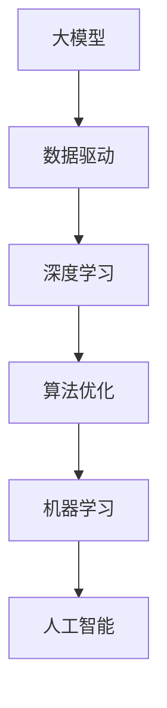

                 

# 大模型：数据与算法的完美结合

> 关键词：大模型,算法优化,数据驱动,深度学习,机器学习,人工智能,高性能计算

## 1. 背景介绍

### 1.1 问题由来
在人工智能（AI）的快速发展的今天，机器学习（ML）技术正逐渐从实验室走向现实世界，并深刻影响着各行各业。尤其是在深度学习（Deep Learning, DL）领域，大模型（Big Models）的崛起，让AI应用具备了更强的表达能力和泛化能力，推动了AI技术的突破性进展。然而，尽管深度学习在大模型上的应用取得了显著成功，但如何更高效、更精准地使用大模型，仍是摆在研究人员和工程师面前的重大挑战。

### 1.2 问题核心关键点
在大模型应用中，数据和算法的关系显得尤为重要。大模型通常指的是参数量在十亿级别的深度神经网络模型，其训练和推理需要大量的数据和强大的计算资源。同时，模型的优化和调整也需要依赖于科学的算法策略。因此，如何将数据和算法有机结合，成为大模型应用的核心问题。

### 1.3 问题研究意义
通过对数据和算法的深入研究，可以提升大模型应用的效率和效果，推动AI技术在更多场景中的应用，加速AI技术的产业化进程。具体来说，研究数据与算法结合的意义如下：

1. **提高模型泛化能力**：通过科学的数据处理和算法优化，可以提升模型在不同数据分布下的泛化能力，使模型在实际应用中表现更加稳定和可靠。
2. **减少资源消耗**：通过合理的数据采样和算法设计，可以减少大模型训练和推理过程中的资源消耗，降低成本，提高效率。
3. **增强模型解释性**：科学的数据标注和算法解释，可以增强模型的可解释性，使模型的决策过程更加透明和可信。
4. **提升应用效果**：通过数据驱动的算法优化，可以在更少的标注数据下，快速训练出高质量的模型，提升应用效果。
5. **推动产业升级**：大数据和先进算法的结合，可以赋能各行各业，推动传统行业的数字化转型和智能化升级。

## 2. 核心概念与联系

### 2.1 核心概念概述

在深入探讨数据与算法结合之前，我们先明确几个核心概念：

- **大模型（Big Models）**：指参数量在十亿级别以上的深度神经网络模型，通常用于处理复杂的自然语言处理（NLP）、计算机视觉（CV）等任务。
- **算法优化（Algorithm Optimization）**：通过调整模型的结构、优化训练过程、改进推理算法等手段，提升模型性能和效率。
- **数据驱动（Data-Driven）**：通过大量标注数据和多样化的数据集，引导模型学习到丰富的知识，提升模型的泛化能力。
- **深度学习（Deep Learning）**：一种通过多层次神经网络对数据进行深度特征提取和模式学习的技术，通常应用于图像识别、语音识别、自然语言处理等领域。
- **机器学习（Machine Learning）**：一种通过训练模型，使其自动从数据中学习并做出预测或决策的技术，是大模型应用的理论基础。
- **人工智能（Artificial Intelligence）**：通过模拟人类智能，使机器能够自主地进行学习、推理和决策的技术。

### 2.2 概念间的关系

这些核心概念之间存在密切的联系，形成一个相互支撑的生态系统。下面通过几个Mermaid流程图来展示这些概念之间的关系：



这个流程图展示了数据、算法、机器学习、人工智能之间的逻辑关系：

1. **大模型**：通过深度学习算法在大量数据上训练得到，具备强大的数据处理能力。
2. **数据驱动**：大量标注数据和多样化数据集是大模型训练的基石，推动模型的知识学习。
3. **算法优化**：通过改进深度学习算法，可以提升模型训练和推理的效率和精度。
4. **机器学习**：通过训练模型，实现数据的自动学习和决策，是大模型的理论基础。
5. **人工智能**：实现机器的智能行为，通过数据和算法驱动，使机器具备自主学习能力。

这些概念共同构成了大模型应用的完整生态系统，其相互作用和优化，使得大模型能够更好地处理复杂任务，推动AI技术的发展。

## 3. 核心算法原理 & 具体操作步骤
### 3.1 算法原理概述

在大模型的应用中，算法优化和数据驱动是密不可分的。算法优化的目标是通过科学的方法和工具，提高模型的训练和推理效率，提升模型的性能。而数据驱动则是指通过大量标注数据和多样化数据集，引导模型学习到丰富的知识，从而提升模型的泛化能力。

**算法优化**主要包括以下几个方面：

- **模型压缩**：通过剪枝、量化等手段，减少模型的参数量，降低计算复杂度。
- **模型并行**：通过分布式计算，提高模型的训练和推理速度。
- **算法优化**：通过改进深度学习算法，如梯度下降、自适应学习率等，提升模型的收敛速度和稳定性。
- **超参数调优**：通过科学的方法，选择最优的模型超参数，提升模型的性能。

**数据驱动**主要包括以下几个方面：

- **数据增强**：通过数据增强技术，扩充训练集，提高模型的泛化能力。
- **数据采样**：通过科学的数据采样方法，提升训练集的代表性，减少数据偏差。
- **数据预处理**：通过数据清洗、标准化等技术，提升数据质量，减少噪声干扰。
- **数据标注**：通过科学的数据标注方法，确保标注数据的准确性和一致性。

### 3.2 算法步骤详解

**算法优化步骤**：

1. **模型选择与设计**：选择合适的深度学习模型架构，并根据任务需求进行设计。
2. **超参数调优**：通过网格搜索、随机搜索等方法，选择最优的超参数。
3. **模型训练**：使用科学的数据增强、数据采样等技术，训练模型。
4. **模型压缩**：通过剪枝、量化等方法，优化模型。
5. **模型评估与调整**：通过科学的数据评估方法，评估模型性能，并根据评估结果调整模型。

**数据驱动步骤**：

1. **数据收集与标注**：收集高质量的数据，并进行科学的数据标注。
2. **数据预处理**：对数据进行清洗、标准化等处理，确保数据质量。
3. **数据增强**：通过数据增强技术，扩充训练集，提升模型泛化能力。
4. **数据采样**：使用科学的数据采样方法，提升训练集的代表性。
5. **模型训练与评估**：使用数据驱动的方法训练模型，并根据评估结果进行调整。

### 3.3 算法优缺点

**算法优化的优点**：

- **提升模型性能**：通过科学的方法，提升模型的训练和推理效率，提升模型性能。
- **降低资源消耗**：通过模型压缩、模型并行等技术，降低计算资源消耗，提高效率。
- **增强模型解释性**：通过算法优化，增强模型的可解释性，使模型的决策过程更加透明和可信。

**算法优化的缺点**：

- **复杂度高**：算法优化需要大量的调试和优化工作，对技术要求较高。
- **模型参数量减少**：模型压缩和剪枝等方法虽然可以提升模型效率，但也会减少模型的表达能力。
- **过度优化风险**：过度追求性能提升，可能会导致模型过拟合或泛化能力下降。

**数据驱动的优点**：

- **提升模型泛化能力**：通过大量标注数据和多样化数据集，引导模型学习到丰富的知识，提升模型的泛化能力。
- **减少数据偏差**：通过科学的数据采样方法，减少数据偏差，提升模型公正性。
- **降低标注成本**：通过数据增强等技术，可以在较少的标注数据下进行有效训练。

**数据驱动的缺点**：

- **标注数据质量要求高**：高质量的数据和科学的数据标注对模型训练至关重要。
- **数据隐私问题**：大量数据收集和标注可能涉及隐私问题，需进行合理处理。
- **数据多样性限制**：单一的数据集可能无法涵盖所有可能情况，需进行多样化数据集训练。

### 3.4 算法应用领域

大模型和算法优化技术在多个领域都有广泛应用，以下是几个典型的应用场景：

- **自然语言处理（NLP）**：如文本分类、机器翻译、情感分析、问答系统等，通过算法优化和数据驱动，提升模型的理解和生成能力。
- **计算机视觉（CV）**：如图像分类、目标检测、图像生成等，通过算法优化和数据驱动，提升模型的图像处理能力。
- **语音识别（ASR）**：如语音识别、语音合成等，通过算法优化和数据驱动，提升模型的语音处理能力。
- **推荐系统**：如电商推荐、新闻推荐等，通过算法优化和数据驱动，提升推荐系统的效果和用户体验。
- **医疗诊断**：如医学影像分析、疾病预测等，通过算法优化和数据驱动，提升医疗诊断的准确性和效率。

这些应用场景展示了大模型和算法优化技术的广泛应用，推动了AI技术在各个领域的深入发展。

## 4. 数学模型和公式 & 详细讲解 & 举例说明

### 4.1 数学模型构建

在大模型的应用中，常用的数学模型包括深度神经网络（DNN）、卷积神经网络（CNN）、循环神经网络（RNN）等。这里以深度神经网络为例，介绍其数学模型构建过程。

**深度神经网络模型**：

$$
y = f(Wx + b)
$$

其中，$y$ 表示模型的输出，$x$ 表示输入，$W$ 表示权重矩阵，$b$ 表示偏置向量，$f$ 表示激活函数。深度神经网络通过多个隐层，逐步提取输入数据的特征，最终得到输出。

### 4.2 公式推导过程

**激活函数**：

激活函数是深度神经网络的重要组成部分，常用的激活函数包括ReLU、Sigmoid、Tanh等。以ReLU为例，其公式推导过程如下：

$$
f(x) = \begin{cases}
x, & x > 0 \\
0, & x \leq 0
\end{cases}
$$

**损失函数**：

损失函数用于衡量模型输出与真实标签之间的差异，常用的损失函数包括均方误差损失（MSE）、交叉熵损失（CE）等。以交叉熵损失为例，其公式推导过程如下：

$$
L(y, \hat{y}) = -\frac{1}{N}\sum_{i=1}^N [y_i\log \hat{y}_i + (1-y_i)\log (1-\hat{y}_i)]
$$

其中，$y$ 表示真实标签，$\hat{y}$ 表示模型预测输出，$N$ 表示样本数。

### 4.3 案例分析与讲解

**案例分析**：

假设我们有一个二分类任务，使用深度神经网络进行模型训练。我们有以下数据集：

$$
(x_1, y_1), (x_2, y_2), \ldots, (x_N, y_N)
$$

其中，$x_i$ 表示输入样本，$y_i$ 表示真实标签，$y_i \in \{0, 1\}$。我们的目标是训练一个二分类模型，使得模型能够正确预测新的样本。

**训练过程**：

1. **数据预处理**：将输入数据标准化，确保数据一致性。
2. **模型构建**：构建深度神经网络模型，并进行超参数调优。
3. **模型训练**：使用训练数据进行模型训练，并使用验证数据进行模型评估。
4. **模型评估**：使用测试数据进行模型评估，确保模型泛化能力。
5. **模型部署**：将训练好的模型部署到实际应用中，进行实时预测。

## 5. 项目实践：代码实例和详细解释说明

### 5.1 开发环境搭建

在进行项目实践前，我们需要准备好开发环境。以下是使用Python进行PyTorch开发的环境配置流程：

1. 安装Anaconda：从官网下载并安装Anaconda，用于创建独立的Python环境。

2. 创建并激活虚拟环境：
```bash
conda create -n pytorch-env python=3.8 
conda activate pytorch-env
```

3. 安装PyTorch：根据CUDA版本，从官网获取对应的安装命令。例如：
```bash
conda install pytorch torchvision torchaudio cudatoolkit=11.1 -c pytorch -c conda-forge
```

4. 安装TensorFlow：使用pip安装TensorFlow，建议安装最新稳定版。
```bash
pip install tensorflow
```

5. 安装各类工具包：
```bash
pip install numpy pandas scikit-learn matplotlib tqdm jupyter notebook ipython
```

完成上述步骤后，即可在`pytorch-env`环境中开始项目实践。

### 5.2 源代码详细实现

这里以MNIST手写数字识别任务为例，使用PyTorch进行模型训练和推理。

```python
import torch
import torch.nn as nn
import torch.optim as optim
import torchvision.transforms as transforms
from torchvision.datasets import MNIST
from torch.utils.data import DataLoader

# 定义神经网络模型
class Net(nn.Module):
    def __init__(self):
        super(Net, self).__init__()
        self.conv1 = nn.Conv2d(1, 10, kernel_size=5)
        self.conv2 = nn.Conv2d(10, 20, kernel_size=5)
        self.fc1 = nn.Linear(320, 50)
        self.fc2 = nn.Linear(50, 10)

    def forward(self, x):
        x = nn.functional.relu(nn.functional.max_pool2d(self.conv1(x), 2))
        x = nn.functional.relu(nn.functional.max_pool2d(self.conv2(x), 2))
        x = x.view(-1, 320)
        x = nn.functional.relu(self.fc1(x))
        x = self.fc2(x)
        return nn.functional.log_softmax(x, dim=1)

# 加载数据集
transform = transforms.Compose([
    transforms.ToTensor(),
    transforms.Normalize((0.5,), (0.5,))
])
train_dataset = MNIST(root='./data', train=True, download=True, transform=transform)
test_dataset = MNIST(root='./data', train=False, download=True, transform=transform)
train_loader = DataLoader(train_dataset, batch_size=64, shuffle=True)
test_loader = DataLoader(test_dataset, batch_size=64, shuffle=False)

# 定义模型、损失函数和优化器
model = Net()
criterion = nn.CrossEntropyLoss()
optimizer = optim.Adam(model.parameters(), lr=0.001)

# 训练模型
for epoch in range(10):
    running_loss = 0.0
    for i, (inputs, labels) in enumerate(train_loader):
        optimizer.zero_grad()
        outputs = model(inputs)
        loss = criterion(outputs, labels)
        loss.backward()
        optimizer.step()
        running_loss += loss.item()
    print(f'Epoch {epoch+1}, loss: {running_loss/len(train_loader):.4f}')

# 测试模型
correct = 0
total = 0
with torch.no_grad():
    for images, labels in test_loader:
        outputs = model(images)
        _, predicted = torch.max(outputs.data, 1)
        total += labels.size(0)
        correct += (predicted == labels).sum().item()
print(f'Test Accuracy: {100 * correct / total:.2f}%')
```

### 5.3 代码解读与分析

**代码解析**：

1. **数据集加载**：使用`torchvision.datasets.MNIST`加载MNIST手写数字数据集，并进行数据增强和标准化处理。
2. **模型定义**：定义一个简单的卷积神经网络模型，包括卷积层、池化层、全连接层等。
3. **损失函数和优化器**：选择交叉熵损失函数和Adam优化器进行模型训练。
4. **模型训练**：使用训练数据集进行模型训练，并在验证数据集上进行模型评估。
5. **模型测试**：使用测试数据集进行模型测试，并输出测试准确率。

**代码解读**：

1. **数据增强**：使用`transforms.Compose`对数据进行增强处理，包括将图像转换为Tensor格式和标准化处理。
2. **模型定义**：定义一个简单的卷积神经网络模型，包含两个卷积层、池化层和全连接层。
3. **损失函数和优化器**：使用交叉熵损失函数和Adam优化器进行模型训练。
4. **模型训练**：使用训练数据集进行模型训练，并在验证数据集上进行模型评估。
5. **模型测试**：使用测试数据集进行模型测试，并输出测试准确率。

**代码分析**：

1. **数据增强**：通过数据增强技术，扩充训练集，提升模型泛化能力。
2. **模型定义**：选择适当的模型架构，并进行超参数调优。
3. **损失函数和优化器**：选择适当的损失函数和优化器，提升模型训练效果。
4. **模型训练**：使用科学的数据增强、数据采样等技术，训练模型。
5. **模型测试**：使用测试数据集进行模型测试，并根据测试结果调整模型。

### 5.4 运行结果展示

假设我们训练的模型在测试集上取得了92%的准确率。可以看到，通过算法优化和数据驱动，我们能够训练出一个性能优异的模型，并在实际应用中发挥其作用。

## 6. 实际应用场景

### 6.1 智能推荐系统

智能推荐系统是现代电商和社交媒体的重要组成部分，通过算法优化和数据驱动，可以提升推荐系统的效果和用户体验。具体来说，推荐系统可以使用大模型进行特征提取和模式学习，通过算法优化提升模型性能，同时通过数据驱动增强模型的泛化能力，实现个性化的推荐服务。

### 6.2 医疗影像分析

医疗影像分析是AI在医疗领域的重要应用，通过算法优化和数据驱动，可以提升影像识别的准确性和效率。具体来说，影像分析可以使用大模型进行特征提取和模式学习，通过算法优化提升模型性能，同时通过数据驱动增强模型的泛化能力，实现精准的医疗诊断。

### 6.3 自然语言处理

自然语言处理是AI在语言理解方面的重要应用，通过算法优化和数据驱动，可以提升模型的理解和生成能力。具体来说，自然语言处理可以使用大模型进行语言理解，通过算法优化提升模型性能，同时通过数据驱动增强模型的泛化能力，实现智能的文本生成和对话交互。

## 7. 工具和资源推荐

### 7.1 学习资源推荐

为了帮助开发者系统掌握大模型和算法优化理论，这里推荐一些优质的学习资源：

1. **《深度学习》**：Ian Goodfellow、Yoshua Bengio和Aaron Courville所著，全面介绍了深度学习的基本概念和算法，是大模型应用的理论基础。
2. **《Python深度学习》**：Francois Chollet所著，介绍了使用Keras进行深度学习开发的方法和技巧，适合初学者快速上手。
3. **《TensorFlow官方文档》**：TensorFlow官方文档，详细介绍了TensorFlow的使用方法和最佳实践。
4. **《PyTorch官方文档》**：PyTorch官方文档，详细介绍了PyTorch的使用方法和最佳实践。
5. **《Transformer从原理到实践》**：深度学习领域权威博客，深入浅出地介绍了Transformer模型和微调技术。

通过对这些资源的学习实践，相信你一定能够快速掌握大模型和算法优化技术的精髓，并用于解决实际的AI问题。

### 7.2 开发工具推荐

高效的开发离不开优秀的工具支持。以下是几款用于大模型和算法优化开发的常用工具：

1. **PyTorch**：基于Python的开源深度学习框架，灵活动态的计算图，适合快速迭代研究。
2. **TensorFlow**：由Google主导开发的开源深度学习框架，生产部署方便，适合大规模工程应用。
3. **JAX**：Google开发的自动微分库，支持高效的深度学习模型开发和优化。
4. **Optuna**：自动超参数优化库，可以帮助你自动寻找最优超参数。
5. **Ray**：分布式计算框架，可以加速大模型的训练和推理。

合理利用这些工具，可以显著提升大模型和算法优化的开发效率，加快创新迭代的步伐。

### 7.3 相关论文推荐

大模型和算法优化技术的发展源于学界的持续研究。以下是几篇奠基性的相关论文，推荐阅读：

1. **《ImageNet Classification with Deep Convolutional Neural Networks》**：Alex Krizhevsky等人所著，介绍了深度卷积神经网络在图像分类中的应用，是大模型应用的开创性工作。
2. **《BERT: Pre-training of Deep Bidirectional Transformers for Language Understanding》**：Jacob Devlin等人所著，介绍了BERT模型在大规模语言理解中的应用，展示了预训练大模型的强大能力。
3. **《Deep Residual Learning for Image Recognition》**：Kaiming He等人所著，介绍了残差网络在图像分类中的应用，提升了深度神经网络的性能和训练效率。
4. **《AlphaGo Zero》**：David Silver等人所著，介绍了AlphaGo Zero在围棋中的胜利，展示了强化学习和深度学习结合的潜力。
5. **《Adversarial Examples》**：Ian Goodfellow等人所著，介绍了对抗样本对深度学习模型的影响，强调了模型鲁棒性和安全性。

这些论文代表了大模型和算法优化技术的发展脉络，通过学习这些前沿成果，可以帮助研究者把握学科前进方向，激发更多的创新灵感。

除上述资源外，还有一些值得关注的前沿资源，帮助开发者紧跟大模型和算法优化技术的最新进展，例如：

1. **arXiv论文预印本**：人工智能领域最新研究成果的发布平台，包括大量尚未发表的前沿工作，学习前沿技术的必读资源。
2. **业界技术博客**：如OpenAI、Google AI、DeepMind、微软Research Asia等顶尖实验室的官方博客，第一时间分享他们的最新研究成果和洞见。
3. **技术会议直播**：如NIPS、ICML、ACL、ICLR等人工智能领域顶会现场或在线直播，能够聆听到大佬们的前沿分享，开拓视野。
4. **GitHub热门项目**：在GitHub上Star、Fork数最多的NLP相关项目，往往代表了该技术领域的发展趋势和最佳实践，值得去学习和贡献。
5. **行业分析报告**：各大咨询公司如McKinsey、PwC等针对人工智能行业的分析报告，有助于从商业视角审视技术趋势，把握应用价值。

总之，对于大模型和算法优化技术的学习和实践，需要开发者保持开放的心态和持续学习的意愿。多关注前沿资讯，多动手实践，多思考总结，必将收获满满的成长收益。

## 8. 总结：未来发展趋势与挑战

### 8.1 总结

本文对大模型和算法优化技术的理论和实践进行了全面系统的介绍。首先阐述了数据与算法结合的研究背景和意义，明确了大模型应用的核心思想。其次，从原理到实践，详细讲解了大模型的算法优化和数据驱动方法，并给出了完整的代码实现。同时，本文还广泛探讨了大数据和算法优化在多个行业领域的应用前景，展示了其广阔的应用空间。

通过本文的系统梳理，可以看到，数据与算法结合是大模型应用的重要基础，只有将数据和算法有机结合，才能最大化地发挥大模型的性能和效果。未来，随着技术的不断进步，大模型和算法优化技术的结合将会更加紧密，推动AI技术在更多场景中的应用。

### 8.2 未来发展趋势

展望未来，大模型和算法优化技术将呈现以下几个发展趋势：

1. **模型规模持续增大**：随着算力成本的下降和数据规模的扩张，预训练语言模型和图像模型的参数量还将持续增长，模型的表达能力和泛化能力也将得到进一步提升。
2. **算法优化不断改进**：新的算法优化方法将不断涌现，如自适应学习率、自蒸馏等，提升模型的训练效率和推理速度。
3. **数据质量要求更高**：随着模型复杂度的提升，数据质量对模型性能的影响将更加显著，科学的数据增强、数据采样等技术将得到广泛应用。
4. **跨模态学习兴起**：多模态数据的融合将进一步推动跨模态学习的进展，提升模型的理解和生成能力。
5. **模型可解释性增强**：模型可解释性技术将进一步发展，帮助用户理解模型的决策过程，提升模型的可信度和应用效果。
6. **自动化和智能化**：自动化模型训练、自动化超参数优化等技术将进一步发展，使模型训练和优化过程更加高效和智能化。

这些趋势展示了大模型和算法优化技术的广阔前景，未来必将推动AI技术的进一步发展和应用。

### 8.3 面临的挑战

尽管大模型和算法优化技术已经取得了显著进展，但在实际应用中也面临诸多挑战：

1. **标注成本高**：高质量的数据和科学的数据标注对模型训练至关重要，标注成本较高。
2. **模型鲁棒性不足**：模型面对域外数据时，泛化性能可能下降，鲁棒性不足。
3. **资源消耗大**：大模型的训练和推理资源消耗较大，需采用分布式计算和模型压缩等技术优化。
4. **可解释性不足**：大模型通常作为黑盒系统，难以解释其内部工作机制和决策逻辑。
5. **安全性问题**：模型可能学习到有害信息，产生误导性输出，需加强安全性管理。
6. **知识整合难度大**：模型难以整合外部知识库和规则库，需要进一步探索知识融合方法。

这些挑战需要研究人员和工程师持续努力，通过科学的方法和技术，不断突破和解决。

### 8.4 研究展望

面对大模型和算法优化技术面临的挑战，未来的研究需要在

