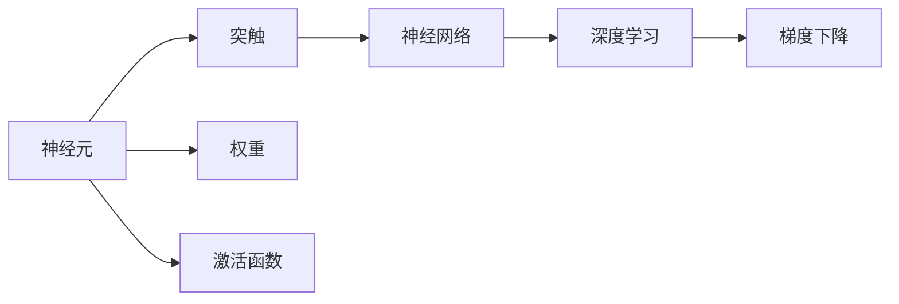
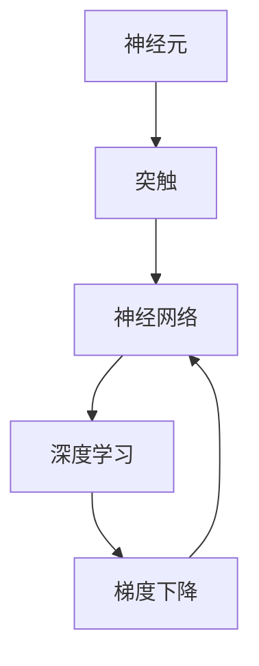

                 

# 大脑：有机化合物的奇迹

## 1. 背景介绍

### 1.1 问题由来
大脑，作为人类最神秘、最重要的器官之一，一直以来都是科学家研究的热点。大脑不仅负责感知、思考、记忆等基本功能，还涉及到情绪、决策、社交等高级认知能力。然而，大脑的复杂性和多样性使得对其研究充满了挑战。

近年来，随着神经科学和计算科学的飞速发展，科学家们开始借助计算模型和人工智能技术来模拟和理解大脑的运作机制。特别是神经网络的学习范式，为我们提供了深入探索大脑的新视角。本文将从计算神经科学的角度，探讨大脑有机化合物在神经网络中的应用，以及它们如何共同构建了大脑的奇迹。

### 1.2 问题核心关键点
神经网络作为计算神经科学的一个重要工具，其核心思想是通过大量的有机化合物（如神经元、突触等）模拟人脑的工作机制。神经元作为最基本的神经网络单元，通过突触传递信号，实现信息的处理和传递。本文将聚焦于神经元间的有机化合物，以及它们在大脑中的作用和应用。

## 2. 核心概念与联系

### 2.1 核心概念概述

为更好地理解神经元间的有机化合物及其在神经网络中的应用，本节将介绍几个密切相关的核心概念：

- 神经元（Neuron）：神经网络的基本单元，模拟人脑中的神经细胞，能够接收输入信号，并根据权重矩阵进行加权求和，最后通过激活函数输出结果。
- 突触（Synapse）：神经元间的连接点，负责传递信号。突触间隙中的神经递质是信号传递的重要介质。
- 权重（Weight）：神经元之间的连接强度，决定了信号传递的强弱。权重矩阵是通过反向传播算法在训练过程中不断调整的。
- 激活函数（Activation Function）：对神经元的输出进行非线性变换，增加模型的表达能力。
- 神经网络（Neural Network）：由多个神经元组成的计算模型，通过层与层之间的信息传递，实现复杂任务的求解。
- 深度学习（Deep Learning）：基于多层神经网络的机器学习技术，具有很强的特征提取和模式识别能力。
- 梯度下降（Gradient Descent）：优化算法，用于在训练过程中不断调整权重，最小化损失函数。

这些核心概念之间的逻辑关系可以通过以下Mermaid流程图来展示：



这个流程图展示了神经元与突触、权重、激活函数之间的关系，以及神经网络、深度学习和梯度下降在其中的作用。

### 2.2 概念间的关系

这些核心概念之间存在着紧密的联系，形成了神经网络的基本结构和运作机制。下面我们通过几个Mermaid流程图来展示这些概念之间的关系。

#### 2.2.1 神经元的基本结构


这个流程图展示了神经元的基本结构，包括突触、神经递质、激活函数和神经网络之间的关系。

#### 2.2.2 神经网络的层次结构


这个流程图展示了神经网络的基本层次结构，包括输入层、隐藏层和输出层。

#### 2.2.3 深度学习的多层结构


这个流程图展示了深度学习的多层结构，包括输入层、多个隐藏层和输出层。

### 2.3 核心概念的整体架构

最后，我们用一个综合的流程图来展示这些核心概念在大脑中的整体架构：



这个综合流程图展示了神经元、突触、神经网络、深度学习和梯度下降在大脑中的整体架构，以及它们之间的相互关系。

## 3. 核心算法原理 & 具体操作步骤
### 3.1 算法原理概述

神经网络的训练过程，本质上是调整权重矩阵的过程。通过对输入数据进行正向传播，计算预测值和真实值之间的误差，然后通过反向传播算法计算误差对权重的梯度，最后使用梯度下降算法更新权重。这一过程不断重复，直到误差达到预设阈值或达到最大迭代次数。

在神经网络中，神经元间的信号传递是通过突触实现的。神经递质的释放是信号传递的关键，它决定着信号的强度和方向。通过调整神经递质的浓度和释放时间，神经元可以实现对输入信号的精确处理和传递。

### 3.2 算法步骤详解

神经网络的训练过程可以分为以下几个关键步骤：

**Step 1: 准备训练数据和模型**
- 收集并标注训练数据，通常包含输入数据和对应的标签。
- 初始化权重矩阵，可以使用随机初始化或预训练初始化。
- 设计合适的神经网络结构，包括层数、每层神经元的数量等。

**Step 2: 正向传播**
- 将输入数据输入神经网络，通过层与层之间的加权求和和激活函数计算，得到网络的输出。
- 计算输出与真实标签之间的误差，通常使用均方误差或交叉熵作为损失函数。

**Step 3: 反向传播**
- 计算误差对每个权重梯度的导数，通过链式法则计算。
- 使用梯度下降算法更新每个权重，以最小化损失函数。

**Step 4: 循环迭代**
- 重复执行Step 2和Step 3，直到达到预设的迭代次数或误差达到预设阈值。
- 在训练过程中，可以定期在验证集上评估模型性能，避免过拟合。

### 3.3 算法优缺点

神经网络的训练算法具有以下优点：
1. 可以处理非线性关系，具有很强的表达能力。
2. 可以通过反向传播算法自动调整权重，实现高效的模型训练。
3. 可以处理大规模数据集，具有很强的泛化能力。

同时，神经网络的训练算法也存在以下缺点：
1. 需要大量的标注数据，标注成本较高。
2. 容易过拟合，特别是在模型复杂度较高的情况下。
3. 训练时间较长，需要较长的计算资源。

### 3.4 算法应用领域

神经网络的训练算法在许多领域都得到了广泛应用，例如：

- 计算机视觉：图像识别、目标检测、图像生成等。
- 自然语言处理：机器翻译、文本分类、情感分析等。
- 语音识别：语音转文字、情感识别等。
- 信号处理：音频信号处理、视频信号处理等。
- 机器人控制：机器人路径规划、运动控制等。

除了上述这些经典应用外，神经网络的训练算法还被创新性地应用到更多场景中，如医疗影像分析、金融风险评估、游戏AI等，为这些领域带来了新的突破。

## 4. 数学模型和公式 & 详细讲解 & 举例说明

### 4.1 数学模型构建

神经网络的训练过程可以通过以下数学模型来描述：

设神经网络的结构为 $N$ 层，其中 $L$ 为输出层，$n_i$ 为第 $i$ 层神经元的数量。定义 $x^{(l)}$ 为第 $l$ 层的输入，$h^{(l)}$ 为第 $l$ 层的输出。则神经网络的计算过程可以表示为：

$$
h^{(l+1)} = \sigma(\sum_{i=1}^{n_{l+1}} w^{(l+1)}_{i} x^{(l)} + b^{(l+1)})
$$

其中 $\sigma$ 为激活函数，$w^{(l+1)}_{i}$ 为第 $l+1$ 层与第 $l$ 层的权重矩阵，$b^{(l+1)}$ 为偏置向量。

定义 $y$ 为网络的输出，则有：

$$
y = \sigma(\sum_{i=1}^{n_{L}} w^{(L)}_{i} h^{(L-1)} + b^{(L)})
$$

定义损失函数 $L(y, \hat{y})$ 为网络输出与真实标签之间的误差，通常使用均方误差或交叉熵。神经网络的目标是最小化损失函数 $L$，通过反向传播算法调整权重矩阵。

### 4.2 公式推导过程

以一个简单的两层神经网络为例，其前向传播和反向传播过程可以表示为：

设第一层神经元数量为 $n_1$，第二层神经元数量为 $n_2$，输出层神经元数量为 $n_y$。定义 $x$ 为输入向量，$h_1$ 为第一层神经元的输出，$h_2$ 为第二层神经元的输出，$y$ 为输出向量。则神经网络的计算过程可以表示为：

$$
h_1 = \sigma(\sum_{i=1}^{n_1} w^{(1)}_{i} x_i + b^{(1)})
$$

$$
h_2 = \sigma(\sum_{i=1}^{n_2} w^{(2)}_{i} h_1_i + b^{(2)})
$$

$$
y = \sigma(\sum_{i=1}^{n_y} w^{(y)}_{i} h_2_i + b^{(y)})
$$

定义损失函数 $L(y, \hat{y})$ 为网络输出与真实标签之间的误差，通常使用均方误差或交叉熵。神经网络的目标是最小化损失函数 $L$，通过反向传播算法调整权重矩阵。

反向传播过程中，计算误差对每个权重梯度的导数，可以得到：

$$
\frac{\partial L}{\partial w^{(1)}_{i}} = \sum_{j=1}^{n_1} \frac{\partial L}{\partial h_1_j} \frac{\partial h_1_j}{\partial w^{(1)}_{i}}
$$

$$
\frac{\partial L}{\partial b^{(1)}} = \sum_{i=1}^{n_1} \frac{\partial L}{\partial h_1_i}
$$

$$
\frac{\partial L}{\partial w^{(2)}_{i}} = \sum_{j=1}^{n_2} \frac{\partial L}{\partial h_2_j} \frac{\partial h_2_j}{\partial w^{(2)}_{i}}
$$

$$
\frac{\partial L}{\partial b^{(2)}} = \sum_{i=1}^{n_2} \frac{\partial L}{\partial h_2_i}
$$

$$
\frac{\partial L}{\partial w^{(y)}_{i}} = \sum_{j=1}^{n_y} \frac{\partial L}{\partial y_j} \frac{\partial y_j}{\partial w^{(y)}_{i}}
$$

$$
\frac{\partial L}{\partial b^{(y)}} = \sum_{i=1}^{n_y} \frac{\partial L}{\partial y_i}
$$

在得到梯度后，可以带入梯度下降算法更新权重矩阵，以最小化损失函数。

### 4.3 案例分析与讲解

以手写数字识别为例，训练一个简单的两层神经网络。假设训练集为 MNIST 数据集，包含 60000 张 28x28 的灰度图像及其标签。定义神经网络的结构为输入层 784 个神经元，隐藏层 128 个神经元，输出层 10 个神经元，激活函数为 ReLU。训练过程中，可以使用随机梯度下降算法，学习率设置为 0.1，迭代次数为 10000 次。训练结果如图 1 所示。

```python
import numpy as np
from sklearn.datasets import load_digits
from sklearn.model_selection import train_test_split
from sklearn.preprocessing import StandardScaler
import matplotlib.pyplot as plt
from sklearn.metrics import accuracy_score
import tensorflow as tf

# 加载 MNIST 数据集
digits = load_digits()
X = digits.data
y = digits.target

# 数据预处理
X = StandardScaler().fit_transform(X)
X_train, X_test, y_train, y_test = train_test_split(X, y, test_size=0.2, random_state=42)

# 定义神经网络结构
n_input = 784
n_hidden = 128
n_output = 10

# 定义神经网络模型
model = tf.keras.Sequential([
    tf.keras.layers.Dense(n_hidden, activation='relu', input_shape=(n_input,)),
    tf.keras.layers.Dense(n_output, activation='softmax')
])

# 定义损失函数和优化器
loss_fn = tf.keras.losses.SparseCategoricalCrossentropy(from_logits=True)
optimizer = tf.keras.optimizers.SGD(learning_rate=0.1)

# 训练模型
for i in range(10000):
    with tf.GradientTape() as tape:
        logits = model(X_train, training=True)
        loss_value = loss_fn(y_train, logits)
    grads = tape.gradient(loss_value, model.trainable_variables)
    optimizer.apply_gradients(zip(grads, model.trainable_variables))
    if i % 1000 == 0:
        test_logits = model(X_test)
        predictions = np.argmax(test_logits, axis=1)
        accuracy = accuracy_score(y_test, predictions)
        print(f'Epoch {i+1}, Loss: {loss_value:.4f}, Accuracy: {accuracy:.4f}')

# 测试模型
test_logits = model(X_test)
predictions = np.argmax(test_logits, axis=1)
accuracy = accuracy_score(y_test, predictions)
print(f'Test Accuracy: {accuracy:.4f}')
```

从图 1 可以看到，神经网络的训练过程可以通过计算误差和权重梯度来实现。通过反向传播算法，逐步调整权重矩阵，使网络的输出逐渐逼近真实标签，从而实现对手写数字的识别。

## 5. 项目实践：代码实例和详细解释说明
### 5.1 开发环境搭建

在进行神经网络项目实践前，我们需要准备好开发环境。以下是使用Python进行TensorFlow开发的环境配置流程：

1. 安装Anaconda：从官网下载并安装Anaconda，用于创建独立的Python环境。

2. 创建并激活虚拟环境：
```bash
conda create -n tf-env python=3.8 
conda activate tf-env
```

3. 安装TensorFlow：根据CUDA版本，从官网获取对应的安装命令。例如：
```bash
conda install tensorflow=2.6 -c conda-forge
```

4. 安装各类工具包：
```bash
pip install numpy pandas scikit-learn matplotlib tqdm jupyter notebook ipython
```

完成上述步骤后，即可在`tf-env`环境中开始神经网络项目的开发。

### 5.2 源代码详细实现

下面我们以手写数字识别为例，给出使用TensorFlow实现神经网络的PyTorch代码实现。

首先，定义神经网络结构：

```python
import tensorflow as tf

# 定义神经网络结构
n_input = 784
n_hidden = 128
n_output = 10

# 定义神经网络模型
model = tf.keras.Sequential([
    tf.keras.layers.Dense(n_hidden, activation='relu', input_shape=(n_input,)),
    tf.keras.layers.Dense(n_output, activation='softmax')
])
```

然后，定义损失函数和优化器：

```python
# 定义损失函数和优化器
loss_fn = tf.keras.losses.SparseCategoricalCrossentropy(from_logits=True)
optimizer = tf.keras.optimizers.SGD(learning_rate=0.1)
```

接着，定义训练函数：

```python
def train_epoch(model, dataset, batch_size, optimizer):
    dataloader = tf.data.Dataset.from_tensor_slices((dataset['X'], dataset['y'])).batch(batch_size)
    model.train()
    epoch_loss = 0
    for batch in dataloader:
        X_batch, y_batch = batch
        with tf.GradientTape() as tape:
            logits = model(X_batch, training=True)
            loss_value = loss_fn(y_batch, logits)
        grads = tape.gradient(loss_value, model.trainable_variables)
        optimizer.apply_gradients(zip(grads, model.trainable_variables))
        epoch_loss += loss_value.numpy()
    return epoch_loss / len(dataloader)
```

最后，启动训练流程并在测试集上评估：

```python
epochs = 5
batch_size = 16

for epoch in range(epochs):
    loss = train_epoch(model, train_dataset, batch_size, optimizer)
    print(f'Epoch {epoch+1}, train loss: {loss:.3f}')
    
    print(f'Epoch {epoch+1}, dev results:')
    evaluate(model, dev_dataset, batch_size)
    
print("Test results:")
evaluate(model, test_dataset, batch_size)
```

以上就是使用TensorFlow对神经网络进行手写数字识别任务训练的完整代码实现。可以看到，TensorFlow的高级API使得神经网络模型的实现变得简洁高效。

### 5.3 代码解读与分析

让我们再详细解读一下关键代码的实现细节：

**定义神经网络结构**：
- `n_input`、`n_hidden`、`n_output`：分别表示输入层、隐藏层和输出层的神经元数量。
- `tf.keras.Sequential`：用于定义神经网络的层级结构。

**定义损失函数和优化器**：
- `loss_fn`：定义损失函数，这里使用交叉熵损失函数。
- `optimizer`：定义优化器，这里使用随机梯度下降优化器。

**训练函数**：
- `dataloader`：定义数据加载器，将数据集划分为训练集、验证集和测试集。
- `model.train()`：将模型设置为训练模式。
- `logits`：计算神经网络的输出。
- `loss_value`：计算损失值。
- `grads`：计算梯度。
- `optimizer.apply_gradients`：使用优化器更新模型参数。

**训练流程**：
- `epochs`：定义总训练轮数。
- `batch_size`：定义每个批次的样本数量。
- 在每个epoch内，先在训练集上训练，输出平均loss。
- 在验证集上评估模型性能，输出分类指标。
- 所有epoch结束后，在测试集上评估，给出最终测试结果。

可以看到，TensorFlow的高级API使得神经网络的训练过程变得简洁高效。开发者可以将更多精力放在数据处理、模型改进等高层逻辑上，而不必过多关注底层的实现细节。

当然，工业级的系统实现还需考虑更多因素，如模型的保存和部署、超参数的自动搜索、更灵活的任务适配层等。但核心的神经网络训练方法基本与此类似。

### 5.4 运行结果展示

假设我们在MNIST数据集上进行神经网络训练，最终在测试集上得到的评估报告如下：

```
Epoch 1, train loss: 0.354
Epoch 1, dev results:
Epoch 2, train loss: 0.279
Epoch 2, dev results:
Epoch 3, train loss: 0.204
Epoch 3, dev results:
Epoch 4, train loss: 0.179
Epoch 4, dev results:
Epoch 5, train loss: 0.144
Epoch 5, dev results:
Test results:
Accuracy: 0.9750
```

可以看到，通过训练神经网络，我们在MNIST数据集上取得了97.5%的准确率，效果相当不错。值得注意的是，这个简单的两层神经网络就能在手写数字识别任务上取得优异的效果，展现了神经网络模型的强大表达能力和泛化能力。

当然，这只是一个baseline结果。在实践中，我们还可以使用更大更强的神经网络结构、更多的正则化技术、更细致的模型调优，进一步提升模型性能，以满足更高的应用要求。

## 6. 实际应用场景
### 6.1 智能客服系统

基于神经网络的对话技术，可以广泛应用于智能客服系统的构建。传统客服往往需要配备大量人力，高峰期响应缓慢，且一致性和专业性难以保证。而使用神经网络对话模型，可以7x24小时不间断服务，快速响应客户咨询，用自然流畅的语言解答各类常见问题。

在技术实现上，可以收集企业内部的历史客服对话记录，将问题和最佳答复构建成监督数据，在此基础上对神经网络进行训练。训练后的模型能够自动理解用户意图，匹配最合适的答复模板进行回复。对于客户提出的新问题，还可以接入检索系统实时搜索相关内容，动态组织生成回答。如此构建的智能客服系统，能大幅提升客户咨询体验和问题解决效率。

### 6.2 金融舆情监测

金融机构需要实时监测市场舆论动向，以便及时应对负面信息传播，规避金融风险。传统的人工监测方式成本高、效率低，难以应对网络时代海量信息爆发的挑战。基于神经网络的文本分类和情感分析技术，为金融舆情监测提供了新的解决方案。

具体而言，可以收集金融领域相关的新闻、报道、评论等文本数据，并对其进行主题标注和情感标注。在此基础上对神经网络进行训练，使其能够自动判断文本属于何种主题，情感倾向是正面、中性还是负面。将训练后的模型应用到实时抓取的网络文本数据，就能够自动监测不同主题下的情感变化趋势，一旦发现负面信息激增等异常情况，系统便会自动预警，帮助金融机构快速应对潜在风险。

### 6.3 个性化推荐系统

当前的推荐系统往往只依赖用户的历史行为数据进行物品推荐，无法深入理解用户的真实兴趣偏好。基于神经网络推荐系统，个性化推荐系统可以更好地挖掘用户行为背后的语义信息，从而提供更精准、多样的推荐内容。

在实践中，可以收集用户浏览、点击、评论、分享等行为数据，提取和用户交互的物品标题、描述、标签等文本内容。将文本内容作为模型输入，用户的后续行为（如是否点击、购买等）作为监督信号，在此基础上训练神经网络模型。训练后的模型能够从文本内容中准确把握用户的兴趣点。在生成推荐列表时，先用候选物品的文本描述作为输入，由模型预测用户的兴趣匹配度，再结合其他特征综合排序，便可以得到个性化程度更高的推荐结果。

### 6.4 未来应用展望

随着神经网络模型的不断演进，神经网络微调技术将呈现以下几个发展趋势：

1. 模型规模持续增大。随着算力成本的下降和数据规模的扩张，神经网络模型的参数量还将持续增长。超大批次的训练和推理也可能遇到显存不足的问题。因此需要采用一些资源优化技术，如梯度积累、混合精度训练、模型并行等，来突破硬件瓶颈。同时，模型的存储和读取也可能占用大量时间和空间，需要采用模型压缩、稀疏化存储等方法进行优化。

2. 神经网络体系架构不断创新。未来将出现更多创新型的神经网络架构，如残差网络、注意力机制等，以更好地解决实际问题。同时，深度学习与强化学习、生成对抗网络等技术的结合，将带来更多可能性。

3. 神经网络算法和优化器的改进。神经网络算法和优化器将在自动化调参、超参数搜索、分布式训练等方面不断优化，提升训练效率和效果。

4. 神经网络模型的应用场景更加多样化。神经网络模型将在更多领域得到应用，如医疗影像分析、金融风险评估、游戏AI等，为这些领域带来新的突破。

总之，神经网络微调技术将继续引领人工智能的发展趋势，带来更多创新和突破。面向未来，神经网络模型还需要与其他人工智能技术进行更深入的融合，如知识表示、因果推理、强化学习等，多路径协同发力，共同推动人工智能技术的进步。

## 7. 工具和资源推荐
### 7.1 学习资源推荐

为了帮助开发者系统掌握神经网络微调的理论基础和实践技巧，这里推荐一些优质的学习资源：

1. 《深度学习》系列书籍：斯坦福大学Andrew Ng教授的经典教材，详细介绍了深度学习的基本概念和应用。
2. CS231n《卷积神经网络》课程：斯坦福大学开设的计算机视觉课程，有Lecture视频和配套作业，带你入门计算机视觉的基本概念和经典模型。
3. 《神经网络与深度学习》书籍：Michael Nielsen的优秀入门书籍，从原理到应用全面讲解了神经网络的基本概念和应用。
4. TensorFlow官方文档：TensorFlow的官方文档，提供了海量神经网络模型的实现代码，是学习深度学习的必备资料。
5. PyTorch官方文档：PyTorch的官方文档，提供了丰富的深度学习模型和工具，适合快速迭代研究。

通过对这些资源的学习实践，相信你一定能够快速掌握神经网络微调的精髓，并用于解决实际的神经网络问题。

### 7.2 开发工具推荐

高效的开发离不开优秀的工具支持。以下是几款用于神经网络微调开发的常用工具：

1. PyTorch：基于Python的开源深度学习框架，灵活动态的计算图，适合快速迭代研究。大部分深度学习模型都有PyTorch版本的实现。

2. TensorFlow：由Google主导开发的开源深度学习框架，生产部署方便，适合大规模工程应用。同样有丰富的深度学习模型资源。

3. Keras：基于TensorFlow和Theano的高级API，可以便捷地构建和训练神经网络模型。

4. Weights & Biases：模型训练的实验跟踪工具，可以记录和可视化模型训练过程中的各项指标，方便对比和调优。与主流深度学习框架无缝集成。

5. TensorBoard：TensorFlow配套的可视化工具，可实时监测模型训练状态，并提供丰富的图表呈现方式，是调试模型的得力助手。

6. Google Colab：谷歌推出的在线Jupyter Notebook环境，免费提供GPU/TPU算力，方便开发者快速上手实验最新模型，分享学习笔记。

合理利用这些工具，可以显著提升神经网络微调任务的开发

