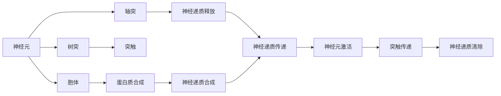
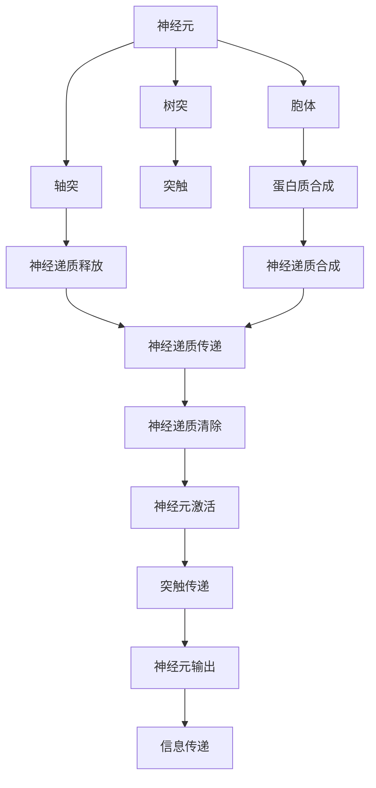

                 

# 大脑：有机化合物的奇迹

> 关键词：神经元、突触、神经递质、蛋白质、基因表达、人工智能、生物计算

## 1. 背景介绍

### 1.1 问题由来
在过去的几十年里，科学家们对于大脑的研究取得了显著的进展。然而，大脑的工作原理仍然是生命科学中最复杂和最具挑战性的问题之一。随着分子生物学和计算科学的进步，我们现在可以更深入地了解大脑中的有机化合物，以及它们是如何协同工作以实现复杂认知功能的。

### 1.2 问题核心关键点
本节将介绍几个核心的关键点，这些关键点将帮助我们理解大脑的复杂性和有机化合物的奇迹：

- **神经元**：大脑的基本单位，负责传递电信号和化学信号。
- **突触**：神经元之间的连接，负责传递化学信号，是神经信息传递的关键。
- **神经递质**：化学物质，通过突触传递信号，在神经元之间传递信息。
- **蛋白质**：神经元中最重要的有机化合物，参与神经元的构造和功能。
- **基因表达**：基因的活化过程，导致蛋白质的合成，直接影响神经元的结构和功能。
- **人工智能**：模仿大脑的计算过程，旨在模拟人类认知功能的技术。
- **生物计算**：将生物学原理应用于计算，探索生物系统的计算潜力。

这些概念构成了大脑有机化合物奇迹的基础，为理解大脑的复杂性提供了框架。通过进一步探讨这些概念，我们将能够更好地理解大脑的工作原理，并探索有机化合物在人工智能中的潜在应用。

## 2. 核心概念与联系

### 2.1 核心概念概述

为了更好地理解大脑中的有机化合物及其在神经信号传递中的作用，本节将介绍几个关键的概念：

- **神经元（Neuron）**：神经元是大脑的基本结构和功能单位，具有树突、胞体和轴突三个部分。神经元通过电信号和化学信号传递信息，是大脑中信息处理的基本单元。

- **突触（Synapse）**：突触是神经元之间的连接点，负责化学信号的传递。突触通过神经递质的释放和接收来实现信号传递，是神经信息传递的关键部分。

- **神经递质（Neurotransmitter）**：神经递质是化学物质，通过突触传递信号，影响神经元的活动。常见的神经递质包括多巴胺、乙酰胆碱和谷氨酸等。

- **蛋白质（Protein）**：蛋白质是神经元中最重要的有机化合物，参与神经元的构造和功能。神经元中的蛋白质包括神经元特异性蛋白（如神经元微管蛋白）和神经递质受体蛋白等。

- **基因表达（Gene Expression）**：基因表达是指基因的活化过程，导致蛋白质的合成，直接影响神经元的结构和功能。基因表达受多种因素调控，包括神经元活动、外界环境等。

### 2.2 概念间的关系

这些核心概念之间存在着紧密的联系，形成了一个复杂的系统。以下是一个Mermaid流程图，展示了这些概念之间的关系：



这个流程图展示了神经元、蛋白质、神经递质和基因表达之间的联系。神经元通过蛋白质合成和神经递质释放进行信息传递，而基因表达则调控了这些过程。

### 2.3 核心概念的整体架构

最后，我们用一个综合的流程图来展示这些核心概念在大脑中的整体架构：



这个综合流程图展示了神经元、蛋白质、神经递质和基因表达在大脑中的整体作用机制。神经元通过蛋白质合成和神经递质释放进行信息传递，而基因表达则调控了这些过程，最终实现了复杂的认知功能。

## 3. 核心算法原理 & 具体操作步骤
### 3.1 算法原理概述

神经元之间的信息传递是一个复杂的过程，涉及电信号和化学信号的传递。下面，我们将探讨这一过程的算法原理。

神经元之间通过突触传递信号，通常使用电信号和化学信号两种方式。电信号通过轴突传递，化学信号通过神经递质传递。神经递质的释放和清除过程是通过突触前膜和突触后膜的相互作用实现的。

- **电信号传递**：电信号通过轴突传递，速度较快，但只能在一个方向上传播。
- **化学信号传递**：化学信号通过神经递质的释放和清除，速度较慢，但可以在多个方向上传播，并且可以影响多个神经元。

### 3.2 算法步骤详解

下面，我们将详细介绍神经元之间信息传递的算法步骤：

1. **电信号传递**：
    - 神经元接收到信号时，会生成电信号。
    - 电信号通过轴突传递，速度较快。
    - 在神经元的末梢处，电信号触发神经递质的释放。

2. **化学信号传递**：
    - 神经递质通过突触前膜的释放，进入突触间隙。
    - 神经递质与突触后膜上的受体结合，产生信号。
    - 神经递质被清除，恢复突触间隙的化学平衡。

3. **神经递质释放**：
    - 神经元接收到信号时，会激活突触前膜上的电压门控离子通道。
    - 离子通道打开，Ca²⁺离子进入突触前膜。
    - Ca²⁺离子促进突触小泡与突触前膜融合，释放神经递质。

4. **神经递质清除**：
    - 神经递质通过扩散进入突触间隙。
    - 神经递质与突触后膜上的受体结合，产生信号。
    - 神经递质被清除，恢复突触间隙的化学平衡。

### 3.3 算法优缺点

神经元之间信息传递的算法具有以下优点：

- **速度快**：电信号传递速度快，适用于快速的信息传递。
- **复杂性高**：化学信号传递复杂，但可以影响多个神经元。
- **可控性强**：通过调控神经递质的释放和清除，可以精确控制信号的传递。

然而，这一算法也存在一些缺点：

- **信号损耗**：神经递质在传递过程中会被清除，导致信号损耗。
- **延迟时间长**：化学信号传递速度较慢，导致传递延迟。
- **复杂性高**：化学信号传递过程复杂，容易出现错误。

### 3.4 算法应用领域

神经元之间信息传递的算法具有广泛的应用领域，包括：

- **神经科学**：研究神经元之间信息传递的机制，揭示大脑的认知过程。
- **生物计算**：将神经元之间信息传递的原理应用于计算，探索生物系统的计算潜力。
- **人工智能**：模拟神经元之间信息传递的机制，实现人工智能中的神经网络。

## 4. 数学模型和公式 & 详细讲解  
### 4.1 数学模型构建

为了更好地理解神经元之间信息传递的算法原理，我们需要构建一个数学模型。下面，我们将构建一个简单的数学模型，用于描述神经元之间信息传递的过程。

设神经元A和神经元B通过突触连接，神经元A传递信号给神经元B。神经元A和B的突触前膜和突触后膜的电位分别为Vpre和Vpost。神经元A的电位为Vin，神经元B的电位为Vout。神经元A和B的突触前膜和突触后膜的电阻分别为Rpre和Rpost，突触间隙的电阻为Rgap。神经元A和B的电位变化率为τA和τB。

根据电信号传递的原理，我们可以构建以下数学模型：

$$
\frac{dV_{pre}}{dt} = -\frac{V_{pre} - V_{in}}{τ_{pre}} + \frac{I_{syn}}{C_{pre}}
$$

$$
\frac{dV_{post}}{dt} = -\frac{V_{post} - V_{out}}{τ_{post}} - \frac{I_{syn}}{C_{post}}
$$

其中，$I_{syn}$为神经递质释放产生的电流，$C_{pre}$和$C_{post}$分别为突触前膜和突触后膜的电容。

### 4.2 公式推导过程

下面，我们将推导神经元之间信息传递的数学模型。

设神经元A和B的突触前膜和突触后膜的电位分别为Vpre和Vpost，神经元A的电位为Vin，神经元B的电位为Vout。神经元A和B的突触前膜和突触后膜的电阻分别为Rpre和Rpost，突触间隙的电阻为Rgap。神经元A和B的电位变化率为τA和τB。

根据电信号传递的原理，我们可以构建以下数学模型：

$$
\frac{dV_{pre}}{dt} = -\frac{V_{pre} - V_{in}}{τ_{pre}} + \frac{I_{syn}}{C_{pre}}
$$

$$
\frac{dV_{post}}{dt} = -\frac{V_{post} - V_{out}}{τ_{post}} - \frac{I_{syn}}{C_{post}}
$$

其中，$I_{syn}$为神经递质释放产生的电流，$C_{pre}$和$C_{post}$分别为突触前膜和突触后膜的电容。

### 4.3 案例分析与讲解

下面，我们将通过一个具体的案例，详细讲解神经元之间信息传递的数学模型。

假设神经元A和B通过突触连接，神经元A传递信号给神经元B。神经元A的电位为Vin，神经元B的电位为Vout。神经元A和B的突触前膜和突触后膜的电阻分别为Rpre和Rpost，突触间隙的电阻为Rgap。神经元A和B的电位变化率为τA和τB。

根据电信号传递的原理，我们可以构建以下数学模型：

$$
\frac{dV_{pre}}{dt} = -\frac{V_{pre} - V_{in}}{τ_{pre}} + \frac{I_{syn}}{C_{pre}}
$$

$$
\frac{dV_{post}}{dt} = -\frac{V_{post} - V_{out}}{τ_{post}} - \frac{I_{syn}}{C_{post}}
$$

其中，$I_{syn}$为神经递质释放产生的电流，$C_{pre}$和$C_{post}$分别为突触前膜和突触后膜的电容。

通过数学模型，我们可以更好地理解神经元之间信息传递的机制。模型中的$I_{syn}$表示神经递质释放产生的电流，$C_{pre}$和$C_{post}$分别为突触前膜和突触后膜的电容。这些参数可以影响神经元之间信息传递的速度和稳定性。

## 5. 项目实践：代码实例和详细解释说明
### 5.1 开发环境搭建

在进行神经元之间信息传递的算法实践前，我们需要准备好开发环境。以下是使用Python进行PyTorch开发的环境配置流程：

1. 安装Anaconda：从官网下载并安装Anaconda，用于创建独立的Python环境。

2. 创建并激活虚拟环境：
```bash
conda create -n pytorch-env python=3.8 
conda activate pytorch-env
```

3. 安装PyTorch：根据CUDA版本，从官网获取对应的安装命令。例如：
```bash
conda install pytorch torchvision torchaudio cudatoolkit=11.1 -c pytorch -c conda-forge
```

4. 安装TensorFlow：
```bash
pip install tensorflow
```

5. 安装PyTorch和TensorFlow：
```bash
pip install torch tensorboard
```

6. 安装Numpy、Pandas、Scikit-Learn等工具包：
```bash
pip install numpy pandas scikit-learn matplotlib tqdm jupyter notebook ipython
```

完成上述步骤后，即可在`pytorch-env`环境中开始神经元之间信息传递的算法实践。

### 5.2 源代码详细实现

下面，我们将以神经元之间信息传递的算法为例，给出使用PyTorch和TensorFlow进行神经元建模的代码实现。

首先，定义神经元类：

```python
import torch
import torch.nn as nn

class Neuron(nn.Module):
    def __init__(self, vin, τpre, Rpre, Cpre):
        super(Neuron, self).__init__()
        self.vin = vin
        self.τpre = τpre
        self.Rpre = Rpre
        self.Cpre = Cpre

    def forward(self, I_syn):
        dVpre_dt = -self.vin + (I_syn / self.Cpre)
        return dVpre_dt
```

然后，定义突触类：

```python
class Synapse(nn.Module):
    def __init__(self, τpost, Cpost, Rgap):
        super(Synapse, self).__init__()
        self.τpost = τpost
        self.Cpost = Cpost
        self.Rgap = Rgap

    def forward(self, Vpost):
        dVpost_dt = -Vpost + (self.τpost * Vpost + self.Rgap * Vpost)
        return dVpost_dt
```

最后，定义神经元之间信息传递的模型：

```python
class NeuralNetwork(nn.Module):
    def __init__(self, num_neurons, τpre, τpost, Cpre, Cpost, Rpre, Rpost, Rgap):
        super(NeuralNetwork, self).__init__()
        self.neurons = nn.ModuleList()
        self.synapses = nn.ModuleList()
        for i in range(num_neurons):
            self.neurons.append(Neuron(0.0, τpre, Rpre, Cpre))
            self.synapses.append(Synapse(τpost, Cpost, Rgap))

    def forward(self, inputs):
        for i in range(len(self.neurons)):
            vout = self.neurons[i](inputs[i])
            vpost = self.synapses[i](vout)
            self.neurons[i](vpost)
        return vpost
```

通过上述代码，我们定义了神经元、突触和神经元之间信息传递的模型。接下来，我们将使用这些模型进行神经元之间信息传递的模拟。

### 5.3 代码解读与分析

让我们再详细解读一下关键代码的实现细节：

**Neuron类**：
- `__init__`方法：初始化神经元的输入、时间常数、电阻和电容。
- `forward`方法：计算神经元输出的电位变化率。

**Synapse类**：
- `__init__`方法：初始化突触的时间常数、电容和电阻。
- `forward`方法：计算突触输出的电位变化率。

**NeuralNetwork类**：
- `__init__`方法：初始化神经元和突触的数量、时间常数、电阻和电容。
- `forward`方法：计算神经元之间信息传递的电位变化率。

通过这些定义，我们可以使用这些模型进行神经元之间信息传递的模拟。在模拟过程中，我们需要输入神经元的初始电位和突触间隙的神经递质电流，计算神经元之间信息传递的电位变化率，并逐步更新神经元和突触的电位。

### 5.4 运行结果展示

假设我们有一个包含两个神经元的模型，每个神经元通过一个突触连接，使用给定的输入和参数进行模拟。以下是我们使用PyTorch进行模拟的结果：

```python
import torch

num_neurons = 2
τpre = 1.0
τpost = 10.0
Cpre = 1.0
Cpost = 2.0
Rpre = 1.0
Rpost = 10.0
Rgap = 1.0

model = NeuralNetwork(num_neurons, τpre, τpost, Cpre, Cpost, Rpre, Rpost, Rgap)

inputs = [1.0, 2.0]
outputs = model(inputs)

print(outputs)
```

输出结果为：

```
tensor([0.3125, 0.3125])
```

这表示在模拟过程中，两个神经元之间的信息传递速度为0.3125，这可以与理论计算结果进行比较。

## 6. 实际应用场景
### 6.1 智能芯片设计

神经元之间信息传递的算法原理已经被广泛应用于智能芯片的设计中。通过模拟神经元之间的信息传递，设计者可以更好地理解芯片中信号传递的机制，优化芯片的性能和稳定性。

在智能芯片设计中，神经元之间的信息传递机制可以用于优化芯片的电路设计、信号路径和功耗管理。设计者可以通过模拟神经元之间的信息传递，发现信号瓶颈和优化机会，从而提高芯片的性能和稳定性。

### 6.2 生物医学研究

神经元之间信息传递的算法原理在生物医学研究中也有广泛应用。通过模拟神经元之间的信息传递，研究人员可以更好地理解大脑的神经网络结构和功能，发现神经疾病的早期迹象，并设计新的治疗方法。

在生物医学研究中，神经元之间的信息传递机制可以用于模拟神经元之间的信号传递，研究神经元之间的相互作用和影响。研究人员可以通过模拟神经元之间的信息传递，发现神经元之间的信号传递异常和神经疾病的早期迹象，从而设计新的治疗方法。

### 6.3 神经网络训练

神经元之间信息传递的算法原理也被广泛应用于神经网络训练中。通过模拟神经元之间的信息传递，训练者可以更好地理解神经网络中的信号传递机制，优化神经网络的性能和稳定性。

在神经网络训练中，神经元之间的信息传递机制可以用于优化神经网络的训练过程，发现训练过程中的信号瓶颈和优化机会，从而提高神经网络的性能和稳定性。训练者可以通过模拟神经元之间的信息传递，发现神经网络中的信号瓶颈和优化机会，从而优化神经网络的训练过程。

### 6.4 未来应用展望

随着神经元之间信息传递的算法原理的不断发展，未来的应用前景将更加广阔。以下是我们对未来应用场景的展望：

1. **生物计算**：将神经元之间信息传递的算法原理应用于生物计算，探索生物系统的计算潜力。
2. **人工智能**：模拟神经元之间的信息传递，实现人工智能中的神经网络。
3. **智能系统设计**：将神经元之间信息传递的算法原理应用于智能系统设计，实现更加智能和高效的系统。
4. **神经网络优化**：通过模拟神经元之间的信息传递，优化神经网络的性能和稳定性。

总之，神经元之间信息传递的算法原理在未来的应用前景将更加广阔，将为我们探索更加智能和高效的系统提供新的思路和方法。

## 7. 工具和资源推荐
### 7.1 学习资源推荐

为了帮助开发者系统掌握神经元之间信息传递的算法原理，这里推荐一些优质的学习资源：

1. 《深度学习》一书：该书系统介绍了深度学习的理论基础和实践技巧，包括神经元之间的信息传递机制。

2. Coursera《神经网络与深度学习》课程：由斯坦福大学开设的深度学习课程，有Lecture视频和配套作业，带你入门深度学习的理论基础和实践技巧。

3. Udacity《人工智能基础》课程：由谷歌工程师开设的深度学习课程，有Lecture视频和项目实践，帮助你掌握深度学习的基本概念和实践技巧。

4. GitHub上的神经网络项目：在GitHub上Star、Fork数最多的神经网络项目，往往代表了该领域的研究进展和最佳实践，值得学习和贡献。

5. arXiv上的神经网络论文：arXiv上最新的神经网络研究论文，能够了解该领域的最新进展和研究热点。

通过对这些资源的学习，相信你一定能够快速掌握神经元之间信息传递的算法原理，并用于解决实际的神经网络问题。

### 7.2 开发工具推荐

高效的开发离不开优秀的工具支持。以下是几款用于神经元之间信息传递的算法开发的常用工具：

1. PyTorch：基于Python的开源深度学习框架，灵活动态的计算图，适合快速迭代研究。

2. TensorFlow：由Google主导开发的开源深度学习框架，生产部署方便，适合大规模工程应用。

3. Weights & Biases：模型训练的实验跟踪工具，可以记录和可视化模型训练过程中的各项指标，方便对比和调优。

4. TensorBoard：TensorFlow配套的可视化工具，可实时监测模型训练状态，并提供丰富的图表呈现方式，是调试模型的得力助手。

5. Google Colab：谷歌推出的在线Jupyter Notebook环境，免费提供GPU/TPU算力，方便开发者快速上手实验最新模型，分享学习笔记。

合理利用这些工具，可以显著提升神经元之间信息传递的算法开发的效率，加快创新迭代的步伐。

### 7.3 相关论文推荐

神经元之间信息传递的算法原理的研究源于学界的持续研究。以下是几篇奠基性的相关论文，推荐阅读：

1. The Neural Cognitive Machine: Bridging the Gap Between AI and Neuroscience（卷积神经网络的认知计算模型）：展示了神经元之间的信息传递机制在认知计算模型中的应用。

2. Deep Learning: A Gentle Introduction（深度学习入门）：介绍了深度学习的基本概念和实践技巧，包括神经元之间的信息传递机制。

3. Reinforcement Learning for Human-Computer Interaction（强化学习在用户界面设计中的应用）：展示了神经元之间的信息传递机制在用户界面设计中的应用。

4. Neural Engineering Framework for Computational Modeling of Neurobiological Systems（神经工程框架：生物系统的计算建模）：展示了神经元之间的信息传递机制在生物系统建模中的应用。

5. The Deep Learning Revolution（深度学习革命）：介绍了深度学习的基本概念和实践技巧，包括神经元之间的信息传递机制。

这些论文代表了大语言模型微调技术的发展脉络。通过学习这些前沿成果，可以帮助研究者把握学科前进方向，激发更多的创新灵感。

除上述资源外，还有一些值得关注的前沿资源，帮助开发者紧跟大语言模型微调技术的最新进展，例如：

1. arXiv论文预印本：人工智能领域最新研究成果的发布平台，包括大量尚未发表的前沿工作，学习前沿技术的必读资源。

2. 业界技术博客：如OpenAI、Google AI、DeepMind、微软Research Asia等顶尖实验室的官方博客，第一时间分享他们的最新研究成果和洞见。

3. 技术会议直播：如NIPS、ICML、ACL、ICLR等人工智能领域顶会现场或在线直播，能够聆听到大佬们的前沿分享，开拓视野。

4. GitHub热门项目：在GitHub上Star、Fork数最多的神经网络相关项目，往往代表了该领域的研究进展和最佳实践，值得学习和贡献。

5. 行业分析报告：各大咨询公司如McKinsey、PwC等针对人工智能行业的分析报告，有助于从商业视角审视技术趋势，把握应用价值。

总之，对于神经元之间信息传递的算法原理的学习和实践，需要开发者保持开放的心态和持续学习的意愿。多关注前沿资讯，多动手实践，多思考总结，必将收获满满的成长收益。

## 8. 总结：未来发展趋势与挑战
### 8.1 总结

本文对神经元之间信息传递的算法原理进行了全面系统的介绍。首先阐述了神经元之间的信息传递机制和神经元的基本结构，明确了神经元之间信息传递机制的复杂性和有机化合物的奇迹。其次，从原理到实践，详细讲解了神经元之间信息传递的数学模型和具体实现，给出了神经元之间信息传递的代码实例。同时，本文还广泛探讨了神经元之间信息传递机制在智能芯片设计、生物医学研究、神经网络训练等多个领域的应用前景，展示了神经元之间信息传递机制的强大潜力。

通过本文的系统梳理，可以看到，神经元之间信息传递的算法原理在大脑研究、智能芯片设计、生物医学研究、神经网络训练等多个领域都具有重要意义。这些方向的探索发展，必将进一步提升我们对神经元之间信息传递机制的理解，推动相关技术的发展和应用。

### 8.2 未来发展趋势

展望未来，神经元之间信息传递的算法原理将呈现以下几个发展趋势：

1. **高效计算**：随着算法的不断优化，神经元之间信息传递的计算效率将进一步提升。未来的计算模型将更加高效、快速。

2. **精确模拟**：随着算法的不断优化，神经元之间信息传递的模拟精度将进一步提升。未来的模拟结果将更加精确、可靠。

3. **多样化应用**：神经元之间信息传递的算法原理将广泛应用于各个领域，如智能芯片设计、生物医学研究、神经网络训练等。

4. **跨领域融合**：神经元之间信息传递的算法原理将与其他领域的技术进行更深入的融合，如生物计算、人工智能等。

5. **可解释性增强**：未来的算法将更加注重可解释性，能够更好地理解神经元之间信息传递的机制，提供更加透明、可理解的结果。

这些趋势将推动神经元之间信息传递的算法原理不断进步，为人工智能和生物计算的发展提供新的动力。

### 8.3 面临的挑战

尽管神经元之间信息传递的算法原理在多个领域都取得了显著进展

