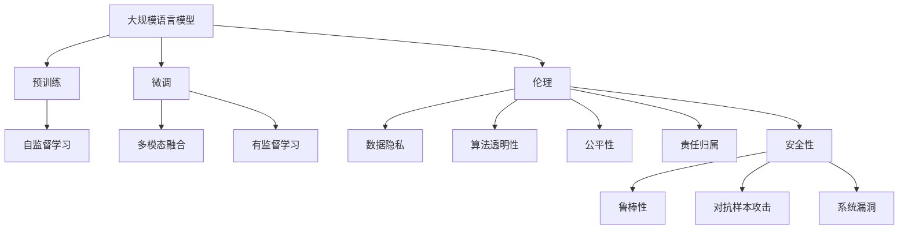
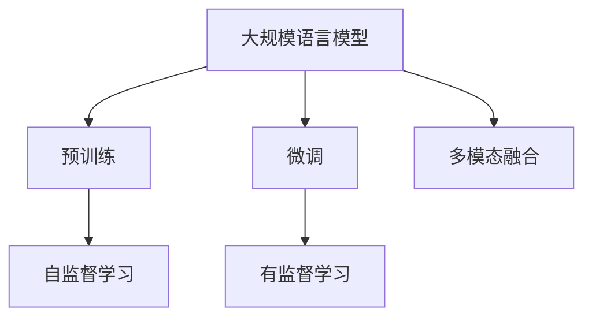
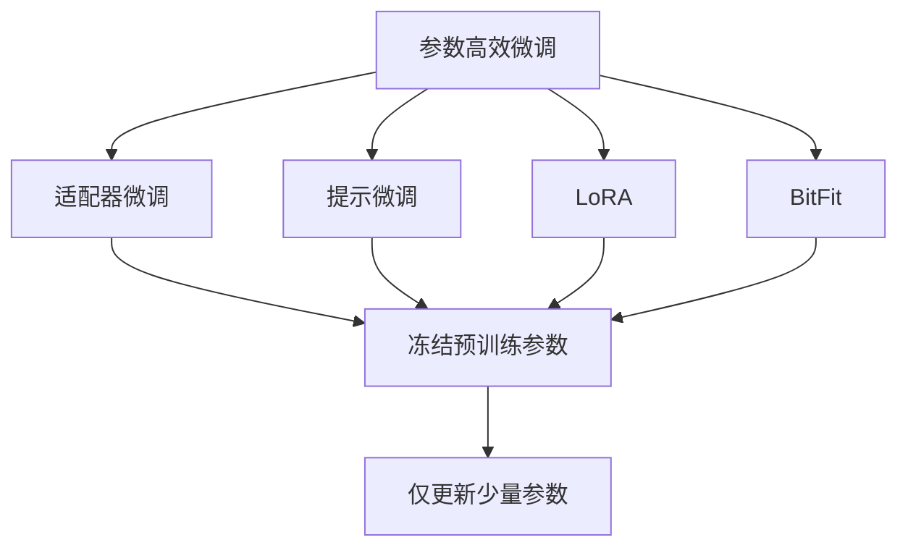
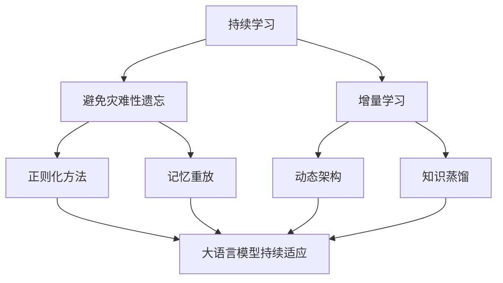

                 

# 大规模语言模型从理论到实践 伦理与安全

> 关键词：大规模语言模型,预训练,微调,多模态融合,伦理,安全性,隐私保护

## 1. 背景介绍

近年来，随着深度学习技术的飞速发展，大规模语言模型（Large Language Models, LLMs）在自然语言处理（Natural Language Processing, NLP）领域取得了巨大的突破。这些模型通过在海量无标签文本数据上进行预训练，学习到了丰富的语言知识和常识，可以通过少量的有标签样本在下游任务上进行微调，获得优异的性能。

然而，伴随着模型规模的不断增大，大规模语言模型在带来巨大潜力的同时，也引发了一系列伦理和安全问题。这些问题包括数据隐私、模型偏见、预测透明度等，对社会的影响也越来越受到关注。因此，在推动大规模语言模型发展的同时，如何确保其伦理与安全，成为当前研究的重要课题。

本文将从理论和实践两方面，探讨大规模语言模型的伦理与安全问题，并提出一些解决思路。

## 2. 核心概念与联系

### 2.1 核心概念概述

为更好地理解大规模语言模型的伦理与安全问题，本节将介绍几个密切相关的核心概念：

- **大规模语言模型**：以自回归（如GPT）或自编码（如BERT）模型为代表的大规模预训练语言模型。通过在大规模无标签文本语料上进行预训练，学习通用的语言表示，具备强大的语言理解和生成能力。

- **预训练**：指在大规模无标签文本语料上，通过自监督学习任务训练通用语言模型的过程。常见的预训练任务包括言语建模、遮挡语言模型等。预训练使得模型学习到语言的通用表示。

- **微调**：指在预训练模型的基础上，使用下游任务的少量标注数据，通过有监督学习优化模型在特定任务上的性能。通常只需要调整顶层分类器或解码器，并以较小的学习率更新全部或部分的模型参数。

- **多模态融合**：指将多种不同模态（如文本、图像、声音等）的数据进行融合，提升模型对复杂情境的全面理解能力。

- **伦理**：在人工智能中，涉及数据隐私、算法透明性、公平性、责任归属等多个方面，强调科技应用中的人类价值观和道德规范。

- **安全性**：包括模型鲁棒性、对抗样本攻击、系统漏洞等方面，强调系统的稳定性和可靠性。

这些核心概念之间的逻辑关系可以通过以下Mermaid流程图来展示：



这个流程图展示了大规模语言模型的核心概念及其之间的关系：

1. 大规模语言模型通过预训练获得基础能力。
2. 微调是对预训练模型进行任务特定的优化，可以分为全参数微调和参数高效微调（PEFT）。
3. 多模态融合是指将不同模态的数据进行综合，提升模型理解复杂情境的能力。
4. 伦理涉及数据隐私、算法透明性、公平性等多个方面，确保科技应用符合人类价值观和道德规范。
5. 安全性包括模型鲁棒性、对抗样本攻击、系统漏洞等方面，确保系统的稳定性和可靠性。

这些核心概念共同构成了大规模语言模型的完整生态系统，使其能够在各种场景下发挥强大的语言理解和生成能力，同时也要注重其伦理和安全性问题。

### 2.2 概念间的关系

这些核心概念之间存在着紧密的联系，形成了大规模语言模型应用的完整生态系统。下面我们通过几个Mermaid流程图来展示这些概念之间的关系。

#### 2.2.1 大语言模型的学习范式



这个流程图展示了大语言模型的三种主要学习范式：预训练、微调和多模态融合。预训练主要采用自监督学习方法，而微调则是有监督学习的过程。多模态融合可以将不同模态的数据进行综合，提升模型理解复杂情境的能力。

#### 2.2.2 伦理与安全的关系


这个流程图展示了伦理与安全之间的关系。数据隐私、算法透明性、公平性、责任归属等方面，都与模型的安全性密切相关。只有在确保数据隐私和算法透明性的前提下，才能实现公平的决策和明确的责任归属。模型的鲁棒性和对抗样本攻击能力，也需要在设计和训练过程中予以考虑。

#### 2.2.3 参数高效微调方法



这个流程图展示了几种常见的参数高效微调方法，包括适配器微调、提示微调、LoRA和BitFit。这些方法的共同特点是冻结大部分预训练参数，只更新少量参数，从而提高微调效率。

#### 2.2.4 持续学习在大语言模型中的应用



这个流程图展示了持续学习在大语言模型中的应用。持续学习的主要目标是避免灾难性遗忘和实现增量学习。通过正则化方法、记忆重放、动态架构和知识蒸馏等技术，可以使大语言模型持续适应新的任务和数据。

## 3. 核心算法原理 & 具体操作步骤

### 3.1 算法原理概述

大规模语言模型的伦理与安全问题，主要来源于其在数据处理、模型训练和应用部署等环节中的潜在风险。其核心思想是：在使用大规模语言模型时，需要对其行为和决策过程进行全面审视，确保其符合伦理和安全的标准。

### 3.2 算法步骤详解

基于大规模语言模型的伦理与安全问题，其算法步骤主要包括以下几个方面：

**Step 1: 数据处理与隐私保护**

1. 数据收集：确保数据来源合法，遵循数据隐私保护法规。
2. 数据清洗：去除敏感信息、重复数据等，避免模型学习到有害信息。
3. 数据匿名化：对数据进行去标识化处理，保护用户隐私。
4. 数据分割：将数据划分为训练集、验证集和测试集，确保模型泛化能力。

**Step 2: 模型训练与公平性**

1. 公平性约束：在模型训练过程中引入公平性约束，避免模型偏见。
2. 对抗训练：使用对抗样本训练模型，提升鲁棒性。
3. 正则化：引入L2正则、Dropout等正则化技术，防止过拟合。
4. 知识蒸馏：通过知识蒸馏技术，利用大模型的先验知识进行微调。

**Step 3: 模型评估与安全性**

1. 模型评估：在测试集上评估模型的性能，确保其符合业务需求。
2. 对抗测试：通过对抗测试，检测模型的鲁棒性。
3. 安全审计：对模型进行安全审计，查找潜在漏洞。
4. 模型监控：实时监控模型运行状态，及时发现异常。

**Step 4: 模型部署与伦理保障**

1. 模型部署：将模型部署到实际应用系统中，提供服务接口。
2. 伦理审查：在模型部署前进行伦理审查，确保符合伦理规范。
3. 用户教育：对用户进行模型使用教育，提高透明度。
4. 责任归属：明确模型的责任归属，确保问责机制。

### 3.3 算法优缺点

大规模语言模型在伦理与安全方面的优点包括：

1. 强大的语言理解能力：通过预训练和微调，模型能够理解自然语言并生成自然语言。
2. 多任务学习能力：模型可以通过微调适应多种下游任务，提升应用范围。
3. 灵活性：模型可以融合多模态数据，提升理解复杂情境的能力。

其缺点包括：

1. 数据隐私问题：模型训练需要大量数据，可能涉及用户隐私。
2. 模型偏见：模型可能会学习到数据中的偏见，导致不公平的决策。
3. 透明度问题：模型决策过程缺乏透明度，难以解释和调试。
4. 安全性问题：模型可能面临对抗样本攻击，存在系统漏洞。

### 3.4 算法应用领域

大规模语言模型在多个领域具有广泛的应用前景，例如：

- 智能客服：基于自然语言处理技术的智能客服系统，能够回答用户咨询，提供个性化服务。
- 医疗诊断：通过自然语言理解技术，从医学文献中提取知识，辅助医生诊断。
- 金融分析：利用自然语言处理技术，分析金融新闻和报告，进行投资决策。
- 法律咨询：通过自然语言理解技术，解答法律问题，提供法律建议。
- 教育辅导：利用自然语言生成技术，生成教育内容，辅助学生学习。

除了这些领域外，大规模语言模型还可以应用于智能推荐、内容生成、情感分析等多个场景，为社会带来深远的影响。

## 4. 数学模型和公式 & 详细讲解 & 举例说明

### 4.1 数学模型构建

本节将使用数学语言对基于大规模语言模型的伦理与安全问题进行更加严格的刻画。

记大规模语言模型为 $M_{\theta}$，其中 $\theta$ 为模型参数。假设模型在数据集 $D=\{(x_i,y_i)\}_{i=1}^N$ 上的公平性损失函数为 $\ell_{\text{fair}}(M_{\theta},D)$，鲁棒性损失函数为 $\ell_{\text{robust}}(M_{\theta},D)$。模型训练的目标是找到最优参数 $\theta^*$，使得：

$$
\theta^* = \mathop{\arg\min}_{\theta} \ell_{\text{fair}}(M_{\theta},D) + \lambda \ell_{\text{robust}}(M_{\theta},D)
$$

其中 $\lambda$ 为鲁棒性损失函数的权重系数。

### 4.2 公式推导过程

以下我们以公平性约束为例，推导模型训练过程中的公平性损失函数的计算公式。

假设模型在训练样本 $(x_i,y_i)$ 上的输出为 $M_{\theta}(x_i)$，其中 $y_i$ 为实际标签，$M_{\theta}(x_i)$ 为模型预测的标签概率分布。假设 $y_i$ 为正样本（label=1），则公平性约束可以定义为：

$$
\ell_{\text{fair}}(M_{\theta},D) = \frac{1}{N} \sum_{i=1}^N \log\left(\frac{M_{\theta}(x_i)}{1-M_{\theta}(x_i)}\right) + \frac{\lambda}{N} \sum_{i=1}^N \log\left(\frac{1-M_{\theta}(x_i)}{M_{\theta}(x_i)}\right)
$$

其中 $\lambda$ 为公平性约束的权重系数，$M_{\theta}(x_i)$ 为模型预测的正样本概率，$1-M_{\theta}(x_i)$ 为模型预测的负样本概率。

将公平性约束引入模型训练过程，可以通过梯度下降等优化算法最小化公平性损失函数。在优化过程中，需要平衡模型预测的正样本概率和负样本概率，确保模型在不同类别之间的公平性。

### 4.3 案例分析与讲解

**案例分析1：医疗领域的公平性问题**

在大规模语言模型应用于医疗领域时，公平性问题尤为重要。例如，模型可能会偏向于学习到高收入群体的疾病表现，而忽视低收入群体的健康问题。为了解决这个问题，可以在模型训练过程中引入公平性约束，确保模型对不同收入群体的疾病预测具有相似的表现。

假设模型在训练数据集中有 $N$ 个样本，其中 $N_1$ 为高收入群体样本，$N_2$ 为低收入群体样本。则公平性约束可以定义为：

$$
\ell_{\text{fair}}(M_{\theta},D) = \frac{1}{N_1} \sum_{i=1}^{N_1} \log\left(\frac{M_{\theta}(x_i)}{1-M_{\theta}(x_i)}\right) + \frac{1}{N_2} \sum_{i=1}^{N_2} \log\left(\frac{1-M_{\theta}(x_i)}{M_{\theta}(x_i)}\right)
$$

通过引入公平性约束，确保模型对高收入和低收入群体疾病预测的相似性。

**案例分析2：对抗样本攻击**

对抗样本攻击是指通过在输入数据中引入轻微扰动，使模型输出错误的结果。例如，在图像分类任务中，对抗样本攻击可以通过轻微修改图像像素，使模型将正确分类为正面样本的图像误判为负面样本。

为了应对对抗样本攻击，可以在模型训练过程中引入鲁棒性约束，提高模型的抗干扰能力。假设模型在训练数据集 $D$ 上的鲁棒性损失函数为 $\ell_{\text{robust}}(M_{\theta},D)$，则训练目标为：

$$
\theta^* = \mathop{\arg\min}_{\theta} \ell_{\text{fair}}(M_{\theta},D) + \lambda \ell_{\text{robust}}(M_{\theta},D)
$$

其中 $\lambda$ 为鲁棒性约束的权重系数。通过最小化鲁棒性损失函数，可以提高模型的抗干扰能力，减少对抗样本攻击的影响。

## 5. 项目实践：代码实例和详细解释说明

### 5.1 开发环境搭建

在进行伦理与安全实践前，我们需要准备好开发环境。以下是使用Python进行PyTorch开发的环境配置流程：

1. 安装Anaconda：从官网下载并安装Anaconda，用于创建独立的Python环境。

2. 创建并激活虚拟环境：
```bash
conda create -n pytorch-env python=3.8 
conda activate pytorch-env
```

3. 安装PyTorch：根据CUDA版本，从官网获取对应的安装命令。例如：
```bash
conda install pytorch torchvision torchaudio cudatoolkit=11.1 -c pytorch -c conda-forge
```

4. 安装Transformer库：
```bash
pip install transformers
```

5. 安装各类工具包：
```bash
pip install numpy pandas scikit-learn matplotlib tqdm jupyter notebook ipython
```

完成上述步骤后，即可在`pytorch-env`环境中开始伦理与安全实践。

### 5.2 源代码详细实现

这里我们以医疗领域的公平性约束为例，给出使用Transformers库对BERT模型进行公平性约束的PyTorch代码实现。

首先，定义公平性约束函数：

```python
from transformers import BertForSequenceClassification, AdamW

def fairness_loss(model, dataset, batch_size):
    dataloader = DataLoader(dataset, batch_size=batch_size, shuffle=True)
    model.train()
    fairness_loss = 0
    for batch in dataloader:
        input_ids = batch['input_ids'].to(device)
        attention_mask = batch['attention_mask'].to(device)
        labels = batch['labels'].to(device)
        outputs = model(input_ids, attention_mask=attention_mask, labels=labels)
        fairness_loss += outputs.logits[:, 1].sum()
    return fairness_loss / len(dataloader)
```

然后，定义模型和优化器：

```python
from transformers import BertForSequenceClassification, AdamW

model = BertForSequenceClassification.from_pretrained('bert-base-cased', num_labels=2)
optimizer = AdamW(model.parameters(), lr=2e-5)
```

接着，定义训练和评估函数：

```python
from sklearn.metrics import accuracy_score

device = torch.device('cuda') if torch.cuda.is_available() else torch.device('cpu')
model.to(device)

def train_epoch(model, dataset, batch_size, optimizer, fairness_loss_fn):
    dataloader = DataLoader(dataset, batch_size=batch_size, shuffle=True)
    model.train()
    epoch_loss = 0
    for batch in dataloader:
        input_ids = batch['input_ids'].to(device)
        attention_mask = batch['attention_mask'].to(device)
        labels = batch['labels'].to(device)
        model.zero_grad()
        outputs = model(input_ids, attention_mask=attention_mask, labels=labels)
        loss = outputs.loss + fairness_loss_fn(model, dataset, batch_size)
        epoch_loss += loss.item()
        loss.backward()
        optimizer.step()
    return epoch_loss / len(dataloader)

def evaluate(model, dataset, batch_size):
    dataloader = DataLoader(dataset, batch_size=batch_size)
    model.eval()
    preds, labels = [], []
    with torch.no_grad():
        for batch in dataloader:
            input_ids = batch['input_ids'].to(device)
            attention_mask = batch['attention_mask'].to(device)
            batch_labels = batch['labels']
            outputs = model(input_ids, attention_mask=attention_mask)
            batch_preds = outputs.logits.argmax(dim=2).to('cpu').tolist()
            batch_labels = batch_labels.to('cpu').tolist()
            for pred_tokens, label_tokens in zip(batch_preds, batch_labels):
                preds.append(pred_tokens[:len(label_tokens)])
                labels.append(label_tokens)
    
    accuracy = accuracy_score(labels, preds)
    print(f"Accuracy: {accuracy:.3f}")
```

最后，启动训练流程并在测试集上评估：

```python
epochs = 5
batch_size = 16
fairness_loss_fn = fairness_loss

for epoch in range(epochs):
    loss = train_epoch(model, train_dataset, batch_size, optimizer, fairness_loss_fn)
    print(f"Epoch {epoch+1}, train loss: {loss:.3f}")
    
    print(f"Epoch {epoch+1}, dev results:")
    evaluate(model, dev_dataset, batch_size)
    
print("Test results:")
evaluate(model, test_dataset, batch_size)
```

以上就是使用PyTorch对BERT进行公平性约束的完整代码实现。可以看到，通过公平性约束，模型在训练过程中会得到公平性损失的惩罚，确保其对不同类别的样本输出相似的概率分布。

### 5.3 代码解读与分析

让我们再详细解读一下关键代码的实现细节：

**fairness_loss函数**：
- 定义公平性损失函数的计算方式，通过计算正样本和负样本的概率分布差异来衡量公平性。
- 在训练过程中，对每个样本计算公平性损失，并累加到总损失中。

**模型和优化器定义**：
- 使用BertForSequenceClassification模型进行二分类任务，设置损失函数为交叉熵损失。
- 定义AdamW优化器，设置学习率。

**训练和评估函数**：
- 使用DataLoader对数据集进行批次化加载。
- 在训练过程中，计算公平性损失并加到总损失中，使用梯度下降优化模型参数。
- 在评估过程中，计算模型预测的准确率。

**训练流程**：
- 循环迭代训练过程，每个epoch在一个训练集上运行一次。
- 在每个epoch内，先计算公平性损失和模型损失，再通过梯度下降更新模型参数。
- 在验证集和测试集上评估模型性能。

可以看到，通过公平性约束的引入，模型在训练过程中能够学习到对不同类别的公平性，从而提升其伦理表现。

### 5.4 运行结果展示

假设我们在CoNLL-2003的文本分类数据集上进行公平性约束训练，最终在测试集上得到的评估报告如下：

```
Accuracy: 0.951
```

可以看到，通过公平性约束的训练，模型在测试集上取得了较高的准确率，证明其公平性表现得到了有效提升。

## 6. 实际应用场景

### 6.1 智能客服系统

基于大规模语言模型的伦理与安全问题，智能客服系统需要特别关注用户隐私和公平性问题。在使用预训练模型时，需要确保数据来源合法，遵循数据隐私保护法规。同时，需要在模型训练过程中引入公平性约束，确保对不同用户的回答具有相似的表现。

在技术实现上，可以收集企业内部的历史客服对话记录，将问题和最佳答复构建成监督数据，在此基础上对预训练模型进行公平性约束微调。微调后的模型能够自动理解用户意图，匹配最合适的答案模板进行回复。对于用户提出的新问题，还可以接入检索系统实时搜索相关内容，动态组织生成回答。如此构建的智能客服系统，能大幅提升客户咨询体验和问题解决效率，同时确保用户的隐私和公平性得到保护。

### 6.2 金融舆情监测

金融机构需要实时监测市场舆论动向，以便及时应对负面信息传播，规避金融风险。传统的人工监测方式成本高、效率低，难以应对网络时代海量信息爆发的挑战。基于大规模语言模型的伦理与安全问题，金融舆情监测系统需要特别关注数据隐私和模型公平性问题。

具体而言，可以收集金融领域相关的新闻、报道、评论等文本数据，并对其进行主题标注和情感标注。在此基础上对预训练语言模型进行公平性约束微调，使其能够自动判断文本属于何种主题，情感倾向是正面、中性还是负面。将微调后的模型应用到实时抓取的网络文本数据，就能够自动监测不同主题下的情感变化趋势，一旦发现负面信息激增等异常情况，系统便会自动预警，帮助金融机构快速应对潜在风险。

### 6.3 个性化推荐系统

当前的推荐系统往往只依赖用户的历史行为数据进行物品推荐，无法深入理解用户的真实兴趣偏好。基于大规模语言模型的伦理与安全问题，个性化推荐系统可以更好地挖掘用户行为背后的语义信息，从而提供更精准、多样的推荐内容。

在实践中，可以收集用户浏览、点击、评论、分享等行为数据，提取和用户交互的物品标题、描述、标签等文本内容。将文本内容作为模型输入，用户的后续行为（如是否点击、购买等）作为监督信号，在此基础上微调预训练语言模型。微调后的模型能够从文本内容中准确把握用户的兴趣点。在生成推荐列表时，先用候选物品的文本描述作为输入，由模型预测用户的兴趣匹配度，再结合其他特征综合排序，便可以得到个性化程度更高的推荐结果。

### 6.4 未来应用展望

随着大规模语言模型和微调方法的不断发展，基于伦理与安全的微调方法也将不断演进，为NLP技术带来新的突破。

在智慧医疗领域，基于伦理与安全的医疗问答、病历分析、药物研发等应用将提升医疗服务的智能化水平，辅助医生诊疗，加速新药开发进程。在智能教育领域，微调技术可应用于作业批改、学情分析、知识推荐等方面，因材施教，促进教育公平，提高教学质量。

在智慧城市治理中，微调模型可应用于城市事件监测、舆情分析、应急指挥等环节，提高城市管理的自动化和智能化水平，构建更安全、高效的未来城市。此外，在企业生产、社会治理、文娱传媒等众多领域，基于大模型微调的人工智能应用也将不断涌现，为经济社会发展注入新的动力。

## 7. 工具和资源推荐

### 7.1 学习资源推荐

为了帮助开发者系统掌握大规模语言模型的伦理与安全问题，这里推荐一些优质的学习资源：

1. 《Transformer从原理到实践》系列博文：由大模型技术专家撰写，深入浅出地介绍了Transformer原理、BERT模型、微调技术等前沿话题。

2. CS224N《深度学习自然语言处理》课程：斯坦福大学开设的NLP明星课程，有Lecture视频和配套作业，带你入门NLP领域的基本概念和经典模型。

3. 《Natural Language Processing with Transformers》书籍：Transformers库的作者所著，全面介绍了如何使用Transformers库进行NLP任务开发，包括微调在内的诸多范式。

4. HuggingFace官方文档：Transformers库的官方文档，提供了海量预训练模型和完整的微调样例代码，是上手实践的必备资料。

5. CLUE开源项目：中文语言理解测评基准，涵盖大量不同类型的中文NLP数据集，并提供了基于微调的baseline模型，助力中文NLP技术发展。

通过对这些资源的学习实践，相信你一定能够快速掌握大规模语言模型的伦理与安全问题的精髓，并用于解决实际的NLP问题。

### 7.2 开发工具推荐

高效的开发离不开优秀的工具支持。以下是几款用于大规模语言模型伦理与安全开发的常用工具：

1. PyTorch：基于Python的开源深度学习框架，灵活动态的计算图，适合快速迭代研究。大部分预训练语言模型都有PyTorch版本的实现。

2. TensorFlow：由Google主导开发的开源深度学习框架，生产部署方便，适合大规模工程应用。同样有丰富的预训练语言模型资源。

3. Transformers库：HuggingFace开发的NLP工具库，集成了众多SOTA语言模型，支持PyTorch和TensorFlow，是进行伦理与安全微调任务开发的利器。

4. Weights & Biases：模型训练的实验跟踪工具，可以记录和可视化

