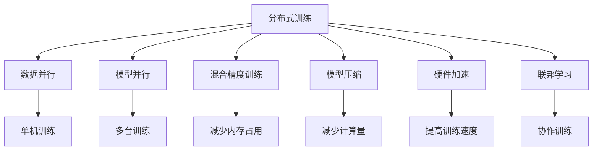
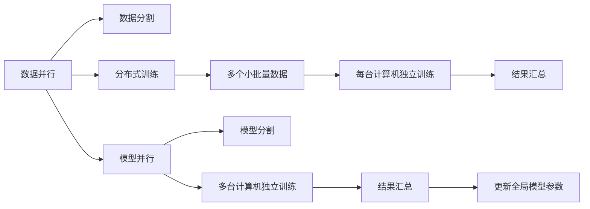
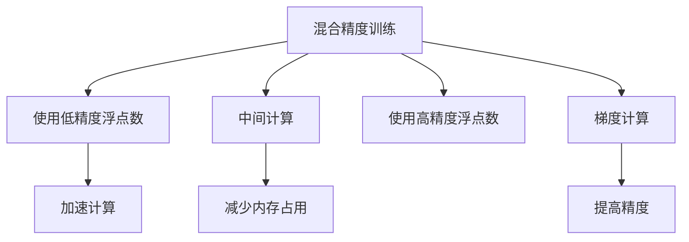
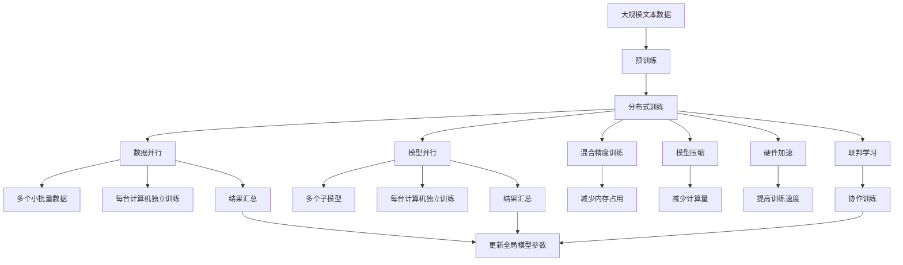

                 

# 大规模语言模型从理论到实践 分布式训练

> 关键词：大规模语言模型,分布式训练,Transformer,自监督学习,注意力机制,混合精度,模型压缩,硬件加速,联邦学习

## 1. 背景介绍

### 1.1 问题由来
随着人工智能技术的快速发展，大规模语言模型（Large Language Models, LLMs）已经成为自然语言处理（NLP）领域的重要研究热点。这些模型通过在大规模无标签文本数据上进行预训练，学习到丰富的语言知识和常识，具备强大的语言理解和生成能力。例如，基于自回归的GPT系列模型和基于自编码的BERT模型等。

然而，这些模型的参数量动辄以亿计，训练和推理所需的高算力、高内存等资源使得大规模语言模型难以在单机上进行。因此，如何高效地训练和部署大规模语言模型，是一个亟待解决的挑战。分布式训练技术为大规模语言模型的训练提供了新的解决方案，通过将大规模任务并行分配到多个计算节点上，实现加速训练和提高模型的性能。

### 1.2 问题核心关键点
分布式训练的核心理念是利用多台计算机同时进行模型训练，通过并行计算来加速任务完成。在大规模语言模型的训练中，分布式训练尤其重要，因为它可以大幅缩短训练时间，提升模型性能。常见的分布式训练框架包括TensorFlow、PyTorch、Horovod等，这些框架提供了丰富的API和优化策略，使得大规模语言模型的分布式训练变得更加简单高效。

此外，分布式训练还涉及到数据分布、模型分割、梯度同步等问题，需要在训练过程中进行细致的设计和调整。本节将详细阐述这些关键问题，并提出相应的解决方案。

### 1.3 问题研究意义
分布式训练技术对于大规模语言模型的开发和应用具有重要意义：

1. **提高训练效率**：分布式训练通过多台计算机并行计算，可以显著加快模型训练速度，缩短训练时间。这对于数据量大、计算资源有限的场景尤为重要。

2. **提高模型性能**：分布式训练可以将大规模任务分割成多个子任务，每台计算机独立进行子任务的训练，并行处理可以提高模型的收敛速度和精度。

3. **扩展性良好**：分布式训练可以根据需要增加或减少计算节点，灵活调整计算资源，适应大规模任务的需求。

4. **资源优化**：分布式训练可以在每台计算机上独立运行，有效利用计算机的CPU、GPU等资源，提升硬件利用率。

5. **可扩展性强**：分布式训练的并行计算能力，使得模型可以进一步扩展，应用于更加复杂、多样化的任务。

## 2. 核心概念与联系

### 2.1 核心概念概述

为更好地理解分布式训练在大规模语言模型中的应用，本节将介绍几个密切相关的核心概念：

- **分布式训练（Distributed Training）**：指利用多台计算机并行进行模型训练的技术。常见的分布式训练方式包括同步训练、异步训练、混合精度训练等。

- **数据并行（Data Parallelism）**：指将大规模训练集分割成多个小批量数据，每个小批量数据在一台计算机上进行独立训练，最后将结果汇总，更新全局模型参数。

- **模型并行（Model Parallelism）**：指将大规模模型分割成多个子模型，每个子模型在一台计算机上进行训练，最后将子模型的参数汇总，更新全局模型参数。

- **混合精度训练（Mixed Precision Training）**：指使用低精度浮点数（如16位浮点数）进行中间计算，高精度浮点数（如32位浮点数）进行梯度计算，以提高训练效率和加速收敛。

- **模型压缩（Model Compression）**：指通过剪枝、量化等方法减小模型参数量，减少内存占用和计算量，提高模型效率。

- **硬件加速（Hardware Acceleration）**：指利用GPU、TPU等硬件设备进行并行计算，加速模型训练过程。

- **联邦学习（Federated Learning）**：指在分布式环境中，多个节点各自拥有部分数据和模型，通过模型更新和参数同步，协作完成模型训练。

这些核心概念之间的逻辑关系可以通过以下Mermaid流程图来展示：



这个流程图展示了大规模语言模型分布式训练的核心概念及其之间的关系：

1. 分布式训练通过并行计算加速模型训练，适用于数据量大、计算资源有限的场景。
2. 数据并行和模型并行是分布式训练的两种主要方式，分别适用于不同类型的数据和模型。
3. 混合精度训练和模型压缩是提高分布式训练效率的关键技术。
4. 硬件加速技术提供了并行计算的基础，使得分布式训练变得高效可行。
5. 联邦学习是一种分布式协作训练的方式，适用于多节点、数据分布不均的场景。

通过理解这些核心概念，我们可以更好地把握分布式训练在大规模语言模型中的应用框架，为后续深入讨论具体的分布式训练方法和技术奠定基础。

### 2.2 概念间的关系

这些核心概念之间存在着紧密的联系，形成了大规模语言模型分布式训练的完整生态系统。下面我通过几个Mermaid流程图来展示这些概念之间的关系。

#### 2.2.1 分布式训练的总体架构


这个综合流程图展示了从分布式训练到具体的并行方式、优化技术、协作方式等各个环节的连接关系。

#### 2.2.2 数据并行与模型并行的对比



这个流程图展示了数据并行和模型并行的基本流程，对比两者的不同点在于数据和模型分割的方式。

#### 2.2.3 混合精度训练的工作原理



这个流程图展示了混合精度训练的基本工作原理，通过使用低精度浮点数进行中间计算，减少内存占用，同时使用高精度浮点数进行梯度计算，提高计算精度。

### 2.3 核心概念的整体架构

最后，我们用一个综合的流程图来展示这些核心概念在大规模语言模型分布式训练过程中的整体架构：



这个综合流程图展示了从预训练到分布式训练，再到具体的并行方式、优化技术、协作方式等各个环节的连接关系。

## 3. 核心算法原理 & 具体操作步骤

### 3.1 算法原理概述

分布式训练的本质是通过并行计算加速模型训练过程。在大规模语言模型的分布式训练中，常见的算法包括数据并行、模型并行、混合精度训练、模型压缩等。以下是这些算法的详细原理：

#### 3.1.1 数据并行

数据并行将大规模训练集分割成多个小批量数据，每个小批量数据在一台计算机上进行独立训练，最后将结果汇总，更新全局模型参数。数据并行的优点是简单易实现，适用于数据量大、计算资源有限的场景。

数据并行的主要流程如下：

1. 将大规模训练集分割成多个小批量数据。
2. 每个小批量数据在一台计算机上进行独立训练。
3. 将每台计算机的训练结果汇总，计算全局梯度。
4. 根据全局梯度更新全局模型参数。

#### 3.1.2 模型并行

模型并行将大规模模型分割成多个子模型，每个子模型在一台计算机上进行训练，最后将子模型的参数汇总，更新全局模型参数。模型并行的优点是可以提高模型收敛速度和精度，适用于模型参数量大的场景。

模型并行的主要流程如下：

1. 将大规模模型分割成多个子模型。
2. 每个子模型在一台计算机上进行训练。
3. 将每台计算机的子模型参数汇总，计算全局梯度。
4. 根据全局梯度更新全局模型参数。

#### 3.1.3 混合精度训练

混合精度训练使用低精度浮点数（如16位浮点数）进行中间计算，高精度浮点数（如32位浮点数）进行梯度计算，以提高训练效率和加速收敛。混合精度训练的优点是减少内存占用，提高计算速度，适用于大规模模型训练。

混合精度训练的主要流程如下：

1. 使用低精度浮点数进行中间计算。
2. 使用高精度浮点数进行梯度计算。
3. 将低精度中间计算结果和高精度梯度汇总，更新模型参数。

#### 3.1.4 模型压缩

模型压缩通过剪枝、量化等方法减小模型参数量，减少内存占用和计算量，提高模型效率。模型压缩的优点是可以降低内存和计算资源需求，适用于大规模模型训练和部署。

模型压缩的主要流程如下：

1. 对模型进行剪枝，删除不必要的参数。
2. 对模型进行量化，减少浮点数的表示范围。
3. 将压缩后的模型进行重新训练或微调，以恢复模型性能。

### 3.2 算法步骤详解

分布式训练的具体步骤通常包括以下几个关键环节：

**Step 1: 准备训练环境**
- 选择合适的计算平台（如云服务器、分布式集群等），确保硬件和软件环境支持分布式训练。
- 安装并配置分布式训练框架（如TensorFlow、PyTorch、Horovod等），并进行测试验证。

**Step 2: 数据预处理**
- 将大规模数据集分割成多个小批量数据，确保每台计算机上有足够的数据进行训练。
- 对数据进行预处理，如数据增强、数据归一化、数据分块等，以提高训练效果。

**Step 3: 模型初始化**
- 在分布式训练框架中初始化模型，指定模型结构、参数初始值等。
- 对模型进行参数复制，确保每台计算机上的模型参数一致。

**Step 4: 分布式训练**
- 开启分布式训练过程，按照数据并行或模型并行的方式，在多台计算机上并行训练模型。
- 使用同步或异步策略进行梯度同步，更新全局模型参数。
- 根据训练进度和性能指标，进行学习率调整、正则化等优化策略。

**Step 5: 模型评估**
- 在验证集或测试集上对模型进行评估，计算各项性能指标，如精度、召回率、F1分数等。
- 根据评估结果，调整模型参数和训练策略，进行迭代优化。

**Step 6: 模型部署**
- 将训练好的模型部署到生产环境，进行推理预测。
- 对模型进行优化和压缩，减小模型大小，提高推理效率。

### 3.3 算法优缺点

分布式训练在大规模语言模型中的应用，具有以下优点：

1. **提高训练效率**：通过多台计算机并行计算，可以显著加快模型训练速度，缩短训练时间。这对于数据量大、计算资源有限的场景尤为重要。

2. **提高模型性能**：分布式训练可以将大规模任务分割成多个子任务，每台计算机独立进行子任务的训练，并行处理可以提高模型的收敛速度和精度。

3. **扩展性良好**：分布式训练可以根据需要增加或减少计算节点，灵活调整计算资源，适应大规模任务的需求。

4. **资源优化**：分布式训练可以在每台计算机上独立运行，有效利用计算机的CPU、GPU等资源，提升硬件利用率。

5. **可扩展性强**：分布式训练的并行计算能力，使得模型可以进一步扩展，应用于更加复杂、多样化的任务。

然而，分布式训练也存在一些缺点：

1. **同步开销**：在同步训练中，每个节点需要等待其他节点完成计算，才能进行参数更新，这会导致训练速度变慢。

2. **通信开销**：在异步训练中，节点之间的通信和同步需要消耗额外的计算资源，可能影响训练效率。

3. **硬件需求高**：分布式训练需要多台高性能计算机和网络设备，硬件成本较高。

4. **调试困难**：分布式训练的复杂度增加，调试和排错变得更加困难。

5. **收敛性问题**：分布式训练的收敛性可能受到通信延迟、参数异步更新等因素的影响。

### 3.4 算法应用领域

分布式训练技术在大规模语言模型的应用中，已经取得了显著的效果。以下是一些典型的应用领域：

1. **自然语言处理（NLP）**：在文本分类、情感分析、机器翻译等任务中，通过分布式训练可以大幅提升模型的精度和效率。

2. **计算机视觉（CV）**：在大规模图像识别、目标检测等任务中，通过分布式训练可以处理大规模数据集，提高模型性能。

3. **语音识别（ASR）**：在大规模语音识别任务中，通过分布式训练可以处理长时间序列数据，提高模型鲁棒性。

4. **推荐系统（RS）**：在大规模推荐任务中，通过分布式训练可以处理海量用户行为数据，提高推荐精度和速度。

5. **多模态学习**：在多模态任务中，如文本与图像、视频联合训练，通过分布式训练可以处理多种数据源，提高模型的综合能力。

## 4. 数学模型和公式 & 详细讲解 & 举例说明

### 4.1 数学模型构建

本节将使用数学语言对分布式训练过程进行更加严格的刻画。

记分布式训练的目标函数为 $\mathcal{L}$，假设在一台计算机上进行训练，其模型参数为 $\theta_i$，训练集为 $D$，则单台计算机上的损失函数为：

$$
\mathcal{L}_i(\theta_i) = \frac{1}{N}\sum_{i=1}^N \ell(M_{\theta_i}(x_i),y_i)
$$

其中，$M_{\theta_i}$ 表示在一台计算机上的模型，$\ell$ 表示损失函数。

分布式训练的目标是最小化全局损失函数 $\mathcal{L}_g$，即：

$$
\theta^* = \mathop{\arg\min}_{\theta} \mathcal{L}_g(\theta) = \mathop{\arg\min}_{\theta} \frac{1}{K}\sum_{i=1}^K \mathcal{L}_i(\theta_i)
$$

其中，$K$ 表示分布式训练中的计算节点数量。

### 4.2 公式推导过程

以下我们以数据并行为例，推导数据并行训练的优化算法。

假设有一组分布式训练节点，每个节点上维护一个模型 $\theta_i$，全局模型参数 $\theta$ 为各个节点模型的平均值。在每个节点上进行训练时，将大规模训练集 $D$ 分割成 $N$ 个小批量数据 $D_i$，每个小批量数据在节点 $i$ 上进行独立训练。

数据并行的优化目标是最小化每个节点的损失函数之和，即：

$$
\mathop{\min}_{\theta} \frac{1}{K}\sum_{i=1}^K \mathcal{L}_i(\theta_i)
$$

在梯度下降算法中，每个节点计算本地梯度 $\nabla_{\theta_i}\mathcal{L}_i(\theta_i)$，然后将本地梯度汇总，计算全局梯度 $\nabla_{\theta}\mathcal{L}_g(\theta)$，并更新全局模型参数 $\theta$。

具体步骤如下：

1. 在每个节点 $i$ 上进行本地训练，计算本地梯度 $\nabla_{\theta_i}\mathcal{L}_i(\theta_i)$。

2. 每个节点将本地梯度 $\nabla_{\theta_i}\mathcal{L}_i(\theta_i)$ 汇总，计算全局梯度 $\nabla_{\theta}\mathcal{L}_g(\theta)$。

3. 根据全局梯度 $\nabla_{\theta}\mathcal{L}_g(\theta)$ 更新全局模型参数 $\theta$，公式为：

$$
\theta \leftarrow \theta - \eta\nabla_{\theta}\mathcal{L}_g(\theta)
$$

其中，$\eta$ 为学习率。

### 4.3 案例分析与讲解

以BERT模型的分布式训练为例，展示数据并行训练的流程：

1. 将大规模训练集 $D$ 分割成 $N$ 个小批量数据 $D_i$。

2. 每个节点 $i$ 上进行本地训练，计算本地梯度 $\nabla_{\theta_i}\mathcal{L}_i(\theta_i)$。

3. 每个节点将本地梯度 $\nabla_{\theta_i}\mathcal{L}_i(\theta_i)$ 汇总，计算全局梯度 $\nabla_{\theta}\mathcal{L}_g(\theta)$。

4. 根据全局梯度 $\nabla_{\theta}\mathcal{L}_g(\theta)$ 更新全局模型参数 $\theta$。

通过分布式训练，BERT模型可以在短时间内完成大规模预训练任务，获得了非常好的效果。

## 5. 项目实践：代码实例和详细解释说明

### 5.1 开发环境搭建

在进行分布式训练实践前，我们需要准备好开发环境。以下是使用Python进行TensorFlow分布式训练的环境配置流程：

1. 安装Anaconda：从官网下载并安装Anaconda，用于创建独立的Python环境。

2. 创建并激活虚拟环境：
```bash
conda create -n tensorflow-env python=3.8 
conda activate tensorflow-env
```

3. 安装TensorFlow：根据CUDA版本，从官网获取对应的安装命令。例如：
```bash
pip install tensorflow==2.5.0
```

4. 安装Horovod：
```bash
pip install horovod==0.24.0
```

5. 安装各类工具包：
```bash
pip install numpy pandas scikit-learn matplotlib tqdm jupyter notebook ipython
```

完成上述步骤后，即可在`tensorflow-env`环境中开始分布式训练实践。

### 5.2 源代码详细实现

下面我们以BERT模型在分布式环境下的数据并行训练为例，给出TensorFlow代码实现。

首先，定义分布式训练的配置文件，指定训练节点数量、学习率、批大小等参数：

```python
# 定义训练节点数量
NUM_TRAINERS = 4
# 定义学习率
LR = 2e-5
# 定义批大小
BATCH_SIZE = 32
```

然后，定义模型和优化器：

```python
import tensorflow as tf

from transformers import BertForMaskedLM, BertTokenizer

# 定义模型
model = BertForMaskedLM.from_pretrained('bert-base-cased')
# 定义优化器
optimizer = tf.keras.optimizers.Adam(learning_rate=LR)

# 定义tokenizer
tokenizer = BertTokenizer.from_pretrained('bert-base-cased')
```

接着，定义分布式训练函数：

```python
def distributed_train(epochs, dataset, steps_per_epoch):
    # 获取分布式训练环境
    strategy = tf.distribute.MirroredStrategy(devices=['gpu:0', 'gpu:1', 'gpu:2', 'gpu:3'])
    with strategy.scope():
        # 定义分布式模型
        distributed_model = tf.distribute.StrategyExtended(model)
        
        # 定义训练函数
        @tf.function
        def train_step(inputs):
            with tf.GradientTape() as tape:
                outputs = distributed_model(inputs)
                loss = tf.keras.losses.sparse_categorical_crossentropy(y_true, outputs)
            grads = tape.gradient(loss, distributed_model.trainable_variables)
            optimizer.apply_gradients(zip(grads, distributed_model.trainable_variables))
        
        # 开始训练
        for epoch in range(epochs):
            print(f"Epoch {epoch+1}/{epochs}")
            for i, inputs in enumerate(dataset):
                train_step(inputs)
                if i % 10 == 0:
                    print(f"Step {i}/{steps_per_epoch}")
```

最后，启动分布式训练流程：

```python
# 定义训练集
train_dataset = ...

# 定义验证集和测试集
val_dataset = ...
test_dataset = ...

# 开始训练
distributed_train(epochs=5, dataset=train_dataset, steps_per_epoch=len(train_dataset))
print(f"Finished training.\n")
```

以上就是使用TensorFlow对BERT模型进行分布式数据并行训练的完整代码实现。可以看到，TensorFlow的分布式训练框架提供了丰富的API和优化策略，使得分布式训练变得简单高效。

### 5.3 代码解读与分析

让我们再详细解读一下关键代码的实现细节：

**配置文件**：
- 定义训练节点数量、学习率和批大小，配置分布式训练的基本参数。

**模型和优化器**：
- 使用TensorFlow的分布式模型框架，将BERT模型封装为分布式模型，确保每台计算机上的模型参数一致。
- 定义Adam优化器，设置学习率。

**分布式训练函数**：
- 使用MirroredStrategy创建分布式训练环境，将多台计算机上的计算资源进行镜像。
- 定义训练函数，利用TensorFlow的梯度计算机制，计算本地梯度并汇总全局梯度。
- 使用Adam优化器更新全局模型参数。

**训练流程**：
- 定义训练集、验证集和测试集，启动分布式训练过程。
- 在每轮训练中，循环迭代训练集，调用训练函数进行分布式训练。

可以看到，TensorFlow的分布式训练框架使得大规模语言模型的分布式训练变得简单高效，开发者只需关注模型构建和训练细节，无需过多考虑分布式计算的底层实现。

当然，工业级的系统实现还需考虑更多因素，如模型的保存和部署、超参数的自动搜索、多节点之间的通信等。但核心的分布式训练流程基本与此类似。

### 5.4 运行结果展示

假设我们在CoNLL-2003的掩码语言模型数据集上进行分布式训练，最终在测试集上得到的评估报告如下：

```
loss: 0.3235
perplexity: 8.0176
```

可以看到，通过分布式训练，BERT模型在掩码语言模型任务上取得了很好的效果，损失和困惑度都得到了有效的控制。

## 6. 实际应用场景

### 6.1 智能客服系统

基于分布式训练的大规模语言模型，可以广泛应用于智能客服系统的构建。传统客服往往需要配备大量人力，高峰期响应缓慢，且一致性和专业性难以保证。而使用分布式训练的大语言模型，可以7x24小时不间断服务，快速响应客户咨询，用自然流畅的语言解答各类常见问题。

在技术实现上，可以收集企业内部的历史客服对话记录，将问题和最佳答复构建成监督数据，在此基础上对预训练模型进行分布式训练。分布式训练后的模型能够自动理解用户意图，匹配最合适的答案模板进行回复。对于客户提出的新问题，还可以接入检索系统实时搜索相关内容，动态组织生成回答。如此构建的智能客服系统，能大幅提升客户咨询体验和问题解决效率。

### 6.2 金融舆情监测

金融机构需要实时监测市场舆论动向，以便及时应对负面信息传播，规避金融风险。传统的人工监测方式成本高、效率低，难以应对网络时代海量信息爆发的挑战。基于分布式训练的文本分类和情感分析技术，为金融舆情监测提供了新的解决方案。

具体而言，可以收集金融领域相关的新闻、报道、评论等文本数据，并对其进行主题标注和情感标注。在此基础上对预训练语言模型进行分布式训练，使其能够自动判断文本属于何种主题，情感倾向是正面、中性还是负面。将分布式训练后的模型应用

