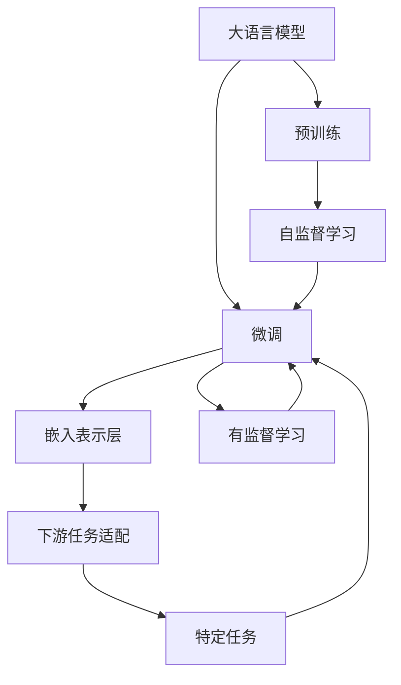
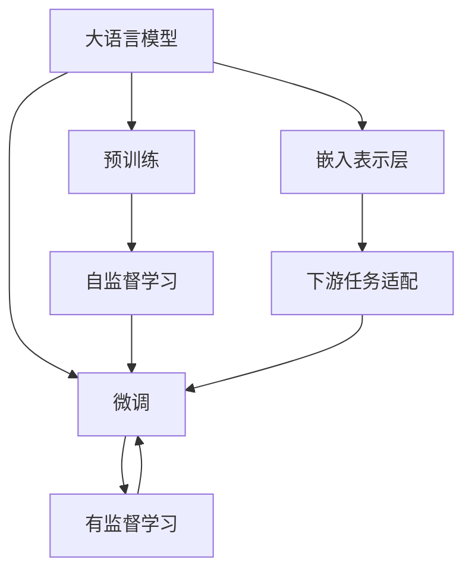
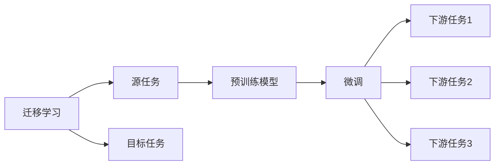
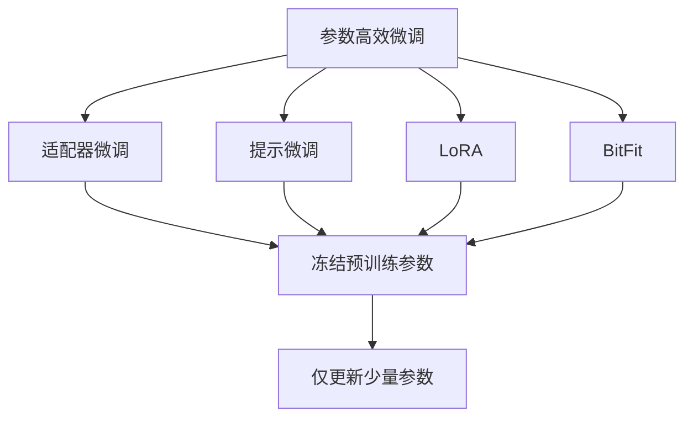
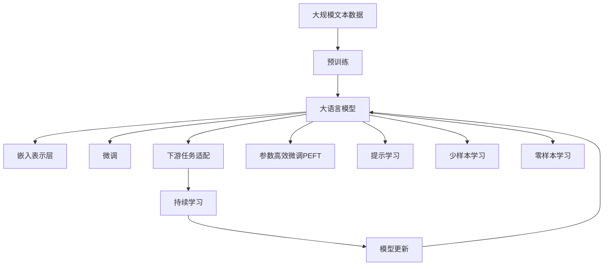

                 

# 大规模语言模型从理论到实践 嵌入表示层

> 关键词：大规模语言模型,嵌入表示层,深度学习,神经网络,自然语言处理(NLP),预训练,Transformer,Transformer-XL,BERT,自监督学习,语言建模,向量空间

## 1. 背景介绍

### 1.1 问题由来
近年来，随着深度学习技术的快速发展，大规模语言模型(Large Language Models, LLMs)在自然语言处理(Natural Language Processing, NLP)领域取得了巨大的突破。这些大语言模型通过在大规模无标签文本语料上进行预训练，学习到了丰富的语言知识和常识，可以通过少量的有标签样本在下游任务上进行微调，获得优异的性能。其中最具代表性的大语言模型包括OpenAI的GPT系列模型、Google的BERT、T5等。

然而，由于预训练语料的广泛性和泛化能力的不足，这些通用的大语言模型在特定领域应用时，效果往往难以达到实际应用的要求。因此，如何针对特定任务进行大模型微调，提升模型性能，成为了当前大语言模型研究和应用的一个热点问题。本文聚焦于如何在大语言模型中嵌入新的表示层，以提升其在特定领域的性能，为后续深入讨论具体的嵌入表示层的方法和技术奠定基础。

### 1.2 问题核心关键点
目前，在大语言模型中嵌入新的表示层的方法主要是通过微调(Fine-tuning)来实现。具体而言，将预训练模型作为初始化参数，通过在有标签的监督数据上进行微调，添加新的表示层，以增强模型在特定领域的性能。这些方法包括在模型顶层添加新的全连接层、卷积层、注意力机制等，来构建新的子空间，捕捉特定领域的特征。

微调的核心在于避免过拟合，同时最大程度发挥预训练模型学到的知识。目前主流的做法包括：

- 选择合适的学习率。相比从头训练，微调通常需要更小的学习率，以免破坏预训练的权重。
- 应用正则化技术。如L2正则、Dropout、Early Stopping等，防止模型过度适应小规模训练集。
- 保留预训练的部分层。如Transformer的底层，只微调顶层，减少需优化的参数。
- 数据增强。通过对训练样本改写、回译等方式丰富训练集多样性。
- 对抗训练。加入对抗样本，提高模型鲁棒性。
- Prompt Learning。通过在输入文本中添加提示模板(Prompt Template)，引导模型按期望方式输出，减少微调参数。

这些方法可以显著提升模型在特定领域的应用效果，但同时也存在一定的局限性：

1. 依赖标注数据。微调的效果很大程度上取决于标注数据的质量和数量，获取高质量标注数据的成本较高。
2. 迁移能力有限。当目标任务与预训练数据的分布差异较大时，微调的性能提升有限。
3. 负面效果传递。预训练模型的固有偏见、有害信息等，可能通过微调传递到下游任务，造成负面影响。
4. 可解释性不足。微调模型的决策过程通常缺乏可解释性，难以对其推理逻辑进行分析和调试。

尽管存在这些局限性，但就目前而言，基于微调的方法仍是大语言模型应用的主流范式。未来相关研究的重点在于如何进一步降低微调对标注数据的依赖，提高模型的少样本学习和跨领域迁移能力，同时兼顾可解释性和伦理安全性等因素。

### 1.3 问题研究意义
研究在大语言模型中嵌入新的表示层，对于拓展大模型的应用范围，提升下游任务的性能，加速NLP技术的产业化进程，具有重要意义：

1. 降低应用开发成本。基于成熟的大模型进行微调，可以显著减少从头开发所需的数据、计算和人力等成本投入。
2. 提升模型效果。微调使得通用大模型更好地适应特定领域，在应用场景中取得更优表现。
3. 加速开发进度。standing on the shoulders of giants，微调使得开发者可以更快地完成任务适配，缩短开发周期。
4. 带来技术创新。微调范式促进了对预训练-微调的深入研究，催生了提示学习、少样本学习等新的研究方向。
5. 赋能产业升级。微调使得NLP技术更容易被各行各业所采用，为传统行业数字化转型升级提供新的技术路径。

## 2. 核心概念与联系

### 2.1 核心概念概述

为更好地理解在大语言模型中嵌入新的表示层的方法，本节将介绍几个密切相关的核心概念：

- 大语言模型(Large Language Model, LLM)：以自回归(如GPT)或自编码(如BERT)模型为代表的大规模预训练语言模型。通过在大规模无标签文本语料上进行预训练，学习通用的语言表示，具备强大的语言理解和生成能力。

- 预训练(Pre-training)：指在大规模无标签文本语料上，通过自监督学习任务训练通用语言模型的过程。常见的预训练任务包括言语建模、遮挡语言模型等。预训练使得模型学习到语言的通用表示。

- 微调(Fine-tuning)：指在预训练模型的基础上，使用下游任务的少量标注数据，通过有监督学习优化模型在特定任务上的性能。通常只需要调整顶层分类器或解码器，并以较小的学习率更新全部或部分的模型参数。

- 迁移学习(Transfer Learning)：指将一个领域学习到的知识，迁移应用到另一个不同但相关的领域的学习范式。大模型的预训练-微调过程即是一种典型的迁移学习方式。

- 嵌入表示层(Embedding Layer)：指在大语言模型中添加一个或多个新的嵌入层，将特定领域的特征映射到新的向量空间中。

- 向量空间(Embedding Space)：指在嵌入表示层中使用映射矩阵将输入转化为向量，形成的低维空间。

这些核心概念之间的逻辑关系可以通过以下Mermaid流程图来展示：



这个流程图展示了大语言模型的核心概念及其之间的关系：

1. 大语言模型通过预训练获得基础能力。
2. 微调是对预训练模型进行任务特定的优化，可以分为全参数微调和参数高效微调（PEFT）。
3. 嵌入表示层是在微调过程中，添加新的映射层，将特定领域的特征映射到新的向量空间中。
4. 下游任务适配是微调后模型在下游任务上的表现。

这些概念共同构成了大语言模型的学习和应用框架，使其能够在各种场景下发挥强大的语言理解和生成能力。通过理解这些核心概念，我们可以更好地把握大语言模型的工作原理和优化方向。

### 2.2 概念间的关系

这些核心概念之间存在着紧密的联系，形成了大语言模型嵌入表示层的完整生态系统。下面我们通过几个Mermaid流程图来展示这些概念之间的关系。

#### 2.2.1 大语言模型的学习范式



这个流程图展示了大语言模型的三种主要学习范式：预训练、微调和嵌入表示层。预训练主要采用自监督学习方法，而微调则是有监督学习的过程。嵌入表示层是在微调过程中添加新的映射层，使得模型能够适应新的下游任务。

#### 2.2.2 迁移学习与微调的关系



这个流程图展示了迁移学习的基本原理，以及它与微调的关系。迁移学习涉及源任务和目标任务，预训练模型在源任务上学习，然后通过微调适应各种下游任务（目标任务）。

#### 2.2.3 参数高效微调方法



这个流程图展示了几种常见的参数高效微调方法，包括适配器微调、提示微调、LoRA和BitFit。这些方法的共同特点是冻结大部分预训练参数，只更新少量参数，从而提高微调效率。

#### 2.2.4 嵌入表示层在大语言模型中的应用



这个综合流程图展示了从预训练到嵌入表示层，再到微调、下游任务适配的完整过程。大语言模型首先在大规模文本数据上进行预训练，然后通过嵌入表示层添加新的映射层，微调模型，使其能够适应新的下游任务。最后，通过持续学习技术，模型可以不断更新和适应新的任务和数据。 通过这些流程图，我们可以更清晰地理解大语言模型嵌入表示层过程中各个核心概念的关系和作用，为后续深入讨论具体的嵌入表示层的方法和技术奠定基础。

## 3. 核心算法原理 & 具体操作步骤
### 3.1 算法原理概述

在大语言模型中嵌入新的表示层，本质上是一个在特定领域内的自监督学习过程。其核心思想是：将预训练模型作为初始化参数，通过在特定领域的数据上进行有监督的微调，添加新的映射层，将输入数据映射到新的向量空间中。

形式化地，假设预训练模型为 $M_{\theta}$，其中 $\theta$ 为预训练得到的模型参数。给定特定领域的标注数据集 $D=\{(x_i, y_i)\}_{i=1}^N$，其中 $x_i$ 为输入文本，$y_i$ 为任务标签。嵌入表示层的目标是最小化模型在特定领域上的损失函数，即：

$$
\hat{\theta}=\mathop{\arg\min}_{\theta} \mathcal{L}(M_{\theta},D)
$$

其中 $\mathcal{L}$ 为针对特定领域的损失函数，用于衡量模型输出与真实标签之间的差异。常见的损失函数包括交叉熵损失、均方误差损失等。

通过梯度下降等优化算法，嵌入表示层的微调过程不断更新模型参数 $\theta$，最小化损失函数 $\mathcal{L}$，使得模型输出逼近真实标签。由于 $\theta$ 已经通过预训练获得了较好的初始化，因此即便在特定领域的小规模数据集上进行微调，也能较快收敛到理想的模型参数 $\hat{\theta}$。

### 3.2 算法步骤详解

大语言模型嵌入新的表示层的微调过程一般包括以下几个关键步骤：

**Step 1: 准备预训练模型和数据集**
- 选择合适的预训练语言模型 $M_{\theta}$ 作为初始化参数，如 BERT、GPT等。
- 准备特定领域的标注数据集 $D$，划分为训练集、验证集和测试集。一般要求标注数据与预训练数据的分布不要差异过大。

**Step 2: 添加任务适配层**
- 根据特定任务，在预训练模型顶层设计合适的输出层和损失函数。
- 对于分类任务，通常在顶层添加线性分类器和交叉熵损失函数。
- 对于生成任务，通常使用语言模型的解码器输出概率分布，并以负对数似然为损失函数。

**Step 3: 设置微调超参数**
- 选择合适的优化算法及其参数，如 AdamW、SGD 等，设置学习率、批大小、迭代轮数等。
- 设置正则化技术及强度，包括权重衰减、Dropout、Early Stopping等。
- 确定冻结预训练参数的策略，如仅微调顶层，或全部参数都参与微调。

**Step 4: 执行梯度训练**
- 将训练集数据分批次输入模型，前向传播计算损失函数。
- 反向传播计算参数梯度，根据设定的优化算法和学习率更新模型参数。
- 周期性在验证集上评估模型性能，根据性能指标决定是否触发 Early Stopping。
- 重复上述步骤直到满足预设的迭代轮数或 Early Stopping 条件。

**Step 5: 测试和部署**
- 在测试集上评估嵌入表示层后的模型 $M_{\hat{\theta}}$ 的性能，对比微调前后的精度提升。
- 使用嵌入表示层后的模型对新样本进行推理预测，集成到实际的应用系统中。
- 持续收集新的数据，定期重新微调模型，以适应数据分布的变化。

以上是嵌入表示层在大语言模型中的微调过程的一般流程。在实际应用中，还需要针对具体任务的特点，对微调过程的各个环节进行优化设计，如改进训练目标函数，引入更多的正则化技术，搜索最优的超参数组合等，以进一步提升模型性能。

### 3.3 算法优缺点

嵌入表示层在大语言模型中的微调方法具有以下优点：

1. 快速提升模型性能。通过添加新的映射层，可以在少量标注数据上快速提升模型在特定领域的表现。
2. 模型泛化能力强。嵌入表示层可以增强模型对特定领域的理解和建模能力，提升模型的泛化性能。
3. 可解释性强。嵌入表示层提供了一种新的视角，帮助理解模型对输入数据的映射关系，提高模型的可解释性。

同时，该方法也存在一定的局限性：

1. 依赖标注数据。嵌入表示层的微调效果很大程度上取决于标注数据的质量和数量，获取高质量标注数据的成本较高。
2. 迁移能力有限。当目标领域与预训练数据的分布差异较大时，嵌入表示层的性能提升有限。
3. 模型复杂度高。嵌入表示层的微调通常需要增加新的映射层，增加模型复杂度，可能导致过拟合。
4. 学习曲线陡峭。嵌入表示层的微调可能需要在特定领域的大量数据上逐步迭代优化，学习曲线较陡峭。

尽管存在这些局限性，但就目前而言，嵌入表示层仍是提高大语言模型在特定领域性能的有效手段。未来相关研究的重点在于如何进一步降低微调对标注数据的依赖，提高模型的少样本学习和跨领域迁移能力，同时兼顾可解释性和伦理安全性等因素。

### 3.4 算法应用领域

嵌入表示层在大语言模型中的应用已经覆盖了多个领域，包括但不限于：

- 文本分类：如情感分析、主题分类、意图识别等。通过微调使模型学习文本-标签映射。
- 命名实体识别：识别文本中的人名、地名、机构名等特定实体。通过微调使模型掌握实体边界和类型。
- 关系抽取：从文本中抽取实体之间的语义关系。通过微调使模型学习实体-关系三元组。
- 问答系统：对自然语言问题给出答案。将问题-答案对作为微调数据，训练模型学习匹配答案。
- 机器翻译：将源语言文本翻译成目标语言。通过微调使模型学习语言-语言映射。
- 文本摘要：将长文本压缩成简短摘要。将文章-摘要对作为微调数据，使模型学习抓取要点。
- 对话系统：使机器能够与人自然对话。将多轮对话历史作为上下文，微调模型进行回复生成。

除了上述这些经典任务外，嵌入表示层还被创新性地应用到更多场景中，如可控文本生成、常识推理、代码生成、数据增强等，为NLP技术带来了全新的突破。随着预训练模型和嵌入表示层方法的不断进步，相信NLP技术将在更广阔的应用领域大放异彩。

## 4. 数学模型和公式 & 详细讲解  
### 4.1 数学模型构建

本节将使用数学语言对在大语言模型中嵌入新的表示层的过程进行更加严格的刻画。

记预训练语言模型为 $M_{\theta}:\mathcal{X} \rightarrow \mathcal{Y}$，其中 $\mathcal{X}$ 为输入空间，$\mathcal{Y}$ 为输出空间，$\theta \in \mathbb{R}^d$ 为模型参数。假设特定领域的标注数据集为 $D=\{(x_i, y_i)\}_{i=1}^N, x_i \in \mathcal{X}, y_i \in \mathcal{Y}$。

定义模型 $M_{\theta}$ 在输入 $x$ 上的输出为 $\hat{y}=M_{\theta}(x)$，即模型对输入 $x$ 的预测。嵌入表示层的目标是在输入空间 $\mathcal{X}$ 上添加一个映射函数 $f_{\phi}$，使得新的表示空间 $\mathcal{E}$ 满足：

$$
\mathcal{E} = \{f_{\phi}(x)|x \in \mathcal{X}\}
$$

其中 $\phi$ 为新的映射函数参数。嵌入表示层通常通过添加一个全连接层、卷积层、注意力机制等来实现。以全连接层为例，嵌入表示层的数学模型可表示为：

$$
\mathcal{E} = \{\sigma(W_{\phi}x+b_{\phi})|x \in \mathcal{X}\}
$$

其中 $W_{\phi}$ 和 $b_{\phi}$ 为全连接层的权重和偏置参数，$\sigma$ 为激活函数。

嵌入表示层的损失函数定义为：

$$
\mathcal{L}_{emb}(\phi) = \frac{1}{N}\sum_{i=1}^N \ell(M_{\theta \circ f_{\phi}}(x_i),y_i)
$$

其中 $\ell$ 为针对特定领域的损失函数，$M_{\theta \circ f_{\phi}}(x)$ 表示在嵌入表示层后的模型输出。

### 4.2 公式推导过程

以下我们以二分类任务为例，推导交叉熵损失函数及其梯度的计算公式。

假设模型 $M_{\theta}$ 在输入 $x$ 上的输出为 $\hat{y}=M_{\theta}(x)$，表示样本属于正类的概率。真实标签 $y \in \{0,1\}$。嵌入表示层的目标是最小化损失函数 $\mathcal{L}_{emb}(\phi)$。

设嵌入表示层的参数为 $\phi$，在输入 $x$ 上得到的嵌入表示为 $f_{\phi}(x)$，则嵌入表示层的输出为 $M_{\theta}(f_{\phi}(x))$。二分类交叉熵损失函数定义为：

$$
\ell(M_{\theta}(f_{\phi}(x)),y) = -[y\log M_{\theta}(f_{\phi}(x)) + (1-y)\log(1-M_{\theta}(f_{\phi}(x)))
$$

将其代入损失函数公式，得：

$$
\mathcal{L}_{emb}(\phi) = -\frac{1}{N}\sum_{i=1}^N [y_i\log M_{\theta}(f_{\phi}(x_i))+(1-y_i)\log(1-M_{\theta}(f_{\phi}(x_i)))
$$

根据链式法则，损失函数对参数 $\phi$ 的梯度为：

$$
\frac{\partial \mathcal{L}_{emb}(\phi)}{\partial \phi} = -\frac{1}{N}\sum_{i=1}^N [\frac{y_i}{M_{\theta}(f_{\phi}(x_i))}-\frac{1-y_i}{1-M_{\theta}(f_{\phi}(x_i))} \frac{\partial f_{\phi}(x_i)}{\partial \phi}
$$

其中 $\frac{\partial f_{\phi}(x_i)}{\partial \phi}$ 可进一步递归展开，利用自动微分技术完成计算。

在得到损失函数的梯度后，即可带入参数更新公式，完成嵌入表示层的迭代优化。重复上述过程直至收敛，最终得到适应特定领域的最优模型参数 $\hat{\phi}$。

## 5. 项目实践：代码实例和详细解释说明
### 5.1 开发环境搭建

在进行嵌入表示层实践前，我们需要准备好开发环境。以下是使用Python进行PyTorch开发的环境配置流程：

1. 安装Anaconda：从官网下载并安装Anaconda，用于创建独立的Python环境。

2. 创建并激活虚拟环境：
```bash
conda create -n pytorch-env python=3.8 
conda activate pytorch-env
```

3. 安装PyTorch：根据CUDA版本，从官网获取对应的安装命令。例如：
```bash
conda install pytorch torchvision torchaudio cudatoolkit=11.1 -c pytorch -c conda-forge
```

4. 安装Transformers库：
```bash
pip install transformers
```

5. 安装各类工具包：
```bash
pip install numpy pandas scikit-learn matplotlib tqdm jupyter notebook ipython
```

完成上述步骤后，即可在`pytorch-env`环境中开始嵌入表示层的实践。

### 5.2 源代码详细实现

下面我们以命名实体识别(NER)任务为例，给出使用Transformers库对BERT模型进行嵌入表示层微调的PyTorch代码实现。

首先，定义NER任务的数据处理函数：

```python
from transformers import BertTokenizer
from torch.utils.data import Dataset
import torch

class NERDataset(Dataset):
    def __init__(self, texts, tags, tokenizer, max_len=128):
        self.texts = texts
        self.tags = tags
        self.tokenizer = tokenizer
        self.max_len = max_len
        
    def __len__(self):
        return len(self.texts)
    
    def __getitem__(self, item):
        text = self.texts[item]
        tags = self.tags[item]
        
        encoding = self.tokenizer(text, return_tensors='pt', max_length=self.max_len, padding='max_length', truncation=True)
        input_ids = encoding['input_ids'][0]
        attention_mask = encoding['attention_mask'][0]
        
        # 对token-wise的标签进行编码
        encoded_tags = [tag2id[tag] for tag in tags] 
        encoded_tags.extend([tag2id['O']] * (self.max_len - len(encoded_tags)))
        labels = torch.tensor(encoded_tags, dtype=torch.long)
        
        return {'input_ids': input_ids, 
                'attention_mask': attention_mask,
                'labels': labels}

# 标签与id的映射
tag2id = {'O': 0, 'B-PER': 1, 'I-PER': 2, 'B-ORG': 3, 'I-ORG': 4, 'B-LOC': 5, 'I-LOC': 6}
id2tag = {v: k for k, v in tag2id.items()}

# 创建dataset
tokenizer = BertTokenizer.from_pretrained('bert-base-cased')

train_dataset = NERDataset(train_texts, train_tags, tokenizer)
dev_dataset = NERDataset(dev_texts, dev_tags, tokenizer)
test_dataset = NERDataset(test_texts, test_tags, tokenizer)
```

然后，定义模型和优化器：

```python
from transformers import BertForTokenClassification, AdamW

model = BertForTokenClassification.from_pretrained('bert-base-cased', num_labels=len(tag2id))

# 添加嵌入表示层
embedding_dim = 8
model.add_module('embedding', nn.Linear(model.config.hidden_size, embedding_dim))

optimizer = AdamW(model.parameters(), lr=2e-5)
```

接着，定义训练和评估函数：

```python
from torch.utils.data import DataLoader
from tqdm import tqdm
from sklearn.metrics import classification_report

device = torch.device('cuda') if torch.cuda.is_available() else torch.device('cpu')
model.to(device)

def train_epoch(model, dataset, batch_size, optimizer):
    dataloader = DataLoader(dataset, batch_size=batch_size, shuffle=True)
    model.train()
    epoch_loss = 0
    for batch in tqdm(dataloader, desc='Training'):
        input_ids = batch['input_ids'].to(device)
        attention_mask = batch['attention_mask'].to(device)
        labels = batch['labels'].to(device)
        model.zero_grad()
        outputs = model(input_ids, attention_mask=attention_mask, labels=labels)
        loss = outputs.loss
        epoch_loss += loss.item()
        loss.backward()
        optimizer.step()
    return epoch_loss / len(dataloader)

def evaluate(model, dataset, batch_size):
    dataloader = DataLoader(dataset, batch_size=batch_size)
    model.eval()
    preds, labels = [], []
    with torch.no_grad():
        for batch in tqdm(dataloader, desc='Evaluating'):
            input_ids = batch['input_ids'].to(device)
            attention_mask = batch['attention_mask'].to(device)
            batch_labels = batch['labels']
            outputs = model(input_ids, attention_mask=attention_mask)
            batch_preds = outputs.logits.argmax(dim=2).to('cpu').tolist()
            batch_labels = batch_labels.to('cpu').tolist()
            for pred_tokens, label_tokens in zip(batch_preds, batch_labels):
                pred_tags = [id2tag[_id] for _id in pred_tokens]
                label_tags = [

