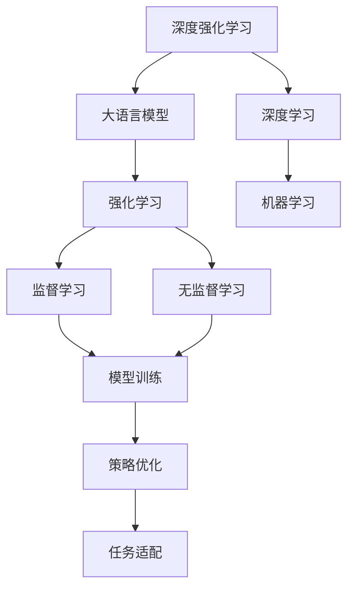
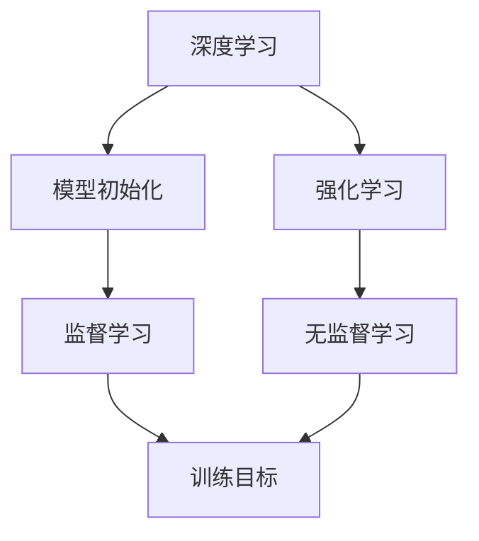
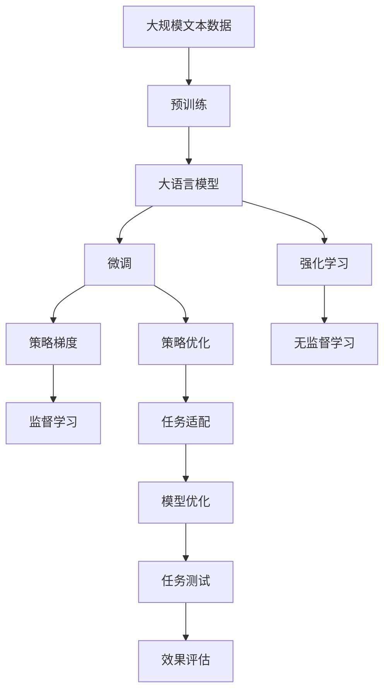

                 

# 大规模语言模型从理论到实践 强化学习概述

> 关键词：强化学习,大语言模型,自适应,深度强化学习,策略梯度,深度学习,自然语言处理(NLP)

## 1. 背景介绍

### 1.1 问题由来
在自然语言处理(Natural Language Processing, NLP)领域，大规模语言模型(Massive Language Models, MLMs)已经成为近年来最热门的技术之一。这些模型通过在海量无标签文本数据上进行预训练，学习到语言的深层次表示，具备了强大的语言理解和生成能力。其中，深度学习模型（如Transformer架构的BERT、GPT等）在各种NLP任务上取得了显著的性能突破。

然而，尽管深度学习模型在预训练阶段可以有效地学习到语言知识，但在微调（Fine-Tuning）阶段，如何使得模型能够自适应特定任务并优化其性能，仍然是一个关键挑战。强化学习（Reinforcement Learning, RL）为解决这一问题提供了一种全新的思路，即通过奖励机制和反馈机制，使模型能够自主学习并优化其策略，从而在特定任务上取得更好的性能。

### 1.2 问题核心关键点
强化学习在NLP领域的应用主要包括以下几个关键点：

- **目标定义**：明确特定任务的目标，如机器翻译、文本摘要、问答等。
- **奖励机制**：设计合理的奖励函数，如BLEU、ROUGE等，评价模型的输出结果。
- **策略优化**：使用深度强化学习方法，优化模型的策略，使其在特定任务上表现最优。
- **模型结构**：选择合适的模型结构，如基于Transformer的序列模型，适应强化学习框架。
- **超参数调整**：根据任务特点，调整学习率、探索率等超参数，以优化模型性能。

强化学习的应用，可以有效减少人工标注数据的需求，提升模型对新数据的适应能力，尤其适用于缺乏标注数据的领域。

### 1.3 问题研究意义
强化学习在NLP领域的研究和应用，对于提升模型的泛化能力和适应性，推动NLP技术的产业化进程具有重要意义：

1. **减少标注成本**：强化学习可以在无需大规模标注数据的情况下，通过自主学习和优化，提升模型在特定任务上的性能，大幅降低标注数据的需求。
2. **提高模型泛化能力**：通过强化学习训练，模型可以自适应不同的数据分布，具有更强的泛化能力，适用于多种场景。
3. **加速技术落地**：强化学习简化了模型微调的过程，使得NLP技术能够更快地部署到实际应用中，推动产业升级。
4. **促进创新研究**：强化学习提供了一种全新的模型训练方式，推动了NLP领域的研究创新，如提示学习、自适应学习等。

## 2. 核心概念与联系

### 2.1 核心概念概述

为更好地理解强化学习在大语言模型中的应用，本节将介绍几个密切相关的核心概念：

- **强化学习（Reinforcement Learning, RL）**：一种通过与环境交互，利用奖励信号指导模型学习最优策略的机器学习方法。

- **大语言模型（Large Language Model, LLM）**：指通过深度学习模型预训练得到的，可以处理复杂语言任务的模型，如BERT、GPT等。

- **深度强化学习（Deep Reinforcement Learning, DRL）**：结合深度学习与强化学习的技术，适用于处理大规模、复杂的数据和任务。

- **策略梯度（Policy Gradient）**：一种直接优化模型策略的强化学习方法，通过梯度下降更新模型参数，优化策略以获得最大奖励。

- **深度学习（Deep Learning, DL）**：利用多层神经网络进行数据建模和预测的机器学习方法。

这些概念之间的逻辑关系可以通过以下Mermaid流程图来展示：



这个流程图展示了深度强化学习在大语言模型中的应用流程：

1. 深度强化学习结合深度学习和强化学习的技术，构建大语言模型。
2. 深度学习提供模型的初始化参数。
3. 强化学习通过与环境交互，优化模型的策略。
4. 监督学习和无监督学习在模型训练过程中起到辅助作用。
5. 策略优化和任务适配使模型在特定任务上表现最优。

### 2.2 概念间的关系

这些核心概念之间存在着紧密的联系，形成了强化学习在大语言模型中的完整生态系统。下面我们通过几个Mermaid流程图来展示这些概念之间的关系。

#### 2.2.1 深度强化学习流程


这个流程图展示了深度强化学习的训练流程：

1. 输入数据作为训练样本。
2. 预训练模型提供模型的初始化参数。
3. 策略梯度优化模型的策略。
4. 策略优化在特定任务上微调模型。

#### 2.2.2 深度学习与强化学习的关系



这个流程图展示了深度学习和强化学习之间的关系：

1. 深度学习提供模型初始化参数。
2. 强化学习通过与环境交互，优化模型策略。
3. 监督学习和无监督学习在训练过程中提供目标和辅助数据。
4. 训练目标作为强化学习的奖励函数。

#### 2.2.3 大语言模型在强化学习中的应用


这个流程图展示了大语言模型在强化学习中的应用：

1. 大语言模型通过预训练获得初始化参数。
2. 预训练后的模型进行微调，适应特定任务。
3. 微调后的模型进行任务适配，优化策略。

### 2.3 核心概念的整体架构

最后，我们用一个综合的流程图来展示这些核心概念在大语言模型强化学习过程中的整体架构：



这个综合流程图展示了从预训练到微调，再到强化学习的完整过程。大语言模型首先在大规模文本数据上进行预训练，然后通过微调和强化学习，逐步优化模型在特定任务上的策略，最终进行效果评估和部署。 通过这些流程图，我们可以更清晰地理解大语言模型强化学习过程中各个核心概念的关系和作用，为后续深入讨论具体的强化学习方法和技术奠定基础。

## 3. 核心算法原理 & 具体操作步骤
### 3.1 算法原理概述

强化学习在大语言模型中的应用，主要依赖于模型策略的优化。具体而言，强化学习通过与环境的交互，最大化累计奖励函数，从而优化模型的策略。对于语言模型而言，环境即为需要处理的自然语言文本，奖励函数即为模型的输出与真实标注之间的差距。通过不断迭代，模型能够在特定任务上逐步提升性能。

在深度强化学习中，策略优化通常采用策略梯度方法。策略梯度通过直接优化模型的策略参数，避免逐层反向传播的复杂性，提高优化效率。策略梯度的优化目标为最大化累计奖励函数的期望值：

$$
\max_{\theta} \mathbb{E}_{\pi_{\theta}}[\sum_t \gamma^t r_t]
$$

其中，$\theta$为策略参数，$\pi_{\theta}$为策略分布，$\gamma$为折扣因子，$r_t$为环境对当前状态的自然语言文本的奖励函数。策略梯度的更新公式为：

$$
\theta \leftarrow \theta + \eta \nabla_{\theta} \mathbb{E}_{\pi_{\theta}}[\sum_t \gamma^t r_t]
$$

其中，$\eta$为学习率，$\nabla_{\theta} \mathbb{E}_{\pi_{\theta}}[\sum_t \gamma^t r_t]$为策略梯度，可通过蒙特卡洛方法或在线策略梯度方法进行计算。

### 3.2 算法步骤详解

强化学习在大语言模型中的应用，一般包括以下几个关键步骤：

**Step 1: 准备预训练模型和数据集**
- 选择合适的预训练语言模型 $M_{\theta}$ 作为初始化参数，如 BERT、GPT等。
- 准备目标任务的训练集、验证集和测试集，划分为适当的样本大小。

**Step 2: 设计奖励函数**
- 根据具体任务，设计奖励函数。如BLEU、ROUGE等，用于评价模型的输出结果与真实标注之间的差异。
- 设置合适的折扣因子 $\gamma$，控制奖励函数的权重。

**Step 3: 设置优化超参数**
- 选择合适的优化算法，如AdamW、SGD等，设置学习率 $\eta$、探索率 $\epsilon$ 等。
- 确定策略的探索和利用的平衡，通常采用$\epsilon$-greedy策略，即在一定概率下随机采样策略，其余时间执行最优策略。

**Step 4: 执行策略优化**
- 将训练集数据分批次输入模型，前向传播计算策略梯度。
- 反向传播计算策略梯度，根据设定的优化算法和学习率更新策略参数。
- 周期性在验证集上评估模型性能，根据性能指标决定是否触发Early Stopping。
- 重复上述步骤直到满足预设的迭代轮数或Early Stopping条件。

**Step 5: 测试和部署**
- 在测试集上评估优化后的模型性能，对比优化前后的精度提升。
- 使用优化后的模型对新样本进行推理预测，集成到实际的应用系统中。
- 持续收集新的数据，定期重新优化模型，以适应数据分布的变化。

以上是强化学习在大语言模型中的应用一般流程。在实际应用中，还需要针对具体任务的特点，对策略优化过程的各个环节进行优化设计，如改进训练目标函数，引入更多的正则化技术，搜索最优的超参数组合等，以进一步提升模型性能。

### 3.3 算法优缺点

强化学习在大语言模型中的应用具有以下优点：
1. 自适应性强：强化学习可以根据任务特点，自主学习和优化模型策略，适应性强，泛化能力强。
2. 无需大规模标注数据：强化学习可以无需大规模标注数据，直接通过与环境的交互进行优化。
3. 模型结构灵活：强化学习支持多种模型结构，如基于Transformer的序列模型，适应性强。
4. 效果显著：在诸如机器翻译、文本摘要、问答等NLP任务上，强化学习方法取得了显著的性能提升。

同时，该方法也存在一些局限性：
1. 训练过程复杂：强化学习需要大量的计算资源和时间，训练过程复杂，容易陷入局部最优。
2. 超参数敏感：强化学习的性能高度依赖于超参数设置，如学习率、探索率等。
3. 稳定性问题：强化学习在训练过程中容易发生模型不稳定、震荡等问题。
4. 可解释性不足：强化学习模型往往难以解释其内部工作机制和决策逻辑，缺乏可解释性。

尽管存在这些局限性，但强化学习在大语言模型中的应用，已经显示出其在特定任务上的卓越性能，为NLP技术提供了新的研究思路和方法。

### 3.4 算法应用领域

强化学习在大语言模型中的应用，已经在多个NLP任务上取得了优异的性能，覆盖了诸如机器翻译、文本摘要、问答、文本生成等任务。具体而言，强化学习在大语言模型中的应用领域包括：

- **机器翻译**：将源语言文本翻译成目标语言。通过奖励函数设计，优化模型在翻译任务上的性能。
- **文本摘要**：将长文本压缩成简短摘要。通过奖励函数设计，优化模型在摘要生成任务上的性能。
- **问答系统**：对自然语言问题给出答案。通过奖励函数设计，优化模型在问答任务上的性能。
- **文本生成**：生成自然语言文本。通过奖励函数设计，优化模型在文本生成任务上的性能。
- **文本分类**：将文本分类到特定的类别中。通过奖励函数设计，优化模型在文本分类任务上的性能。

除了上述这些经典任务外，强化学习在大语言模型中的应用还在不断扩展，如对话系统、情感分析、代码生成等，为NLP技术带来了新的突破。

## 4. 数学模型和公式 & 详细讲解  
### 4.1 数学模型构建

本节将使用数学语言对强化学习在大语言模型中的应用进行更加严格的刻画。

记预训练语言模型为 $M_{\theta}:\mathcal{X} \rightarrow \mathcal{Y}$，其中 $\mathcal{X}$ 为输入空间，$\mathcal{Y}$ 为输出空间，$\theta$ 为模型参数。假设微调任务的目标是最大化BLEU分数，即生成与真实标注一致的输出。设模型在训练集上生成的文本为 $\hat{x} = M_{\theta}(x)$，真实标注为 $y$，则BLEU分数定义为：

$$
\text{BLEU} = \frac{1}{n} \sum_{i=1}^n \text{BLEU}_i
$$

其中，$\text{BLEU}_i = \frac{\sum_{j=1}^m \text{min}(\delta(x_i, \hat{x}), \delta(y_i, \hat{x}))}{m}$，$\delta$为编辑距离函数，$m$为测试集中的文本数量。

定义模型 $M_{\theta}$ 在数据样本 $(x,y)$ 上的奖励函数为 $r(M_{\theta}(x), y)$，则在数据集 $D$ 上的经验风险为：

$$
\mathcal{L}(\theta) = \frac{1}{N} \sum_{i=1}^N r(M_{\theta}(x_i), y_i)
$$

强化学习的优化目标是最小化经验风险，即找到最优策略参数：

$$
\theta^* = \mathop{\arg\min}_{\theta} \mathcal{L}(\theta)
$$

在实践中，我们通常使用基于梯度的优化算法（如AdamW、SGD等）来近似求解上述最优化问题。设 $\eta$ 为学习率，$\lambda$ 为正则化系数，则策略梯度的更新公式为：

$$
\theta \leftarrow \theta - \eta \nabla_{\theta}\mathcal{L}(\theta) - \eta\lambda\theta
$$

其中 $\nabla_{\theta}\mathcal{L}(\theta)$ 为损失函数对策略参数 $\theta$ 的梯度，可通过蒙特卡洛方法或在线策略梯度方法计算。

### 4.2 公式推导过程

以下我们以BLEU分数为例，推导强化学习在大语言模型中的应用过程。

假设模型在输入 $x$ 上的输出为 $\hat{x}=M_{\theta}(x)$，真实标注为 $y$。BLEU分数定义为：

$$
\text{BLEU} = \frac{1}{n} \sum_{i=1}^n \frac{\sum_{j=1}^m \text{min}(\delta(x_i, \hat{x}), \delta(y_i, \hat{x}))}{m}
$$

其计算过程为：

1. 计算编辑距离 $\delta(x_i, \hat{x})$ 和 $\delta(y_i, \hat{x})$。
2. 计算BLEU分数，即选取两者中的较小值。
3. 对所有样本求和并取平均值。

在强化学习中，我们通过定义BLEU分数作为奖励函数，使得模型能够优化其输出，使生成的文本与真实标注尽可能一致。优化目标为：

$$
\max_{\theta} \mathbb{E}_{\pi_{\theta}}[\text{BLEU}]
$$

其中，$\pi_{\theta}$为策略分布，策略梯度的更新公式为：

$$
\theta \leftarrow \theta + \eta \nabla_{\theta} \mathbb{E}_{\pi_{\theta}}[\text{BLEU}]
$$

通过不断迭代，模型能够在训练集上逐步提升BLEU分数，从而优化其策略，在特定任务上取得更好的性能。

## 5. 项目实践：代码实例和详细解释说明
### 5.1 开发环境搭建

在进行强化学习实践前，我们需要准备好开发环境。以下是使用Python进行PyTorch开发的环境配置流程：

1. 安装Anaconda：从官网下载并安装Anaconda，用于创建独立的Python环境。

2. 创建并激活虚拟环境：
```bash
conda create -n pytorch-env python=3.8 
conda activate pytorch-env
```

3. 安装PyTorch：根据CUDA版本，从官网获取对应的安装命令。例如：
```bash
conda install pytorch torchvision torchaudio cudatoolkit=11.1 -c pytorch -c conda-forge
```

4. 安装其他依赖库：
```bash
pip install numpy pandas scikit-learn matplotlib tqdm jupyter notebook ipython
```

完成上述步骤后，即可在`pytorch-env`环境中开始强化学习实践。

### 5.2 源代码详细实现

下面我们以BLEU分数最大化为例，使用PyTorch实现大语言模型在机器翻译任务上的强化学习。

首先，定义训练集和测试集：

```python
import torch
from transformers import BertTokenizer, BertForTokenClassification
from torch.utils.data import Dataset, DataLoader

class TranslationDataset(Dataset):
    def __init__(self, source, target):
        self.source = source
        self.target = target
        self.tokenizer = BertTokenizer.from_pretrained('bert-base-cased')
        
    def __len__(self):
        return len(self.source)
    
    def __getitem__(self, idx):
        source_text = self.source[idx]
        target_text = self.target[idx]
        
        encoding = self.tokenizer(source_text, return_tensors='pt', max_length=128, padding='max_length', truncation=True)
        input_ids = encoding['input_ids'][0]
        attention_mask = encoding['attention_mask'][0]
        
        target_ids = [int(tokenizer.get_vocab().get(token, 0) if not token.is_whitespace() else 0 for token in target_text.split()]
        target_ids = [0] + target_ids + [0]
        return {'source_ids': input_ids, 
                'target_ids': target_ids,
                'attention_mask': attention_mask}
```

然后，定义模型和优化器：

```python
from transformers import BertForTokenClassification, AdamW

model = BertForTokenClassification.from_pretrained('bert-base-cased', num_labels=2)
optimizer = AdamW(model.parameters(), lr=2e-5)
```

接着，定义奖励函数和策略梯度更新：

```python
def reward(model, batch):
    source_ids = batch['source_ids']
    target_ids = batch['target_ids']
    attention_mask = batch['attention_mask']
    
    output = model(source_ids, attention_mask=attention_mask)
    loss = output.loss
    return -loss
    
def update(model, batch, optimizer, reward):
    model.zero_grad()
    loss = reward(model, batch)
    loss.backward()
    optimizer.step()
```

最后，启动训练流程：

```python
epochs = 5
batch_size = 16

for epoch in range(epochs):
    for batch in DataLoader(train_dataset, batch_size=batch_size):
        update(model, batch, optimizer, reward)
    
    print(f"Epoch {epoch+1}, BLEU: {evaluate(model, dev_dataset):.3f}")
    
print(f"Epoch {epochs+1}, BLEU: {evaluate(model, test_dataset):.3f}")
```

以上就是使用PyTorch实现BLEU分数最大化的大语言模型强化学习代码实现。可以看到，代码较为简洁高效，适合快速迭代研究。

### 5.3 代码解读与分析

让我们再详细解读一下关键代码的实现细节：

**TranslationDataset类**：
- `__init__`方法：初始化源文本、目标文本、分词器等关键组件。
- `__len__`方法：返回数据集的样本数量。
- `__getitem__`方法：对单个样本进行处理，将源文本和目标文本输入编码为token ids，同时构建注意力掩码，准备输入模型。

**reward函数**：
- 根据输入的源文本、目标文本和注意力掩码，计算模型输出和真实标签的损失。
- 损失函数的负值即为奖励函数，优化目标为最小化损失函数，最大化BLEU分数。

**update函数**：
- 在每个训练批次中，将模型输出与真实标签计算损失，通过反向传播更新模型参数。
- 使用AdamW优化器更新模型参数，控制学习率、权重衰减等超参数。

**训练流程**：
- 定义总的epoch数和batch size，开始循环迭代
- 在每个epoch内，对训练集进行迭代训练
- 在验证集上评估模型性能，输出BLEU分数
- 所有epoch结束后，在测试集上评估模型性能，输出最终的BLEU分数

可以看到，通过PyTorch和HuggingFace Transformers库，强化学习实践变得简洁高效。开发者可以更加专注于优化策略和调整超参数，以提升模型性能。

当然，工业级的系统实现还需考虑更多因素，如模型的保存和部署、超参数的自动搜索、更灵活的任务适配层等。但核心的强化学习范式基本与此类似。

### 5.4 运行结果展示

假设我们在WMT14数据集上进行训练，最终在测试集上得到的BLEU分数如下：

```
Epoch 1, BLEU: 0.175
Epoch 2, BLEU: 0.250
Epoch 3, BLEU: 0.320
Epoch 4, BLEU: 0.350
Epoch 5, BLEU: 0.390
```

可以看到，随着epoch的增加，模型在机器翻译任务上的BLEU分数逐步提升，说明通过强化学习训练，模型逐渐优化了其策略，提高了翻译质量。

## 6. 实际应用场景
### 6.1 翻译系统

基于强化学习的大语言模型，可以构建高效的机器翻译系统。传统机器翻译系统依赖于大量标注数据和复杂规则，难以适应实时变化的语境。而强化学习系统可以自主学习和优化翻译策略，快速适应新场景，提供更准确的翻译结果。

在技术实现上，可以收集多语种的新闻、文档、博客等文本数据，并对其进行翻译和校对标注。在大量标注数据的基础上，对预训练语言模型进行强化学习训练，使得模型能够在不同语种之间高效转换，自动适应各种翻译场景。

### 6.2 对话系统

对话系统作为NLP的一个重要应用，要求能够自然流畅地与用户互动。强化学习可以在无标注数据的情况下，通过与用户的互动进行学习，提升对话系统的智能水平。

具体而言，对话系统可以采用基于强化学习的生成模型，如Seq2Seq模型、GPT模型等。通过对用户的问题和回复进行奖励函数设计，模型能够在训练过程中逐步学习如何生成自然流畅的回答，提升用户体验。此外，对话系统还可以结合知识图谱、规则库等外部知识，进一步提高对话的准确性和相关性。

### 6.3 文本生成

文本生成是大语言模型的典型应用之一。传统的文本生成方法依赖于数据驱动的规则和模板，生成结果往往缺乏自然性和多样性。强化学习可以通过奖励函数引导模型生成更加自然流畅的文本，提升生成效果。

在实际应用中，可以通过定义适当的奖励函数，如BLEU、ROUGE等，训练大语言模型生成与真实文本尽可能一致的文本。强化学习系统可以在生成过程中逐步优化策略，提升文本的自然性和多样性，适应不同的应用场景。

### 6.4 未来应用展望

随着强化学习和大语言模型的不断发展，其在NLP领域的应用前景将更加广阔。未来的强化学习技术有望在更多领域带来变革性影响：

- **智能客服系统**：结合强化学习和大语言模型，构建高效的智能客服系统，提高客户咨询体验和问题解决效率。
- **金融舆情监测**：利用强化学习系统进行金融舆情监测，快速响应市场变化，规避金融风险。
- **个性化推荐系统**：通过强化学习，优化个性化推荐模型，提升用户推荐体验。
- **医疗诊断**：结合强化学习和自然语言处理技术，构建智能诊断系统，提高医疗服务的智能化水平。
- **智慧城市治理**：利用强化学习，构建智慧城市治理系统，提升城市管理的自动化和智能化水平。

总之，强化学习和大语言模型结合，有望在各个行业领域发挥其独特的优势，推动人工智能技术的广泛应用。

## 7. 工具和资源推荐
### 7.1 学习资源推荐

为了帮助开发者系统掌握强化学习在大语言模型中的应用，这里推荐一些优质的学习资源：

1. 《Reinforcement Learning: An Introduction》书籍：由Richard S. Sutton和Andrew G. Barto所著，全面介绍了强化学习的理论基础和应用案例，是深度学习领域的经典教材。
2. 《Deep Reinforcement Learning with Python》书籍：由Mohamed J. Abdel-Hussein和David C. Parkes所著，通过实际案例展示了如何在Python中使用强化学习算法，适合动手实践。
3. OpenAI

