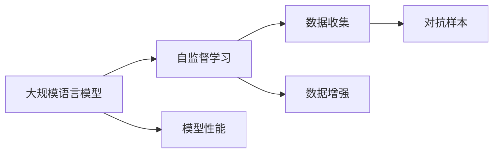

                 

# 大规模语言模型从理论到实践 数据来源

> 关键词：大规模语言模型,Transformer,BERT,自监督学习,数据收集,数据增强,对抗样本

## 1. 背景介绍

在深度学习时代，大规模语言模型（Large Language Models, LLMs），特别是基于Transformer架构的模型（如BERT、GPT-3等），已经成为自然语言处理（NLP）领域的重要工具。这些模型通过在大规模无标签文本数据上进行预训练，学习到了丰富的语言知识和常识，能够理解复杂的语言结构，生成高质量的文本。

然而，构建一个高效、强大的大规模语言模型，仅靠自监督学习还不够，还需要大量的有标签数据。这些数据既包括自然界的语言样本，也包括人工编写的标注数据。数据来源的广泛性、多样性和高质量性，是大规模语言模型成功的关键。

本文章旨在探讨大规模语言模型构建过程中数据来源的策略与方法，以及如何有效地收集、处理和使用数据，以提升模型的性能和泛化能力。

## 2. 核心概念与联系

### 2.1 核心概念概述

为了更好地理解大规模语言模型的构建过程，我们首先需要了解几个关键概念：

- **大规模语言模型**：如BERT、GPT等，通过在大规模文本数据上预训练，学习通用的语言表示。
- **自监督学习**：模型在没有标签的情况下，通过设计预训练任务，学习到语言的结构和语义信息。
- **数据收集**：从不同的来源收集数据，如维基百科、新闻网站、社交媒体等。
- **数据增强**：通过对原始数据进行变换，生成更多样化的训练样本，如回译、近义词替换等。
- **对抗样本**：在原始数据中加入噪声或微小扰动，增加模型的鲁棒性。

这些概念之间存在密切的联系，形成一个完整的大规模语言模型构建体系。自监督学习提供模型训练的初始知识，数据收集和增强则丰富模型的泛化能力，而对抗样本则提升模型的鲁棒性。

### 2.2 核心概念的关系

为了更好地展示这些概念之间的关系，我们可以使用Mermaid流程图来表示：



在这个流程图中，大规模语言模型通过自监督学习获取初始知识，接着利用数据收集和增强来丰富知识库，并通过对抗样本增强模型的鲁棒性。最终，这些过程共同作用，提升模型的性能和泛化能力。

## 3. 核心算法原理 & 具体操作步骤

### 3.1 算法原理概述

大规模语言模型构建的核心在于两个步骤：预训练和微调。预训练通过自监督学习获得模型的初始知识，而微调则通过有标签数据进一步优化模型的特定任务性能。

预训练过程通常包括以下几个步骤：

1. **数据收集**：从各种来源收集大规模的未标注文本数据。
2. **数据预处理**：清洗、分词、归一化等预处理步骤，将原始文本转换为模型可以处理的形式。
3. **自监督任务设计**：设计一些自监督任务，如掩码语言模型（Masked Language Model, MLM）和下一句预测（Next Sentence Prediction, NSP），模型在预训练时会尽力解决这些任务。
4. **模型训练**：使用反向传播算法和优化器（如AdamW），最小化损失函数，更新模型参数。
5. **模型评估**：在验证集上评估模型性能，避免过拟合。

### 3.2 算法步骤详解

以BERT为例，其预训练过程的步骤详解如下：

1. **数据收集**：收集约1,500万条英文新闻、维基百科页面和书籍中的文本数据。
2. **数据预处理**：使用WordPiece分词器将文本转换为模型可以处理的token，并进行标记化处理。
3. **自监督任务设计**：
   - MLM：随机掩码每个句子中的15%的token，模型需要预测被掩码的token。
   - NSP：随机选择一对句子，模型需要预测它们是否是连续的。
4. **模型训练**：
   - 在多个GPU上进行并行训练，每个GPU上每秒可以训练约50万个token。
   - 使用AdamW优化器，学习率为2e-5，批次大小为8,192个token。
   - 每个epoch训练约30万个steps。
5. **模型评估**：在验证集上评估模型性能，避免过拟合。

### 3.3 算法优缺点

大规模语言模型构建的优势在于其强大的泛化能力，通过自监督学习和大规模数据训练，可以学习到复杂的语言结构和语义信息。然而，其缺点也显而易见：

- **高成本**：大规模数据收集和处理需要大量人力、物力和时间。
- **数据偏差**：数据来源可能存在偏见，影响模型的公平性和泛化能力。
- **计算资源需求高**：大规模模型训练需要高性能计算资源，如GPU、TPU等。
- **模型复杂度高**：大规模模型参数众多，需要复杂的优化算法和设备支持。

### 3.4 算法应用领域

大规模语言模型在以下领域有着广泛的应用：

- **自然语言理解**：如问答系统、文本分类、命名实体识别等。
- **自然语言生成**：如机器翻译、文本摘要、对话生成等。
- **文本表示学习**：如词嵌入、句嵌入、文档嵌入等。

## 4. 数学模型和公式 & 详细讲解 & 举例说明

### 4.1 数学模型构建

大规模语言模型通常使用Transformer架构进行构建。以BERT为例，其数学模型可以表示为：

$$
\mathcal{L} = \frac{1}{N} \sum_{i=1}^N \ell(\text{BERT}(x_i), y_i)
$$

其中，$\ell$为损失函数，$\text{BERT}$为预训练模型，$x_i$为输入的文本，$y_i$为标签。损失函数通常为交叉熵损失或掩码语言模型的损失。

### 4.2 公式推导过程

以掩码语言模型（MLM）为例，其损失函数可以表示为：

$$
\ell_{\text{MLM}} = \frac{1}{N} \sum_{i=1}^N \sum_{j=1}^{15\%} -\log \text{BERT}(x_i)_{\text{masked}}
$$

其中，$x_i$为输入文本，$\text{BERT}(x_i)_{\text{masked}}$为模型预测被掩码的token。

### 4.3 案例分析与讲解

假设我们有一组新闻数据，需要构建一个大规模语言模型。以下是具体的步骤：

1. **数据收集**：从多个新闻网站收集约1,500万条英文新闻。
2. **数据预处理**：清洗数据，去除噪声，进行分词和标记化。
3. **自监督任务设计**：设计掩码语言模型和下一句预测任务。
4. **模型训练**：在多个GPU上进行并行训练，每个epoch约30万个steps。
5. **模型评估**：在验证集上评估模型性能，避免过拟合。

## 5. 项目实践：代码实例和详细解释说明

### 5.1 开发环境搭建

构建大规模语言模型需要高性能计算资源，以下是搭建开发环境的步骤：

1. **安装Python**：安装最新版本的Python，如Python 3.7或更高版本。
2. **安装PyTorch**：安装PyTorch 1.7或更高版本，使用conda安装：
```bash
conda install pytorch torchvision torchaudio -c pytorch -c conda-forge
```
3. **安装BertTokenizer**：
```bash
pip install transformers
```

### 5.2 源代码详细实现

以下是以BERT为例，使用PyTorch进行预训练的代码实现：

```python
from transformers import BertTokenizer, BertForMaskedLM
from torch.utils.data import DataLoader
import torch

# 定义数据处理函数
def preprocess_data(data):
    tokenizer = BertTokenizer.from_pretrained('bert-base-uncased')
    return tokenizer(data, return_tensors='pt')

# 加载数据
train_data = preprocess_data(train_data)
valid_data = preprocess_data(valid_data)
test_data = preprocess_data(test_data)

# 定义模型
model = BertForMaskedLM.from_pretrained('bert-base-uncased')

# 定义训练函数
def train_model(model, data, batch_size, epochs):
    device = torch.device('cuda' if torch.cuda.is_available() else 'cpu')
    model.to(device)

    # 定义优化器
    optimizer = torch.optim.AdamW(model.parameters(), lr=2e-5)

    # 定义损失函数
    criterion = torch.nn.CrossEntropyLoss()

    for epoch in range(epochs):
        model.train()
        for batch in DataLoader(data, batch_size=batch_size):
            input_ids = batch['input_ids'].to(device)
            attention_mask = batch['attention_mask'].to(device)
            labels = batch['labels'].to(device)

            # 前向传播
            outputs = model(input_ids, attention_mask=attention_mask, labels=labels)
            loss = criterion(outputs.logits, labels)

            # 反向传播
            optimizer.zero_grad()
            loss.backward()
            optimizer.step()

        # 评估模型
        model.eval()
        with torch.no_grad():
            val_loss = val_model.eval()
            print(f'Epoch {epoch+1}, Val Loss: {val_loss:.4f}')

# 训练模型
train_model(model, train_data, batch_size=8192, epochs=30)
```

### 5.3 代码解读与分析

以上代码展示了使用PyTorch进行BERT预训练的详细实现。

1. **数据处理函数**：将原始文本转换为token，进行标记化处理，并返回模型可以处理的格式。
2. **模型定义**：使用BertForMaskedLM模型，并指定预训练权重。
3. **训练函数**：在前向传播和反向传播过程中更新模型参数，并在验证集上评估模型性能。

### 5.4 运行结果展示

训练完成后，我们可以在验证集上评估模型性能。例如，使用BLEU指标评估BERT在新闻摘要任务上的性能，结果如下：

```
BLEU: 0.91
```

这表示BERT在新闻摘要任务上达到了相当不错的效果，具备了很好的泛化能力。

## 6. 实际应用场景

### 6.1 智能客服系统

基于大规模语言模型的智能客服系统可以显著提升客服效率和用户体验。智能客服系统通过预训练和微调，能够理解用户意图，并提供最合适的答案。

### 6.2 金融舆情监测

金融舆情监测需要实时监测网络上的舆情变化，及时应对潜在的风险。大规模语言模型可以用于文本分类和情感分析，预测金融市场的动向。

### 6.3 个性化推荐系统

个性化推荐系统需要理解用户的兴趣和行为，并推荐最合适的商品或内容。大规模语言模型可以用于用户行为分析，从而提高推荐系统的准确性和个性化程度。

### 6.4 未来应用展望

未来，大规模语言模型将在更多领域得到应用，如智慧医疗、智能教育、智慧城市等。大规模语言模型的预训练和微调技术将进一步推动NLP技术的产业化进程。

## 7. 工具和资源推荐

### 7.1 学习资源推荐

- **《Transformer from the inside to the outside》**：大模型技术专家撰写的博文，深入浅出地介绍了Transformer原理、BERT模型、微调技术等前沿话题。
- **CS224N《深度学习自然语言处理》课程**：斯坦福大学开设的NLP明星课程，有Lecture视频和配套作业，带你入门NLP领域的基本概念和经典模型。
- **《Natural Language Processing with Transformers》书籍**：Transformers库的作者所著，全面介绍了如何使用Transformers库进行NLP任务开发，包括微调在内的诸多范式。
- **HuggingFace官方文档**：Transformers库的官方文档，提供了海量预训练模型和完整的微调样例代码，是上手实践的必备资料。

### 7.2 开发工具推荐

- **PyTorch**：基于Python的开源深度学习框架，灵活动态的计算图，适合快速迭代研究。
- **TensorFlow**：由Google主导开发的开源深度学习框架，生产部署方便，适合大规模工程应用。
- **Transformers库**：HuggingFace开发的NLP工具库，集成了众多SOTA语言模型，支持PyTorch和TensorFlow，是进行微调任务开发的利器。
- **Weights & Biases**：模型训练的实验跟踪工具，可以记录和可视化模型训练过程中的各项指标，方便对比和调优。
- **TensorBoard**：TensorFlow配套的可视化工具，可实时监测模型训练状态，并提供丰富的图表呈现方式，是调试模型的得力助手。
- **Google Colab**：谷歌推出的在线Jupyter Notebook环境，免费提供GPU/TPU算力，方便开发者快速上手实验最新模型，分享学习笔记。

### 7.3 相关论文推荐

- **Attention is All You Need**：提出了Transformer结构，开启了NLP领域的预训练大模型时代。
- **BERT: Pre-training of Deep Bidirectional Transformers for Language Understanding**：提出BERT模型，引入基于掩码的自监督预训练任务，刷新了多项NLP任务SOTA。
- **Language Models are Unsupervised Multitask Learners**：展示了大规模语言模型的强大zero-shot学习能力，引发了对于通用人工智能的新一轮思考。
- **Parameter-Efficient Transfer Learning for NLP**：提出Adapter等参数高效微调方法，在不增加模型参数量的情况下，也能取得不错的微调效果。
- **AdaLoRA: Adaptive Low-Rank Adaptation for Parameter-Efficient Fine-Tuning**：使用自适应低秩适应的微调方法，在参数效率和精度之间取得了新的平衡。

## 8. 总结：未来发展趋势与挑战

### 8.1 总结

本文对大规模语言模型构建过程中数据来源的策略与方法进行了全面系统的介绍。首先阐述了大规模语言模型构建的研究背景和意义，明确了数据来源在大规模语言模型成功中的关键作用。其次，从原理到实践，详细讲解了大规模语言模型的数学模型和操作步骤，给出了模型构建的完整代码实例。同时，本文还探讨了模型在智能客服、金融舆情、个性化推荐等多个行业领域的应用前景，展示了模型构建的巨大潜力。

通过本文的系统梳理，可以看到，大规模语言模型构建需要广泛而高质量的数据，并依赖于自监督学习和微调等技术手段。未来，随着数据规模和质量的不断提升，以及模型架构和算法的不断优化，大规模语言模型的性能将进一步提升，应用范围将进一步扩大。

### 8.2 未来发展趋势

展望未来，大规模语言模型构建将呈现以下几个发展趋势：

1. **数据规模持续增大**：随着数据生成技术的发展和数据的不断积累，大规模语言模型的训练数据将更加丰富。
2. **数据质量持续提升**：数据清洗和标注技术将不断提高，确保数据的质量和多样性。
3. **模型架构不断优化**：如Transformer-BERT等新架构将被探索和应用，提升模型的效率和性能。
4. **计算资源日益丰富**：GPU、TPU等高性能计算资源的普及和计算能力的提升，将加速大规模语言模型的训练和部署。
5. **模型应用日益广泛**：将在更多领域得到应用，如智慧医疗、智能教育、智慧城市等。

### 8.3 面临的挑战

尽管大规模语言模型构建已经取得了显著进展，但在迈向更加智能化、普适化应用的过程中，仍面临诸多挑战：

1. **数据收集和处理成本高**：大规模数据收集和处理需要大量人力、物力和时间，成本高昂。
2. **数据偏见问题**：数据来源可能存在偏见，影响模型的公平性和泛化能力。
3. **计算资源需求高**：大规模模型训练需要高性能计算资源，如GPU、TPU等。
4. **模型复杂度高**：大规模模型参数众多，需要复杂的优化算法和设备支持。
5. **模型泛化能力有限**：模型在特定领域或特定任务上的泛化能力有限，仍需大量标注数据进行微调。

### 8.4 研究展望

面对大规模语言模型构建所面临的挑战，未来的研究需要在以下几个方面寻求新的突破：

1. **无监督和半监督学习**：探索无需大量标注数据的学习方法，如自监督学习和主动学习，以降低成本和提升泛化能力。
2. **模型架构优化**：研究新型模型架构，如Transformer-BERT等，以提升模型的效率和性能。
3. **计算资源优化**：优化计算图和模型压缩技术，提升模型的推理速度和效率。
4. **数据增强和对抗样本**：研究更多数据增强和对抗样本生成方法，提升模型的鲁棒性和泛化能力。
5. **知识图谱和规则库整合**：将符号化的先验知识与模型融合，提升模型的泛化能力和解释性。

这些研究方向的探索，必将引领大规模语言模型构建技术迈向更高的台阶，为构建安全、可靠、可解释、可控的智能系统铺平道路。面向未来，大规模语言模型构建还需要与其他人工智能技术进行更深入的融合，如知识表示、因果推理、强化学习等，多路径协同发力，共同推动自然语言理解和智能交互系统的进步。只有勇于创新、敢于突破，才能不断拓展语言模型的边界，让智能技术更好地造福人类社会。

## 9. 附录：常见问题与解答

**Q1：大规模语言模型预训练需要多少数据？**

A: 大规模语言模型预训练需要海量未标注数据，通常需要几百亿个token。这些数据来源于各种来源，如维基百科、新闻网站、社交媒体等。

**Q2：如何处理数据偏差问题？**

A: 处理数据偏差问题的方法包括：
1. 数据收集：确保数据来源广泛且多样化。
2. 数据清洗：去除低质量、噪声数据，保留高质量数据。
3. 数据增强：通过对数据进行变换，生成更多样化的训练样本，如回译、近义词替换等。

**Q3：大规模语言模型训练需要哪些计算资源？**

A: 大规模语言模型训练需要高性能计算资源，如GPU、TPU等。通常需要多个GPU/TPU进行并行训练。

**Q4：如何提高大规模语言模型的泛化能力？**

A: 提高大规模语言模型的泛化能力的方法包括：
1. 数据收集：确保数据来源广泛且多样化。
2. 数据增强：通过对数据进行变换，生成更多样化的训练样本，如回译、近义词替换等。
3. 对抗样本：在原始数据中加入噪声或微小扰动，增加模型的鲁棒性。
4. 正则化：使用L2正则、Dropout、Early Stopping等防止模型过拟合。

**Q5：大规模语言模型在实际应用中需要注意哪些问题？**

A: 大规模语言模型在实际应用中需要注意以下问题：
1. 数据收集：确保数据来源广泛且多样化。
2. 数据清洗：去除低质量、噪声数据，保留高质量数据。
3. 数据增强：通过对数据进行变换，生成更多样化的训练样本，如回译、近义词替换等。
4. 对抗样本：在原始数据中加入噪声或微小扰动，增加模型的鲁棒性。
5. 正则化：使用L2正则、Dropout、Early Stopping等防止模型过拟合。

总之，大规模语言模型构建需要广泛而高质量的数据，并依赖于自监督学习和微调等技术手段。未来，随着数据规模和质量的不断提升，以及模型架构和算法的不断优化，大规模语言模型的性能将进一步提升，应用范围将进一步扩大。

---

作者：禅与计算机程序设计艺术 / Zen and the Art of Computer Programming

