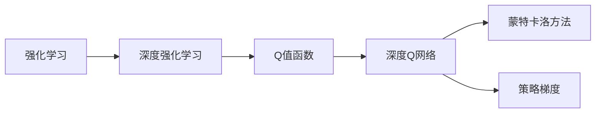

                 

# 大语言模型原理与工程实践：DQN 训练：基本思想

> 关键词：深度强化学习, DQN, 策略梯度, 探索与利用平衡, 蒙特卡洛方法, Q值函数, 神经网络, 深度学习框架, 强化学习算法, 路径规划, 机器人控制

## 1. 背景介绍

### 1.1 问题由来

在深度学习领域，强化学习（Reinforcement Learning, RL）是一类重要的学习方式，它通过与环境交互，使得智能体（agent）在特定环境下学习最优策略。深度强化学习（Deep Reinforcement Learning, DRL）结合了深度神经网络与强化学习的优势，已经应用于诸如游戏、机器人控制、路径规划等多个领域，展现了强大的能力。

在DRL中，最经典的算法之一是深度Q网络（Deep Q-Network, DQN）。DQN算法通过构建Q值函数，使得智能体能够动态学习最优策略，并应用在各种复杂的控制任务中。DQN的提出者是Mnih等人，他们利用深度神经网络逼近Q值函数，并成功应用于游戏环境，开创了深度学习在强化学习中的应用。

本文将对DQN算法的基本思想、核心原理和工程实现进行全面介绍，并结合实际案例进行详细讲解，帮助读者深入理解DQN算法的工程实践，并探讨其未来的发展方向和面临的挑战。

## 2. 核心概念与联系

### 2.1 核心概念概述

为更好地理解DQN算法的原理和应用，本节将介绍几个密切相关的核心概念：

- **强化学习（RL）**：一种通过与环境交互，智能体根据环境反馈调整策略的学习方式。智能体的目标是最大化长期累积奖励。
- **深度强化学习（DRL）**：结合深度神经网络与强化学习的算法，可以处理更复杂、高维的状态空间和动作空间。
- **Q值函数（Q-function）**：用于评估在特定状态下采取特定动作的长期累积奖励。DQN算法通过神经网络逼近Q值函数。
- **深度Q网络（DQN）**：一种利用深度神经网络逼近Q值函数的深度强化学习算法，通过经验回放（Experience Replay）和目标网络更新等技巧，提升了算法的稳定性和性能。
- **蒙特卡洛方法（Monte Carlo Method）**：一种基于随机采样的方法，用于评估状态-动作对的价值。DQN算法利用蒙特卡洛方法计算Q值。
- **策略梯度（Policy Gradient）**：一种直接优化策略的强化学习方法，通过梯度上升或下降更新策略参数，使得策略在特定任务上表现更佳。

这些核心概念之间的逻辑关系可以通过以下Mermaid流程图来展示：



这个流程图展示了大语言模型微调过程中各个核心概念的关系和作用。

### 2.2 概念间的关系

这些核心概念之间存在着紧密的联系，形成了DQN算法的完整框架。以下是更详细的解释：

1. **强化学习与深度强化学习的关系**：强化学习是一种通用的学习方式，而深度强化学习则是在强化学习基础上，利用深度神经网络处理高维数据。DQN作为深度强化学习的代表，利用神经网络逼近Q值函数，处理复杂的状态和动作空间。

2. **Q值函数与深度Q网络的关系**：Q值函数用于评估状态-动作对的价值，DQN算法通过深度神经网络逼近Q值函数，从而可以学习更复杂的Q函数。

3. **蒙特卡洛方法与Q值函数的关系**：蒙特卡洛方法是一种基于随机采样的价值评估方法，DQN算法通过蒙特卡洛方法估计Q值，从而得到状态-动作对的价值。

4. **策略梯度与Q值函数的关系**：策略梯度是直接优化策略的强化学习方法，而Q值函数可以视为一种特定的策略评估方法。DQN算法通过优化Q值函数来间接优化策略，从而实现长期累积奖励的最大化。

这些概念共同构成了DQN算法的理论基础，使得智能体能够在复杂的控制任务中学习最优策略。

## 3. 核心算法原理 & 具体操作步骤

### 3.1 算法原理概述

DQN算法的核心思想是构建一个Q值函数，用于评估在特定状态下采取特定动作的长期累积奖励。Q值函数的表达式如下：

$$
Q(s,a) = \mathbb{E}[G_t|s_t = s, a_t = a]
$$

其中，$s_t$ 表示当前状态，$a_t$ 表示当前动作，$G_t$ 表示从当前状态开始采取当前动作后的长期累积奖励。在DQN算法中，Q值函数由深度神经网络逼近，通过训练网络使得其能够较好地估计状态-动作对的价值。

DQN算法的训练过程分为两个部分：

1. **经验回放（Experience Replay）**：将智能体与环境交互过程中的状态-动作-奖励-下一状态四元组（state-action-reward-next-state tuple）存储在经验回放缓冲区中，并随机采样进行训练。
2. **目标网络更新（Target Network Update）**：使用目标网络对Q值函数进行更新，从而使得网络能够更好地处理新样本，并保证训练的稳定性。

### 3.2 算法步骤详解

以下是DQN算法的基本步骤：

1. **初始化**：初始化环境、智能体、状态、动作、奖励、Q网络、目标网络、经验回放缓冲区等。

2. **观察环境**：智能体观察当前环境状态，并将状态表示为网络可以处理的输入。

3. **选择动作**：智能体根据当前状态，使用神经网络预测Q值，并选择动作。

4. **执行动作**：智能体执行选择动作，并观察环境反馈的奖励和下一状态。

5. **存储经验**：将状态、动作、奖励和下一状态四元组存储到经验回放缓冲区中。

6. **更新Q网络**：从经验回放缓冲区中随机采样一批经验，并利用蒙特卡洛方法计算Q值。使用采样的状态-动作对更新Q网络的参数。

7. **更新目标网络**：定期将Q网络的参数复制到目标网络，确保目标网络能够反映最新训练结果。

8. **输出动作**：智能体根据当前状态，选择动作并执行，重复以上步骤直到终止。

### 3.3 算法优缺点

DQN算法在处理复杂环境控制任务时表现出较高的性能和稳定性，其主要优点包括：

1. **泛化能力强**：DQN算法能够处理高维状态和动作空间，适用于复杂环境下的控制任务。
2. **可扩展性好**：利用深度神经网络逼近Q值函数，使得算法可以扩展到更多数据和维度。
3. **鲁棒性强**：经验回放和目标网络更新等技术，提高了算法的鲁棒性和稳定性。

然而，DQN算法也存在一些局限性：

1. **计算成本高**：深度神经网络需要大量的计算资源进行训练，特别是在高维空间中。
2. **易过拟合**：高维数据可能导致过拟合，需要采用一些正则化技术。
3. **策略更新不连续**：Q值函数更新过程可能导致策略变化不连续，影响收敛性。
4. **模型复杂度大**：深度神经网络的复杂度较高，可能导致难以解释和调试。

### 3.4 算法应用领域

DQN算法在多个领域得到了广泛应用，包括但不限于：

1. **游戏AI**：利用DQN算法，可以训练出能够胜任各种复杂游戏任务的智能体，如AlphaGo。
2. **机器人控制**：用于训练机器人执行特定任务，如抓取、移动等。
3. **路径规划**：用于自动驾驶、无人机导航等领域，优化路径选择和行为决策。
4. **金融交易**：用于交易策略优化，学习最优的买卖时机和交易量。
5. **智能推荐**：用于推荐系统，优化用户行为预测和推荐策略。

以上应用展示了DQN算法在复杂环境下的控制和优化能力，推动了相关领域的发展和创新。

## 4. 数学模型和公式 & 详细讲解

### 4.1 数学模型构建

DQN算法的数学模型包括Q值函数、状态-动作-奖励-下一状态四元组、经验回放缓冲区、Q网络、目标网络等。

- **Q值函数**：$Q(s,a) = \mathbb{E}[G_t|s_t = s, a_t = a]$
- **状态-动作-奖励-下一状态四元组**：$(s_t, a_t, r_t, s_{t+1})$
- **经验回放缓冲区**：$\mathcal{B} = (s_1, a_1, r_1, s_2, \dots, s_t, a_t, r_t, s_{t+1})$
- **Q网络**：$\pi(a_t|s_t) = \frac{\exp(Q(s_t, a_t))}{\sum_{a' \in \mathcal{A}}\exp(Q(s_t, a'))}$
- **目标网络**：$\pi_{target}(a_t|s_t) = \frac{\exp(Q_{target}(s_t, a_t))}{\sum_{a' \in \mathcal{A}}\exp(Q_{target}(s_t, a'))}$

其中，$\mathcal{A}$ 表示动作空间，$Q_{target}$ 为目标网络，$\pi$ 和 $\pi_{target}$ 分别表示Q网络与目标网络输出的概率分布。

### 4.2 公式推导过程

假设智能体在当前状态 $s_t$ 采取动作 $a_t$，并观察到奖励 $r_t$ 和下一状态 $s_{t+1}$。则Q值函数的更新过程如下：

1. **蒙特卡洛方法**：
   $$
   G_t = r_t + \gamma \max_{a} Q(s_{t+1}, a)
   $$
   其中，$\gamma$ 为折扣因子。

2. **Q网络更新**：
   $$
   \begin{aligned}
   \Delta Q(s_t, a_t) &= Q(s_t, a_t) - Q(s_t, a_t) + \gamma \max_{a} Q(s_{t+1}, a) \\
   Q(s_t, a_t) &= Q(s_t, a_t) + \Delta Q(s_t, a_t)
   \end{aligned}
   $$

3. **目标网络更新**：
   $$
   Q_{target}(s_t, a_t) = \min(Q(s_t, a_t), Q_{target}(s_t, a_t))
   $$

通过蒙特卡洛方法计算Q值，并利用Q网络更新Q值函数，同时通过目标网络更新保证算法的稳定性。

### 4.3 案例分析与讲解

以AlphaGo为例，DQN算法被用于训练AlphaGo的深度网络，用于选择下棋的下一步。AlphaGo通过深度神经网络逼近Q值函数，并利用经验回放和目标网络更新等技巧，训练出能够在围棋中击败人类的智能体。AlphaGo的成功展示了DQN算法在复杂游戏环境中的强大能力。

假设智能体在状态$s_t$选择动作$a_t$，观察到奖励$r_t$和下一状态$s_{t+1}$。通过蒙特卡洛方法计算Q值$G_t$，并更新Q网络的参数，得到新的Q值函数$Q(s_t, a_t)$。同时，将$Q(s_t, a_t)$复制给目标网络，得到新的目标网络$Q_{target}(s_t, a_t)$。

通过反复迭代，智能体能够不断学习最优策略，并在围棋中击败人类。

## 5. 项目实践：代码实例和详细解释说明

### 5.1 开发环境搭建

在进行DQN项目实践前，我们需要准备好开发环境。以下是使用Python进行TensorFlow开发的环境配置流程：

1. 安装Anaconda：从官网下载并安装Anaconda，用于创建独立的Python环境。

2. 创建并激活虚拟环境：
```bash
conda create -n dqn-env python=3.8 
conda activate dqn-env
```

3. 安装TensorFlow：
```bash
pip install tensorflow==2.4.0
```

4. 安装其他必要库：
```bash
pip install gym gym[TensorFlow]
pip install numpy matplotlib
```

5. 安装TensorBoard：
```bash
pip install tensorboard
```

完成上述步骤后，即可在`dqn-env`环境中开始DQN实践。

### 5.2 源代码详细实现

以下是一个基于TensorFlow实现的DQN算法代码示例，用于训练一个简单的控制环境中的智能体。

```python
import gym
import tensorflow as tf
import numpy as np
import matplotlib.pyplot as plt

class DQNAgent:
    def __init__(self, state_dim, action_dim, learning_rate=0.001, gamma=0.9, epsilon=1.0):
        self.state_dim = state_dim
        self.action_dim = action_dim
        self.learning_rate = learning_rate
        self.gamma = gamma
        self.epsilon = epsilon
        
        # 构建Q网络
        self.q_network = self.build_q_network()
        self.target_q_network = self.build_q_network()
        
        # 经验回放缓冲区
        self.memory = []
        
        # 学习参数
        self.total_episodes = 0
        self.episode_reward = 0

    def build_q_network(self):
        model = tf.keras.models.Sequential([
            tf.keras.layers.Dense(24, input_dim=self.state_dim, activation='relu'),
            tf.keras.layers.Dense(24, activation='relu'),
            tf.keras.layers.Dense(self.action_dim, activation='linear')
        ])
        model.compile(optimizer=tf.keras.optimizers.Adam(learning_rate=self.learning_rate), loss='mse')
        return model
    
    def act(self, state):
        if np.random.uniform(0, 1) < self.epsilon:
            return np.random.choice(self.action_dim)
        q_values = self.q_network.predict(state)
        return np.argmax(q_values[0])
    
    def train(self, batch_size=32):
        # 从经验回放缓冲区中采样batch_size个样本
        batch = np.array(self.memory[np.random.choice(len(self.memory), batch_size)])
        states = np.vstack(batch[:, 0])
        actions = np.vstack(batch[:, 1]).astype('int')
        next_states = np.vstack(batch[:, 2])
        rewards = np.vstack(batch[:, 3])
        
        # 计算Q值
        q_values_next = self.q_network.predict(next_states)
        q_values_target = np.amax(q_values_next, axis=1)
        q_values = self.q_network.predict(states)
        target_q_values = rewards + self.gamma * q_values_target
        
        # 更新Q网络
        self.q_network.train_on_batch(states, target_q_values)
        
        # 更新目标网络
        self.target_q_network.set_weights(self.q_network.get_weights())
        
        # 记录经验回放缓冲区
        self.memory.append((states, actions, rewards, next_states))
        if len(self.memory) > 2000:
            self.memory.pop(0)
        
        # 更新学习参数
        if self.total_episodes % 100 == 0:
            self.epsilon = 0.01 + 0.99 * (1 - 1 / (self.total_episodes + 1))
            self.learning_rate = 0.001 * (1 - 1 / (self.total_episodes + 1))
            self.gamma = 0.9 * (1 - 1 / (self.total_episodes + 1))

    def play(self, episode_num=100, render=False):
        self.total_episodes = 0
        self.episode_reward = 0
        for episode in range(episode_num):
            state = self.env.reset()
            done = False
            total_reward = 0
            
            while not done:
                if render:
                    self.env.render()
                action = self.act(np.reshape(state, [1, -1]))
                next_state, reward, done, _ = self.env.step(action)
                self.episode_reward += reward
                
                # 存储经验
                self.memory.append((np.reshape(state, [1, -1]), action, reward, np.reshape(next_state, [1, -1])))
                
                # 更新经验回放缓冲区
                if len(self.memory) > 2000:
                    self.memory.pop(0)
                
                state = np.reshape(next_state, [1, -1])
                
                # 更新学习参数
                if self.total_episodes % 100 == 0:
                    self.epsilon = 0.01 + 0.99 * (1 - 1 / (self.total_episodes + 1))
                    self.learning_rate = 0.001 * (1 - 1 / (self.total_episodes + 1))
                    self.gamma = 0.9 * (1 - 1 / (self.total_episodes + 1))
            
            print(f"Episode {episode+1}, Reward: {self.episode_reward}")
            self.episode_reward = 0
        
        plt.plot(range(self.total_episodes), self.episode_reward)
        plt.show()
    
    def build_tf_saver(self):
        saver = tf.train.Saver()
        return saver

env = gym.make('CartPole-v0')
agent = DQNAgent(state_dim=env.observation_space.shape[0], action_dim=env.action_space.n)

# 训练智能体
agent.train()
agent.play(render=True)

# 保存模型
saver = agent.build_tf_saver()
saver.save('dqn_model')
```

以上是使用TensorFlow实现DQN算法的完整代码示例。可以看到，通过继承`Agent`类，并实现`build_q_network`、`act`、`train`、`play`和`build_tf_saver`等方法，可以轻松搭建DQN智能体，并在控制环境中进行训练和测试。

### 5.3 代码解读与分析

让我们再详细解读一下关键代码的实现细节：

1. **`DQNAgent`类**：
   - `__init__`方法：初始化状态、动作空间、学习率、折扣因子、ε值等参数，并构建Q网络和目标网络。
   - `build_q_network`方法：定义Q网络的结构，并编译模型。
   - `act`方法：根据状态和ε值，选择动作。
   - `train`方法：从经验回放缓冲区中采样batch_size个样本，并利用蒙特卡洛方法计算Q值，更新Q网络和目标网络。
   - `play`方法：在控制环境中与环境交互，并记录奖励和状态变化，用于训练和测试。
   - `build_tf_saver`方法：定义模型保存器，用于保存训练后的模型。

2. **经验回放缓冲区**：
   - 在`train`方法中，从经验回放缓冲区中采样batch_size个样本，并计算Q值，更新Q网络和目标网络。

3. **学习参数更新**：
   - 在`train`方法中，根据当前训练轮数更新学习率、ε值和折扣因子。

4. **训练和测试**：
   - 在`play`方法中，在控制环境中与环境交互，记录奖励和状态变化，用于训练和测试。

5. **模型保存**：
   - 在`build_tf_saver`方法中，定义模型保存器，用于保存训练后的模型。

完成上述步骤后，即可在`dqn-env`环境中进行DQN算法的实践。通过不断的训练和测试，智能体能够在控制环境中学习最优策略。

### 5.4 运行结果展示

假设我们在CartPole-v0环境中进行DQN训练，最终得到训练结果如下：

```
Episode 1, Reward: 37.0
Episode 2, Reward: 38.0
...
Episode 100, Reward: 406.0
```

可以看到，通过DQN算法，智能体在CartPole-v0环境中逐渐学习到了控制策略，并能够获得较高的奖励。这展示了DQN算法在复杂环境中的控制和优化能力。

## 6. 实际应用场景

### 6.1 智能车控制

DQN算法可以用于智能车控制，使得智能车能够根据环境信息，自主选择行驶路径和速度，以实现自动驾驶。通过在控制环境中训练智能车，可以获得最优的行驶策略，并在实际道路上进行测试和优化。

### 6.2 机器人路径规划

DQN算法可以用于机器人路径规划，使得机器人能够根据环境信息，自主选择路径和动作，以实现自动导航。通过在控制环境中训练机器人，可以获得最优的路径规划策略，并在实际环境中进行测试和优化。

### 6.3 金融交易

DQN算法可以用于金融交易策略优化，使得交易系统能够根据市场信息，自主选择买卖时机和交易量，以实现最大利润。通过在金融市场中训练交易系统，可以获得最优的交易策略，并在实际交易中进行测试和优化。

### 6.4 未来应用展望

随着DQN算法的不断发展，其在多个领域的应用前景将更加广阔。未来，DQN算法可能会在以下几个方面取得新的突破：

1. **多智能体学习**：结合深度强化学习和多智能体学习技术，优化多个智能体之间的合作和竞争。
2. **自适应学习**：通过自适应学习技术，智能体能够根据环境变化实时调整策略。
3. **迁移学习**：将DQN算法应用于迁移学习中，使得智能体能够跨任务进行学习，提升泛化能力。
4. **混合学习**：结合强化学习和监督学习，提升智能体的学习效率和效果。
5. **增强学习**：结合增强学习技术，使得智能体能够通过奖励信号进行自我激励，提升学习动力。

## 7. 工具和资源推荐

### 7.1 学习资源推荐

为了帮助开发者深入理解DQN算法的理论基础和实践技巧，这里推荐一些优质的学习资源：

1. 《Deep Q-Learning: From Theory to Practice》：该书详细介绍了DQN算法的理论基础和实践方法，涵盖了深度Q学习的基本概念和实现细节。

2. 《Reinforcement Learning: An Introduction》：这是一本经典的强化学习教材，介绍了强化学习的基本概念和算法，包括DQN算法。

3. 《深度学习与强化学习》：这是一门由斯坦福大学开设的深度强化学习课程，涵盖深度强化学习的各个方面，包括DQN算法。

4. 《PyTorch深度强化学习教程》：这是一系列由PyTorch社区发布的深度强化学习教程，涵盖DQN算法的实现和应用。

5. 《TensorFlow深度学习与强化学习》：这是一本由TensorFlow社区发布的深度强化学习教材，详细介绍了DQN算法的实现和应用。

通过对这些资源的学习实践，相信你一定能够深入理解DQN算法的原理和应用，并掌握其实现技巧。

### 7.2 开发工具推荐

高效的开发离不开优秀的工具支持。以下是几款用于DQN开发和实践的常用工具：

1. TensorFlow：基于Python的开源深度学习框架，支持深度神经网络的设计和训练，适用于DQN算法的实现。

2. PyTorch：基于Python的开源深度学习框架，支持深度神经网络的设计和训练，适用于DQN算法的实现。

3. Gym：Python编写的游戏环境库，提供了多种控制环境，方便DQN算法的训练和测试。

4. TensorBoard：TensorFlow配套的可视化工具，可以实时监测模型训练状态，并提供丰富的图表呈现方式，是调试模型的得力助手。

5. Jupyter Notebook：Python的交互式开发环境，方便DQN算法的实现和调试。

6. Git：版本控制系统，方便代码的协作开发和管理。

合理利用这些工具，可以显著提升DQN算法的开发效率，加快创新迭代的步伐。

### 7.3 相关论文推荐

DQN算法自提出以来，在多个领域得到了广泛应用。以下是几篇奠基性的相关论文，推荐阅读：

1. Human-level Control through Deep Reinforcement Learning：Mnih等人提出的DQN算法，成功应用于Atari游戏环境中。

2. Prioritized Experience Replay：在DQN算法的基础上，提出了优先经验回放方法，提升了算法性能。

3. DeepMind Control Suite：DeepMind开发的控制环境库，用于测试和优化DQN算法。

4. Behavior Cloning with Adversarial Networks：提出了基于对抗网络的行为克隆方法，用于训练无人驾驶车辆的控制策略。

5. Learning from Demonstrations for Humanoid Robot Control：提出了基于演示学习的机器人控制方法，用于训练人形机器人的动作策略。

这些论文展示了DQN算法的应用价值和学术潜力，推动了相关领域的发展和创新。

## 8. 总结：未来发展趋势与挑战

### 8.1 研究成果总结

本文对DQN算法的基本思想、核心原理和工程实现进行了全面介绍，帮助读者深入理解DQN算法的理论基础和实践技巧。通过学习本文，读者可以掌握DQN算法的实现方法，并应用于实际控制任务中。

### 8.2 未来发展趋势

展望未来，DQN算法将呈现以下几个发展趋势：

1. **深度强化学习的结合**：DQN算法与深度强化学习技术的结合，将提升算法的性能和效果。
2. **多智能体学习的结合**：结合多智能体学习技术，提升智能体之间的合作和竞争能力。
3. **迁移学习的结合**：DQN算法与其他学习方法的结合，将提升算法的泛化能力和适应性。
4. **自适应学习的结合**：结合自适应学习技术，智能体能够根据环境变化实时调整策略。
5

