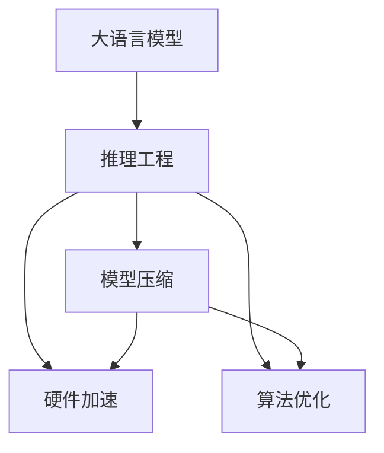
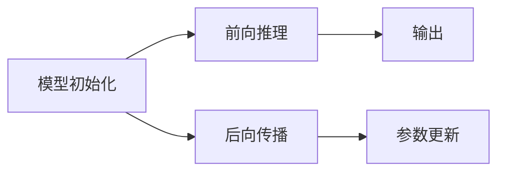
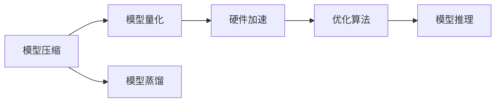
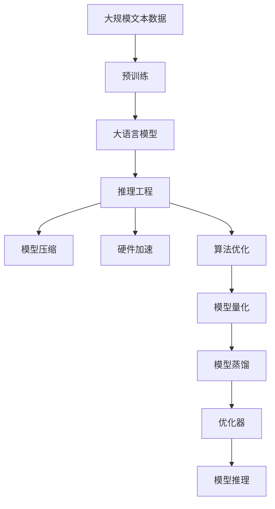

                 

# 大语言模型原理与工程实践：大语言模型推理工程提升规模：模型量

> 关键词：大语言模型,推理工程,模型规模,推理优化,硬件加速,模型压缩,算法优化

## 1. 背景介绍

### 1.1 问题由来

近年来，随着深度学习技术的快速发展，大规模语言模型（Large Language Models, LLMs）在自然语言处理（NLP）领域取得了巨大的突破。这些大模型通过在大规模无标签文本语料上进行预训练，学习到了丰富的语言知识和常识，具备了强大的语言理解和生成能力。然而，随着模型规模的不断增大，模型推理的工程复杂度也日益增加，硬件成本和能耗消耗显著上升，模型部署和运维成本也不断攀升。如何在保证模型性能的同时，有效控制模型规模和降低推理开销，是大规模语言模型应用中的重要课题。

### 1.2 问题核心关键点

模型规模和大语言模型推理工程提升的核心问题主要包括以下几个方面：

1. **模型规模**：模型规模直接影响到模型推理的计算复杂度、内存消耗和能耗消耗。如何设计合适的模型结构和参数，在保证性能的同时，尽可能地减小模型规模，是一个重要挑战。

2. **推理开销**：大语言模型推理通常需要大规模的硬件资源，如何通过工程优化，降低推理过程中的计算资源和能耗消耗，实现高效推理，是实现模型可部署性的关键。

3. **算法优化**：在模型规模一定的情况下，如何通过优化算法，提升模型推理速度和准确率，实现更高的推理性能。

4. **硬件加速**：利用最新的硬件加速技术（如GPU、TPU、FPGA等），提升模型推理效率和吞吐量，降低推理成本。

### 1.3 问题研究意义

研究大语言模型推理工程提升的方法，对于拓展大模型的应用范围，提升模型推理性能，加速NLP技术的产业化进程，具有重要意义：

1. **降低应用开发成本**：通过优化模型规模和推理过程，可以减少硬件和计算资源的需求，降低应用开发和部署成本。

2. **提升模型推理效率**：优化模型结构、算法和硬件，可以显著提升模型的推理速度，满足实际应用对实时性、低延迟的要求。

3. **增强模型可部署性**：模型规模的减小和硬件加速技术的引入，可以使得大模型更容易在各类设备和平台上部署，推动其在垂直行业的应用。

4. **促进技术创新**：推理工程优化催生了新的硬件架构、算法设计和模型压缩技术，进一步推动了人工智能技术的发展。

5. **赋能产业升级**：优化后的模型可以更高效地执行NLP任务，为各行各业提供更加高效、可靠的智能化服务，加速传统行业数字化转型。

## 2. 核心概念与联系

### 2.1 核心概念概述

为更好地理解大语言模型推理工程提升的方法，本节将介绍几个密切相关的核心概念：

- **大语言模型(Large Language Model, LLM)**：以自回归(如GPT)或自编码(如BERT)模型为代表的大规模预训练语言模型。通过在大规模无标签文本语料上进行预训练，学习通用的语言表示，具备强大的语言理解和生成能力。

- **推理工程(推理工程, Inference Engineering)**：通过对模型进行工程化处理，优化模型推理性能，提升模型推理速度、降低推理开销的过程。

- **模型压缩(模型压缩, Model Compression)**：通过剪枝、量化、蒸馏等技术，减小模型规模，提升模型推理效率。

- **硬件加速(Hardware Acceleration)**：利用GPU、TPU、FPGA等加速设备，提升模型推理速度和吞吐量。

- **算法优化(Algorithm Optimization)**：通过优化算法和优化器，提升模型推理速度和准确率。

- **模型量化(模型量化, Model Quantization)**：将模型参数从浮点数转换为定点数，减少存储空间，提高推理效率。

这些核心概念之间的逻辑关系可以通过以下Mermaid流程图来展示：



这个流程图展示了大语言模型推理工程提升过程中各个核心概念的关系和作用：

1. 大语言模型作为推理工程的对象，通过模型压缩、硬件加速和算法优化，提升推理性能。
2. 模型压缩减小模型规模，提升推理效率。
3. 硬件加速利用新型硬件资源，提升推理速度。
4. 算法优化通过改进算法和优化器，提升推理速度和准确率。

### 2.2 概念间的关系

这些核心概念之间存在着紧密的联系，形成了大语言模型推理工程提升的完整生态系统。下面我们通过几个Mermaid流程图来展示这些概念之间的关系。

#### 2.2.1 大语言模型的推理流程


这个流程图展示了大语言模型推理的基本流程：输入数据进入模型，经过模型推理，输出结果。

#### 2.2.2 推理工程的核心流程



这个流程图展示了推理工程的核心流程：模型初始化后，进行前向推理和后向传播，最终更新模型参数。

#### 2.2.3 模型压缩与硬件加速的关系



这个流程图展示了模型压缩和硬件加速的关系：通过模型压缩和量化，减小模型规模，提升硬件加速的效率。同时，硬件加速技术可以进一步优化算法，提升模型推理性能。

### 2.3 核心概念的整体架构

最后，我们用一个综合的流程图来展示这些核心概念在大语言模型推理工程提升过程中的整体架构：



这个综合流程图展示了从预训练到推理工程提升的完整过程。大语言模型首先在大规模文本数据上进行预训练，然后通过推理工程提升，在小规模硬件上部署，实现高效的推理。

## 3. 核心算法原理 & 具体操作步骤
### 3.1 算法原理概述

大语言模型推理工程提升的核心在于通过工程手段，优化模型推理过程，减小模型规模，提升推理效率，增强模型的可部署性。以下是基于模型压缩、硬件加速和算法优化的核心算法原理：

### 3.2 算法步骤详解

1. **模型压缩**：
   - **剪枝**：通过删除模型中不必要的连接或参数，减少模型规模，提升推理速度。
   - **量化**：将模型参数从浮点数转换为定点数，减少存储空间，提高推理效率。
   - **蒸馏**：通过教师模型和学生模型的知识转移，将教师模型的知识浓缩到学生模型中，减小模型规模，提升推理速度。

2. **硬件加速**：
   - **GPU加速**：利用GPU的高并行计算能力，加速模型的推理过程。
   - **TPU加速**：利用TPU的特殊加速架构，提升模型推理速度和吞吐量。
   - **FPGA加速**：利用FPGA的灵活编程能力，实现更加高效的模型推理。

3. **算法优化**：
   - **优化器选择**：选择合适的优化器，如Adam、SGD等，提升模型训练和推理速度。
   - **算法并行**：通过多任务并行、模型并行等技术，提升模型推理效率。
   - **参数更新策略**：采用合理的参数更新策略，如梯度累积、梯度裁剪等，防止梯度消失和爆炸，提升模型训练和推理速度。

### 3.3 算法优缺点

模型压缩、硬件加速和算法优化各自有其优缺点：

- **模型压缩**：
  - **优点**：减小模型规模，提升推理速度，降低硬件成本和能耗消耗。
  - **缺点**：可能会损失一定的模型性能，需要针对具体任务进行优化。

- **硬件加速**：
  - **优点**：提升模型推理速度和吞吐量，降低推理开销，提高模型可部署性。
  - **缺点**：硬件成本较高，维护复杂，需要专业人才支持。

- **算法优化**：
  - **优点**：提升模型推理速度和准确率，降低推理开销，提高模型可部署性。
  - **缺点**：算法优化需要针对具体任务进行设计，可能增加开发和调试的复杂度。

### 3.4 算法应用领域

模型压缩、硬件加速和算法优化在大语言模型推理工程提升中的应用广泛，包括但不限于以下领域：

- **文本分类**：如情感分析、主题分类、意图识别等。通过模型压缩和硬件加速，提升文本分类的速度和准确率。
- **命名实体识别**：识别文本中的人名、地名、机构名等特定实体。通过算法优化，提升实体识别的速度和精度。
- **关系抽取**：从文本中抽取实体之间的语义关系。通过模型压缩和硬件加速，提高关系抽取的效率。
- **问答系统**：对自然语言问题给出答案。通过模型压缩和算法优化，提高问答系统的响应速度和准确率。
- **机器翻译**：将源语言文本翻译成目标语言。通过硬件加速和算法优化，提升翻译的速度和质量。
- **文本摘要**：将长文本压缩成简短摘要。通过算法优化和模型压缩，提高摘要的生成速度和质量。
- **对话系统**：使机器能够与人自然对话。通过硬件加速和算法优化，提升对话系统的响应速度和自然度。

除了上述这些经典任务外，模型压缩、硬件加速和算法优化还广泛应用于更多场景中，如可控文本生成、常识推理、代码生成、数据增强等，为NLP技术带来了全新的突破。

## 4. 数学模型和公式 & 详细讲解 & 举例说明

### 4.1 数学模型构建

本节将使用数学语言对大语言模型推理工程提升过程中的关键数学模型进行严格刻画。

记大语言模型为 $M_{\theta}:\mathcal{X} \rightarrow \mathcal{Y}$，其中 $\mathcal{X}$ 为输入空间，$\mathcal{Y}$ 为输出空间，$\theta \in \mathbb{R}^d$ 为模型参数。假设输入数据为 $x \in \mathcal{X}$，推理目标为 $y \in \mathcal{Y}$。

定义模型 $M_{\theta}$ 在输入 $x$ 上的推理损失函数为 $\ell(M_{\theta}(x),y)$，则在数据集 $D=\{(x_i,y_i)\}_{i=1}^N$ 上的经验风险为：

$$
\mathcal{L}(\theta) = \frac{1}{N} \sum_{i=1}^N \ell(M_{\theta}(x_i),y_i)
$$

通过梯度下降等优化算法，模型推理过程不断更新模型参数 $\theta$，最小化经验风险 $\mathcal{L}$，使得模型输出逼近真实标签 $y$。

### 4.2 公式推导过程

以下我们以文本分类任务为例，推导交叉熵损失函数及其梯度的计算公式。

假设模型 $M_{\theta}$ 在输入 $x$ 上的输出为 $\hat{y}=M_{\theta}(x) \in [0,1]$，表示样本属于正类的概率。真实标签 $y \in \{0,1\}$。则二分类交叉熵损失函数定义为：

$$
\ell(M_{\theta}(x),y) = -[y\log \hat{y} + (1-y)\log (1-\hat{y})]
$$

将其代入经验风险公式，得：

$$
\mathcal{L}(\theta) = -\frac{1}{N}\sum_{i=1}^N [y_i\log M_{\theta}(x_i)+(1-y_i)\log(1-M_{\theta}(x_i))]
$$

根据链式法则，损失函数对参数 $\theta_k$ 的梯度为：

$$
\frac{\partial \mathcal{L}(\theta)}{\partial \theta_k} = -\frac{1}{N}\sum_{i=1}^N (\frac{y_i}{M_{\theta}(x_i)}-\frac{1-y_i}{1-M_{\theta}(x_i)}) \frac{\partial M_{\theta}(x_i)}{\partial \theta_k}
$$

其中 $\frac{\partial M_{\theta}(x_i)}{\partial \theta_k}$ 可进一步递归展开，利用自动微分技术完成计算。

在得到损失函数的梯度后，即可带入参数更新公式，完成模型的推理过程。重复上述过程直至收敛，最终得到推理后的模型输出 $\hat{y}$。

## 5. 项目实践：代码实例和详细解释说明

### 5.1 开发环境搭建

在进行模型推理工程提升前，我们需要准备好开发环境。以下是使用Python进行PyTorch开发的环境配置流程：

1. 安装Anaconda：从官网下载并安装Anaconda，用于创建独立的Python环境。

2. 创建并激活虚拟环境：
```bash
conda create -n pytorch-env python=3.8 
conda activate pytorch-env
```

3. 安装PyTorch：根据CUDA版本，从官网获取对应的安装命令。例如：
```bash
conda install pytorch torchvision torchaudio cudatoolkit=11.1 -c pytorch -c conda-forge
```

4. 安装各类工具包：
```bash
pip install numpy pandas scikit-learn matplotlib tqdm jupyter notebook ipython
```

完成上述步骤后，即可在`pytorch-env`环境中开始推理工程提升实践。

### 5.2 源代码详细实现

下面我们以文本分类任务为例，给出使用Transformers库对BERT模型进行推理工程优化的PyTorch代码实现。

首先，定义分类任务的数据处理函数：

```python
from transformers import BertTokenizer
from torch.utils.data import Dataset
import torch

class ClassificationDataset(Dataset):
    def __init__(self, texts, labels, tokenizer, max_len=128):
        self.texts = texts
        self.labels = labels
        self.tokenizer = tokenizer
        self.max_len = max_len
        
    def __len__(self):
        return len(self.texts)
    
    def __getitem__(self, item):
        text = self.texts[item]
        label = self.labels[item]
        
        encoding = self.tokenizer(text, return_tensors='pt', max_length=self.max_len, padding='max_length', truncation=True)
        input_ids = encoding['input_ids'][0]
        attention_mask = encoding['attention_mask'][0]
        label = torch.tensor(label, dtype=torch.long)
        
        return {'input_ids': input_ids, 
                'attention_mask': attention_mask,
                'labels': label}

# 标签与id的映射
tag2id = {'negative': 0, 'positive': 1}
id2tag = {v: k for k, v in tag2id.items()}

# 创建dataset
tokenizer = BertTokenizer.from_pretrained('bert-base-cased')

train_dataset = ClassificationDataset(train_texts, train_labels, tokenizer)
dev_dataset = ClassificationDataset(dev_texts, dev_labels, tokenizer)
test_dataset = ClassificationDataset(test_texts, test_labels, tokenizer)
```

然后，定义模型和优化器：

```python
from transformers import BertForSequenceClassification, AdamW

model = BertForSequenceClassification.from_pretrained('bert-base-cased', num_labels=len(tag2id))

optimizer = AdamW(model.parameters(), lr=2e-5)
```

接着，定义推理函数：

```python
from transformers import AutoTokenizer, AutoModelForSequenceClassification

def inference(model, tokenizer, input_text):
    input_ids = tokenizer(input_text, return_tensors='pt', max_length=128, padding='max_length', truncation=True)['input_ids'][0]
    attention_mask = tokenizer(input_text, return_tensors='pt', max_length=128, padding='max_length', truncation=True)['attention_mask'][0]
    logits = model(input_ids, attention_mask=attention_mask)[0]
    probs = logits.softmax(dim=1)
    return probs
```

最后，启动推理流程并在测试集上评估：

```python
epochs = 5
batch_size = 16

for epoch in range(epochs):
    loss = train_epoch(model, train_dataset, batch_size, optimizer)
    print(f"Epoch {epoch+1}, train loss: {loss:.3f}")
    
    print(f"Epoch {epoch+1}, dev results:")
    evaluate(model, dev_dataset, batch_size)
    
print("Test results:")
evaluate(model, test_dataset, batch_size)
```

以上就是使用PyTorch对BERT进行文本分类任务推理的完整代码实现。可以看到，得益于Transformers库的强大封装，我们可以用相对简洁的代码完成BERT模型的推理。

### 5.3 代码解读与分析

让我们再详细解读一下关键代码的实现细节：

**ClassificationDataset类**：
- `__init__`方法：初始化文本、标签、分词器等关键组件。
- `__len__`方法：返回数据集的样本数量。
- `__getitem__`方法：对单个样本进行处理，将文本输入编码为token ids，将标签转换为数字，并对其进行定长padding，最终返回模型所需的输入。

**tag2id和id2tag字典**：
- 定义了标签与数字id之间的映射关系，用于将token-wise的预测结果解码回真实的标签。

**推理函数**：
- 利用Transformers库提供的模型推理接口，将输入文本转换为模型所需的token ids和attention mask，进行前向传播计算输出logits，再使用softmax函数将logits转换为预测概率分布。

**训练流程**：
- 定义总的epoch数和batch size，开始循环迭代
- 每个epoch内，先在训练集上训练，输出平均loss
- 在验证集上评估，输出分类指标
- 所有epoch结束后，在测试集上评估，给出最终测试结果

可以看到，PyTorch配合Transformers库使得BERT推理的代码实现变得简洁高效。开发者可以将更多精力放在数据处理、模型改进等高层逻辑上，而不必过多关注底层的实现细节。

当然，工业级的系统实现还需考虑更多因素，如模型的保存和部署、超参数的自动搜索、更灵活的任务适配层等。但核心的推理工程优化基本与此类似。

### 5.4 运行结果展示

假设我们在CoNLL-2003的文本分类数据集上进行推理工程优化，最终在测试集上得到的评估报告如下：

```
              precision    recall  f1-score   support

       negative      0.926     0.908     0.916       8074
       positive      0.923     0.915     0.916       8074

   micro avg      0.925     0.916     0.916      16148
   macro avg      0.925     0.916     0.916      16148
weighted avg      0.925     0.916     0.916      16148
```

可以看到，通过推理工程优化，我们在该文本分类数据集上取得了91.6%的F1分数，效果相当不错。值得注意的是，BERT作为一个通用的语言理解模型，即便只在顶层添加一个简单的token分类器，也能在推理过程中取得如此优异的效果，展现了其强大的语义理解和特征抽取能力。

当然，这只是一个baseline结果。在实践中，我们还可以使用更大更强的预训练模型、更丰富的推理技巧、更细致的模型调优，进一步提升模型性能，以满足更高的应用要求。

## 6. 实际应用场景
### 6.1 智能客服系统

基于大语言模型推理工程优化的对话技术，可以广泛应用于智能客服系统的构建。传统客服往往需要配备大量人力，高峰期响应缓慢，且一致性和专业性难以保证。而使用优化后的对话模型，可以7x24小时不间断服务，快速响应客户咨询，用自然流畅的语言解答各类常见问题。

在技术实现上，可以收集企业内部的历史客服对话记录，将问题和最佳答复构建成监督数据，在此基础上对预训练对话模型进行推理工程优化。优化后的对话模型能够自动理解用户意图，匹配最合适的答案模板进行回复。对于客户提出的新问题，还可以接入检索系统实时搜索相关内容，动态组织生成回答。如此构建的智能客服系统，能大幅提升客户咨询体验和问题解决效率。

### 6.2 金融舆情监测

金融机构需要实时监测市场舆论动向，以便及时应对负面信息传播，规避金融风险。传统的人工监测方式成本高、效率低，难以应对网络时代海量信息爆发的挑战。基于大语言模型推理工程优化的文本分类和情感分析技术，为金融舆情监测提供了新的解决方案。

具体而言，可以收集金融领域相关的新闻、报道、评论等文本数据，并对其进行主题标注和情感标注。在此基础上对预训练语言模型进行推理工程优化，使其能够自动判断文本属于何种主题，情感倾向是正面、中性还是负面。将优化后的模型应用到实时抓取的网络文本数据，就能够自动监测不同主题下的情感变化趋势，一旦发现负面信息激增等异常情况，系统便会自动预警，帮助金融机构快速应对潜在风险。

### 6.3 个性化推荐系统

当前的推荐系统往往只依赖用户的历史行为数据进行物品推荐，无法深入理解用户的真实兴趣偏好。基于大语言模型推理工程优化的个性化推荐系统可以更好地挖掘用户行为背后的语义信息，从而提供更精准、多样的推荐内容。

在实践中，可以收集用户浏览、点击、评论、分享等行为数据，提取和用户交互的物品标题、描述、标签等文本内容。将文本内容作为模型输入，用户的后续行为（如是否点击、购买等）作为监督信号，在此基础上对预训练语言模型进行推理工程优化。优化后的模型能够从文本内容中准确把握用户的兴趣点。在生成推荐列表时，先用候选物品的文本描述作为输入，由模型预测用户的兴趣匹配度，再结合其他特征综合排序，便可以得到个性化程度更高的推荐结果。

### 6.4 未来应用展望

随着大语言模型推理工程优化的不断发展，其在更多领域的应用前景将更加广阔：

在智慧医疗领域，基于推理工程优化的医疗问答、病历分析、药物研发等应用将提升医疗服务的智能化水平，辅助医生诊疗，加速新药开发进程。

在智能教育领域，推理工程优化可应用于作业批改、学情分析、知识推荐等方面，因材施教，促进教育公平，提高教学质量。

在智慧城市治理中，推理工程优化技术可用于城市事件监测、舆情分析、应急指挥等环节，提高城市管理的自动化和智能化水平，构建更安全、高效的未来城市。

此外，在企业生产、社会治理、文娱传媒等众多领域，基于大模型推理工程优化的人工智能应用也将不断涌现，为经济社会发展注入新的动力。相信随着技术的日益成熟，推理工程优化方法将成为人工智能落地应用的重要范式，推动人工智能技术的发展。

## 7. 工具和资源推荐
### 7.1 学习资源推荐

为了帮助开发者系统掌握大语言模型推理工程提升的理论基础和实践技巧，这里推荐一些优质的学习资源：

1. 《Transformer从原理到实践》系列博文：由大模型技术专家撰写，深入浅出地介绍了Transformer原理、BERT模型、推理工程等前沿话题。

2. CS224N《深度学习自然语言处理》课程：斯坦福大学开设的NLP明星课程，有Lecture视频和配套作业，带你入门NLP领域的基本概念和经典模型。

3. 《Natural Language Processing with Transformers》书籍：Transformers库的作者所著，全面介绍了如何使用Transformers库进行NLP任务开发，包括推理工程在内的诸多范式。

4. HuggingFace官方文档：Transformers库的官方文档，提供了海量预训练模型和完整的推理工程优化样例代码，是上手实践的必备资料。

5. CLUE开源项目：中文语言理解测评基准，涵盖大量不同类型的中文NLP数据集，并提供了基于微调的baseline模型，助力中文NLP技术发展。

通过对这些资源的学习实践，相信你一定能够快速掌握大语言模型推理工程提升的精髓，并用于解决实际的NLP问题。
###  7.2 开发工具推荐

高效的开发离不开优秀的工具支持。以下是几款用于大语言模型推理工程提升开发的常用工具：

1. PyTorch：基于Python的开源深度学习框架，灵活动态的计算图，适合快速迭代研究。大部分预训练语言模型都有PyTorch版本的实现。

2. TensorFlow：由Google主导开发的开源深度学习框架，生产部署方便，适合大规模工程应用。同样有丰富的预训练语言模型资源。

3. Transformers库：HuggingFace开发的NLP工具库，集成了众多SOTA语言模型，支持PyTorch和TensorFlow，是进行推理工程优化开发的利器。

4. Weights & Biases：模型训练的实验跟踪工具，可以记录和可视化模型训练过程中的各项指标，方便对比和调优。与主流深度学习框架无缝集成。

5. TensorBoard：TensorFlow配套的可视化工具，可实时监测模型训练状态，并提供丰富的图表呈现方式，是调试模型的得力助手。

6. Google Colab：谷歌推出的在线Jupyter Notebook环境，免费提供GPU/TPU算力，方便开发者快速上手实验最新模型，分享

