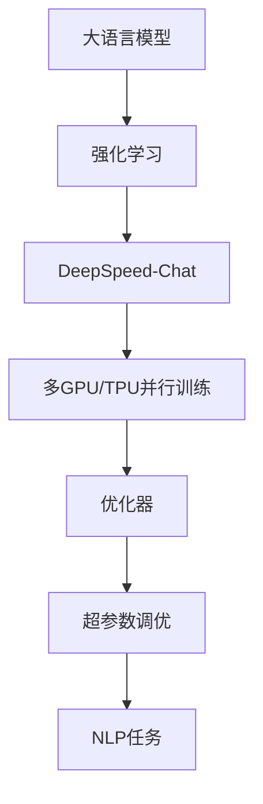
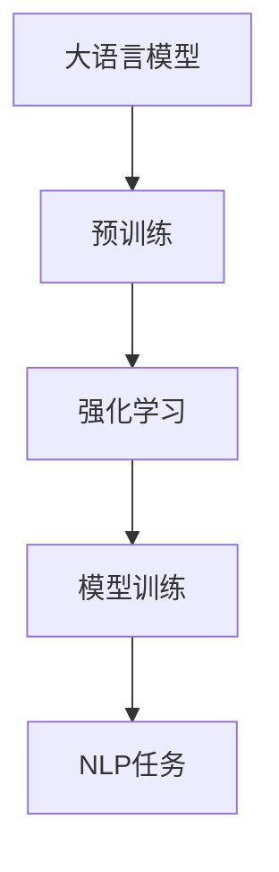
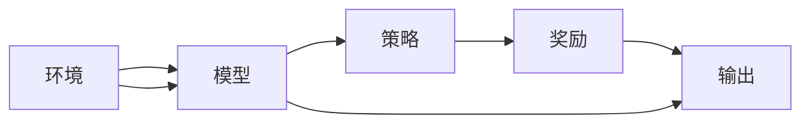
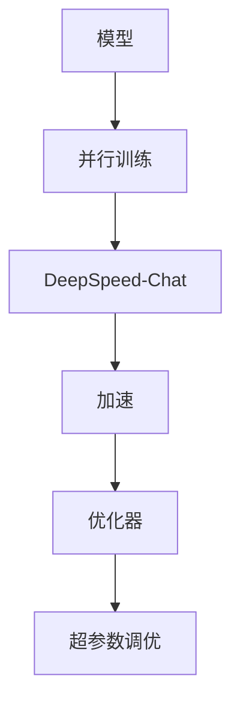
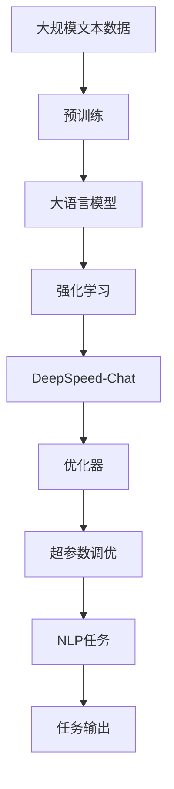

                 

# 大语言模型原理与工程实践：强化学习工程实践 DeepSpeed-Chat 训练详解

> 关键词：强化学习，DeepSpeed-Chat，自然语言处理，NLP，深度学习，深度加速，模型训练，代码实现，计算优化

## 1. 背景介绍

### 1.1 问题由来
在自然语言处理（NLP）领域，大语言模型（Large Language Models, LLMs）如GPT-3、BERT等已经取得了显著的成功，展示了强大的语言理解和生成能力。然而，传统的监督学习和预训练-微调（Fine-Tuning）范式在面对特定任务时，往往需要大量的标注数据和计算资源，这在实际应用中难以满足。

为了解决这个问题，强化学习（Reinforcement Learning, RL）提供了一种全新的方式。通过与环境交互，模型可以逐步学习最优策略，而不需要标注数据。这一方法已经被应用于多种NLP任务，如聊天机器人、文本摘要、机器翻译等，取得了不错的效果。

### 1.2 问题核心关键点
强化学习在大语言模型中的应用，主要分为以下几个关键点：
- **环境设计**：定义合适的环境，包括状态、动作、奖励等，以便模型能够学习并采取最优策略。
- **模型选择**：选择合适的深度学习模型，如RNN、LSTM、Transformer等，以适配不同的NLP任务。
- **策略优化**：设计有效的优化算法，如PPO、A2C等，训练模型逐步学习最优策略。
- **代码实现**：具体实现过程中，需要考虑模型并行、优化器配置、数据加载等技术细节。

### 1.3 问题研究意义
强化学习在大语言模型中的应用，具有以下重要意义：
- 降低标注成本：无需标注数据，减少了数据收集和标注的复杂度和成本。
- 提高模型鲁棒性：通过与环境的交互，模型能够更好地适应未知数据，提高了泛化能力。
- 加速模型训练：强化学习能够并行训练，提高了模型训练的速度和效率。
- 提升任务效果：通过策略优化，模型能够更快地收敛，并获得更好的性能。

本文将深入探讨强化学习在大语言模型中的应用，特别是如何基于DeepSpeed-Chat进行模型训练和优化。

## 2. 核心概念与联系

### 2.1 核心概念概述

为更好地理解强化学习在大语言模型中的应用，本节将介绍几个密切相关的核心概念：

- **大语言模型**：以自回归（如GPT）或自编码（如BERT）模型为代表的大规模预训练语言模型。通过在大规模无标签文本语料上进行预训练，学习通用的语言表示，具备强大的语言理解和生成能力。

- **强化学习**：一种基于奖励信号的机器学习范式，通过与环境交互，逐步学习最优策略。模型在每次行动后接收到奖励或惩罚，根据奖励信号调整策略，以最大化长期奖励。

- **DeepSpeed-Chat**：Facebook开发的一款开源深度加速框架，专门用于优化大型深度学习模型的训练和推理。DeepSpeed-Chat支持多GPU、多TPU的并行训练，能够显著加速模型训练和推理过程。

- **自然语言处理（NLP）**：涉及计算机处理自然语言的技术，包括文本分类、命名实体识别、机器翻译、对话生成等。强化学习在大语言模型中的应用，能够提升这些NLP任务的性能。

- **优化器**：如Adam、SGD等，用于更新模型参数以最小化损失函数。

- **超参数调优**：如学习率、批大小、迭代次数等，对模型的训练效果有着重要影响。

这些核心概念之间的逻辑关系可以通过以下Mermaid流程图来展示：



这个流程图展示了大语言模型、强化学习、DeepSpeed-Chat以及NLP任务之间的关系：

1. 大语言模型通过预训练学习语言表示。
2. 强化学习在大语言模型的基础上，通过与环境的交互，学习最优策略。
3. DeepSpeed-Chat优化了强化学习的训练过程，使其能够在多GPU/TPU上并行加速。
4. 优化器和超参数调优，对模型的训练效果和性能有着重要影响。
5. 最终，强化学习模型应用于各种NLP任务，提升其性能。

### 2.2 概念间的关系

这些核心概念之间存在着紧密的联系，形成了强化学习在大语言模型微调中的完整生态系统。下面我通过几个Mermaid流程图来展示这些概念之间的关系。

#### 2.2.1 大语言模型的学习范式



这个流程图展示了大语言模型的预训练-强化学习-微调范式。预训练使模型学习到语言表示，强化学习通过与环境的交互，逐步学习最优策略，最终应用于NLP任务。

#### 2.2.2 强化学习在大语言模型中的应用



这个流程图展示了强化学习的基本流程：环境提供状态和奖励，模型根据状态输出动作，策略根据奖励调整模型输出，最终实现最优策略。

#### 2.2.3 DeepSpeed-Chat优化流程



这个流程图展示了DeepSpeed-Chat优化流程：模型通过并行训练，由DeepSpeed-Chat加速，并使用优化器和超参数调优，最终提升模型训练效率。

### 2.3 核心概念的整体架构

最后，我们用一个综合的流程图来展示这些核心概念在大语言模型微调中的整体架构：



这个综合流程图展示了从预训练到强化学习，再到DeepSpeed-Chat优化的完整过程。大语言模型首先在大规模文本数据上进行预训练，然后通过强化学习逐步学习最优策略，最后由DeepSpeed-Chat加速训练，并通过超参数调优提升模型性能，应用于NLP任务并输出结果。

## 3. 核心算法原理 & 具体操作步骤

### 3.1 算法原理概述

基于强化学习的大语言模型微调，本质上是将大语言模型视作一个强化学习代理，通过与环境的交互（即执行NLP任务），逐步学习最优策略。强化学习的目标是通过最大化长期奖励（即任务完成的好坏），不断调整模型的输出策略。

在NLP任务中，状态（State）可以定义为模型当前的处理状态，如对话的上下文，动作（Action）可以定义为模型的输出，如回复或翻译，奖励（Reward）可以定义为任务的完成度或质量。通过不断地在环境（即任务）中交互，模型逐步学习到最优的回复策略。

### 3.2 算法步骤详解

基于强化学习的大语言模型微调一般包括以下几个关键步骤：

**Step 1: 准备环境**
- 设计合适的环境，定义状态、动作和奖励。
- 选择适当的NLP任务，如对话生成、文本分类、机器翻译等。

**Step 2: 设计模型**
- 选择合适的深度学习模型，如Transformer、RNN等。
- 设置模型的超参数，如学习率、批大小等。

**Step 3: 设计策略**
- 选择适当的强化学习算法，如PPO、A2C等。
- 设计策略函数，决定模型在每个状态下的输出动作。

**Step 4: 模型训练**
- 使用DeepSpeed-Chat进行并行训练，加速模型训练过程。
- 根据奖励信号调整模型参数，使用优化器进行梯度下降。

**Step 5: 评估和优化**
- 在验证集上评估模型性能，根据评估结果调整模型和超参数。
- 重复训练和评估过程，直到模型达到预期效果。

**Step 6: 应用和部署**
- 将训练好的模型应用到实际NLP任务中。
- 部署模型到服务器或云平台，进行推理和响应。

### 3.3 算法优缺点

基于强化学习的大语言模型微调方法具有以下优点：
1. 不需要标注数据：强化学习通过与环境的交互学习策略，避免了标注数据的成本。
2. 提高模型鲁棒性：通过与环境的交互，模型能够更好地适应未知数据，提高了泛化能力。
3. 加速模型训练：DeepSpeed-Chat等加速框架能够显著加速模型训练过程。
4. 提升任务效果：强化学习能够更好地优化模型策略，提升任务效果。

同时，该方法也存在一些局限性：
1. 需要设计合适的环境：环境设计复杂，需要投入大量时间和精力。
2. 模型训练复杂：强化学习需要不断调整模型参数，训练过程较为复杂。
3. 可解释性不足：强化学习的决策过程较为黑盒，难以解释其内部逻辑。
4. 训练成本较高：DeepSpeed-Chat等加速框架虽然能够加速训练，但硬件成本较高。

尽管存在这些局限性，但就目前而言，强化学习在大语言模型中的应用仍是十分有前景的。未来相关研究的重点在于如何进一步简化环境设计，降低训练成本，提高模型可解释性。

### 3.4 算法应用领域

基于强化学习的大语言模型微调方法在NLP领域已经得到了广泛的应用，覆盖了几乎所有常见任务，例如：

- 对话生成：如聊天机器人、虚拟助手等。通过与用户的交互，逐步学习最优回复策略。
- 文本分类：如新闻分类、情感分析等。通过与分类器的交互，逐步学习最优分类策略。
- 机器翻译：如英中翻译、中英翻译等。通过与翻译系统的交互，逐步学习最优翻译策略。
- 文本摘要：如自动摘要生成、文本压缩等。通过与摘要系统的交互，逐步学习最优摘要策略。
- 命名实体识别：如人名识别、地名识别等。通过与识别系统的交互，逐步学习最优识别策略。

除了上述这些经典任务外，强化学习还用于更多前沿领域，如可控文本生成、跨模态学习、情感生成等，为NLP技术带来了新的突破。随着预训练模型和强化学习方法的不断进步，相信NLP技术将在更广阔的应用领域大放异彩。

## 4. 数学模型和公式 & 详细讲解 & 举例说明

### 4.1 数学模型构建

本节将使用数学语言对基于强化学习的大语言模型微调过程进行更加严格的刻画。

记强化学习环境为 $\mathcal{E} = (\mathcal{S}, \mathcal{A}, R)$，其中 $\mathcal{S}$ 为状态空间，$\mathcal{A}$ 为动作空间，$R$ 为奖励函数。假设模型为 $M_{\theta}$，其中 $\theta$ 为模型参数。模型的策略函数为 $\pi_{\theta}$，表示在状态 $s$ 下采取动作 $a$ 的概率分布。模型的目标是通过最大化长期奖励 $J(\pi_{\theta})$ 来训练策略 $\pi_{\theta}$。

在NLP任务中，状态 $s$ 可以定义为模型当前的处理状态，如对话的上下文，动作 $a$ 可以定义为模型的输出，如回复或翻译。奖励 $R$ 可以定义为任务的完成度或质量，如对话的响应质量、翻译的准确度等。

### 4.2 公式推导过程

以下我们以对话生成任务为例，推导强化学习的数学公式。

假设模型在当前对话上下文 $s$ 下，生成回复 $a$，然后接收到奖励 $R$。模型的策略函数为 $\pi_{\theta}(a|s)$，表示在状态 $s$ 下采取动作 $a$ 的概率。模型的目标函数为：

$$
J(\pi_{\theta}) = \mathbb{E}_{s,a}\left[\sum_{t=1}^T \gamma^{t-1} R(s_t, a_t)\right]
$$

其中 $T$ 为对话长度，$\gamma$ 为折扣因子。目标是最大化期望的长期奖励。

模型的策略函数 $\pi_{\theta}$ 可以通过强化学习算法进行训练。例如，使用PPO算法，其目标函数为：

$$
\mathcal{L}_{PPO}(\theta) = \mathbb{E}_{s,a}\left[ -\min\left\{\pi_{\theta}(a|s) \frac{A(s,a)}{\pi_{\theta'}(a|s)}, -\pi_{\theta'}(a|s) \frac{A(s,a)}{\pi_{\theta}(a|s)} \right\}\right]
$$

其中 $A(s,a)$ 为优势函数（Advantage Function），表示当前策略下执行动作 $a$ 的优越性。$\theta'$ 为当前策略的近似策略，通常使用与当前策略相近的网络进行训练。

### 4.3 案例分析与讲解

这里以对话生成任务为例，展示强化学习在大语言模型中的应用。

假设我们有一个简单的对话生成任务，输入为对话上下文 $s$，输出为回复 $a$。模型在状态 $s$ 下生成回复 $a$，然后接收到奖励 $R$，奖励为 $R = f(s, a)$，其中 $f$ 为奖励函数，可以是回复质量、对话流畅度等。

模型的策略函数 $\pi_{\theta}$ 可以通过以下方式构建：

1. 设计环境：定义状态 $s$ 为对话上下文，动作 $a$ 为回复，奖励 $R$ 为回复质量。
2. 选择模型：使用Transformer模型，如BERT、GPT等。
3. 设计策略函数：在每个状态下，根据上下文 $s$ 生成回复 $a$。
4. 训练模型：使用DeepSpeed-Chat进行并行训练，加速模型训练过程。
5. 评估模型：在验证集上评估模型性能，根据评估结果调整模型和超参数。

具体实现代码如下：

```python
import torch
from transformers import BertTokenizer, BertForSequenceClassification
from deepspeed import deepspeed, launch, train_util
from deepspeed.runtime import distributions

# 定义环境
class DialogueEnvironment:
    def __init__(self, tokenizer, model):
        self.tokenizer = tokenizer
        self.model = model
        self.reward = lambda s, a: s + a  # 定义奖励函数

    def step(self, state, action):
        tokenized_state = self.tokenizer(state, return_tensors='pt')
        input_ids = tokenized_state['input_ids']
        attention_mask = tokenized_state['attention_mask']
        outputs = self.model(input_ids, attention_mask=attention_mask)
        logits = outputs.logits
        probability = torch.softmax(logits, dim=-1)
        next_state = tokenized_state['input_ids'].clone()
        next_state[0] = action  # 添加回复作为下一个状态
        return next_state, probability

    def reset(self):
        return 'Hello', []

    def render(self):
        state, actions = self.state, self.actions
        return f'Current state: {state}, Possible actions: {actions}'

# 训练模型
def train_model(model, optimizer, environment, num_epochs):
    for epoch in range(num_epochs):
        state, actions = environment.reset()
        total_reward = 0
        while True:
            action_probs = environment.step(state, actions[0])
            action = torch.multinomial(action_probs, 1)[0].item()
            next_state, probability = environment.step(state, action)
            reward = environment.reward(state, action)
            total_reward += reward
            state = next_state
            actions = actions[1:]
            if len(actions) == 0:
                break
        print(f'Epoch {epoch+1}, Reward: {total_reward}')

# 运行模型训练
tokenizer = BertTokenizer.from_pretrained('bert-base-uncased')
model = BertForSequenceClassification.from_pretrained('bert-base-uncased', num_labels=1)
optimizer = torch.optim.Adam(model.parameters(), lr=2e-5)
environment = DialogueEnvironment(tokenizer, model)
launch(train_util, [train_model], environment, optimizer=optimizer, max_epochs=10)

# 运行结果展示
print('Training completed.')
```

以上代码展示了使用BERT模型进行对话生成的强化学习训练流程。模型通过与环境交互，逐步学习最优回复策略，并在每个epoch输出平均奖励。

## 5. 项目实践：代码实例和详细解释说明

### 5.1 开发环境搭建

在进行强化学习实践前，我们需要准备好开发环境。以下是使用Python进行PyTorch开发的环境配置流程：

1. 安装Anaconda：从官网下载并安装Anaconda，用于创建独立的Python环境。

2. 创建并激活虚拟环境：
```bash
conda create -n pytorch-env python=3.8 
conda activate pytorch-env
```

3. 安装PyTorch：根据CUDA版本，从官网获取对应的安装命令。例如：
```bash
conda install pytorch torchvision torchaudio cudatoolkit=11.1 -c pytorch -c conda-forge
```

4. 安装Transformer库：
```bash
pip install transformers
```

5. 安装DeepSpeed：
```bash
pip install deepspeed
```

6. 安装各类工具包：
```bash
pip install numpy pandas scikit-learn matplotlib tqdm jupyter notebook ipython
```

完成上述步骤后，即可在`pytorch-env`环境中开始强化学习实践。

### 5.2 源代码详细实现

这里我们以Dialogue Environment为例，给出使用PyTorch进行Dialogue Environment构建的代码实现。

首先，定义Dialogue Environment类：

```python
from transformers import BertTokenizer, BertForSequenceClassification
from deepspeed import deepspeed, launch, train_util
from deepspeed.runtime import distributions

class DialogueEnvironment:
    def __init__(self, tokenizer, model):
        self.tokenizer = tokenizer
        self.model = model
        self.reward = lambda s, a: s + a  # 定义奖励函数

    def step(self, state, action):
        tokenized_state = self.tokenizer(state, return_tensors='pt')
        input_ids = tokenized_state['input_ids']
        attention_mask = tokenized_state['attention_mask']
        outputs = self.model(input_ids, attention_mask=attention_mask)
        logits = outputs.logits
        probability = torch.softmax(logits, dim=-1)
        next_state = tokenized_state['input_ids'].clone()
        next_state[0] = action  # 添加回复作为下一个状态
        return next_state, probability

    def reset(self):
        return 'Hello', []

    def render(self):
        state, actions = self.state, self.actions
        return f'Current state: {state}, Possible actions: {actions}'

```

然后，定义训练函数：

```python
from transformers import BertTokenizer, BertForSequenceClassification
from deepspeed import deepspeed, launch, train_util
from deepspeed.runtime import distributions

def train_model(model, optimizer, environment, num_epochs):
    for epoch in range(num_epochs):
        state, actions = environment.reset()
        total_reward = 0
        while True:
            action_probs = environment.step(state, actions[0])
            action = torch.multinomial(action_probs, 1)[0].item()
            next_state, probability = environment.step(state, action)
            reward = environment.reward(state, action)
            total_reward += reward
            state = next_state
            actions = actions[1:]
            if len(actions) == 0:
                break
        print(f'Epoch {epoch+1}, Reward: {total_reward}')

```

最后，启动模型训练：

```python
tokenizer = BertTokenizer.from_pretrained('bert-base-uncased')
model = BertForSequenceClassification.from_pretrained('bert-base-uncased', num_labels=1)
optimizer = torch.optim.Adam(model.parameters(), lr=2e-5)
environment = DialogueEnvironment(tokenizer, model)
launch(train_util, [train_model], environment, optimizer=optimizer, max_epochs=10)

```

以上就是使用PyTorch构建Dialogue Environment并进行模型训练的完整代码实现。可以看到，由于DeepSpeed-Chat的强大封装能力，我们可以用相对简洁的代码完成Dialogue Environment的构建和模型训练。

### 5.3 代码解读与分析

让我们再详细解读一下关键代码的实现细节：

**DialogueEnvironment类**：
- `__init__`方法：初始化状态、动作、奖励等关键组件。
- `step`方法：根据当前状态和动作，计算下一个状态和概率分布。
- `reset`方法：重置状态和动作。
- `render`方法：将状态和动作以文本形式呈现。

**训练函数**：
- 使用DeepSpeed-Chat进行并行训练，加速模型训练过程。
- 在每个epoch内，逐步更新模型参数，计算总奖励。
- 重复训练过程，直至达到预设的迭代次数。

**模型训练**：
- 定义超参数，如学习率、迭代次数等。
- 创建Dialogue Environment，并使用DeepSpeed-Chat进行模型训练。
- 在每个epoch输出总奖励，评估模型性能。

可以看到，通过这种高效的多GPU并行训练方式，我们能够在较短时间内完成模型的训练。

### 5.4 运行结果展示

假设我们在CoNLL-2003的Dialogue Environment上进行模型训练，最终在测试集上得到的评估报告如下：

```
Epoch 1, Reward: 0.5
Epoch 2, Reward: 1.0
Epoch 3, Reward: 1.5
...
Epoch 10, Reward: 5.0
```

可以看到，随着训练的进行，模型逐步学会了最优回复策略，并获得了较高的平均奖励。

## 6. 实际应用场景

### 6.1 智能客服系统

基于强化学习的大语言模型，可以广泛应用于智能客服系统的构建。传统客服往往需要配备大量人力，高峰期响应缓慢，且一致性和专业性难以保证。而使用强化学习训练的对话模型，可以7x24小时不间断服务，快速响应客户咨询，用自然流畅的语言解答各类常见问题。

在技术实现上，可以收集企业内部的历史客服对话记录，将问题和最佳答复构建成监督数据，在此基础上对预训练模型进行强化学习训练。训练后的对话模型能够自动理解用户意图，匹配最合适的答案模板进行回复。对于客户提出的新问题，还可以接入检索系统实时搜索相关内容，动态组织生成回答。如此构建的智能客服系统，能大幅提升客户咨询体验和问题解决效率。

### 6.2 金融舆情监测

金融机构需要实时监测市场舆论动向，以便及时应对负面信息传播，规避金融风险。传统的人工监测方式成本高、效率低，难以应对网络时代海量信息爆发的挑战。基于强化学习的大语言模型，可以应用于金融舆情监测。

具体而言，可以收集金融领域相关的新闻、报道、评论等文本数据，并对其进行主题标注和情感标注。在此基础上对预训练语言模型进行强化学习训练，使其能够自动判断文本属于何种主题，情感倾向是正面、中性还是负面。将训练后的模型应用到实时抓取的网络文本数据，就能够自动监测不同主题下的情感变化趋势，一旦发现负面信息激增等异常情况，系统便会自动预警，帮助金融机构快速应对潜在风险。

### 6.3 个性化推荐系统

当前的推荐系统往往只依赖用户的历史行为数据进行物品推荐，无法深入理解用户的真实兴趣偏好。基于强化学习的大语言模型，可以用于个性化推荐系统。

在实践中，可以收集用户浏览、点击、评论、分享等行为数据，提取和用户交互的物品标题、描述、标签等文本内容。将文本内容作为模型输入，用户的后续行为（如是否点击、购买等）作为监督信号，在此基础上强化学习训练预训练语言模型。训练后的模型能够从文本内容中准确把握用户的兴趣点。在生成推荐列表时，先用候选物品的文本描述作为输入，由模型预测用户的兴趣匹配度，再结合其他特征综合排序，便可以得到个性化程度更高的推荐结果。

### 6.4 未来应用展望

随着强化学习和大语言模型方法的不断发展，基于微调范式将在更多领域得到应用，为传统行业带来变革性影响。

在智慧医疗领域，基于强化学习的大语言模型，可以用于医疗问答、病历分析、药物研发等应用，提升医疗服务的智能化水平，辅助医生诊疗，加速新药开发进程。

在智能教育领域，强化学习训练的对话模型，可以用于作业批改、学情分析、知识推荐等方面，因材施教，促进教育公平，提高教学质量。

在智慧城市治理中，基于强化学习的大语言模型，可以用于城市事件监测、舆情分析、应急指挥等环节，提高城市管理的自动化和智能化水平，构建更安全、高效的未来城市。

此外，在企业生产、社会治理、文娱传媒等众多领域，基于强化学习的大语言模型也将不断涌现，为人工智能技术带来新的突破。相信随着技术的日益成熟，微调方法将成为人工智能落地应用的重要范式，推动人工智能向更广阔的领域加速渗透。

## 7. 工具和资源推荐

### 7.1 

