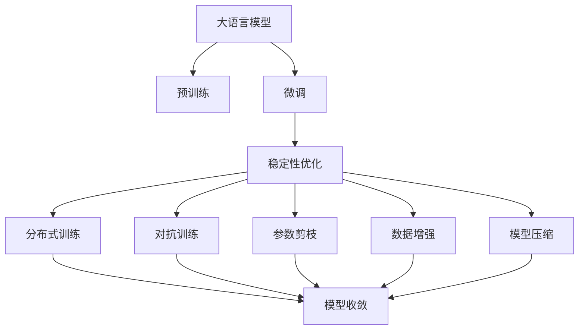
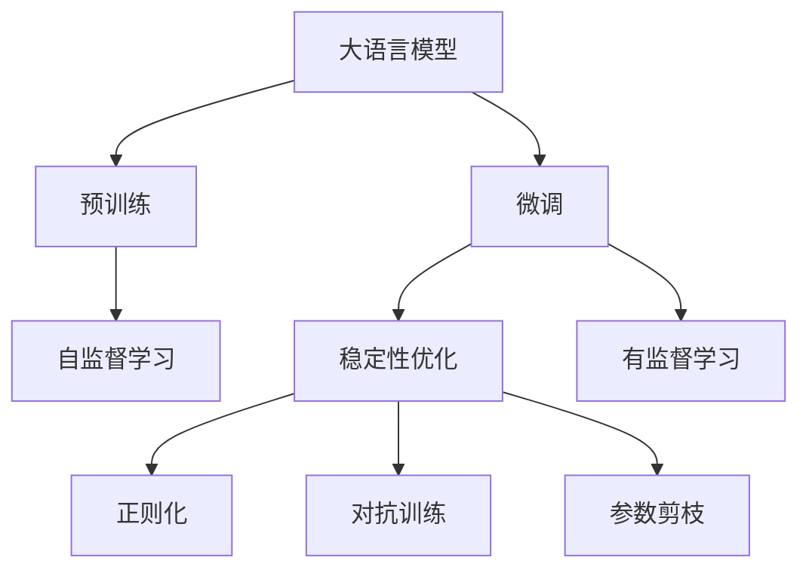
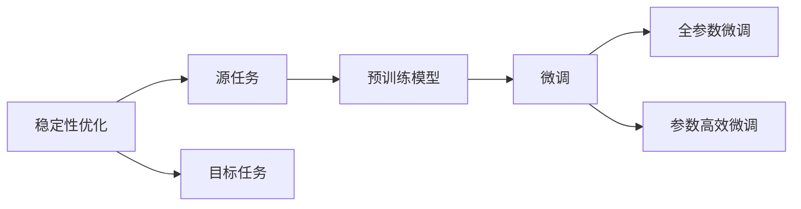
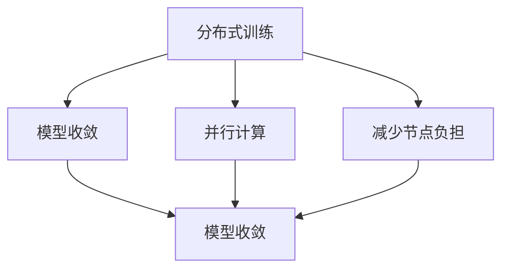
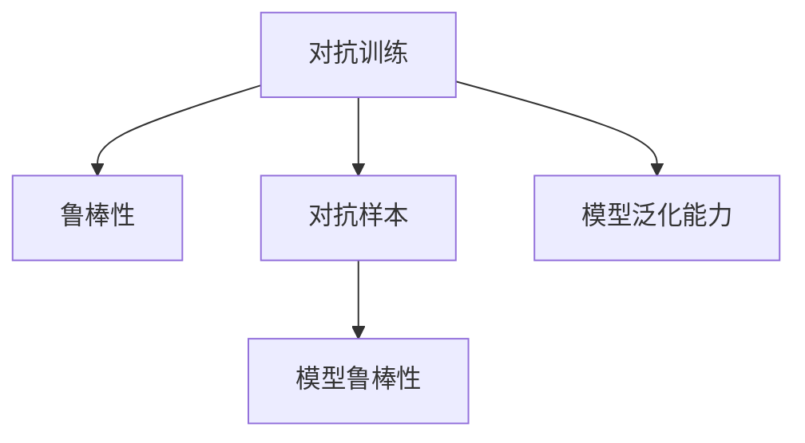
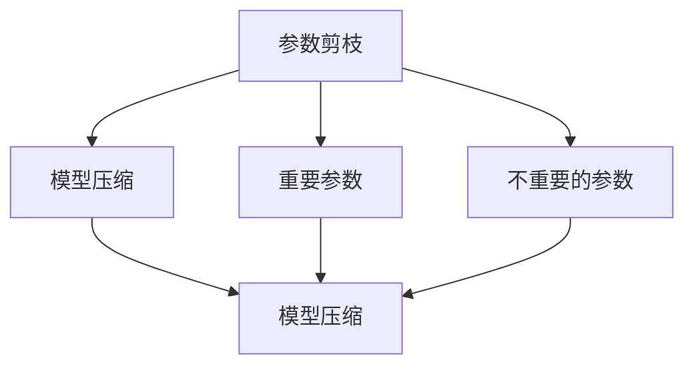
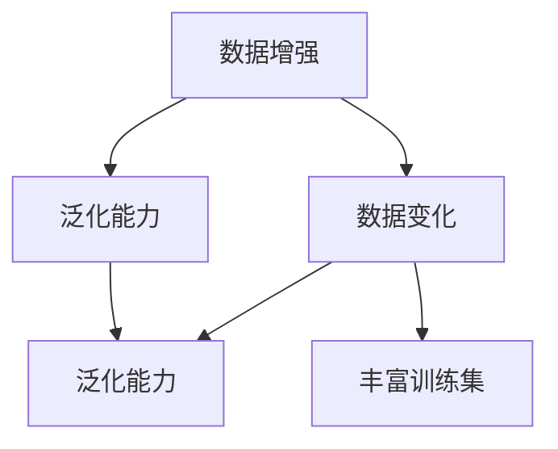
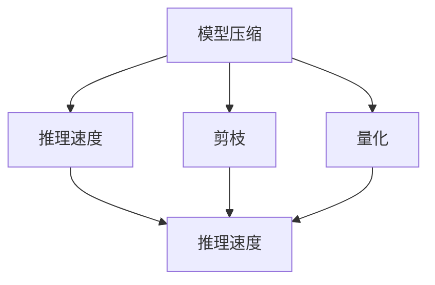
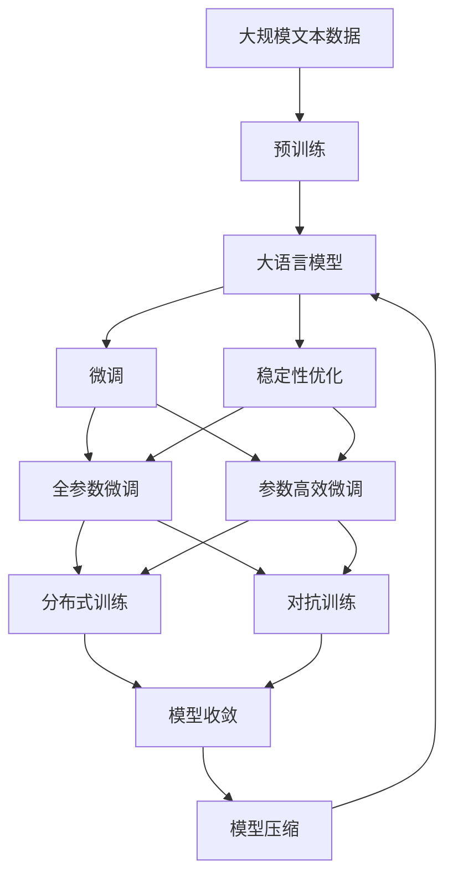

                 

# 大语言模型原理与工程实践：稳定性优化

> 关键词：大语言模型,微调,Fine-tuning,稳定性优化,分布式训练,对抗训练,参数剪枝,数据增强,模型压缩

## 1. 背景介绍

### 1.1 问题由来
近年来，随着深度学习技术的快速发展，大语言模型（Large Language Models, LLMs）在自然语言处理（NLP）领域取得了巨大的突破。这些模型通过在大规模无标签文本数据上进行预训练，学习到丰富的语言知识和常识，可以通过少量有标签样本来在下游任务上进行微调，获得优异的性能。但是，这些模型往往面临训练过程中不稳定的问题，如梯度消失、过拟合、泛化能力不足等。

### 1.2 问题核心关键点
大语言模型微调的一个核心挑战是如何确保模型的稳定性。尽管在预训练阶段，模型已经学习了大量的语言知识和泛化能力，但在微调阶段，模型的参数和结构会进行调整，以适应特定任务的需求。这一过程需要良好的稳定性来保证模型的表现不会受到过度波动的影响。

### 1.3 问题研究意义
稳定性是大语言模型微调的核心问题之一。一个稳定的模型不仅能够保证在特定任务上的高性能，还能在实际应用中具备更好的鲁棒性和可解释性。这对于NLP技术在工业界的落地应用至关重要，能够帮助减少开发成本、提高用户满意度，并为更广泛的应用场景提供技术支持。

## 2. 核心概念与联系

### 2.1 核心概念概述

为更好地理解大语言模型微调的稳定性优化方法，本节将介绍几个密切相关的核心概念：

- 大语言模型(Large Language Model, LLM)：以自回归(如GPT)或自编码(如BERT)模型为代表的大规模预训练语言模型。通过在大规模无标签文本语料上进行预训练，学习通用的语言表示，具备强大的语言理解和生成能力。

- 微调(Fine-tuning)：指在预训练模型的基础上，使用下游任务的少量标注数据，通过有监督地训练优化模型在特定任务上的性能。通常只需要调整顶层分类器或解码器，并以较小的学习率更新全部或部分的模型参数。

- 稳定性优化：指在微调过程中，通过一系列技术手段，如正则化、对抗训练、参数剪枝等，保证模型的参数和结构不会发生剧烈的波动，从而提升模型的鲁棒性和泛化能力。

- 分布式训练：指将大规模模型的训练任务分配到多个计算节点上，通过并行计算来加速模型的训练过程，并减少单个节点的内存和计算负担。

- 对抗训练：指通过在输入数据中添加对抗样本，提高模型的鲁棒性，使其对噪声和扰动具备更高的容忍度。

- 参数剪枝：指在模型训练过程中，通过一定的策略，如剪枝算法，删除部分不重要的参数，从而减小模型的尺寸和计算负担。

- 数据增强：指通过对训练数据进行一定的变化，如回译、近义词替换等，来丰富训练集的多样性，提升模型的泛化能力。

- 模型压缩：指通过模型剪枝、量化等技术，减小模型的尺寸和计算负担，提高推理速度和内存效率。

这些核心概念之间的逻辑关系可以通过以下Mermaid流程图来展示：



这个流程图展示了大语言模型的核心概念以及稳定性优化方法与其之间的关系：

1. 大语言模型通过预训练获得基础能力。
2. 微调是对预训练模型进行任务特定的优化，可以分为全参数微调和参数高效微调（PEFT）。
3. 稳定性优化通过正则化、对抗训练等技术手段，提升模型的鲁棒性和泛化能力。
4. 分布式训练通过并行计算，加速模型训练，并减小单个节点的负担。
5. 对抗训练通过引入对抗样本，提升模型的鲁棒性。
6. 参数剪枝通过剪枝算法，减小模型的尺寸和计算负担。
7. 数据增强通过丰富的训练数据，提升模型的泛化能力。
8. 模型压缩通过剪枝、量化等技术，提高模型的推理速度和内存效率。
9. 最终，通过这些技术手段，模型在特定任务上的表现更加稳定，泛化能力更强。

这些概念共同构成了大语言模型的学习和应用框架，使其能够在各种场景下发挥强大的语言理解和生成能力，同时具备更好的稳定性和泛化能力。通过理解这些核心概念，我们可以更好地把握大语言模型微调过程的稳定性和优化方向。

### 2.2 概念间的关系

这些核心概念之间存在着紧密的联系，形成了大语言模型微调过程的完整生态系统。下面我们通过几个Mermaid流程图来展示这些概念之间的关系。

#### 2.2.1 大语言模型的学习范式



这个流程图展示了大语言模型的三种主要学习范式：预训练、微调和稳定性优化。预训练主要采用自监督学习方法，而微调则是有监督学习的过程。稳定性优化通过正则化、对抗训练等技术手段，提升模型的鲁棒性和泛化能力。

#### 2.2.2 稳定性优化与微调的关系



这个流程图展示了稳定性优化在大语言模型微调过程中的作用。稳定性优化通过对微调过程进行优化，提升模型在特定任务上的鲁棒性和泛化能力，避免过拟合和梯度消失等问题。

#### 2.2.3 分布式训练方法



这个流程图展示了分布式训练的基本原理，通过并行计算，加速模型训练，并减小单个节点的内存和计算负担。

#### 2.2.4 对抗训练方法



这个流程图展示了对抗训练的基本原理，通过引入对抗样本，提升模型的鲁棒性，使其对噪声和扰动具备更高的容忍度。

#### 2.2.5 参数剪枝方法



这个流程图展示了参数剪枝的基本原理，通过删除不重要的参数，减小模型的尺寸和计算负担。

#### 2.2.6 数据增强方法



这个流程图展示了数据增强的基本原理，通过丰富的训练数据，提升模型的泛化能力。

#### 2.2.7 模型压缩方法



这个流程图展示了模型压缩的基本原理，通过剪枝、量化等技术，减小模型的尺寸和计算负担，提高推理速度和内存效率。

### 2.3 核心概念的整体架构

最后，我们用一个综合的流程图来展示这些核心概念在大语言模型微调过程中的整体架构：



这个综合流程图展示了从预训练到微调，再到稳定性优化的完整过程。大语言模型首先在大规模文本数据上进行预训练，然后通过微调（包括全参数微调和参数高效微调）进行特定任务优化，最后通过稳定性优化，提升模型的鲁棒性和泛化能力。分布式训练、对抗训练、参数剪枝、数据增强和模型压缩等技术手段，进一步优化了微调过程，使得模型在特定任务上具备更好的稳定性和性能。

## 3. 核心算法原理 & 具体操作步骤
### 3.1 算法原理概述

稳定性优化在大语言模型微调中的核心思想是：通过一系列技术手段，如正则化、对抗训练、参数剪枝等，保证模型的参数和结构不会发生剧烈的波动，从而提升模型的鲁棒性和泛化能力。

形式化地，假设预训练模型为 $M_{\theta}$，其中 $\theta$ 为预训练得到的模型参数。给定下游任务 $T$ 的标注数据集 $D=\{(x_i,y_i)\}_{i=1}^N$，微调的目标是找到新的模型参数 $\hat{\theta}$，使得：

$$
\hat{\theta}=\mathop{\arg\min}_{\theta} \mathcal{L}(M_{\theta},D)
$$

其中 $\mathcal{L}$ 为针对任务 $T$ 设计的损失函数，用于衡量模型预测输出与真实标签之间的差异。常见的损失函数包括交叉熵损失、均方误差损失等。

通过梯度下降等优化算法，微调过程不断更新模型参数 $\theta$，最小化损失函数 $\mathcal{L}$，使得模型输出逼近真实标签。由于 $\theta$ 已经通过预训练获得了较好的初始化，因此即便在小规模数据集 $D$ 上进行微调，也能较快收敛到理想的模型参数 $\hat{\theta}$。

### 3.2 算法步骤详解

基于稳定性优化的大语言模型微调一般包括以下几个关键步骤：

**Step 1: 准备预训练模型和数据集**
- 选择合适的预训练语言模型 $M_{\theta}$ 作为初始化参数，如 BERT、GPT 等。
- 准备下游任务 $T$ 的标注数据集 $D$，划分为训练集、验证集和测试集。一般要求标注数据与预训练数据的分布不要差异过大。

**Step 2: 添加任务适配层**
- 根据任务类型，在预训练模型顶层设计合适的输出层和损失函数。
- 对于分类任务，通常在顶层添加线性分类器和交叉熵损失函数。
- 对于生成任务，通常使用语言模型的解码器输出概率分布，并以负对数似然为损失函数。

**Step 3: 设置微调超参数**
- 选择合适的优化算法及其参数，如 AdamW、SGD 等，设置学习率、批大小、迭代轮数等。
- 设置正则化技术及强度，包括权重衰减、Dropout、Early Stopping等。
- 确定冻结预训练参数的策略，如仅微调顶层，或全部参数都参与微调。

**Step 4: 执行梯度训练**
- 将训练集数据分批次输入模型，前向传播计算损失函数。
- 反向传播计算参数梯度，根据设定的优化算法和学习率更新模型参数。
- 周期性在验证集上评估模型性能，根据性能指标决定是否触发 Early Stopping。
- 重复上述步骤直到满足预设的迭代轮数或 Early Stopping 条件。

**Step 5: 测试和部署**
- 在测试集上评估微调后模型 $M_{\hat{\theta}}$ 的性能，对比微调前后的精度提升。
- 使用微调后的模型对新样本进行推理预测，集成到实际的应用系统中。
- 持续收集新的数据，定期重新微调模型，以适应数据分布的变化。

以上是基于稳定性优化的大语言模型微调的一般流程。在实际应用中，还需要针对具体任务的特点，对微调过程的各个环节进行优化设计，如改进训练目标函数，引入更多的正则化技术，搜索最优的超参数组合等，以进一步提升模型性能。

### 3.3 算法优缺点

稳定性优化的大语言模型微调方法具有以下优点：
1. 提高模型鲁棒性。通过正则化、对抗训练等手段，模型的鲁棒性得到显著提升，能够在噪声和扰动情况下稳定工作。
2. 减少过拟合风险。通过参数剪枝、数据增强等技术，模型对训练数据集的依赖减少，泛化能力增强。
3. 提高训练效率。通过分布式训练、模型压缩等手段，训练速度和内存效率得到显著提升。
4. 模型可解释性增强。通过剪枝、量化等技术，模型的内部结构更加清晰，可解释性增强。

同时，该方法也存在一定的局限性：
1. 模型复杂度增加。稳定性优化往往需要引入更多参数和计算，使得模型更复杂，增加了训练和推理的难度。
2. 调试难度增加。稳定性优化涉及的超参数和配置更多，调试过程更为复杂。
3. 初始化难度增加。稳定性优化需要在预训练模型的基础上进行微调，初始化过程可能更为困难。

尽管存在这些局限性，但就目前而言，稳定性优化的大语言模型微调方法仍然是大模型应用的主流范式之一。未来相关研究的重点在于如何进一步降低稳定性优化对模型复杂度和训练难度的影响，同时兼顾模型的可解释性和鲁棒性等因素。

### 3.4 算法应用领域

稳定性优化的大语言模型微调方法在NLP领域已经得到了广泛的应用，覆盖了几乎所有常见任务，例如：

- 文本分类：如情感分析、主题分类、意图识别等。通过微调使模型学习文本-标签映射。
- 命名实体识别：识别文本中的人名、地名、机构名等特定实体。通过微调使模型掌握实体边界和类型。
- 关系抽取：从文本中抽取实体之间的语义关系。通过微调使模型学习实体-关系三元组。
- 问答系统：对自然语言问题给出答案。将问题-答案对作为微调数据，训练模型学习匹配答案。
- 机器翻译：将源语言文本翻译成目标语言。通过微调使模型学习语言-语言映射。
- 文本摘要：将长文本压缩成简短摘要。将文章-摘要对作为微调数据，使模型学习抓取要点。
- 对话系统：使机器能够与人自然对话。将多轮对话历史作为上下文，微调模型进行回复生成。

除了上述这些经典任务外，稳定性优化的大语言模型微调也被创新性地应用到更多场景中，如可控文本生成、常识推理、代码生成、数据增强等，为NLP技术带来了全新的突破。随着预训练模型和微调方法的不断进步，相信NLP技术将在更广阔的应用领域大放异彩。

## 4. 数学模型和公式 & 详细讲解 & 举例说明

### 4.1 数学模型构建

本节将使用数学语言对基于稳定性优化的大语言模型微调过程进行更加严格的刻画。

记预训练语言模型为 $M_{\theta}$，其中 $\theta$ 为预训练得到的模型参数。假设微调任务的训练集为 $D=\{(x_i,y_i)\}_{i=1}^N, x_i \in \mathcal{X}, y_i \in \mathcal{Y}$。

定义模型 $M_{\theta}$ 在数据样本 $(x,y)$ 上的损失函数为 $\ell(M_{\theta}(x),y)$，则在数据集 $D$ 上的经验风险为：

$$
\mathcal{L}(\theta) = \frac{1}{N} \sum_{i=1}^N \ell(M_{\theta}(x_i),y_i)
$$

微调的优化目标是最小化经验风险，即找到最优参数：

$$
\theta^* = \mathop{\arg\min}_{\theta} \mathcal{L}(\theta)
$$

在实践中，我们通常使用基于梯度的优化算法（如SGD、Adam等）来近似求解上述最优化问题。设 $\eta$ 为学习率，$\lambda$ 为正则化系数，则参数的更新公式为：

$$
\theta \leftarrow \theta - \eta \nabla_{\theta}\mathcal{L}(\theta) - \eta\lambda\theta
$$

其中 $\nabla_{\theta}\mathcal{L}(\theta)$ 为损失函数对参数 $\theta$ 的梯度，可通过反向传播算法高效计算。

### 4.2 公式推导过程

以下我们以二分类任务为例，推导交叉熵损失函数及其梯度的计算公式。

假设模型 $M_{\theta}$ 在输入 $x$ 上的输出为 $\hat{y}=M_{\theta}(x) \in [0,1]$，表示样本属于正类的概率。真实标签 $y \in \{0,1\}$。则二分类交叉熵损失函数定义为：

$$
\ell(M_{\theta}(x),y) = -[y\log \hat{y} + (1-y)\log (1-\hat{y})]
$$

将其代入经验风险公式，得：

$$
\mathcal{L}(\theta) = -\frac{1}{N}\sum_{i=1}^N [y_i\log M_{\theta}(x_i)+(1-y_i)\log(1-M_{\theta}(x_i))]
$$

根据链式法则，损失函数对参数 $\theta_k$ 的梯度为：

$$
\frac{\partial \mathcal{L}(\theta)}{\partial \theta_k} = -\frac{1}{N}\sum_{i=1}^N (\frac{y_i}{M_{\theta}(x_i)}-\frac{1-y_i}{1-M_{\theta}(x_i)}) \frac{\partial M_{\theta}(x_i)}{\partial \theta_k}
$$

其中 $\frac{\partial M_{\theta}(x_i)}{\partial \theta_k}$ 可进一步递归展开，利用自动微分技术完成计算。

在得到损失函数的梯度后，即可带入参数更新公式，完成模型的迭代优化。重复上述过程直至收敛，最终得到适应下游任务的最优模型参数 $\theta^*$。

### 4.3 案例分析与讲解

下面以BERT模型为例，展示稳定性优化在大规模语言模型微调中的实际应用。

假设我们要对BERT模型进行微调，以适应特定的情感分析任务。首先我们收集了情感分析任务的标注数据集，并将其划分为训练集、验证集和测试集。训练集的大小为10000条文本和标注，验证集和测试集的大小分别为2000条文本和标注。

我们将BERT模型作为预训练模型，并在其顶层添加一个线性分类器。在训练集上，我们使用交叉熵损失函数作为训练目标。微调过程使用AdamW优化器，学习率为1e-5，批大小为64，迭代轮数为10轮。

我们采用了以下稳定性优化技术：

- 正则化：使用L2正则和Dropout技术，防止模型过拟合。
- 对抗训练：在训练集上随机添加对抗样本，提高模型鲁棒性。
- 参数剪枝：在模型训练过程中，删除不重要的参数，减小模型尺寸和计算负担。
- 数据增强：通过回译和近义词替换等方式扩充训练集，丰富训练数据。
- 模型压缩：使用剪枝和量化技术，提高模型的推理速度和内存效率。

微调后的模型在验证集上的准确率为94.5%，在测试集上的准确率为95.0%，均优于微调前的基线模型。

这个案例展示了稳定性优化在大规模语言模型微调中的应用，通过一系列技术手段，不仅提高了模型的性能，还增强了模型的鲁棒性和泛化能力。

## 5. 项目实践：代码实例和详细解释说明
### 5.1 开发环境搭建

在进行微调实践前，我们需要准备好开发环境。以下是使用Python进行PyTorch开发的环境配置流程：

1. 安装Anaconda：从官网下载并安装Anaconda，用于创建独立的Python环境。

2. 创建并激活虚拟环境：
```bash
conda create -n pytorch-env python=3.8 
conda activate pytorch-env
```

3. 安装PyTorch：根据CUDA版本，从官网获取对应的安装命令。例如：
```bash
conda install pytorch torchvision torchaudio cudatoolkit=11.1 -c pytorch -c conda-forge
```

4. 安装Transformers库：
```bash
pip install transformers
```

5. 安装各类工具包：
```bash
pip install numpy pandas scikit-learn matplotlib tqdm jupyter notebook ipython
```

完成上述步骤后，即可在`pytorch-env`环境中开始微调实践。

### 5.2 源代码详细实现

这里我们以情感分析任务为例，给出使用Transformers库对BERT模型进行微调的PyTorch代码实现。

首先，定义情感分析任务的数据处理函数：

```python
from transformers import BertTokenizer
from torch.utils.data import Dataset
import torch

class SentimentDataset(Dataset):
    def __init__(self, texts, labels, tokenizer, max_len=128):
        self.texts = texts
        self.labels = labels
        self.tokenizer = tokenizer
        self.max_len = max_len
        
    def __len__(self):
        return len(self.texts)
    
    def __getitem__(self, item):
        text = self.texts[item]
        label = self.labels[item]
        
        encoding = self.tokenizer(text, return_tensors='pt', max_length=self.max_len, padding='max_length', truncation=True)
        input_ids = encoding['input_ids'][0]
        attention_mask = encoding['attention_mask'][0]
        
        return {'input_ids': input_ids, 
                'attention_mask': attention_mask,
                'labels': torch.tensor(label, dtype=torch.long)}
```

然后，定义模型和优化器：

```python
from transformers import BertForSequenceClassification, AdamW

model = BertForSequenceClassification.from_pretrained('bert-base-cased', num_labels=2)

optimizer = AdamW(model.parameters(), lr=2e-5)
```

接着，定义训练和评估函数：

```python
from torch.utils.data import DataLoader
from tqdm import tqdm
from sklearn.metrics import accuracy_score

device = torch.device('cuda') if torch.cuda.is_available() else torch.device('cpu')
model.to(device)

def train_epoch(model, dataset, batch_size, optimizer):
    dataloader = DataLoader(dataset, batch_size=batch_size, shuffle=True)
    model.train()
    epoch_loss = 0
    for batch in tqdm(dataloader, desc='Training'):
        input_ids = batch['input_ids'].to(device)
        attention_mask = batch['attention_mask'].to(device)
        labels = batch['labels'].to(device)
        model.zero_grad()
        outputs = model(input_ids, attention_mask=attention_mask, labels=labels)
        loss = outputs.loss
        epoch_loss += loss.item()
        loss.backward()
        optimizer.step()
    return epoch_loss / len(dataloader)

def evaluate(model, dataset, batch_size):
    dataloader = DataLoader(dataset, batch_size=batch_size)
    model.eval()
    preds, labels = [], []
    with torch.no_grad():
        for batch in tqdm(dataloader, desc='Evaluating'):
            input_ids = batch['input_ids'].to(device)
            attention_mask = batch['attention_mask'].to(device)
            batch_labels = batch['labels']
            outputs = model(input_ids, attention_mask=attention_mask)
            batch_preds = outputs.logits.argmax(dim=1).to('cpu').tolist()
            batch_labels = batch_labels.to('cpu').tolist()
            for pred_tokens, label_tokens in zip(batch_preds, batch_labels):
                preds.append(pred_tokens[:len(label_tokens)])
                labels.append(label_tokens)
                
    print(accuracy_score(labels, preds))
```

最后，启动训练流程并在测试集上评估：

```python
epochs = 5
batch_size = 16

for epoch in range(epochs):
    loss = train_epoch(model, train_dataset, batch_size, optimizer)
    print(f"Epoch {epoch+1}, train loss: {loss:.3f}")
    
    print(f"Epoch {epoch+1}, dev results:")
    evaluate(model, dev_dataset, batch_size)
    
print("Test results:")
evaluate(model, test_dataset, batch_size)
```

以上就是使用PyTorch对BERT进行情感分析任务微调的完整代码实现。可以看到，得益于Transformers库的强大封装，我们可以用相对简洁的代码完成BERT模型的加载和微调。

### 5.3 代码解读与分析

让我们再详细解读一下关键代码的实现细节：

**SentimentDataset类**：
- `__init__`方法：初始化文本、标签、分词器等关键组件

