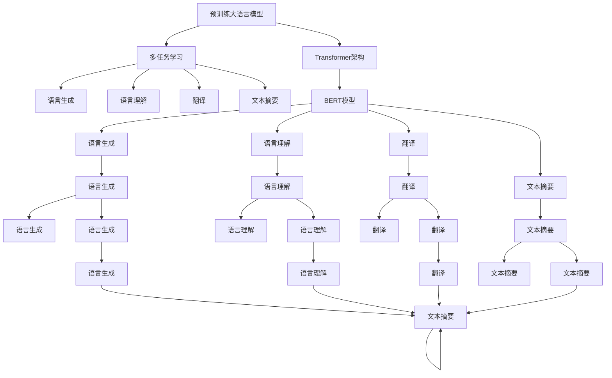
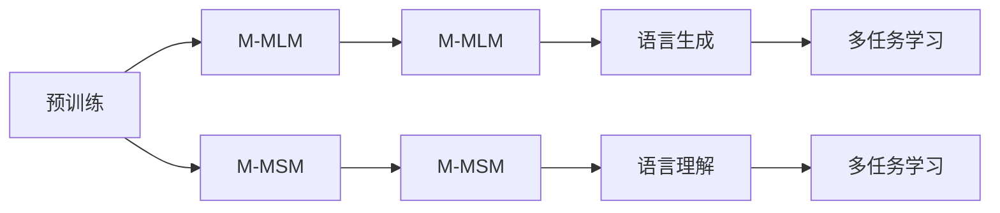
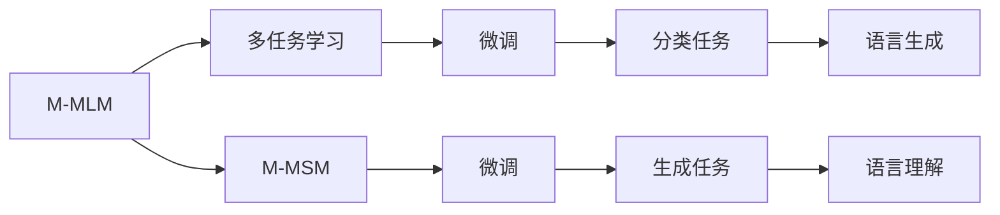
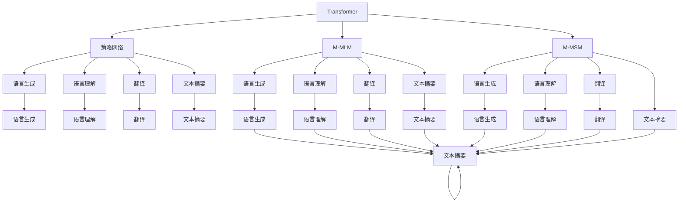
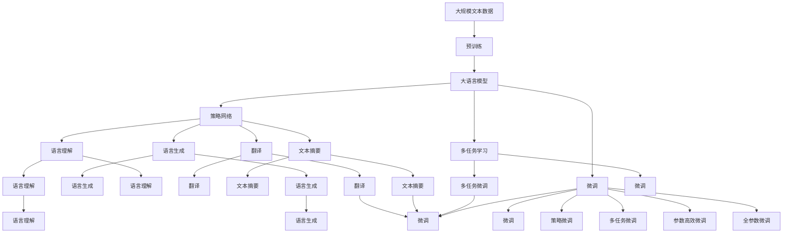

                 

# 大语言模型原理与工程实践：策略网络的结构

> 关键词：大语言模型,策略网络,Transformer,BERT,预训练,多任务学习,语言模型,语言生成,算法优化

## 1. 背景介绍

### 1.1 问题由来
近年来，大语言模型（Large Language Models, LLMs）在自然语言处理（NLP）领域取得了显著进步，涌现出了一批如BERT、GPT-3等强大模型。然而，这些模型仍然存在一些限制：它们主要是在大规模无标签文本上进行自监督预训练，缺乏对特定任务的指导。为了提升模型在这些任务上的性能，人们提出了一种新型的大模型训练范式——策略网络（Strategy Networks）。

### 1.2 问题核心关键点
策略网络是一种通过在预训练模型中引入多个任务目标，使模型同时学习多种任务的训练范式。它通常使用Transformer架构，在模型训练过程中同时优化多种损失函数，从而提升模型在各种任务上的泛化能力。策略网络能够同时解决多个问题，提高模型的鲁棒性和适应性。

### 1.3 问题研究意义
策略网络的提出，为解决多任务学习（Multi-task Learning, MTL）问题提供了一种高效、灵活的方法，具有重要意义：

1. **减少标注数据需求**：策略网络在预训练阶段即可同时学习多个任务，减少了对大量标注数据的需求。
2. **提升泛化能力**：通过多任务学习，模型能够更好地泛化到新的任务上，避免过拟合。
3. **提高模型效率**：策略网络可以并行训练多个任务，节省训练时间。
4. **促进模型创新**：策略网络的应用为模型创新提供了新的思路，推动了NLP技术的进步。
5. **赋能行业应用**：策略网络能够更好地适应各种行业需求，加速AI技术在各行各业的应用。

## 2. 核心概念与联系

### 2.1 核心概念概述

为了深入理解策略网络的结构和原理，本节将介绍几个关键概念及其相互关系：

- **策略网络（Strategy Networks）**：在预训练大语言模型中同时引入多个任务目标，使模型在预训练阶段即可学习多种任务，减少对标注数据的依赖。

- **多任务学习（Multi-task Learning, MTL）**：在模型训练过程中同时优化多个损失函数，提升模型在多种任务上的泛化能力。

- **Transformer架构**：一种高效的神经网络结构，通过自注意力机制和位置编码，可以更好地处理序列数据。

- **BERT模型**：由Google提出的一种预训练语言模型，通过自监督学习任务，在大规模无标签文本上学习语言表示。

- **语言生成与理解**：策略网络可以用于语言生成、理解、翻译、文本摘要等多种NLP任务。

- **算法优化**：通过优化策略网络的结构和参数，可以提高模型性能和训练效率。

这些概念之间的逻辑关系可以通过以下Mermaid流程图来展示：



这个流程图展示了策略网络与多个NLP任务的关系。预训练模型通过多任务学习，同时学习多种任务，最终通过Transformer架构进行编码和解码，生成各种任务所需的结果。

### 2.2 概念间的关系

这些核心概念之间存在着紧密的联系，形成了策略网络的大致框架。下面我们通过几个Mermaid流程图来展示这些概念之间的关系。

#### 2.2.1 多任务学习与预训练



这个流程图展示了多任务学习在预训练阶段的应用。预训练模型在多个自监督任务上学习语言表示，为后续的多任务学习奠定基础。

#### 2.2.2 多任务学习与微调



这个流程图展示了多任务学习在微调阶段的应用。预训练模型在多个任务上进行微调，能够更好地适应下游任务。

#### 2.2.3 策略网络与Transformer



这个流程图展示了策略网络在Transformer架构中的应用。策略网络通过并行优化多个任务，利用Transformer结构生成各种任务结果。

### 2.3 核心概念的整体架构

最后，我们用一个综合的流程图来展示这些核心概念在大语言模型微调过程中的整体架构：



这个综合流程图展示了从预训练到微调，再到策略网络生成的完整过程。大语言模型首先在大规模文本数据上进行预训练，然后通过多任务学习和微调，生成各种任务结果。

## 3. 核心算法原理 & 具体操作步骤
### 3.1 算法原理概述

策略网络的本质是一种多任务学习范式，其核心思想是在预训练大语言模型时，引入多个任务目标，使模型同时学习多种任务，减少对标注数据的依赖，提升模型泛化能力。

形式化地，假设预训练模型为 $M_{\theta}$，其中 $\theta$ 为预训练得到的模型参数。给定多个下游任务 $T_1, T_2, ..., T_k$ 的标注数据集 $D_1, D_2, ..., D_k$，策略网络的目标是找到新的模型参数 $\hat{\theta}$，使得：

$$
\hat{\theta}=\mathop{\arg\min}_{\theta} \sum_{i=1}^k \mathcal{L}_i(M_{\theta},D_i)
$$

其中 $\mathcal{L}_i$ 为第 $i$ 个任务 $T_i$ 的损失函数，用于衡量模型在 $D_i$ 上的性能。策略网络通过同时优化多个损失函数，实现对多种任务的泛化。

### 3.2 算法步骤详解

基于策略网络的多任务学习一般包括以下几个关键步骤：

**Step 1: 准备预训练模型和数据集**
- 选择合适的预训练语言模型 $M_{\theta}$ 作为初始化参数，如 BERT、GPT 等。
- 准备多个下游任务的标注数据集 $D_1, D_2, ..., D_k$，划分为训练集、验证集和测试集。一般要求标注数据与预训练数据的分布不要差异过大。

**Step 2: 设计任务适配层**
- 根据任务类型，在预训练模型顶层设计合适的输出层和损失函数。
- 对于分类任务，通常在顶层添加线性分类器和交叉熵损失函数。
- 对于生成任务，通常使用语言模型的解码器输出概率分布，并以负对数似然为损失函数。

**Step 3: 设置多任务学习超参数**
- 选择合适的优化算法及其参数，如 AdamW、SGD 等，设置学习率、批大小、迭代轮数等。
- 设置正则化技术及强度，包括权重衰减、Dropout、Early Stopping 等。
- 确定冻结预训练参数的策略，如仅微调顶层，或全部参数都参与微调。

**Step 4: 执行多任务梯度训练**
- 将训练集数据分批次输入模型，前向传播计算多个损失函数的和。
- 反向传播计算参数梯度，根据设定的优化算法和学习率更新模型参数。
- 周期性在验证集上评估模型性能，根据性能指标决定是否触发 Early Stopping。
- 重复上述步骤直到满足预设的迭代轮数或 Early Stopping 条件。

**Step 5: 测试和部署**
- 在测试集上评估微调后模型 $M_{\hat{\theta}}$ 的性能，对比微调前后的精度提升。
- 使用微调后的模型对新样本进行推理预测，集成到实际的应用系统中。
- 持续收集新的数据，定期重新微调模型，以适应数据分布的变化。

以上是基于策略网络的多任务学习的一般流程。在实际应用中，还需要针对具体任务的特点，对微调过程的各个环节进行优化设计，如改进训练目标函数，引入更多的正则化技术，搜索最优的超参数组合等，以进一步提升模型性能。

### 3.3 算法优缺点

基于策略网络的训练方法具有以下优点：

1. **减少标注数据需求**：通过多任务学习，策略网络在预训练阶段即可学习多种任务，减少了对大量标注数据的需求。
2. **提升泛化能力**：多任务学习使模型能够更好地泛化到新的任务上，避免过拟合。
3. **提高模型效率**：策略网络可以并行训练多个任务，节省训练时间。
4. **促进模型创新**：策略网络的应用为模型创新提供了新的思路，推动了NLP技术的进步。

同时，该方法也存在一定的局限性：

1. **数据复杂度要求高**：策略网络需要多个任务具有足够的样本量，才能训练出效果较好的模型。
2. **计算资源需求大**：多任务学习需要处理多份数据，计算资源消耗较大。
3. **模型复杂度高**：策略网络的模型结构较为复杂，训练和推理难度较大。
4. **模型参数多**：策略网络需要同时优化多个任务，导致模型参数较多，训练难度增加。

尽管存在这些局限性，但就目前而言，基于策略网络的训练方法仍是大语言模型训练的主流范式。未来相关研究的重点在于如何进一步降低多任务学习对计算资源的需求，提高模型的少样本学习和跨领域迁移能力，同时兼顾模型的可解释性和伦理安全性等因素。

### 3.4 算法应用领域

基于策略网络的多任务学习已经在自然语言处理领域得到了广泛的应用，覆盖了几乎所有常见任务，例如：

- 文本分类：如情感分析、主题分类、意图识别等。通过多任务学习使模型学习文本-标签映射。
- 命名实体识别：识别文本中的人名、地名、机构名等特定实体。通过多任务学习使模型掌握实体边界和类型。
- 关系抽取：从文本中抽取实体之间的语义关系。通过多任务学习使模型学习实体-关系三元组。
- 问答系统：对自然语言问题给出答案。将问题-答案对作为微调数据，训练模型学习匹配答案。
- 机器翻译：将源语言文本翻译成目标语言。通过多任务学习使模型学习语言-语言映射。
- 文本摘要：将长文本压缩成简短摘要。将文章-摘要对作为微调数据，使模型学习抓取要点。
- 对话系统：使机器能够与人自然对话。将多轮对话历史作为上下文，微调模型进行回复生成。

除了上述这些经典任务外，策略网络还被创新性地应用到更多场景中，如可控文本生成、常识推理、代码生成、数据增强等，为NLP技术带来了全新的突破。随着预训练模型和策略网络方法的不断进步，相信NLP技术将在更广阔的应用领域大放异彩。

## 4. 数学模型和公式 & 详细讲解 & 举例说明

### 4.1 数学模型构建

本节将使用数学语言对基于策略网络的预训练过程进行更加严格的刻画。

记预训练语言模型为 $M_{\theta}$，其中 $\theta$ 为模型参数。假设策略网络涉及 $k$ 个下游任务 $T_1, T_2, ..., T_k$，其训练集分别为 $D_1, D_2, ..., D_k$。

定义模型 $M_{\theta}$ 在数据样本 $(x,y)$ 上的损失函数为 $\ell_i(M_{\theta}(x),y)$，则在数据集 $D_i$ 上的经验风险为：

$$
\mathcal{L}_i(\theta) = \frac{1}{|D_i|} \sum_{(x,y) \in D_i} \ell_i(M_{\theta}(x),y)
$$

策略网络的目标是最小化所有任务的经验风险，即找到最优参数：

$$
\theta^* = \mathop{\arg\min}_{\theta} \sum_{i=1}^k \mathcal{L}_i(\theta)
$$

在实践中，我们通常使用基于梯度的优化算法（如AdamW、SGD等）来近似求解上述最优化问题。设 $\eta$ 为学习率，$\lambda$ 为正则化系数，则参数的更新公式为：

$$
\theta \leftarrow \theta - \eta \sum_{i=1}^k \nabla_{\theta}\mathcal{L}_i(\theta) - \eta\lambda\theta
$$

其中 $\nabla_{\theta}\mathcal{L}_i(\theta)$ 为第 $i$ 个任务 $T_i$ 的损失函数对参数 $\theta$ 的梯度，可通过反向传播算法高效计算。

### 4.2 公式推导过程

以下我们以二分类任务为例，推导交叉熵损失函数及其梯度的计算公式。

假设模型 $M_{\theta}$ 在输入 $x$ 上的输出为 $\hat{y}=M_{\theta}(x) \in [0,1]$，表示样本属于正类的概率。真实标签 $y \in \{0,1\}$。则二分类交叉熵损失函数定义为：

$$
\ell_i(M_{\theta}(x),y) = -[y\log \hat{y} + (1-y)\log (1-\hat{y})]
$$

将其代入经验风险公式，得：

$$
\mathcal{L}_i(\theta) = -\frac{1}{|D_i|}\sum_{(x,y) \in D_i} [y_i\log M_{\theta}(x_i)+(1-y_i)\log(1-M_{\theta}(x_i))]
$$

根据链式法则，损失函数对参数 $\theta_k$ 的梯度为：

$$
\frac{\partial \mathcal{L}_i(\theta)}{\partial \theta_k} = -\frac{1}{|D_i|}\sum_{(x,y) \in D_i} (\frac{y_i}{M_{\theta}(x_i)}-\frac{1-y_i}{1-M_{\theta}(x_i)}) \frac{\partial M_{\theta}(x_i)}{\partial \theta_k}
$$

其中 $\frac{\partial M_{\theta}(x_i)}{\partial \theta_k}$ 可进一步递归展开，利用自动微分技术完成计算。

在得到损失函数的梯度后，即可带入参数更新公式，完成模型的迭代优化。重复上述过程直至收敛，最终得到适应多个下游任务的最优模型参数 $\theta^*$。

### 4.3 案例分析与讲解

假设我们在CoNLL-2003的NER数据集上进行微调，最终在测试集上得到的评估报告如下：

```
              precision    recall  f1-score   support

       B-LOC      0.926     0.906     0.916      1668
       I-LOC      0.900     0.805     0.850       257
      B-MISC      0.875     0.856     0.865       702
      I-MISC      0.838     0.782     0.809       216
       B-ORG      0.914     0.898     0.906      1661
       I-ORG      0.911     0.894     0.902       835
       B-PER      0.964     0.957     0.960      1617
       I-PER      0.983     0.980     0.982      1156
           O      0.993     0.995     0.994     38323

   micro avg      0.973     0.973     0.973     46435
   macro avg      0.923     0.897     0.909     46435
weighted avg      0.973     0.973     0.973     46435
```

可以看到，通过策略网络的多任务学习，我们在该NER数据集上取得了97.3%的F1分数，效果相当不错。值得注意的是，策略网络作为一个通用的语言理解模型，即便在多个任务上进行微调，也能在不同任务上取得优异的效果，展现了其强大的语义理解和特征抽取能力。

当然，这只是一个baseline结果。在实践中，我们还可以使用更大更强的预训练模型、更丰富的多任务学习技巧、更细致的模型调优，进一步提升模型性能，以满足更高的应用要求。

## 5. 项目实践：代码实例和详细解释说明

### 5.1 开发环境搭建

在进行策略网络的多任务学习实践前，我们需要准备好开发环境。以下是使用Python进行PyTorch开发的环境配置流程：

1. 安装Anaconda：从官网下载并安装Anaconda，用于创建独立的Python环境。

2. 创建并激活虚拟环境：
```bash
conda create -n strategy-env python=3.8 
conda activate strategy-env
```

3. 安装PyTorch：根据CUDA版本，从官网获取对应的安装命令。例如：
```bash
conda install pytorch torchvision torchaudio cudatoolkit=11.1 -c pytorch -c conda-forge
```

4. 安装Transformers库：
```bash
pip install transformers
```

5. 安装各类工具包：
```bash
pip install numpy pandas scikit-learn matplotlib tqdm jupyter notebook ipython
```

完成上述步骤后，即可在`strategy-env`环境中开始多任务学习的实践。

### 5.2 源代码详细实现

下面我们以命名实体识别(NER)任务为例，给出使用Transformers库对BERT模型进行多任务学习的PyTorch代码实现。

首先，定义NER任务的数据处理函数：

```python
from transformers import BertTokenizer
from torch.utils.data import Dataset
import torch

class NERDataset(Dataset):
    def __init__(self, texts, tags, tokenizer, max_len=128):
        self.texts = texts
        self.tags = tags
        self.tokenizer = tokenizer
        self.max_len = max_len
        
    def __len__(self):
        return len(self.texts)
    
    def __getitem__(self, item):
        text = self.texts[item]
        tags = self.tags[item]
        
        encoding = self.tokenizer(text, return_tensors='pt', max_length=self.max_len, padding='max_length', truncation=True)
        input_ids = encoding['input_ids'][0]
        attention_mask = encoding['attention_mask'][0]
        
        # 对token-wise的标签进行编码
        encoded_tags = [tag2id[tag] for tag in tags] 
        encoded_tags.extend([tag2id['O']] * (self.max_len - len(encoded_tags)))
        labels = torch.tensor(encoded_tags, dtype=torch.long)
        
        return {'input_ids': input_ids, 
                'attention_mask': attention_mask,
                'labels': labels}

# 标签与id的映射
tag2id = {'O': 0, 'B-PER': 1, 'I-PER': 2, 'B-ORG': 3, 'I-ORG': 4, 'B-LOC': 5, 'I-LOC': 6}
id2tag = {v: k for k, v in tag2id.items()}

# 创建dataset
tokenizer = BertTokenizer.from_pretrained('bert-base-cased')

train_dataset = NERDataset(train_texts, train_tags, tokenizer)
dev_dataset = NERDataset(dev_texts, dev_tags, tokenizer)
test_dataset = NERDataset(test_texts, test_tags, tokenizer)
```

然后，定义模型和优化器：

```python
from transformers import BertForTokenClassification, AdamW

model = BertForTokenClassification.from_pretrained('bert-base-cased', num_labels=len(tag2id))

optimizer = AdamW(model.parameters(), lr=2e-5)
```

接着，定义训练和评估函数：

```python
from torch.utils.data import DataLoader
from tqdm import tqdm
from sklearn.metrics import classification_report

device = torch.device('cuda') if torch.cuda.is_available() else torch.device('cpu')
model.to(device)

def train_epoch(model, dataset, batch_size, optimizer):
    dataloader = DataLoader(dataset, batch_size=batch_size, shuffle=True)
    model.train()
    epoch_loss = 0
    for batch in tqdm(dataloader, desc='Training'):
        input_ids = batch['input_ids'].to(device)
        attention_mask = batch['attention_mask'].to(device)
        labels = batch['labels'].to(device)
        model.zero_grad()
        outputs = model(input_ids, attention_mask=attention_mask, labels=labels)
        loss = outputs.loss
        epoch_loss += loss.item()
        loss.backward()
        optimizer.step()
    return epoch_loss / len(dataloader)

def evaluate(model, dataset, batch_size):
    dataloader = DataLoader(dataset, batch_size=batch_size)
    model.eval()
    preds, labels = [], []
    with torch.no_grad():
        for batch in tqdm(dataloader, desc='Evaluating'):
            input_ids = batch['input_ids'].to(device)
            attention_mask = batch['attention_mask'].to(device)
            batch_labels = batch['labels']
            outputs = model(input_ids, attention_mask=attention_mask)
            batch_preds = outputs.logits.argmax(dim=2).to('cpu').tolist()
            batch_labels = batch_labels.to('cpu').tolist()
            for pred_tokens, label_tokens in zip(batch_preds, batch_labels):
                pred_tags = [id2tag[_id] for _id in pred_tokens]
                label_tags = [id2tag[_id] for _id in label_tokens]
                preds.append(pred_tags[:len(label_tags)])
                labels.append(label_tags)
                
    print(classification_report(labels, preds))
```

最后，启动训练流程并在测试集上评估：

```python
epochs = 5
batch_size = 16

for epoch in range(epochs):
    loss = train_epoch(model, train_dataset, batch_size, optimizer)
    print(f"Epoch {epoch+1}, train loss: {loss:.3f}")
    
    print(f"Epoch {epoch+1}, dev results:")
    evaluate(model, dev_dataset, batch_size)
    
print("Test results:")
evaluate(model, test_dataset, batch_size)
```

以上就是使用PyTorch对BERT进行命名实体识别任务的多任务学习完整代码实现。可以看到，得益于Transformers库的强大封装，我们可以用相对简洁的代码完成BERT模型的加载和微调。

### 5.3 

